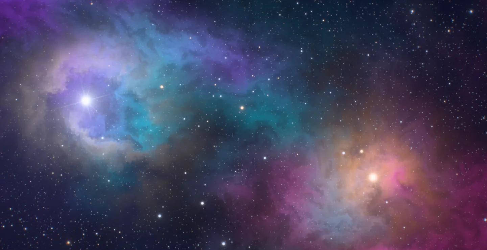
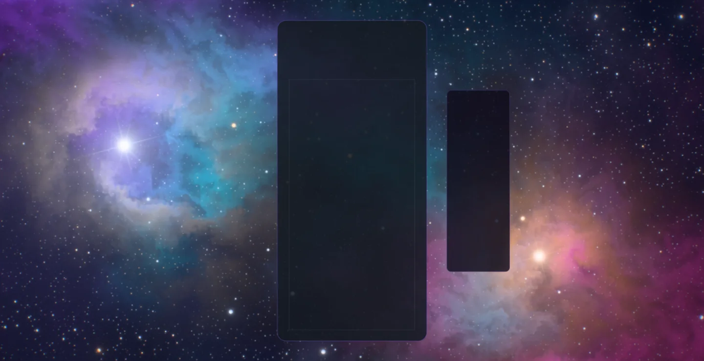
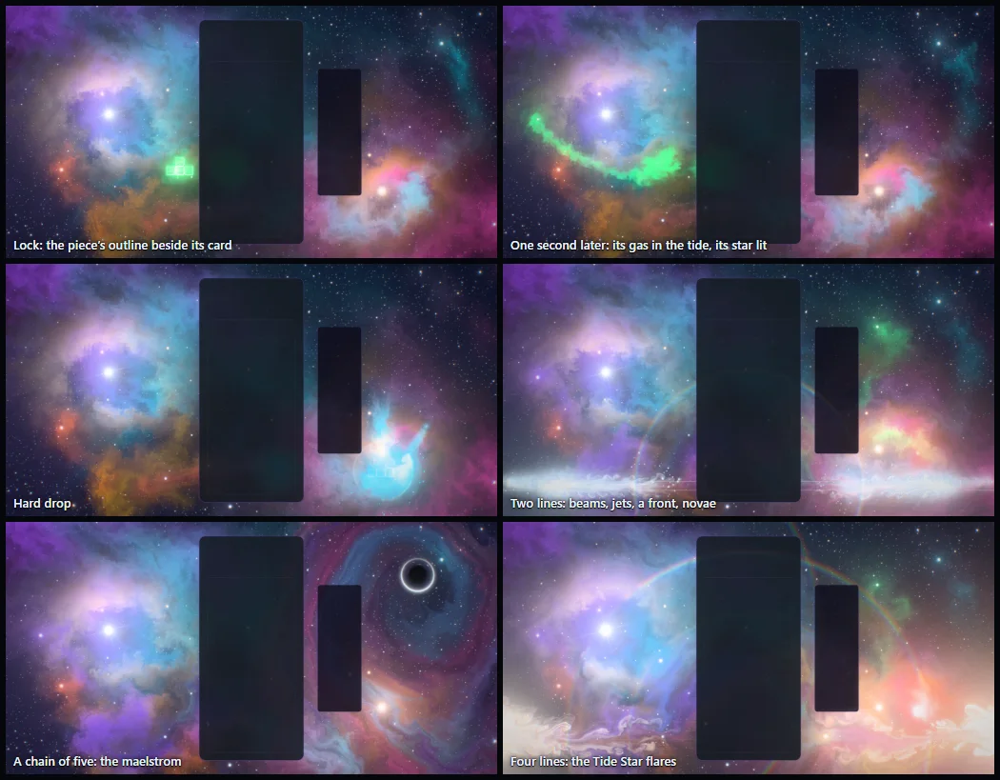
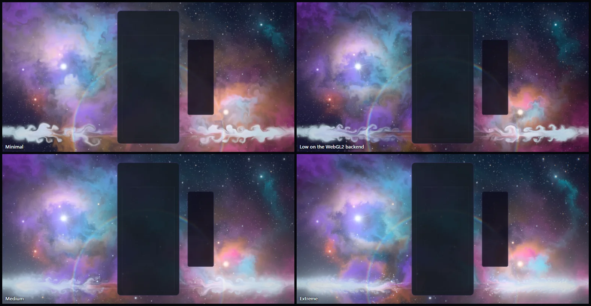
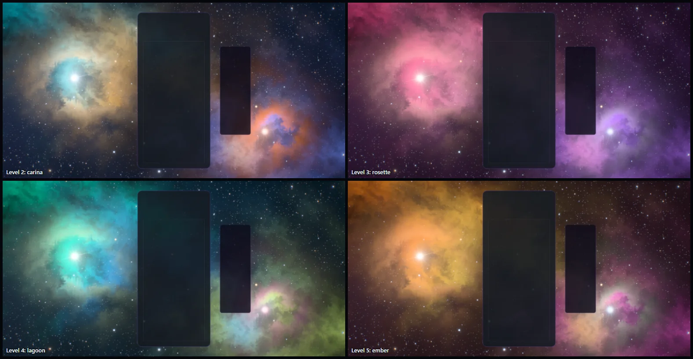
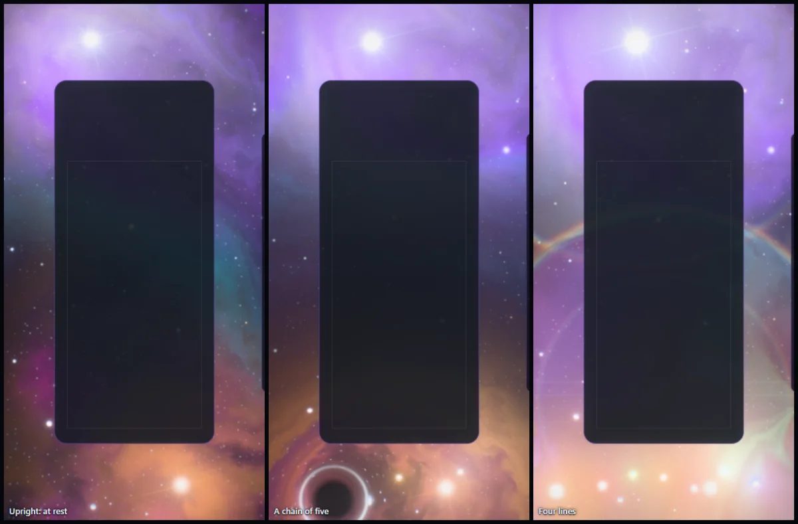

# Aether Tides — the living nebula

Implemented 2026-10-08 on `feature/aether-tides-masterpiece`, with Three.js 0.186.1. A
from-scratch rebuild: it replaces the earlier theme in full (a raw-WebGL fluid simulator with
its own GLSL, a CSS star field behind it, and effects fired at the middle of the screen from
timers). Aether Tides keeps its identity — a nebula that is a real fluid, stardust where a
piece locks, a blast when lines clear, a well of gravity when a chain builds — and everything
else is new. This document records the shipped design and what was verified. It is a
reference, not a backlog.

## The picture

Deep space. A river of glowing gas crosses the frame behind the gameplay card, from the upper
left to the lower right: violet where it enters, cyan through the middle, magenta where it
leaves, threaded with dark lanes of dust. The Tide Star, blue-white with six diffraction
spikes, stands in the upper left; its amber companion stands in the lower right. Each wanders
a slow loop, so the light on the gas and the shadows behind the dust are never still. The two
corners the river does not cross are open sky, three depths of stars deep.

Nothing in the picture is painted. The gas and the dust are carried by an incompressible
fluid, solved every frame, and what the eye reads as cloud is that fluid lit by the two stars.

The gameplay card covers the middle of the frame, so the picture is built for what stays
visible: a star and its lit gas on either side, the river passing behind the glass, the dark
corners for the events to light.

## The one idea

The nebula is a tide, and the board is what moves it. Every piece that locks pours its own
colour and shape into the fluid and lights a star; every clear sets that tide off.

## Event language

| Event | Response |
| --- | --- |
| Piece lock | The piece's own footprint appears beside its card, at the piece's own height: first as a crisp outline of its cells, lit for a third of a second, and under it as gas in the piece's colour poured into the fluid. The gas stands for a fifth of a second, then the tide takes it and tears it into filaments. A spark leaves it on a bowed path, dragging a wake through the nebula, and opens as a star in that colour in the open sky on that side. A thin front runs out from the echo, and a handful of stardust. The star burns for most of a minute and tints the gas round it, so the sky slowly fills with the colours of the pieces played. |
| Hard drop | The same, slammed down from above: a streak of the colour falls into the echo, more gas, a harder push, a wider front, more stardust, a kick of the lens. |
| Line clear | Each cleared row leaves the card as a blade of light and a jet, one out of each side at the row's own height; the jets drag the gas with them and roll up into eddies. A blast front runs out from the board, shouldering the gas aside and leaving it glowing, and the gas behind the card wells up and out. Every star the board has lit goes nova as the front reaches it, one after another across the sky. Three lines send a second front. |
| Combo | The maelstrom opens in the dark corner of the sky (upper right) on the second clear of a chain and deepens with every step: the flow converges on it and turns round it, the light behind it bends, a bright ring stands where the bent light piles up. Each step draws two or three arms of gas in from far off, the first in the colour of the piece that made it, and a front runs inward. The whole tide quickens with the chain. When the chain breaks the maelstrom lets go: a front, two jets along its axis, stardust. |
| Four lines / perfect clear | The nebula holds its breath: everything sinks for a quarter of a second. Then the Tide Star itself flares, sends its own front across the frame and scatters stardust, and the clear fires in starfire gold. A perfect clear wells up more than twice as hard. |
| T-spin | The whole tide turns about the board. |
| Level up | The nebula changes colours: five palettes, cycled (aether, carina, rosette, lagoon, ember). The stars change at once; the gas heals into the new colours over a few seconds. |

Combo here is the true consecutive-clear combo (one `ComboTracker` per player in
`AetherTidesDirector`); the bus's `COMBO` event is cascade depth (ADR-0011). With several
boards on screen each lock leaves its own card, and the maelstrom opens to the longest chain
any board is holding.

## How it is built

| File | Role |
| --- | --- |
| `aether-tides-core.js` | Three-free constants and maths: the event table's layout, timings, the five palettes, where the two stars and the maelstrom stand for an aspect ratio. |
| `aether-tides-events.js` | Three-free: the fluid's event table (splats, blast fronts, wells, stars, gyres) and its slot bookkeeping. |
| `aether-tides-tsl.js` | Hashes and the one baked noise texture. |
| `aether-tides-fluid.js` | The solver: velocity, divergence, pressure, projection, dye and the woven coordinates, as full-screen passes into half-float targets. |
| `aether-tides-field.js` | The resting nebula: the shape the gas and the dust heal back to. |
| `aether-tides-light.js` | The two stars' shadows (carried light) and the glow of the stars the board has lit, on the fluid's own grid. |
| `aether-tides-nebula.js` | The picture: one full-screen triangle that turns the fluid into a lit nebula over a deep sky, with the blast fronts and the maelstrom's lens. |
| `aether-tides-stars.js` | The Tide Star, its companion, and one star per lock, with their sparks and novae. |
| `aether-tides-fx.js` | Stardust, row beams and the outline of a locking piece's cells. |
| `aether-tides-world.js` | Owns the uniforms, the parts and the choreography. Shared with the playground effect, so what is iterated there ships. |
| `aether-tides-director.js` | Renderer-free: stages bus events per player and resolves one lock and one clear per frame, with the piece's cells. |
| `aether-tides-composition.js` | Three-free: reads the live card, board and HUD rects, and decides where a piece's echo goes. |
| `aether-tides-post.js` | One scene pass, bloom, and one output pass. |
| `aether-tides-quality.js` | The six tiers. |
| `aether-tides-theme.js` | Lifecycle, renderer selection, settings, layout watch, GPU-loss recovery, capture flags. |

Techniques worth knowing before changing it:

- **One node renderer on both backends.** `WebGPURenderer` on WebGPU, its WebGL2 backend
  otherwise (or `?forceWebGL`). The solver is render passes into `RGBA16F` targets, not
  compute, so the same code runs on both. There is no `ShaderMaterial` and no raw WebGL left.
- **Tide space.** Everything is laid out in one coordinate system: the screen with its centre
  at the origin, x right, y down, one unit = half the screen's height. The fluid's grid covers
  the screen plus a 14% margin that holds the open boundary. Velocity is in tide units per
  second.
- **The solver.** Semi-Lagrangian advection, vorticity confinement, a pressure projection, a
  fixed 60 Hz step. Each pressure pass is two Jacobi sweeps folded into one 13-point stencil,
  and the right-hand side travels in the pressure target's second channel, so a step is about
  thirteen small passes. The gas's heat rides in the velocity target's third channel.
- **Radial pushes are prescribed divergence.** An incompressible fluid cancels any force that
  is the gradient of something, and a radially symmetric push is exactly that. So a blast
  front, a well and a spring are written into the divergence the projection must leave behind
  (a front is a band of outward flow `u(r) = push · e^(−x²)`; its divergence is `u′ + u/r`),
  and the pressure solve turns them into flow. Only the ragged part of a front is a plain
  force, and that is what leaves eddies in its wake.
- **The boundary is open.** Pressure is held at zero on the domain's edge, so gas crosses it. A
  well or a spring has net divergence, which has no solution in a closed box: the pressure then
  climbs every step until half floats can no longer hold its gradient (it emptied the whole
  nebula in an early capture).
- **A steady push settles at push / drag.** The drag that makes the gyres the resting flow is
  0.32 per second, so a constant swirl of 0.5 becomes a unit and a half a second. An early
  build used 7.5 and whipped the nebula into grey whirlpools.
- **Nothing is created at event time.** An event writes numbers into a slot of one table of
  `vec4` rows (one uniform buffer; a stage may bind twelve). The solver's passes and the
  picture's shaders evaluate every slot in closed form from the fluid's clock: where a moving
  source is on its bowed path, how far a front has run, whether a star has gone nova. Splats
  and fronts are packed live-first, and the shaders loop only over what is in flight.
- **The picture runs at the display's rate.** Between two steps the fluid is extrapolated along
  its own velocity, and every sprite and front reads the same clock (last step plus remainder),
  so a 144 Hz display is smooth over a 60 Hz solver and a slow frame drops simulated time
  instead of owing it.
- **Fine grain that flows.** Two sets of texture coordinates are carried along the flow (stored
  as offsets, which half floats hold precisely). The picture reads its fine noise through them,
  so the grain is stretched and folded by the same flow as the gas; each set is reset in turn
  while it is faded out. That is what gives the gas filaments finer than the dye's own
  resolution.
- **Carried light.** A cell does not march to the star. It looks a few cells toward it, gathers
  the dust and gas on the way, and takes over what the cell at the far end already knew last
  frame. Shadows cross the whole frame for a handful of taps, soften with distance by
  themselves, and run out from a moving cloud at a finite speed.
- **An emission nebula, not a lit cloud.** Starlight makes the gas glow harder in its own
  colour; only the dust throws the star's colour back. That keeps the palette saturated where
  the light is strongest instead of washing it white.
- **The echo is the piece.** `placeEcho` moves the piece's footprint straight out of its card
  into open sky: the preferred side, the other side, then above or below, stepping past the
  HUD or a neighbouring board when the footprint cannot sit before it.
- **HDR, single output.** The scene is scene-linear; a max-channel knee selects what blooms (no
  MRT), and one output pass does the lens fringe, the calm zones on the card and HUD, bloom, a
  hue-preserving filmic curve, grade, vignette, grain and dither. An iris closes as the nebula
  flares so its colours survive the surge. `usesMrtScenePass()` is false.
- **No MaterialX noise.** One tileable fBm texture is baked on the CPU with its own mip chain.
- **A device that cannot draw into half-float targets** (a WebGL2 context without
  `EXT_color_buffer_float` or `EXT_color_buffer_half_float`) gets no solver: the clock and the
  event table still run, the resting nebula is drawn as it stands, and every sprite, beam, front
  and star still fires. `supportsFloatTargets` decides; `?noFluid=1` forces it in the playground.

## Tiers

| Tier | Fluid grid (16:9) | Dye rows | Pressure passes | Shadow taps | Star depths | Underglow | Stardust | Bloom |
| --- | --- | ---: | ---: | ---: | ---: | --- | ---: | --- |
| Minimal | about 126 × 71 | 216 | 4 | none | 2 | off | 96 | off |
| Low | about 169 × 95 | 324 | 5 | 10 | 2 | off | 192 | off |
| Medium | about 215 × 121 | 432 | 6 | 14 | 3 | on | 384 | on |
| High | about 267 × 150 | 576 | 8 | 18 | 3 | on | 640 | on |
| Ultra | about 315 × 177 | 720 | 9 | 22 | 3 | on | 900 | on |
| Extreme | about 368 × 207 | 900 | 10 | 26 | 3 | on | 1,200 | on |

Every tier keeps the whole picture and every event. These are allocation budgets, not
measurements of frame rate.

## Assets

None. The fluid, the noise, the stars and the sprites are generated in code; no texture or
model is loaded, and Blender was not needed: there is no solid object in the picture.

## Verification

- Unit tests: 157 new tests in four files (director 27; composition, core maths and the event
  table 39; world 45; theme 46). The world tests run the real world, solver and light against a
  stand-in renderer that records every pass, including the no-solver fallback.
  `src/utils/webgl/aether-tides-simulator.js` went with the old theme; nothing else imported it.
- Whole suite, run once on a machine other sessions kept under load: 689 files, 9,185 tests; 680
  files passed. The 9 that did not (9 tests) are in files this change does not touch or import.
  Eight are test timeouts and time budgets (Odyssey forest and world bakes, the benchmark chain
  policy, Stellar Drift, the wire source contract, the URL parameter catalog); all eight files
  pass when run on their own with long timeouts (95 tests). The ninth
  (`odyssey-level-briefing`, a thousands separator) depends on the machine's locale and fails
  the same way on `main` (182ebd19) on this machine. After the last shader edit the Aether Tides
  tests and every suite that shares a theme list with it were run again: 31 files, 755 tests,
  all passing.
- Gates: typecheck; lint ratchet (807 errors against a baseline of 807); architecture fitness
  (every ratchet at baseline); theme lifecycle audit; dependency boundaries (1,284 modules);
  production build with the boot-closure guard; IP-string gate; Pages artifact check; release
  gates — all pass. The palette gate fails on `main` and here for the
  same unrelated reason (Stillwater); Aether Tides scores 0/7 on it.
- Playground captures on WebGPU (RTX 3070 Laptop), every one with a clean console: rest with
  and without the board; a lock at four moments and a hard drop; clears of two and three lines;
  a held chain of five and its release; the four-line hush, burst and aftermath; a T-spin; the
  four other level palettes; Minimal, Medium and Extreme; Low on the forced WebGL2 backend; the
  no-solver fallback; reduced motion; an upright 430 × 852 frame at rest, in a chain and
  through a four-line clear; a square frame. The square frame showed the maelstrom's ring
  overlapping the top of the stats bar there, which was left as it is (the solo layout on a
  square window). A live run of the playground's demo script was
  watched through six frames.
- Review: a helper agent wrote the theme class, the director and the tests from the Lunara
  precedent and reviewed the world against them. It found that a four-line clear erased the
  echo of the piece that made it (its jets, which start a breath later, were handed the slots
  of the lock written in the same frame), and that a slow blend between the upright and the
  wide sky carried the stars and the maelstrom across the card on squarish frames. Both are
  fixed and pinned by tests.

Observed, not measured (single runs of the playground's demo with the stand-in board at
1584 × 813 while other sessions used the machine): 129 frames a second at High on the RTX 3070
with the display's cap on; with the cap off, 182 at High and 297 at Low on the integrated AMD
GPU, and 627 at Low on the WebGL2 backend on the RTX. The solver and the light cost the main
thread about 1 ms a frame at High (0.8 on the RTX run, 1.1 on the integrated one).

Not verified: **the theme has not been run inside the real game** (playtesting was left out of
this pass). The lifecycle, the live board's rects, real bus events, a live quality change and
leaving the theme are covered by unit tests only. Also not verified: GPU cost per tier through
the theme perf lane (ADR-0016); physical phones; a device without half-float render targets
(the fallback was only forced in the playground); local multiplayer, Infinity and Odyssey
layouts in a capture; sessions of several hours. `docs/theme-screenshots/aether-tides.png`
still shows the previous artwork (a fleet capture writes it).

## Reproduce

Run `npm run dev:playground`, then:

`/playground.html?effect=aether-tides&t=30&quality=High&board=1`

Add `event=lock|drop|clear|quad|tspin|perfect|levelUp|break` with `eventAge=<s>`, and
`combo=<n>`, `level=<n>`, `lines=<n>`, `piece=I|O|T|S|Z|J|L`, `col=<c>`, `row=<r>`,
`color=<hex>`. `locks=<n>` plays n locks first, so the sky is holding their stars when the
event fires. `lead=<s>` sets how many seconds of fluid are replayed before the frame.
`demo=1` (without `t`) plays a looping script. `parts=` draws only the named parts;
`falseColor=1` bands the pre-tone-map peak; `noPost=1` shows the raw scene; `forceWebGL=1`
uses the WebGL2 backend; `reduce=1` is reduced motion; `noFluid=1` is the no-solver
fallback. `P.<name>=`, `U.<name>=` and `F.<name>=` hold a float uniform of the picture, the
fluid or the resting nebula at a value, so one batch of captures can compare looks. In the
game: `?aetherTime=`, `?aetherFixedDt=`, `?aetherParts=`, `?aetherFalseColor=1`.

The theme icon is a frame of the picture through the playground's icon lens: no board, the Tide
Star in its cloud after fourteen locks, so the gas round it carries the pieces' colours:

`/playground.html?effect=aether-tides&t=30&lead=8&quality=Extreme&icon=1&iconX=-0.9&iconY=0&iconZoom=1.1&locks=14`

captured in a 1584 × 813 window (a square window squeezes the sky and reads paler), cropped to
the centre square, given a colour lift (contrast 1.38, saturation 1.55) and baked as a 512 px
circle on a transparent ground. Without the lift it read pale at the picker's 80 px beside its
neighbours. The same file is kept at `public/assets/themes/aether-tides-theme-icon.png`.

## Captured previews

