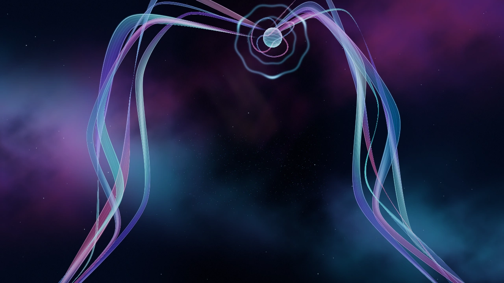
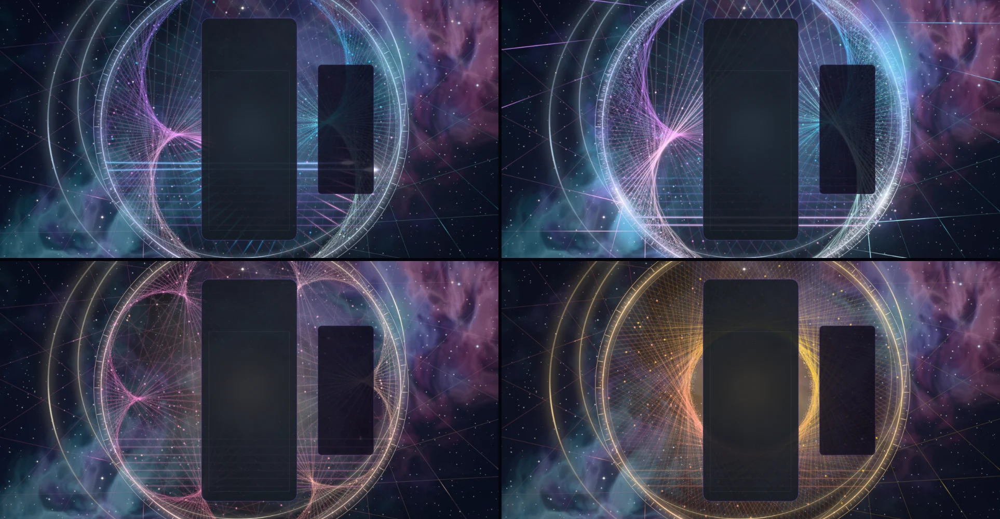
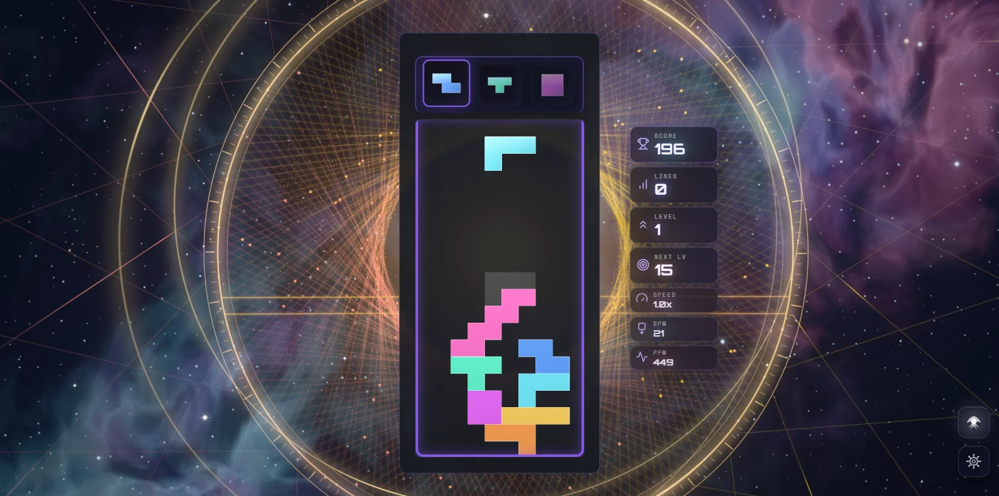
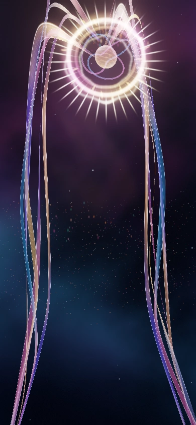

# Astral Weave — the Loom of Heaven

Implemented 2026-10-05 on `feature/astral-weave-masterpiece`, with Three.js 0.186.1. A
from-scratch rebuild: it replaces the 2026-10-04 "celestial silk" pass in full (scene,
materials, compute, post, event language, lifecycle class and tests). This document records
the shipped design and what was verified. It is a reference, not a backlog.

## The picture

A monumental hoop hangs in a river of nebula with the gameplay card at its heart. The hoop is
strung with a string-art weave, and the board is the loom's work: what you do on the board is
woven into the sky.

## The one idea

Thread *i* runs from the peg at angle *a* to the peg at *k·a + φ*. The envelope of those
chords is an epicycloid with *k − 1* cusps, so one uniform re-weaves the whole figure:

| k | Figure | When |
| --- | --- | --- |
| 0 | The fan: every thread ends at the crown peg | A four-line clear gathers the weave |
| 1 | The iris: every thread tangent to one circle | The four-line clear's gold halo round the board |
| 3 | The nephroid: two cusps pointing in at the card | Rest |
| 3 + n | One more petal per chained clear (cap 8) | Combo |

`φ` is chosen so a cusp always points in from the hoop's right (and its left, at rest), the
fan lands on the crown, and the iris has the radius asked for. `phaseForK` is continuous, and
a test walks the whole four-line timeline at 240 Hz to prove `k` and `φ` never jump.

Each thread is brightest where it touches the envelope (`t = 1 / (1 + k)`), so the figure
reads as luminous petals and the long spans stay quiet. The dust (below) settles on the same
touch points.

## Event language

| Event | Response |
| --- | --- |
| Piece lock | The shuttle crosses the hoop at each row the piece occupies (alternating direction, like a loom) and leaves a weft thread that rings like a plucked string. Rosette threads passing the lock carry its light out to the hoop; the hoop rings from the peg where the shuttle lands. |
| Hard drop | The same, brighter, with a small camera push. |
| Line clear | The cleared rows burn: a runner races out to the hoop, two fronts chase round it re-lighting the weave thread by thread, pulses leave along the warp, a ring of excited gas crosses the nebula and pushes a wave through the dust. The burnt rows then drop out of the tapestry and the rows above move down, as the stack did. |
| Combo | Each consecutive clearing lock weaves one more petal (`k` rises on an exact critically damped spring) and warms the weave from pearl through rose to gold. The chain breaking unwinds it. |
| Four lines / perfect clear | Gather into the crown (0.42 s), dwell, open the iris in gold, hold, then bloom back into petals through `k = 2`. A perfect clear opens from a tighter sunburst and holds longer. |
| T-spin | One sprung turn of the whole hoop. |
| Level up | The resting figure gains a petal (2, 3, 4, 5, then round again). |

Combo here is the true consecutive-clear combo (one `ComboTracker` per player in
`AstralWeaveDirector`); the bus's `COMBO` event is cascade depth (ADR-0011) and only scales
the clear. Events from another local-multiplayer board pluck the weave where that board is
and ring the hoop, but only the primary board owns the weft rows.

## How it is built

| File | Role |
| --- | --- |
| `astral-weave-composition.js` | Three-free layout: reads the live card, board canvas and HUD rects, solves the hoop in screen space (sides on landscape, top and bottom strips on portrait), maps board rows to chords. |
| `astral-weave-tsl.js` | Hashes, the three-stage spectrum, the baked half-float fBm texture, screen-space ribbon and sprite helpers, the premultiplied "over" material. |
| `astral-weave-sky.js` | The nebula river and two hashed star layers (one full-screen draw, five texture fetches) and the instanced jewel stars. |
| `astral-weave-loom.js` | Rosette, wefts, warp, hoop, gimbals, pegs, heart and crown flares, the stateless spark pool. |
| `astral-weave-dust.js` | Silk dust: a compute simulation on WebGPU, the same motes drawn at their homes elsewhere. |
| `astral-weave-world.js` | Owns the shared uniforms, the choreography and the camera rig. Shared with the playground effect, so what is iterated there ships. |
| `astral-weave-director.js` | Renderer-free: stages bus events per player and resolves one lock and one clear per frame. |
| `astral-weave-post.js` | One scene pass, bloom, and one output pass. |
| `astral-weave-theme.js` | Lifecycle, renderer selection, settings, layout watch, GPU-loss recovery, capture flags. |

Techniques worth knowing before changing it:

- **One node renderer on both backends.** `WebGPURenderer` on WebGPU, its WebGL2 backend
  otherwise (or `?forceWebGL`). There is no `ShaderMaterial` left, so `astral-weave` is off the
  dual-state allowlist.
- **Pixel-width threads.** Every thread is a strip expanded in screen space
  (`awRibbonClip`), with a Gaussian profile and a 0.85 px floor, so the weave is as fine at 4K
  as at 720p and needs no MSAA.
- **Closed form first.** Shuttles, wefts, plucks, fronts, warp pulses and sparks are functions
  of the world clock and event timestamps. Nothing is created at event time; sparks are written
  into a ring of dormant slots. `seek(t)` plus a fixed-step replay reproduces any frame.
- **Compute where state earns it.** The dust is two storage buffers and one compute pass. Each
  mote chases a home on the weave with an exact critically damped spring, so when the weave
  re-forms the dust streams after it, and locks and clears kick it. The pipelines compile off
  the frame through `compileComputeAsync`; if they fail or time out the world swaps in the
  drawn-at-home dust. Moving motes are drawn as short streaks along their screen velocity.
- **HDR, single output.** The scene is emissive and scene-linear; a max-channel knee selects
  what blooms (no MRT), and one output pass does the calm zones, an impact fringe, a
  hue-preserving filmic curve, grade, vignette and dither. `usesMrtScenePass()` is false.
- **No MaterialX noise.** The nebula reads one tileable fBm texture baked on the CPU in about
  40 ms; every shared `Fn` carries `setLayout`.

## Tiers

| Tier | Threads | Warp pairs | Sparks | Dust | Bloom |
| --- | --- | --- | --- | --- | --- |
| Minimal | 72 | 10 | 128 | none | off |
| Low | 96 | 14 | 192 | 1,600 at home | off |
| Medium | 132 | 20 | 320 | 5,000 simulated | on |
| High | 180 | 26 | 512 | 14,000 simulated | on |
| Ultra | 240 | 32 | 768 | 30,000 simulated | on |
| Extreme | 300 | 40 | 1,024 | 60,000 simulated | on |

Without WebGPU the dust is capped at 5,000 motes drawn at their homes.

## Verification

- Unit tests: 77 new tests in four files (composition 13, director 18, world 32, theme 14).
  Whole suite 544 files, 5,968 tests, 0 failures. The shared Astral/Chiral parity test is now
  Chiral-only (`chiral-gold-webgl-parity.test.js`).
- Gates: lint ratchet at baseline, typecheck, production build with the boot-closure guard,
  dependency boundaries, theme lifecycle audit and the IP-string gate all pass. The palette
  gate fails on `main` and here for the same unrelated reason (Stillwater); Astral Weave
  scores 0/7 on it.
- Playground captures on WebGPU (RTX 3070 Laptop): idle, lock, hard drop, clear, combo, the
  four-line gather, crown, iris opening and hold, at every tier, at 1080p and in a 430×932
  portrait window, plus High on the forced WebGL2 backend. No console errors or warnings.
- In the real game (Electron, dev server, single player, real hard drops plus bus-injected
  clears): the theme starts on WebGPU, seats on the live card, weaves the real stack's rows,
  survives a live quality change (High to Medium) and stops cleanly. Observed frame rate of
  the whole game: about 131 fps at 1264×655 and 115 fps at 1584×835 on the RTX 3070 at High;
  166 fps (the panel's cap) on the integrated Radeon at Medium, 1264×655.

Not verified: GPU cost per tier through the theme perf lane (the figures above are observed
frame rates, not ADR-0016 measurements); physical phones; local multiplayer and Infinity
layouts in a capture (their routing is unit-tested only); reduced motion in a capture.

## Reproduce

Run `npm run dev:playground`, then:

`/playground.html?effect=astral-weave&t=20&quality=High&board=1&stack=7`

Add `event=lock|drop|clear|tetris|tspin|perfect|levelUp` with `eventAge=<s>`, `combo=<n>`,
`level=<n>`, `lines=<n>`. `demo=1` (without `t`) plays a looping script. `parts=` draws only
the named layers; `falseColor=1` bands the pre-tone-map peak; `forceWebGL=1` uses the WebGL2
backend. In the game: `?astralWeaveTime=`, `?astralWeaveFixedDt=`, `?astralWeaveParts=`,
`?astralWeaveFalseColor=1`.

## Captured previews

