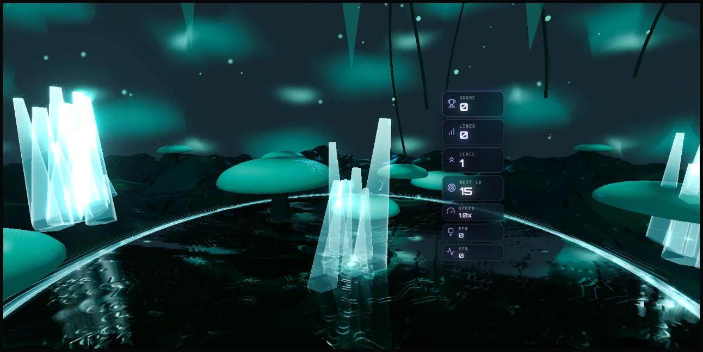
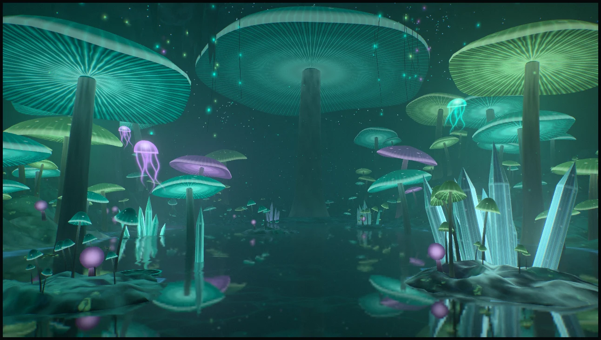
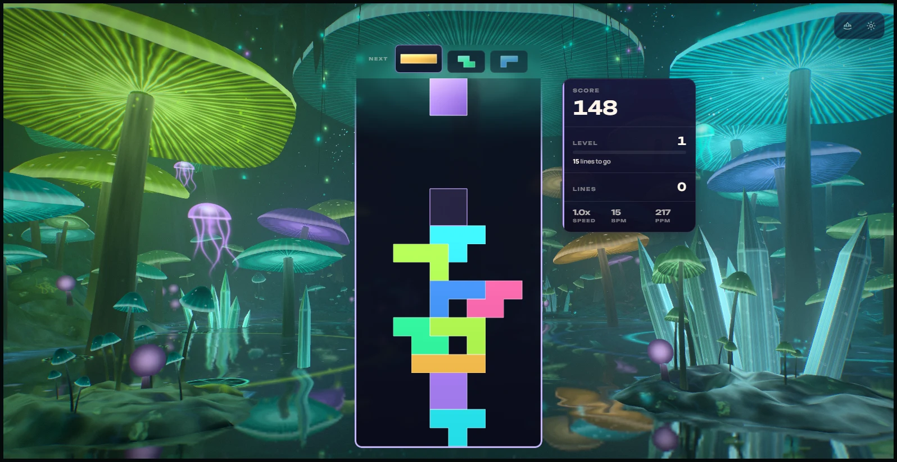
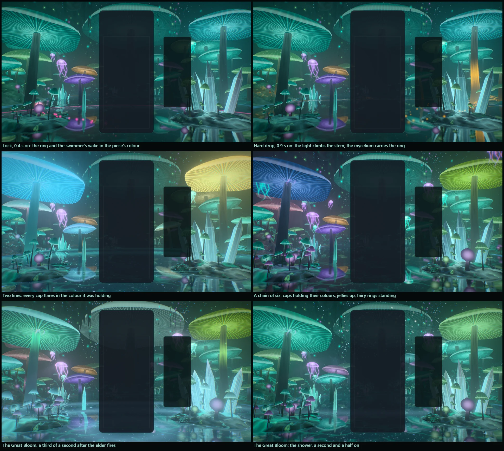
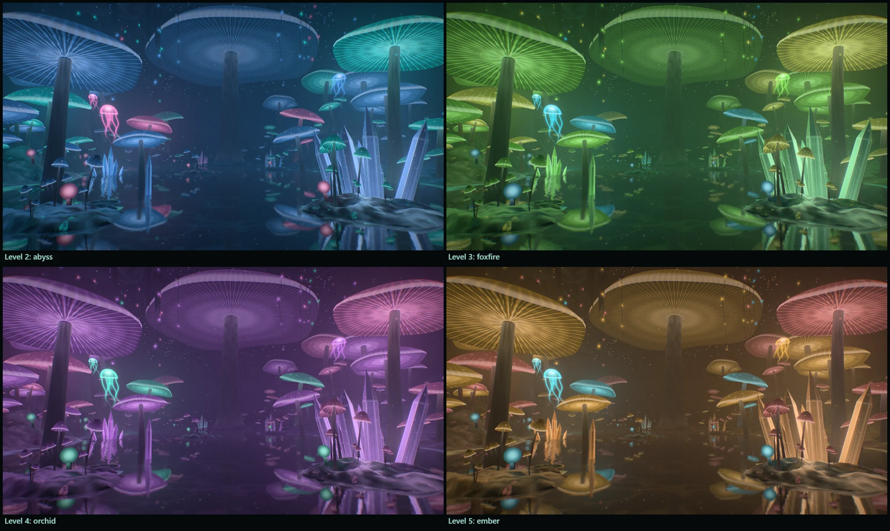
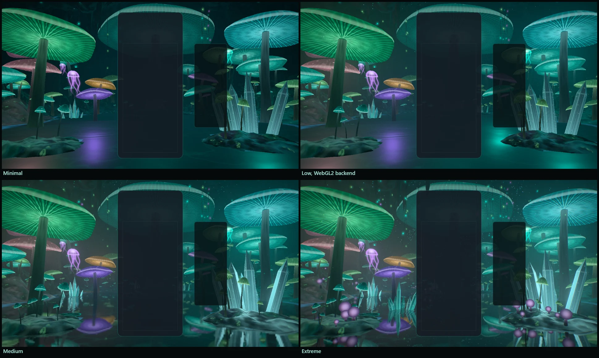
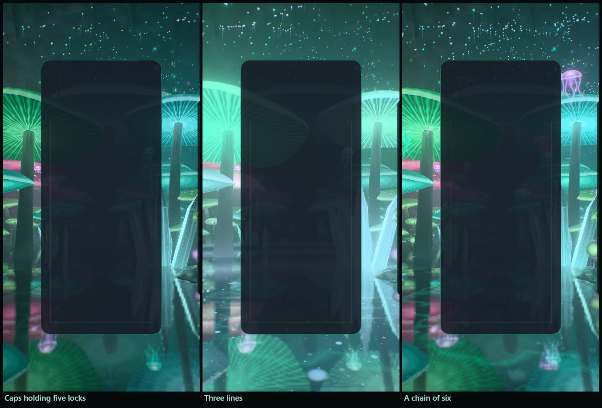

# Bioluminescence — the living grotto

Implemented 2026-10-08 on `feature/bioluminescence-masterpiece`, with Three.js 0.186.1. A
from-scratch rebuild: it replaces the earlier theme in full (the 2,000-line `WebGLRenderer`
class, its seven GLSL `ShaderMaterial`s, three canvas-painted PBR texture sets, the `Water`
example object and the `EffectComposer` bloom). Bioluminescence keeps its identity — teal
mushrooms round a still black pool, crystals standing in the water, vines hanging from the
dark, spores adrift — and everything else is new. This document records the shipped design and
what was verified. It is a reference, not a backlog.

| Before | After (High, WebGPU) |
| --- | --- |
|  |  |

## The picture

A flooded cavern. The viewer stands in the shallows of a pool and looks down its length. A
court of great mushrooms stands either side of it, and you look up into them: the underside of
a cap is its gills, and the gills are the lamp. Lesser caps step back into the mist in tiers;
tufts of thin bells and lantern globes grow on two outcrops at your feet; crystals rise out of
the water lower right; the elder mushroom, twenty-seven metres tall, holds the island at the far
end of the cave. Vines hang from the vault carrying pods of light, glow-worms pick out the rock
overhead in colonies, medusae of light swim in the air over the pool, and the whole grotto
stands upside down in the water.

The gameplay card covers the middle of a landscape screen, so the picture is planned for the two
side thirds — a hero cap each side, the outcrops in the bottom corners, vines and glow-worms
above — and the elder's canopy shows either side of the card's top.

## The one idea

The grotto is one organism, wired by mycelium, and the board feeds it. A piece's light goes into
the pool, swims to a mushroom and stays in its cap; a clear lets go of everything the grotto is
holding.

## Event language

| Event | Response |
| --- | --- |
| Piece lock | The piece's light dives into the pool under the board: a ring of plankton sparks in its colour runs out over the water (the mycelium in the outcrops and banks lights as it passes). A swimmer crosses the pool to a mushroom on that side — a bright head and a wake of sparks that die away where they lie — the light climbs the stem, and the cap **blooms** in the piece's colour: it swells, sheds a slow shower of spores from its gills down onto the water, and **keeps** the colour (it fades over about half a minute). The great caps answer most often and each carries a lamp, so a lock re-colours the stone, the water and the mist round it. The grotto slowly fills with the colours of the pieces played. |
| Hard drop | The same, harder: a splash of sparks, three swimmers to three mushrooms, a wider ring, a camera dip. |
| Line clear | The cleared rows leave the card as blades of light that break up into spores. A wave of plankton light rolls out across the pool from the foot of the board, one front per line: as it passes a mushroom, the colour that cap was holding flares in its gills, falls out of them as spores and is gone; the mycelium floods, the glow-worms ripple, every jelly flashes. One line answers in the plankton's colour, two in the caps', three in those and the accent (and the crystals chime). |
| Combo | The grotto wakes. More jellies rise out of the pool with every step of the chain (three drift at rest, up to fourteen); fairy rings of bells and globes sprout on the outcrops and along the shore, nearest first; the glow-worms kindle from a third of them to all of them; the mycelium fills with light; the spores in the air rise faster and a slow pulse from the elder crosses the cave. When the chain breaks the grotto lets its breath go, the rings shrink back and the jellies sink. |
| Four lines / perfect clear | The Great Bloom. The grotto holds its breath — every light sinks for a quarter of a second — then the elder erupts: its gills flash white, a shower of spores in every colour the grotto has falls from the whole width of its cap onto the pool, a ring crosses the water, every cap in the two courts sheds, the crystals chime and the jellies flash. |
| T-spin | The air turns: the spores swirl about the middle of the pool, the vines swing, the crystals chime. |
| Level up | The grotto changes colours: five palettes, cycled (lagoon, abyss, foxfire, orchid, ember). |

Combo here is the true consecutive-clear combo (one `ComboTracker` per player in
`BioluminescenceDirector`); the bus's `COMBO` event is cascade depth (ADR-0011). With several
boards on screen each lock dives in under its own board, and the grotto wakes to the longest
chain any board is holding.

## How it is built

| File | Role |
| --- | --- |
| `bioluminescence-core.js` | Three-free constants and maths shared by the plan, the choreography and the shaders: ring and wave timings, how long a cap holds colour, the five palettes, the CPU noise bake. |
| `bioluminescence-layout.js` | The grotto's plan, seeded and deterministic: floor and vault as two height fields, the pool, the outcrops, every mushroom (elder, heroes, fill, the fairy-ring sprouts), crystals, stalactites and columns, glow-worm colonies, vines, jelly homes, drips, pads, and the lamps. |
| `bioluminescence-tsl.js` | Hashes, the baked noise and height textures, the shared uniforms, and the grotto's light: the lamps on a surface, the lamps in the mist, the colour of distance, the lock rings and the clear waves. |
| `bioluminescence-cavern.js` | The rock: floor and banks, the outcrops (their own fine mesh), the vault, stalactites and columns, the plug of mist behind the far gallery. |
| `bioluminescence-mushrooms.js` | Three species and the elder as instanced lathes, the light a cap holds, the bloom. |
| `bioluminescence-crystals.js` | The crystals in the pool and their chime. |
| `bioluminescence-water.js` | The pool: the planar mirror, the plankton, lock rings, the clear's swell, drips, the bed's mycelium; and the floating pads. |
| `bioluminescence-air.js` | Glow-worms and their threads, vines, spores adrift, jellies. |
| `bioluminescence-fx.js` | Swimmers, the spore pool, row jets. |
| `bioluminescence-world.js` | Owns the uniforms, the parts, the camera rig and the choreography. Shared with the playground effect, so what is iterated there ships. |
| `bioluminescence-director.js` | Renderer-free: stages bus events per player and resolves one lock and one clear per frame. |
| `bioluminescence-composition.js` | Three-free: reads the live card, board and HUD rects and maps board columns and rows onto the screen. |
| `bioluminescence-post.js` | One scene pass, bloom, and one output pass. |
| `bioluminescence-quality.js` | The six tiers. |
| `bioluminescence-theme.js` | Lifecycle, renderer selection, settings, layout watch, GPU-loss recovery, capture flags. |

Techniques worth knowing before changing it:

- **One node renderer on both backends.** `WebGPURenderer` on WebGPU, its WebGL2 backend
  otherwise (or `?forceWebGL`). There is no `ShaderMaterial` left. Nothing uses compute: spores,
  swimmers, jellies and motes are closed-form functions of the clock and of event timestamps.
- **Nothing is lit by a light, and the light is the flora.** Every material shades itself
  (`MeshBasicNodeMaterial`). The grotto's light is a list of twelve lamps — the great caps, the
  elder, two crystal clusters — in one uniform array the world rewrites each frame (position,
  radius, colour × gain). The rock, the caps, the crystals and the water evaluate them in a TSL
  `Loop`, so a cap that takes a piece's colour re-lights everything round it.
- **A glow has a halo you can stand in front of.** The same lamps light the mist: for each lamp
  the air's in-scatter along the view ray is the closed-form integral of 1/(d² + r²) up to the
  fragment's own depth (two `atan`s), cut off with distance from the lamp. A halo therefore sits
  in the air round its cap, and a stem, a vine or a stalactite in front of it cuts into it. It
  is evaluated per material, not in post, so the pool's mirror shows it too.
- **A mushroom is a lathe that knows which part it is.** Each species is one instanced draw of a
  profile spun round an axis; every vertex carries (part, v, angle). The vertex stage grows,
  leans and sways the stem, sets the cap square on its leaning top, waves the rim and swells the
  cap when it blooms. The fragment stage draws the gills as lines of light that whiten toward the
  stem (and settle to their average where they are finer than a pixel), a skin that is thin
  toward the rim so the gills show through as striations, pale spots, a velvet edge, and a
  fibrous stem lit from the gills above. No textures.
- **The colour a cap holds is four instanced attributes** in one interleaved buffer per draw,
  written only when gameplay happens: what it holds and since when, what it held before (shown
  until the swimmer arrives), the bloom and when it starts up the stem, and when a clear's wave
  voids it. The shader decays and fires them in closed form. The newest colour wins a cap; two
  pieces' colours summed would only wash out.
- **The pool is alive.** On Medium and up a planar `reflector()` renders the grotto from the
  mirrored camera at reduced resolution and the water reads it through its own slopes. The
  plankton is three scales of hashed points, one creature to a cell, each winking on its own
  clock and lit only where the water is disturbed (a ring, a wave, a drip, the shoreline); a
  layer goes out where its cells are finer than a pixel. Low and Minimal mirror the cave's glow
  and each lamp's image along the reflected ray instead.
- **The floor is two height fields.** Floor and vault are functions of the plan's noise; where
  they meet there is rock, so the walls fall out of the same data. The outcrops at the viewer's
  feet are a finer polar mesh over the exact function. Occlusion comes from the lie of the field
  and the lesser mushrooms' glow is gathered per vertex when the cave is built (one number per
  family of light), so the banks carry their flora's light at no per-fragment cost.
- **Upright screens.** A phone held upright is too narrow to see where the courts stand, so one
  uniform draws everything rooted in the water nearer the middle of the pool there.
- **Closed form first.** Nothing is created at event time: events write numbers into
  ring-buffered uniform slots and preallocated pools. `seek(t)` plus a fixed-step replay
  reproduces any frame.
- **HDR, single output.** The scene is scene-linear; a max-channel knee selects what blooms (no
  MRT), and one output pass does the lens fringe, the calm zones on the card and HUD, bloom,
  shafts dragged out of the elder's cap, a hue-preserving filmic curve, grade, vignette, grain
  and dither. An iris closes as the grotto flares so its colours survive the surge.
  `usesMrtScenePass()` is false.
- **No MaterialX noise.** One tileable fBm texture is baked on the CPU with its own mip chain.

Two things learned on the way and worth keeping:

- **The Great Bloom is not gold.** A warm light over teal mixes to grey: the first version fired
  in gold and bleached the cave. It now burns white with the pool's cast, its wave runs in the
  palette's own colours, and its spores fall in every colour the grotto has.
- **A cave is dark.** The first frames were a teal haze: mist brighter than the lamps. The
  picture only arrived when the fog and the ambient were cut to a third and the halos made
  local, so that most of the frame sits near black and the flora is what you see.

## The pieces

The seven piece colours are seven living lights (amber spore, orchid violet, sea-sparkle cyan,
anemone pink, mint, foxfire lime, abyss blue). They are assigned so that no shape wears the hue
it has in the familiar arrangement: `scripts/palette-guideline-check.mjs` scores the palette 0/7.

## Tiers

| Tier | Mushrooms | Sprouts | Glow-worms (threads) | Vines | Motes | Jellies | Spore pool | Lamps (in the mist) | Mirror | Bloom, shafts | Scene MSAA |
| --- | ---: | ---: | ---: | ---: | ---: | ---: | ---: | ---: | --- | --- | --- |
| Minimal | 70 | 24 | 600 (0) | 12 | none | 6 | 160 | 6 (0) | lamp images | off | off |
| Low | 110 | 40 | 1,200 (60) | 20 | 250 | 8 | 260 | 8 (6) | lamp images | off | off |
| Medium | 160 | 60 | 2,200 (120) | 28 | 600 | 10 | 420 | 12 (10) | 0.40 scale | on | off |
| High | 210 | 80 | 3,400 (180) | 36 | 1,000 | 12 | 640 | 12 (12) | 0.50 scale | on | 4× |
| Ultra | 240 | 100 | 4,400 (240) | 40 | 1,600 | 14 | 900 | 12 (12) | 0.62 scale | on | 4× |
| Extreme | 260 | 110 | 5,200 (300) | 44 | 2,400 | 14 | 1,200 | 12 (12) | 0.75 scale | on | 4× |

Every tier keeps the whole picture and every event. These are allocation budgets, not
measurements of frame rate.

## Assets

None. Every shape is generated in code — the cave from two height fields, the mushrooms from
lathe profiles, the crystals from a prism, the jellies painted in a quad — and nothing is a
texture except the baked noise. Blender was offered and was not needed: what makes these forms
read is their shading, and a lathe in code is the same lathe.

## Verification

- Unit tests: 180 new tests in five files (director 28; composition 12; plan and core maths 35;
  the real world built in Node 47; theme adapter 58). They cover, among other things, a
  bit-exact `seek` + fixed-step replay, the worst frame's spore count against every tier's pool,
  a lock and a clear arriving in the same frame, and the upright-screen squeeze. The 29 fleet
  files that touch every registered theme (registry lifecycle acceptance, dual-state tripwire,
  event contract, URL-parameter catalog and others): 327 tests, all passing.
- Whole suite, run once while other sessions kept the machine loaded: 690 files, 9,208 tests;
  687 files passed. The three that did not are in files this change does not touch: two
  wall-clock timeouts (`async-render-pipelines-contract`, 30 s; `odyssey-world-bake-loader`,
  5 s) that pass when run on their own, and `odyssey-level-briefing`, which expects
  "250,000" and gets "250 000" from this machine's Swedish locale. CI is the authority for those.
- Gates: typecheck; lint ratchet (783 errors against a baseline of 807 — removing the old theme
  took the difference with it, the new files add none; the baseline was left as it is); theme
  lifecycle audit; dependency boundaries (1,285 modules); architecture fitness (`ShaderMaterial`
  hits 194 against 200, files 29 against 30, resize listeners 39 against 40; baselines left as
  they are); production build with the boot-closure guard (the theme's chunk is 110 kB, 41 kB
  gzipped); IP-string gate; Pages artifact check; release gates — all pass. The palette gate
  fails on `main` and here for the same unrelated reason (Stillwater); this theme scores 0/7.
- Playground captures on WebGPU (RTX 3070 Laptop), each with a clean console: rest; a lock, a
  hard drop, a two-line clear, a held chain of six, the Great Bloom at two moments, a T-spin;
  the four other level palettes; rest with held colours at Minimal, Medium and Extreme; Low and
  the Great Bloom on the forced WebGL2 backend; an upright 430 × 850 frame at rest, through a
  three-line clear and in a chain of six; reduced motion. The reported tier and backend of every
  frame were checked against its name.
- In the real game (Electron, dev server, single player, the collection opened with
  `?unlockAll=1`): the theme starts on WebGPU at High, aims its events at the live board, takes
  real hard drops from the keyboard (eight locks, twenty-two swimmers) and bus-injected locks,
  clears, a chain and four lines, survives a live quality change (High to Medium) and lets go of
  its canvas when another theme takes over, with no console errors or warnings.
  `scripts/validate-all-themes.mjs --theme bioluminescence` against the same server stops at the
  theme picker (five selection failures, 0 console errors, no lifecycle check reached): it
  selects a theme by clicking its card, and since the collection landed a card that is not owned
  yet does not select. The validator builds its own URL, so `unlockAll=1` cannot be passed to
  it. A second run with that parameter added to the validator for the run waited fifty minutes
  for the shared capture lock and never got it; the validator was left as it is, and no control
  theme was run. The lifecycle above was checked through the in-game run instead.
- Phone emulation (`scripts/validate-mobile-webgl2.mjs --theme bioluminescence`, software
  WebGL2, 390 × 844 and rotated): PASS at Low and at Minimal. The theme was added to that
  script's list of node-material WebGL2 themes.
- A helper agent's read-only review of the world found seventeen faults, and its re-check of
  the fixes five more; all that mattered are fixed and covered by the tests above. The ones
  worth remembering: one frame could throw twice the spore pool, so the ring that recycles it
  overwrote the first spores before they were born; the lock that causes a clear never bloomed,
  because the clear's wave counted the swimmer's not-yet-arrived light as held and voided it;
  the upright-screen squeeze was decided by whether a mushroom happened to be rooted below the
  water, which left the right court's leading cap out of the frame; both clear waves shared one
  origin. One more was caught by a gate rather than by eye: the first piece palette reproduced six of
  the seven familiar shape-to-hue roles.

Observed, not measured (whole-game frame rate at 1584 × 813, counted over four seconds while
other sessions shared the machine): about 130 fps at rest and 123 through the Great Bloom
at High on the RTX 3070 Laptop GPU. One run forced onto the laptop's integrated Radeon, before
the review's fixes, read 34 fps at High; it was not repeated, and neither figure is a budget.

Not verified: GPU cost per tier through the theme perf lane (ADR-0016); physical phones; local
multiplayer and Infinity layouts in a capture (their routing is unit-tested only); the icon on
an Odyssey level orb; sessions of several hours. `docs/theme-screenshots/bioluminescence.png`
still shows the previous artwork (a fleet capture writes it).

Known limits: the lesser mushrooms' glow is baked into the floor where the plan put them, so on
an upright screen the company of a court leaves its glow on the bank; a cap has one bloom at a
time, so when two swimmers are bound for the same cap only the later arrival blooms; Low and
Minimal have no mirror (the pool shows the cave's glow and each lamp's image instead).

## Reproduce

Run `npm run dev:playground`, then:

`/playground.html?effect=bioluminescence&t=20&quality=High&board=1`

Add `event=lock|drop|clear|quad|tspin|perfect|levelUp` with `eventAge=<s>`, and `combo=<n>`,
`level=<n>`, `lines=<n>`, `u=<0..1>`, `row=<r>`, `color=<hex>`. `locks=<n>` plays n locks first,
so the caps are holding their colours when the event fires. `demo=1` (without `t`) plays a
looping script. `parts=` draws only the named parts; `falseColor=1` bands the pre-tone-map peak;
`noPost=1` shows the raw scene; `forceWebGL=1` uses the WebGL2 backend; `reduce=1` is reduced
motion. In the game: `?biolumTime=`, `?biolumFixedDt=`, `?biolumParts=`, `?biolumFalseColor=1`.

The theme icon is a frame of the scene through the playground's icon lens, five steps into a
chain (jellies up, fairy rings standing):

`/playground.html?effect=bioluminescence&t=31&quality=Extreme&icon=1&iconFov=44&iconYaw=0.42&iconPitch=0.1&combo=5`

captured in an 840 × 840 window (the largest square this laptop's screen allows), cropped to 92%
of the frame around (0.5, 0.47), given a colour lift (contrast 1.1, saturation 1.2, brightness
1.08) and baked as a 512 px circle on a transparent ground. The same file is kept at
`public/assets/themes/bioluminescence-theme-icon.png`. It was checked at the picker's 80 px
beside its neighbours.

## Captured previews

