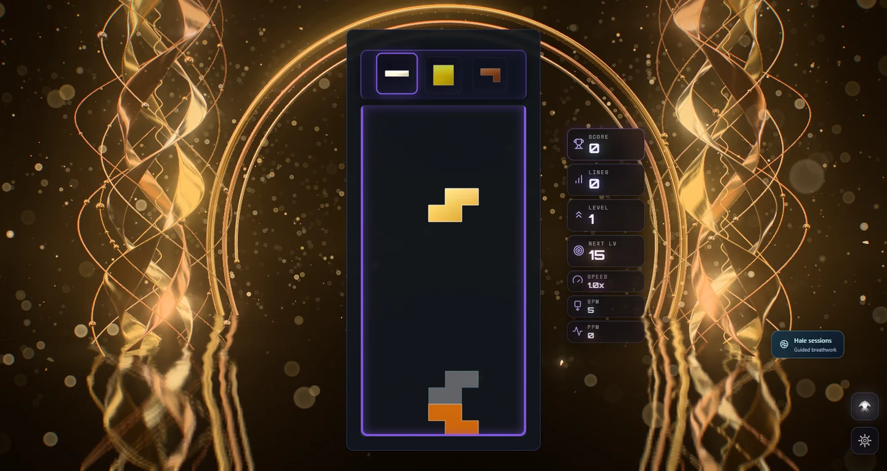
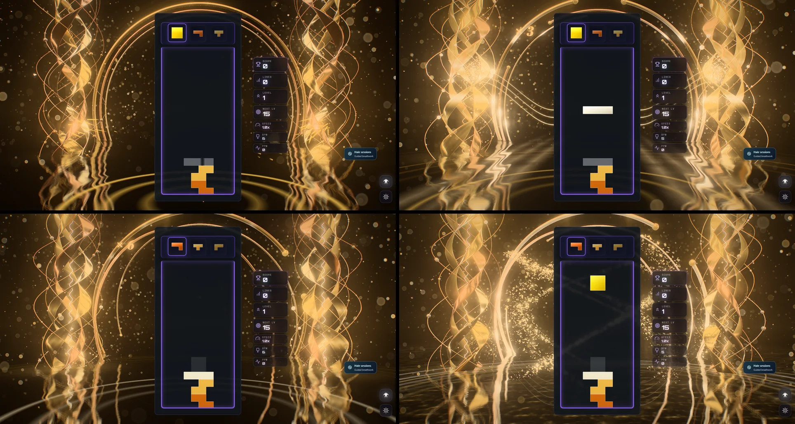
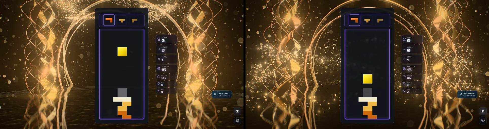
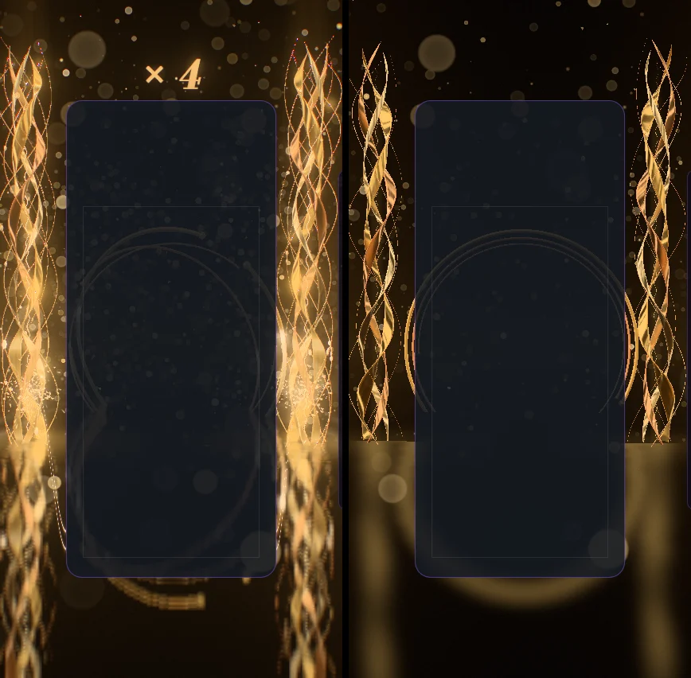

# Chiral Gold — the two towers and the black water

Implemented 2026-10-05 on `feature/chiral-gold-masterpiece`, with Three.js 0.186.1. A
from-scratch rebuild: it replaces the earlier theme in full (the 4,000-line theme class and its
WebGL twin, the sculpture, the compute particle systems, the GLSL shaders, the post stack, the
validation script and the tests) and supersedes the two earlier October records of that theme.
Chiral Gold keeps its identity — a dark hall, two mirror-image forms of gold either side of the
board, a great arc over it, gold dust in the air — and everything else is new. This document
records the shipped design and what was verified. It is a reference, not a backlog.

## The picture

A dark hall whose floor is still black water. Two towers of braided gold stand in it, one either
side of the board: three broad ribbons wound one way round a glowing core, inside loops of fine
wire wound the other way, with beads of gold sliding along the wires. The left tower is the
mirror image of the right, and they turn in opposite senses. Behind them a great open ring of
gold arches over the board, half sunk. Everything stands again in the water.

The gameplay card covers the middle of the frame, so the picture is built round it: the towers
stand in the margins the card leaves (they move and narrow as the layout changes), the ring
arches over it from behind, and the water below carries what the board drops into it.

## The one idea

The board is an anvil standing between two towers of gold, and everything struck on it becomes
gold that the towers take up. The towers are the two hands of one form, and so is everything
that happens to them: what turns one way on the left turns the other way on the right.

## Event language

| Event | Response |
| --- | --- |
| Piece lock | Sparks leave the board at the height the piece landed and fly to the towers, most to the nearer one, corkscrewing in with that tower's hand. Where they land a star opens and a pulse runs up and down the ribbons (the ribbons swell as it passes and the beads it crosses flash). A ring spreads on the water from under the piece's own column, in the piece's colour, bending the mirror as it goes. |
| Hard drop | The same, harder: more sparks, a stronger pulse, a splash from the water and a dip of the camera. |
| Line clear | Each cleared row leaves the board as a blade of light at its own height and sweeps up to strike both towers. Where a blade lands: a star, a pulse, and a spiral of gold leaf torn loose and carried round the tower in that tower's hand. The towers spin up and hold a glow, a front of light crosses the water, and a pair of comets leaves the ring's two feet to cross at its crown. |
| Combo | The hall takes heat. The towers' cores come up to white, the gold glows from within, everything turns faster, and the great ring opens band by band (at chains of two, four and six) into an armillary sphere. The chain's count is struck in gold beside the board ("×3"), stamped larger at each step. When the chain ends the heat drains from the top down and the count falls as leaf. |
| Four lines / perfect clear | A hush: every light in the hall drops for a sixth of a second. Then the ring ignites from its crown, the water is gilded outward from the board, and two sets of spiral arms of gold leaf, one of each hand, climb around the board through one another. Then it rains gold. |
| T-spin | Both towers turn once on the spot. |
| Level up | The next alloy is poured up the towers: fine gold, rose gold, white gold, green gold, red gold, and round again. |
| Music | Bass moves the water and the cores, treble the dust, a beat the ring's rim. Reduced motion switches it off, with the camera kicks and the hush. |

The board's rows are a gauge the towers carry: its floor lands just above the water, its top row
near the top of the frame. (On screen the board's lower rows sit below the waterline, where a
tower is only its own reflection, so a row is mapped to a height rather than projected.)

Combo here is the true consecutive-clear combo (one `ComboTracker` per player in
`ChiralGoldDirector`); the bus's `COMBO` event is cascade depth (ADR-0011). A chain's end is
learnt when the next piece locks, as the tracker defines it. With several boards on screen each
lock lands under its own board, and the hall takes the heat of the longest chain any board holds.

## How it is built

| File | Role |
| --- | --- |
| `chiral-gold-core.js` | Three-free constants and maths shared by the choreography, the shaders and the tests: the stage, the towers' curves, slot counts and timings, the alloys, heat for a chain. |
| `chiral-gold-tsl.js` | Hashes, the baked noise texture, the baked studio, the shared uniforms, the additive material and the instanced quad and strip. |
| `chiral-gold-helix.js` | The towers: ribbon and wire geometry, the gold, the beads, the core. |
| `chiral-gold-ring.js` | The great ring: three nested torcs, their comets and their tumble. |
| `chiral-gold-water.js` | The water: the planar mirror, the swell, rings, the clear's front, the gilding. |
| `chiral-gold-atmosphere.js` | The dark the hall ends in, the shafts of lit air over the towers, the dust. |
| `chiral-gold-fx.js` | Sparks, leaf, blades, flares, the four-line braid, the tally. |
| `chiral-gold-world.js` | Owns the uniforms, the parts, the camera rig and the choreography. Shared with the playground effect, so what is iterated there ships. |
| `chiral-gold-director.js` | Renderer-free: stages bus events per player and resolves one lock and one clear per frame. |
| `chiral-gold-composition.js` | Three-free: reads the live card, board and HUD rects, maps board columns and rows onto the screen, and places the towers in the room the cards leave. |
| `chiral-gold-post.js` | One scene pass, bloom, and one output pass. |
| `chiral-gold-quality.js` | The content tiers. |
| `chiral-gold-theme.js` | Lifecycle, renderer selection, settings, layout watch, audio levels, GPU-loss recovery, capture flags. |

Techniques worth knowing before changing it:

- **The gold is a real metal.** `MeshStandardNodeMaterial`, metalness 1, with the alloy as its
  reflectance. Polished metal shows nothing but its surroundings, so the hall is lit the way a
  goldsmith's bench is photographed: an HDR environment baked on the CPU (a key soft box, a fill,
  two tall strip lights, an overhead, two rims, a warm bounce from the water, a line on the far
  horizon, a faint glow from the room behind the lens and 34 pin lights), prefiltered once by the
  renderer. There are no scene lights and no shadows. The dark between the lights is what reads
  as metal; the studio turns slowly so the gold is never quite still.
- **One node renderer on both backends.** `WebGPURenderer` on WebGPU, its WebGL2 backend
  otherwise (or `?forceWebGL`). There is no `ShaderMaterial`, so `chiral-gold` is off the
  dual-state allowlist. Nothing uses compute.
- **The left tower is built as the mirror of the right**, vertex for vertex (x negated, winding
  reversed), and turns the other way, so both braids climb. A ribbon's section is a lens: a broad
  face whose normal is crowned more than its shape, so a highlight glides across it.
- **The mirror.** On Medium and up a planar `reflector()` renders the hall from the mirrored
  camera at reduced resolution with a mip chain; the water reads it through its own slope. The
  towers, the ring and the backdrop are on layer 0; everything else (water, dust, leaf, sparks,
  blades, flares, the braid, shafts, the tally) is on layer 1, which the mirror's camera does not
  render. Low and Minimal follow the mirrored ray analytically to the plane the towers stand in
  and to the plane of the ring instead.
- **Closed form first.** A spark, a flake, a mote, a bead, a comet and a ring on the water are
  each a function of the clock and of what was written when they were launched. Nothing is
  created at event time: events write numbers into ring-buffered uniform slots and preallocated
  pools, often dated a moment ahead (a tower's pulse is dated for when its sparks arrive, a leaf
  burst for when its blade lands). `seek(t)` plus a fixed-step replay reproduces any frame, and a
  test holds the same state at 30 and 240 frames a second.
- **Gold leaf is a mirror too.** Every flake is a tumbling quad whose brightness is how squarely
  it returns one of the studio's lights to the eye, so it flashes when it happens to face one and
  is nearly dark otherwise.
- **Every pool is always drawn** with dormant slots collapsed to zero size, so the first frame
  compiles every pipeline and the theme needs no warm-up roots. `usesMrtScenePass()` is false.
- **HDR, single output.** The scene is scene-linear; a max-channel knee selects what blooms (no
  MRT), and one output pass does the lens fringe, the calm zones on the card and HUD, bloom, star
  glints (the bloom dragged along both axes), rays from behind the board during the strike, a
  hue-preserving filmic curve that lets only the hottest cores roll to ivory, grade, vignette,
  grain and dither. An iris closes as the hall heats so its blacks and its colour survive.
- **No MaterialX noise.** One tileable texture is baked on the CPU; shared `Fn` helpers carry
  `setLayout`.
- **Nothing is downloaded.** The studio, the noise, every shape and the tally's glyphs (drawn
  with the page's 2D canvas in an italic serif) are generated at build time. No model is loaded,
  and Blender was not needed: the forms are parametric curves.

One shader lesson from this build is in the repo's TSL skill gotcha table: a glyph atlas indexed
with `fract()` jumps in UV at every cell boundary, the automatic mip selection picks the coarsest
level there and rules a line down each boundary; sample a fixed level.

## Tiers

| Tier | Ribbon steps | Wires / beads per tower | Mirror | Shafts | Dust | Leaf pool | Sparks | Braid | Bloom, stars, rays | Scene MSAA |
| --- | --- | --- | --- | --- | --- | --- | --- | --- | --- | --- |
| Minimal | 120 | none | analytic | off | 500 | 360 | 96 | none | off | off |
| Low | 160 | 3 / none | analytic | off | 900 | 800 | 160 | 1,500 | off | off |
| Medium | 220 | 4 / 20 | 0.4 scale, 1 tap | on | 1,800 | 1,700 | 320 | 3,500 | on | off |
| High | 300 | 6 / 36 | 0.5 scale, 3 taps | on | 3,200 | 2,800 | 512 | 6,000 | on | 4× |
| Ultra | 380 | 7 / 48 | 0.65 scale, 3 taps | on | 4,800 | 4,000 | 768 | 9,000 | on | 4× |
| Extreme | 460 | 8 / 60 | 0.8 scale, 3 taps | on | 6,500 | 5,400 | 1,024 | 13,000 | on | 4× |

Low and Minimal bake the studio at half size. How many particles one event throws scales with
the tier as well (0.35× at Minimal to 1.5× at Extreme).

## Verification

- Unit tests: 102 new tests in four files (core, studio, composition and tiers 21; director 18;
  world and effects 42; theme 21). The five test files of the earlier theme were retired with it,
  `mobile-theme-canonical-quality.test.js` no longer lists Chiral Gold, the dual-state allowlist
  lost its entry and the mobile WebGL2 validation table lost its preset row. Whole suite: 557
  files, 6,419 tests. Every Chiral Gold test passes, and so does every shared test this change
  touched. The build machine was at 100% CPU from other sessions throughout: in the full run
  fourteen tests in files this change does not touch failed on their wall clocks (5 s test
  timeouts and one 300 ms bake budget). Run again in smaller batches a different handful failed
  each time, four files at the last count (the Odyssey forest sculptor, the Cosmic Expanse
  environment, the Odyssey world bake loader, the Stellar Drift reaction storm), and the same
  files fail the same way on the untouched `main` checkout under the same load. They need a
  quiet machine to be called green.
- Gates: lint ratchet (964 errors against a baseline of 1,070; the baseline was left as it is),
  typecheck, production build with the boot-closure guard, dependency boundaries, theme
  lifecycle audit, IP-string gate, Pages artifact check and release gates all pass. The palette
  gate fails on `main` and here for the same unrelated reason (Stillwater); Chiral Gold scores
  2/7 on it.
- Playground captures on WebGPU (RTX 3070 Laptop) at High: rest, lock, hard drop, clears of one
  to three lines, chains held at three, five, seven and twelve, a chain ending, the four-line
  hush, ignition, braid and rain, a T-spin, a level-up. Rest at Minimal and Low; a clear at
  Medium; the strike at Extreme; High on the forced WebGL2 backend; a 430 x 852 portrait frame
  through a clear at High, and at rest at Low on WebGL2. No console errors or warnings in any of
  them.
- In the real game (Electron, dev server, single player): the theme starts on WebGPU, stands its
  towers by the live card, aims its events at the live board, takes real hard drops and
  bus-injected clears, chains, a four-line strike and a level-up, survives live quality changes
  (High to Medium to Ultra) and lets go of its canvas when another theme takes over. No console
  errors or warnings. Observed frame rate of the whole game at 1600 x 852, with the machine
  busy: 74 and 119 fps at High in two runs on the RTX 3070; on the integrated AMD GPU, 56 fps at
  High, 64 at Medium and 122 at Low (Low renders at 0.85 scale).

Not verified: GPU cost per tier through the theme perf lane (the figures above are observed
frame rates on a loaded machine, not ADR-0016 measurements, and the two High readings differ by
half); the earlier theme's frame rate, for comparison; physical phones; local multiplayer,
Infinity and the meditation mode in a capture (their routing is unit-tested only); reduced
motion and the music's levels in a capture (unit-tested only); the tally's typeface on machines
without Georgia or another of its named serifs (it falls back to the system serif); sessions of
several hours.

## Reproduce

Run `npm run dev:playground`, then:

`/playground.html?effect=chiral-gold&t=44&quality=High&board=1`

Add `event=lock|drop|clear|quad|tspin|perfect|levelUp|break` with `eventAge=<s>`, and
`combo=<n>`, `level=<n>`, `lines=<n>`, `row=<r>`, `u=<0..1>`, `color=<hex>`. `demo=1` (without
`t`) plays a looping script. `parts=` draws only the named parts (`sky`, `water`, `towers`,
`ring`, `shafts`, `motes`, `leaf`, `sparks`, `blades`, `flares`, `braid`, `tally`);
`falseColor=1` bands the pre-tone-map peak; `noPost=1` shows the raw scene; `forceWebGL=1` uses
the WebGL2 backend. In the game: `?chiralGoldTime=`, `?chiralGoldFixedDt=`,
`?chiralGoldParts=`, `?chiralGoldFalseColor=1`.

The theme icon is the left tower at rest through the playground's icon lens, which draws the
braid alone (no wires, beads, blades or tally):
`/playground.html?effect=chiral-gold&t=63&quality=Ultra&icon=1` in a square window, cropped to
90% of the frame around its centre, given a colour lift (contrast 1.22, saturation 1.12,
brightness 1.02) and baked as a 512 px circle on a transparent ground. The same file is kept at
`public/assets/themes/chiral-gold-theme-icon.png`. The unreferenced SVG of the earlier icon was
removed.

## Captured previews

