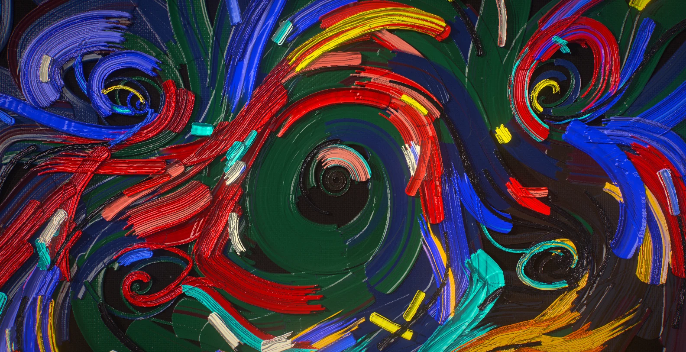
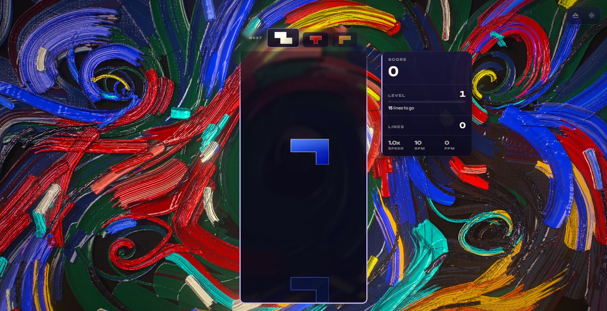
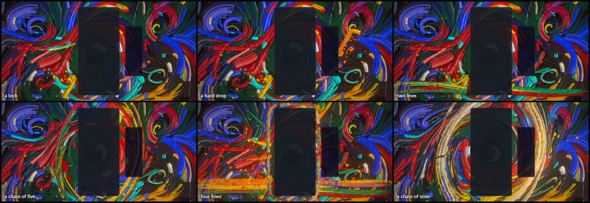
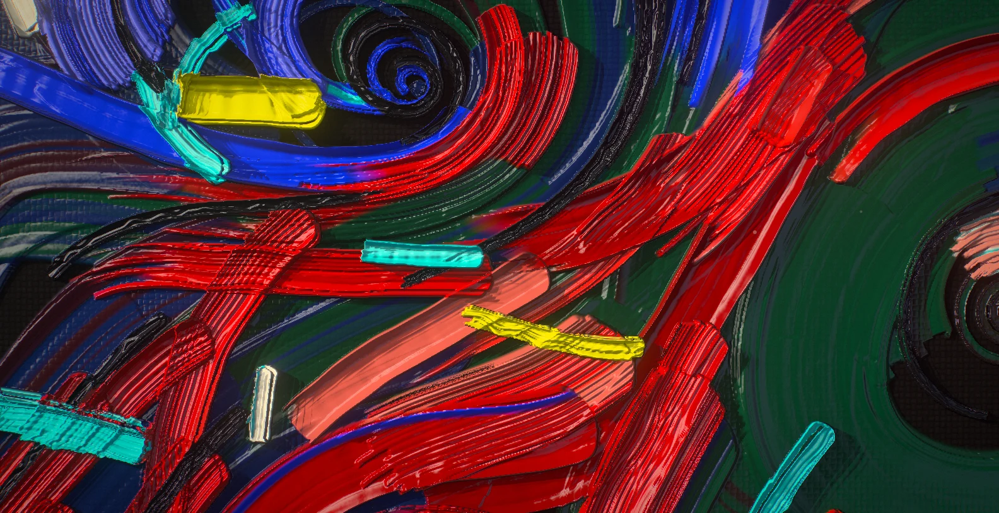
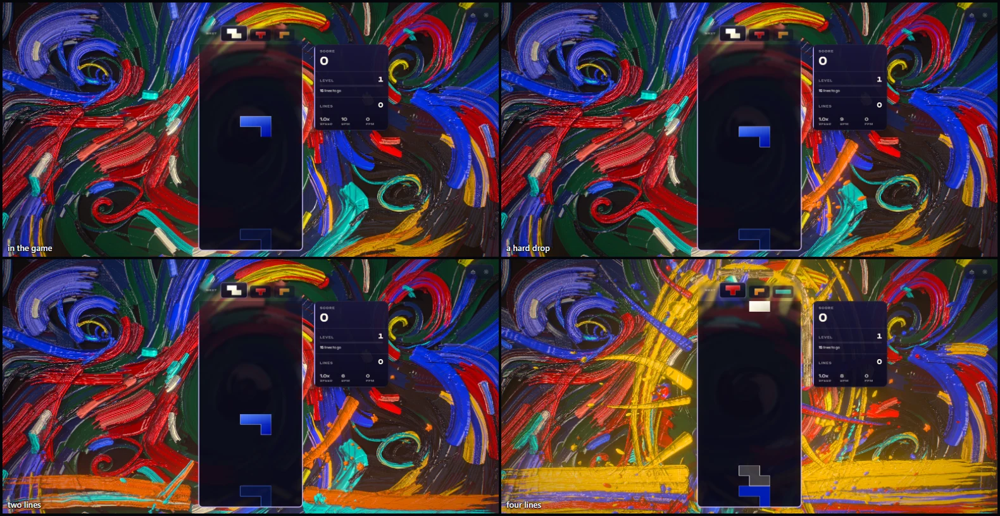
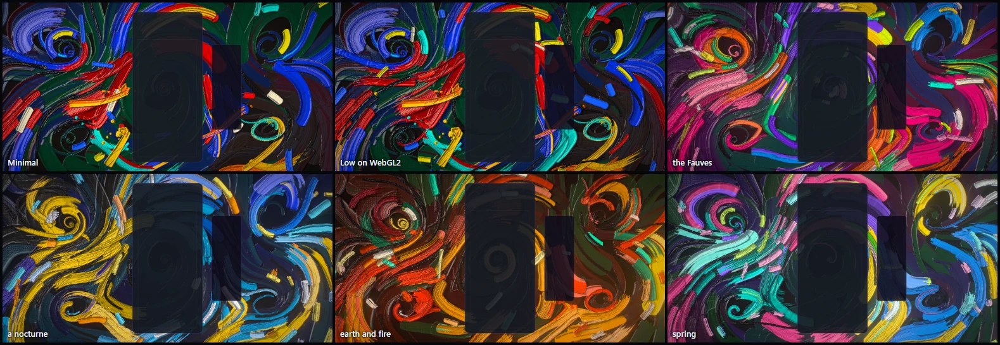
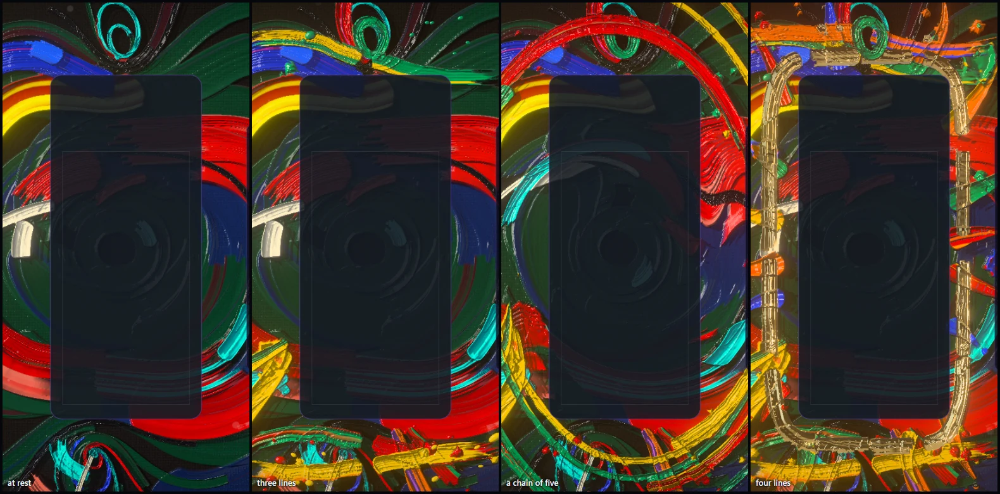

# Chromatic Impasto — the canvas the board paints

Implemented 2026-10-08 on `feature/chromatic-impasto-masterpiece`, with Three.js 0.186.1. A
from-scratch rebuild: it replaces the earlier theme in full (a 2D WebGL fluid simulation drawn as
glowing smoke on black, with its `ChromaticImpastoSimulator`). The theme keeps its identity — thick
oil paint, the tube colours of Bengt Lindström's "Kvinnan Alpha", strokes that swirl, a canvas the
game paints on, the whorl a chain of clears stirs — and everything else is new. This document
records the shipped design and what was verified. It is a reference, not a backlog.

## The picture

One canvas fills the frame, seen square on, as an action painter sees the cloth on the studio
floor. It is painted in thick oil: every bristle of the brush leaves a track, every stroke has
rails where the paint was squeezed to its sides, a pool where the brush came down and a lip where
it pushed the paint to. A lamp stands low on the upper left, so the relief is raked: ridges throw
shadows across the paint beyond them and carry the lamp's window in their wet skin, with a cooler
light from the lower right on their other flank. Where the paint is thin the linen shows.

The picture is a current: one great whorl turns round the board, smaller ones turn in the open
cloth to either side, each against its neighbour, and most strokes follow it. It is blocked in
while the theme starts, the way a painter blocks a canvas in (the darks in broad flat passes, then
a few bold colour masses, the black contour Lindström draws round every form, the lights last),
and the painter never quite stops: every few seconds one more unhurried stroke goes on somewhere.

The gameplay card hangs in front of the middle of it. Most of the canvas stays deep in tone on
purpose: what is bright counts, and everything the game lays on top has headroom.

## The one idea

The board is the brush. Nothing the game does is a light effect laid over a backdrop: every
response is paint, laid on the canvas in the piece's own colour, and it stays. The picture at the
end of a game is the picture that game painted.

## Event language

| Event | Response |
| --- | --- |
| Piece lock | One stroke of the piece's colour leaves the card's side at the piece's height, drawn out thin and pressed down as it goes, and bends into the current. It is streaked with the colour of the piece before it, picked up wet. How far it reaches differs from lock to lock, so paint is laid near the board and far from it. A few drops fly off its tip and land as dots. For two seconds the new paint is at its wettest, and the eye finds it. |
| Hard drop | The same, harder: the stroke is a slab laid with the knife, driven out of a splat (a crater with a thrown rim and its spatter), and a fan of paint is thrown into the air. The camera is nudged. |
| Line clear | Each cleared row leaves the card as a loaded brush, one each way, from the card's side to the edge of the cloth at the row's own height, in the colours of the last pieces laid, running dry as it goes. Paint flies off the brush where it leaves the card, and a ring of wet light crosses the canvas from the board. (A tall frame has no cloth beside the board: there the rows leave from under its foot and over its top, both ways from the middle.) |
| Combo | From the second link every link turns the canvas a notch round the board, a little further each time: the wet paint is stirred into the arms of a whorl, and what was stirred stays stirred when the chain breaks. (A notch a link, not a speed: a chain of nine winds the paint less than a turn, into arms and never into thread.) Every link also draws arcs round the board, more and longer as the chain grows, and throws paint off them with the turn; from the fifth link one arc of each link is fluorescent paint (brightest while it is wet), from the eighth it is gold. The lamp brightens and lifts, and the whole canvas gets wetter. |
| Four lines | The studio holds its breath: a fifth of a second of near dark. Then four rows sweep out, paint is flung from behind the board in every direction (heavy throws that taper into drops, great splats, a hundred and more drops in the air), and gold leaf is laid round the card in a ring. Each four-line clear of a game lays its ring outside the last: the board ends the game in the frame it earned. |
| Perfect clear | All of that, with a second ring and two great arcs of white and gold wound round the board. |
| T-spin | The canvas turns a notch on its own, and three arcs are drawn round the board. |
| Level up | A new period: the painter goes over the picture in other tubes. Five, cycled: Lindström, the Fauves, a nocturne, earth and fire, spring. |
| New game | The canvas is scraped down with the knife and blocked in again, in the first period. A game that ends keeps its painting until then. |

Combo here is the true consecutive-clear combo (one `ComboTracker` per player in
`ChromaticImpastoDirector`); the bus's `COMBO` event is cascade depth (ADR-0011). With several
boards on screen each lock is laid beside the cards' union at its own board's height, and the
canvas turns to the longest chain any board is holding.

## How it is built

| File | Role |
| --- | --- |
| `chromatic-impasto-core.js` | Three-free constants and maths: the frame, the relief, the periods' tube colours, the flow field, the twist's profile, the chain's rates. |
| `chromatic-impasto-strokes.js` | Three-free: a stroke as a ribbon (path, width, load, time), and the piece of it a frame emits. |
| `chromatic-impasto-painter.js` | Three-free: the log of everything laid, in order, and the cursor through it. |
| `chromatic-impasto-gestures.js` | Three-free: what is painted — the underpainting, a lock, a row, a splat, the burst, the gold, the arcs, the scrape, the painter's own strokes. |
| `chromatic-impasto-tsl.js` | Hashes, value noise, the weave, the lamp's soft box, the twist as the shaders read it. |
| `chromatic-impasto-canvas.js` | The paint on the GPU: two half-float targets, the stamp shader, drying, the bake. |
| `chromatic-impasto-surface.js` | The painted surface as the eye sees it: relief, parallax, raked shadows, wet gloss, gold, cloth. |
| `chromatic-impasto-fx.js` | Thrown paint and its shadows; dust in the lamp. |
| `chromatic-impasto-world.js` | Owns the uniforms, the parts, the camera rig and the choreography. Shared with the playground effect, so what is iterated there ships. |
| `chromatic-impasto-director.js` | Renderer-free: stages bus events per player and resolves one lock and one clear per frame. |
| `chromatic-impasto-composition.js` | Three-free: reads the live card, board and HUD rects and maps board columns and rows onto the screen. |
| `chromatic-impasto-post.js` | One scene pass, bloom, and one output pass. |
| `chromatic-impasto-quality.js` | Content tiers. |
| `chromatic-impasto-theme.js` | Lifecycle, renderer selection, settings, layout watch, GPU-loss recovery, capture flags. |

Techniques worth knowing before changing it:

- **One node renderer on both backends.** `WebGPURenderer` on WebGPU, its WebGL2 backend
  otherwise (or `?forceWebGL`). There is no `ShaderMaterial` and no compute.
- **The log is the painting; the GPU is a cache.** Every stroke is a record: a path, a width, a
  load of paint, two colours, a start time and a duration. Each frame the painter emits, for
  every stroke under way, the piece of ribbon between where its brush was and where it is now.
  The pieces partition the ribbon exactly (they share their cut edges, and a cut inside a segment
  lies on the segment's own sides), so every texel of a stroke is composited once whatever the
  frame rate: a test proves the same paint at 30 and 240 frames a second. Replaying the log lays
  the same painting again — for a capture (`seek`), on a cloth of another shape after a resize,
  and on a new world after a quality change or a lost GPU (the theme hands the log over).
- **A stroke is drawn, not simulated.** There is no fluid solver. The stamp shader lays, inside
  each piece of ribbon: bristles in clumps (a slow value across the stroke), a shallow track on
  every bristle with a deep one here and there, rails at the sides, a pool at the touch-down and a
  lip at the lift-off, a second colour carried on some clumps in bands that break and rejoin,
  bristles that run dry one by one toward the end, a frayed lift-off, and thin paint that catches
  only the high places of the cloth. A knife is the same shader with flat tracks, clean edges and
  tall rails; a splat is a crater with a thrown rim; a drop is a bead.
- **Two targets, no read-back.** `pigment` holds the colour on top and how wet it is; `relief`
  holds how thick the paint stands and what it is made of (gold leaf above zero, fluorescent
  below). Pigment is composited "over". Relief keeps a share of what is underneath (the blend's
  alpha is what the old relief loses), so paint laid on paint piles up. Nothing reads a target
  while writing it, so there is no ping-pong, and a canvas nobody is painting on costs nothing:
  no pass runs but a drying step four times a second, by blending alone, for a minute after the
  last stroke.
- **The relief is lit, not faked.** The surface normal is the gradient of the paint's height.
  The view ray is followed up to the paint's surface (two steps), so thick paint stands off the
  cloth and shifts against it as the camera drifts. The height is marched toward the lamp (eight
  taps, the penumbra widening with distance) for the shadows ridges throw. Oil is a dielectric:
  it mirrors a soft box with glazing bars where a facet turns the lamp's window to the eye, and a
  second, cooler box opposite. Gold has no colour of its own, only reflection.
- **The twist is a rotation the display reads the paint through.** Each link of a chain moves a
  target angle on a notch and the canvas eases after it; one rotation is found per fragment
  (most at a ring just outside the board, none under it and none past its reach) and every
  neighbouring tap is carried through its linearisation, so the relief of the turning paint is
  lit correctly. A stroke begun then is laid through the twist (and the angle is kept on it, so
  a replay lays it in the same place). A broken chain leaves the canvas turned; the next chain
  turns it further. Only when the angle has wound far enough (and when a game ends, the board
  moves or the frame changes shape) is the twist baked: the paint is resampled through it into
  the spare pair of targets, the pairs swap, and strokes still under way are carried back. The
  bake is a log entry like any other. How far the stirring reaches is chosen while the canvas is
  untwisted and held until the bake, so a longer chain reaches further after its next bake and
  never drags paint that is already turned.
- **A bake resamples with Catmull-Rom, in five bilinear taps.** A long game bakes dozens of
  times; bilinear would melt the bristle tracks a little more each time. Where nothing is
  twisted every weight but one is zero and the texel is copied exactly, so only stirred paint
  softens, slowly, as stirred paint does. Past its edge the cloth mirrors itself, so a twist
  that reaches past it turns paint into view, never one edge texel smeared into a streak.
- **A facet mirrors the lamp's window whole; a flat pool of paint takes a share of it.** Mirrored
  whole by flat wet paint, the window lays one grey veil over the side of the canvas the lamp
  stands on (it did, in the game, on a four-line clear at the end of a chain). For the same
  reason the lamp brightens with a chain but does not climb.
- **A render target's v = 0 is its top row, on both backends.** Paint drawn with a y-up camera
  and looked up with a y-up coordinate comes out upside down, silently. One helper
  (`ciCanvasUv`) turns a canvas point into a target coordinate for every lookup and for the
  bake.
- **Thrown paint is closed form.** A drop's whole flight is a function of the world clock
  (gravity is toward the cloth, which lies flat under the eye), so the pool is never stepped, and
  where and when each drop lands is known when it is thrown: the world schedules its dot then.
  Every drop throws a shadow on the paint beneath it, away from the lamp.
- **HDR, single output.** The scene is scene-linear; a max-channel knee selects what blooms (no
  MRT), and one output pass does the lens fringe, the calm zones on the card and HUD (what shows
  through them is dimmed and drained of colour: the pieces are made of the same pigments as the
  painting behind them), bloom, a hue-preserving filmic curve, grade, vignette, grain and dither.
  `usesMrtScenePass()` is false.
- **No MaterialX noise.** Hash-without-sine value noise; every shared `Fn` carries `setLayout`
  and is pure. Values hashed per stroke are integers.

## Tiers

| Tier | Paint texels per pixel (height cap) | Underpainting | Parallax steps | Shadow taps | Wide occlusion | Weave relief | Drops | Dust | Bloom |
| --- | --- | --- | --- | --- | --- | --- | --- | --- | --- |
| Minimal | 0.7 (720) | 60% | 0 | 0 | no | no | 96 | 0 | off |
| Low | 0.85 (900) | 75% | 0 | 3 | no | yes | 160 | 0 | off |
| Medium | 1.0 (1,152) | 90% | 1 | 5 | no | yes | 256 | 28 | on |
| High | 1.2 (1,408) | 100% | 2 | 8 | yes | yes | 384 | 44 | on |
| Ultra | 1.35 (1,664) | 110% | 2 | 10 | yes | yes | 512 | 60 | on |
| Extreme | 1.5 (1,920) | 120% | 3 | 12 | yes | yes | 640 | 76 | on |

The lens fringe is High and up. A change of resolution over the same cloth (a render-scale step)
resamples the paint; only a frame of another shape lays it again from the log, nine thousand
quads a frame at most. The log holds five thousand entries; a longer game lets go of its oldest
strokes (they stay in the paint, but a later replay cannot lay them again: the underpainting is
then blocked in afresh under what is left).

## Assets

None. The painting is generated: no texture, no model, no font. Blender was not needed — there is
no object in the scene to model; the relief is the paint's own height field, and every stroke is a
few dozen quads built from its path.

## Verification

- Unit tests: 141 new tests in four files (core maths, strokes, painter, gestures and tiers 36;
  director 19; world 32; theme 54), and the shared teardown matrix, where Chromatic Impasto's
  entry was rewritten for the new class. They prove, among other things, that a stroke's pieces
  partition its ribbon exactly at 30, 60, 144 and 240 frames a second, that a rewound log lays
  the same quads, that a stroke begun under a twist is laid the same way on a replay and comes
  before the bake that followed it, and that the world lays the same paint at 30 and at 240
  frames a second. Whole suite, on `main` as it stood at the merge: 707 files, 9,814 tests, one
  failure, which is the build machine's and not this change's: `odyssey-level-briefing.test.js`
  expects `250,000` and a Swedish locale writes `250 000`; it fails the same way on untouched
  `main`.
- Gates: typecheck, TypeScript ratchet, lint ratchet (779 errors against a baseline of 807; the
  baseline was left as it is), architecture fitness, theme lifecycle audit, dependency
  boundaries, performance budgets, production build with the boot-closure guard (the theme's
  chunk is 89 kB, 33 kB gzipped), IP-string gate, Pages artifact check and release gates all
  pass. The palette gate fails on `main` and here for the same unrelated reason (Stillwater);
  Chromatic Impasto's piece colours are unchanged and score 5/7 on it.
- A second, independent read of the code found twelve defects, none a
  crash; ten are fixed with tests (a bake logged after paint it had preceded, a bake applied to
  a half-laid replay, a reshape measured against the previous size instead of the painted one, a
  new game's start lost during a rebuild, a stale twist handed to a rebuilt world, the stamp
  buffer uploaded whole on every flush, gold rings not starting over with a new game, cleared
  rows painting nothing on a tall frame, a stroke too short to finish, a missing guard). Two
  stand as they are: paint laid over gold leaf keeps a share of its metal (the relief's blend
  carries both), and where two strokes drawn at the same moment cross, a replay may put the
  other one on top (their places are the same).
- Playground captures on WebGPU (RTX 3070 Laptop), High: rest with and without the board; a lock
  and a hard drop; clears of two and three lines; held chains of three, five and nine; four
  lines early and late; a perfect clear; a T-spin; a level-up in progress; a new game's scrape;
  all five periods; reduced motion. Also Ultra and Extreme; Minimal; Low and High on the forced
  WebGL2 backend (with a baked twist); and a 430 x 932 portrait frame at Medium at rest and
  through a hard drop, three lines, a chain of five and four lines. No console errors or
  warnings in any of them.
- In the real game (Electron, dev server, single player): the theme starts on WebGPU, aims its
  events at the live board, takes bus-injected hard drops, clears, a chain and four lines, keeps
  its painting through a live quality change (High to Medium: the same log, laid again on the
  new world) and lets go of its canvas when another theme takes over, with no console errors or
  warnings.
- Frame rate was observed, not measured: the machine was shared with about ten other sessions'
  GPU and CPU jobs. Readings of the whole game at 1584 x 813 on the RTX 3070: about 128 frames a
  second at High, median frame interval 7.7 ms at rest and through the events, 99th percentile
  9 to 22 ms, no frame over 66 ms in any run.
- Mobile WebGL2 emulation (`scripts/validate-mobile-webgl2.mjs --theme chromatic-impasto`, a
  390 x 844 phone viewport in Chromium, Low): pass in portrait, through its effects and in
  landscape, on the node renderer's WebGL2 backend. The theme was added to that script's list
  of node scenes. This is browser emulation, not a phone.
- The hub-driven lifecycle validation (`scripts/validate-all-themes.mjs --theme
  chromatic-impasto`) did not pass and says nothing about the theme: it stops at
  `theme-card-selection-started`, before the theme is involved, with `unlockAll=1` in its URL
  and without. The hub's card click now goes to the collection view first (the Odyssey theme
  collection landed on `main` the same day) and the script still expects the click to start a
  selection. The same ground is covered above by the in-game run, which switches themes through
  the theme manager.

Not verified: GPU cost per tier through the theme perf lane (ADR-0016); an integrated GPU;
physical phones; local multiplayer and Infinity layouts in a capture (their routing is
unit-tested only); sessions of several hours. `docs/theme-screenshots/chromatic-impasto.png`
still shows the previous artwork; `scripts/capture-theme-screenshots.mjs` writes it during a
fleet capture.

## Reproduce

Run `npm run dev:playground`, then:

`/playground.html?effect=chromatic-impasto&t=12&quality=High&board=1`

Add `event=lock|drop|clear|quad|tspin|perfect|levelUp|fresh` with `eventAge=<s>`, and `combo=<n>`
(held for `comboHold=<s>`), `locks=<n>` (play n locks first), `level=<n>`, `lines=<n>`,
`u=<0..1>`, `row=<n>`, `color=<hex>`, `seed=<n>`. `demo=1` (without `t`) plays a looping script.
`parts=` draws only the named parts; `falseColor=1` bands the pre-tone-map peak; `noPost=1` shows
the raw scene; `forceWebGL=1` uses the WebGL2 backend; `icon=1` is the icon's lens. In the game:
`?chromaticImpastoTime=`, `?chromaticImpastoFixedDt=`, `?chromaticImpastoParts=`,
`?chromaticImpastoFalseColor=1`.

The theme icon is the whorl a chain of nine has stirred, with its gold arcs, through the
playground's icon lens
(`/playground.html?effect=chromatic-impasto&t=26&quality=Ultra&icon=1&iconX=0&iconY=0&iconZoom=1.15&locks=8&combo=9&comboHold=10`
in an 800 x 800 window), given a colour lift (contrast 1.1, saturation 1.15, brightness 1.03) and
baked as a 512 px circle. The same file is kept at
`public/assets/themes/chromatic-impasto-theme-icon.png`. (The file it replaces was a JPEG under a
`.png` name.)

## Captured previews

