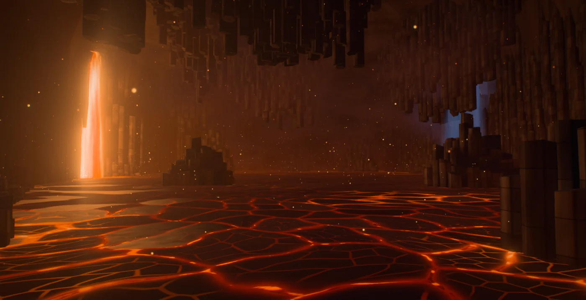
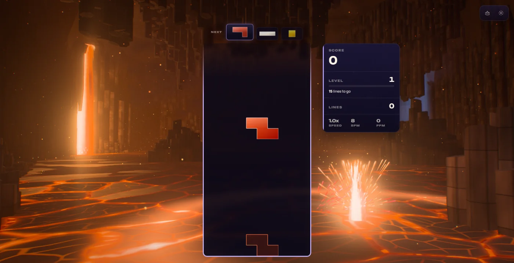
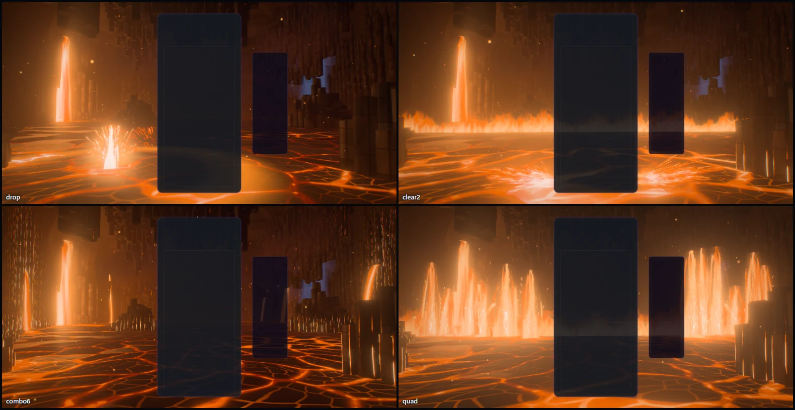
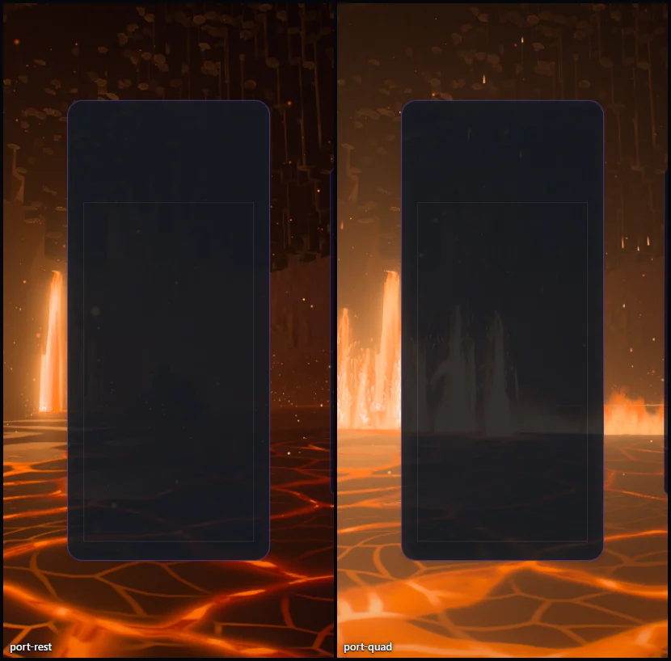
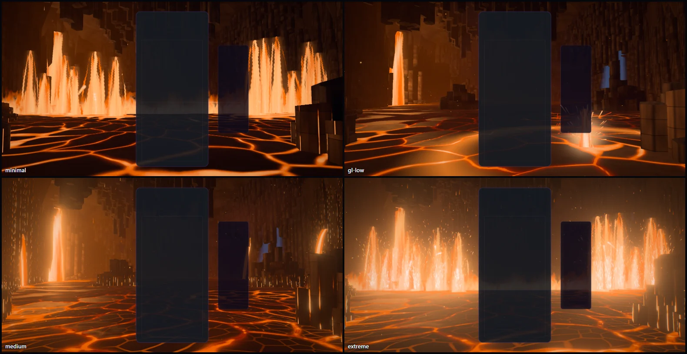

# Cinder Drift — the drifting crust

Implemented 2026-10-08 on `feature/cinder-drift-masterpiece`, with Three.js 0.186.1. A
from-scratch rebuild: it replaces the earlier theme in full (a classic `WebGLRenderer` scene of
one full-screen magma shader, point-sprite embers and smoke, and its GLSL shader module). Cinder
Drift keeps its identity — underground, magma and black rock, smoke and cinders, a strict heat
palette — and everything else is new. This document records the shipped design and what was
verified. It is a reference, not a backlog.

## The picture

A magma chamber deep underground. The viewer stands on a ledge a little above a lake of lava.
Cliffs of columnar basalt close the chamber on both sides and meet in a throat at its far end;
broken columns step down from their feet into the lake, islands of columns stand in the lava,
and more hang from the roof like organ pipes. The great fall pours out of a mouth in the left
cliff. On the right one cold shaft of night comes in through a hole in the roof. Between them
the lake lies under a crust of dark plates, and the crust drifts: from the fall, past the
viewer, away to the right.

The gameplay card covers the middle of the frame, so the picture is built for what stays
visible: the fall to the left of it, the lit island and the nearer stack to the right, the lake
below, the roof above.

## The one idea

The crust is always trying to close, and the board keeps breaking it open. One number decides
how the lake looks at any point — its heat. Cold, the seams between the plates are hairlines.
Warmer, they open and the plates shrink to rafts. Hot, the lake stands open. Everything the
board does is heat put into the lake, and the lake remembers it.

## Event language

| Event | Response |
| --- | --- |
| Piece lock | The piece's heat drops into the lake beside the card — further out the further the piece lies from the middle of the board, further away the higher it lies. A burst of light, a short jet of lava and a crown of drops leap where it strikes; a ring runs out through the crust and the plates part as it passes; the rock near it is lit for an instant; sparks in the piece's colour spray from the card's edge at the piece's own height. The pool it melted **stays**: it drifts away with the plates and takes about a quarter of a minute to skin over, so a run of play leaves a trail of cooling pools across the lake. |
| Hard drop | The same, harder: a taller jet, a wider ring, twice the drops, and the chamber shakes. |
| Line clear | Each cleared row vents sideways out of the card: a tongue of fire and a spray of sparks from both edges at the row's height. A wave runs out through the lake and up the cliffs, one front per line; the seams blaze as it passes. A fissure opens across the lake behind the board: two fountains for one line, four for two, six for three, standing out of a hem of flame that lights the rock around it. |
| Combo | The chamber's pressure rises. The crust thins and drifts faster; lava climbs in the seams between the columns; the fall swells; the cinders storm upward; drops of lava begin to fall from the organ pipes, and under a long chain it rains fire. Every step of the chain past the first cracks another fissure in the cliffs (up to six) that pours a stream into the lake, and veins of light spread through the columns round it. When the chain breaks the chamber lets its breath go and the fissures cool. |
| Four lines / perfect clear | The chamber holds its breath: every light sinks for a quarter of a second. Then the whole fissure stands up as a curtain of fire — twelve fountains out of a wall of flame — a shock runs out through the rock, bombs of lava arc across the chamber on tails of embers and melt the crust where they land, and the lake stands open. |
| T-spin | The crust turns round the foot of the board: a whirl that winds up and lets go. |
| Level up | The chamber burns a different fire: five palettes, cycled (ember, crimson, gold, forge, rose). |

Combo here is the true consecutive-clear combo (one `ComboTracker` per player in
`CinderDriftDirector`); the bus's `COMBO` event is cascade depth (ADR-0011). With several boards
on screen each lock strikes beside its own board, and the chamber takes the longest chain any
board is holding.

## How it is built

| File | Role |
| --- | --- |
| `cinder-drift-core.js` | Three-free constants and maths shared by the plan, the choreography and the shaders: ring and wave timings, how long the lake holds heat, the five palettes, how the camera turns for an aspect. |
| `cinder-drift-layout.js` | The chamber's plan, seeded and deterministic: a height function for the rock and the columns cut from it, with what the light needs per column; the fall and its mouth, the fissure streams, the fountain line, the shore-distance grid. |
| `cinder-drift-heat.js` | Three-free: the lake's memory of heat, a wrapping field in plate space that cools in closed form. |
| `cinder-drift-tsl.js` | Hashes, the baked noise and plate textures, the shared uniforms, the chamber's light (the heat-to-colour ramp, lock rings, clear waves, the curtain's light, the haze every surface fades into). |
| `cinder-drift-lake.js` | The lake: plates, seams, open lava and its skin, the crust's shading. |
| `cinder-drift-rock.js` | The columns (one instanced prism) and the shell behind them. |
| `cinder-drift-falls.js` | Running lava as one instanced ribbon — the great fall, the fissure streams, the fountains, the lock jets — and the fissure's wall of fire. |
| `cinder-drift-air.js` | Embers, smoke, the night's shaft. |
| `cinder-drift-fx.js` | Spatter (drops and sparks), bombs, flashes, row jets. |
| `cinder-drift-world.js` | Owns the uniforms, the parts, the camera rig and the choreography. Shared with the playground effect, so what is iterated there ships. |
| `cinder-drift-director.js` | Renderer-free: stages bus events per player and resolves one lock and one clear per frame. |
| `cinder-drift-composition.js` | Three-free: reads the live card, board and HUD rects and maps board columns and rows onto the screen. |
| `cinder-drift-post.js` | One scene pass, bloom, and one output pass. |
| `cinder-drift-quality.js` | The six tiers. |
| `cinder-drift-theme.js` | Lifecycle, renderer selection, settings, layout watch, GPU-loss recovery, capture flags. |

Techniques worth knowing before changing it:

- **One node renderer on both backends.** `WebGPURenderer` on WebGPU, its WebGL2 backend
  otherwise (or `?forceWebGL`). There is no `ShaderMaterial` and no classic `WebGLRenderer`
  left. Nothing uses compute and nothing is downloaded.
- **Nothing is lit by a light.** Every material shades itself (`MeshBasicNodeMaterial`) from
  shared uniforms: the lake's glow from below, the great fall as a point of light, the night
  through the roof, the board's pulses, and one haze function every surface fades into.
- **The crust is a baked Voronoi with true edge distances** (512², half float, CPU-built mips;
  13 × 13 jittered sites, tileable). The lake reads it in *plate space* — world position minus
  how far the crust has drifted — so the plates ride past as rigid rafts. The seam's half-width
  is a function of heat, compared against the stored distance to the nearest plate edge. A second
  read of the same texture at a finer scale gives the hairline cracks inside a plate and the
  small dark plates that open lava skins over with.
- **Energy survives distance.** Far away the plates are smaller than a pixel and the mip chain
  averages the seams away, so the lake fades from the drawn seams to the *fraction of it that
  stands open at that heat* (the area of a plate within a given distance of its edge). The far
  lake keeps its glow without aliasing.
- **The lake remembers.** `HeatField` is a 192² wrapping field over a 256 m square of plate
  space (longer than the chamber, so a pool's wrapped twin lies beyond the far wall) holding the
  heat as it stood at one reference moment; the shader and its CPU twin both cool it from there as
  `heat · e^(−(t − ref)/hold)`. Writing a pool re-bases the whole field to the present first, so
  the texture is uploaded only when gameplay happens, any number of pools can be alight at once,
  and they drift with the crust for free.
- **A column knows what hides it.** The plan marches from every column toward the open lake and
  toward the fall and stores the height below which its neighbours block that light. The shader
  turns those two numbers into the stepped shadows between rows of columns. A third number is
  how closed-in its cap is, a fourth which way the open lake lies.
- **One prism, one interleaved buffer.** Every column is an instance of a six-sided prism rooted
  under the lake or in the roof; twelve floats per column travel in one
  `InstancedInterleavedBuffer` (WebGPU binds at most eight vertex buffers). Faces roll away
  toward their edges in the shader, so a column reads as worn stone, not a box.
- **The seams between columns are the chamber's veins.** The same edge distance that darkens the
  gap between two columns is where light appears: lava rising with the pressure, and veins
  spreading from each open fissure.
- **Running lava is one ribbon.** The fall, the six fissure streams, the twelve fountains and the
  four lock jets are instances of one strip that follows a ballistic curve (accelerating away
  from a lip, decelerating to a fountain's crown), turns about the vertical to face the camera
  and stretches its texture by the time the lava has been falling.
- **Closed form first.** Embers, drops, sparks, bombs, flashes, rings, waves, fountains and row
  jets are functions of the world clock and event timestamps. Nothing is created at event time:
  events write numbers into ring-buffered uniform slots and preallocated pools, and a pool that
  must be melted later (a bomb landing) waits in a short queue. `seek(t)` plus a fixed-step
  replay reproduces any frame.
- **HDR, single output.** The scene is scene-linear; a max-channel knee selects what blooms (no
  MRT), and one output pass does the heat haze (one blurred noise fetch bends the scene lookup;
  no extra scene taps), the lens fringe, the calm zones on the card and HUD, bloom, shafts
  dragged out of the great fall, a hue-preserving filmic curve, grade, vignette, grain and
  dither. An iris closes as the chamber flares so its colours survive a four-line clear.
  `usesMrtScenePass()` is false.
- **No MaterialX noise.** One tileable fBm texture is baked on the CPU with its own mip chain.

## Tiers

| Tier | Columns | Embers | Smoke banks | Drop pool | Drops per fountain | Bombs | Lake detail | Bloom, shafts | Heat haze | Scene MSAA |
| --- | ---: | ---: | ---: | ---: | ---: | ---: | --- | --- | --- | --- |
| Minimal | 1,668 | none | none | 384 | 28 | 5 | plates | off | off | off |
| Low | 2,424 | 420 | 10 | 1,024 | 70 | 7 | plates, the fall's glint | off | on | off |
| Medium | 3,331 | 900 | 18 | 2,304 | 160 | 10 | full | on | on | off |
| High | 4,577 | 1,600 | 26 | 4,096 | 300 | 14 | full | on | on | 4× |
| Ultra | 5,626 | 2,400 | 32 | 6,144 | 460 | 14 | full | on | on | 4× |
| Extreme | 7,047 | 3,400 | 40 | 8,192 | 620 | 14 | full | on | on | 4× |

A lower tier does not drop columns out of the same plan (that would open holes in the cliffs):
the plan is cut coarser, with wider columns. "Full" lake detail adds the hairline cracks inside
the plates, the skin on open lava and the ragged edges of the rafts (two more texture reads).
Minimal draws no smoke and no shaft of night in the air (the cold light still falls on the rock).
Minimal and Low render at a reduced pixel ratio (0.7 and 0.85).

Every tier keeps the whole picture and every event. These are allocation budgets, not
measurements of frame rate.

## Assets

None. The plan, the columns, the plates, the noise and every effect are generated in code, and
nothing is downloaded. Blender was offered for this pass and was not needed: every shape in the
chamber is a prism, a sheet or a quad, and what makes them read is the plan's light data and
the shading.

## Verification

- Unit tests: 149 new tests in four files (director 21; plan, heat field, core maths and
  composition 42; world 42; theme 44), all passing. The Cinder Drift case left
  `mobile-classic-theme-quality.test.js` (the theme no longer builds a classic
  `WebGLRenderer`), and the Settings URL-parameter reference gained the theme's five capture
  flags (its two catalogue test files pass).
- Whole suite, run once while other sessions kept the machine busy: 689 files, 9,176 tests;
  683 files passed. Five of the six that did not are 5 s and 10 s wall-clock timeouts in files
  this change does not touch (the URL catalogue's source scan, Stellar Drift, the Odyssey world
  bake and forest lever, Earth core); all five pass when run on their own with a long timeout.
  The sixth, `odyssey-level-briefing.test.js`, expects a comma as the thousands separator and
  gets this machine's Swedish-locale space; it fails identically on untouched `main`.
- Gates: typecheck; lint ratchet (804 errors against a baseline of 807: removing the old theme
  took three with it, the new files add none; the baseline was left as it is); theme lifecycle
  audit; dependency boundaries (1,284 modules); production build with the boot-closure guard
  (the theme's chunk is about 89 kB, 34 kB gzipped); IP-string gate; Pages artifact check;
  release gates — all pass. The palette gate fails on `main` and here for the same unrelated
  reason (Stillwater); Cinder Drift scores 3/7 on it, as before (its piece colours are
  unchanged).
- Playground captures on WebGPU (RTX 3070 Laptop), on the final code: rest with and without
  the board; a hard drop; a two-line clear; a held chain of six; four lines 1.6 s and 3.9 s
  after the clear (the curtain, then the bombs in flight) and 0.65 s into a chain of five;
  Minimal, Medium and Extreme; High and Low on the forced WebGL2 backend; an upright 430 × 852
  frame at rest, through a hard drop and through a four-line clear. Sixteen frames, no console
  errors or warnings. Earlier in the pass, on code that differs from the final only in tuning:
  one- and three-line clears, the hush, a T-spin, a perfect clear, chains of three and eight,
  the other four palettes, reduced motion.
- In the real game (Electron, dev server, single player; `unlockAll=1`, because the theme is a
  collection reward and a fresh profile does not own it): the theme starts on WebGPU, aims its
  events at the live board, takes a bus-injected hard drop, locks, clears, a chain and four
  lines, survives a live quality change (High to Medium) and lets go of its canvas when another
  theme takes over. The same event script ran clean on the WebGL2 backend at Low. Both runs
  were repeated on the final code: no console errors or warnings in either.
  `scripts/validate-all-themes.mjs --theme cinder-drift` was queued behind other sessions' GPU
  jobs and timed out after fifteen minutes without getting a turn: it has not been run.
- A second agent wrote the tests and reviewed the CPU-side code. What it found, all fixed and
  covered: a four-line clear spent the ring, flash and drop pools that a lock in the same frame
  was using (bomb landings now take theirs when they land, a curtain's drops are budgeted per
  tier, flashes have twice the slots); bombs could come down inside rock; a lock took the
  upright placement on any window whose card ended above 90% of its height, which includes
  1080p; the heat memory tiled inside the chamber (a pool had a twin 128 m up the lake); the
  arch over the fall's mouth was inverted where the roof was lower than the arch; two fountains
  and three stream feet stood in rock; an upright phone taller than the capture lost the fall
  off the left edge; events were stamped with the previous frame's clock; a palette snap was one
  ulp off, so a replay was not bit-exact.

Observed, not measured (the page's animation-frame cadence over the event script at
1584 × 813, while other sessions were using the CPU and the GPU): a mean of 7.7 to 7.9 ms
(about 128 fps) at High on the RTX 3070, 99th percentile 9 to 15 ms, no frame over 66 ms; the
same on the WebGL2 backend at Low.

Not verified: GPU cost per tier through the theme perf lane (ADR-0016); the integrated GPU;
physical phones; local multiplayer and Infinity layouts in a capture (their routing is
unit-tested only); a window larger than 1584 × 813, which is the largest this laptop's screen
allows (so the 1080p lock placement is fixed by reasoning and a unit test, not by a capture);
the icon on an Odyssey level orb; sessions of several hours. The scene was judged from stills
and seeked sequences: nobody has yet watched it run in real time, so the speeds (the crust's
drift, the flicker of the fall, how long a pool takes to skin over) are set by calculation.
`docs/theme-screenshots/cinder-drift.png` still shows the previous artwork (a fleet capture
writes it).

## Reproduce

Run `npm run dev:playground`, then:

`/playground.html?effect=cinder-drift&t=20&quality=High&board=1`

Add `event=lock|drop|clear|quad|tspin|perfect|levelUp` with `eventAge=<s>`, and `combo=<n>`,
`level=<n>`, `lines=<n>`, `u=<0..1>`, `row=<r>`, `color=<hex>`. `locks=<n>` plays n locks first,
so their pools are drifting in the lake when the event fires. `demo=1` (without `t`) plays a
looping script. `parts=` draws only the named parts; `falseColor=1` bands the pre-tone-map
peak; `noPost=1` shows the raw scene; `forceWebGL=1` uses the WebGL2 backend; `reduce=1` is
reduced motion. In the game: `?cinderDriftTime=`, `?cinderDriftFixedDt=`, `?cinderDriftParts=`,
`?cinderDriftFalseColor=1`.

The theme icon is a frame of the scene through the playground's icon lens, at rest with two
pools cooling in the lake (the fall over the cracked crust, which is also what the previous icon
showed):

`/playground.html?effect=cinder-drift&t=20&quality=Extreme&icon=1&iconFov=50&iconYaw=0.4&iconPitch=-0.14&locks=2`

captured in an 840 × 840 window, cropped to 77% of the frame around a point 3% below its
centre, given a colour lift (brightness 1.1, contrast 1.18, saturation 1.2) and baked as a
512 px circle on a transparent ground. The same file is kept at
`public/assets/themes/cinder-drift-theme-icon.png`. The capture was taken before the last small
changes to how open lava is coloured, so a new capture of that URL differs a little in the
pools: the icon is reproducible to the eye, not to the byte.

## Captured previews

