# Crystal Cave — the resonant hall (visual overhaul, 2026-10-05)

**Status: implemented (branch `feature/crystal-cave-masterpiece`). A record of what was built
and how it was checked — not a backlog.** Supersedes the "jeweled cathedral" overhaul of the
same week (commits `ee1f1c7a`, `f353a924`), whose flat-shaded procedural cave this replaces
and whose record is in this file's history.

| Before | After (High, native WebGPU) |
| --- | --- |
| 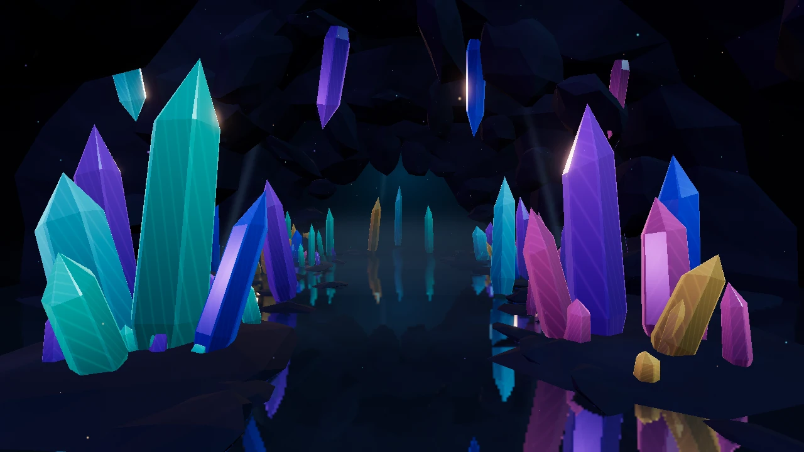 | 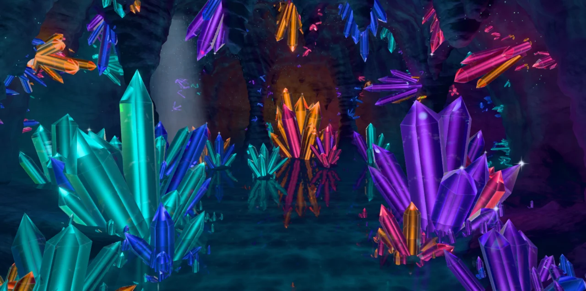 |

## What the player sees

A hall of rock under a hanging vault, a still pool running its length. Turquoise crystals
fan out of the left bank and an amethyst geode out of the right; spars of amber and rose
grow from the walls above them, chandeliers of crystal hang between the stalactites, and at
the far end of the hall a warm amber heart stands on an island and lays its reflection
down the water. A shaft of pale light falls through a chimney in the vault, glow-worms
pick out the ceiling, and every stone carries a slow light of its own that climbs it out of
step with its neighbours.

The crystals are not painted: each one is traced. You look into them, see the far faces
through the near ones, a filament of fire on the axis, the veils of earlier growth, and now
and then the rainbow of a healed fracture; as the view drifts, facets flash.

The board card hides the middle of a landscape screen, so the picture is composed for the
two side thirds and the strips above and below the card. Portrait keeps the same cave with
a wider lens; there the card covers most of the screen and the cave is a margin.

| Inside the stones | In the game |
| --- | --- |
| 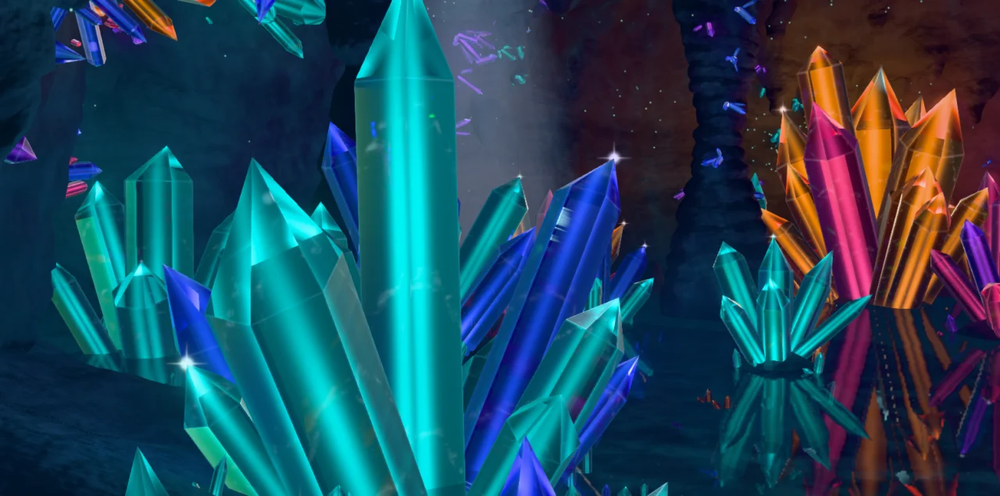 | 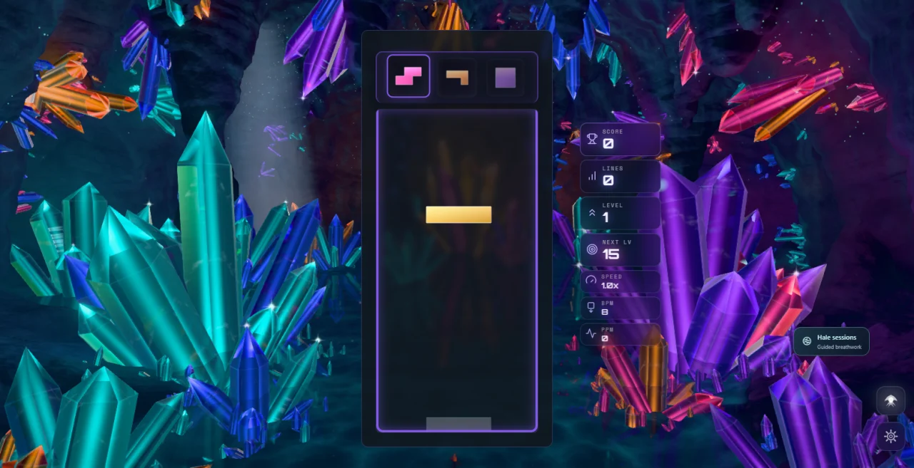 |

## How the cave answers the game

`CrystalCaveReactions` is a pure director. It keeps a brightness per mineral family, the
cave's excitement and its hum, and hands the world a short list of cues described on the
board (which side, how high, how strong). The world turns cues into light at the card's
edge beside the action.

Every tetromino belongs to a mineral family through its colour — T and L aqua, O amethyst,
Z sapphire, S rose, I and J amber — and that family's crystals answer it.

| Event | Response |
| --- | --- |
| Piece lock | A glint where the piece landed; motes of its colour leave the card's edge beside it, shedding glitter, and cross to crystals of its mineral on that side. Each stone they reach rings — a pulse of light runs from its root to its tip, which flashes — and that family glows brighter through the whole cave, on the rock around it too. A ring spreads on the water under the piece. A long hard drop (`HARD_DROP` distance) sends more and shakes glitter out of the vault. |
| Line clear (1–3) | A prismatic fan bursts from both sides of the card at the cleared rows; a wave of light leaves the board and every crystal in the hall rings as it passes, the rock with them; rings cross the pool; and new crystals grow at the water's edge, one cluster per line. They stay for the rest of the game. |
| Four lines | All of that, a second fan and a second wave, the skylight flares and the vault rains light. |
| Combo / streak | Crystal tips link into a lattice of beams. Cascade depth (`COMBO`) or consecutive clearing locks add links, reaching deeper into the hall, while the stones hum with standing bands of light. A lock that clears nothing breaks the chain and the lattice falls as sparks. |
| T-spin | A pinwheel of sparks and a star beside the board. |
| Back-to-back | Holds the hum and the lattice. |
| Perfect clear / level up | The heart of the cave answers: it flares, and the wave runs from the far end of the hall toward the player. |
| Game over | The cave dims, what grew during play withdraws, and the light slowly returns. |

Everything honours `backgroundComboEffects` and `pieceLockRipple`, pauses with the theme
and is driven by simulation seconds. No event allocates: sparks, fans, beams, rings and
scheduled follow-ups all come from fixed pools, and the sprouting crystals are part of the
crystal field from the start, scaled to nothing until play grows them.

| Hard drop | Three lines | Four lines |
| --- | --- | --- |
| 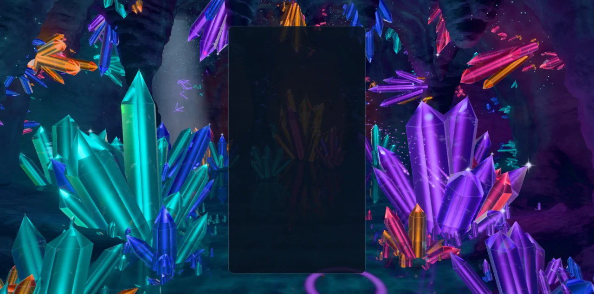 | 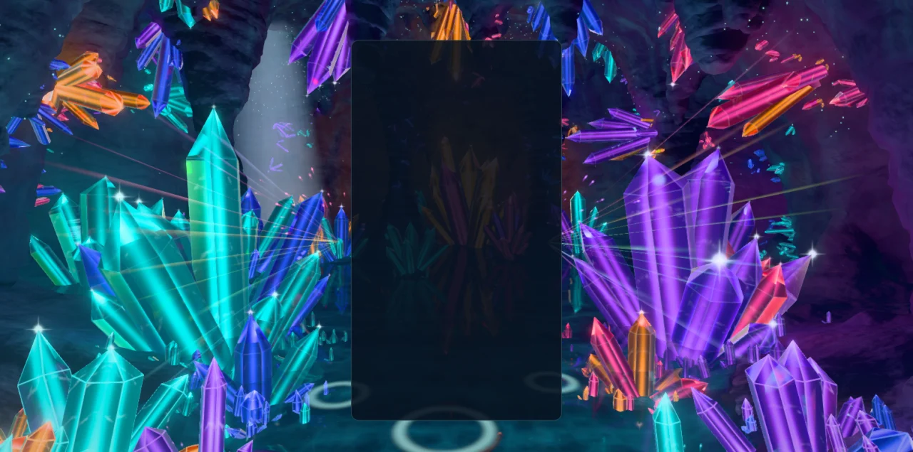 | 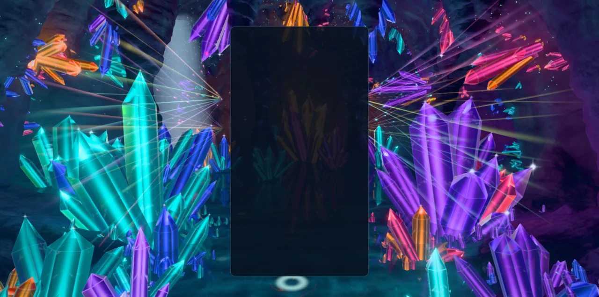 |

| Combo ×7 | Perfect clear |
| --- | --- |
| 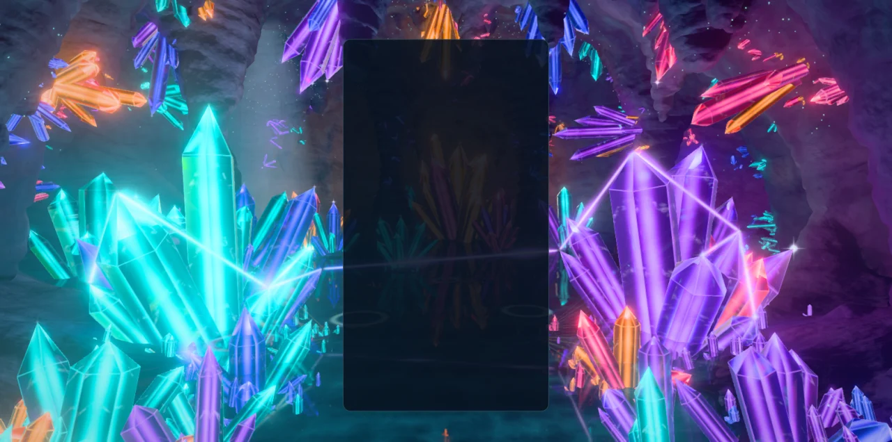 | 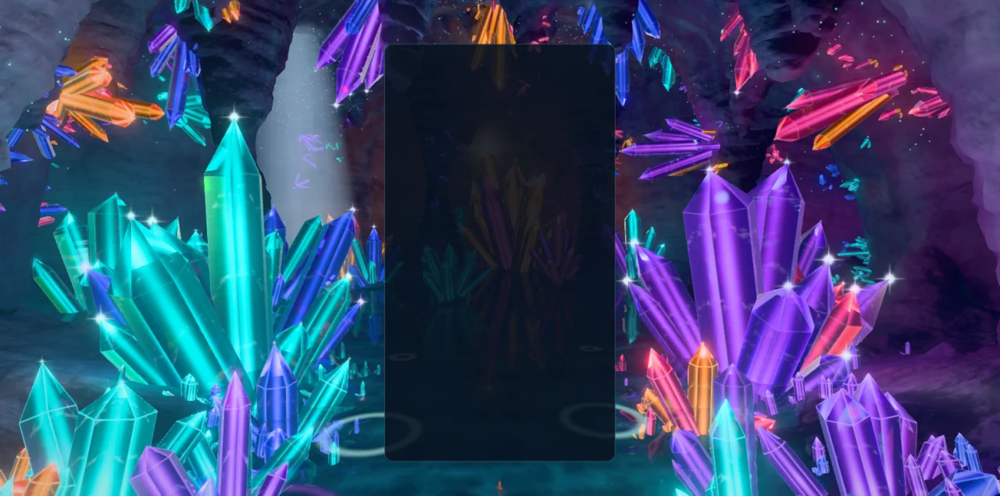 |

## How it is built

### The cavern is authored in Blender

`scripts/blender/crystal_cave_assets.py` sculpts the hall from two height fields (floor and
vault; where they meet there is rock, so walls, columns and the ends of the hall all fall
out of the same data), voxel-remeshes it, gives it lumps, ridges and bedding ledges, and
decimates it to about 146,000 triangles. It then roots every authored cluster on that rock
by ray cast and grows it as a burst, adds a carpet of small points around each root and
veins of them along the walls — about 2,100 crystals — and finds the glow-worm colonies and
the stalactites that drip.

Then it bakes light. The crystals of one mineral family become the only lamps in the scene
and Cycles records the light, direct and bounced, that reaches every vertex of the rock;
that is repeated for each of the five families, for the pool, for a lamp shining down the
skylight's chimney, and for ambient occlusion. The result is eight numbers per vertex, plus
the direction most of the light arrives from.

The generator runs **headless** (`blender --background --factory-startup`). The Blender
session on this machine was holding another project's unsaved scene, so it was not
touched; the script works in its own scene and removes it, and is equally runnable inside a
session. One file comes out, `cavern.glb` (3.6 MB, no textures, no third-party source).
Formats, the regeneration command and the bake are described in
[`src/themes/crystal-cave/assets/ATTRIBUTION.md`](../src/themes/crystal-cave/assets/ATTRIBUTION.md).

### Runtime modules (`src/themes/crystal-cave/`)

| Module | Owns |
| --- | --- |
| `crystal-cave-theme.js` | Lifecycle, renderer, the asset load, gameplay subscriptions, board tracking. |
| `crystal-cave-assets.js` | Loading and decoding the GLB. |
| `crystal-cave-world.js` | Composition root: builds everything below, frames the camera, turns cues into light. |
| `crystal-cave-light.js` | The five families, the environment the crystals reflect and refract, the haze, a shared noise. |
| `crystal-cave-gems.js` | The crystals: one instanced draw, traced in the fragment shader. |
| `crystal-cave-rock.js` | The cavern, lit from its baked channels. |
| `crystal-cave-water.js` | The pool: mirror, see-through bed, rings. |
| `crystal-cave-air.js` | Glow-worms, the skylight's beam, dust, glints on crystal tips. |
| `crystal-cave-effects.js` | The three event pools: sparks, prismatic fans, lattice beams. |
| `crystal-cave-reactions.js` | The event director (pure). |
| `crystal-cave-stage.js` | Board card → world. |
| `crystal-cave-post.js` | Bloom, tone curve, grade, FXAA. |
| `crystal-cave-quality.js` | One table for everything a tier scales. |

### Techniques (three 0.186.1)

- **Analytic gem tracing.** Every crystal is the same convex solid — a hexagonal prism
  closed by a six-faced termination, thirteen planes — so the fragment shader intersects
  rays with it exactly. It refracts the view ray at the facet, follows it from face to
  face with Fresnel and total internal reflection, absorbs by path length, and splits the
  first exit into three wavelengths. The fire on the axis is a Gaussian filament whose
  integral along a straight ray has a closed form, so its parallax is exact with no
  marching. Growth phantoms are level sets of the termination planes; a fracture is one
  more plane crossing. No backdrop pass and no transparency sorting: the crystals are
  opaque geometry in one instanced draw, sorted nearest first so the depth test spares the
  shader the stones behind.
- **Baked light that still moves.** The rock is unlit geometry carrying eight baked
  scalars. The shader multiplies each by its source's current colour and level, so a
  family that flares in play flares on the stone around it with the bake's soft shadows
  and bounce, at no lighting cost. Fine relief is lit from the baked dominant direction;
  the pool's channel carries an animated caustic net up the walls.
- **One pool, two regimes.** Near the player the surface refracts the lit bed through the
  backdrop (`viewportSharedTexture`, thickness from `viewportLinearDepth`); toward the
  distance Fresnel hands over to a planar mirror (`reflector()`). Rings are real slopes:
  they bend the mirror and the bed and leave a luminous crest.
- **A fixed far field.** Reflection and refraction read one small environment function
  (pool-lit floor, dark vault with hashed glow-worms, four lobes, the board's flash), a
  real WGSL function called many times per fragment.
- **CPU-simulated sparks.** A few hundred points in a fixed pool: the same code on both
  backends, in the playground's deterministic `seek`, and in the unit tests.

Two r186 behaviours cost time and are now in the TSL skill's gotcha table: a helper given
`setLayout` must not sample a texture captured from outside it, and one NaN fragment
(Schlick's `pow` on a cosine a hair above one) blacks out the whole frame through bloom.

### Quality tiers

| Tier | Ray segments | Dispersion / inclusions | Pool | Small crystals | Sparks / fans / beams / rings | Post | DPR cap |
| --- | ---: | --- | --- | ---: | --- | --- | ---: |
| Extreme | 4 | yes / yes | mirror 0.50, refracting | 100 % | 640 / 8 / 14 / 12 | on | 1.50 |
| Ultra | 3 | yes / yes | mirror 0.45, refracting | 100 % | 520 / 6 / 12 / 10 | on | 1.35 |
| High | 3 | yes / yes | mirror 0.38, refracting | 100 % | 400 / 6 / 10 / 8 | on | 1.25 |
| Medium | 2 | no / yes | mirror 0.28, refracting | 70 % | 260 / 4 / 8 / 6 | on | 1.00 |
| Low | 1 | no / no | no mirror, alpha | 40 % | 140 / 3 / 5 / 4 | off | 0.90 |
| Minimal | 1 | no / no | no mirror, alpha | 25 % | 80 / 2 / 3 / 3 | off | 0.75 |

Every tier draws the same cavern, every crystal of any size, and the whole event
language. Low and Minimal draw the scene directly with the same tone curve and no bloom.
The application's render scale also applies to the DPR cap.

| WebGL2 backend, High | Low (no post, no mirror) | Portrait, Low, WebGL2 |
| --- | --- | --- |
|  | 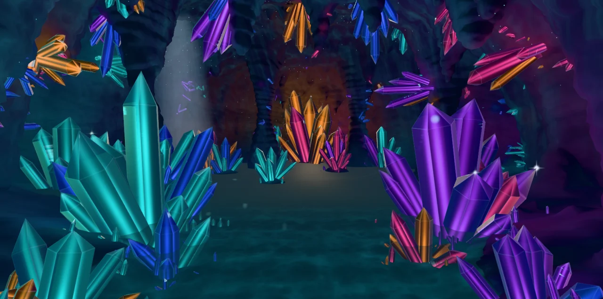 | 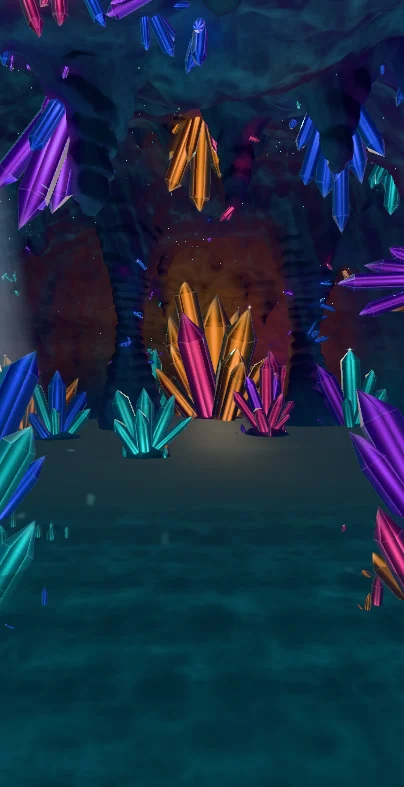 |

## Verification

- **Playground** (`npm run dev:playground`, `?effect=crystal-cave&orbit=0&hud=0`): the
  captures above, each with a clean console (no WebGPU validation errors, no TSL
  warnings), on native WebGPU (RTX 3070 Laptop GPU) and with `forceWebGL=1`. Events are
  reproducible with `&t=14&event=lock|drop|clear|double|triple|quad|combo|spin|perfect|level|over`,
  `&eventAge=<s>`, `&col=0..9&row=0..19`, `&piece=T`, `&combo=<n>`, `&grown=<n>` and
  `&board=1` for a stand-in card; `&view=left|right|hall|deep|icon` or
  `&eye=x,y,z&aim=x,y,z&fov=n` for other lenses.
- **In the game** (dev server, real single-player mode, events through the real event
  bus): High on native WebGPU and Low with `forceWebGL=1`, no console errors on either; a
  live quality change rebuilt the scene and leaving the theme released its canvas.
  `node scripts/validate-all-themes.mjs --theme crystal-cave` against the same server —
  PASS, 0 lifecycle failures, 0 console errors (activation, teardown, re-activation).
- **Phone emulation**: `scripts/validate-mobile-webgl2.mjs --theme crystal-cave` (software
  WebGL2, 390 × 844 and rotated) — PASS at Low and at Minimal. The first Low run was
  recorded as failed because the software browser did not close within the harness's 5 s
  while other jobs were loading the machine; no theme error was logged, and the re-run on
  a quieter machine passed, as did Fall beside it as a control.
- **Build**: `npm run build` — boot closure OK; the theme chunk is 74 kB before gzip and
  `cavern.glb` is emitted beside it. IP-string, Pages-artifact, release and perf-budget
  gates pass.
- **Static checks**: lint ratchet at its baseline (no new errors), type check, theme
  lifecycle audit, dependency boundaries and architecture fitness pass.
- **Tests**: 189 tests in five suites under `tests/unit/crystal-cave-*.test.js` — the
  director (69), the asset pack and its manifest (17), the world, stage and crystal
  geometry built from the real GLB in Node (25), the post chain (18) and the theme
  adapter (60). A full run on the final code (`npx vitest run --maxWorkers=6`, other
  sessions loading the machine): 6,449 tests, 6,444 passed, 3 skipped, and three
  wall-clock failures outside this theme — `odyssey-forest` (300 ms bake budget) and
  `odyssey-forest-lever` (10 s hook), which fail identically on an untouched main
  checkout under the same load, and a timeout in `stellar-drift-reactions`, which passes
  when run alone.
- **Icon**: `crystal-cave-theme-icon.png` is a frame of the rebuilt scene in the house
  style (512 × 512 circle), from
  `?effect=crystal-cave&t=14&orbit=0&hud=0&quality=Ultra&view=icon&event=double&eventAge=1.9`,
  checked at the picker's 80 px beside its neighbours.

### Frame cost (indicative readings, not a budget)

An uncapped-frame-rate probe of the playground effect (vsync off, 1584 × 813, pixel
ratio 1, six seconds, other sessions using the machine): about 4 ms a frame at High on
the RTX 3070 Laptop GPU, and 11–13 ms a frame at Low, Medium and High on the laptop's
integrated Radeon. These are single readings from a scratch instrument on a shared
machine, so by ADR-0016 they may not be quoted as a budget or a comparison. The theme
perf lane was not run. No measurement exists for a phone.

## Known limits

- The crystals do not show each other through themselves: what a ray sees on leaving a
  stone is the fixed far field, not the neighbouring crystal or the rock behind it.
- The baked light is fixed to the authored layout. The crystals that sprout during play
  add their own glow and pulses but cast no light on the rock.
- The skylight's beam is an analytic cone; stalactites do not cut it.
- Portrait is the landscape cave seen through a wider lens: the two hero clusters sit at
  the edges of the frame.
- Low and Minimal have no mirror: the far water carries a painted path of light instead
  of a reflection.
- Nothing here was measured on a physical phone or with the theme perf lane.
