# Fall — the enchanted grove (visual overhaul, 2026-10-05)

**Status: implemented (branch `feature/fall-enchanted-forest`). A record of what was built
and how it was checked — not a backlog.** Supersedes the "amber glade" rebuild of the same
week (`reports/fall-overhaul/README.md`), whose flat-shaded procedural grove this replaces.

| Before | After (High, native WebGPU) |
| --- | --- |
| 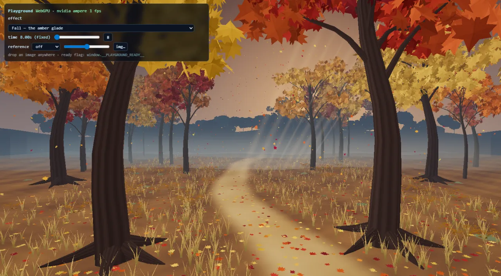 | 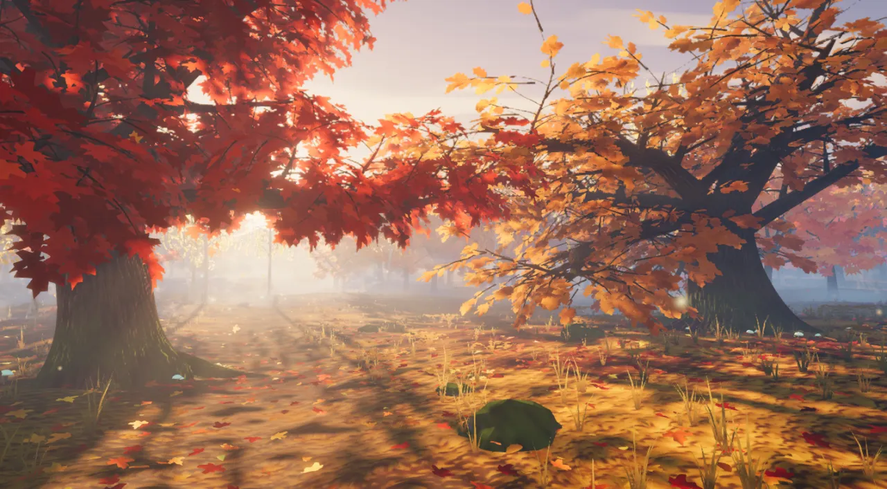 |

## What the player sees

A low sun stands behind an old autumn wood. An ancient maple frames the left of the
screen and a spreading oak the right; between them a leaf-strewn path winds toward the
light, birches hang gold in the glare, and the forest goes on into haze. Sun shafts are
real volumes carved by the canopy, trunk shadows rake across the floor toward the
camera, and every leaf is a translucent blade that glows when the sun is behind it.
Leaves let go of the crowns, swing down, land, and are taken up again by the wind.

The board card hides the middle fifth to quarter of a landscape screen, so the picture is composed
for the two side thirds and the strips above and below the card. Portrait keeps the
same world with a wider field of view; there the card covers most of the screen and the
grove is a margin.

## How the grove answers the game

`FallReactions` is a pure director; `FallLeafDirector` turns its emitters into leaves
thrown from behind the board card, at the height and on the side where the event
happened.

| Event | Response |
| --- | --- |
| Piece lock | A puff of leaves from the card's edge beside the piece, at the piece's row; the leaves lying under it jump. A long hard drop (`HARD_DROP` distance) makes it harder. |
| Line clear (1–3) | Twin jets of leaves blown out of both sides of the card at the cleared rows; warmer light; from two lines a gust front crosses the forest, bending trees and lifting litter as it passes. |
| Four lines | All of that, a shower from the lower boughs, and a sunburst (shafts and bloom swell). |
| Combo / streak | A leaf vortex winds around the board. Cascade depth (`COMBO`) or consecutive clearing locks raise it; it climbs and speeds up, and above ~55 % its leaves glow like embers. A lock without a clear ends the streak and the column unwinds. |
| T-spin | A spiral flourish beside the board. |
| Back-to-back | Holds the vortex and lifts the lanterns. |
| Perfect clear / level up | The whole grove exhales: shower, front, wisps and lantern caps flare. |
| Game over | The wind dies and the leaves settle. |

Everything honours `backgroundComboEffects` and `pieceLockRipple`, pauses with the theme,
and is driven by simulation seconds. No event allocates: leaves come from a fixed hidden
reserve and emitters from a fixed pool (4–16 by tier).

| Hard drop | Three lines | Four lines |
| --- | --- | --- |
| 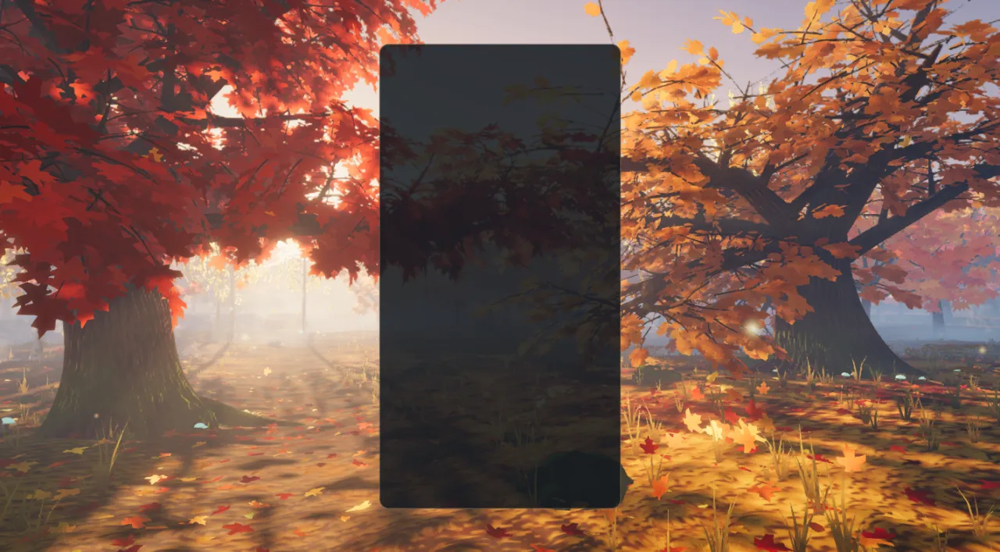 | 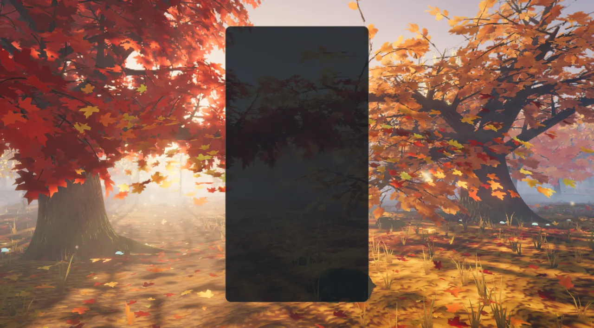 | 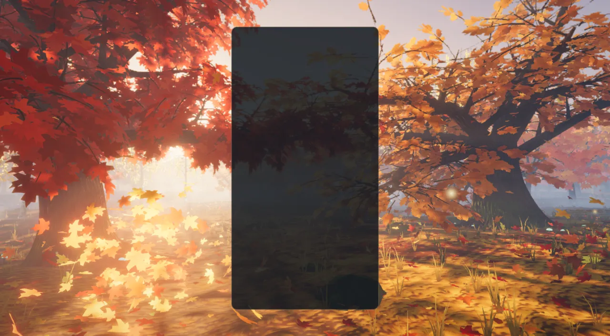 |

| Combo ×12 | Perfect clear | In the game (production build) |
| --- | --- | --- |
| 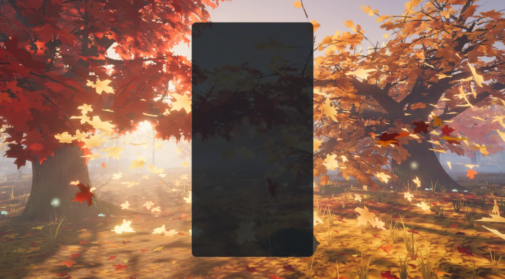 | 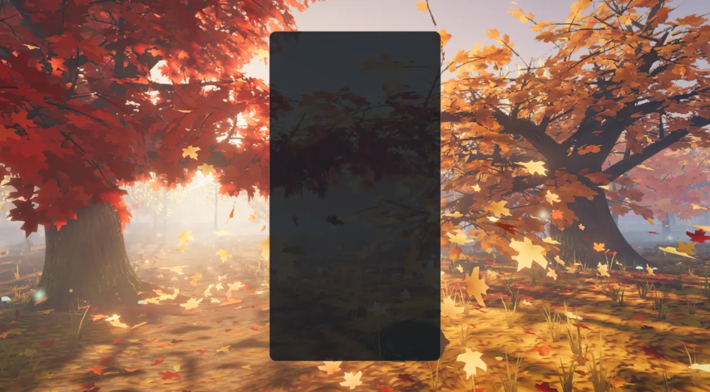 | 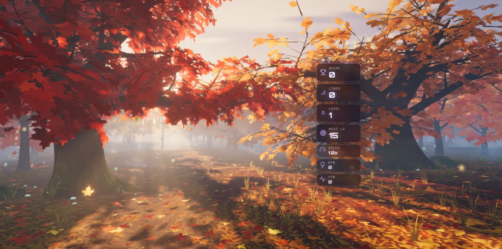 |

## How it is built

### Trees authored in Blender

`scripts/blender/fall_grove_assets.py` grows seven specimens (hero maple, hero oak, three
grove maples, two birches), bakes bark ambient occlusion in Cycles, renders the
distant-forest sprite sheet, and writes compact GLBs with its own quantising writer.
A tree file holds a bark mesh and a point cloud of *foliage sites* — not leaves; the
runtime instances shared sprays of real lobed leaf geometry onto the sites. Details,
formats and the regeneration command are in
[`src/themes/fall/assets/ATTRIBUTION.md`](../src/themes/fall/assets/ATTRIBUTION.md).
The pack is 3.4 MB: nine files, no third-party source.

The generator runs **headless** (`blender --background --factory-startup`). The Blender
MCP session on port 9876 was holding another project's unsaved scene during this work,
so it was only read from, never written to; the script is still runnable inside a
session (it works in its own scene and removes it).

### Runtime modules (`src/themes/fall/`)

| Module | Owns |
| --- | --- |
| `fall-theme.js` | Lifecycle, renderer, asset loading, gameplay subscriptions, board tracking. |
| `fall-assets.js` | Loading and decoding the GLBs and the sprite sheet. |
| `fall-world.js` | Composition root: builds and updates everything below. |
| `fall-light.js` | The sun, its static shadow map, haze, ambient, wind, a shared noise texture. |
| `fall-composition.js` | Camera framings, hand-placed trees, the procedural grove layout, the visibility test. |
| `fall-terrain.js` | Heightfield, path, ground material. |
| `fall-forest.js` | Bark and foliage instancing and their materials. |
| `fall-backdrop.js` | The sprite forest and the wooded ridges. |
| `fall-understory.js` | Leaf litter, grass, ferns, stones, lantern caps. |
| `fall-atmosphere.js` | Sky, mist banks, sun motes, wisps. |
| `fall-leaf-sim.js` | The leaves in the air (pure typed-array simulation). |
| `fall-leaves.js` | Drawing them. |
| `fall-reactions.js` | The event director (pure). |
| `fall-stage.js`, `fall-leaf-director.js` | Board card → world, and emitters → leaves and force fields. |
| `fall-post.js` | Volumetric shafts, bloom, grade, FXAA. |
| `fall-quality.js` | One table for everything a tier scales. |

### Techniques (three 0.186.1)

- **One static shadow map, used everywhere.** Materials stay unlit `MeshBasicNodeMaterial`
  and call a shared `shadow(light)` node themselves; the grove never moves under a fixed
  sun, so `light.shadow.autoUpdate` is off and the map is drawn over the first frames
  only. Ground, bark, leaves, sprites, mist and motes all read it — a falling leaf
  flares as it crosses a shaft.
- **Volumetric shafts with `GodraysNode`.** r186's shadow-map raymarch, half resolution,
  bilateral blur, added as sunlit air over a cool shaded haze. First use in this repo;
  it runs on native WebGPU and on the forced-WebGL2 backend.
- **Thin-blade foliage.** Front light, transmitted light when the sun is behind the
  blade, a baked sky-visibility term and bent normal per spray, and a per-tree position
  on a species colour ramp. No alpha cards, so no overdraw and no alpha-test shimmer.
- **Global instancing.** Every spray of every tree is an instance in eight draws. Sprays
  that can never be on screen (above or behind the camera in both framings) are dropped
  at build time. The whole scene is about 50 draws.
- **Data sprites for the far forest.** One Blender-rendered sheet storing shade, leaf
  mask and hue seed gives every distant tree its own colour, lit and hazed like the rest,
  and casting into the same shadow map.
- **CPU leaf simulation.** A few thousand leaves in typed arrays: the same code on both
  backends, in the playground's deterministic `seek`, and in the unit tests.

Three r186 behaviours cost time and are now in the TSL skill's gotcha table: a shadow
*caster* must not sample the shadow map in its `colorNode` (use `fragmentNode`),
`GodraysNode` needs the shadow rig built before its own graph, and `bilateralBlur` needs
the pass texture rather than the node.

### Quality tiers

| Tier | Grove / far trees | Sprays kept | Leaves in the air | Shafts | Post |
| --- | --- | --- | --- | --- | --- |
| Extreme | 30 / 190 | 100 % | 4,200 | 40 steps | on |
| Ultra | 27 / 160 | 100 % | 3,400 | 32 steps | on |
| High | 24 / 130 | 86 % | 2,600 | 26 steps | on |
| Medium | 18 / 90 | 60 % | 1,600 | 16 steps, 0.35 scale | on |
| Low | 13 / 60 | 34 %, no twigs | 900 | analytic glow in the haze | off |
| Minimal | 9 / 40 | 24 %, no twigs | 500 | analytic glow in the haze | off |

Low and Minimal draw the same scene directly with ACES tone mapping and skip the twig
geometry (the bark index buffer is ordered so a tier can stop before it). At High the
scene is about 1.2 M triangles; at Minimal about 0.35 M. The historical
`QUALITY_PRESETS` table in `fall-theme.js` is kept unchanged for its existing readers.

| WebGL2 backend, High | Low (no post) | Portrait, Low, WebGL2 |
| --- | --- | --- |
| 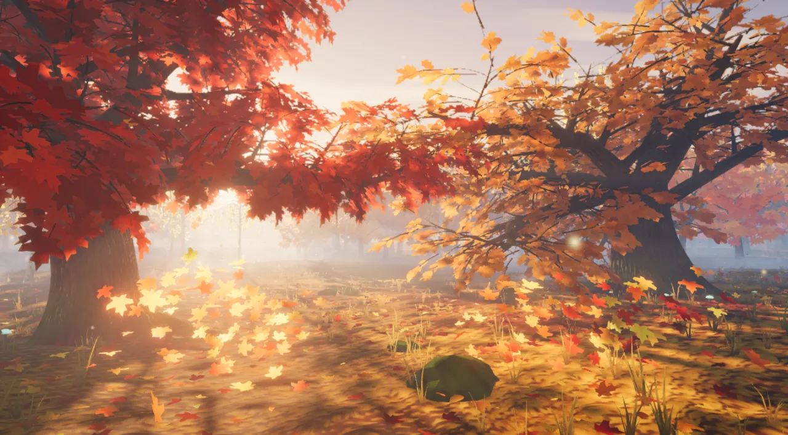 | 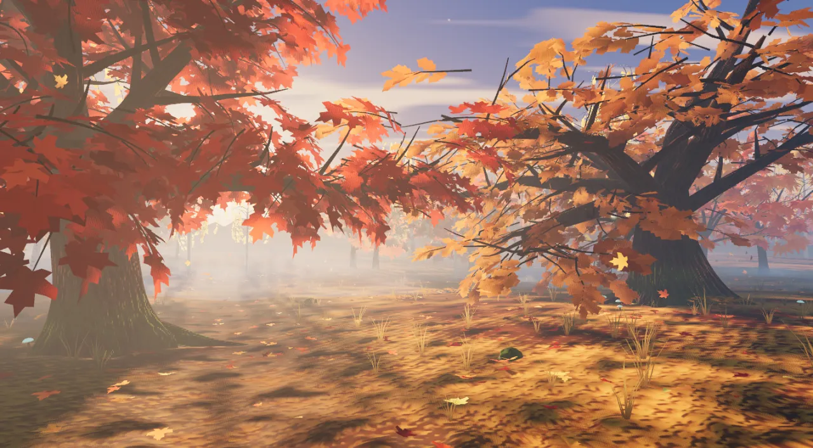 | 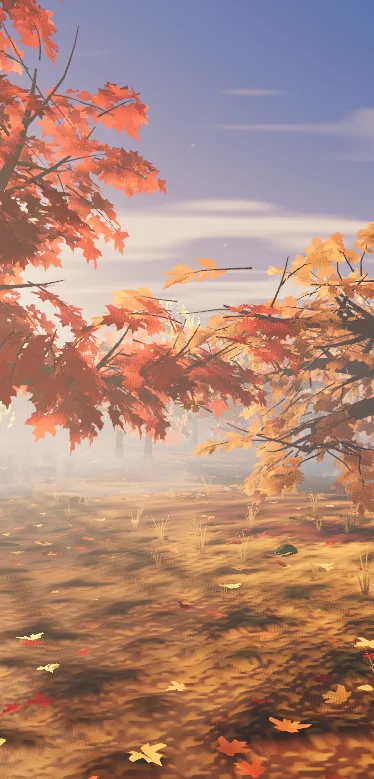 |

## Verification

- **Playground** (`npm run dev:playground`, `?effect=fall&orbit=0&seed=271&hud=0`): the
  captures above, each with a clean console (no WebGPU validation errors, no TSL
  warnings), on native WebGPU and with `forceWebGL=1`. Events are reproducible with
  `&t=8&event=lock|drop|clear|double|triple|tetris|combo|streak|spin|perfect|level`,
  `&eventAge=<s>`, `&col=0..9&row=0..19`, `&combo=<n>` and `&board=1` for a stand-in card.
- **In the game**: `node scripts/validate-all-themes.mjs --theme fall` on a production
  build — PASS, 0 lifecycle failures, 0 console errors (activation, teardown,
  re-activation).
- **Build**: `npm run build` — boot closure OK; the theme chunk is 80 kB before gzip.
- **Lint**: 0 ESLint errors in `src/themes/fall` and the playground effect.
- **Tests**: 279 tests in six suites under `tests/unit/fall-*.test.js` — the director (46), the asset pack
  and its manifest (51), the leaf director and stage (38), the leaf simulation (31), the theme adapter (63)
  and the world and post (50, built from the real GLBs in Node).

### Frame cost (one reading, not a budget)

Theme perf lane, High, native WebGPU on the RTX 3070 Laptop GPU (mains power), pins held,
10 s idle window, 51 draws and 1.22 M triangles on both visits:
GPU 1.51 ms p50 / 1.84 ms p95; wall 7.7 ms p50 / 8.6 ms p95, one frame over 16.7 ms.
**The cell is marked inadmissible by the lane** ("the theme also resets renderer.info"),
and other sessions were using the machine, so by ADR-0016 these numbers may not be quoted
as a budget or a comparison. In steady state nothing on the Fall path resets
`renderer.info` (probed); the reset is not understood yet. No measurement exists for
integrated or phone GPUs — the lower tiers are untested on real low-end hardware.

## Known limits

- Portrait composition is the landscape world seen wider: the two hero trunks are out of
  frame and the upper strip is mostly sky.
- The shadow map is static, so swaying crowns do not move their shadows.
- Leaf, bark and ground detail are procedural in the shader; there are no texture maps.
- Low and Minimal have no shafts, only a warmer haze toward the sun.
- The far sprites face one camera; they are not meant to be seen from elsewhere.
