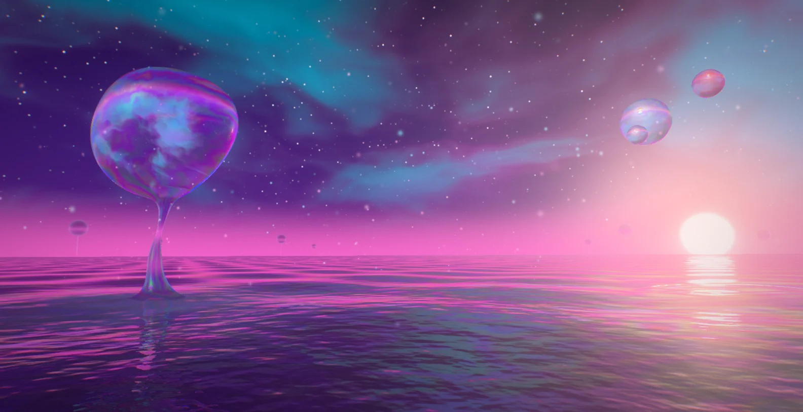
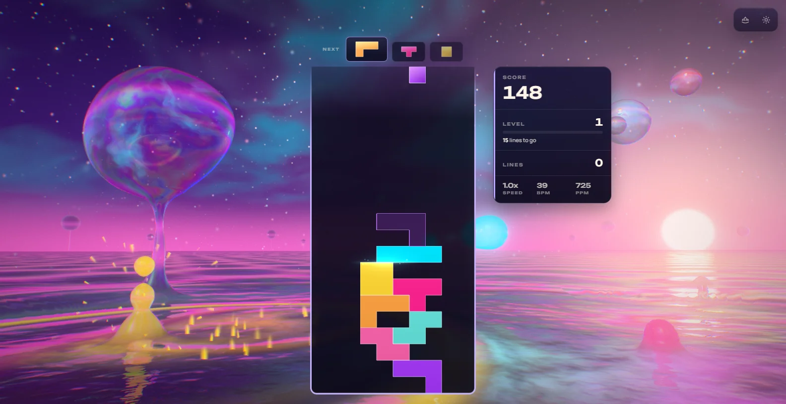
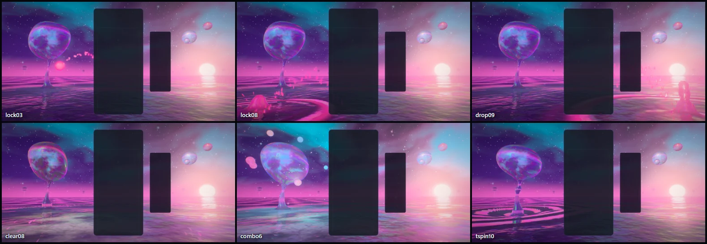
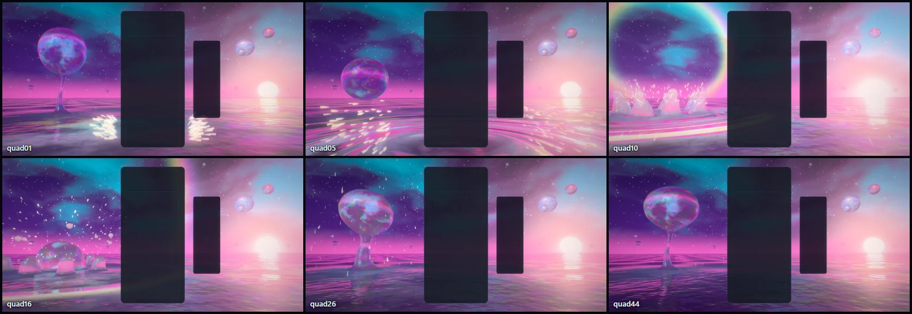
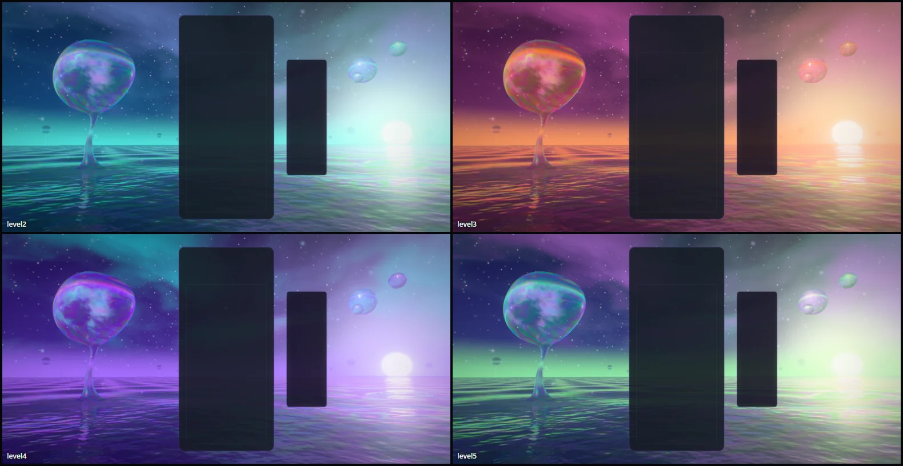
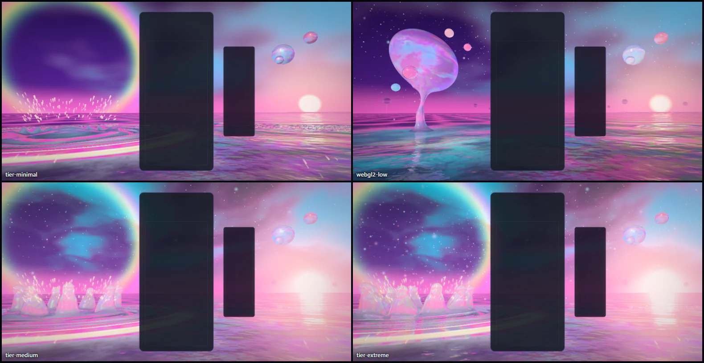
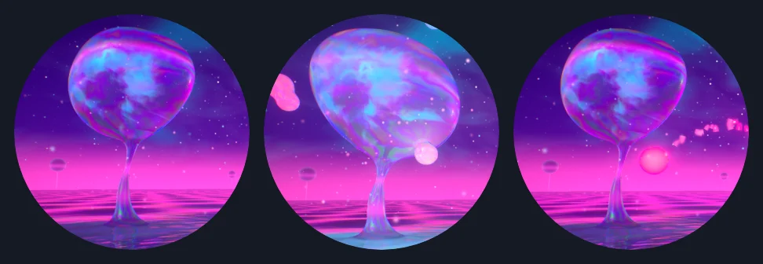
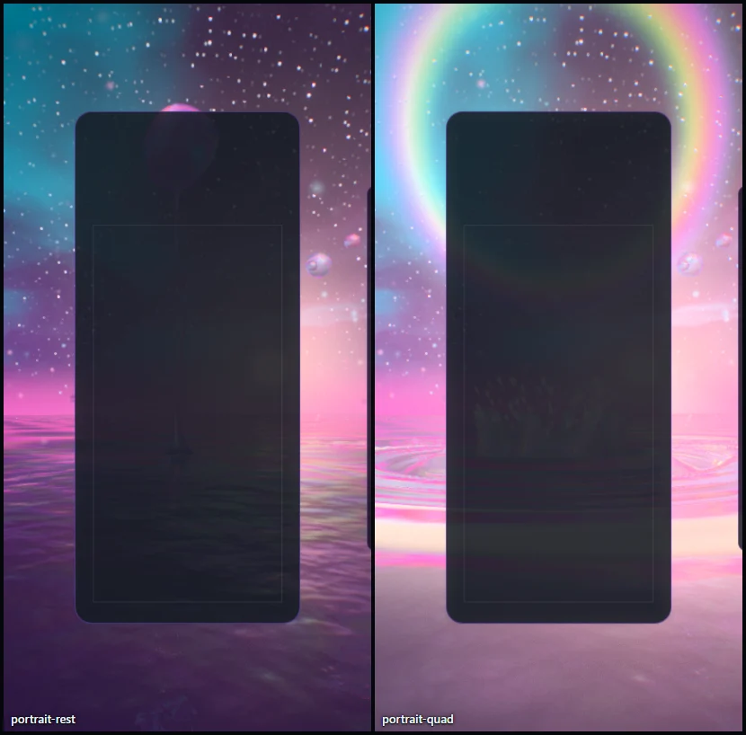

# Fluid Dreams — the dreaming sea

Implemented 2026-10-08 on `feature/fluid-dreams-masterpiece`, with Three.js 0.186.1. A
from-scratch rebuild: it replaces the earlier theme in full (the 1,275-line theme class, the
raymarched metaball hero, the background and haze materials, the compute particles and their
WebGL2 stand-in, the GLSL twins, the post stack, the two playground effects and the two tests
that pinned them). Fluid Dreams keeps its identity — one great body of iridescent liquid adrift
in violet dusk, neon pink, electric cyan and gold, motes of light — and everything else is new.
This document records the shipped design and what was verified. It is a reference, not a
backlog.

## The picture

A sea of liquid light at violet dusk, seen from a little above its surface. The Great Drop
hangs upper left: a body of glass-clear liquid three metres across, ink turning inside it, a
film on its skin that shifts through pink, violet and cyan as it turns, held in the air on a
thread of liquid drawn up out of the sea. Its kin float far right over the dream sun, which
sits low on the sea line and lays a path of light on the water. Ink drifts through the sky,
stars show through it, and far out other drops hang on their own threads down to the sea line.
Every drop is a lens: each holds the sea line and the sun upside down.

The gameplay card covers the middle of the frame, so the picture is built for what stays
visible: the Great Drop to the left of it, the sun and the kin to the right, the near sea
below, the ink above.

## The one idea

Everything liquid in the picture is one body. The sea, the Great Drop, its thread, a droplet in
flight, the jet where it lands: all of it is a single smooth distance field traced per pixel,
so liquid bridges to liquid when it comes near, thins to a neck and pinches off, by
construction. The board feeds that sea: a piece's colour falls into it and stays; a clear
carries what the sea is holding up the thread into the Great Drop.

## Event language

| Event | Response |
| --- | --- |
| Piece lock | A droplet in the piece's colour leaves the card where the piece locked, shedding a string of fine drops, arcs over and falls into the sea beside the card on that side. Where it lands a ring train runs out in the same colour, a jet stands up out of the crater and throws a bead from its tip (the bead hangs a moment, falls back and rings again), and the colour **stays** in the water as a stain of marbled ink that spreads and fades over about twenty seconds, so the sea round the board slowly fills with the colours of the pieces played. |
| Hard drop | The same, harder: three droplets, a bigger one between two small ones. The big one raises a taller jet and a wider ring and leaves the stain; the small ones splash and ring; the lens jumps. |
| Line clear | The cleared rows pour out of both sides of the card as fans of droplets at their own heights. A wave packet leaves the foot of the board, one crest per line, and runs out through the sea: every stain it crosses flares and lets go, and when it reaches the foot of the thread a bead of that light climbs to the Great Drop, which swallows it, swells and takes the colour. |
| Combo | The sea charges. The Great Drop grows and buds one satellite for every step of the chain (up to eight), each lit from inside and circling it; its ink and the sky's burn brighter; light pools on the sea under it; the mist rises faster. When the chain breaks the satellites sink back into it. |
| Four lines | The sea holds its breath: the swell flattens and the Drop gathers itself for a quarter of a second. Then it lets go of its thread and falls. A crown of liquid stands up round the crater and each of its points throws a bead; a ring of split light crosses the sky; the wave goes out; what the crown threw comes back down as rain; and the Drop is lifted back into the air on the column that follows it, which thins to the thread again. |
| T-spin | The sea under the Drop winds into a funnel with spiral arms, and the Drop and its satellites spin up. |
| Perfect clear | The sea turns to glass for a few seconds and a wide pale ring opens overhead (after four lines, once the crown has gone up and its own ring has let go of the sky). |
| Level up | The dusk changes colours in about a second, under a breath of light: five palettes, cycled (amethyst dusk, lagoon, rose gold, ultraviolet, aurora mint), with a soft packet from the foot of the board. A new run starts on the first again. |

Combo here is the true consecutive-clear combo (one `ComboTracker` per player in
`FluidDreamsDirector`); the bus's `COMBO` event is cascade depth (ADR-0011). With several boards
on screen each lock leaves its own board, and the sea charges to the longest chain any board is
holding.

## How it is built

| File | Role |
| --- | --- |
| `fluid-dreams-core.js` | Three-free constants and maths: the ball table's groups and capacities, the union radii, event timings, the five palettes, where the picture's anchors sit on screen for an aspect. |
| `fluid-dreams-choreography.js` | Three-free: where every body of liquid is each frame. Owns the tables the material reads (balls, group bounds, ring trains, stains, wave packets) and moves them through time; closed-form in the clock and the event history. |
| `fluid-dreams-liquid.js` | The one material that traces the sea, every drop, the thread and the sky, and follows each ray for a few bounces. |
| `fluid-dreams-spray.js` | What is too fine for the distance field: the spray pool and the motes. |
| `fluid-dreams-tsl.js` | Hashes and the one baked noise tile (ripple height, its two slopes, ink). |
| `fluid-dreams-world.js` | Stands the picture up for the screen's shape, aims the board's events through the live camera, eases the palettes, owns the camera rig. Shared with the playground effect, so what is iterated there ships. |
| `fluid-dreams-director.js` | Renderer-free: stages bus events per player and resolves one lock and one clear per frame. |
| `fluid-dreams-composition.js` | Three-free: reads the live card, board and HUD rects and maps board columns and rows onto the screen. |
| `fluid-dreams-post.js` | One scene pass, bloom, one output pass, FXAA, grain. |
| `fluid-dreams-quality.js` | The six tiers. |
| `fluid-dreams-theme.js` | Lifecycle, renderer selection, settings, layout watch, GPU-loss recovery, capture flags. |

Techniques worth knowing before changing it:

- **One node renderer on both backends.** `WebGPURenderer` on WebGPU, its WebGL2 backend
  otherwise (or `?forceWebGL`). There is no `ShaderMaterial` left, so `fluid-dreams` is off the
  dual-state allowlist. Nothing uses compute or MRT: the particles that were a compute
  simulation are closed-form functions of the clock, and what blooms is chosen by a knee on the
  scene's own HDR.
- **One distance field, unions inside unions.** The field is an exponential smooth minimum,
  `d = −k·log(Σ exp(−dᵢ/k))`, which is order-independent (nothing pops when balls change places)
  and never overestimates distance. It is nested: the Great Drop's core and lobes join with a
  wide radius of their own (so the body is one smooth amoeba, not a cluster), each group of
  balls joins with its own radius (satellites and the crown bridge generously, a jet stays a
  slender column), and the groups meet the sea with a third, small one (the meniscus). A nested
  union costs one `pow` per group per step: `exp(−d_g/k) = (Σ exp(−dᵢ/k_g))^(k_g/k)`.
- **The union shades itself.** The same weights give the surface its normal (the
  softmax-weighted sum of the balls' own gradients: one pass, no finite differences), a blend
  factor "how much drop, how much sea" that the materials are mixed by (so a neck between a
  drop and the sea has no seam), and softly blended tint, glow and lens radius.
- **A ray marches only where liquid can be.** Balls are grouped (the Great Drop, its kin,
  event liquid left and right of the board); the choreography writes one bounding sphere per
  group each frame; a ray tests four spheres and marches only the interval where it crosses the
  groups it can meet, evaluating only their balls. The tables carry live counts, so a quiet sea
  costs no event work. Everywhere else the sea is the plane settled onto its swell in closed
  form. Far from every ball the march strides straight to the sea; near one it traces the union
  as it is. Below Ultra a mirrored ray meets only the Great Drop's body and thread, not its
  satellites or crown: on the integrated GPU that took the crown's frame from 17.7 ms to 12.8. Two traps that cost a frame each: a march must end just below the surface (nothing
  under the sea is seen), and one that *starts* under the surface has already passed the sea
  and belongs to the open-sea path.
- **A few bounces, one loop.** The fragment is a loop over bounces: trace, shade what is local
  (what the liquid transmits and emits), then continue along the mirror direction with the
  Fresnel weight. Sea → drop → sky stands the Great Drop in the sea; drop → sea → sky puts the
  sea in its belly. The shading code is emitted once, whatever the bounce count.
- **A drop is a lens.** The view ray is bent in at the surface, carried across the sphere that
  kisses the surface there (centre one blended radius down the normal, so the image stays whole
  on any lump of the union) and bent out again; the sky is read along the ray that leaves. On
  High and up it leaves three times, once per colour channel. Depth through the drop drinks
  light by Beer–Lambert, so a drop keeps its own colour; ink turns inside it, shifted against
  the surface by the bend.
- **The film.** Interference colours from the optical path through a thin film: a thickness
  that flows over the surface and sags toward the underside, seen at the angle of refraction,
  per colour channel. It tints what a drop mirrors and adds a sheen of its own, and the sea
  carries a fainter one.
- **The sea's detail is slope, not geometry.** The swell and a clear's wave packets are traced;
  ring trains, wind ripple (two layers of slopes baked into the noise tile and read at the mip
  the pixel's footprint asks for), a T-spin's spiral arms and the light that runs in them are
  added at shading. Rings, stains and packets are rows the choreography keeps current; the
  shader does no time arithmetic on them.
- **Everything is aimed through the live camera.** A lock's droplet leaves the card on the
  lock's own view ray and lands at a chosen distance on the bearing of a point beside the card,
  so it reads at any screen shape; where there is no sea beside the card (a phone, a row of
  boards) it lands under it.
- **Closed form first.** Flights, jets, rings, stains, packets, the plunge, the crown, the
  spray and the motes are functions of the world clock and event timestamps. Nothing is created
  at event time: events write numbers into pooled slots (a full pool gives up its faintest
  entry, and colour landing in colour joins it). `seek(t)` plus a fixed-step replay reproduces
  a frame.
- **HDR, single output.** The scene is scene-linear; a max-channel knee selects what blooms,
  and one output pass does the lens fringe, the calm zones on the card and HUD, bloom, shafts
  dragged out of the dream sun, a hue-preserving filmic curve, grade and vignette, followed by
  FXAA (the liquid is one full-screen material, so MSAA would have nothing to resolve), grain
  and dither. `usesMrtScenePass()` is false.
- **No MaterialX noise.** One tileable texture is baked on the CPU with its own mip chain.

## Assets

None. Every shape is the distance field or a quad, and the one texture is generated at build.
No model is loaded and Blender was not needed: there is nothing in the picture to model.

## Tiers

| Tier | View-ray steps | Mirror-ray steps | Bounces | Lobes | Satellites | Crown | Mirror shows | Lens dispersion | Far drops | Motes | Spray pool | Bloom, shafts | FXAA |
| --- | ---: | ---: | ---: | ---: | ---: | --- | --- | --- | --- | ---: | ---: | --- | --- |
| Minimal | 26 | 8 | 1 | 2 | 3 | spray only | sky only | off | off | none | 640 | off | off |
| Low | 34 | 12 | 2 | 3 | 4 | 6 points | body and thread | off | on | 220 | 640 | off | on |
| Medium | 44 | 18 | 2 | 3 | 6 | 7 points | body and thread | off | on | 520 | 768 | on | on |
| High | 56 | 24 | 2 | 4 | 8 | 8 points | body and thread | on | on | 900 | 1,024 | on | on |
| Ultra | 72 | 30 | 3 | 4 | 8 | 10 points | everything | on | on | 1,400 | 1,280 | on | on |
| Extreme | 88 | 38 | 3 | 4 | 8 | 10 points | everything | on | on | 2,000 | 1,536 | on | on |

Every tier keeps the whole picture and every event. Minimal also drops the stars and Minimal
and Low the second fold of the sky's ink. These are budgets, not measurements of frame rate.

## Verification

- Unit tests: 168 new tests in four files (director 23; choreography 50; world 47; theme 48).
  The two tests that pinned the earlier theme's renderer and its WebGL2 particle stand-in were
  retired with those modules, and the dual-state allowlist lost its entry. A helper agent wrote
  most of the tests and reviewed the choreography and the world twice; its two reports listed
  eighteen faults and nits before any player met one (a ring of light that never faded after a
  small perfect clear, a Great Drop that jumped at both ends of its plunge and stepped in size
  when it swallowed, a drip replayed on every seek and the first drip of a fresh start lost,
  stains that shrank or slid when colour landed in them, a crown that overflowed its table with
  a chain held, clicks in the meditation mode that poured rows out of a card that was not
  there, a new run wearing the last run's palette, spray pools too small for the two lowest
  tiers, event groups at capacity in fast play). All are fixed. The behavioural ones are pinned
  by regression tests; for the first report the agent put each old defect back in memory and
  confirmed its test fails, and the five tests added after the second report were not checked
  that way.
- Whole suite: 687 files, 9,187 tests; one failure, in a file this change does not touch and
  that fails the same way on `main` on this machine (`odyssey-level-briefing.test.js` expects
  "250,000" and a Swedish locale prints "250 000"). CI is the authority for that one.
- Gates: typecheck; lint ratchet (793 errors against a baseline of 807: removing the old theme
  took fourteen with it, the new files add none; the baseline was left as it is); theme
  lifecycle audit; architecture fitness (three metrics lower: shader-material hits, files,
  resize listeners; baseline left as it is); dependency boundaries; production build with the
  boot-closure guard (the theme's chunk is 81 kB, 30 kB gzipped); IP-string gate; Pages artifact
  check; release gates: all pass. The palette gate fails on `main` and here for the same
  unrelated reason (Stillwater); Fluid Dreams scores 4/7 on it, as before (its piece colours
  are unchanged).
- Playground captures on WebGPU (RTX 3070 Laptop). The last set, 34 frames with no console
  error or warning: rest; a lock at three moments; a hard drop at two; a three-line clear over
  a stained sea; a chain of six; the four-line clear at six moments from the hush to the Drop's
  return; a T-spin; a perfect clear; a level change mid-ease and the four other palettes at
  rest; Minimal, Low, Medium and Extreme; High and Low on the forced WebGL2 backend; an upright
  430 × 852 frame at rest and through a four-line clear. A set of 37 taken before the last
  review fixes, equally clean, also held Ultra, Minimal on WebGL2, a 1584 × 640 frame and
  reduced motion. After the last set one thing changed in the shader: a branch written as a
  one-trip loop for an A/B went back to a plain branch (same arithmetic); the in-game runs
  below were made after that.
- In the real game (Electron, dev server, single player, `?unlockAll=1`): the theme starts on
  WebGPU, takes real hard drops from the keyboard (droplets, jets and stains in the pieces' own
  colours) and bus-injected locks, clears, a chain and four lines, survives a live quality
  change (High to Medium) and lets go of its canvas when another theme takes over. The same
  event script ran clean on the WebGL2 backend at Low, and at High on the integrated GPU.
  No console errors or warnings in any of the three.
- `scripts/validate-all-themes.mjs --theme fluid-dreams` could not be used: on a fresh profile
  the theme is locked by the collection added the same day, the script selects through the
  theme card, and its URL builder drops an `unlockAll=1` given with `--base-url`. It fails at
  "theme-card-selection-started" before the theme is ever asked to start. The lifecycle checks
  above were made with the in-game harness instead.

Observed, not measured. Playground, 1584 × 813, vsync off, other sessions on the machine:

| Median frame | RTX 3070 (WebGPU) | Radeon 610M integrated (WebGPU) |
| --- | ---: | ---: |
| High at rest | 2.5 ms | 9.0–9.4 ms |
| High, a hard drop's jet (frozen frame) | not taken | 10.3 ms |
| High, the crown standing (frozen frame) | not taken | 12.8 ms |
| High, a chain of eight (frozen frame) | not taken | 13.1 ms |
| Medium at rest / the crown | 2.4 ms / not taken | 7.0 ms / 9.5 ms |
| Low at rest / the crown | 0.9 ms / not taken | not taken / 7.4 ms |
| Minimal, Ultra at rest | 0.5 ms, 2.6 ms | not taken |
| High at rest on the WebGL2 backend | 2.2 ms | not taken |

From navigation to the first rendered frame, modules and pipeline compile included: about
1.5 s on the RTX (3.6 s on its WebGL2 backend) and 4–5 s on the integrated GPU. On the RTX the
tiers from Medium to Extreme all sit near 2.5 ms because the bloom chain, not the liquid, sets
the cost there. The whole game ran at the 120 Hz frame cap on the RTX at High and on its
WebGL2 backend at Low, and at 74 and 98 fps in two runs at High on the integrated GPU.

Not verified: GPU cost per tier through the theme perf lane (ADR-0016); physical phones (in a
390-pixel-wide window the board covers all but two slivers of the picture, as it does for
every theme); local multiplayer and Infinity layouts in a capture (their routing is
unit-tested only); the icon on an Odyssey level orb; sessions of several hours.
`docs/theme-screenshots/fluid-dreams.png` still shows the previous artwork (a fleet capture
writes it).

## Reproduce

Run `npm run dev:playground`, then:

`/playground.html?effect=fluid-dreams&t=20&quality=High&board=1`

Add `event=lock|drop|clear|quad|tspin|perfect|levelUp` with `eventAge=<s>`, and `combo=<n>`,
`level=<n>`, `lines=<n>`, `u=<0..1>`, `row=<r>`, `color=<hex>`. `locks=<n>` plays n locks first,
so the sea is holding their colours when the event fires. `demo=1` (without `t`) plays a
looping script. `parts=liquid,motes,spray` draws only the named parts; `tune=key:value,...`
overrides tier fields for an A/B (`tune=dispersion:0,mirrorExtras:1`); `falseColor=1` bands the
pre-tone-map peak; `noPost=1` shows the raw scene; `forceWebGL=1` uses the WebGL2 backend;
`reduce=1` is reduced motion. In the game: `?fluidDreamsTime=`, `?fluidDreamsFixedDt=`,
`?fluidDreamsParts=`, `?fluidDreamsFalseColor=1`.

The theme icon is a frame of the scene itself, a lock's droplet in flight beside the Great
Drop:

`/playground.html?effect=fluid-dreams&t=20&quality=High&board=1&event=lock&eventAge=0.3&u=0.2&row=8`

captured at 1584 × 813, cropped to a 542-pixel square centred at (0.215, 0.455) of the frame
(clear of the mock card), given a colour lift (contrast 1.14, saturation 1.24, brightness 1.08)
and baked as a 512 px circle on a transparent ground. The same file is kept at
`public/assets/themes/fluid-dreams-theme-icon.png`. Two other candidates were baked beside it
(the Drop at rest, and charged by a chain of six with its satellites):

The playground also has an icon lens (`icon=1` with `iconFov`, `iconYaw`, `iconPitch`), which
turns a longer lens to the Great Drop in a square frame; it reads paler than the game's own
view, which is why the icon was cut from that view instead.

## Captured previews

