# Forest — the firefly night (visual overhaul, 2026-10-08)

**Status: implemented (branch `feature/forest-masterpiece`). A record of what was built and
how it was checked — not a backlog.** Replaces the game's first theme: a CSS gradient, a
CSS moon, three scrolling silhouette layers and about a hundred legacy 2D particles.

| Before | After (High, native WebGPU) |
| --- | --- |
| 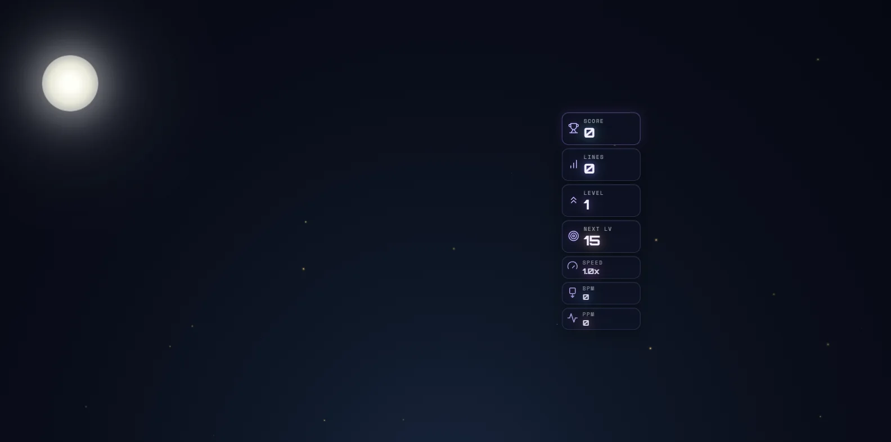 | 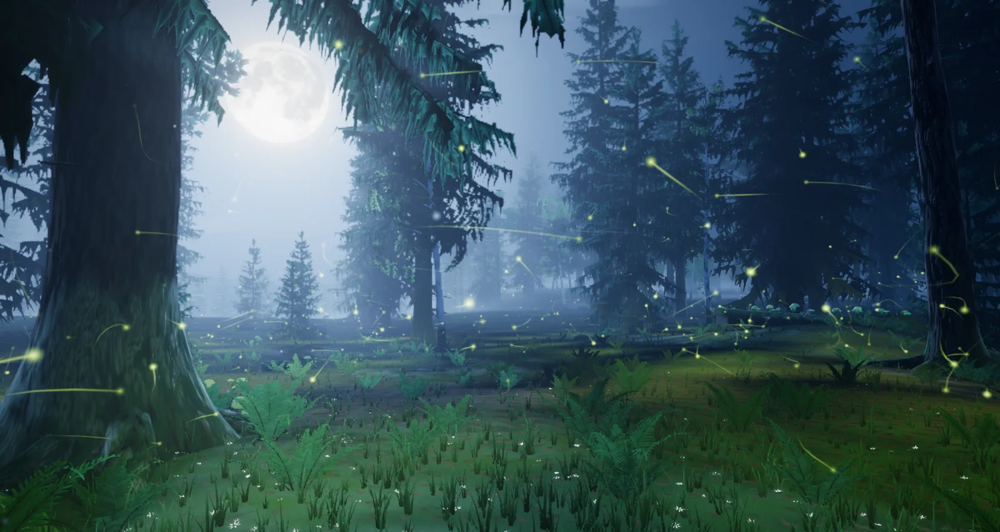 |

## What the player sees

The same idea the theme has always had — a full moon behind spruce, fireflies, mist — now
built as a place. The eye stands among old trees at the head of a *ride*: a long opening
that runs straight toward the moon and falls away into a valley of mist, with wooded
ridges beyond it. An ancient spruce frames the left of the screen, its low boughs hanging
over the moon; on the right the old wood closes in round an elder pine, birches, and a
mossy knoll where a spruce once fell. The moon (far larger than life, as it always was
here) carries its real seas and craters, an aureole in the damp air and a faint ice halo.
Moonbeams are real volumes cut by the trees. The floor is moss, fern, grass and wood
stars, and over it drift fireflies that leave the trails a long exposure would catch:
dotted arcs, lit only where each one was flashing.

The board card hides the middle quarter of a landscape screen, so the picture is composed
for the two side thirds. Portrait keeps the same world, turned toward the moon.

## How the forest answers the game

`ForestReactions` is a pure director; `ForestFireflyDirector` turns its cues into light.
The forest's own light is firefly green and is the only saturated colour in a blue night,
so every reaction reads at once.

| Event | Response |
| --- | --- |
| Piece lock | A wave of light runs out across the moss from where the piece landed. It climbs the trunks it passes, the ferns and grass bow away from it, every firefly it crosses flashes, and a puff of fireflies leaves the card's edge beside the piece. |
| Hard drop | A stronger wave, and from a long drop the boughs shake: dew comes down through the moonlight. |
| Line clear (1–3) | Twin jets of fireflies from both sides of the card at the cleared rows and a taller, faster wave. From two lines a second wave follows and a front of wind crosses the trees; from three a star falls. |
| Four lines | All of that, fireflies lifting out of the ferns across the whole floor, the moon and its beams flaring — and the fireflies gather on the knoll into one of the animals of the wood ([the animals](#the-animals-2026-10-09)), which stands for a few seconds lighting the moss under it, then lets go. |
| Combo / streak | The forest wakes. Fireflies fall into step one by one until the wood flashes in waves that roll out from the board; garlands of them wind up the old trunks; threads of foxfire spread through the moss; the fungi on the fallen spruce and among the roots light one by one; the fireflies pale toward white gold and their trails lengthen. A lock without a clear lets it all sink back. |
| T-spin | A spiral flourish beside the board and a wave. |
| Back-to-back | Holds the wakefulness and lifts the moon. |
| Perfect clear / level up | The whole forest answers at once; a perfect clear calls an animal for longer. |
| Game over | The wind dies, the forest goes back to sleep and the fireflies sink toward the moss. |

Everything honours `backgroundComboEffects` and `pieceLockRipple`, pauses with the theme,
and is driven by simulation seconds. No event allocates: fireflies come from a fixed
hidden reserve, emitters and waves from fixed pools.

| Hard drop | Three lines | Four lines: the stag |
| --- | --- | --- |
| 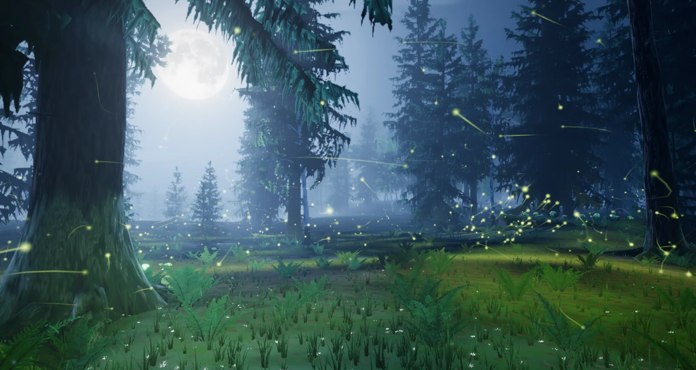 | 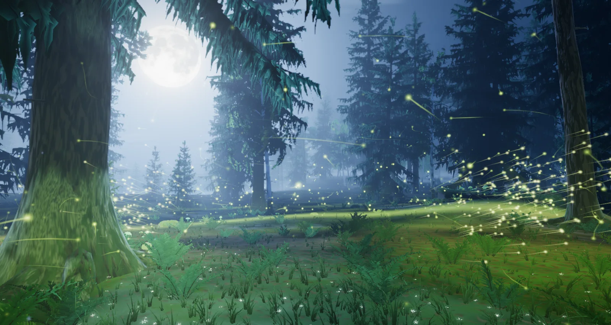 | 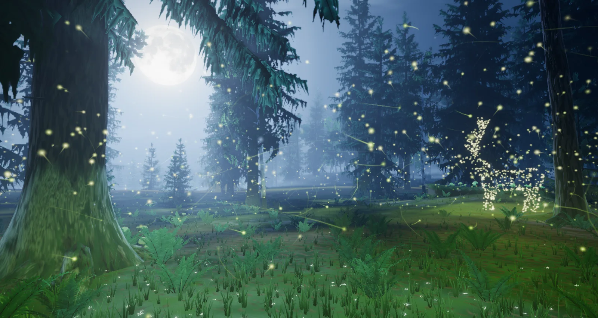 |

| Lock | Combo ×8, held | Perfect clear |
| --- | --- | --- |
|  | 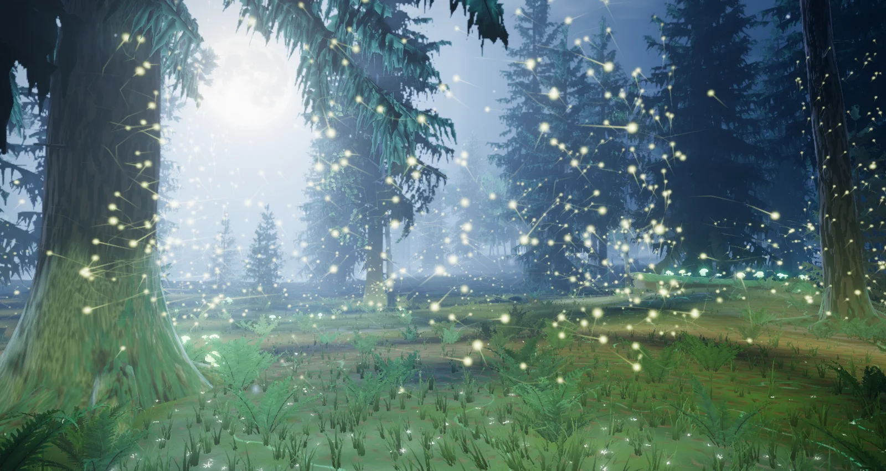 | 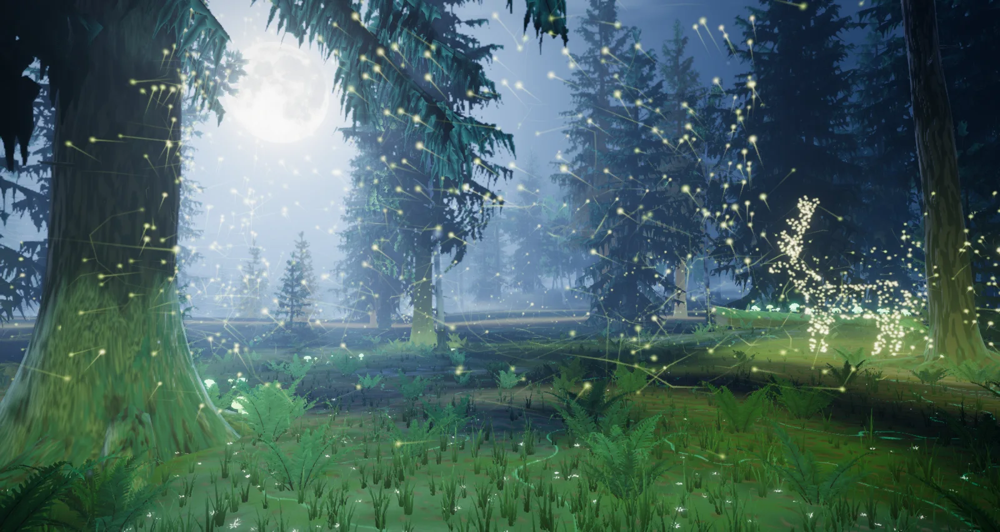 |

### The animals (2026-10-09)

The first build had one figure, the stag. It now has twelve: the stag, and eleven more
creatures of a northern wood. Four lines or a perfect clear calls one of them.

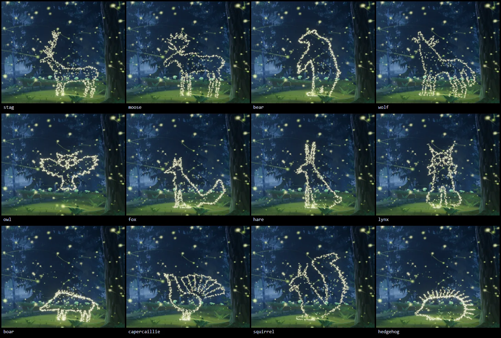

| Animal | How it is drawn |
| --- | --- |
| Stag | A red stag in profile, head up, antlers as strokes, and under them a body of sparks: it keeps a fifth of its lights inside, where the others keep a twelfth. Its shape is what it was in the first build. |
| Moose | A bull: long legs, the hump, the overhanging muzzle and bell, a palmate antler held over the head. |
| Bear | Risen on its hind legs, forepaws hanging, nose to the wind. |
| Wolf | Standing square, head thrown back and jaws open, howling: a thick neck, ears laid back, a deep chest, the brush hanging to its hocks. Figures face the moon, so it howls at it. |
| Owl | An eagle owl from the front, wings spread, coming in to land above the ferns; two round eyes. |
| Fox | Sitting, ears up, its brush lifted behind it. |
| Hare | Sat up on its haunches, ears high. |
| Lynx | Sat facing the player: tufted ears, round eyes, a ruff hanging at either cheek. |
| Boar | All shoulder, a long snout, tusks, a crest of bristles. |
| Capercaillie | The cock at his display: the tail fanned in quills, beak to the sky. |
| Squirrel | Sat up with a cone, its tail a great curl behind it. |
| Hedgehog | A dome of spines and a small sharp face. |

- **Which one comes.** `ForestReactions.nextFigure()` deals them from a shuffled round:
  every animal comes once before any comes back, and never the same one twice running,
  not even where two rounds meet. The round starts afresh with the reactions (a new
  session), so a seeded capture is reproducible. `callFor(name)` asks for one by name;
  the playground exposes it as `?animal=<name>`.
- **One description, many animals.** `forest-figures.js` describes each as tapered capsules
  (body, legs), closed outlines (a wing, an ear, an antler palm), holes (an eye) and
  strokes (antlers, whiskers, quills, spines), in plain numbers. Fur and spines are grown
  on a body by marching its distance field. To add an animal, add a figure to
  `FOREST_FIGURES`; nothing else names them.
- **The room a figure has.** Every figure is placed inside `FOREST_FIGURE_ROOM`, the room
  the stag takes where it stands (1.66 m behind, where an old pine stands close, 2.30 m
  toward the nose, 5.18 m overhead), and sized to fill it: these are figures of light,
  not life-size animals, so the hare stands as tall as the bear. The first captures had
  centred figures and the pine cut the wide ones.
- **Drawn for the size of a firefly.** A light is about a tenth of a metre of glow at
  twenty-three metres, so fine detail does not survive. Only a share of a body's lights
  stands inside it (`fill`, a twelfth for most), the rest draw its outline, and features
  are drawn large: the owl's eyes are half a metre across.
- **The wolf, drawn twice.** The first wolf was the smallest of the twelve (3.6 m) and
  read as a thin dog: its tail streamed out behind, and since the room's width sets a
  wide figure's size, the tail cost it a third of its height. The second carries its
  brush hanging, so the same room holds a wolf 5.1 m tall, and has what makes a wolf at
  this size: a thick neck, a deep chest tucked up to the waist, ears laid back, open jaws.
  A mane and a chest ruff drawn as teeth were tried and taken out again: in the forest
  each tooth was three or four lights, and the head became a cluster of points.
- **An even hand.** Lights scattered at random along an outline bunch and leave gaps:
  the first twelve were clouds of dots, and the wolf's outline broke up at its new size.
  Now more places than lights are found on a figure's outline (four for each light), and
  each light in turn takes the place furthest from every light already set, so the line
  is covered from end to end first and filled in after. Along a line a light's nearest
  neighbour is 0.8 to 1.9 of the usual spacing away, where scatter gave anything from
  nothing to five times it; at 112 lights (Minimal) an animal is still one unbroken
  line. All twelve are drawn this way, the stag too: its shape and antlers are what
  they were, its lights are not where they were.
- **Chance, in the game.** The theme builds its forest from a fixed seed, which would
  have replayed one order of animals; in the game the round is dealt by `Math.random`
  instead, and follows the seed only when `forestSeed` is in the URL.
- **No work at the summons.** All twelve are laid out when the director is built, as
  the stag was, so calling one allocates nothing. `forestFigureLights` keeps a figure's
  lights for each number of them, so a forest that is rebuilt (a quality change) lays
  nothing out twice. The layout looks for places only in the cells of a grid that the
  figure covers, and the distance to a figure skips, by its box, any part a point
  cannot be nearest to: all twelve at 560 lights take about 40 ms together on a busy
  machine.

Checked on 2026-10-09, after the even hand: every animal captured in the playground at
High on native WebGPU (`?effect=forest&animal=<name>&event=quad&eventAge=4.2&t=14`; the
sheet above is those captures, cropped). Also the stag and the capercaillie at Low (210
lights), the owl and the hedgehog at Minimal (112), the lynx at Medium (373), the bear on
the WebGL2 backend, the stag with the board card at 16:9, the moose on an upright
9:19.5 screen, a fox gathering, and a summons left to the round. No shader or console
errors. `tests/unit/forest-*.test.js`: 593 tests in seven suites, among them that every
animal fits its room and takes every light, that its outline is evenly lit where
scatter would bunch, that no two are the same drawing, that a round deals each once
and never one twice running, and that the distance to a figure never jumps. Not run
inside the real game, and no frame rate was measured: a figure is made of the same
reserve sparks, and as many of them, as the stag was.

## How it is built

### Trees, fronds and props authored in Blender

`scripts/blender/forest_assets.py` (helpers in `scripts/blender/forest_night/`) grows ten
trees on the branching library the Fall grove introduced and the Golden Forest's conifer
recipes: an elder Norway spruce with a root plate and long low boughs, an elder Scots
pine, three old spruces, two young ones, an old pine and two silver birches. It bakes bark
ambient occlusion in Cycles, renders the far-stand sprite sheet, and builds a fern frond
(real geometry, near and far), a birch leaf strand, the fallen spruce, its stump, three
boulders and a dead snag. Formats and the regeneration command are in
[`src/themes/forest/assets/ATTRIBUTION.md`](../src/themes/forest/assets/ATTRIBUTION.md).
The pack is 2.9 MB in thirteen files with no third-party source; the generator's author
reports byte-identical output over three runs. The moon's face is the shared
`public/textures/2k_moon.jpg` (see `CREDITS.md`).

The generator runs **headless** (`blender --background --factory-startup`); the Blender
MCP session was not used, so nothing in an open Blender was touched.

### Runtime modules (`src/themes/forest/`)

| Module | Owns |
| --- | --- |
| `forest-theme.js` | Lifecycle, renderer, asset loading, gameplay subscriptions, board tracking. |
| `forest-plan.js` | The plan as plain numbers: the eye, the moon, the ride. |
| `forest-assets.js` | Loading and decoding the GLBs, the sprite sheet and the moon map. |
| `forest-world.js` | Composition root: builds and updates everything below. |
| `forest-light.js` | The moon, its static shadow map, night air, ambient, wind, a shared noise texture, a baked floor-height map, and the forest's own light (`glow`). |
| `forest-pulses.js`, `forest-light-field.js` | The waves of light, and the map the fireflies' light is gathered into. |
| `forest-composition.js` | Camera framings, hand-placed trees, the procedural stands, the visibility test. |
| `forest-terrain.js` | The analytic land (plateau, ride, valley, knoll), the floor and its foxfire threads. |
| `forest-trees.js` | Bark and spray instancing and their materials. |
| `forest-understory.js` | Ferns, grass, wood stars, foxfire fungi, boulders, the fallen spruce and its stump. |
| `forest-backdrop.js` | The sprite forest of the far stands and the valley, and the ridges. |
| `forest-sky.js` | The dome (moon, stars, Milky Way, cloud, falling stars), mist banks, moths in the beams. |
| `forest-firefly-sim.js`, `forest-fireflies.js` | The fireflies: simulation, and drawing (lights and trails). |
| `forest-figures.js` | The twelve animals as geometry, and the points their lights take. |
| `forest-reactions.js` | The event director (pure). |
| `forest-stage.js`, `forest-firefly-director.js` | Board card → world, and cues → waves, sparks, force fields, garlands, the animals. |
| `forest-post.js` | Volumetric moonbeams, bloom, grade, FXAA. |
| `forest-quality.js` | One table for everything a tier scales. |

### Techniques (three 0.186.1)

- **The plan follows the light.** The moon stands 19° up. Ground can only be moonlit where
  it looks down the ride at open sky, so the ride is the first thing in the layout and
  nothing tall may stand on its floor; where it ends the land falls into the valley. The
  trees that hide the moon were found by counting, per tree, the sprays inside its disc
  from the eye, and the elder's place and turn were chosen by a scan of the same count.
- **One static shadow map, used everywhere.** Materials stay unlit `MeshBasicNodeMaterial`
  and call a shared `shadow(light)` node themselves; nothing moves under a fixed moon, so
  the map is drawn over the first frames only. Floor, bark, sprays, sprites, mist and
  moths all read it.
- **Volumetric moonbeams with `GodraysNode`**, at half resolution with a bilateral blur.
- **Moonlight takes the colour out of things; the forest's own light gives it back.**
  `ForestLight.night()` desaturates a surface for the moon and sky terms, `glow()` lights
  it in full colour. `glow()` is two things: up to six analytic waves (two `vec4`s each in
  a uniform array — no feedback texture, so they are identical on both backends and
  reproducible in a capture), and a small top-down map into which every lit firefly near
  the floor is splatted each frame on the CPU, so a firefly really does light the fern it
  passes and a firefly figure lights its knoll.
- **Light trails without a history buffer.** An ambient firefly's path and its flash are
  closed-form in time, so the trail's vertex shader evaluates them again a little earlier
  for each point of a ribbon: a wanderer leaves a dotted arc, lit only where it was
  flashing. The CPU keeps a twin of both functions for the forces and the light map.
- **Synchrony.** A shared clock runs out from the board as phase per metre; each firefly
  blends from its own flash to the shared one at its own threshold as the forest wakes,
  so the chorus builds one voice at a time and then travels.
- **The animals are signed-distance figures.** Tapered capsules, closed outlines and
  strokes are sampled with the points crowded along the outline; reserve sparks are bound to those
  places with a critically damped spring, held without ageing, then released.
- **Needles and fronds as geometry, globally instanced.** No alpha cards. Sprays that can
  never be on screen are dropped at build time.
- **A dome that costs only the sky that shows.** The sky is drawn last among the opaque
  parts with the depth test on. Stars are a hashed lattice on the view direction; the
  moon is an orthographic lookup into the lunar map.

### Quality tiers

| Tier | Stands / far trees | Sprays kept | Ferns / grass | Fireflies | Trail | Waves | Firefly light map | Beams | Post |
| --- | --- | --- | --- | --- | --- | --- | --- | --- | --- |
| Extreme | 58 / 380 | 100 % | 360 / 5,200 | 3,600 | 8 seg. | 6 | 128² | 40 steps | on |
| Ultra | 52 / 320 | 100 % | 300 / 4,400 | 3,000 | 8 | 6 | 128² | 32 steps | on |
| High | 44 / 260 | 86 % | 250 / 3,400 | 2,400 | 6 | 5 | 96² | 26 steps | on |
| Medium | 34 / 190 | 62 % | 170 / 2,000 | 1,600 | 5 | 4 | 64² | 16 steps, 0.35 scale | on |
| Low | 22 / 120 | 40 %, trunks only | 100 / 900 | 900 | 3 | 3 | off | analytic glow in the haze | off |
| Minimal | 14 / 80 | 28 %, trunks only | 60 / 420 | 480 | none | 2 | off | analytic glow in the haze | off |

"Stands" are the modelled trees beyond the twenty-two placed by hand. Low and Minimal draw
the same scene directly with ACES tone mapping and skip limb geometry.

| WebGL2 backend, Low (no post) | Portrait, High |
| --- | --- |
| 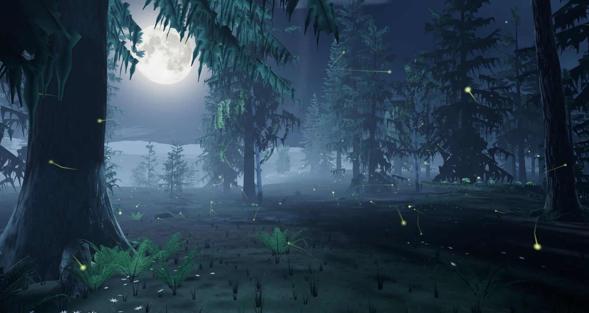 | 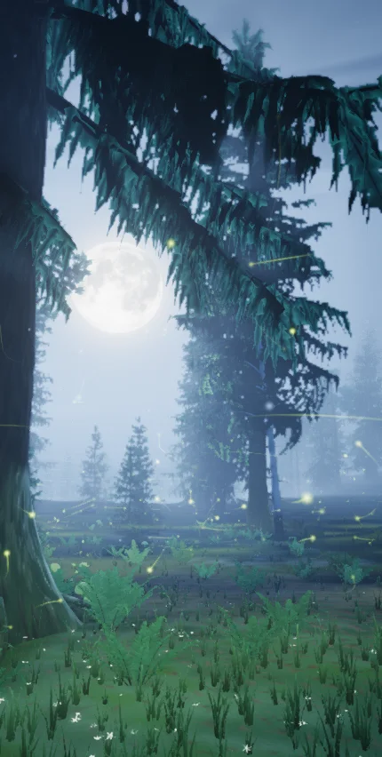 |

## The starter theme

Forest is the theme a new player starts with, the default background and the theme the
manager falls back to when another fails. It used to cost nothing; now it is a world, and
three things follow from that.

- **It must not fail to start for want of a file.** If the asset pack cannot be loaded,
  `ForestTheme` warns once and builds the forest from an empty bundle: sky, a plain moon,
  the floor with its grass, flowers and foxfire, the fireflies and every reaction, without
  trees, ferns or props. `theme.assetPackMissing` says so.
- **A bug the old theme hid.** Entering a mode while the boot pre-warm of the theme was
  still in flight left `#forest-theme` hidden behind a theme that reported itself running
  (a blank background). The pre-warm hides a theme through a flag on the theme object, and
  the visible activation read it. With a CSS theme the window was a few milliseconds; with
  a pack to load it is seconds. `ThemeManager.activateThemeInstance` now clears the flag
  before it starts the theme, and the pre-warm reveals a container it finds active when it
  ends (`revealThemeContainer`). Reproduced in the real game before the fix (single player
  entered half a second after boot: container without `.active`), not after.
- **It is registered as a heavy theme** (`HEAVY_GPU_THEME_IDS` in `theme-registry.js`), so
  it gets the 20 s lifecycle timeout and the deeper disposal the other worlds get. Its
  `startupEligible` flag becomes false with that; nothing reads the flag today.

## Verification

- **Playground** (`npm run dev:playground`, `?effect=forest&orbit=0&hud=0`), through the
  chrome-devtools MCP against a private dev server: the captures in this record, each with
  a clean console (no WebGPU validation errors, no TSL warnings) on native WebGPU at High,
  and with `forceWebGL=1` at Low and Medium. A second set at 1600 × 852 came from Electron
  (the frames in this record), on WebGPU and, for Low, the WebGL2 backend. Events are reproducible with
  `&t=8&event=lock|drop|clear|double|triple|quad|combo|streak|spin|perfect|level|over`,
  `&eventAge=<s>`, `&col=0..9&row=0..19`, `&combo=<n>`, `&hold=1` (repeat the event every
  second, to hold a combo) and `&board=1` for a stand-in card. The effect uses the theme's
  own generator and default seed. `&icon=1` is the icon's lens.
- **In the game** (dev server, Chrome, WebGPU, High): single player starts on the theme
  and it follows the measured board card; four lines sent through the app's own event bus
  gather the stag (the frame below); a quality change to Low and back rebuilds the world;
  with `backgroundComboEffects` off the same event does nothing; suspend and resume; and
  a switch to Golden Forest and to Mountain and back each disposed the old instance
  (canvas removed, renderer released) and built a visible new one. The console held only
  Chrome's `powerPreference` notice and `BaseTheme`'s restart notice.

  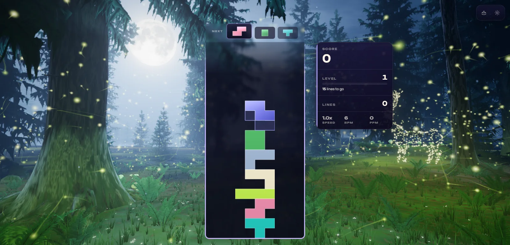

- **Lifecycle validator** (`node scripts/validate-all-themes.mjs --theme <id>` against the
  dev server, a fresh Electron process per theme). The validator needed three repairs
  before it could say anything about any theme (below). With them,
  `--theme golden-forest` passes: 79 of 79 checks, 0 console errors. That run boots into
  Forest and uses it as its anchor, so it starts Forest, disposes it for the target,
  builds it again as the clean-up anchor (1.06 s) and disposes it again.
  `--theme forest` does **not** pass, and cannot as the validator is written: its first
  step switches to an anchor theme (Mountain) directly on the manager, and single-player
  mode at level 1 re-applies the level's own theme, Forest, 16 ms later (both calls are
  in the run's log). The checks that concern Forest itself in that run pass (boot settled,
  running, critical-ready, 0 console errors); the anchor checks are the ones that fail.
  Forest as the theme under test is covered by the in-game checks above instead.

  The repairs, all in `scripts/capture-theme-screenshots.mjs`: the page URL carries
  `unlockAll=1` (since the theme collection landed, a fresh profile owns only Forest and a
  switch to anything else is refused without a word); after clicking a theme card the
  validator presses the detail page's Apply button (a card opens its detail page now); and
  it waits for the boot theme to be running before its first switch. The first two
  faults predate this change and fail every theme on main (Golden Forest failed the same
  four card checks until they were fixed); the third is a consequence of Forest no longer
  starting in an instant.
- **Build**: `npm run build` — boot closure OK; the theme chunk is 112 kB before gzip
  (39 kB gzipped). `check:ip-strings`, `check:pages-artifact`, `check:release-gates` and
  `check:boundaries` OK. `lint:ci` at baseline (807), `typecheck` clean, 0 ESLint problems
  in `src/themes/forest`, the playground effect and the new tests.
- **Tests**: 531 tests in eight suites — `tests/unit/forest-*.test.js` (the asset pack 74,
  the director 106, the firefly simulation with the light map, the waves and the stag
  figure 88, stage and firefly director 48, the theme adapter 111, world and post built
  from the real GLBs in Node 72, framing and guards 29) and
  `theme-prewarm-reveal.test.js` (3). A mutation pass rewrote 27 behaviours in memory, one
  at a time: 26 made a test fail, and the survivor was a clause another clause already
  implied (since removed). The full unit suite ran once after the last change: 692 of 693
  files and 9,558 of 9,559 tests passed. The one failure, `odyssey-level-briefing`, expects
  "250,000" where this machine's locale prints "250 000"; it is not touched by this change.

### Defects the test pass found

The helper that wrote the suites also read the finished modules and reported faults the
captures had not shown. All were fixed before this record was closed:

- The stag stood off-screen on upright screens and was cut off at 4:3: its stand was one
  fixed point. It now keeps that point when the whole figure fits and otherwise moves in
  toward the view's axis, clear of every trunk.
- Dark reserve sparks answered a passing wave of light: the lights' material did not gate
  on a spark being alight, so the whole unused reserve flashed where it lay (behind the
  card in landscape) and dead sparks flashed where they had died.
- Between aspects 0.85 and 1.15 the landscape framing cut the moon's limb; screens up to
  1.15 now use the upright framing.
- Foliage was dropped as "never on screen" for screens wider than about 2.8:1; the test
  now reaches 32:9.
- A settling firefly could sink through the moss; a new wave sat at full strength on a
  point for one zero-length frame; a stay of `NaN` left the stag standing for ever; a
  disposed director came back to life on `reset()`; the static shadow map was redrawn by
  frame count only, so a pipeline that compiled late could be missing from it for good
  (it is now also redrawn at 2, 5, 10 and 20 seconds).

### Start-up and frame cost

No admissible measurement exists. Eight other sessions were using this machine's GPU and
CPU throughout, so these are observations, not budgets:

- Playground at 1600 × 769 in Chrome on the RTX 3070, High: 163 frames a second (the
  display's rate) at rest and in a combo, 7.7 ms at the 95th percentile; one world update
  (simulation, light map, director) took 0.56 ms of CPU.
- The same effect on the laptop's integrated Radeon (Electron, `force_low_power_gpu`,
  1600 × 852, window shown): 86 frames a second at High, 110 at Medium, 123 at Low, 132
  at Minimal.
- First frame in the playground arrived 4–7 s after mount on WebGPU and 16 s on the
  WebGL2 backend at Medium (pipelines compile serially there).
- The theme perf lane (ADR-0016) was not run, and nothing was measured on a phone.

## What was removed

- The legacy Forest: the DOM children of `#forest-theme` in `index.html` (moon, three
  silhouette layers, two mist layers), their CSS and keyframes (and the styles of
  particles, mushrooms, eyes and wisps nothing created any more), and the `forest` branch
  of the legacy 2D particle layer in `src/rendering/renderer.js`. `#forest-theme` keeps a
  plain night gradient: it is what shows while a start is in flight.
- The old icon in the theme folder. `public/assets/themes/forest-theme-icon.png` is left
  as it was on purpose: `scripts/build-win.mjs` uses that file as the default source of
  the Windows application icon, and changing the application's icon is not part of this
  change.

## Known limits

- The shadow map is static, so swaying crowns do not move their shadows, and crowns that
  are never on screen cast none: the floor at the eye's feet is moonlit, as the ride's
  floor is.
- Bark, floor and stone detail are procedural in the shader; there are no texture maps
  beyond the sprite sheet and the moon.
- A firefly figure is a drawing in lights in one plane, turned side-on to the eye. On narrow and
  upright screens it stands nearer the view's axis, where the board card covers part of it.
- Low and Minimal have no beams, no bloom and no firefly light on the floor.
- The far sprites face one eye; they are not meant to be seen from elsewhere.
- If neither WebGPU nor WebGL2 can start, the theme fails and its container is hidden
  with it: the player sees the page's own dark background, not the forest's gradient.
- A fetch of the asset pack that never settles is not caught by the treeless fallback; it
  runs into the manager's 20 s lifecycle timeout like any other heavy theme.
- Tools that used Forest as a free "anchor" theme to switch from (the capture and perf
  scripts) now switch from a real world; their older numbers are not comparable.
