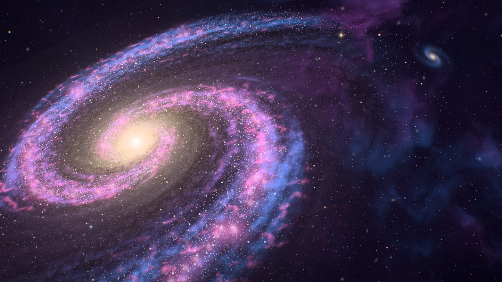
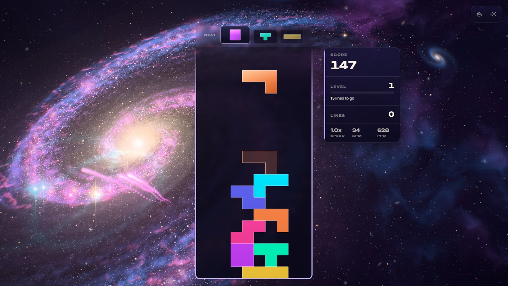
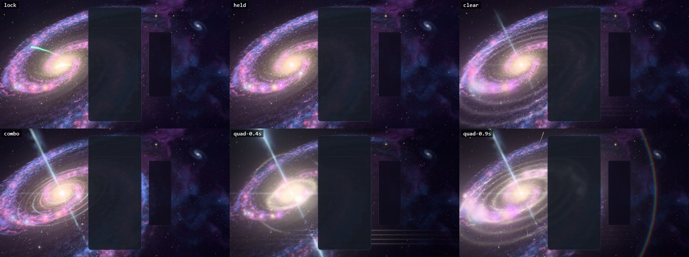
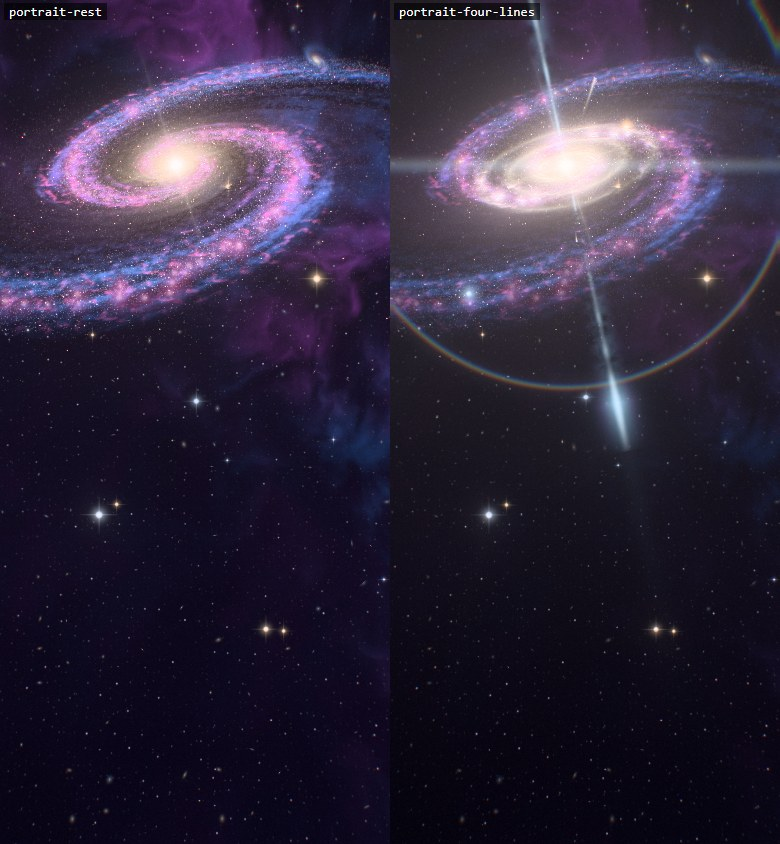
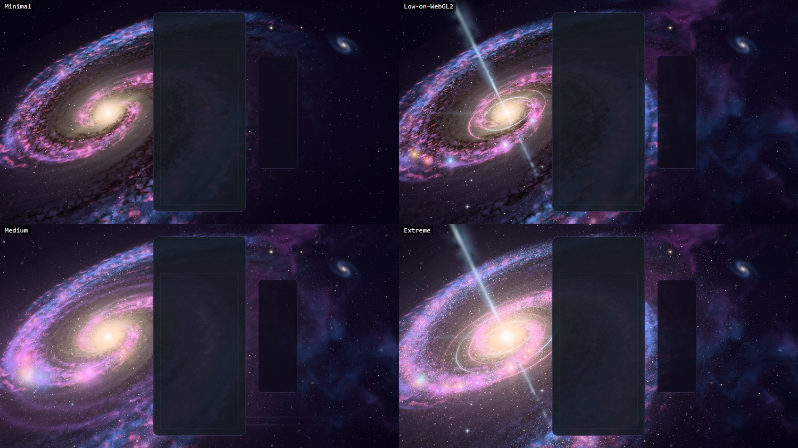
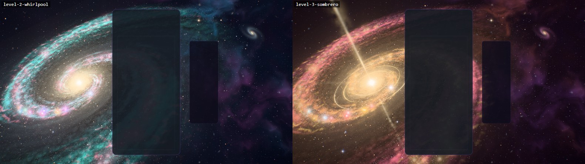

# Galaxy — the grand spiral

Implemented 2026-10-08 on `feature/galaxy-masterpiece`, with Three.js 0.186.1. A from-scratch
rebuild: it replaces the earlier theme in full (the 1,200-line theme class on `WebGLRenderer`,
its 590 lines of GLSL, the point-sprite spiral, the four nebula planes). Galaxy keeps its
identity — a tilted spiral in magenta, violet and blue round a glowing core, drifting slowly,
with a wave that runs out through the arms — and everything else is new. This document records
the shipped design and what was verified. It is a reference, not a backlog.

## The picture

A grand-design spiral hangs in deep space, leaning back from the line of sight. Its bulge is
old gold; a short bar leaves it; two arms open out of the bar, violet near the centre and blue
toward the rim, forking as they go. Pink nurseries glow along the trailing edge of each arm and
threads of dark dust run along the inner edge, reddening the light behind them and crossing in
front of the near side of the bulge. Eighty thousand suns lie over the gas as fine dust with a
few bright ones among them, and the old ones orbit: inside corotation they overtake the pattern
and brighten as they pass through an arm. Behind it all is a deep field — lattices of faint
stars, far galaxies as small tilted smudges, a band of lit cloud across the upper right, a
companion spiral, and a handful of foreground stars with diffraction spikes.

The gameplay card covers the middle of the frame, so the picture is built for what stays
visible: the nucleus burns to the left of the card, the arms sweep behind it, and the upper
right is left to the deep sky and the companion. On an upright phone the galaxy climbs into the
sky above the card.

## The one idea

The galaxy is an instrument and the board plays it. A piece's light leaves the board, falls
into a star nursery and stays there; a clear sends a wave out from the nucleus that sets off
everything the galaxy is holding. The more of it the player has lit, the more a clear sets off.

## Event language

| Event | Response |
| --- | --- |
| Piece lock | A seed in the piece's colour leaves the edge of the card at the piece's own height and falls into a nursery level with that row, near the card or far across the galaxy. The nursery ignites in that colour — a starburst with four spikes, a few sparks — a ring runs out through the gas and the suns round it, and it **keeps** some of that light (it fades over about half a minute), so the galaxy slowly fills with the colours of the pieces played. |
| Hard drop | The same, harder: three seeds, a camera kick. |
| Line clear | The cleared rows leave the card as blades of light at their own heights. A wave leaves the nucleus and runs out through the disc, one front per line: it lifts and flares every sun it passes, the gas lights as it crosses, and each nursery it reaches lets go of what it holds — a white flash, a swell of the colour it was keeping, debris thrown out in the disc's plane. One line answers in the rim's blue, two in the inner arms' violet, three in the jets' colour with a pulse up both jets. |
| Combo | The nucleus charges. A ring stands round it in the disc for every step of the chain (up to six), lit in arcs that turn; the jets push further out along the galaxy's axis; every step sends a knot of light up both jets; the pattern turns faster and the old suns stream through the arms. When the chain breaks the galaxy lets its breath go and the rings fade. |
| Four lines / perfect clear | The galaxy holds its breath: every light sinks for a fifth of a second and the arms wind tighter. Then the nucleus erupts: both jets fire to their full reach behind a bright head, four fronts cross the disc in starfire gold, every nursery goes off as they pass, a thin prismatic ring crosses the sky from the nucleus, the picture itself ripples outward as if a lens slid across it, and shooting stars fly from the nucleus. |
| T-spin | The arms wind up and spring back, and a small ring leaves the nucleus. |
| Level up | The galaxy changes colours: five palettes, cycled (andromeda, whirlpool, sombrero, emerald, ultraviolet). |

Combo here is the true consecutive-clear combo (one `ComboTracker` per player in
`GalaxyDirector`); the bus's `COMBO` event is cascade depth (ADR-0011). With several boards on
screen each lock leaves its own board, and the nucleus charges to the longest chain any board
is holding.

## How it is built

| File | Role |
| --- | --- |
| `galaxy-core.js` | Three-free constants and maths shared by the plan, the choreography and the shaders: the galaxy's geometry, the arm function, ripple and wave timings, how a nursery's held light is carried, the five palettes, where the galaxy sits on screen for an aspect. |
| `galaxy-plan.js` | The plan, seeded and deterministic: every sun in four populations (arm, old disc, bulge, halo), the nursery sites along both arms, the foreground stars. Any prefix of a list is a usable tier. |
| `galaxy-tsl.js` | Hashes, the baked noise texture, the shared uniforms, the spiral function, and the board's light in the disc (lock ripples, clear waves). |
| `galaxy-disc.js` | The gas, the dust and the bulge as one volume: a box round the disc, shaded per view ray. |
| `galaxy-stars.js` | The suns: one instanced draw, every orbit a closed form. |
| `galaxy-nurseries.js` | The star nurseries, the light they hold, their ignitions and novas. |
| `galaxy-nucleus.js` | The nucleus's flare and lens streak, and the two jets. |
| `galaxy-sky.js` | The dome (void, cloud band, star lattices, deep field, companion, the prismatic ring), the foreground stars and the meteor pool. |
| `galaxy-fx.js` | Seeds, nova debris, row beams. |
| `galaxy-world.js` | Owns the uniforms, the parts, the camera rig, the galaxy's pose and the choreography. Shared with the playground effect, so what is iterated there ships. |
| `galaxy-director.js` | Renderer-free: stages bus events per player and resolves one lock and one clear per frame. |
| `galaxy-composition.js` | Three-free: reads the live card, board and HUD rects and maps board columns and rows onto the screen. |
| `galaxy-post.js` | One scene pass, bloom, and one output pass. |
| `galaxy-quality.js` | The six tiers. |
| `galaxy-theme.js` | Lifecycle, renderer selection, settings, layout watch, GPU-loss recovery, capture flags. |

Techniques worth knowing before changing it:

- **One node renderer on both backends.** `WebGPURenderer` on WebGPU, its WebGL2 backend
  otherwise (or `?forceWebGL`). There is no `ShaderMaterial` left. Nothing uses compute: every
  sun, seed, spark and meteor is a closed-form function of the clock, so the WebGL2 backend
  draws the same galaxy.
- **The disc is a volume, walked in layers.** The view ray crosses a slab; it is sampled in
  layers that crowd toward the midplane (y = ±H·(¼ξ + ¾ξ³)), front to back, each adding its
  light through what the dust before it lets pass. The dust takes blue first, so light seen
  through thin dust reddens before it goes out.
- **The grain is read once per pixel.** The two noise reads happen where the ray meets the
  midplane and are shared by every layer. Read per layer, a cloud is a column through the whole
  slab and a leaning view smears it along the ray; read once, the clouds keep their edges and
  the walk costs no texture fetches. The coarse read is in the spiral's own coordinates (across
  the arms, along them), so clumps follow the arms; its mip is chosen from the pixel's
  footprint, because the angle's seam would otherwise fool the automatic choice.
- **Nothing in the gas is cut with a hard threshold.** The light swells and fades; the dust,
  whose shadow is exponential in what it holds, draws the edges. Thresholded noise read as
  confetti.
- **The bulge is solved, not marched.** Its light along the ray is a closed form, split at the
  midplane: the half in front of the dust arrives whole, the half behind it through the lanes.
  That split draws the dark lanes across the near side of the bulge and hides them on the far
  side.
- **The density wave is made of suns passing through it.** Arm suns are stored as an offset
  from their arm's ridge, so they keep the pattern (and follow when a T-spin winds it). Old
  suns orbit with a flat rotation curve and brighten as they cross an arm. The galaxy's frame
  turns with the pattern, so an arm, a nursery or a ripple keeps its coordinates.
- **A sun is never smaller than a pixel.** Its quad is sized from its angular size and clamped
  to a pixel; what the clamp adds in area it takes back in brightness. A sub-pixel sun shimmers
  as the camera drifts.
- **The light a nursery holds is one number.** The moment it would have been lit at full
  strength: held(t) = e^(−(t − epoch)/30 s). Nothing is written per frame and nothing overflows.
  Events are queued with the time they happen at (a seed's landing, a front's passing) and
  applied on the frame that reaches it; whether a nursery has anything to let go is decided
  when the wave gets there, and the ring and the debris start from where the nursery is then.
- **A seed's landing point is resolved in its shader** from the nursery's site, so it lands on
  the nursery however far the pattern has turned or the arms have wound during the flight.
- **The jets are ribbons that turn to face the camera**, drawn double-sided; the far one is
  drawn under the disc so the dust dims it.
- **Closed form first.** Nothing is created at event time: events write numbers into
  ring-buffered uniform slots and preallocated pools. `seek(t)` plus a fixed-step replay
  reproduces any frame.
- **HDR, single output.** The scene is scene-linear and nothing writes depth: the sky is drawn
  first, the gas over it (premultiplied, so the dust dims the stars behind), every light added
  on top. A max-channel knee selects what blooms (no MRT). One output pass does the space
  ripple, the lens fringe, the calm zones on the card and HUD, bloom, rays dragged out of the
  nucleus, a hue-preserving filmic curve, grade, vignette, grain and dither. An iris closes as
  the galaxy flares so its colours survive the surge. `usesMrtScenePass()` is false.
- **No MaterialX noise.** One tileable fBm texture is baked on the CPU with its own mip chain.

## Tiers

| Tier | Suns | Layers through the gas | Nurseries | Sparks | Star lattices | Cloud band, deep field | Bloom, rays | Fringe |
| --- | ---: | ---: | ---: | ---: | ---: | --- | --- | --- |
| Minimal | 12,000 | 1 (thin disc) | 40 | 128 | 1 | off, off | off | off |
| Low | 24,000 | 1 (thin disc) | 56 | 224 | 2 | on, off | off | off |
| Medium | 46,000 | 6 | 72 | 384 | 2 | on, on | on | off |
| High | 84,000 | 10 | 96 | 640 | 3 | on, on | on | on |
| Ultra | 130,000 | 14 | 120 | 900 | 3 | on, on | on | on |
| Extreme | 190,000 | 20 | 144 | 1,200 | 3 | on, on | on | on |

Every tier keeps the whole picture and every event. These are allocation budgets, not
measurements of frame rate.

## Assets

None. Everything is generated in code: the plan, the noise, the gas, the suns, the sky. No
model or texture file is loaded, and Blender was not needed: a galaxy is a volume and a field
of points, and what makes it read is the shading. The earlier theme loaded no assets either.

The earlier theme's 715 lines of DOM-effect CSS (star layers, nebula layers, shooting stars,
constellation bursts: all left from before it moved to WebGL, none of it matched by any
element) leave `public/styles/main.css`; `#galaxy-theme` keeps only its background colour.

## Verification

- Unit tests: 152 new tests in four files (director 19; plan 31; world 56; theme 46). The
  lifecycle-audit test no longer lists Galaxy among the themes whose `cleanup()` wraps a legacy
  `dispose()` (29 tests there). With the theme-wide tests the change could touch (dual-state
  tripwire, portable renderers and context recovery, portrait composition, teardown
  regressions, registry lifecycle acceptance, thumbnails, mobile quality and WebGL2 validation,
  URL-parameter catalogue): 24 files, 389 tests, all passing.
- Whole suite, run once while a dozen other sessions held the machine: 689 files, 9,179 tests;
  686 files passed. Two of the three that did not are wall-clock timeouts in Odyssey tests this
  change does not touch (a 5 s and a 30 s limit); both pass when run alone. The third
  (`odyssey-level-briefing`) expects "250,000" and gets "250 000" from this machine's Swedish
  number format, and fails identically on `main`.
- Gates: typecheck; lint ratchet (806 errors against a baseline of 807: the new files add none,
  the old ones took one with them; the baseline was left as it is); theme lifecycle audit;
  dependency boundaries (1,284 modules); architecture fitness (three metrics improved, not
  locked in); production build with the boot-closure guard; IP-string gate; Pages artifact
  check; release gates — all pass. The palette gate fails on `main` and here for the same
  unrelated reason (Stillwater); Galaxy scores 0/7 on it.
- Playground captures on WebGPU (RTX 3070 Laptop, 1445 × 813): rest at three moments of the
  pattern's turn; a lock and a hard drop at five moments; the galaxy holding eighteen locks;
  clears of one, two and three lines; held chains of five, six and eight; the four-line hush,
  eruption and aftermath at six moments; a perfect clear; a T-spin; a level change; four more
  palettes; rest or an event at Minimal, Low, Medium, Ultra and Extreme; High and Low on the
  forced WebGL2 backend; an upright 390 × 844 frame at rest, in a chain and through a four-line
  clear; a 21:9 and a near-square frame; reduced motion. The final set of 17 had no console
  errors or warnings.
- In the real game (Electron, dev server, single player, themes unlocked with `?unlockAll=1`):
  the theme starts on WebGPU, aims its events at the live board, takes real hard drops from the
  keyboard and bus-injected locks, clears, a chain and four lines, survives a live quality
  change (High to Medium) and lets go of its canvas when another theme takes over; no console
  errors or warnings. The same event script ran clean on the WebGL2 backend at Low and on the
  integrated GPU at High.
- The repo's lifecycle validator (`scripts/validate-all-themes.mjs`) cannot reach any locked
  theme since the theme collection landed: its worker's page URL carries no `unlockAll=1`, and
  it clicks a theme card, which now opens the theme's detail page instead of selecting it. As
  shipped it fails Galaxy on five theme-card checks with no console error. Run through a scratch
  copy of the worker with those two steps added (the URL parameter, a click on the detail page's
  Apply button), Galaxy passes all 105 checks: 0 lifecycle failures, 0 console errors, 0 shader
  pipeline failures. The tracked script was left as it is.
- A helper agent wrote the theme class, the director and the tests from the Lunara precedent,
  and its two reviews of the world found faults the captures had not shown: nova debris decided
  at clear time (so a seed still in flight went off without it, and two clears close together
  counted every nova twice); debris and rings starting where a nursery had stood rather than
  where it was; a seed's landing point frozen at launch; a T-spin perfect clear losing its
  eruption ring; foreground stars that differed per tier; a malformed click jamming the nursery
  queue; debris outrunning its pool on four lines; the surge and the sky's answer starting with
  the hush instead of the eruption. All are fixed and covered by the tests above.

Observed, not measured (whole-game frame rate at 1445 × 813 on the RTX 3070 while other
sessions held the machine, single runs): about 130 fps at High (frame interval 7.7 ms median at
rest and through the event script, no frame over 66 ms) and 129 fps on the WebGL2 backend at
Low. As a correctness check only, the same script on the integrated AMD GPU drew every event
at High (about 67 fps) and at Low (about 131, at 0.85 scale).

Not verified: GPU cost per tier through the theme perf lane (ADR-0016); physical phones; local
multiplayer, Infinity and Odyssey layouts in a capture (their routing is unit-tested only); the
icon on an Odyssey level orb; sessions of several hours. `docs/theme-screenshots/galaxy.png`
still shows the previous artwork (a fleet capture writes it).

## Reproduce

Run `npm run dev:playground`, then:

`/playground.html?effect=galaxy&t=20&quality=High&board=1`

Add `event=lock|drop|clear|quad|tspin|perfect|levelUp` with `eventAge=<s>`, and `combo=<n>`,
`level=<n>`, `lines=<n>`, `u=<0..1>`, `row=<r>`, `color=<hex>`. `locks=<n>` plays n locks first,
so the galaxy is holding their light when the event fires. `demo=1` (without `t`) plays a
looping script. `parts=` draws only the named parts; `falseColor=1` bands the pre-tone-map
peak; `noPost=1` shows the raw scene; `forceWebGL=1` uses the WebGL2 backend; `reduce=1` is
reduced motion. In the game: `?galaxyTime=`, `?galaxyFixedDt=`, `?galaxyParts=`,
`?galaxyFalseColor=1`.

The theme icon is a frame of the scene through the playground's icon lens (the camera
turned to the nucleus and opened to 36°), four steps into a chain with twelve locks held:

`/playground.html?effect=galaxy&t=20&quality=Extreme&icon=1&iconFov=36&locks=12&combo=4`

captured in an 813 × 813 window (the largest square this laptop's screen allows), cropped to
90% of the frame round its centre, given a colour lift (contrast 1.18, saturation 1.32,
brightness 1.08) and baked as a 512 px circle on a transparent ground. The same file is kept at
`public/assets/themes/galaxy-theme-icon.png`.

## Captured previews

