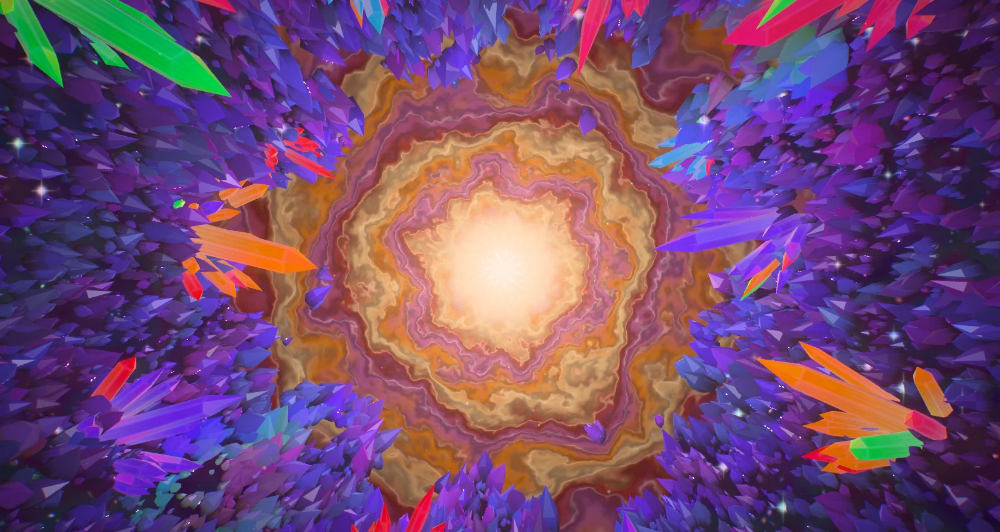
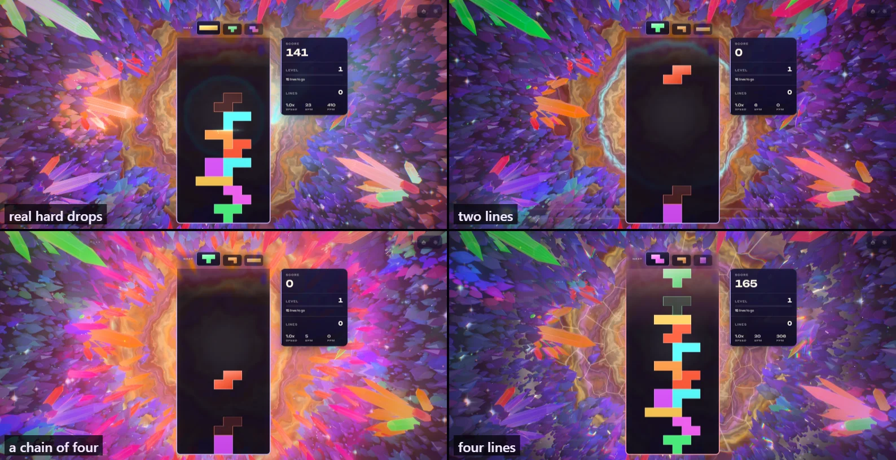
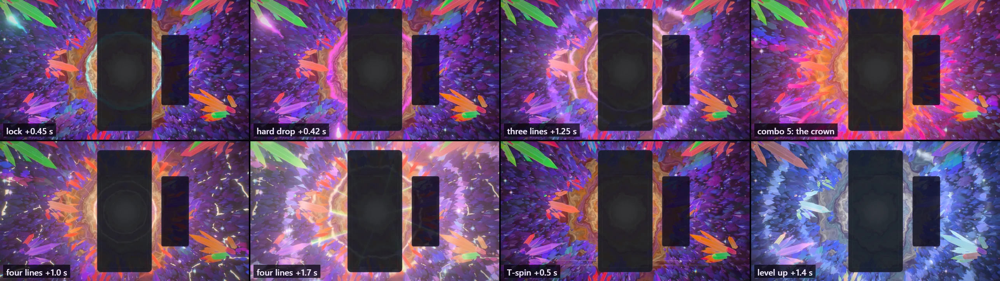
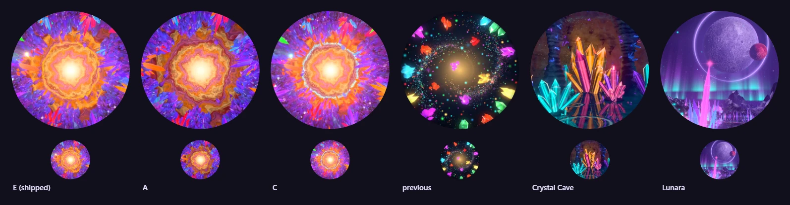
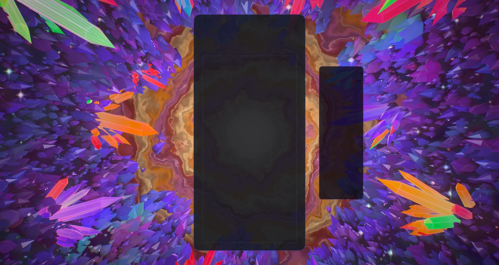
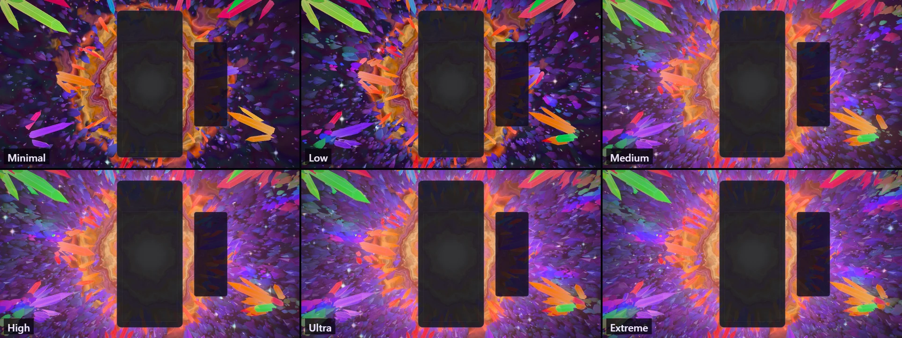
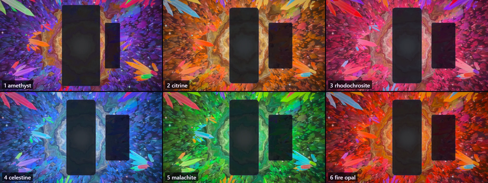
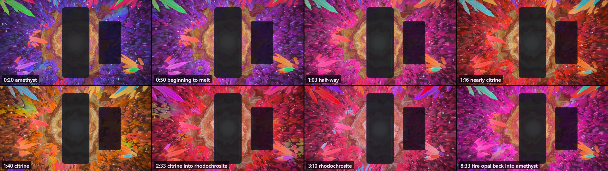
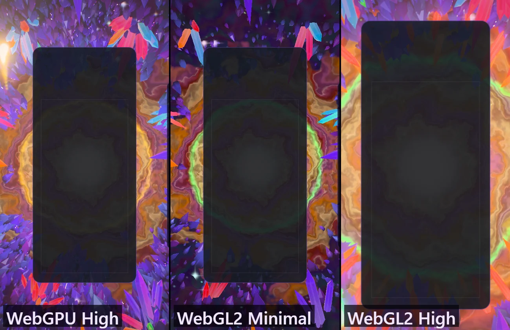

# Geode — the heart of the geode

Implemented 2026-10-08 on `feature/geode-masterpiece`, with Three.js 0.186.1. A from-scratch
rebuild: it replaces the earlier theme in full (the 1,600-line theme class on the classic
`WebGLRenderer`, its nine GLSL `ShaderMaterial` pairs, the `EffectComposer` bloom and
chromatic-aberration passes, the per-event meshes created and disposed at event time, and four
legacy DOM layers with about 300 lines of CSS). Geode keeps its identity — the view from inside
a hollow lined with crystal, the warm light at its centre, jewel-coloured clusters pointing in
from the edge of the frame, glitter everywhere — and everything else is new. This document
records the shipped design and what was verified. It is a reference, not a backlog.

## The picture

The viewer floats inside a great hollow geode, an egg-shaped cavity seventy spans deep, and
looks down its long axis. At the far end the wall is thin and lit from behind: the heart, a
window of sugar-white crystal, and round it the agate — concentric bands of honey, cream, rust
and orchid that wander like the bands of a fortification agate and dim outward. Past a ragged
edge the lining takes over: thousands of small amethyst points, glowing where they border the
agate and darkening toward the viewer, flashing as the view drifts. Eighteen clusters of large
crystals stand in from the wall round the frame, each cut from one mineral — amethyst, citrine,
rose, aquamarine, garnet, emerald. Dust drifts down the axis in the heart's light, and stars
flash on the lining.



The gameplay card stands in front of the heart like a pane of dark glass in front of a lamp, so
the picture is built for what stays visible: the agate spreads well beyond the card on every
side, the heart's light streams out round its edges, and the hero clusters stand left and right
of it and reach in from the corners.



## The one idea

The geode is an instrument of crystal, and the board plays it. Everything that happens on the
board travels along the wall as a ring round the heart — the wall coordinate `w` is the angle
from the far pole, so lines of equal `w` are rings that open toward the viewer — and the hero
crystals are its bells: they ring when struck, hold the colour they were struck with, and let
it go when a clear's wave passes them. A chain of clears makes the geode grow.

## Event language

| Gameplay | The geode's answer |
| --- | --- |
| Piece lock | A ring in the piece's colour leaves the heart and runs out through the agate's bands into the lining, waking its glitter. A spark of the same colour leaves the card's edge at the piece's height and flies into a hero crystal on that side: the crystal flashes from root to point, its cluster chimes after it, a ripple runs over the wall round its foot, dust flies from it along its axis, and it keeps some of that light for half a minute. |
| Hard drop | The same, harder: a brighter ring that reaches further, three sparks into three crystals, a camera kick and a lens-fringe jump. |
| Line clear | The cleared rows leave the card as blades of light at their own heights. A wave leaves the heart and runs down the wall toward the viewer, one front per line; as it passes each hero crystal, the colour that crystal was holding flares out and is gone. One line answers in the agate's first band colour, two in the heart's light, three in the lining's. |
| Combo | The geode grows. For every step of the chain past the first, a ring of crystals shoots out of the wall — each ring further from the heart and in the next colour of the spectrum (gold, orange, rose, magenta, violet, blue, cyan, green) — the heart announces each ring with a pulse in its colour, a seam of light marks where it stands, the heart brightens and the dust quickens. When the chain breaks the crown shatters into dust of its own colours. |
| Four lines | The geode holds its breath: every light sinks for a fifth of a second. Then the lining fractures — a network of cracks opens outward from the heart, burning white-gold, and heals — every cluster's tallest crystal throws a prismatic lance, and a ring crosses the frame splitting the picture into its colours. |
| T-spin | The agate itself turns one notch of its fortification, and a faint prism ring crosses the frame. |
| Perfect clear | A four-line answer with four fronts and a hotter surge. |
| Level up | The geode recrystallises as the next mineral: a pale wave carries the new palette down the wall. Six minerals cycle: amethyst, citrine, rhodochrosite, celestine, malachite, fire opal. |
| Time | With no help from the board the geode turns through the same six minerals by the clock: it rests on one for 36 s, then melts into the next over 54 s (`MINERAL_PERIOD` 90 s, `MINERAL_HOLD` 0.4, `mineralDrift` in `geode-core.js`), nine minutes for the whole cycle. A melting colour turns the short way round the colour wheel while its saturation and brightness cross over (`paletteAt`), so the geode is as vivid between two minerals as on either one; a straight mix went grey half-way. No wave and no stir: it melts, it does not recrystallise. A level is one step on top of wherever the clock has brought it, so a level-up always lands on a mineral the geode is not showing. The turn is a function of the world clock alone, so a seek and a replay agree, and it is not slowed by reduced motion (a slow change of colour is not motion). Added 2026-10-09 at the user's request. |

The reaction settings are honoured: `backgroundComboEffects` off silences everything,
`pieceLockRipple` off silences locks, reduced motion stills the camera, shortens the sparks and
halves the fracture.



## How it is built

`src/themes/geode/` (the playground effect `src/playground/effects/geode.effect.js` mounts the
same world and post stack, so what is iterated there ships):

| Module | Role |
| --- | --- |
| `geode-core.js` | Three-free constants and CPU maths: the cavity, the wall coordinate, wave kinematics, palettes, colour helpers. |
| `geode-layout.js` | The deterministic plan: the wall's relief, eighteen hand-placed hero clusters (twenty crystals each, listed by importance), the crown's eight rings, the druzy lining, the stars. |
| `geode-tsl.js` | Shared TSL: hashes, the baked noise texture, the shared uniforms, the lights (heart rings, strike ripples, clear fronts), the glitter function, the agate ramp, the cavity as a facet mirrors it. |
| `geode-shell.js` | The wall: heart window, agate bands, lining with world-space glitter, the crown's seams, the fracture network. |
| `geode-crystals.js` | The hero crystals and the crown (one instanced draw), tip glints and prismatic lances (two draws that share its buffers), and the druzy (one cheaper instanced draw). |
| `geode-fx.js` | Air (dust and stars, one draw), sparks, shards, row beams. |
| `geode-world.js` | Owns the plan, uniforms, parts, camera rig and choreography. |
| `geode-post.js` | The post stack. |
| `geode-director.js`, `geode-composition.js` | Gameplay events staged per player and resolved once a frame; the live board, card and HUD rects. |
| `geode-theme.js` | Lifecycle, renderer, settings, layout watch, GPU-loss recovery, capture flags. |
| `geode-quality.js` | Content tiers. |

Notes on the parts:

- **No scene lights and no framebuffer reads.** Every material is a `MeshBasicNodeMaterial`
  that shades itself from the shared uniforms: the heart (a point just inside the far pole), a
  cool fill from the viewer's side, and the event slots. The scene is authored in scene-linear
  HDR; the post stack owns the tone map.
- **The crystals are cut stones.** Flat facets (the normal is the triangle's own, from screen
  derivatives), pale at the root and deep toward the point; the heart's light coming through
  the stone, strongest where it is thin; the cavity mirrored by Fresnel; the prism's far edges
  seen through the near face as bands that slide as the eye moves; chevron phantoms; a catch
  light along every arris; and dispersion — a facet flashes one colour of the spectrum when it
  bends the heart toward the eye, and runs through the spectrum as the view drifts.
- **The heart is behind everything the camera sees**, so the lining is backlit: its visible
  faces are lit by transmission and by flashes, not by diffuse light. That is what makes it read
  as translucent stone and keeps it dark enough for the hero clusters and the events to carry.
- **Glitter holds its size on screen.** The lining's glints are one per cell of a world-space
  grid, evaluated at two cell sizes chosen from the pixel footprint and blended, so the grain
  neither swims nor aliases with distance.
- **Per-crystal state** (light held, flash, lance) lives in one interleaved instanced buffer
  written only when gameplay happens; the crown needs no buffer writes at all (its growth is a
  function of one uniform and each crystal's ring).
- **Nothing is created at event time.** Every pool is always drawn with zero-size dormant slots,
  so the first frame compiles every pipeline and `getWarmupRoots()` is empty. Everything is a
  function of the world clock and event timestamps, so `seek(t)` plus a fixed-step replay
  reproduces any frame.
- **Draw order**: the stones first, the wall after them (it is shaded only where it shows
  between them), then the additive layers.
- **Post**: one single-output scene pass, bloom with a hue-preserving max-channel knee, shafts
  dragged out of the heart, a prism ring and lens fringe, calm zones behind the card and HUD,
  a hue-preserving filmic tone map, grade, vignette, grain and dither — in one full-screen pass.

## Tiers

Every tier keeps the whole picture and every event.

| Tier | Hero crystals | Crown per ring | Druzy | Dust | Stars | Shards | Bloom / shafts | MSAA | Extras |
| --- | --- | --- | --- | --- | --- | --- | --- | --- | --- |
| Minimal | 54 | 12 | 1,400 | 0 | 120 | 96 | off | 0 | one glitter grain |
| Low | 108 | 16 | 3,200 | 300 | 220 | 160 | off | 0 | one glitter grain, wall fire |
| Medium | 180 | 22 | 7,000 | 700 | 340 | 320 | on / 6 taps | 0 | + dispersion, two grains |
| High | 252 | 28 | 11,000 | 1,200 | 520 | 512 | on / 10 taps | 4 | + lens fringe |
| Ultra | 324 | 34 | 16,000 | 1,800 | 680 | 768 | on / 12 taps | 4 | |
| Extreme | 360 | 40 | 22,000 | 2,600 | 840 | 1,024 | on / 14 taps | 4 | |

## Assets

None. The theme downloads nothing: one 256² noise field is baked on the CPU at build, and every
shape is generated. Blender was offered for this pass and was not used: every form in the
picture is a six-sided prism, a lumpy shell of revolution or a quad, and the look is shading.

The icon was recaptured from the playground and baked as a 512 × 512 full-bleed circle on a
transparent ground (both copies: `src/themes/geode/` and `public/assets/themes/`). Shipped:
candidate E, the heart with the crown's first ring. A and C are the alternatives.



## Verification

- Unit tests: 160 new tests in four files (world 69, theme 46, plan and CPU maths 26, director
  19), all passing, with eslint clean on the theme, the playground effect and the tests; the
  seven registry suites that list themes (URL-parameter catalogue and UI, mobile WebGL2
  validation, dual-state tripwire, container registry, lifecycle acceptance, music catalogue):
  61 tests, passing. The suites were written by a helper agent against the public behaviour (it
  was not allowed to edit the world), and its random-play runs — five 150 s scripts of 882
  locks and 387 clears, and three more with 49 level-ups — are what found the faults listed at
  the end of this section. On the final code those runs report, over 75,195 passes of a wave
  over a crystal: no light changing at the instant of an event, none rising without a spark
  landing, none surviving a wave that should have taken it, none vanishing without a wave, and
  a flare set for every wave that is still drawn.
- Whole suite, once, before the last two fixes to the crystal bookkeeping (which only the Geode
  suites exercise): 689 files, 9,188 tests, one failure —
  `odyssey-level-briefing.test.js` expects "250,000" and this machine's Swedish locale formats
  it "250 000". It fails the same way on untouched `main`.
- The clock's turn through the minerals (added 2026-10-09): six more tests, 166 in the four files
  (world 73, plan and CPU maths 28). They pin the rest and the melt, that a seek and a run agree at
  any frame rate, that a level is one step on top of the clock, that no colour loses saturation
  or brightness on the way, and that nothing jumps at the seams. Playground captures at eight
  clock times, a level and a level-up and a four-line clear half-way through a melt, and the
  WebGL2 backend, all with a clean console; the real game left idle on level 1 had turned 0.6
  of the way to citrine after 66 s, with no console message.
- Gates on the branch: typecheck and the TypeScript ratchet; lint ratchet (796 errors against a
  baseline of 807; the new files add none and the baseline was left as it is); architecture fitness; theme lifecycle audit; dependency boundaries;
  production build with the boot-closure guard; IP-string gate; Pages artifact check; release
  gates; perf-budget gate — all pass. The palette gate fails on `main` and here for the same
  unrelated reason (Stillwater); Geode scores 0/7 on it.
- Playground captures on WebGPU (RTX 3070 Laptop), all with a clean console: rest with and
  without the board; lock, hard drop, three lines, a held chain of five, four lines at two
  moments, T-spin and level-up; every tier; all six minerals; an upright 430 × 840 frame; High
  and Minimal on the forced WebGL2 backend; the live demo loop.
- In the real game (Electron, dev server, single player, `unlockAll=1`): the theme starts on
  WebGPU, aims its events at the live board, takes real hard drops from the keyboard and
  bus-injected locks, clears, a chain of six and four lines, survives a live quality change
  (High to Medium) and lets go of its canvas when another theme takes over; the same event
  script ran clean on the WebGL2 backend at High. No console errors or warnings in any run.
- `scripts/validate-all-themes.mjs --theme geode` could not be used as evidence: it selects the
  theme through its hub card, and every theme but Forest is now locked behind its Odyssey orb;
  the validator has no way to pass `unlockAll=1`. It stopped at the card (5 of its first 20
  checks) with no console error. The lifecycle points it would have covered were checked with
  the scratch harness above.
- Faults found on the way and fixed, all covered by tests now: light showing in a crystal
  before its spark had landed when it was struck twice in flight; a lock right after a line
  clear doing the same; a release overwriting the strike's flash (and the reverse); light that
  landed between two waves' passes surviving the second; the second of two waves emptying a
  crystal without a flare, and every third wave of a steady run losing its flare; a level-up
  taking a wave's shader slot while the crystals still answered the wave it replaced; a resize
  with no board on screen aiming at the previous frame's crystals; a hard drop sometimes
  sending two sparks instead of three. The crystal state now keeps a strike flash, a release
  flash with a two-deep queue behind it, and two cuts — one for each wave the shaders draw.

Observed, not measured (whole-game `requestAnimationFrame` rate at 1584 × 813, High, on a
120 Hz panel, on a machine a dozen other sessions were loading; not an ADR-0016 reading): about
128 fps on the RTX 3070 on both backends, with frame intervals of 7.7 ms at the median and
under 10 ms at the 99th percentile through idle and events. On the integrated AMD GPU two runs
of the same script gave 90 fps (8.4 ms median, 20 ms at the 99th percentile through events) and
133 fps (7.7 ms median, 9 ms at the 99th), which says more about the load on the machine than
about the theme.

Not verified: GPU cost per tier through the theme perf lane (ADR-0016); physical phones; local
multiplayer and Infinity layouts in a capture (their routing is unit-tested only); the icon in
the running picker and on an Odyssey level orb; sessions of several hours. A theme started in
the middle of a run shows the first mineral until the next level-up, because nothing tells a
theme the current level at start (inherited from the shared director).

## Reproduce

Playground (private dev server in the worktree:
`VITE_CACHE_DIR=node_modules/.vite-geode-6413 npx vite --host 127.0.0.1 --port 6413 --strictPort`):

```
/playground.html?effect=geode&t=20&hud=0&quality=High&board=1&locks=5
  + event=lock|drop|clear|quad|tspin|perfect|levelUp   eventAge=<s>  lines=<n>  color=<hex>
  + combo=<n>   level=<n>   locks=<n>   demo=1 (live)   forceWebGL=1   reduce=1
  + parts=shell,druzy,crystals,glints,beams,air,shards,wisps,rowBeams   falseColor=1   noPost=1
```

The icon: `/playground.html?effect=geode&t=20&hud=0&quality=Ultra&icon=1&iconFov=72&combo=2&locks=6&event=lock&eventAge=0.5&color=ffd060`
captured square, centre-cropped, graded (saturation 1.22, contrast 1.12, brightness 1.04) and
masked to a circle at 512 px.

In the game: `/?skipIntro=1&unlockAll=1`, background mode "Specific", theme Geode. Theme capture
flags: `geodeTime`, `geodeFixedDt`, `geodeParts`, `geodeFalseColor`, `geodeForceWebGL`.

## Captured previews










