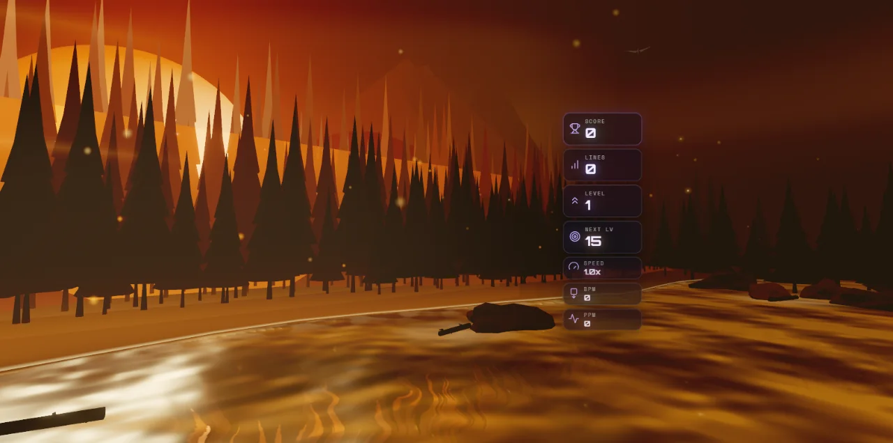
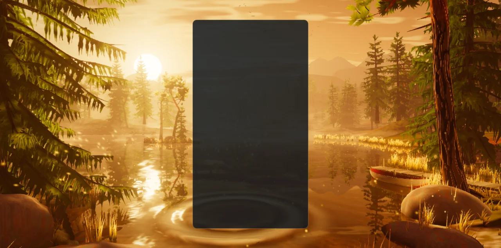
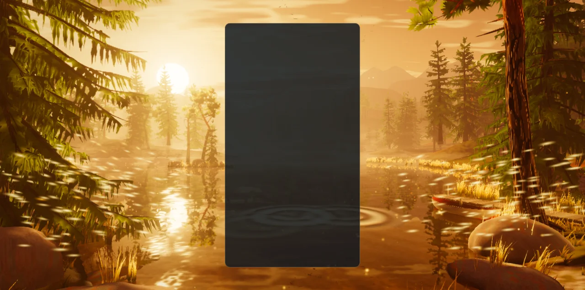
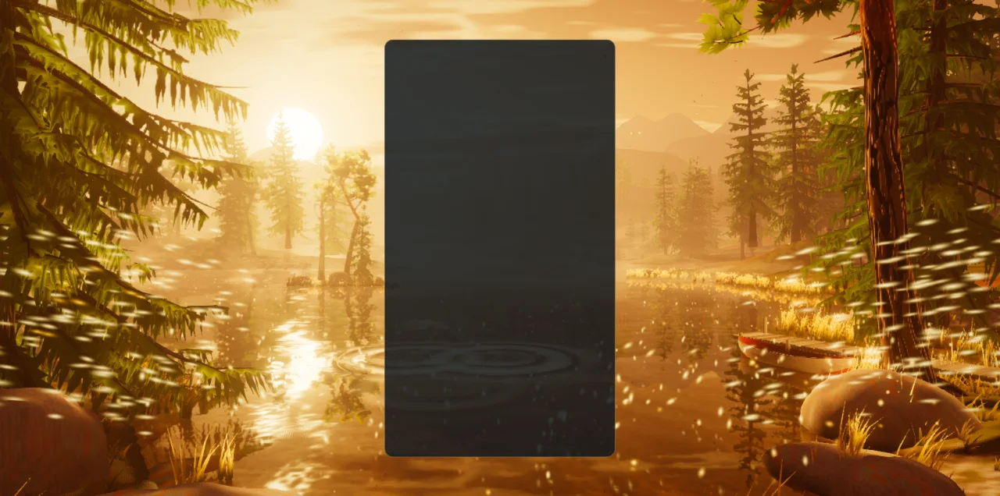
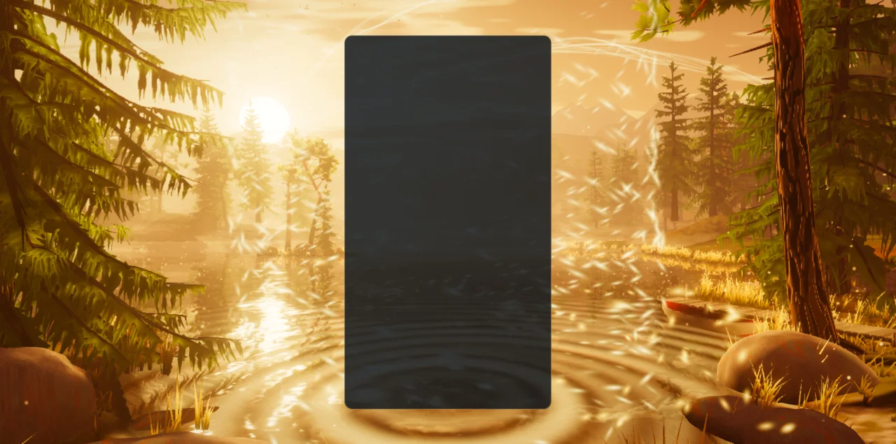
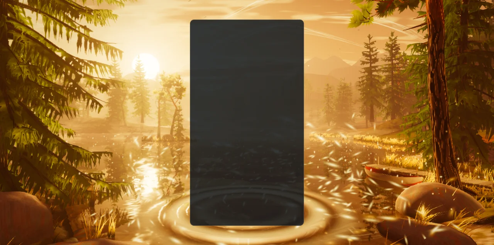
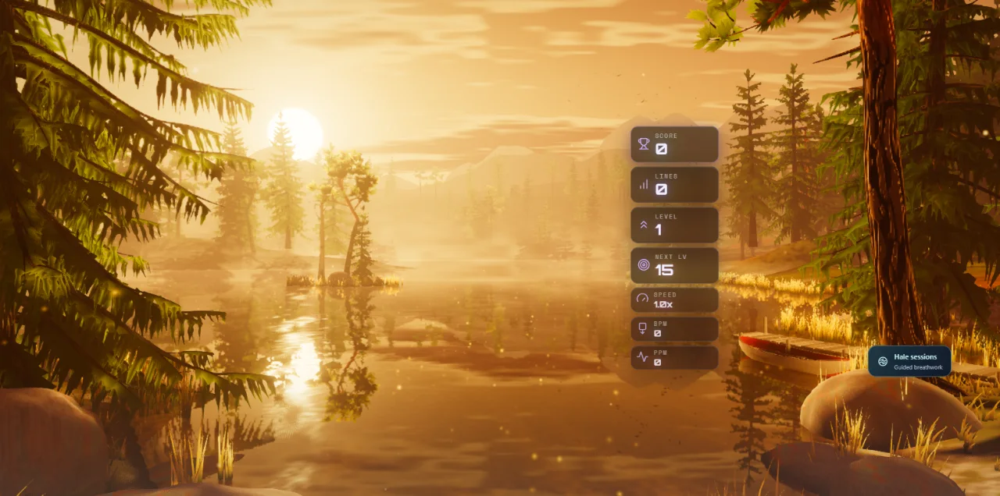
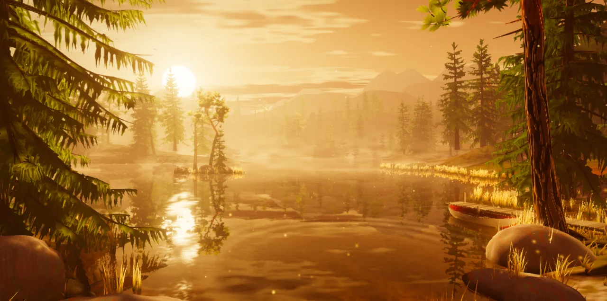
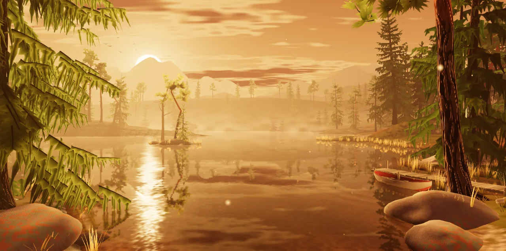
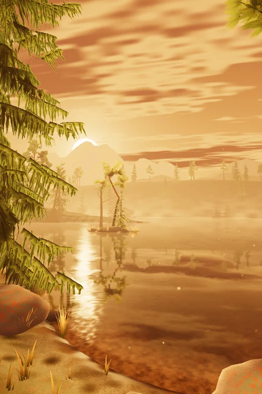

# Golden Forest — the lake at the golden hour (visual overhaul, 2026-10-05)

**Status: implemented (branch `feature/golden-forest-masterpiece`). A record of what was
built and how it was checked — not a backlog.** Replaces the layered-silhouette scene and
its twin GLSL/TSL implementation.

| Before | After (High, native WebGPU) |
| --- | --- |
|  |  |

## What the player sees

The same place as before — a Nordic lake, spruce against a huge low sun, everything gold —
now built as a world. The sun rests on the treetops of a wooded headland across the water
and lays its path over the lake. An old spruce frames the left of the screen with hanging
boughs; on the right a shore pine leans out over a plank jetty and a moored rowboat.
Between them: an islet with a wind-bent pine and a dead one, a reedy spit with two
spruces, a promontory, an island, the far shore climbing into hills, and four mountain ridges, each paler than the last. The
lake is a real mirror of all of it, glassy in the lee of the banks and ruffled where the
breeze touches down. Mist lies on the water, shafts of light are real volumes cut by the
trees, fireflies keep to the lower boughs and the reeds, and a flock wheels over the far
side while a skein crosses the sun.

The board card hides the middle quarter of a landscape screen, so the picture is composed
for the two side thirds and the strips above and below the card. Portrait keeps the same
world, turned toward the sun.

## How the lake answers the game

`GoldenForestReactions` is a pure director; `GoldenForestSparkDirector` turns its cues into
fireflies thrown from behind the board card and rings dropped on the water behind it, at
the column and height where the event happened.

| Event | Response |
| --- | --- |
| Piece lock | A ring spreads over the lake from where the piece landed, bending the reflection as it goes; a puff of fireflies leaves the card's edge beside the piece. |
| Hard drop | A stronger ring, and from a long drop a splash of light thrown up off the water. |
| Line clear (1–3) | Twin jets of fireflies from both sides of the card at the cleared rows, a broad ring, the sun's path flaring; from two lines a second ring and a front of wind that bends trees and reeds as it crosses. |
| Four lines | All of that, the lake breathing out light all around the board, a sunburst, and the flock going up. |
| Combo / streak | Fireflies gather into a river that winds around the board. Cascade depth (`COMBO`) or consecutive clearing locks raise it; it climbs, quickens and pales toward white gold, and above the halfway mark ribbons of light unfurl across the sky. A lock without a clear ends the streak and the river unwinds. |
| T-spin | A spiral flourish beside the board and a ring. |
| Back-to-back | Holds the river and lifts the light. |
| Perfect clear / level up | The whole lake exhales: light, rings, wind and wings. |
| Game over | The wind dies; sparks sink to the water and go out, leaving rings where they land. |

A spark that touches the lake goes out and leaves a small ring (at most a few a second),
and now and then a fish rises or the boat rocks, so the water is never dead. Everything honours
`backgroundComboEffects` and `pieceLockRipple`, pauses with the theme, and is driven by
simulation seconds. No event allocates: sparks come from a fixed hidden reserve, emitters
and rings from fixed pools (4–16 emitters and 4–10 rings by tier).

| Hard drop | Three lines | Four lines |
| --- | --- | --- |
|  |  |  |

| Combo ×9, held | Perfect clear | In the game |
| --- | --- | --- |
|  |  |  |

## How it is built

### Trees and props authored in Blender

`scripts/blender/golden_forest_assets.py` grows eight conifers (a hero Norway spruce, a
hero Scots pine, four grove spruces, two grove pines) on the branching library the Fall
grove introduced, bakes bark ambient occlusion in Cycles, renders the far-shore sprite
sheet, and builds the rowboat, jetty, boulders and dead pine. A tree file holds a bark
mesh and a point cloud of *foliage sites*; the runtime instances shared needle sprays onto
them. Needles are serrated geometry, not alpha cards. Details, formats and the
regeneration command are in
[`src/themes/golden-forest/assets/ATTRIBUTION.md`](../src/themes/golden-forest/assets/ATTRIBUTION.md).
The pack is 2.9 MB in eleven files with no third-party source, and regenerating it
reproduces every file byte for byte (checked by regenerating into a scratch folder and
comparing hashes). It replaces 33 MB of ground textures the old theme shipped but no
longer drew.

The generator runs **headless** (`blender --background --factory-startup`); the Blender
MCP session was not used, so nothing in an open Blender was touched.

### Runtime modules (`src/themes/golden-forest/`)

| Module | Owns |
| --- | --- |
| `golden-forest-theme.js` | Lifecycle, renderer, asset loading, gameplay subscriptions, board tracking. |
| `golden-forest-assets.js` | Loading and decoding the GLBs and the sprite sheet. |
| `golden-forest-world.js` | Composition root: builds and updates everything below. |
| `golden-forest-light.js` | The sun, its static shadow map, haze, ambient, wind, a shared noise texture. |
| `golden-forest-composition.js` | Camera framings, hand-placed trees, the procedural stands, the visibility test. |
| `golden-forest-terrain.js` | The analytic shores and heights, the ground, the lake-depth map. |
| `golden-forest-forest.js` | Bark and needle instancing and their materials. |
| `golden-forest-backdrop.js` | The sprite forest of the far shores and the mountain ridges. |
| `golden-forest-lake.js`, `golden-forest-ripples.js` | The mirror, the water surface, and the pool of rings. |
| `golden-forest-shore.js` | Reeds, grass, boulders, the jetty, the rowboat, the dead pine. |
| `golden-forest-atmosphere.js` | Sky, sun, cloud, mist banks, sun motes. |
| `golden-forest-birds.js` | The flock and the skein. |
| `golden-forest-ribbons.js` | The ribbons of light a combo draws. |
| `golden-forest-spark-sim.js`, `golden-forest-sparks.js` | The fireflies: simulation, and drawing. |
| `golden-forest-reactions.js` | The event director (pure). |
| `golden-forest-stage.js`, `golden-forest-spark-director.js` | Board card → world, and cues → sparks, force fields and rings. |
| `golden-forest-post.js` | Volumetric shafts, bloom, grade, FXAA. |
| `golden-forest-quality.js` | One table for everything a tier scales. |

### Techniques (three 0.186.1)

- **A planar mirror with an analytic ring pool.** The lake samples three's `ReflectorNode`
  through a wave normal built from the shared noise texture plus up to ten expanding
  rings, each one `vec4` (position, age, strength) in a uniform array. Rings need no
  feedback texture, so they are identical on both backends and reproducible in a capture.
  Fireflies, birds and ribbons are scenery, so the mirror shows them too. A baked depth
  map gives tea-brown shallows over gravel and glassy water in the lee of the banks.
- **One static shadow map, used everywhere.** Materials stay unlit `MeshBasicNodeMaterial`
  and call a shared `shadow(light)` node themselves; the shores never move under a fixed
  sun, so the map is drawn over the first frames only. Ground, bark, needles, sprites,
  mist, motes and the lake's own glitter all read it.
- **Volumetric shafts with `GodraysNode`**, at half resolution with a bilateral blur.
  The one render that builds the shadow rig before the node graph goes to a target shaped
  like the scene pass's, so it compiles the pipelines the pass will use rather than a
  second set for the canvas.
- **Needles as thin serrated blades.** Front light, a gold fringe when the sun is behind
  the spray, a baked sky-visibility term and bent normal per spray, and a per-tree place
  on a species ramp. No alpha cards, so no overdraw and no alpha-test shimmer.
- **Global instancing.** Every spray of every tree is an instance in eight draws. Sprays
  that can never be on screen — directly or mirrored in the lake — are dropped at build
  time.
- **Closed-form birds.** Flock and skein are functions of time in one vertex shader: no
  compute pass, no per-frame CPU work, the same flight on both backends.
- **CPU firefly simulation.** A few thousand points in typed arrays: the same code on
  both backends, in the playground's deterministic `seek`, and in the unit tests.

### Quality tiers

| Tier | Stands / far trees | Sprays kept | Fireflies | Rings | Mirror | Shafts | Post |
| --- | --- | --- | --- | --- | --- | --- | --- |
| Extreme | 46 / 420 | 100 % | 3,400 | 10 | 0.75 | 40 steps | on |
| Ultra | 40 / 360 | 100 % | 2,800 | 10 | 0.6 | 32 steps | on |
| High | 34 / 300 | 86 % | 2,200 | 8 | 0.5 | 26 steps | on |
| Medium | 26 / 220 | 62 % | 1,400 | 6 | 0.4 | 16 steps, 0.35 scale | on |
| Low | 18 / 140 | 40 %, trunks only | 800 | 4 | 0.3 | analytic glow in the haze | off |
| Minimal | 12 / 90 | 28 %, trunks only | 420 | 4 | 0.22 | analytic glow in the haze | off |

"Stands" are the modelled conifers beyond the seven placed by hand; "Mirror" is the
resolution scale of the reflection. Low and Minimal draw the same scene directly with ACES
tone mapping and skip limb geometry (the bark index buffer is ordered so a tier can stop
before it). At High the trees are 0.61 M triangles (0.38 M needles, 0.23 M bark) and the
whole scene about 1 M by my count of the other meshes, before the mirror pass draws most
of it again.

| WebGL2 backend, High | Low (no post) | Portrait, Low, WebGL2 |
| --- | --- | --- |
|  |  |  |

## Verification

- **Playground** (`npm run dev:playground`, `?effect=golden-forest&orbit=0&hud=0`): the
  captures above, each with a clean console (no WebGPU validation errors, no TSL warnings),
  on native WebGPU and with `forceWebGL=1`. Events are reproducible with
  `&t=8&event=lock|drop|clear|double|triple|quad|combo|streak|spin|perfect|level|over`,
  `&eventAge=<s>`, `&col=0..9&row=0..19`, `&combo=<n>`, `&hold=1` (repeat the event every
  second, to hold a combo) and `&board=1` for a stand-in card. The effect uses the theme's
  own generator and default seed, so it grows the forest the game grows. `&icon=1` is the
  icon's lens.
- **In the game**: `node scripts/validate-all-themes.mjs --theme golden-forest` against
  the dev server — PASS, 0 lifecycle failures, 0 console errors (activation, teardown,
  re-activation), three times, the last after the fixes below. The first of the four
  runs failed: the app's own boot-time switch
  to the default theme was queued behind the harness's selection and replaced the theme
  once it had started. The theme's start had completed without error in that run too; I
  read it as a race in the harness on a busy machine, not as a theme fault, and did not
  investigate the harness further.
- **Build**: `npm run build` — boot closure OK; the theme chunk is 92 kB before gzip
  (32 kB gzipped). `check:ip-strings`, `check:pages-artifact`, `check:release-gates` and
  `check:boundaries` OK.
- **Lint**: 0 ESLint problems in `src/themes/golden-forest` and the playground effect. The
  repository error count fell from 1,070 to 1,042 with the old files gone.
- **Assets**: regenerating the pack into a scratch folder reproduced all eleven files
  byte for byte.
- **Tests**: 410 tests in six suites under `tests/unit/golden-forest-*.test.js` — the
  director (62), the firefly simulation (39), the spark director, stage and rings (78),
  the asset pack and its manifest (62), the world and post built from the real GLBs in
  Node (69) and the theme adapter (100). Reverting any of 50 behaviours in memory (31
  across the modules, then the 19 fixes below) made at least one test fail. The full unit suite ran twice, before and after the fixes below: 556 and
  then 557 of 561 files passed. Every failure was an Odyssey world-bake test or (in the
  first run) a Stellar Drift test with a time budget or a timeout, in code this change
  does not touch, and all of them passed when run on their own. I take that as load from
  the other sessions, not as a result of this change, but the full suite has not been
  seen green in one run here.

### Defects the test pass found

Writing the tests against the finished modules turned up faults that the captures had
not shown. All were fixed before this record was closed, and each now has a test:

- Three hand-placed spruces stood in the lake, two of them eight metres from shore. The
  right bank gained the spit they now stand on; the third moved back onto the left point.
- Rings were handed to the lake in queue-slot order, so on the tiers with a pool of four
  a perfect clear could lose its own two rings to older ones. They are now added oldest
  first, and the queue holds eight.
- The firefly buffers, rewritten every frame, were flagged static by the helper that
  wrapped them.
- A non-finite time step reaching the world directly stuck the fish clock at NaN, starved
  the combo river and wrote NaN into the boat's matrix. The world now sanitises both.
- Resetting the world's effects without resetting the director replayed every ring and
  emitter still queued.
- A partial asset bundle with no near tree threw during the build; a spark given a
  non-finite life never died; `onGameOver()` acted on a disposed director.
- Two source files and two documents held bytes that were not valid UTF-8, written by
  my own scripted edits.

### Start-up and frame cost

No admissible measurement exists. Several other sessions were using this machine's GPU
and CPU throughout, so the numbers below are observations, not budgets:

- The playground's first frame (assets, build, pipeline compile) arrived 2.6 s after
  mount with the pass-shaped shadow-rig render, and 3.3–4.3 s in two captures before it.
- A cold switch to the theme in the dev-server validation (theme warm-up disabled,
  unbundled modules) took 5.2 s, 6.4 s, 10.0 s and 4.6 s in its four runs. The last two
  were made after the shadow-rig change, so these runs do not show that change helping
  in the game; the spread is larger than any effect I could attribute.
- The theme perf lane was not run, and nothing was measured on integrated or phone GPUs:
  Low and Minimal are reasoned about, not tested on low-end hardware.

## What was removed

- The previous implementation: about 12,000 lines across `golden-forest-theme.js`, its
  GLSL shader and TSL material twins, `GoldenForestWater.js`, the compute boids and the
  old post chain. The theme leaves the dual GLSL/TSL allowlist
  (`tests/unit/dual-state-theme-tripwire.test.js`).
- The debugging URL flags of that implementation (`goldenForestNoPost`, `…NoMRT`,
  `…NoCompute`, `…Baseline`, `…FixedDt`, `…Debug`) and `scripts/golden-forest-phase1-validation.mjs`,
  which validated them. `goldenForestSeed` and `goldenForestForceWebGL` remain.
- The playground effects `golden-forest-water` and `golden-forest-mobile`, replaced by
  `golden-forest`.
- 33 MB of PBR ground textures.

## Known limits

- Portrait is the landscape world seen from the same spot: the framing trees are mostly
  out of frame.
- The shadow map is static, so swaying crowns do not move their shadows, and the far
  shores lie outside it.
- Bark, ground and water detail are procedural in the shader; there are no texture maps
  beyond the sprite sheet.
- Low and Minimal have no shafts, and their mirror is coarse enough to show its pixels in
  the reflections of near branches.
- The far sprites face one camera; they are not meant to be seen from elsewhere.
