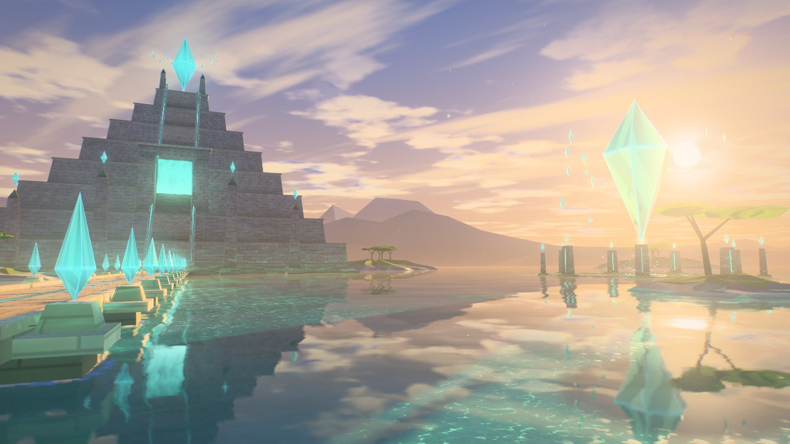
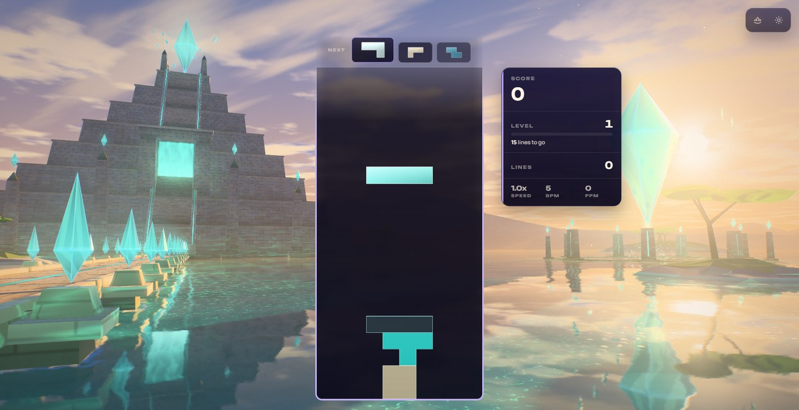
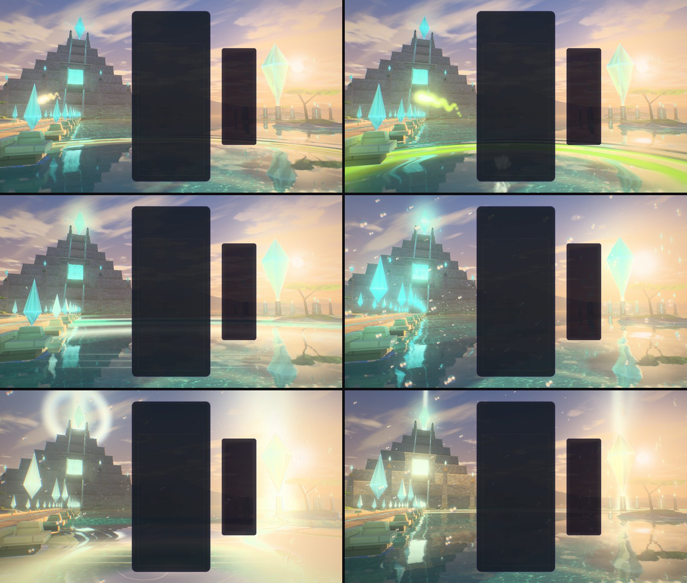
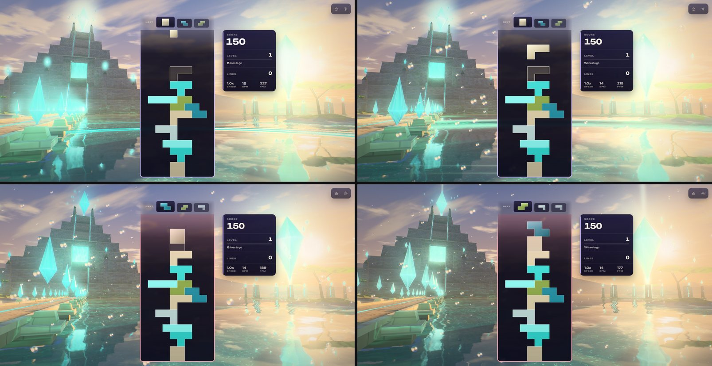
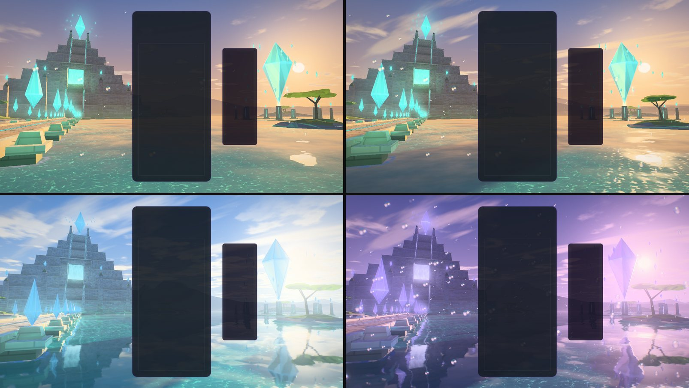
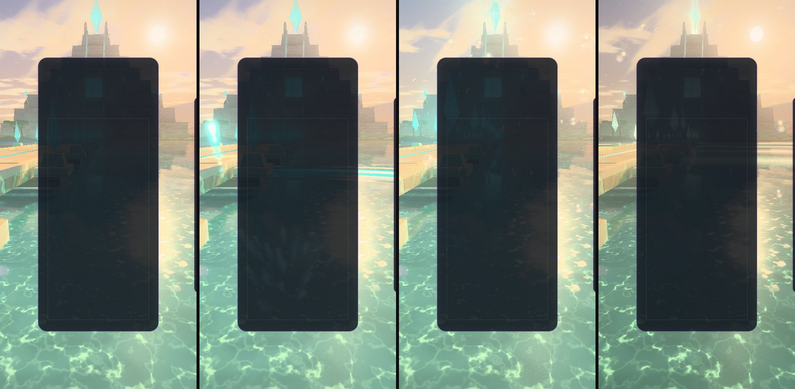

# Halcyon Apex — the sanctuary of first light

Implemented 2026-10-08 on `feature/halcyon-apex-masterpiece`, with Three.js 0.186.1. A
from-scratch rebuild: it replaces the earlier theme in full (the 2,280-line playground effect
that was the scene, with its lit standard materials, canvas-drawn textures, billboard comets
and `pulse()` API, and the thin wrapper class round it). Halcyon Apex keeps its identity — a
windless golden dawn over turquoise water, the terraced pyramid crowned by a crystal at the end
of a stone causeway lined with crystal shards, the obelisks, the diamond that simply floats,
the ley light that runs between them — and everything else is new. This document records the
shipped design and what was verified. It is a reference, not a backlog.

## The picture

Dawn, seen from the lagoon. The viewer stands in clear water beside a causeway that runs out,
between pairs of floating crystal shards, to a pyramid of eight terraces. A stair climbs its
face through the heart gate, a doorway of light, to the top platform, and over that the Apex
floats: a cut crystal the height of a house. The sun has just cleared the far ranges on the
right, and before it hangs the Halcyon, a diamond forty metres tall, over a ring of nine
standing stones. Under the Halcyon the lagoon runs upward: a funnel of drops that spirals in
and narrows into the diamond's lower point. Streaks of high cloud and banks of low cloud take
the dawn, and the whole sanctuary lies upside down in the water.

The scene is back-lit on purpose. The pyramid's face is in luminous shade, lit by the sky, by
the lagoon's bounce on its lowest walls and by its own crystals, so that the ley light — and
everything gameplay does with it — reads against the stone. The sun is in the frame, where its
road of sparks on the water, its shafts and the Halcyon's refractions are.

The gameplay card covers the middle of the frame, so the picture is built for what stays
visible: the pyramid, the Apex and the causeway to the left of it, the sun, the Halcyon and the
stones to the right, the lagoon below, the dawn above. On an upright screen, which is too
narrow for both sides, the rig turns to the pyramid and tips down: the Apex and the top tiers
stand over the card and the lagoon's bed lies under it.

## The one idea

The sanctuary runs on first light, and what the light fills, floats. The board pours light into
the lagoon; the ley lines carry it to the two great crystals, which keep it; and the more a
chain of clears gives them, the more of the sanctuary leaves the ground.

## Event language

| Event | Response |
| --- | --- |
| Piece lock | The piece's light drops into the lagoon under the foot of the board, at its own column: a ring runs out over the water (a real ripple: it bends the mirror and the bed) and carries the piece's colour through the net of light on the sand. A wisp in the same colour leaves the edge of the card at the piece's height and flies to the head of a ley line: the causeway for the left half of the board, the stones for the right. From there the light runs the line as a pulse, shard to shard along the deck (each rune across the deck lights as it passes), up the stair through the heart gate and into the Apex — or round the ring of stones and up the rising water into the Halcyon. The great crystal keeps it: it glows in the colours of the pieces it has taken, for about half a minute. |
| Hard drop | The same, harder: a crown of spray where it struck, a wider ring, a second pulse on the heels of the first, a camera dip. |
| Line clear | The cleared rows leave the card as blades of light at their own heights. A wave runs out through the sanctuary from the foot of the board, one front per line: the masonry flashes as it passes, the bed floods, every crystal on the lines rings and throws sparks, and the two great crystals let go of everything they were holding. One line answers in the ley's light, two in the crystal's, three in both at once. |
| Combo | The sanctuary lifts. Pair by pair, nearest first, the ley shards rise off their plinths and turn; the stones' crystals follow; drops of the lagoon bead up into the air all over the water and rise, more of them with every step; the splinters round the great crystals swing wider and faster; the ley lines brighten and the clouds thin. When the chain breaks the sanctuary lets its breath go and everything settles. |
| Four lines / perfect clear | The sanctuary holds its breath: every light sinks for a fifth of a second. Then a beacon stands on the Apex and on the Halcyon, a ring of light opens over the sky from the Apex, the wave goes out in sunfire gold, the beads are thrown up, and the flock is put to flight. A perfect clear burns hotter and longer. |
| T-spin | Everything that floats turns on its axis, and two more rings leave the foot of the board. |
| Level up | The hour changes: five palettes, cycled (golden dawn, rose hour, clear morning, amber haze, blue hour). |

Combo here is the true consecutive-clear combo (one `ComboTracker` per player in
`HalcyonApexDirector`); the bus's `COMBO` event is cascade depth (ADR-0011). With several boards
on screen each lock leaves its own board, and the sanctuary lifts to the longest chain any
board is holding.

## How it is built

| File | Role |
| --- | --- |
| `halcyon-apex-core.js` | Three-free constants and maths shared by the plan, the choreography and the shaders: the site (where the pyramid, the causeway, the Apex, the Halcyon and the stones stand), the stair, the two ley lines' arc lengths, ring, wave and pulse timings, the five palettes, where the picture's anchors sit for an aspect. |
| `halcyon-apex-plan.js` | The sanctuary as numbers, seeded and deterministic: every block of masonry as flat triangles with its own baked occlusion, every ley strip with its arc length, every crystal. |
| `halcyon-apex-tsl.js` | Hashes, the baked noise texture, the shared uniforms, the sanctuary's light (the sky function every surface gathers, mirrors and fades into; lock rings, clear waves, ley pulses). |
| `halcyon-apex-sky.js` | The dome: gradient and scatter, the sun, two decks of cloud in true perspective, the four-line ring. |
| `halcyon-apex-stone.js` | The masonry's material (courses and joints from each face's own metres, sun through the shadow map, sky, the lagoon's bounce, the crystals' own light) and the ley lines'. |
| `halcyon-apex-crystals.js` | Every crystal as one instanced cut, its shading, its halo, and where each one floats this frame. |
| `halcyon-apex-water.js` | The lagoon: the planar mirror, the bed with its net of light, depth and shore, the sun's road, lock rings, the clear's swell. |
| `halcyon-apex-terrain.js` | The far ranges, the islets, their trees and boulders. |
| `halcyon-apex-atmosphere.js` | The upfall under the Halcyon, the beads a chain lifts, motes, the flock. |
| `halcyon-apex-fx.js` | Wisps, sparks and spray, row beams, beacons. |
| `halcyon-apex-world.js` | Owns the uniforms, the parts, the camera rig, the sun and its shadow rig, and the choreography. Shared with the playground effect, so what is iterated there ships. |
| `halcyon-apex-director.js` | Renderer-free: stages bus events per player and resolves one lock and one clear per frame. |
| `halcyon-apex-composition.js` | Three-free: reads the live card, board and HUD rects and maps board columns and rows onto the screen. |
| `halcyon-apex-post.js` | One scene pass, bloom, and one output pass. |
| `halcyon-apex-quality.js` | The six tiers. |
| `halcyon-apex-theme.js` | Lifecycle, renderer selection, settings, layout watch, GPU-loss recovery, capture flags. |

Techniques worth knowing before changing it:

- **One node renderer on both backends.** `WebGPURenderer` on WebGPU, its WebGL2 backend
  otherwise (or `?forceWebGL`). No `ShaderMaterial`, no compute, no lit material.
- **Every surface shades itself** (`MeshBasicNodeMaterial`) from shared uniforms and one sky
  function, `haSkyBase`, which is at once the sky, what a facet or the water mirrors, and
  (read a little above the way a surface faces) the light that surface gathers: warm on the
  side that looks at the sun, blue on the far side. Distance fades into `haSkyFog`, the same
  function without the glare round the sun.
- **One shadow map, read by everything.** A `DirectionalLight` that lights nothing: its
  `shadow(light)` node is shared by the masonry, the crystals, the land and the lagoon (whose
  net of light and sparkle go out in the pyramid's shadow). The world fits the shadow camera
  round everything that casts, redraws the map over the first frames while pipelines compile,
  then as often as the tier allows (the crystals drift). Casters shade through `fragmentNode`,
  because a caster's `colorNode` also runs in the shadow pass, where it may not read the map it
  is drawing.
- **Masonry is planned, not modelled.** A few dozen calls describe the pyramid, stair, gate,
  obelisks, causeway and stones as boxes whose walls may lean. The builder cuts their faces
  into a grid, bakes occlusion at every grid point from the other boxes in closed form (the
  nearest point of each solid to a point lifted off the surface), and emits flat triangles
  with their own metres as UVs, from which the material draws courses, blocks and joints.
- **A ley line is a coordinate.** Every strip of light, rune and crystal on a line carries its
  arc length along it. A pulse is one uniform slot (birth time, line, colour); what lies at arc
  length `s` lights when `speed × age` passes `s`. The same number tells the world when the
  pulse reaches its great crystal.
- **A crystal is a cut stone without a framebuffer read.** One six-sided bipyramid, instanced.
  Each facet mirrors the sky by its own Fresnel; behind the mirror lies the sky along the
  refracted ray, broken into wedges, with the sun refracted once per colour channel so its
  image splits where the Halcyon stands before it; the light a crystal holds glows from its
  core; every arris is lit. Where each of the seventy floats is evaluated on the CPU once a
  frame from the world's clocks and shared by the crystals, their halos and their shadows.
- **The lagoon knows where the masonry stands.** A handful of signed distances (the plinth,
  the landing, the piers as one repeated box, the obelisks' footings, the stones' rim) give it
  a shelf to pale over and a line to foam on. Under the surface it is a bed (ripple marks, sea
  grass, a net of light from two noise fetches), an absorption per channel over the path
  through the water, and the deep's own colour; over it, Fresnel into the planar mirror.
- **The mirror.** On Medium and up a planar `reflector()` renders the sanctuary from the
  mirrored camera at reduced resolution; the water reads it through its own slopes. Wisps, row
  beams and motes live on layer 1, which the mirror's camera does not render. Low and Minimal
  mirror the sky function and the sun instead.
- **Clouds are two planes.** Each deck is a plane at its own height met by the view ray, so
  the clouds close up toward the horizon as real ones do. A deck is lit by reading its density
  once more a step toward the sun.
- **Closed form first.** Rings, waves, pulses, wisps, sparks, the upfall, beads, motes, the
  flock and the beacons are functions of the world clock, event timestamps and a few clocks the
  world integrates (how far the clouds have drifted, the crystals turned, the beads risen).
  Nothing is created at event time: events write numbers into ring-buffered uniform slots and
  preallocated pools. `seek(t)` plus a fixed-step replay reproduces any frame.
- **HDR, single output.** The scene is scene-linear; a max-channel knee selects what blooms (no
  MRT), and one output pass does the lens fringe, the calm zones on the card and HUD, bloom,
  shafts dragged out of the sun, a hue-preserving filmic curve, grade, vignette, grain and
  dither. An iris closes as the sanctuary flares so its colours survive the surge.
  `usesMrtScenePass()` is false.
- **No MaterialX noise.** One tileable fBm texture is baked on the CPU with its own mip chain.
- **Clamp what a thin strip interpolates.** With MSAA, a ley strip thinner than a pixel is
  shaded from varyings extrapolated far outside the triangle; an unclamped profile across the
  strip came out negative and drew black, red and green dashes along every distant line. The
  strip's profile and the crystals' core thickness are clamped.

## Tiers

| Tier | Mirror | Shadow map | Cloud decks | Wall shimmer, glitter, bed detail | Dispersion | Beads | Motes | Upfall | Sparks | Birds | Bloom, shafts | Scene MSAA |
| --- | --- | --- | ---: | --- | --- | ---: | ---: | ---: | ---: | ---: | --- | --- |
| Minimal | sky function | none | 1, unlit | off | off | 90 | none | 60 | 96 | none | off | off |
| Low | sky function | 1024, drawn once | 2 | on | off | 180 | 120 | 110 | 160 | 7 | off | off |
| Medium | 0.40 scale | 2048, every 4th frame | 2 | on | on | 360 | 260 | 180 | 320 | 11 | on | off |
| High | 0.50 scale | 2048, every 2nd frame | 2 | on | on | 640 | 420 | 260 | 512 | 15 | on | 4× |
| Ultra | 0.62 scale | 4096, every frame | 2 | on | on | 960 | 640 | 360 | 768 | 19 | on | 4× |
| Extreme | 0.75 scale | 4096, every frame | 2 | on | on | 1,400 | 900 | 480 | 1,024 | 23 | on | 4× |

Every tier keeps the whole picture and every event. On Minimal nothing is in shadow (the sun is
taken to reach everything). The lens fringe is High and up. These are allocation budgets, not
measurements of frame rate.

## Assets

None. The sanctuary is generated: about 14,000 triangles of masonry planned and baked at start
(some 60 to 150 ms), the far ranges, islets, trees and boulders cut from seeded noise, seventy
crystals instanced from one cut, one 256 × 256 noise texture baked on the CPU, and shaders.
Blender was not needed and was not used: the pyramid, the stair, the gate, the obelisks, the
causeway and the stones are boxes whose walls lean, the crystals are bipyramids, and what makes
them read is their shading and their light. Building them from a plan also keeps them seeded,
testable and free of binaries. The piece colours (`halcyon-apex-tetrominos.js`) are unchanged.

## Verification

- Unit tests: 159 new tests in five files (world 56; plan, core and tiers 21; theme 49;
  director 23; composition 10), all passing. The world tests include the same state at 30 and
  at 240 frames a second, a bit-exact replay after `seek`, and a session-length check on the
  lifted crystals' turn (see the faults below).
- Whole suite, run once on a build machine that other sessions kept busy: 690 files, 9,187
  tests; 684 files passed. Of the six that did not, five are wall-clock limits in files this
  change does not touch, apart from the URL-parameter catalog, whose 5 s source scan timed out
  in the loaded run (Odyssey forest bake and lever, Odyssey world-bake loader, Stellar Drift
  reactions, the catalog); all five pass run on their own. The sixth,
  `odyssey-level-briefing.test.js`, fails on this machine alone or not: it expects
  "250,000" and the machine's locale writes "250 000". None of its imports are touched here; it
  was not run on pristine `main`.
- Gates: typecheck; lint ratchet (807 errors against a baseline of 807 — the new files add
  none); theme lifecycle audit; dependency boundaries (1,285 modules); production build with
  the boot-closure guard; IP-string gate; Pages artifact check; release gates — all pass.
  Halcyon Apex's piece colours are unchanged and score 3/7 on the palette screen, as before.
- Playground captures on WebGPU (RTX 3070 Laptop), High: rest; a lock at two moments; a hard
  drop at two; clears of two and three lines; held chains of 6 and 9; four lines at four
  moments from the burst to the beacons; a perfect clear; a T-spin; all five palettes. Also
  Minimal, Low, Medium, Ultra and Extreme; High and Low on the forced WebGL2 backend; an
  upright 430 × 852 frame at Medium at rest and through a hard drop, a chain and four lines;
  reduced motion through four lines. Twenty-one of these were retaken on the final build
  (the perfect clear, the T-spin, the chain of 9, Medium, Ultra, two palettes, High on WebGL2
  and reduced motion were not); no capture had a console error or warning.
- In the real game (Electron, dev server, single player, twice): the theme starts on WebGPU,
  aims its events at the live board, takes real hard drops from the keyboard (eight locks and
  fifteen pulses in the first run, both great crystals holding light) and bus-injected clears, a chain and four
  lines, survives a live quality change (High to Medium) and lets go of its canvas when another
  theme takes over. Its own console output is one "Scene ready" line per build. The same
  event script (hard drops, clears, a chain, four lines) ran clean on the WebGL2 backend at
  Low.
- Faults found on the way, all fixed and covered by the tests above. The captures caught one:
  black, red and green dashes along every distant ley line, from MSAA extrapolating a strip's
  UV (now a row in the TSL skill's table). A helper agent's tests caught three in the world: a
  lifted crystal turned by its lift times the *age of the session*, so its spin would have
  jumped on every lift late in a long session (it now integrates what it has turned); a clear
  rang only the first 22 crystals in plan order, so the dial never rang; and two arrivals due
  in the same frame resolved in the order they were queued, not the order they fell due, so a
  crystal could take a pulse and then lose it to an earlier wave. Clear waves also shared one
  origin, which would have moved a first wave when a second board cleared; each wave now
  carries its own.

Observed, not measured: the whole game at 1584 × 813 at High on the RTX 3070 ran at 113 to
128 frames a second in the two runs, and at about 130 on the WebGL2 backend at Low (which
renders at 0.85 scale), on a machine shared with about ten other capturing sessions.

Not verified: GPU cost per tier through the theme perf lane (ADR-0016); the integrated GPU
(a run started with Chromium's low-power-GPU switch ran clean at High, but the harness did not
record which adapter it was given and its frame rate matched the RTX runs, so it is not
counted as an integrated-GPU reading); physical phones, and the real mobile layout (the upright captures use the playground's mock card);
local multiplayer and Infinity layouts in a capture (their routing is unit-tested only);
`scripts/validate-all-themes.mjs` against this theme; sessions of several hours.
`docs/theme-screenshots/halcyon-apex.png` still shows the previous artwork (a fleet capture
writes it).

## Reproduce

Run `npm run dev:playground`, then:

`/playground.html?effect=halcyon-apex&t=20&quality=High&board=1`

Add `event=lock|drop|clear|quad|tspin|perfect|levelUp` with `eventAge=<s>`, and `combo=<n>`,
`level=<n>`, `lines=<n>`, `u=<0..1>`, `row=<r>`, `color=<hex>`. `locks=<n>` plays n locks first,
so the great crystals are holding their light when the event fires. `demo=1` (without `t`)
plays a looping script. `parts=` draws only the named parts; `falseColor=1` bands the
pre-tone-map peak; `noPost=1` shows the raw scene; `forceWebGL=1` uses the WebGL2 backend;
`reduce=1` is reduced motion. In the game: `?halcyonApexTime=`, `?halcyonApexFixedDt=`,
`?halcyonApexParts=`, `?halcyonApexFalseColor=1`.

The theme icon is the pyramid, the Apex and the causeway through the playground's icon lens,
three locks in:

`/playground.html?effect=halcyon-apex&t=20&quality=Extreme&icon=1&iconFov=40&iconYaw=0.11&iconPitch=0.36&locks=3`

captured in an 840 × 840 window (the largest square this laptop's screen allows; the lens is
set for a square frame, where the rig is already part-way to its upright pose), cropped to 94%
about the centre, given a colour lift (contrast 1.14, saturation 1.3, brightness 1.06) and
baked as a 512 px circle on a transparent ground.

## Captured previews

