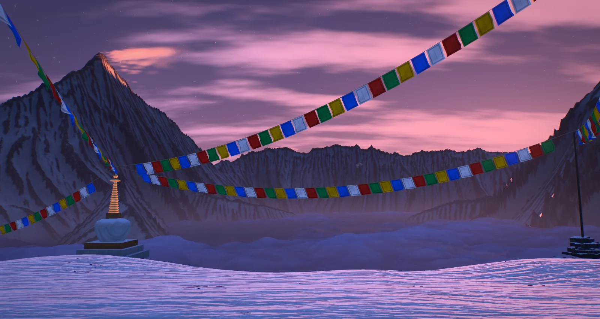
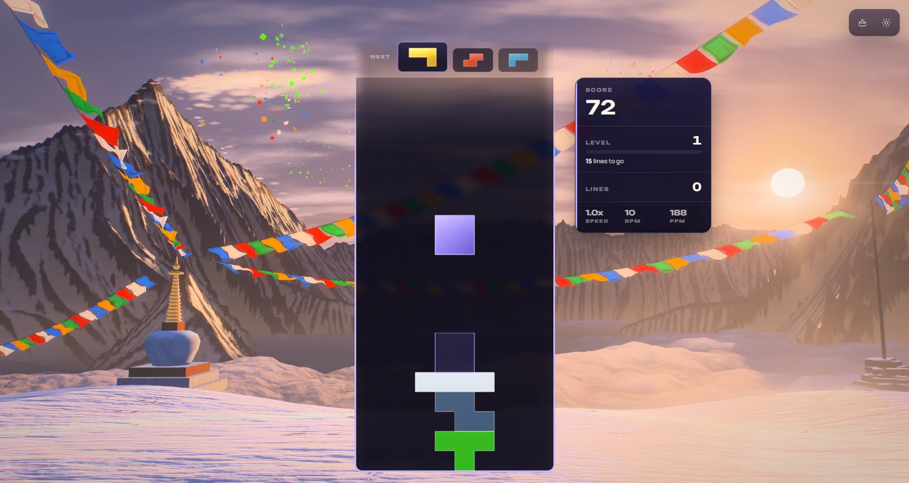
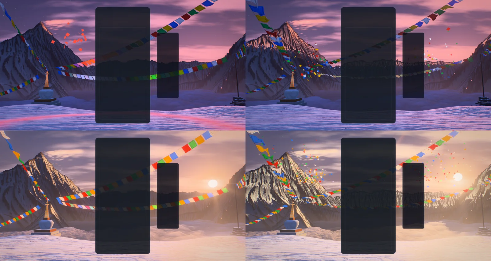
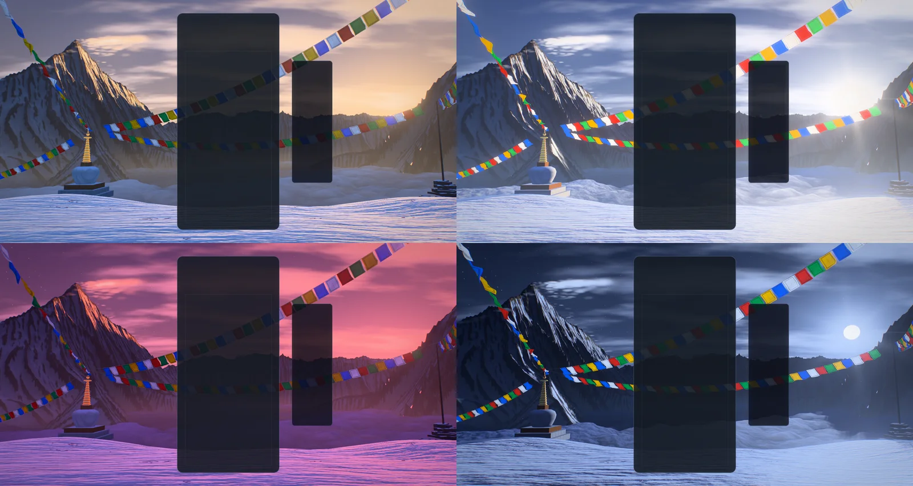
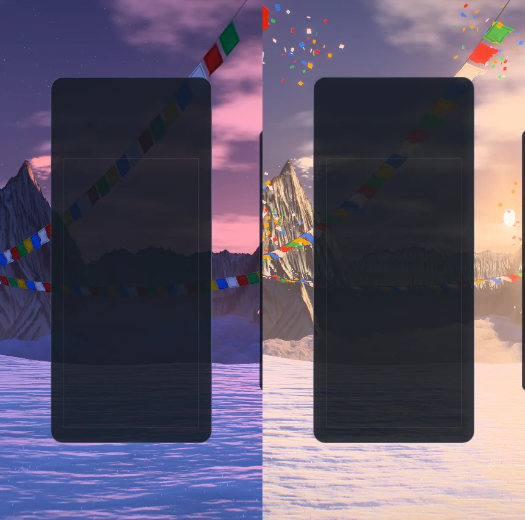
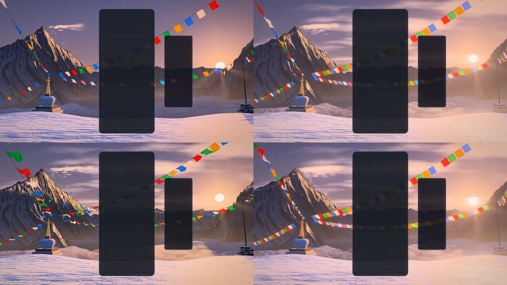

# Himalayan Peak — the chain raises the sun

Implemented 2026-10-08 on `feature/himalayan-peak-masterpiece`, with Three.js 0.186.1. A
from-scratch rebuild: it replaces the earlier theme in full (the noise-plane terrain, the dome,
the altitude and camera directors, the point-sprite spindrift, the flag cards and the post
stack). Himalayan Peak keeps its identity — dawn turning to alpenglow on a great peak, lines of
prayer flags, snow blowing off the summits, a golden eagle — and everything else is new. This
document records the shipped design and what was verified. It is a reference, not a backlog.

## The picture

Dawn on a high pass. The viewer stands on a shoulder of wind-packed snow with a whitewashed
chorten to the left and a cairn with a pole to the right; lines of prayer flags run from the
two, across the sky and out of the frame. Below, a sea of cloud fills the basin. The hero peak
stands out of it far left, a horn 3,290 m over the cloud with its east face turned to the
light and a banner of snow streaming from its summit. The headwall closes the back of the
amphitheatre, and behind it, on the right, the sun is coming up.

The gameplay card covers the middle of the frame, so the picture is built for what stays
visible: the hero and the chorten to the left of it, the sunrise, the cairn and the far end of
the lines to the right, the flags above, the snow and the cloud below.

## The one idea

The board gives its colours to the wind, and the mountain answers with light. The sun's
elevation is the theme's one dial: a chain of clears raises it, and everything else — where the
light has come down to on the hero's face, how far the headwall's shadow has drawn back across
the cloud, whether the pass itself is lit — follows from it, because the amphitheatre's shadow
is known for every elevation at once.

## Event language

| Event | Response |
| --- | --- |
| Piece lock | The piece leaves the card's edge, at its own height, as a handful of paper wind-horses in its own colour, thrown into the wind and carried up toward the mountain. A gust runs out along the nearest flag line from that point: the flags lift and snap as the front passes, and the ones nearest take the piece's colour and **hold** it as light (it fades over about half a minute), so the lines slowly fill with the colours played. A ring of lifted powder in the same colour runs over the snow from under the board, and the chorten's spire catches the colour for a moment. |
| Hard drop | The same, harder: twice the papers thrown faster, a stronger gust that reaches more flags, a wider ring, a camera dip. |
| Line clear | The cleared rows leave the card as blades of light at their own heights, and as papers in all five colours from both edges. Every line snaps at once, and every flag lets go of the light it was holding as papers of that colour. The sun lifts for a moment (more for more lines) and a wave of light pours down the mountain from the summit, one front per line. Three lines also bring a small avalanche down the hero's east face. |
| Combo | The chain raises the sun. Its light comes down the hero's face step by step and warms from rose to gold; the headwall's shadow draws back across the cloud sea; the shafts over the wall open; the crests smoke harder and the hero's banner lengthens; the wind rises in the flags. At three in a row the sun comes over the col, by four it stands clear: the pass is lit, the chorten and the pole throw shadows across the drifts and the flags burn with the light behind them. When the chain breaks the light sinks back under the wall. |
| Four lines / perfect clear | The mountain holds its breath: every light sinks for a fifth of a second. Then the sun is thrown clear of the wall whatever the chain was: the whole amphitheatre is lit at once, the card's shoulders throw fountains of papers, the lens draws a star on the sun and a ring of ice-light stands round it, and an avalanche goes down the hero's east face. |
| T-spin | The wind turns on itself: a wheel of papers spins up round the card, and the lines snap twice. |
| Level up | The hour turns: five hours, cycled (first light, gold, cobalt, ember, moonrise). New prayers go up from the spire and the pole. |
| Time | The hours turn on their own as well, level or no level: the light passes from one hour to the next in 140 seconds (eased, so an hour is held a while and no moment of the passage is seen to move), and the five come round in under twelve minutes, night into dawn. A level-up turns the same wheel a whole step at once; a new run goes back to the first level but not back in time. |
| Game over | Nothing jumps: the chain is dropped and the light sinks back under the wall on its own. |

Combo here is the true consecutive-clear combo (one `ComboTracker` per player in
`HimalayanPeakDirector`); the bus's `COMBO` event is cascade depth (ADR-0011). With several
boards on screen each lock leaves its own board, and the sun follows the longest chain any
board is holding.

## How it is built

| File | Role |
| --- | --- |
| `himalayan-peak-core.js` | Three-free constants and maths shared by everything: the grid, the rest camera, the sun's elevation for a charge, the weights of the shadow slices, the five hours. |
| `himalayan-peak-massif.js` | The plan of the amphitheatre as crest lines: a ridge is a polyline, its faces fall away along a concave profile, and ribs and gullies are a function of the distance ALONG the crest, so they run down the fall line. |
| `himalayan-peak-field.js` | Heightfield maths: the shading map, the horizon toward the sun for every point (exact, by an upper-hull scan), the height of the shadow in the air for four elevations, and the mesh of what the eye can see. |
| `himalayan-peak-assets.js` | Reads the baked `assets/massif.png` and derives the field; falls back to the unweathered plan at 256² when the image cannot be read. |
| `himalayan-peak-layout.js` | What stands near the viewer: the shoulder of snow, where the chorten and the cairn stand, the flag lines for an aspect, where the crests throw snow, the avalanche's track. |
| `himalayan-peak-tsl.js` | Hashes, the baked noise texture, the shared uniforms, and the light: the horizon and shadow lookups, the sky function, the air (what is lost and what is scattered in, with the shafts), the clear's wave, the powder rings. |
| `himalayan-peak-terrain.js` | The massif's material: striations pulled down the fall line, strata, snow where the ground is gentle or hollow, raking light. |
| `himalayan-peak-clouds.js` | The cloud sea: a fan of quads lifted into billows, lit by the same horizon map, self-shadowed, thinning where the ground comes up through it. |
| `himalayan-peak-sky.js` | The dome: gradient and scatter, the disc and corona, stars and the Milky Way, cirrus, the ring of ice-light. |
| `himalayan-peak-pass.js` | The pass's snow (a crust that mirrors the sky, glints, the shrine's closed-form shadows, the powder rings) and the shrine (chorten and cairn). |
| `himalayan-peak-flags.js` | The flags and the cords: closed-form cloth, gusts, the light each flag holds. |
| `himalayan-peak-snow.js` | Spindrift along the crests, the hero's banner, the avalanche. |
| `himalayan-peak-fx.js` | Paper horses, row beams, diamond dust. |
| `himalayan-peak-eagle.js` | The eagle on its round. |
| `himalayan-peak-world.js` | Owns the uniforms, the parts, the camera rig and the choreography. Shared with the playground effect, so what is iterated there ships. |
| `himalayan-peak-director.js` | Renderer-free: stages bus events per player and resolves one lock and one clear per frame. |
| `himalayan-peak-composition.js` | Three-free: reads the live card, board and HUD rects and maps board columns and rows onto the screen. |
| `himalayan-peak-post.js` | One scene pass, bloom, and one output pass. |
| `himalayan-peak-quality.js` | The six tiers. |
| `himalayan-peak-theme.js` | Lifecycle, renderer selection, settings, layout watch, GPU-loss recovery, capture flags. |
| `scripts/himalayan-peak/bake-massif.mjs` | Evaluates the plan, erodes it, measures sky visibility, writes the asset and its manifest; can ray-cast previews on the CPU. |

Techniques worth knowing before changing it:

- **One node renderer on both backends.** `WebGPURenderer` on WebGPU, its WebGL2 backend
  otherwise (or `?forceWebGL`). No `ShaderMaterial`, no compute.
- **Nothing is lit by a light.** Every material shades itself (`MeshBasicNodeMaterial`) from
  shared uniforms: one sun direction and colour, the sky function (`hpSky`) that is at once the
  sky, the colour of distance and what the snow's crust and the spire's gilding mirror.
- **The sun moves on one azimuth, so its shadow is a lookup.** For a sun that only rises and
  sets along one bearing, whether a point on the ground is lit is ONE number: the tangent of the
  lowest elevation at which the sun clears everything toward it. `horizonMap` finds it exactly
  for every grid point by walking each line that runs toward the sun and keeping the upper hull
  of the ground already passed. The shader compares it with `tan(elevation)`: soft, exact
  self-shadowing of 15 km of mountains for any elevation, for one texture fetch. The same scan
  gives the horizon of the cloud sea's top. (An earlier draft kept the shadow's depth for four
  elevations and blended; that is a maximum of linear terms with a kink right at the shadow's
  edge, and the blend put the edge up to 7° late. The note is here so nobody goes back.)
- **In the air the shadow is a height.** For the haze, the blown snow and the avalanche the
  question is "is this point above the shadow", so the height the shadow stands at is kept for
  four elevations (`shadowSlices`, 256², half float) and blended. That is what draws the shafts:
  the air is asked a few times along each view ray and scatters the sun's colour only where it
  stands in the light.
- **The mountains are their crest lines.** Ribs and gullies are drawn in the coordinate that
  runs ALONG a crest, so they fall straight down the faces; droplet erosion in the bake adds
  the gullies no formula draws. The bake is the only place the plan is evaluated at full size.
- **The mesh is cut for the one eye that looks at it.** The camera barely moves, so
  `buildMassifMesh` drops back faces, ground under the cloud and everything hidden behind a
  nearer ridge (a polar horizon sweep from the eye), and orders what is left front to back.
  About one cell in six survives; nothing is overdrawn.
- **Upright screens narrow the amphitheatre, not the pass.** Two groups: `root` (the massif,
  the cloud, the snow in the air) is scaled in x about the view axis so the hero and the sun
  both fit a phone held upright — rays through the eye stay rays, so nothing hidden comes into
  view — and `near` (the snow underfoot, the shrine, the flags, the papers) is never scaled.
  Far materials read `positionLocal` as their planned position; far sprites go through `hpClip`.
- **Closed form first.** The cloth of the flags, the papers' flight, the spindrift, the
  avalanche, the rings and the wave are functions of the world clock and event timestamps.
  Nothing is created at event time: events write numbers into ring-buffered uniform slots and
  preallocated pools. `seek(t)` plus a fixed-step replay reproduces any frame.
- **The light a flag holds is two instanced attributes** written only when gameplay happens:
  what it holds and its colour, and when its gust arrives and when a clear voids it. The
  shader decays and fires them in closed form.
- **The wind is the one thing the world integrates.** How far it has carried things and the
  phase of the flags' ripple (`u.flutter`) are advanced every frame, and the wind itself closes
  on what the game asks at five per second instead of jumping with each event. The first
  version wrote the ripple as `time × speed` with a speed that followed gusts and the chain:
  every change of wind then moved the phase by the whole age of the session times that
  change, so a run of clears beat the lines into a blur, harder the longer the game had run
  (corrected 2026-10-09). Wind and gusts now set how high a flag flies and how deep it folds;
  its pace rises by under a third in the hardest wind, and a gust fills the cloth over a few
  frames (`gustPull`) instead of at a stroke.
- **HDR, single output.** The scene is scene-linear; a max-channel knee selects what blooms (no
  MRT), and one output pass does the lens fringe, the calm zones on the card and HUD, bloom,
  shafts dragged out of the sun, the lens's own veil, streak and star once the sun stands clear,
  a hue-preserving filmic curve, grade, vignette, grain and dither. An iris closes as the sun
  comes over the wall so lit snow keeps its drifts. `usesMrtScenePass()` is false.
- **No MaterialX noise.** One tileable texture is baked on the CPU (a value, its gradient, a
  second value) with its own mip chain.
- **The image is read by hand.** `massif.png` is data, so the loader walks its chunks, inflates
  them with `DecompressionStream` and undoes the two row filters the bake writes. A 2D canvas is
  only the fallback: a canvas may be handed back with noise in it (anti-fingerprinting), and one
  flipped bit of the high byte is seventeen metres of mountain. The derivation that follows is
  done in steps with a breath between them, and the mesh is cut then too, so no single frame of
  the theme's start carries all of it.

## Tiers

| Tier | Mesh stride | Air samples | Cloud fan | Billow octaves | Spindrift | Dust | Papers | Flags | Bloom, shafts | Scene MSAA |
| --- | ---: | ---: | --- | ---: | ---: | ---: | ---: | ---: | --- | --- |
| Minimal | 4 | 0 | 96 × 72 | 2 | 220 | none | 160 | 70 | off | off |
| Low | 3 | 0 | 128 × 96 | 2 | 420 | 160 | 280 | 100 | off | off |
| Medium | 2 | 3 | 176 × 128 | 3 | 760 | 320 | 480 | 140 | on | off |
| High | 2 | 5 | 224 × 160 | 3 | 1,200 | 520 | 720 | 180 | on | 4× |
| Ultra | 1 | 6 | 288 × 200 | 3 | 1,800 | 800 | 1,000 | 220 | on | 4× |
| Extreme | 1 | 8 | 352 × 240 | 3 | 2,600 | 1,200 | 1,400 | 260 | on | 4× |

Every tier keeps the whole picture and every event. These are allocation budgets, not
measurements of frame rate.

## Assets

`assets/massif.png` (2.2 MB) is the baked amphitheatre: 1024 × 1024, sixteen-bit heights in red
and green, sky visibility in blue. It is generated (no elevation data, no third-party model);
`node scripts/himalayan-peak/bake-massif.mjs` rewrites it and its manifest in about fifteen
seconds, and `--preview=<dir>` ray-casts the result from the viewer's eye on the CPU for a few
sun elevations, which is how the plan was shaped before any shader existed.

`assets/eagle.glb` is the theme's own golden eagle, kept from the earlier theme (see
`assets/ATTRIBUTION.md`). It loads off the frame; nothing waits for it.

Everything else is generated in code. Blender was not needed: the chorten is a lathe and three
boxes, the cairn is a pile of boxes, and what makes the mountains is the bake.

## Verification

- Unit tests: 250 tests in eight files (composition 13, director 23, layout 23, field 46, effects
  35, world 10, theme 70, and 30 in `himalayan-peak-shaders.test.js`, which builds every part's
  material through three's WGSL and GLSL node builders at High and Minimal with no GPU and
  fails on a throw, a console warning, an `mx_` noise or a `smoothstep` with equal edges). The
  field tests check the horizon map against a brute-force maximum along the same lines, and pin
  the baked image to its manifest. All pass. The earlier theme's two entries in
  `portable-showcase-post.test.js` and its two allow-list rows in `event-contract.test.js` went
  with it.
- Whole suite, once, with 120 s timeouts on a build machine other sessions were loading: 693
  files, 9,268 tests; 692 files passed. The one failure, `odyssey-level-briefing.test.js`,
  expects "250,000" and gets "250 000": it formats a number in the machine's locale (sv-SE
  here) and fails the same way on the untouched main checkout.
- Gates: typecheck; lint ratchet (807 errors, at the baseline; the new files add none); theme
  lifecycle audit; dependency boundaries (1,280 modules); production build with the
  boot-closure guard; IP-string gate; Pages artifact check; release gates — all pass. The palette
  gate fails on `main` and here for the same unrelated reason (Stillwater); Himalayan Peak
  scores 0/7 on it.
- Playground captures (RTX 3070 Laptop): rest; lock; hard drop; a two-line clear; a chain of
  four; four lines at 1.4 s; a T-spin; a perfect clear at 3 s and 5 s; the four other hours;
  an upright 430 × 852 frame at rest and through four lines; Minimal, Low and Extreme on
  WebGPU; Low, Medium and High on the forced WebGL2 backend; reduced motion; the generated
  stand-in terrain. The last full set was 22 frames and six more were retaken after one final
  change (the tint of blown snow in shadow); none of the 28 had a console error or warning
  from the page.
- In the real game (Electron, dev server, single player, a fresh profile, `?unlockAll=1`): the
  theme starts on WebGPU with the baked massif, strings its lines for the live card, takes real
  hard drops from the keyboard and bus-injected locks, clears, a chain of five and four lines,
  survives a live quality change (High to Medium), lets go of its canvas when Forest takes
  over and comes back. The same event script ran on the integrated AMD GPU at Medium and at
  Low, and on the WebGL2 backend at Low. No warning or error from the theme in any run.
- A review by a second agent found one real lighting fault and several smaller ones, all fixed
  and covered by the tests above: the cloud sea's horizon scan stopped early over ground far
  under the cloud (about one cloud point in twenty lit or shadowed wrongly); a flag's held
  light was decayed twice at a clear and went dark while a new gust was on its way; the
  avalanche's track could climb out of a gully on the stand-in terrain; two expressions
  could divide by zero; events fired between the camera update and the world update were
  stamped a frame late.
- The flags' pace (2026-10-09): four more tests step a chain played as fast as a hand can (a
  lock and a clear every quarter second, every fourth four lines) and hold every frame to the
  pace, to the eased wind, and to moving exactly alike in a new session and one ten minutes
  old. Captured on the RTX: six consecutive 60 Hz frames half a second after a four-line clear
  four minutes into a session (the cloth moves on a little each frame, where before each frame
  drew an unrelated fold), and the gust arriving and filling the lines.
- The hours turning with the clock (2026-10-09): two more tests place the light by level and
  clock (`hourAt`), then live through a whole span with no event, a tenth of a second at a
  time: no channel moves faster than a twentieth of a unit a second, the light arrives at the
  second hour with the level still the first, a level-up from there turns it one hour further,
  a new run keeps the clock's turn, and a seek lands on the same light. Captured on the RTX:
  the light halfway between each pair of hours (the five looks the drift adds), waiting and
  lit, and two whole hours reached by the clock alone; no warning or error from the page.

Observed, not measured: every in-game run counted 129 to 131 frames a second over four seconds
(RTX at High, the integrated GPU at Medium and at Low, WebGL2 at Low). The same figure
everywhere reads as a cap of the window, not as headroom, so it says only that none of those
configurations fell below it at 1600 × 852.

Not verified: GPU cost per tier through the theme perf lane (ADR-0016); physical phones (a
phone derives the field from the 1024² image at start, about half a second of arithmetic on
this laptop, spread over several frames); local multiplayer and Infinity layouts in a capture
(their routing is unit-tested only); the icon on an Odyssey level orb; long sessions.
`docs/theme-screenshots/himalayan-peak.png` still shows the previous artwork (a fleet capture
writes it). One thing seen on the way and not chased: on a SECOND boot of a profile whose saved
theme is Himalayan Peak, the capture harness found Forest running; a Lunara control did the
same, so it is not this theme's (the harness's settings write is then a no-op, and what the
boot does with a saved theme is the app's own business).

## Reproduce

Run `npm run dev:playground`, then:

`/playground.html?effect=himalayan-peak&t=20&quality=High&board=1`

Add `event=lock|drop|clear|quad|tspin|perfect|levelUp|over` with `eventAge=<s>`, and `combo=<n>`,
`level=<n>` (the five hours; `t` carries the light on from there, an hour per 140 s), `lines=<n>`, `u=<0..1>`, `row=<r>`, `color=<hex>`. `locks=<n>`
plays n locks first, so the lines are holding their light when the event fires. `sun=<degrees>`
holds the sun at an elevation (about -7 under the wall to 22). `demo=1` (without `t`) plays a
looping script. `parts=` draws only the named parts; `falseColor=1` bands the pre-tone-map peak;
`noPost=1` shows the raw scene; `forceWebGL=1` uses the WebGL2 backend; `reduce=1` is reduced
motion; `plan=1` draws the generated stand-in instead of the baked massif; `eagle=0` leaves the
eagle out. In the game: `?himalayanTime=`, `?himalayanFixedDt=`, `?himalayanParts=`,
`?himalayanFalseColor=1`, `?himalayanForceWebGL=1`.

The theme icon is a frame of the scene through the playground's icon lens, the sun held at 13°
so the east face is lit to its foot:

`/playground.html?effect=himalayan-peak&t=20&quality=Extreme&icon=1&iconFov=30&iconYaw=0.43&iconPitch=0.13&sun=13&locks=6`

captured in an 840 × 840 window (the largest square this laptop's screen allows), cropped to
90% of the frame around (0.46, 0.5), given a colour lift (contrast 1.2, saturation 1.38,
brightness 1.22) and baked as a 512 px circle on a transparent ground. The same file is kept at
`public/assets/themes/himalayan-peak-theme-icon.png`.

## Captured previews

