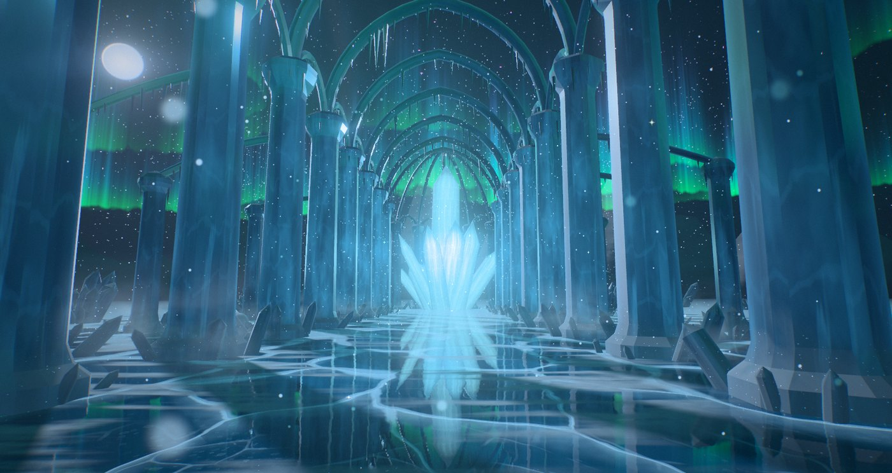
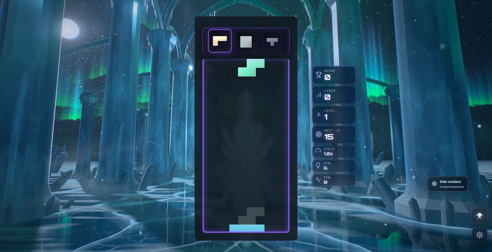
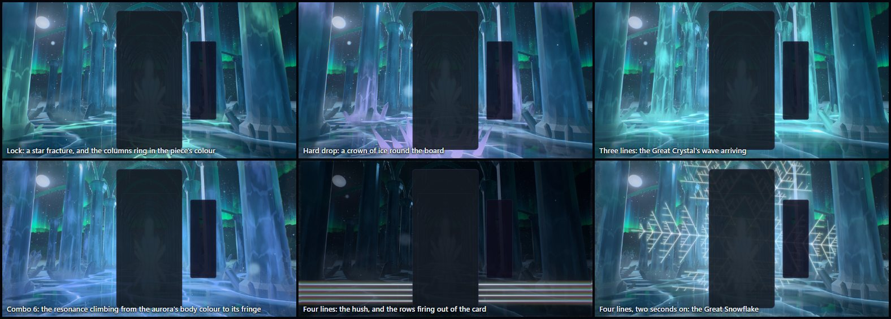
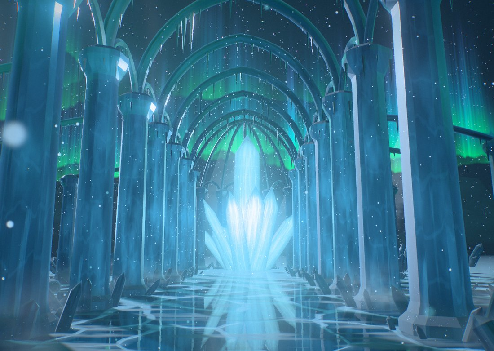
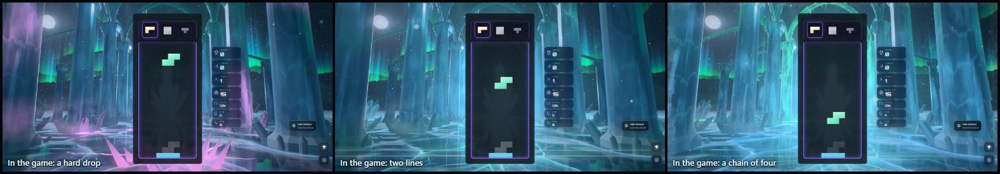
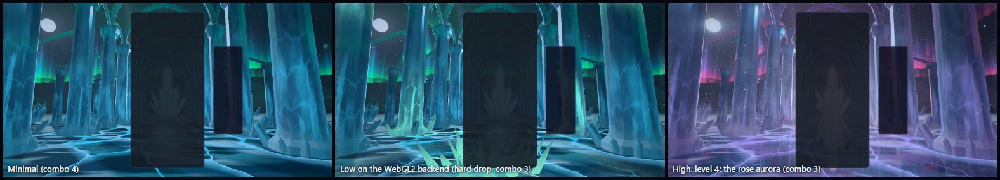
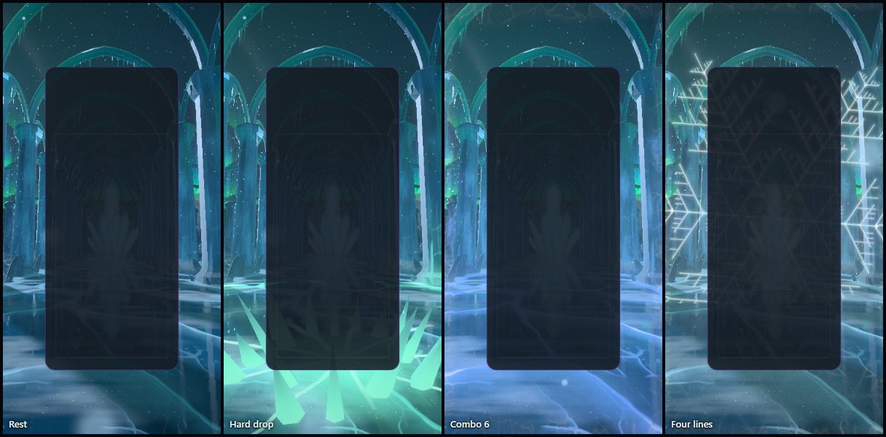

# Ice Temple — the singing nave

Implemented 2026-10-05 on `feature/ice-temple-masterpiece`, with Three.js 0.186.1. A
from-scratch rebuild: it replaces the earlier theme in full (the 5,200-line theme class with
its paired WebGL and WebGPU materials, the GLSL shaders, the compute snow and shard pools, the
baseline tooling, the ice texture, the unused DOM layers and their 430 lines of CSS, and the
flat 2D snow the legacy particle canvas drew over it). The temple keeps its identity — the
hexagonal ice crystals, the aurora, the cracked frozen floor with light running through its
cracks, the snow, the resonance a chain of clears builds — and everything else is new. This
document records the shipped design and what was verified. It is a reference, not a backlog.

## The picture

A nave of colossal ice columns on a frozen lake, under the polar night, seen from its centre
line a little above head height, looking up it. Each column is a hexagonal prism with bevelled
corners, as an ice crystal is; pointed ribs spring from every pair and from every column to
the next, hung with icicles, and the vault between the ribs is open to the sky. An aisle of
shorter columns stands outside each row (four of them fallen), tied to it by flying ribs.
A half ring of columns closes the far end round the Great Crystal, which lights the nave from
behind. The moon stands low over the left colonnade, inside the halo that ice in the air
draws round it, and throws the columns' shadows across the floor. The aurora hangs beyond.

The floor is black lake ice, clear enough to see down into: cracks stand in it as white
walls, bubbles hang frozen in stacks, snow lies combed by the wind, and the whole temple
stands upside down in it.

The gameplay card covers the Great Crystal, so the picture is built for what stays visible:
four pairs of columns receding on each side of the card, the ice below it, the ribs and the
sky above it, and whatever comes down the nave from behind it.

## The one idea

The temple is an instrument of ice and the board plays it. Ice rings when it is struck, and
light is how the temple sounds: every action on the board is answered by light that starts
where the piece struck, or at the Great Crystal, and travels through the ice.

## Event language

| Event | Response |
| --- | --- |
| Piece lock | The piece strikes the lake under the foot of the board, at its own column. A star fracture opens in the ice in the piece's colour and heals over seven seconds; a ring of light runs out through the cracks; a ring of powder snow lifts and runs out low; chips of ice fly. A shell of light climbs the temple, lighting the fracture sheets inside each column as it passes, and the three nearest pairs of columns shed frost at the moment the shell reaches them. |
| Hard drop | The same, harder, and a crown of sixteen ice spikes shoots up round the foot of the card in a tenth of a second, lit from within in the piece's colour, then sinks back into the lake. The ring is sized to the card, so the spikes stand clear of it on any layout. |
| Line clear | The cleared rows fire out of the card as blades of light at their own heights, splitting into their colours along their edges. Then the Great Crystal answers: it flares, and a wave runs down the nave toward the viewer, one front per line. Every column and rib rings as a front passes, the cracks under it burn, the aurora swells, and the camera is nudged when the wave arrives. One line answers in the aurora's border colour, two in its body colour, three in both at once. |
| Combo | The temple resonates, in the aurora's own colours: its border, then its body, then the fringe high above (green, cyan, violet on the first level). A standing glow climbs the columns 2.4 m for every link of the chain, so the colonnade counts it, and at nine it reaches the ribs. The cracks stay lit further and further out from the board, the aurora doubles, diamond dust thickens, and crystals of rime grow in from the corners of the frame. The snow slows as the chain builds, hangs still in the air at five, and rises beyond. When the chain breaks the temple lets its breath go and drains. |
| Four lines / perfect clear | The temple holds its breath: a quarter of a second of near dark, the snow standing still in the air. Then the Great Crystal answers in diamond white with four fronts, and the Great Snowflake grows round the board — six arms, side branches budding off them in order, barbs on the branches — holds, and shatters into falling shards. A perfect clear grows two, turning against each other. |
| T-spin | The air turns: the snow and the diamond dust wind round the nave's axis and come to rest. |
| Level up | The aurora changes its colours: five palettes, cycled (boreal, amethyst, glacier, rose, solar). |

Combo here is the true consecutive-clear combo (one `ComboTracker` per player in
`IceTempleDirector`); the bus's `COMBO` event is cascade depth (ADR-0011). With several boards
on screen each lock strikes under its own board, and the temple resonates to the longest
chain any board is holding.

Two decisions about colour are worth knowing before changing it. A warm light inside blue ice
mixes to grey, so nothing the temple does on its own is warm: the five aurora palettes hold
no orange and no gold, the resonance climbs the aurora's spectrum, and four lines are white.
Warmth comes only from a warm piece. And the
temple at rest is dark on purpose: the near columns are frames, the light is at the far end,
so every event has headroom.

## How it is built

| File | Role |
| --- | --- |
| `ice-temple-core.js` | Three-free constants and maths shared by the plan, the choreography and the shaders: the nave's dimensions, the moon, the lock shell and clear wave timings, the palettes, the CPU twin of the colonnade's shadow. |
| `ice-temple-plan.js` | The temple as lists of numbers, seeded and deterministic: columns, ribs, icicles, crystals. |
| `ice-temple-tsl.js` | Hashes, Voronoi, the baked noise texture, the shared uniforms, the temple's light (sky, the heart's glow in the mist, the moon's shadows, lock shells, clear waves, resonance). |
| `ice-temple-architecture.js` | Every column, rib, icicle and crystal as one merged, flat-shaded geometry, and the ice material. |
| `ice-temple-floor.js` | The lake: cracks with their walls, bubbles, snow, the planar mirror, and everything gameplay writes into the ice. |
| `ice-temple-sky.js` | The dome (stars, moon, halo), the mountains, the aurora's curtains. |
| `ice-temple-atmosphere.js` | Snow, diamond dust, mist banks. |
| `ice-temple-fx.js` | Chips, the crown, the row beams, the Great Snowflake. |
| `ice-temple-world.js` | Owns the uniforms, the parts, the camera rig and the choreography. Shared with the playground effect, so what is iterated there ships. |
| `ice-temple-director.js` | Renderer-free: stages bus events per player and resolves one lock and one clear per frame. |
| `ice-temple-composition.js` | Three-free: reads the live card, board and HUD rects and maps board columns and rows onto the screen. |
| `ice-temple-post.js` | One scene pass, bloom, and one output pass. |
| `ice-temple-quality.js` | Content tiers. |
| `ice-temple-theme.js` | Lifecycle, renderer selection, settings, layout watch, GPU-loss recovery, capture flags. |

Techniques worth knowing before changing it:

- **One node renderer on both backends.** `WebGPURenderer` on WebGPU, its WebGL2 backend
  otherwise (or `?forceWebGL`). There is no `ShaderMaterial` and no compute, so `ice-temple` is
  off the dual-state allowlist.
- **Ice is shaded as ice, not lit by a light.** Every material shades itself
  (`MeshBasicNodeMaterial`). Each vertex carries, next to its face normal, a smooth normal
  radial from its piece's axis; from the two the shader has the chord a view ray travels
  through the body. Over that chord it absorbs red and keeps blue (Beer–Lambert), scatters
  the Great Crystal's light forward when the crystal stands behind it, shows three parallax
  layers of fracture sheets and a milky core (the baked noise read along the piece at the
  depth the refracted ray reaches), mirrors the aurora on every face (Fresnel), and throws the
  long glint a prism's face throws when it turns the moon to the eye. Frost and snow cap it.
- **A crack is a wall, drawn as one.** The floor's cracks are Voronoi cell walls. The surface
  line is `F2 − F1`. Below it, the view ray refracted into the ice is tested for where it
  crosses the same wall: the sites of the cell at the surface and of the cell at the ray's deep
  end give the wall in closed form, so each crack hangs a continuous white curtain under
  itself with true parallax for two lookups, where stacked layers would show as copies.
- **The colonnade's shadows are a formula.** The moon's direction and the rows of columns are
  constants, so the fraction of moonlight at any point is four small expressions
  (`itMoonShadow`, with the CPU twin `moonShadowAt`). The floor, the columns, the mist and the
  snow all read it, which is why the moon's shafts are drawn by the snowfall itself.
- **The heart's glow in the mist is an integral.** The light a point source leaves along a
  view ray through a uniform mist has a closed form (two arctangents). Every material adds it
  up to its own depth, so columns stand dark against the glow and the glow wraps round them.
- **The mirror.** On Medium and up a planar `reflector()` renders the temple from the mirrored
  camera at reduced resolution. Snow, dust, mist, chips and the row beams live on layer 1,
  which the mirror's camera does not render; the Great Snowflake and the crown are mirrored.
  Low and Minimal mirror the analytic sky instead.
- **Closed form first.** Snow, dust, lock shells, star fractures, clear waves, chips, the crown
  and the snowflake are functions of the world clock, event timestamps and three numbers the
  world integrates for the snow (metres fallen, metres drifted, the vortex's turn). Nothing is
  created at event time: events write numbers into ring-buffered uniform slots and one
  preallocated chip pool. `seek(t)` plus a fixed-step replay reproduces any frame, and a test
  proves the same state at 30 and 240 frames a second.
- **The snowflake is a distance field folded into one twelfth of the plane**, so it is exact
  at any size. Its branches are found by index along the arm, four candidates a pixel.
- **Solid things first, then what is behind them.** The architecture draws first, then the
  floor, the mountains and the sky, so depth rejects every floor and sky pixel a column
  covers before its shader runs. Lock slots that have healed, plates without fine cracks and
  plates without bubbles skip their work.
- **HDR, single output.** The scene is scene-linear; a max-channel knee selects what blooms (no
  MRT), and one output pass does the rime on the lens, the lens fringe, the calm zones on the
  card and HUD, bloom, the rays out of the Great Crystal (the bloom dragged radially), a cold
  streak, a hue-preserving filmic curve, grade, vignette, grain and dither. An iris closes as
  the temple flares so its colours survive the surge. `usesMrtScenePass()` is false.
- **No MaterialX noise.** One tileable fBm texture is baked on the CPU with its own mip chain;
  every shared `Fn` carries `setLayout`.

## Tiers

| Tier | Mirror | Fracture layers | Fine cracks | Bubble layers | Curtains | Snow | Dust | Mist banks | Chips | Crown | Bloom, rays | Scene MSAA |
| --- | --- | --- | --- | --- | --- | --- | --- | --- | --- | --- | --- | --- |
| Minimal | analytic sky | 1 | no | 0 | 2 | 900 | 320 | 0 | 72 | no | off | off |
| Low | analytic sky | 2 | yes | 0 | 3 | 1,800 | 640 | 0 | 128 | yes | off | off |
| Medium | 0.4 scale | 2 | yes | 2 | 4 | 3,200 | 1,300 | 12 | 256 | yes | on | off |
| High | 0.5 scale | 3 | yes | 3 | 4 | 5,200 | 2,200 | 18 | 384 | yes | on | 4× |
| Ultra | 0.65 scale | 3 | yes | 3 | 5 | 7,600 | 3,200 | 24 | 512 | yes | on | 4× |
| Extreme | 0.8 scale | 3 | yes | 3 | 5 | 10,000 | 4,400 | 30 | 768 | yes | on | 4× |

The lens fringe and the cold streak are High and up; the rime on the lens is Low and up.

## Assets

None. The temple is generated: about 55,000 triangles of architecture built at start from the
plan, one 256 × 256 noise texture baked on the CPU, and shaders. The earlier theme's
`ice-diffuse.jpg` is gone. Blender was not needed: the temple's module is a hexagonal prism,
and prisms, swept ribs and cones are a few dozen lines of geometry code each, which also keeps
the plan seeded, testable and free of binaries.

## Verification

- Unit tests: 93 new tests in four files (plan, core, composition and tiers 24; director 19;
  world 32; theme 18). Ice Temple was taken out of `portable-theme-renderers.test.js` and
  `portable-theme-context-recovery.test.js`, which pinned the earlier class's API, and the
  dual-state allowlist lost its entry. Whole suite: 562 files, 6,498 tests. Every Ice Temple
  test passes. On the build machine, which was busy with other sessions (processor at 100%),
  eleven wall-clock-limited tests in nine unrelated Odyssey, Stellar Drift, Ocean and
  Earth-core files failed in the full run (five-second time limits and millisecond budgets).
  They are the machine's, not this change's: run one file at a time they fail and pass from
  run to run, and two of them run alternately on untouched `main` and on this branch did the
  same on both.
- Gates: lint ratchet (947 errors against a baseline of 1,070; the baseline was left as it
  is), typecheck, production build with the boot-closure guard, dependency boundaries, theme
  lifecycle audit, IP-string gate, Pages artifact check and release gates all pass. The palette
  gate fails on `main` and here for the same unrelated reason (Stillwater); Ice Temple's piece
  colours are unchanged and score 4/7 on it.
- Playground captures on WebGPU (RTX 3070 Laptop), High: rest; a lock and a hard drop; clears
  of two and three lines; held combos of 3, 5, 6 and 8; the four-line hush, the snowflake
  growing, standing and shattering; a perfect clear; a T-spin; all five aurora palettes. Also
  rest at Ultra; Low and Minimal; High and Low on the forced WebGL2 backend; and a 430 × 932
  portrait frame at Medium at rest and through a hard drop, a combo and a four-line clear. No
  console errors or warnings in any of them.
- In the real game (Electron, dev server, single player): the theme starts on WebGPU, aims its
  events at the live board, takes real hard drops and bus-injected clears, survives a live
  quality change (High to Medium) and lets go of its canvas when another theme takes over, with
  no console errors or warnings. It also starts and runs on the integrated AMD GPU at High,
  Medium and Low.
- Frame rate was observed, not measured. The machine was shared with other sessions' GPU and
  CPU jobs throughout, and readings of the whole game at 1584 × 813 moved by a factor of two
  between runs of the same build: about 35 to 80 fps at High on the RTX 3070, and on the integrated
  GPU 68 at High, 42 at Medium and 106 at Low (Low renders at 0.85 scale). The integrated GPU
  reading at High as fast as the RTX's says the limit in these runs was the contended main
  thread; it says nothing reliable about GPU cost.

Not verified: GPU cost per tier through the theme perf lane (ADR-0016); physical phones; the
Extreme tier in a capture; local multiplayer and Infinity layouts in a capture (their routing
is unit-tested only); reduced motion in a capture (unit-tested only); sessions of several
hours.

## Reproduce

Run `npm run dev:playground`, then:

`/playground.html?effect=ice-temple&t=20&quality=High&board=1`

Add `event=lock|drop|clear|quad|tspin|perfect|levelUp` with `eventAge=<s>`, and `combo=<n>`,
`level=<n>`, `lines=<n>`, `u=<0..1>`, `color=<hex>`. `demo=1` (without `t`) plays a looping
script. `parts=` draws only the named parts; `falseColor=1` bands the pre-tone-map peak;
`noPost=1` shows the raw scene; `forceWebGL=1` uses the WebGL2 backend. In the game:
`?iceTempleTime=`, `?iceTempleFixedDt=`, `?iceTempleParts=`, `?iceTempleFalseColor=1`.

The theme icon is the Great Crystal at the end of the nave through the playground's icon lens
(`/playground.html?effect=ice-temple&t=26&quality=Ultra&icon=1` in a 1200 × 850 window),
cropped to a 640 px square around (600, 470), given a colour lift (contrast 1.14, saturation
1.3, brightness 1.1) and baked as a 512 px circle. The same file is kept at
`public/assets/themes/ice-temple-theme-icon.png`.

## Captured previews

