# Koi Pond — the moonwake pond (visual overhaul, 2026-10-08)

**Status: implemented on branch `feature/koi-pond-masterpiece` (worktree
`serenity-blocks-koi`). A record of what was built and how it was checked — not a backlog.**
Replaces the "Moonwake Sanctuary" scene (a low-poly night pond seen from a hillside, in which
the koi were five small props) with a pond you look *into*: living fish, water that is a
simulation, and a garden round it, all on three 0.186.1 and shared by the game and the
playground. It supersedes `KOI_POND_MASTERPIECE_PLAN_2026-07.md`.

| Before | After (High, native WebGPU) |
| --- | --- |
| 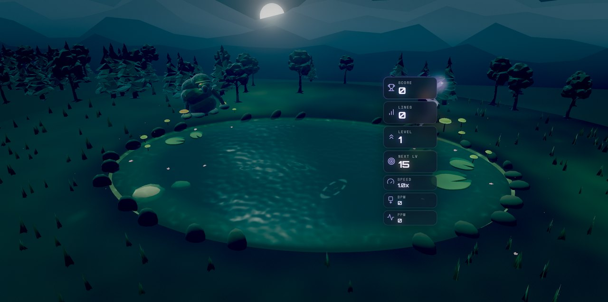 | 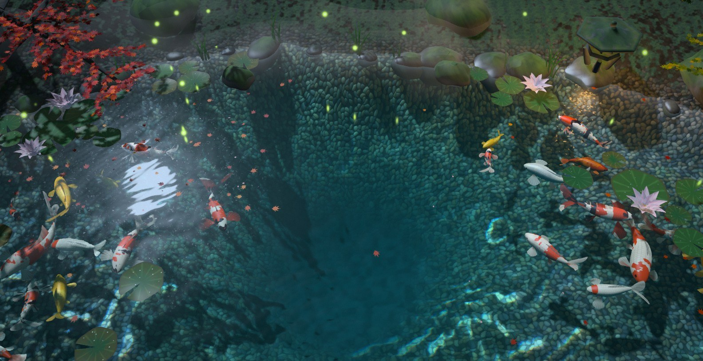 |

## What the player sees

The camera leans over a garden pond at night and looks steeply down past the board card into
clear water. The moon is not in the sky — the sky is out of frame — it lies *in the water* of
the left reach, a disc that every ripple breaks into shards. An old crimson maple leans out
over that reach from the far bank and its shadow lies across the pebbles of the bed; a
snow-viewing lantern stands at the water's edge on the right and its flame is drawn out
toward the viewer. Lily pads raft in both reaches with their own shadows on the bed beneath
them, water lilies stand half open among them, maple leaves turn slowly on the surface,
fireflies hang over the banks, each with its image in the pond.

And there are the koi: kohaku, sanke, showa, tancho, ogon, platinum, asagi, benigoi, bekko,
long-finned and plain, from forearm-length to a metre and a half. Each keeps a loop of its own
in the open water either side of the card, beats its tail in proportion to its speed and
coasts between, keeps clear of its neighbours and the standing stones, rises now and then to
kiss the surface. Caustics crawl over their backs and their shadows follow them across the bed.
Under the card the bed falls away into a dark basin.

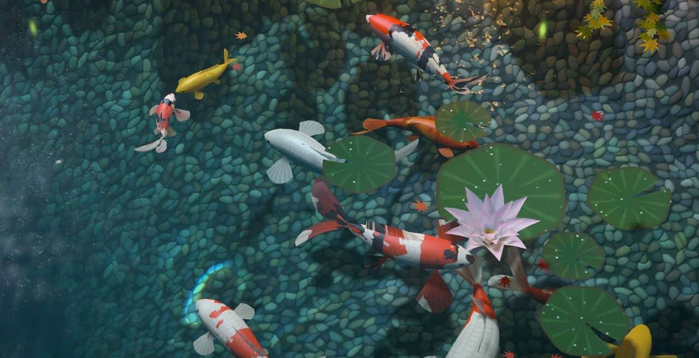

The board card hides the middle of a landscape screen, so the picture is built for the two
side thirds. A tall screen shows a narrower slice of the same pond: the koi take loops inside
it and the moon moves to the open water at the foot of the picture.

## How the pond answers the game

`KoiPondDirector` turns the game's events into a `lock`, a `clear`, the true chain length and a
level; `KoiPondWorld` plays them. Everything is aimed through the live board, card and
stats-bar rectangles.

| Event | Response |
| --- | --- |
| Piece lock | The piece falls through the card into the pond: a train of rings spreads from under its column. It also throws **a pebble of its own light** out of the card's edge beside it (or out of the far edge of the stats bar, where that covers the row): the pebble arcs over the water with a tail of sparks and lands in the open reach, where real rings leave it, a band of the piece's colour rides the first ring across the bed and the backs of the fish, spray jumps, and the koi nearby dart away. The pads rock as the rings pass under them and the moon's image shatters and mends. |
| Hard drop | Three pebbles fan out, harder; the rings they raise cross one another, the boughs shiver. |
| Line clear (1–3) | Koi leap: one for a line, a pair for two, three for three, the third with a turn in the air. Each leaves the water with spray and falls back into foam and a ring. A lily opens for every line and burns at its heart, the fireflies rise, a gold ring crosses the pond from under the board. |
| Four lines | The pond holds its breath for a third of a second — the breeze dies, the lights sink — then the card throws water from both its sides, six koi go over one after another, every fish in the pond takes fire, every lily opens, and the dragon comes up and rears. |
| Chain of clears | One fish after another leaves its loop for a single ring round the board, the big ones first, the same way round and faster with every step. They are alight from inside and pour gold into the water behind them, which spreads and fades like ink. The lilies open one by one: a gauge of the chain. |
| Chain of seven | **The dragon wakes** in the basin under the board, rises, and swims the ring: jade scales edged in gold, mane and whiskers streaming, its back arching through the surface. It sinks again when the chain breaks. |
| T-spin | The leaping koi turns over in the air. |
| Perfect clear | The four-line answer with eight koi. |
| Level up | Every lily opens, the fireflies rise, and the lantern flares: a warm ring crosses the pond from the bank. **The night steps one on** round its wheel of six (below): another moon, another water, and the maple turns to that night's leaves one leaf at a time. |

Everything honours `backgroundComboEffects` and `pieceLockRipple`, pauses with the theme, and
is bounded: rings, plungers, pools of light and spray rewrite slots of fixed buffers; nothing
is created at event time. Reduced motion stills the camera, shortens the pebble's flight to
nothing and calms the boughs.

| Lock: the pebble in flight | Hard drop: three pebbles | ...and the rings they raise |
| --- | --- | --- |
| 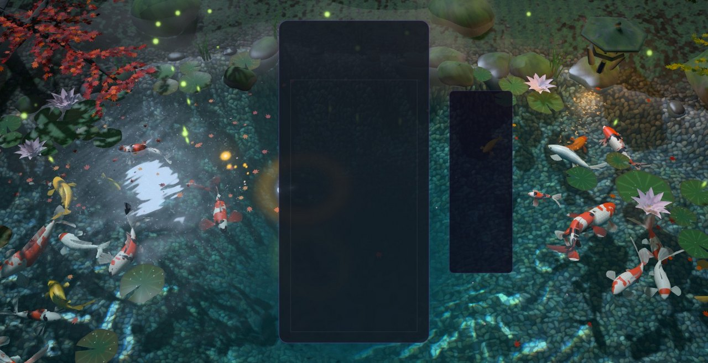 | 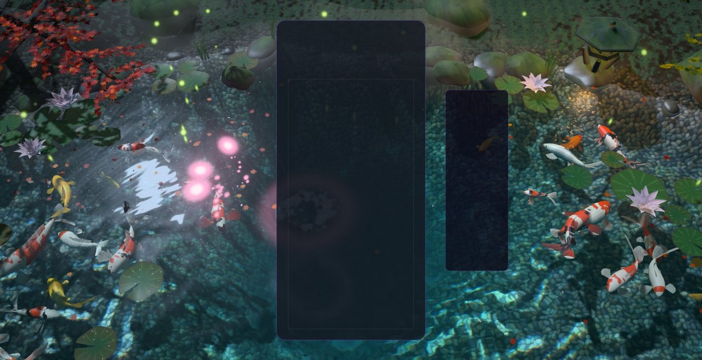 | 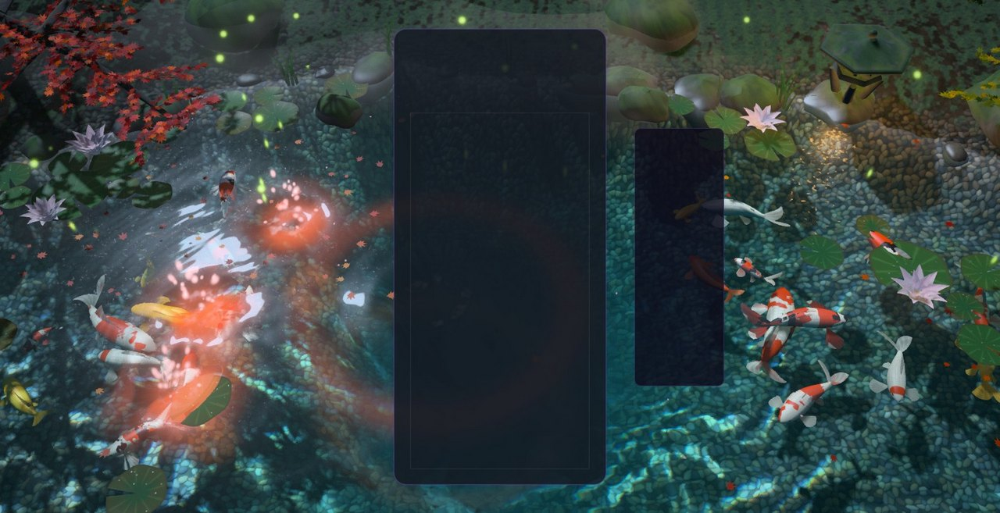 |

| Three lines | Chain of five | Chain of nine: the dragon |
| --- | --- | --- |
| 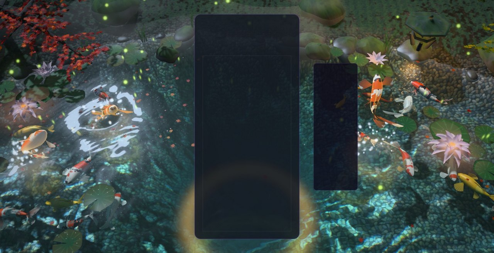 | 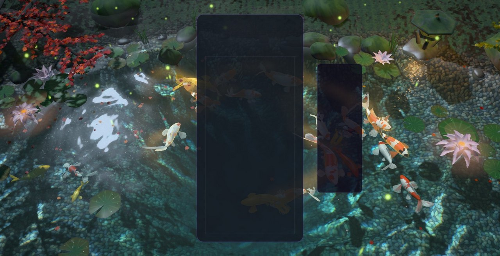 | 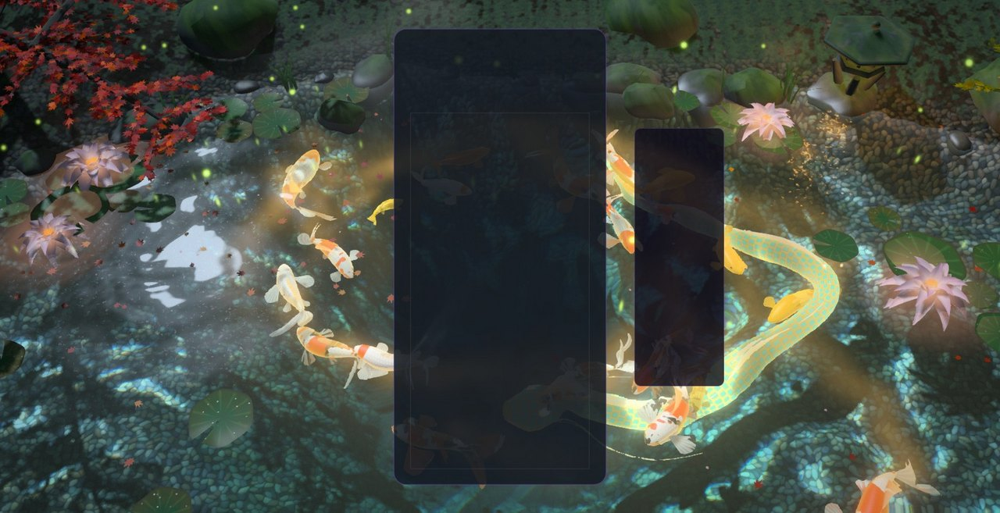 |

| Four lines |
| --- |
| 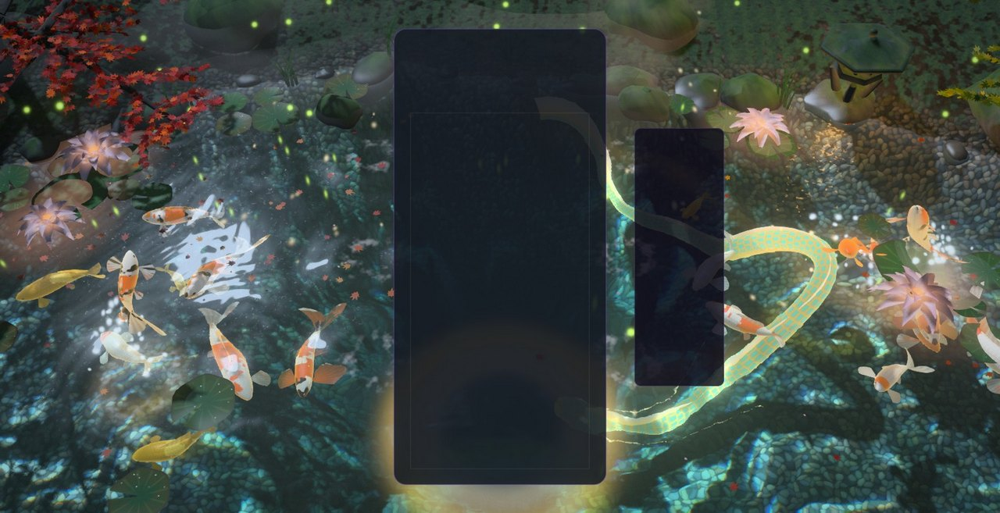 |

## The wheel of nights (added 2026-10-09)

The first version kept one palette for the whole game: a new level opened the lilies and
changed nothing that lasted. The pond now passes through six nights that stand on a wheel
(`src/themes/koi-pond/koi-pond-moods.js`):

| Night | Moon | Water | The maple | Lilies | Fireflies |
| --- | --- | --- | --- | --- | --- |
| Jade night (the pond as it was built) | blue-white | jade | crimson, a few in old gold | rose | green-gold |
| Frost moon | silver | indigo | frosted silver-blue | ice white | pale cyan |
| Blossom night | lavender | violet | pink blossom | lilac | warm gold |
| Rose hour | rose-white | orchid | fresh green | deep pink | lime |
| Harvest moon | gold | dark bronze | gold and russet | cream | amber |
| Moss rain | green-white | emerald | orange | white | green |

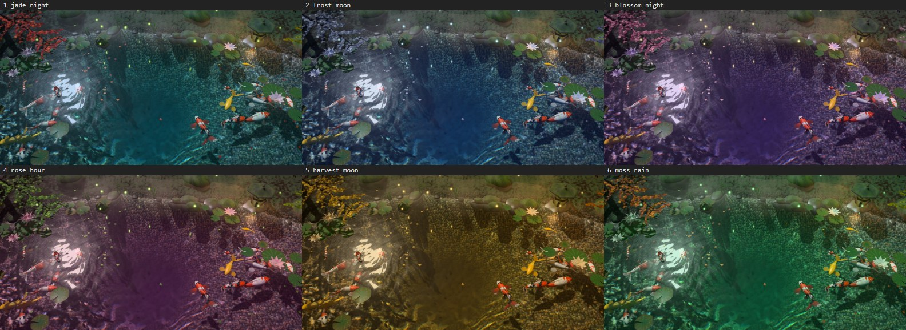

Two things turn the wheel, and they add:

- **A new level** steps it one night on, over about three seconds.
- **The clock** carries it one night every 90 seconds by itself, level or no level, resting on
  each night for the first and the last fifth of that time. A whole turn takes nine minutes.
  This is what moves the colours through a long level and in the modes that never level.

What a night changes: the moonlight (and with it the moon's image, the caustics and every lit
surface), the sky's ambient and what the water mirrors, the colour of the water's body and
what it takes out of light with depth, the lantern's flame a little, the lilies, the
fireflies, the tint of the lens in the shadows, and the leaves — on the maple and fallen on
the water. What it leaves alone: the koi, the pieces' colours, the gold of a chain, the
dragon.

The nights are ordered by the hue of their water, so every pair of neighbours mixes through
a colour and never through grey; a unit test checks the half-way water, ambient and sky of
every pair. **The maple does not mix at all.** Every leaf has its own moment in the turn (a
clump goes together, no two clumps at once), so the tree changes leaf by leaf and is never
the brown that pink and green would average to:

| Half-way from the blossom night to the rose hour | A new level, 1.2 s in (jade to frost) |
| --- | --- |
| 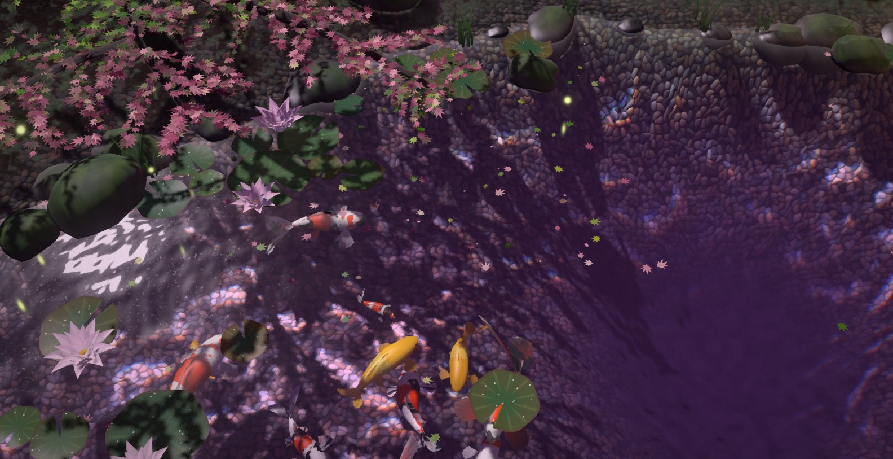 | 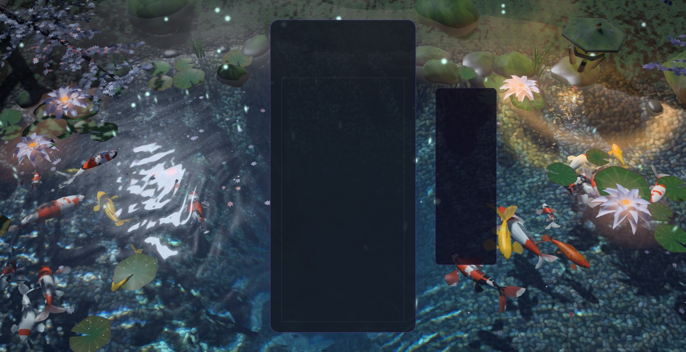 |

What is eased at a new level is the level's *place* on the wheel, the short way round, never
the colours. The colours are then read off the wheel, so a level's night arrives through the
same mixes the drift passes, the drift is the clock times a constant, and at rest the pond's
light is a pure function of the clock and the level: `seek(t)` plus a replay still reproduces
any frame. A new run puts the level back to one and the wheel eases back to wherever the
clock alone has it.

In the playground `&level=<n>` rests on a level's night, and the clock turns the same wheel:
`&t=99` is the second night at rest, `&t=135` half-way from the second to the third.
`diagnostics()` reports `night`, `nextNight`, `nightMix` and `nightPhase`.

The six palettes and the pace (90 s a night, three seconds for a level's step) are the
author's choices; the project owner has not reviewed them.

## How it is built

Nothing is loaded. The pond, the garden and the fish are generated in code when the theme
builds (about a second on this machine), so the theme ships no models and no textures — and
the last importer of `src/themes/shared/assets/landscape-glb.glb` (11.8 MB, licence never
confirmed) is gone, so that file and the four tree models beside it were deleted (see
`CREDITS.md`). Blender was offered for this pass and not used: every shape here is a loft, a
lathe, a displaced sphere or a leaf-shaped polygon, and the look is in the shading and the
simulation. The live Blender session on this machine was not touched.

### Runtime modules (`src/themes/koi-pond/`)

| Module | Owns |
| --- | --- |
| `koi-pond-theme.js` | Lifecycle, renderer and its WebGL2 fallback, gameplay subscriptions, layout watch, settings, capture flags. |
| `koi-pond-director.js` | The game's events → `lock`, `clear`, chain, level (pure). |
| `koi-pond-world.js` | Composition root and choreography: builds everything below, the fixed-step simulation loop, what each event does. |
| `koi-pond-core.js` | The lie of the pond as plain functions (waterline, depth, bank), the simulated rectangle, a baked noise field. |
| `koi-pond-composition.js` | The camera rig per aspect; the live board, card and stats-bar rectangles. |
| `koi-pond-moods.js` | The six nights and how level and clock turn the wheel they stand on (pure). |
| `koi-pond-light.js` | The moon and its shadow map, the lantern, caustics, the bands of light a lock sends out; hands every part the night's colours. |
| `koi-pond-surface.js` | The water's surface as a wave simulation on render targets, and the texture everything samples. |
| `koi-pond-water.js` | The water: refraction through the simulated surface, absorption, the moon's image, glitter, foam, light left in the water. |
| `koi-pond-bed.js` | The pebbled bed (baked on the CPU) and the mossy bank. |
| `koi-pond-koi.js` | The fish: mesh, swimming in the vertex shader, the varieties painted in the fragment shader. |
| `koi-pond-school.js` | How the koi behave (pure CPU): loops, steering, frights, leaps, the chain's ring. |
| `koi-pond-flora.js` | Lily pads, water lilies, fallen leaves. |
| `koi-pond-garden.js` | Stones, the lantern, the two maples, iris. |
| `koi-pond-air.js` | Fireflies and their images, mist, pools of light on the water. |
| `koi-pond-fx.js`, `koi-pond-dragon.js` | Spray; the dragon. |
| `koi-pond-post.js` | Bloom, a hue-preserving filmic curve, grade, calm zones behind the card, FXAA. |
| `koi-pond-quality.js` | One table for everything a tier scales. |

### Techniques (three 0.186.1)

- **The surface is a simulation.** A height field over the pond obeys the wave equation,
  stepped sixty times a second between two half-float render targets (which both renderer
  backends can do). A locking piece, a pebble, a leaping koi are *plungers*: small discs that
  bob a few times and so send a train of rings rather than one. Every koi near the surface
  presses the water down where it is; a fast one outruns its own waves and draws a V. Waves
  reflect off the bank and the standing stones (a mask baked from the pond's shape). A second
  pass derives what the picture needs — slopes, curvature, foam — and adds the breeze as nine
  warped analytic wave trains, so the ruffle is sharp and independent of the grid.
- **Caustics from curvature.** Under water the moon arrives through that surface: where it is
  cupped the light gathers. Every submerged material reads the surface's curvature above the
  point its light entered and divides by it, so the bright lines on the bed, on the stones and
  on the backs of the fish are the same lines, a ring from a lock drags a band of light across
  all of them, and on High they split a little by colour.
- **Refraction that leaves floating things alone.** The water reads the frame drawn so far
  through its slopes (`viewportSharedTexture`). The sample is taken where the bent ray would
  land, projected back to the screen, and its height is rebuilt from the depth buffer: if what
  is there stands above the water (a pad, a stone, a koi in mid-leap) the fragment looks
  straight down instead. Nothing above the surface smears into it.
- **One shadow map, redrawn every frame.** The koi, the pads, the lilies and every maple leaf
  are in it. Under a pad the bed is dark and the caustics stop; a fish carries its shadow a
  hand's breadth to one side.
- **Koi swim in the vertex shader.** One lofted mesh drawn once per fish: a wave runs down the
  spine and out through the tail, the body arcs and rolls into its turns, the pectorals scull.
  The simulation only hands it a pose of twelve numbers.
- **Varieties are recipes.** Islands of colour come from the pond's noise field in the fish's
  own skin coordinates, with a threshold per variety; tancho's sun and asagi's net are their
  own terms. No two fish share their islands.
- **Light left in the water.** A fourth channel of the wave simulation holds light: a koi
  swimming the chain's ring, and the dragon, write into it; it diffuses and fades like ink.
  The gold trails cost one more texture fetch in the water's shader.
- **The dragon is a function.** Its spine is its ring sampled behind one angle; the vertex
  shader lofts a tube, a mane and two whiskers along sixty-four points the CPU supplies. It is
  always drawn (with nothing to it while it sleeps), so waking it compiles nothing.
- **Leaves are leaves.** The maples are a few hand-set limbs that throw twigs; every leaf is a
  seven-lobed polygon, one small mesh drawn 6,400 times at High. Their shadows on the bed are
  the shadows of leaves.
- **Fixed-step and replayable.** Koi, spray and waves advance in steps of a sixtieth; `seek(t)`
  plus the same steps reproduces a frame. The playground's `?t=` and the theme's `?koiTime=`
  play the pond for twelve seconds up to the frame they show.

### Quality tiers

| Tier | Koi | Wave grid | Surface texture | Shadow map | Water | Maple leaves | Pads / lilies | Fireflies | Bloom, FXAA |
| --- | --- | --- | --- | --- | --- | --- | --- | --- | --- |
| Extreme | 30 | 640 × 384 | 1280 × 768 | 4096 | refracted, prismatic caustics | 9,600 | 50 / 9 | 96 | on |
| Ultra | 26 | 640 × 384 | 1280 × 768 | 2048 | refracted, prismatic caustics | 8,000 | 44 / 8 | 80 | on |
| High | 22 | 640 × 384 | 1024 × 614 | 2048 | refracted, prismatic caustics | 6,400 | 38 / 7 | 46 | on |
| Medium | 17 | 480 × 288 | 720 × 432 | 1024 | refracted | 4,200 | 30 / 6 | 44 | on |
| Low | 13 | 400 × 240 | 400 × 240 | none | refracted | 2,400 | 22 / 5 | 28 | off |
| Minimal | 10 | 320 × 192 | 320 × 192 | none | a tinted pane over the bed | 1,400 | 16 / 4 | 16 | off |

Every tier keeps the whole picture and every event, the dragon included. At High the scene is
about 0.21 M triangles, of which 0.10 M are maple leaves.

| WebGL2 backend, High | Low (no shadows, no bloom) | Minimal |
| --- | --- | --- |
| 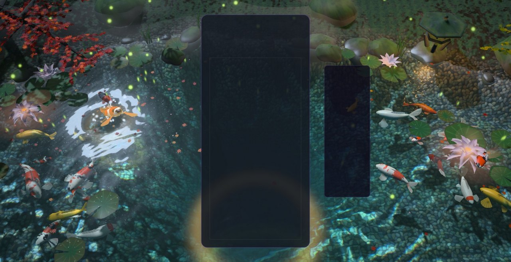 | 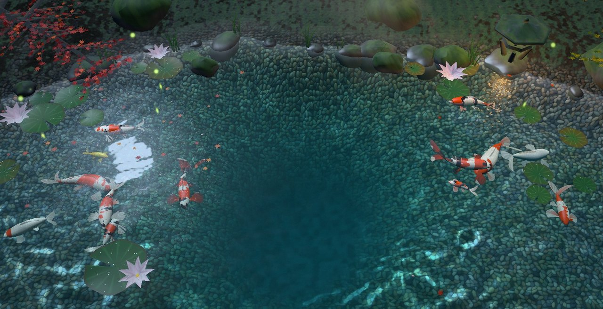 | 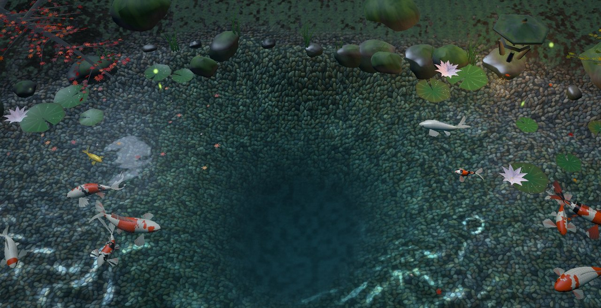 |

A tall screen, as a phone would run it (Low, WebGL2 backend):

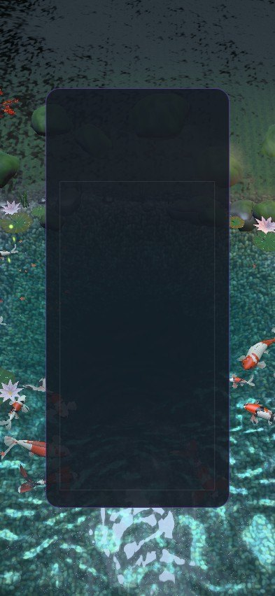

### The icon

The theme icon is a frame of the new scene in the house style (a 512 px full-bleed circle on a
transparent ground): three koi posed nose to tail beside an open lily, seen from nearly
overhead. The picture is staged — the playground's `icon=2` mode poses three fish of different
varieties and opens the nearest lily — but it is drawn by the theme's own renderer:
`playground.html?effect=koi-pond&orbit=0&hud=0&t=20&quality=High&icon=2&iconFov=15`, captured
square and baked with a small lift in saturation and contrast. An unstaged close-up of the pond
read as texture at picker size and was not used. Shown at picker size beside the previous icon
and four neighbours:

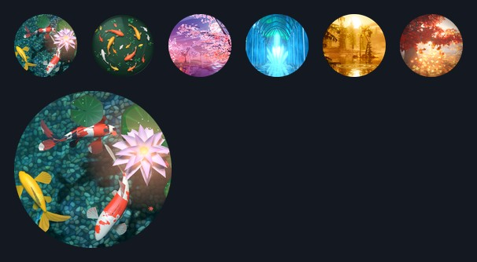

The choice is the author's; it has not been reviewed by the project owner.

## Verification

- **Playground** (`?effect=koi-pond&orbit=0&hud=0`): every capture in this record, each with a
  clean console (no WebGPU validation errors, no TSL warnings), on native WebGPU and with
  `forceWebGL=1`, at High, Medium, Low and Minimal, at 1584 x 813 and 393 x 852. Captures went
  through Electron under the machine's shared GPU lock rather than the browser MCP. Events are
  reproducible with `&t=20&board=1&event=lock|drop|clear|quad|tspin|perfect|levelUp`,
  `&eventAge=<s>`, `&lines=<n>`, `&u=0..1&row=0..19`, `&color=<hex>`, `&combo=<n>`,
  `&locks=<n>`; `&quality=<tier>` picks a tier; `&probe=1` reads the wave simulation back into
  the diagnostics (a hard drop measured rings 3.9 cm high 1.9 s after it; at rest the koi's own
  wakes stand 4 mm).
- **In the game, lifecycle**: `node scripts/validate-all-themes.mjs --theme koi-pond` against
  the worktree's dev server — PASS, 0 lifecycle failures, 0 console errors, 0 process failures,
  four runs out of four. **The pass was obtained with a local, one-run patch to the
  validator's worker**, which predates the theme collection (themes are locked on a fresh
  profile, and a theme card now opens a detail page whose button applies the theme): the patch
  adds `unlockAll=1` and clicks that button, and was reverted after each run. Unpatched, the
  validator currently fails for every theme. Its capture is the new
  `docs/theme-screenshots/koi-pond.png`:

  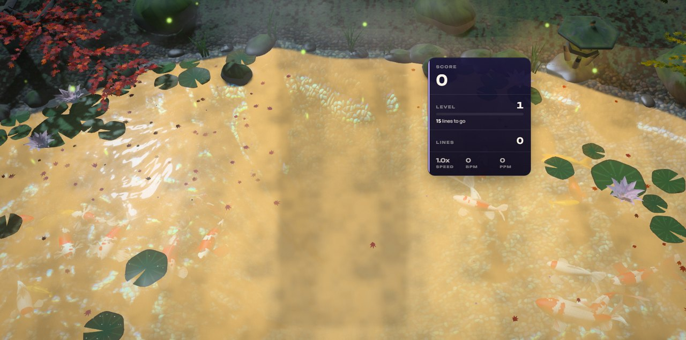

- **In the game, in play**: a scratch Electron harness booted the real game on the dev server,
  pinned the theme, started a single-player session and sent a hard drop, a two-line clear,
  four single clears in a row and a four-line clear through the game's own event bus. The
  console carried nothing from the theme. A live change of quality (High to Medium) rebuilt
  the scene and kept it running on one canvas; switching to another theme left no canvas
  behind.

  | Hard drop | A chain of clears | Four lines |
  | --- | --- | --- |
  | 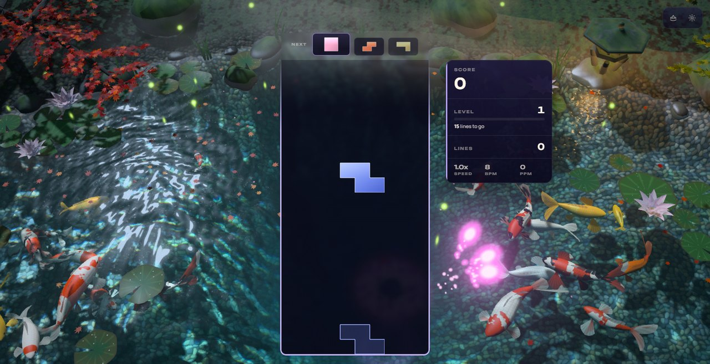 | 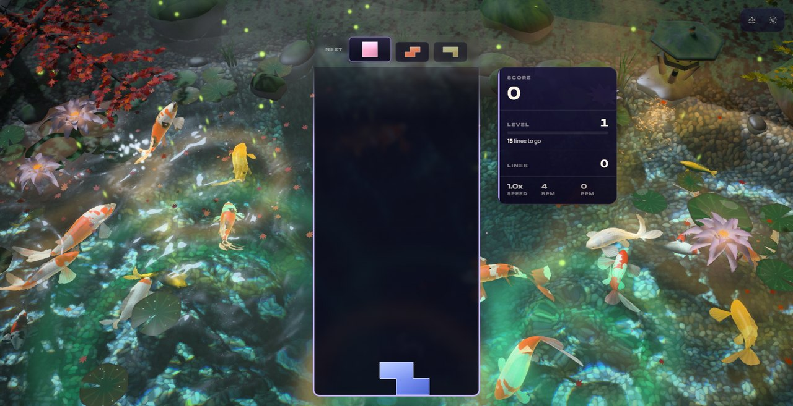 | 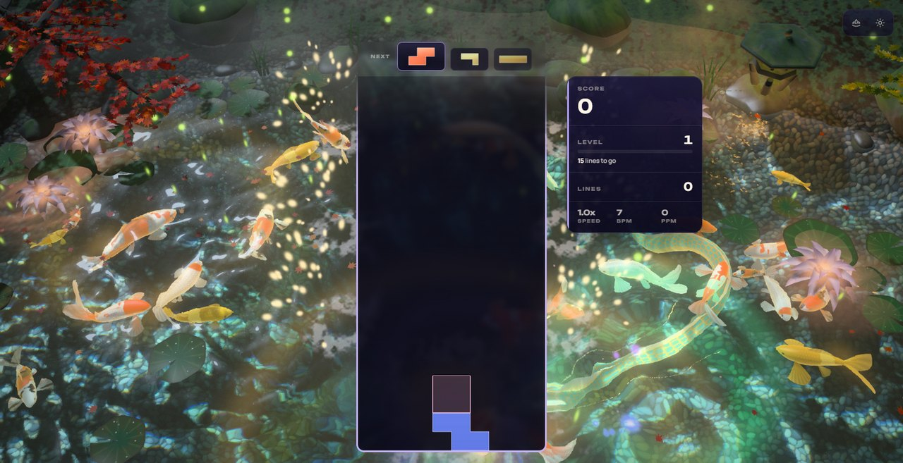 |

- **The wheel of nights (2026-10-09)**: 34 playground frames through Electron under the
  shared GPU lock, every one with a clean console: the six nights at rest and the six
  half-way blends at High on native WebGPU, a new level 1.2 s and 3 s in, clears and a
  four-line clear on three of the nights, Low and Minimal, `forceWebGL=1` at High and at Low
  on a 393 x 852 screen, close-ups of the maple turning, and two consecutive frames four
  minutes into a session (nothing jumps). Two nights were retuned after the first pass: the
  rose hour's bed read red-brown under the red koi (now orchid), and the harvest moon's deep
  water read olive (now a darker bronze). The half-way point between those two is the
  dullest moment on the wheel, a dusky wine-brown; it passes in about half a minute.
  `scripts/validate-mobile-webgl2.mjs --theme=koi-pond` (software WebGL2 at phone size) passes
  at Low and at Minimal, and its pictures were read. In the real game, on the dev server, new
  levels were sent through the event bus (2, 3, then a jump to 5): the diagnostics read jade,
  then 70 % turned 1.3 s after the event, then frost moon, blossom night and harvest moon at
  rest; the console carried nothing from the theme, a live quality change and leaving the
  theme behaved as before.

  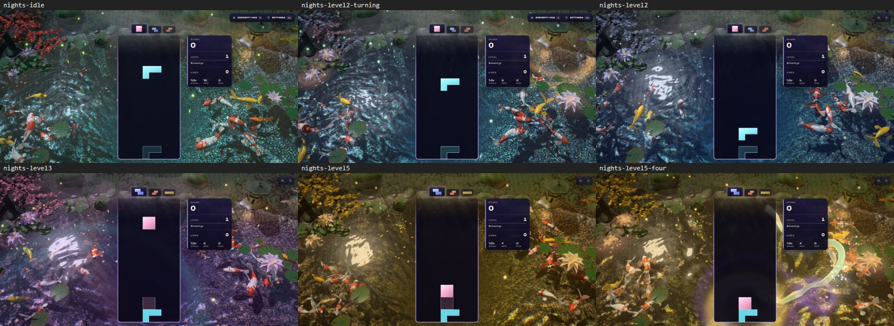

  `tests/unit/koi-pond-moods.test.js` adds 14 tests: every night whole, the first night equal
  to the pond as it was built, neighbours that mix through a colour, the rests, the two ways
  the wheel turns, no jump at a new level, the short way round for a new run, and the same
  light from a seek as from playing up to it.
- **Build and gates**: `npm run build` (boot closure OK; the theme chunk is 126 kB before
  gzip), `typecheck`, `check:boundaries`, `lint:ci` (at its baseline), `check:ip-strings`,
  `check:pages-artifact` and `check:release-gates` all pass. ESLint reports 0 errors in
  `src/themes/koi-pond`, the playground effect and the tests.
- **Tests**: 209 tests in six suites under `tests/unit/koi-pond-*.test.js` — the director,
  the theme adapter, the pond's shape and composition, the koi simulation, the world and its
  plans, and the facing of every generated mesh. The adapter, the director and most of the
  tests were written by a second agent from the modules alone; its tests found defects that
  are fixed here: frightened koi could swim onto the bank and through the standing stones, a
  leap could land on a rock or outside the picture, the bed stepped 35 cm at the waterline
  under the basin, one "standing" stone stood on the bank, no koi ever reached the surface to
  kiss it, and on a phone three koi in four kept loops the screen never showed. A close-up
  then showed that the koi's bodies and the lily pads had been built facing inward, and so had
  been lit by ambient light alone; `koi-pond-meshes.test.js` pins that. The repository's full
  unit suite on the final tree: 685 files, 9,188 tests passed and 1 failed —
  `odyssey-level-briefing`, which expects "250,000" and gets this machine's locale's
  "250 000"; it fails the same way on an untouched checkout of `main` here. (An earlier run,
  with the machine busier, also timed out two Odyssey wall-clock tests; those too failed on
  the untouched checkout at the time.)

### Frame pacing (an observation, not a budget)

The in-game harness counted animation-frame intervals in a visible Electron window at
1584 x 813, High, native WebGPU on the RTX 3070 Laptop GPU, **while about a dozen other
sessions were using the machine**. Three of four runs read 131 frames a second (a mean
interval of 7.6 to 7.8 ms, 99th percentile 8.7 to 15.5 ms, no frame over 66 ms) through rest
and through the events; the fourth, which overlapped a production build of this same
worktree, read 86. By ADR-0016 none of this may be quoted as a budget or a comparison. The
theme perf lane was not run, and there is no reading at all for integrated or phone GPUs: the
lower tiers are untested on real low-end hardware.

## Known limits

- A tall screen shows a narrow slice of the pond: the lantern and the maple are out of frame,
  the card covers the basin and most of the reaches, and the strip above the card is the far
  bank. The koi take loops inside the picture and the moon moves to the foot of it, but it is
  the weaker composition.
- The water mirrors only what is bright — the moon, the lantern's flame, the fireflies — and
  each analytically. At this steep angle water reflects a few per cent, so the maple and the
  bank are not mirrored at all.
- Shadows on the bed are cast along the moon's direction in air, not the steeper one it takes
  under water; caustics use the under-water direction. Nobody will measure the difference.
- Low and Minimal have no shadows (so the koi lose their shadows on the bed) and no bloom;
  Minimal has no refraction either: the water is a tinted pane over the bed.
- The koi is one lofted body with fins: no gill plates, no barbels, no mouth. It is modelled
  for the distance it is seen from.
- How long the first activation takes to compile its pipelines was not measured.
- The nights were judged from stills and a fifteen-second run of the game, not by playing a
  long session: nobody has yet watched a whole nine-minute turn of the wheel. On Minimal,
  where the water is a tinted pane, the harvest moon's water is plainly olive.
- The repository's theme validator needs the patch described above until it learns about the
  theme collection. That fix is outside this change and was not made.
- `public/assets/vendor/draco/` (776 kB) was only read by the old Koi Pond. Nothing reads it
  now; it was left in place.
- `main` moved while this was built (eleven other rebuilds landed). The Summer rebuild moved
  two tree models into `src/themes/shared/assets/` for `koi-tree-audition.effect.js`, which
  this change deletes. The merge removed that effect and those two models with it, so
  `src/themes/shared/assets/` is now empty and gone.
