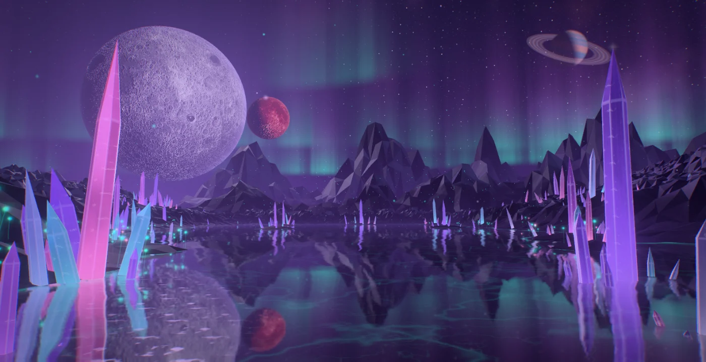
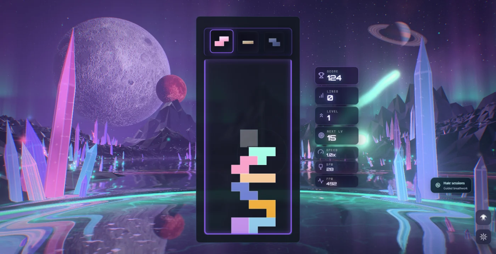
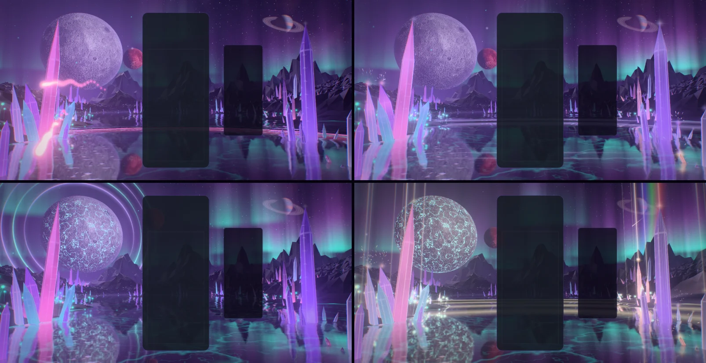
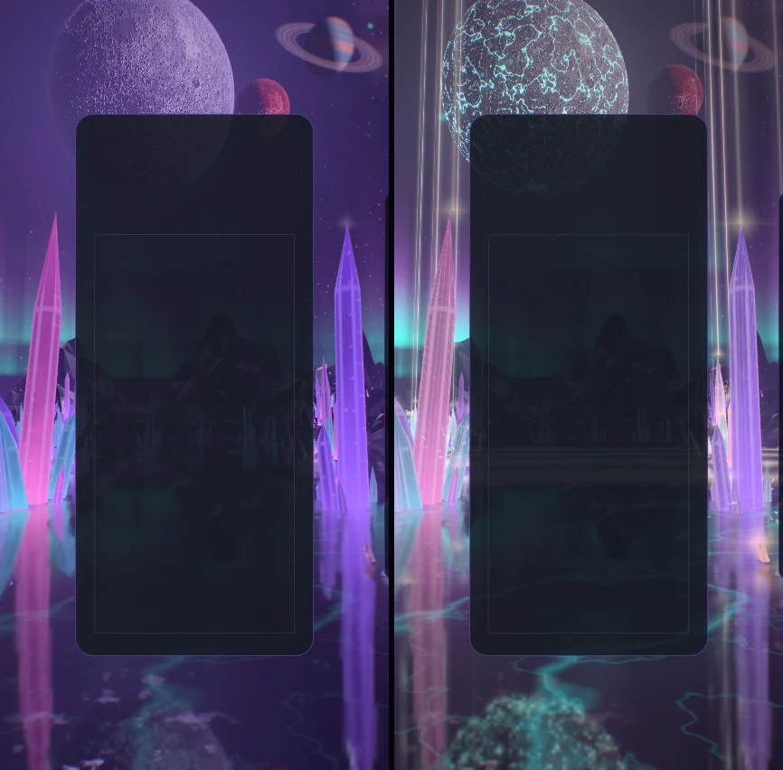
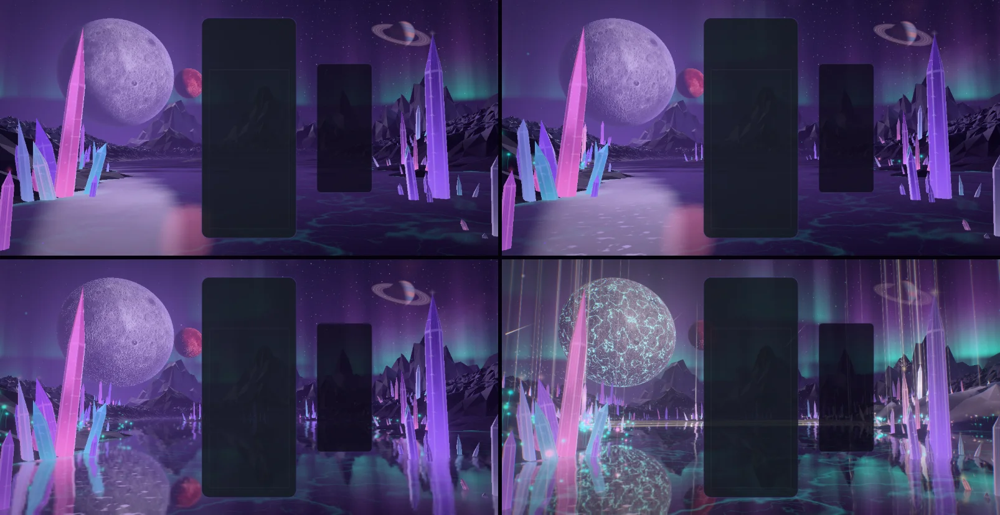

# Lunara — the valley of twin moons

Implemented 2026-10-05 on `feature/lunara-masterpiece`, with Three.js 0.186.1. A from-scratch
rebuild: it replaces the earlier theme in full (the 2,900-line theme class, its fourteen
material pairs with their GLSL twins, the compute motes, the pooled reaction particles, the post
stack, the four playground effects and the texture-lifecycle test). Lunara keeps its identity —
the violet moon and its rose companion, the crystal spires, the bioluminescent flowers, the
aurora — and everything else is new. This document records the shipped design and what was
verified. It is a reference, not a backlog.

## The picture

Night on a crystal world. The viewer stands in mirror flats — a sheet of still water a hand
deep over a bed veined with light — and looks down a valley. The great moon hangs upper left,
ten degrees across, cratered and lit from the side; its rose companion circles it, passing in
front and behind. Crystal spires bracket the view and step back along both shores; lantern
flowers grow in drifts at their feet; two crystalline ranges close the far shore; a ringed
world stands far right; three curtains of aurora cross the sky. The whole valley stands upside
down in the water.

The gameplay card covers the middle of the frame, so the picture is built for what stays
visible: the moons to the left of it, the second cluster of spires and the ringed world to the
right, the flats below, the curtains above.

## The one idea

The valley is an instrument of crystal, and the board plays it. A piece's light leaves the
board, enters a spire and stays there; a clear lets go of everything the valley is holding.

## Event language

| Event | Response |
| --- | --- |
| Piece lock | A wisp in the piece's colour leaves the edge of the card at the piece's own height and flies into a spire on that side. The spire flashes from root to point, throws crystal dust, wears a star on its tip and **keeps** some of that light (it fades over about half a minute), so the valley slowly fills with the colours of the pieces played. A ring in the same colour runs out over the flats from under the board, a smaller one from the foot of the struck spire, and the veins in the bed light as the rings pass over them. |
| Hard drop | The same, harder: three wisps, wider rings, more dust, a camera dip. |
| Line clear | The cleared rows leave the card as blades of moonlight at their own heights. A wave runs out through the valley from the foot of the board, one front per line: as it passes a spire, the colour that spire was holding flares out and is gone; the flowers flare, the bed floods, the curtains surge. One line answers in the bed's light, two in the moon's glow, three in both at once. |
| Combo | The valley charges. A halo ring forms round the great moon for every step of the chain (up to six), lit in arcs that turn; veins of light open across the moon's face from its centre outward; the curtains fold deeper and burn brighter; the motes rise faster; the companion quickens in its orbit. When the chain breaks the valley lets its breath go and the rings fade. |
| Four lines / perfect clear | The valley holds its breath: every light sinks for a fifth of a second while the moon's veins fire. Then a pillar of light stands on the tallest spire of every cluster, a prismatic ring crosses the sky from the great moon, meteors fall, and the wave goes out in moonfire gold. |
| T-spin | The curtains twist and a small ring leaves the moon. |
| Level up | The valley changes colours: five palettes, cycled (amethyst, rose quartz, glacier, ember, ultraviolet). |

Combo here is the true consecutive-clear combo (one `ComboTracker` per player in
`LunaraDirector`); the bus's `COMBO` event is cascade depth (ADR-0011). With several boards on
screen each lock leaves its own board, and the valley charges to the longest chain any board is
holding.

## How it is built

| File | Role |
| --- | --- |
| `lunara-core.js` | Three-free constants and maths shared by the plan, the choreography and the shaders: ring and wave timings, how long a spire holds light, the five palettes, where the moons sit on screen for an aspect. |
| `lunara-layout.js` | The valley's plan, seeded and deterministic: the near terrain's heightmap, both ranges' skylines, every spire (listed by importance) and every flower. |
| `lunara-tsl.js` | Hashes, the baked noise and height textures, the shared uniforms, the valley's light (the sky function every surface mirrors and fades into, the moons' discs, the mist, the lock rings, the clear waves). |
| `lunara-sky.js` | The dome: gradient and moon scatter, stars, nebula, the three aurora curtains, the ringed world, the halo rings, the prismatic ring; and the meteor pool. |
| `lunara-moons.js` | The two moons: phase, relief along the terminator, a rim of atmosphere, and the great moon's veins. |
| `lunara-terrain.js` | The banks and the two ranges, cut like crystal. |
| `lunara-crystals.js` | The spires, the light they hold, their tip stars and the pillars. |
| `lunara-water.js` | The mirror flats: the planar mirror, the bed's veins, lock rings, the clear's swell, moon glitter, the shore's line of light. |
| `lunara-flora.js` | Lantern flowers and motes. |
| `lunara-fx.js` | Wisps, crystal dust, row beams. |
| `lunara-world.js` | Owns the uniforms, the parts, the camera rig and the choreography. Shared with the playground effect, so what is iterated there ships. |
| `lunara-director.js` | Renderer-free: stages bus events per player and resolves one lock and one clear per frame. |
| `lunara-composition.js` | Three-free: reads the live card, board and HUD rects and maps board columns and rows onto the screen. |
| `lunara-post.js` | One scene pass, bloom, and one output pass. |
| `lunara-quality.js` | The six tiers. |
| `lunara-theme.js` | Lifecycle, renderer selection, settings, layout watch, GPU-loss recovery, capture flags. |

Techniques worth knowing before changing it:

- **One node renderer on both backends.** `WebGPURenderer` on WebGPU, its WebGL2 backend
  otherwise (or `?forceWebGL`). There is no `ShaderMaterial` left, so `lunara` is off the
  dual-state allowlist. Nothing uses compute: the motes that were a compute simulation are a
  closed-form function of the clock.
- **Nothing is lit by a light.** Every material shades itself (`MeshBasicNodeMaterial`) from
  shared uniforms: the direction and colour of each moon, the far sun that lights them, and
  one sky function (`luSkyBase`) that is at once the sky, the colour of distance, and what a
  facet or the water mirrors. That keeps the mirror's second render cheap and makes every
  surface agree on the colour of the night.
- **Cut like crystal.** Spires, banks and ranges take their normal from the triangle itself
  (screen-space derivatives of the world position), turned to face whoever is looking, so the
  mirror's flipped winding needs no second material.
- **A spire is a cut stone without a framebuffer read.** Fresnel mirror of the sky and the
  moons' discs; the sky along the refracted ray, with the moons' discs refracted once per
  colour channel so their image splits; the great moon's light coming through from behind; the
  prism's far edges seen through the near face as straight bands that slide when the camera
  drifts; growth lines; glittering inclusions; a lit arris on every edge.
- **The light a spire holds is three instanced attributes** written only when gameplay happens:
  what it holds and since when, the flash and when it fires (a wisp's arrival may be half a
  second ahead), and when a passing wave voids it. The shader decays and fires them in closed
  form; the tip stars and the pillars are two more draws that share the same buffers.
- **The aurora is solved, not marched.** Each curtain is a vertical sheet standing on a waving
  line across the valley. Where the view ray meets it comes from two fixed-point steps on the
  wave, so a curtain has true perspective, a sharp lower border and rays for two noise fetches.
- **The mirror.** On Medium and up a planar `reflector()` renders the valley from the mirrored
  camera at reduced resolution; the water reads it through its own slopes. Wisps and row beams
  live on layer 1, which the mirror's camera does not render. Low and Minimal mirror the sky
  function and the moons' discs instead.
- **The moons hold still; the companion changes shell.** Both hang on a far shell placed from
  the composition (screen anchors per aspect). The companion's orbit is drawn in the sky's own
  plane; it swaps between a nearer and a farther shell while it stands clear of the great moon,
  which preserves its size on screen and lets plain depth testing do transit and occultation.
- **Upright screens.** A phone held upright is too narrow to see where the spires stand, so
  one uniform draws every spire nearer the middle of the flats there, and the moons move up
  above the card.
- **Closed form first.** Wisps, dust, rings, waves, pillars, meteors, motes and the aurora are
  functions of the world clock and event timestamps. Nothing is created at event time: events
  write numbers into ring-buffered uniform slots and preallocated pools. `seek(t)` plus a
  fixed-step replay reproduces any frame.
- **HDR, single output.** The scene is scene-linear; a max-channel knee selects what blooms (no
  MRT), and one output pass does the lens fringe, the calm zones on the card and HUD, bloom,
  shafts dragged out of the great moon, a hue-preserving filmic curve, grade, vignette, grain
  and dither. An iris closes as the valley flares so its colours survive the surge.
  `usesMrtScenePass()` is false.
- **No MaterialX noise.** One tileable fBm texture is baked on the CPU with its own mip chain;
  the terrain's heights are a second small texture the water reads for its depth.

## Tiers

| Tier | Spires | Flowers | Motes | Curtains | Mirror | Moon relief, dispersion | Bloom, shafts | Scene MSAA |
| --- | ---: | ---: | ---: | ---: | --- | --- | --- | --- |
| Minimal | 70 | none | none | 1 | sky function | off | off | off |
| Low | 110 | 60 | 300 | 2 | sky function | relief | off | off |
| Medium | 170 | 140 | 700 | 3 | 0.40 scale | on | on | off |
| High | 240 | 220 | 1,200 | 3 | 0.50 scale | on | on | 4× |
| Ultra | 330 | 320 | 2,000 | 3 | 0.62 scale | on | on | 4× |
| Extreme | 420 | 420 | 3,000 | 3 | 0.75 scale | on | on | 4× |

Every tier keeps the whole picture and every event. These are allocation budgets, not
measurements of frame rate.

## Assets

The moons' faces are the moon map the fleet already ships (`public/textures/2k_moon.jpg`,
Solar System Scope, CC BY 4.0, credited in `CREDITS.md`), turned to its far side and tinted. It
loads off the frame: the moons stand as smooth lit spheres until it arrives.

Everything else is generated in code: the terrain, the ranges, the spires, the flowers, the
noise, the ringed world, the stars. No model is loaded and Blender was not needed: every shape
in the valley is a prism, a facet or a quad, and what makes them read is the shading.

The Poly Haven rock and ground textures and the moonrise HDR environment the earlier theme read
are no longer used and were removed from `public/` (see Verification for what was checked).

## Verification

- Unit tests: 134 new tests in four files (director 19; plan and composition 26; world 44; theme
  45). The earlier theme's texture-lifecycle test was retired with it,
  `portable-theme-renderers.test.js` and `portable-theme-context-recovery.test.js` no longer
  list Lunara, the teardown-regression test was rewritten for the new class, and the dual-state
  allowlist lost its entry. Those ten files: 173 tests, all passing.
- Whole suite, run once on a build machine that other sessions kept at full load: 561 files,
  6,529 tests; 545 files passed. The 16 that did not (17 tests) are wall-clock tests in files
  this change does not touch or import (Odyssey bakes and environments, Blood Moon, Earth core,
  Stellar Drift, Waves): fourteen 5 s test timeouts, one 10 s hook timeout, and time budgets.
  Run again on their own with long timeouts, 13 of the 16 files pass; the other three assert a
  bake time (under 2,000, 1,500 and 300 ms) that the loaded machine missed (4,108, 2,735 and
  337 ms). CI is the authority for those.
- Gates: typecheck; lint ratchet (948 errors against a baseline of 1,070 — removing the old
  theme took about a hundred with it, the new files add none; the baseline was left as it is);
  theme lifecycle audit; dependency boundaries (1,119 modules); production build with the
  boot-closure guard; IP-string gate; Pages artifact check; release gates — all pass. The
  palette gate fails on `main` and here for the same unrelated reason (Stillwater); Lunara
  scores 0/7 on it. `scripts/validate-all-themes.mjs --theme lunara` against the dev server:
  0 lifecycle failures, 0 console errors.
- Playground captures on WebGPU (RTX 3070 Laptop): rest; lock and hard drop at four moments;
  clears of one, two and three lines; held chains of three, five and six; the four-line hush,
  burst and aftermath; two more level palettes; rest or an event at Minimal, Low, Medium, Ultra
  and Extreme; High, Low and Minimal on the forced WebGL2 backend; an upright 430 × 852 frame at
  rest and through a four-line clear; reduced motion. The final set of 18 and the 5 retaken
  after the last shader changes had no console errors or warnings.
- In the real game (Electron, dev server, single player): the theme starts on WebGPU, aims its
  events at the live board, takes real hard drops from the keyboard and bus-injected locks,
  clears, a chain and four lines, survives a live quality change (High to Medium) and lets go
  of its canvas when another theme takes over. The same event script ran clean on the WebGL2
  backend at Low.
- One fault the captures caught late: with a seventh per-crystal attribute the spires asked
  WebGPU for nine vertex buffers (it allows eight) and stopped drawing there while WebGL2 kept
  drawing them. The per-crystal attributes now travel in two interleaved buffers. A helper
  agent's review of the world found six more (a wisp target whose tip was under water, a NaN
  path in `onClear`, no wisp targets before the first layout read, a replay that was not
  bit-exact, held light showing before its wisp arrived, and held light that ignored the
  four-line hush); all six are fixed and covered by the tests above.

Observed, not measured (whole-game frame rate at 1584 × 813 while other sessions held the CPU
at 100%, so the figures moved by tens of fps between runs): 58 to 76 fps at High on the
RTX 3070; on the integrated AMD GPU, 31 fps at High before the dome was moved behind the solids
and the ring and wave loops were skipped at rest, 60 after, 63 to 65 at Medium and 86 at Low
(Low renders at 0.85 scale); 121 fps on WebGL2 at Low on the RTX.

Not verified: GPU cost per tier through the theme perf lane (ADR-0016); physical phones; local
multiplayer and Infinity layouts in a capture (their routing is unit-tested only); the icon on
an Odyssey level orb; sessions of several hours. `docs/theme-screenshots/lunara.png` still
shows the previous artwork (a fleet capture writes it).

## Reproduce

Run `npm run dev:playground`, then:

`/playground.html?effect=lunara&t=20&quality=High&board=1`

Add `event=lock|drop|clear|quad|tspin|perfect|levelUp` with `eventAge=<s>`, and `combo=<n>`,
`level=<n>`, `lines=<n>`, `u=<0..1>`, `row=<r>`, `color=<hex>`. `locks=<n>` plays n locks first,
so the valley is holding their light when the event fires. `demo=1` (without `t`) plays a
looping script. `parts=` draws only the named parts; `falseColor=1` bands the pre-tone-map
peak; `noPost=1` shows the raw scene; `forceWebGL=1` uses the WebGL2 backend; `reduce=1` is
reduced motion. In the game: `?lunaraTime=`, `?lunaraFixedDt=`, `?lunaraParts=`,
`?lunaraFalseColor=1`.

The theme icon is a frame of the scene through the playground's icon lens, two steps into a
chain (one halo ring, a wisp just arrived in the rose spire):

`/playground.html?effect=lunara&t=3&quality=Extreme&icon=1&iconFov=54&iconYaw=0.42&iconPitch=0.2&locks=4&combo=2`

captured in an 840 × 840 window (the largest square this laptop's screen allows), cropped to
90% of the frame around (0.555, 0.42), given a colour lift (contrast 1.1, saturation 1.22,
brightness 1.1) and baked as a 512 px circle on a transparent ground. The same file is kept at
`public/assets/themes/lunara-theme-icon.png`. Two captures of that URL were not byte-identical
(a few pixels differ), so the icon is reproducible to the eye, not to the byte.

## Captured previews

