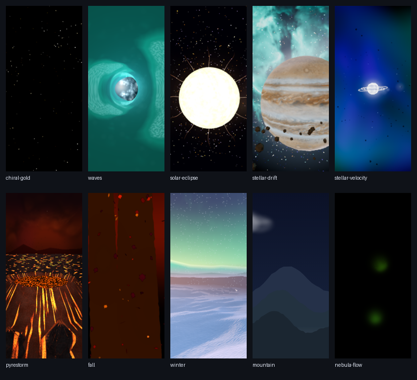
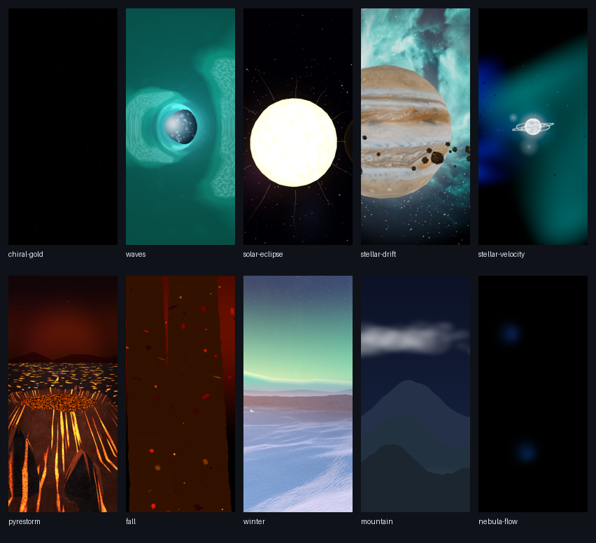
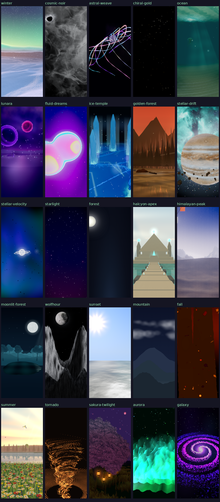
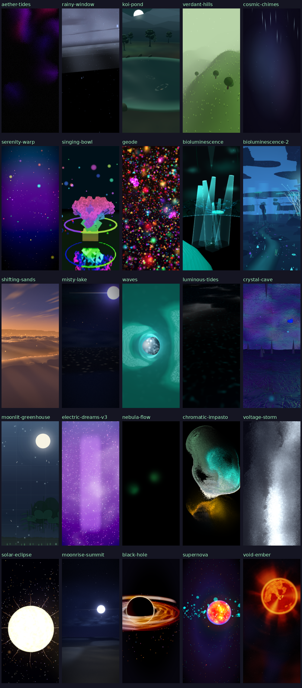
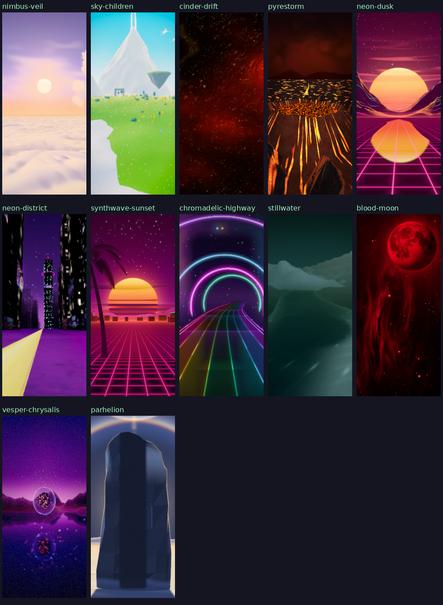

# Mobile theme WebGL2 audit — October 2026

Audit baseline: `6c5871518c8fe3ec3d7d79c309d10a6b9edbc359`, after the Wolfhour and intro repair in #324. Scope: all **62 registered themes**, their initialization/fallback paths, materials, post processing, particles, resize behavior, and portrait composition. This document records the source audit and the fixes from this work; it is reference evidence, not a separate backlog. The umbrella remediation plan governs future work.

The confirmed recurring problem was choosing older artwork because the actual backend was WebGL2. Three's `WebGPURenderer` also renders node materials and node post processing through WebGL2. Its renderer kind selects material/post APIs; its actual backend selects native GPU features. The corrected themes retain the modern scene on both backends and use CPU or analytic particles where native storage compute cannot be retained safely.

Read with [ADR-0008](adr/0008-hybrid-renderer-and-webgl-holdouts.md), [ADR-0019](adr/0019-gate-on-renderer-kind-not-backend.md), [WEBGPU_THREEJS_WORKFLOW.md](WEBGPU_THREEJS_WORKFLOW.md), and [THREE_UPGRADE_R185_TO_R186_2026-10.md](THREE_UPGRADE_R185_TO_R186_2026-10.md). The tables distinguish compatibility from physical-phone performance acceptance.

## Confirmed defects and repairs

| Defect | Affected themes | Result of this work |
|---|---|---|
| Rejecting the supported node WebGL2 backend and selecting a classic material/post twin | Astral Weave, Chiral Gold, Cosmic Noir, Fluid Dreams, Golden Forest, Ice Temple, Lunara, Ocean, Stellar Drift, Stellar Velocity | Modern node renderer, materials and post on both backends; actual native compute/MRT gates retained. Existing bounded CPU/analytic alternatives adapted to node materials. |
| Rejecting WebGL2 entirely despite portable node artwork | Electric Dreams V3, Himalayan Peak | Node WebGL2 scene/post accepted, with compatible particle attributes and conservative native-only MRT. |
| Node renderer paired with legacy materials/post on its WebGL2 backend | Winter | Modern Wonderland world, foxes, aurora, snowfield and WinterPipeline retained. CPU paw trails and vertex-animated node snow replace native storage features. |
| Entire hero particle layer and common post omitted on WebGL2 | Starlight | Same stardust billboards, counts, colors, lifetime, events and grade restored; CPU instanced attributes with bounded analytic curl on WebGL2. |
| Native raw renderer selected an obsolete Canvas2D substitute | Void Ember | Authored GLSL star, corona, prominences, nebula and starfield with bounded analytic particles; shared conductor, uniforms, quality and event channels. Native WGSL retained. |
| Classic intro silently omitted portable quality, phase and whole-scene reaction APIs | Serenity Warp / classic intro | Current authored CPU scene retained; shared cinematic profile/grade, tier budgets, phase curves, pooled scene bursts, camera/glow/spin/scatter reactions and conservative pool residence now work on WebGL2. Native fine compute details remain separate. |
| Asynchronous placeholder image replacement retained an incompatible immutable texture allocation | Lunara, Sky Children, Winter | Dispose the placeholder GPU allocation before assigning the larger image, retaining texture identity and the guard against late loading after external disposal. |
| HALF_FLOAT linear filtering unnecessarily required a FLOAT32 extension on WebGL2 | Aether Tides, Chromatic Impasto, Nebula Flow, Voltage Storm | Recognize core WebGL2 half-float filtering; preserve bloom/shading/resolution where supported. Validate renderable formats and release capability probes/replaced render targets. |
| Quality settings or resize bypassed mobile budgets | Aurora, Bioluminescence II, Cinder Drift, Cosmic Chimes, Ice Temple, Luminous Tides, Neon District, Singing Bowl, Sunset | Canonical quality selection and existing effect policy restored; effective pixel ratio retained on resize/rotation. Sunset's second starfield now respects its existing preset instead of silently allocating at least 35,000 stars. |
| Real UI quality was ignored because only obsolete settings were read | Chiral Gold, Solar Eclipse, Stellar Drift, Stellar Velocity, Waves, Mountain | `effectQuality` takes precedence, with legacy readers retained. Stellar Velocity's diagnostic tier switches use the canonical setting and restore the exact prior key/value. |
| Canonical tiers were absent from authored preset tables and silently selected a more expensive tier | Pyrestorm, Nebula Flow, Fall, Winter, Mountain | Pyrestorm's existing cheapest preset is named Minimal; Minimum remains a read alias. Minimal maps to existing Low in the four/five-tier scenes; Nebula Flow Ultra maps to High and Mountain Extreme to Ultra. Existing artwork and budgets are retained. |
| Shared DPR calculation used the default High ceiling on the web | BaseTheme consumers | Canonical quality is passed to the existing scene-cap policy. Low/Minimal phones use their existing tier ceilings; an active packaged-desktop policy remains authoritative. |
| Authored celestial heroes moved outside the portrait viewport | Moonlit Forest, Sunset, Black Hole | Moon/halo and celestial-core placement fit the narrow view. Black Hole bounds its camera-relative horizontal bias and immediately reframes a smoothed landscape target after rotation. Desktop arcs/orbits and native material treatment remain shared. |
| Shared scene rendered behind opaque legacy DOM layers | Rainy Window | The authored Water/GLSL storm canvas now belongs to its active theme container above the obsolete background children; teardown detaches and clears its renderer reference. |
| Node WebGL2 scene-pass clear produced a nearly uniform black frame | Black Hole | The post pipeline owns the WebGL2 scene-target clear, with scoped `autoClear` restoration. Native and direct-render paths retain their existing clearing behavior. |
| Failed native initialization had no fresh node WebGL2 retry | Neon District; renderer ownership paths in other repaired hybrids | Bounded renderer candidate initialization with lifecycle ownership; fresh forced WebGL2 candidate after failure. |
| Authored grove depended on an unavailable remote Draco decoder | Koi Pond | Pinned decoder assets self-hosted under the deployed base path, with upstream license and attribution. All 36 authored trees load without external decoder requests. |
| GPU resources were deleted after their lost context had been restored | Shared node renderer lifecycle; Void Ember raw WebGL2 | Retire resources while the context is lost, retain the restore monitor, then rebuild one fresh renderer. Queued backend loss callbacks remain callable after teardown. Duplicate Astral/Chiral restore ownership removed. |
| Undefined point size and oversized portrait sun | Solar Eclipse | Defined bounded, depth-attenuated tendril point size; portrait projection fits the authored sun/aligned moon while restoring exact desktop zoom on rotation. |

Baseline examples of the old-scene branches are `cosmic-noir-theme.js:2029,2085`, `fluid-dreams-theme.js:391–416`, `golden-forest-theme.js:746–799`, `ice-temple-theme.js:2934,2959`, `lunara-theme.js:567,592`, `ocean-theme.js:1198,1239`, `stellar-drift-theme.js:2362–2379`, and `stellar-velocity-theme.js:2990–3005`. Winter's baseline modern-world gate was `winter-theme.js:1387`; Starlight's missing hero/post gates were `starlight-theme.js:437,507`. These references identify the audit baseline; current line numbers have moved.

### Storage compute and instancing

Pinned Three 0.186.1 implements some WebGL2 compute through transform feedback. This audit does **not** conclude that every compute node is unsupported. Algorithm, storage shape, shader cost, and renderer binding still need validation.

A more specific defect affected the particle hero path. Without storage-buffer availability, Three's `StorageArrayElementNode.element(instanceIndex)` falls back to an ordinary buffer-attribute varying unless the explicit PBO path applies. The fallback does not preserve arbitrary instance indexing. Feeding ordinary `StorageBufferAttribute` data to a billboard quad can therefore collapse a whole particle field into data from its first four vertices. A clean console and a nonzero mesh count do not prove a visible or live hero.

Electric Dreams V3 and Starlight use **InstancedBufferAttribute** arrays plus TSL `attribute(...)` on WebGL2. Each billboard receives its own position/color, the CPU advances the same lifetime/event state, and each frame marks the live attributes dirty. Native WebGPU retains storage compute. Electric Dreams keeps the existing authored force equations. Starlight uses an inexpensive divergence-free analytic curl field instead of six MaterialX vector-noise samples per mote; fine turbulence differs, while bounds, palette, billboard treatment, counts, motion envelope, impulses, and lifetime remain shared.

Winter's paw-trail compute uses `StorageTexture`/`textureStore`, which has no equivalent GLSL path in the pinned implementation. It uses the existing CPU trail on WebGL2. Native storage snow also caused a greater-than-60-second first-frame stall in the software run. The compatible node snow retains the modern world and a bounded 4,200-flake field, with integrated storm wind, slower storm fall, stronger gust/vortex sway, and the same storm conductor. Native snow tiers remain unchanged.

### Bloom and MRT

Node post processing remains available on WebGL2. Repaired pipelines retain the common grade and use their non-MRT threshold/full-scene bloom branches there. Selective emissive MRT is conservatively native-gated for those migrations. This is a policy for the repaired paths, not a claim that WebGL2 MRT is universally unsupported: Stillwater already has documented forced-WebGL2 Medium acceptance with its MRT graph. Optional MRT in other themes requires its own runtime/capability evidence.

## All 62 themes

"Common node" means one modern node artwork graph on both native WebGPU and WebGL2. "Common classic" means one intentional GLSL/classic scene on every device, allowed by ADR-0008. Those classic themes do not have an older mobile twin merely because they use WebGL. "Same custom" and "Same DOM/2D" identify a shared non-Three scene. The runtime matrix records the actual surface/backend separately; intentional Low-quality omissions do not imply an older artwork branch.

| Registered theme | Current artwork path | Audit result / capability details |
|---|---|---|
| Aether Tides | Same custom WebGL fluid | Shared simulator filtering/capability/resource repair. Screen-space composition. |
| Astral Weave | Common node, repaired | Native compute/MRT retained; bounded CPU gameplay burst pool uses authored spawn/decay. |
| Aurora | Common classic | Canonical Minimal preset fixed; legacy Minimum alias retained. |
| Bioluminescence | Common classic | No backend-selected artwork split or native storage requirement found. |
| Bioluminescence II | Common node | Selected quality maps to existing density/no-bloom hooks; optional native MRT guard. |
| Black Hole | Common node, repaired | WebGL2 post clear fixed; portrait core/photon-ring framing preserved through the camera orbit and rotation. Compute/MRT remain native-gated; native lensing detail is a capability difference. |
| Blood Moon | Common node | Shared scene and board-aware composition; no split found. |
| Chiral Gold | Common node, repaired | Native compute/MRT retained; existing CPU particles kept. Low intentionally omits some layers/post on both backends. |
| Chromadelic Highway | Common node | Existing kind/capability separation and board-aware composition. |
| Chromatic Impasto | Same custom WebGL fluid | Shared simulator filtering/capability/resource repair. |
| Cinder Drift | Common classic | Creation and both resize paths now preserve effective quality-aware DPR. |
| Cosmic Chimes | Same DOM/CSS | Minimal suppression and quality restoration fixed; no GPU backend split. |
| Cosmic Noir | Common node, repaired | Shared lensing, palette and grade; native compute/MRT gated; CPU event particles. |
| Crystal Cave | Common classic | Shared crystal scene/composer; no backend split found. |
| Electric Dreams V3 | Common node, repaired | Same fluid particle hero/post; WebGL2 CPU instanced attributes. |
| Fall | Common classic | Shared scene and quality-gated composer; Minimal now maps to the existing Low budget instead of falling back to High. |
| Fluid Dreams | Common node, repaired | Shared raymarch/haze/grade; bounded existing CPU motes up to 4,000; native MRT. |
| Forest | Same custom WebGL/CSS | Shared screen-space particles; Low intentionally disables the particle layer on every backend. Empty historical tree DOM layers are also a desktop condition, not an older phone scene. |
| Galaxy | Common classic | Shared GLSL/points scene; no native alternate scene. |
| Geode | Common classic | Shared mineral materials/composer; no split found. *Superseded 2026-10-08: the theme was rebuilt as one node scene with no compute, no MRT and no classic materials; both backends render the same world. See [GEODE_VISUAL_OVERHAUL_2026-10.md](GEODE_VISUAL_OVERHAUL_2026-10.md).* |
| Golden Forest | Common node, repaired | Shared lake/grass/grade; analytic node birds on WebGL2; native bird compute preserved. *Superseded 2026-10-05: the theme was rebuilt as one node scene with no compute and no classic twin — see [GOLDEN_FOREST_LAKE_OVERHAUL_2026-10.md](GOLDEN_FOREST_LAKE_OVERHAUL_2026-10.md).* |
| Halcyon Apex | Common node | Shared scene; no native storage/MRT dependency found. |
| Himalayan Peak | Common node, repaired | Shared ridges, sky, flags and spindrift; node grade, native MRT. |
| Ice Temple | Common node, repaired | Modern enhancements/post retained; authored CPU snow budget preserved; native compute/MRT. |
| Koi Pond | Common node | Existing renderer parity; decoder dependency follow-up makes authored grove independent of remote decoder availability. |
| Luminous Tides | Common classic | Canonical effectQuality-first getter fixed; shared artwork. |
| Lunara | Common node, repaired | Shared crystal material/post/node PMREM; CPU motes budget and native transmission/compute/MRT gates preserved; texture allocation fixed. |
| Misty Lake | Common classic | Shared scene; intentional LDR composer targets retained. |
| Moonlit Forest | Common node | Automatic fallback retained; portrait moon/halo placement fixed. |
| Moonlit Greenhouse | Same DOM/Canvas2D | Shared authored artwork; no backend-selected substitute. |
| Moonrise Summit | Common classic | Active CPU drivers and responsive FOV; no native alternate scene. |
| Mountain | Same DOM/Canvas2D | Shared authored artwork; canonical quality reader repaired, Minimal maps to Low and Extreme to Ultra. |
| Nebula Flow | Same custom WebGL fluid | Shared simulator filtering/capability/resource repair; Minimal/Ultra map to the existing Low/High fluid budgets. |
| Neon District | Common node | Fresh forced node WebGL2 retry after native failure; native reflections/MRT remain capability-gated; canonical quality getter. |
| Neon Dusk | Common node | Existing bounded forced-WebGL2 retry and responsive composition. |
| Nimbus Veil | Common node | Existing bounded forced-WebGL2 retry and responsive composition. |
| Ocean | Common node, repaired | Modern underwater world, fog, fauna, billboards and grade retained; obsolete classic-only Medium clamp removed; native MRT. |
| Parhelion | Common node | Existing node fallback and responsive board-space effects. |
| Pyrestorm | Common classic | Shared GLSL/composer scene; Minimal now selects the existing 1,000-ember budget rather than High's 15,000. Legacy Minimum remains accepted. |
| Rainy Window | Common classic, repaired | Shared Water/GLSL storm now visible inside its theme container; legacy opaque layers retired and renderer teardown fixed. Existing rain budget remains unchanged. |
| Sakura Twilight | Common classic | Shared imported scene; fixed FOV produces a portrait crop, with no confirmed missing hero. |
| Serenity Warp | Current authored hybrid intro, repaired | Both sources retain the same intended nebula/crystal scene. Classic now shares cinematic grade, selected quality/phase profile and whole-scene reactions through bounded CPU state; native compute/fine material detail remains separate. Fresh-canvas fallback is correct. |
| Shifting Sands | Common node | Positive reference: same world/post, bounded node fallback, responsive composition. |
| Singing Bowl | Common classic | Rotation now preserves effective quality-aware DPR; shared scene/composer. |
| Sky Children (`sky-children`, V2 module) | Common node | Existing same world/post and native compute/MRT gates; async detail-texture allocation fixed. |
| Solar Eclipse | Common classic, repaired | Shared GLSL/composer artwork; portrait sun/aligned-moon fit, deterministic tendril point size and canonical quality reader. Desktop projection unchanged. |
| Starlight | Common node, repaired | Same sky, live stardust hero and common grade; CPU analytic curl/instanced attributes on WebGL2; native compute/MRT. |
| Stellar Drift | Common node, repaired | Same materials/geometry/post; native compute/MRT gates; CPU burst fallback uses node points. |
| Stellar Velocity | Common node, repaired | Same materials/geometry/post; CPU instanced star/burst updates; native compute/MRT gates. |
| Stillwater | Common node | Positive reference; intentional MRT on both backends with prior forced-WebGL2 Medium hardware evidence. |
| Summer | Common node | Shared meadow/gameplay pools. Optional MRT is off by default; quality budgets retained. |
| Sunset | Common classic, repaired | Shared ocean/reflection/composer scene; sun/moon cores fit portrait camera space and rotation. The existing starfield preset is honored; reflection budget unchanged. |
| Supernova | Common classic | Shared direct-rendered shader scene; no native alternate scene. |
| Synthwave Sunset | Common node | Positive reference: common world/grade and responsive lens, non-MRT. |
| Tornado | Common node | Shared scene; unconditional selective MRT and absent force flag were source risks, requiring bounded runtime evidence rather than a blanket gate change. |
| Verdant Hills | Common node | Shared scene, direct render; automatic backend fallback, no native storage/MRT requirement. |
| Vesper Chrysalis | Common node | Shared effect plus threshold bloom/grade, bounded forced fallback. |
| Void Ember | Native raw WGSL / modern WebGL2 compatibility renderer | Obsolete Canvas2D substitute replaced by authored GLSL star/corona/environment and bounded analytic particles; shared conductor/uniform packing, portrait anchor and live event channels. High FX/rotation and real context recovery pass. Canvas2D remains only when WebGL2 is unavailable. |
| Voltage Storm | Same custom WebGL fluid | Shared simulator filtering/capability/resource repair. |
| Waves | Common classic | Shared shader/composer scene; no backend split found. |
| Winter | Common node, repaired | Modern Wonderland and grade, CPU trail and reactive analytic node snow on WebGL2; native storage features remain native. Minimal uses the existing Low preset on both backends. |
| Wolfhour | Common node | Positive reference fixed by #324; same modern sky, landscape, grade and gameplay FX on both backends. |

Most classic scenes update camera aspect rather than providing separate portrait staging. An aspect-only update is a composition risk, not evidence of a failure. Confirmed Moonlit Forest, Sunset, Black Hole and Solar Eclipse clipping was fixed. Existing intentional quality omissions, native-only fine simulation, transmission and reflection budgets remain distinct from choosing older artwork. Rainy Window retains its authored rain count; this compatibility audit does not establish its physical-phone performance budget.

## Repeatable phone quality checks

The continuation audit uses only the canonical `effectQuality` setting written by the UI. The original capture shell supplied both `effectQuality` and the obsolete `graphicsQuality` alias, which masked five incorrect readers. Checking every authored tier table also found the missing Minimal mappings described above. Regression tests cover the real particle/post budgets, canonical precedence, legacy compatibility, diagnostic setting restoration, and quality-aware DPR.

Run the checked-in harness with optional Playwright/Chromium tooling:

```bash
npm run validate:mobile:webgl2 -- --all --quality Low --dpr 3 --render-scale 0.5
npm run validate:mobile:webgl2 -- --quality Minimal --dpr 3 --render-scale 1
```

The default selection is 17 representative themes, including all ten quality repairs and the Wolfhour/Shifting Sands references. Use repeated `--theme <id>` options to target a repair; `--all --list` prints the registry without installing or starting a browser. `--out` selects the report/screenshot directory (default `artifacts/mobile-webgl2`). Supply `PLAYWRIGHT_MODULE` with an absolute path to an existing Playwright module and `PLAYWRIGHT_EXECUTABLE_PATH` with a Chromium executable when using external capture tooling. Playwright is optional and is not required by ordinary unit tests or CI. `--help` lists the supported options.

Every theme runs serially in a fresh browser. The harness forces WebGL2 with `navigator.gpu` absent, forwards the shared viewport event through the same active-theme resize path as the game, and captures portrait, gameplay-event, and landscape phases. It checks renderer kind, actual Minimal preset allocations, rendering activity, sampled finite attributes, asset failures, nonuniform screenshots, buffer dimensions and selected-tier DPR ceilings. Any failed or incomplete matrix exits nonzero. A modern renderer and a nonuniform frame remain smoke evidence, not a pixel-parity metric.

Serenity Warp delegates resolution to the intro's authored profile rather than BaseTheme's global scale. The forced-classic Low ceiling is 1.0; its profile, live frames and rotation are checked separately. The native intro explicitly separates display resolution from its effects budget to preserve menu clarity. This continuation retains those existing resolution policies.

## Validation and acceptance limits

The browser lane uses **Chromium 141 / SwiftShader software WebGL2**, 390×844 portrait and 844×390 landscape viewports, touch/mobile emulation, DPR 1, selected quality and explicit forced-WebGL2/no-GPU scenarios. The global render scale is **0.5** where BaseTheme applies it; custom raw surfaces retain their authored Low buffer resolution. Actual buffer sizes are recorded per theme. Isolation adapters render the authored scene before integration, followed by production theme and event/resize/lifecycle captures. Owned browser captures are serialized because contention can turn expensive shader compilation into misleading timeouts.

Representative isolated and production evidence:

- Winter Wonderland: first render **0.35 s**, 12 live frames after one second, ten node objects and 4,200 analytic snow points; no page, TSL or invalid-GL errors. The final texture allocation repair removed the independently observed `glTexSubImage2DRobustANGLE` overflow warnings.
- Starlight with shared post and CPU motes: first render **0.24 s**, eleven live frames, 6,000 motes plus 8,000 stars; no page/TSL/invalid-GL errors. Named TSL layouts preserve exact native noise math and remove graph expansion that previously stalled compilation. A dust-only post capture visibly isolates the motes, with all 24,000 position/age floats finite and positions/ages changing or respawning after one second.
- Production **High** Winter, Starlight, Stellar Drift and Stellar Velocity: node WebGL2 renderer, common modern post, zero ShaderMaterials, zero page/TSL/invalid-GL errors. Event captures have finite attributes and visible storm/particle reactions; landscape rotation remains live and nonuniform. Winter reports ten node materials / 4,200 snow points; Starlight eight node materials; Stellar Drift 38 and Stellar Velocity 24.
- Serenity Warp equivalent classic renderer isolation: true Low reports LOW / bloom disabled / grade active; High surge reports HIGH / bloom active / camera Z 29.76, with visible crystal/background reactions. Six in-frame authored CPU pieces prove the current material/grade; production retains its off-screen entrance policy. Both phone captures have zero page/shader/invalid-GL errors. Nine new behavioral regressions cover public API delegation, shared quality/phase and inhale cadence, bounded reactions, residence policy, 30/60 Hz CPU motion, event-origin bursts, grade disposal and preserving BOOT/REVEAL when disabling menu mode; eight existing intro/Serenity/boot/menu/reduced-motion files add 72 passing checks. Intro orchestration, fallback canvas ownership, title/input readiness, the single render-loop owner and reduced-motion menu behavior remain unchanged.
- Production Serenity Warp Low and High FX/landscape captures are live, visibly graded and nonuniform on classic WebGL2, with one owned canvas and no page/shader/invalid-GL errors. High event attributes are finite and frames advance through effects and rotation (150 → 435 → 675). Phone intro captures for forced classic rendering and failed native-adapter initialization retain a connected canvas and advance 30 → 210 frames; the latter records fresh-canvas replacement before WebGL fallback. The existing opening controller correctly declines a native warp when the intro has no native device, and tap dismissal succeeds.
- Sunset and Rainy Window: isolated portrait/rotation candidates show the authored celestial/ocean and storm scenes. Sunset's desktop arc remains unchanged and its Low/Minimal star counts are 3,000/1,000. Black Hole's isolated post-clear candidate restores its visible hero; 30/40-second portrait captures retain the core within the viewport (hero X in NDC approximately 0.320/0.309). A 60-second CPU camera sweep bounds the photon-ring edge at approximately 0.912. These checks distinguish the confirmed scene/clear/framing defects from intentional native-only lensing detail.
- Ocean, Lunara, Ice Temple and Moonlit Forest: clean authored scene captures; production Ocean/Lunara report actual WebGL2, node materials and common post with zero ShaderMaterials/errors. Cosmic Noir and Fluid Dreams Low production captures also use only node materials.

The focused suites cover renderer retention/fresh fallback ownership, common post and native MRT, distinct live instanced attributes, event impulse directions, lifetime/respawn/palette, texture loading/disposal, quality/rotation policy, portrait projection, and loss/recovery ownership. Starlight's scene render target and fullscreen post material dispose exactly once, including partial setup cleanup. Node GL2 resources retire while lost; restoration waits for retirement and rebuilds through one lifecycle owner. A never-settling GL query regression proves fast restoration cannot defer stale-handle cleanup into the new context. Normal native timestamp deferral remains covered separately.

These results establish source routing, shader compatibility, current visual structure, and bounded software runtime behavior. They do **not** establish physical iOS/Android device performance, thermal behavior, vendor-driver stability, every higher-quality tier, or pixel-identical native-WebGPU comparison. Native hardware capture was unavailable in this environment. Keep those acceptance limits separate from the confirmed repairs.

## Final release evidence

The final frozen-source regression run passes **517 files / 5,493 tests** with four workers, including 77 continuation checks for canonical quality, DPR and the repeatable runner. Typecheck, TS coverage, lint ratchet, architecture fitness, theme lifecycle, import boundaries, performance-budget structure and release scaffolding pass. Production dependencies report zero audit vulnerabilities. Lint and architecture ceilings are lowered to lock in the measured improvements.

A fresh isolated build of the current source passes production bundling, boot-closure, IP-string and Pages-artifact checks; a later Pages recheck also passes. The unchanged prune hook removes development reference assets correctly. Isolation was needed because a shared-workspace synchronizer repopulated the ordinary output directory after pruning. The verified build's static entry/main closures are 12 KB / 853 KB; this is packaging evidence, not phone performance evidence.

| Runtime acceptance | Result |
|---|---|
| All registered themes, Low portrait smoke | **62 / 62 pass**, no page/shader/invalid-GL errors or unsupported-renderer placeholder |
| Selected High production themes, gameplay FX and landscape rotation | **19 / 19 pass**, live finite state and visible nonuniform artwork |
| Real context loss/restore: Ocean, Winter, Void Ember, Stellar Drift, Stellar Velocity, Astral Weave, Chiral Gold | **7 / 7 pass**, fresh renderer, old canvas detached, one owned renderer canvas, advancing visible frames, GL error zero; expected device-loss diagnostics recorded separately |
| Phone intro: forced classic, failed native adapter, reduced motion | **3 / 3 pass**, live classic fallback/tap dismissal or static reduced-motion menu as appropriate |
| Canonical-only Low, DPR 3, global scale 0.5, portrait/events/landscape | **62 / 62 pass**, current artwork routes, live rendering, sampled finite state, asset and drawing-buffer checks; final per-theme DPR ceilings revalidated |
| Canonical-only Minimal, DPR 3, global scale 1, portrait/events/landscape | **17 / 17 pass**, including all ten quality repairs; actual Minimal allocations and intro profile budget checked |

The continuation's [Low matrix](validation/mobile-theme-webgl2/phone-quality-low.json) and [Minimal matrix](validation/mobile-theme-webgl2/phone-quality-minimal.json) record all three phases and their acceptance rules. Koi Pond and Luminous Tides were rechecked after the standalone runner gained the game's viewport forwarding; Serenity Warp was rechecked for its actual intro-profile diagnostics. The [isolated Solar Eclipse proof](validation/mobile-theme-webgl2/phone-quality-solar-playground.json) also confirms the Minimal DPR-3 scene is ready, has a full sun and GL error zero before the production checks. These runs use the same Chromium/SwiftShader environment described above, with the recorded higher emulated DPR.




The machine-readable [runtime audit](validation/mobile-theme-webgl2/runtime-audit.json) records each theme, actual backend, dimensions, errors, FX/rotation state and recovery evidence. The [artifact manifest](validation/mobile-theme-webgl2/artifact-manifest.json) records evidence hashes. Contact sheets show every Low theme, with final Solar Eclipse and Black Hole framing; named PNGs preserve representative High, FX, rotation, intro and restored scenes.




