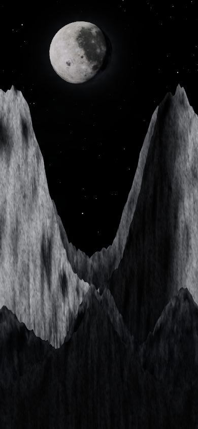
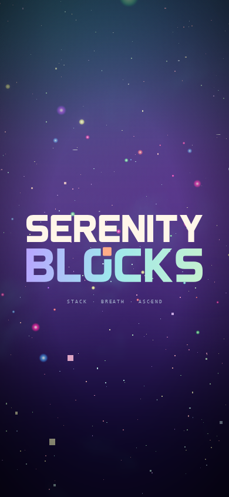

# Mobile Wolfhour and intro compatibility audit

Date: 2026-10-04. Base: `6f79af759994033fbfdc741081ad2fc3a3783b33`.
Status: implemented and locally validated; physical-device acceptance remains open.

## Findings and fixes

1. **Wolfhour selected older artwork on WebGL.** `initRenderer()` discarded Three's
   automatic WebGL2 node backend and constructed a classic `WebGLRenderer` instead.
   `createAmbientScene()` consequently built the older nebula and mountain scene.
   Keep `WebGPURenderer` on both backends, including absent/rejected WebGPU adapters.
   Select material factories, the shared silver sky/alpine landscape, lunar reactions,
   grade and reactive effects by renderer kind (ADR-0019). Compute and MRT remain
   native-WebGPU-only. Existing quality presets and camera composition are retained.

2. **Intro fallback reused a retired canvas.** Timeout already replaced the canvas,
   but a false or rejected GPU initialization did not. Canvas context bindings survive
   disposal. All failed GPU attempts now replace the canvas before classic WebGL startup.
   Disposal of Three's automatic WebGL2 fallback also releases its ownership immediately,
   preventing a second context-loss operation from the outer cleanup.

3. **Startup retried an unavailable GPU transition.** A settled intro renderer promise
   previously permitted the GPU-only boot warp even after intro fallback. Check the
   actual intro GPU device after readiness; without one, use the existing CSS reveal.
   `forceWebGL=1` now applies consistently to the intro as well as themes and boot warp.

No gameplay rules, input timing, piece movement, scoring or stacking code changed.
There is no application service worker/cache layer in this checkout; renderer selection
directly explains why a current deployment can look older on a phone.

## Validation

Browser captures used Chromium 141 with software WebGL2, a 390 × 844 touch/mobile
viewport and a 1440 × 900 landscape viewport. These establish rendering compatibility,
not physical-phone FPS or native WebGPU performance.

| Surface | Scenario | Result |
| --- | --- | --- |
| Isolated playground | Wolfhour, Low, `forceWebGL=1`, `t=8`, portrait | Ready on WebGL2; modern silver valley renders; no console errors |
| Production Wolfhour class | Low, `navigator.gpu` absent, portrait | Modern sky/landscape; 2,000 stars; compute/MRT/post disabled; reactions and rotation render without errors |
| Production Wolfhour class | High, forced WebGL2, landscape then portrait | Shared grade/bloom enabled; lunar/burst/rift/beam/crash effects and resize render without errors |
| Production intro | Forced WebGL, portrait | Active connected canvas; render frames advance; touch dismiss succeeds |
| Production intro | WebGPU exposed but `requestAdapter()` returns null | Fresh animated WebGL canvas; no duplicate context loss; boot decision skips GPU retry; touch dismiss succeeds |
| Full game startup | Touch phone viewport, no WebGPU, forced WebGL | Intro hands off to menu; Serenity starts; modern Wolfhour can be selected |
| Native backend policy | Renderer regression suite | Native desktop retains node materials, compute/MRT capabilities and lifecycle ownership |

Full suite: **480 files, 5,113 tests passed** (`npm test -- --maxWorkers=4`).
Build and boot-closure, typecheck, TS ratchet, lint ratchet, architecture fitness,
theme lifecycle audit, import boundaries, performance-budget gate, release scaffolding,
shipped IP-string scan and Pages artifact checks pass. The lint ratchet remains at the
existing baseline; this is not a claim that the repository has no historical lint debt.

One initial unrelated lava-lake geometry test exceeded its five-second timeout while
multiple software rendering probes ran concurrently. Its isolated rerun and the final
full suite passed.

Expected diagnostics are Three's existing Clock deprecation, explicit native-backend
fallback warnings and software-driver screenshot/readback performance warnings. Final
compatibility captures contain no shader validation or application console errors.

Physical Android/iOS devices and hardware-native WebGPU were unavailable here. Verify
the deployed build on the reported phone, particularly FPS and orientation changes.
Screenshots show the new art at existing quality budgets; lower quality still intentionally
uses less detail and omits bloom.

## Visual evidence

