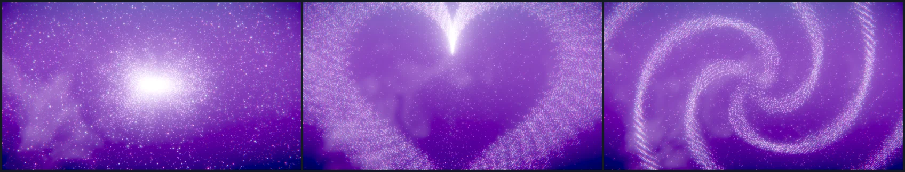
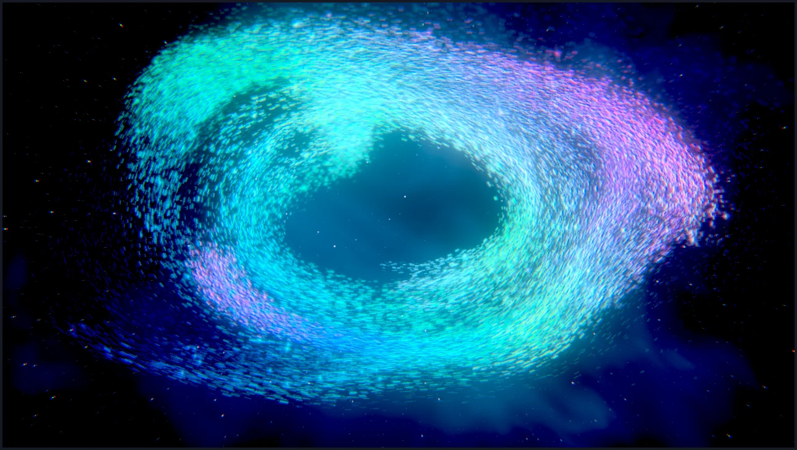
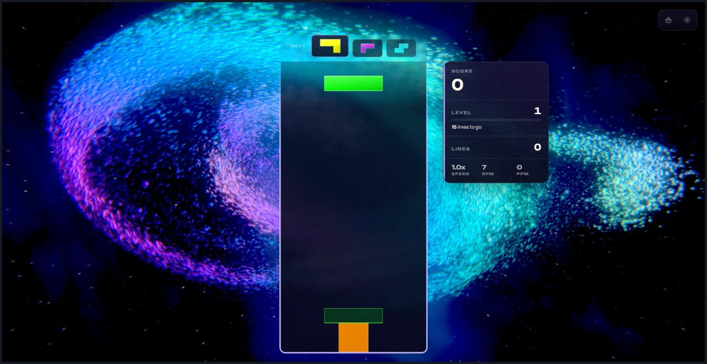
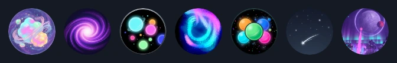
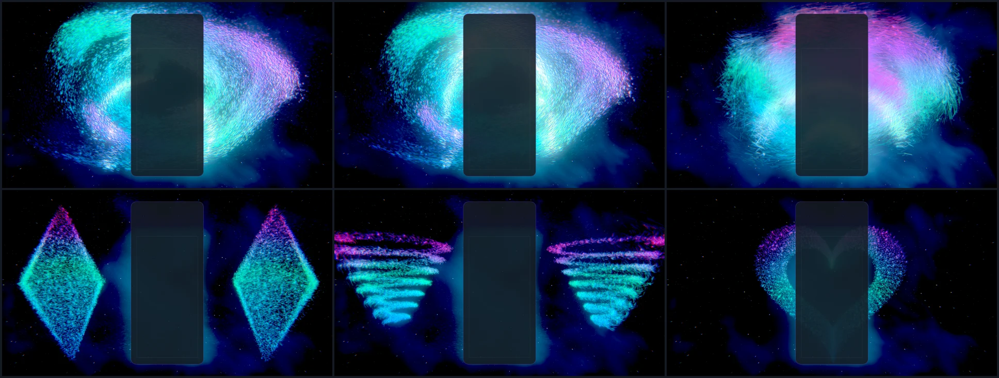
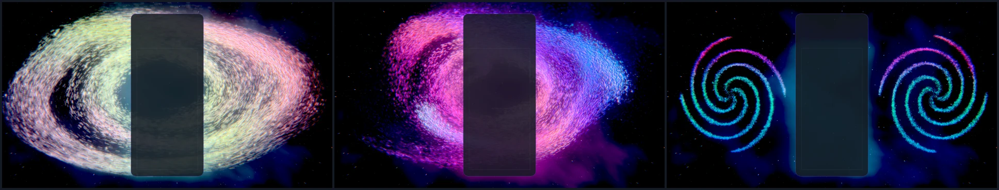
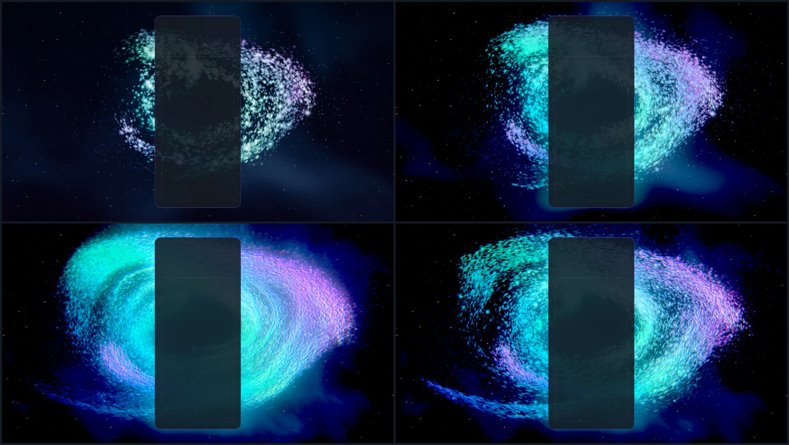
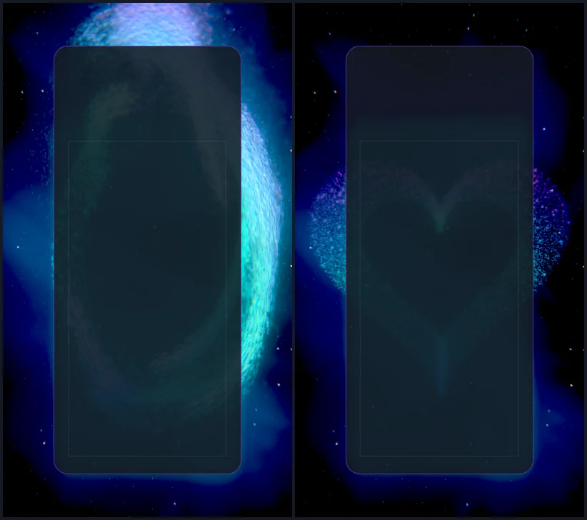
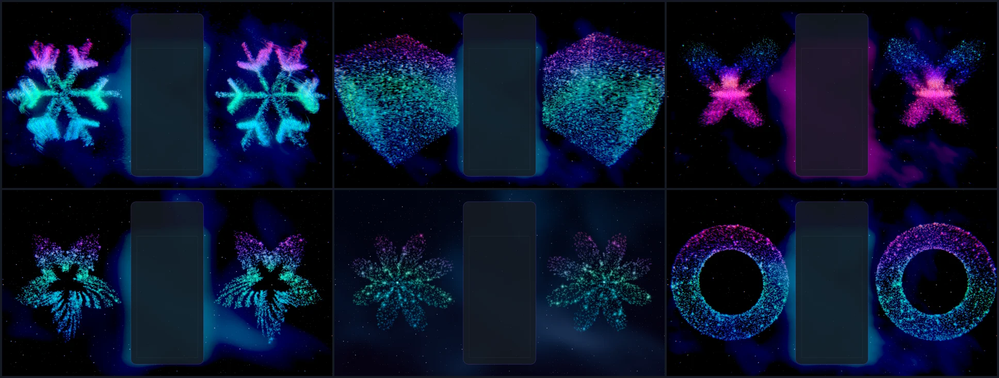
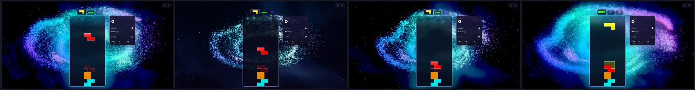

# Murmuration — a swarm of light in the night (formerly Electric Dreams V3)

Implemented 2026-10-08 on `feature/murmuration-masterpiece`, with Three.js 0.186.1. This is
an upgrade in place, not a rebuild: the theme keeps what it was — a swarm of luminous motes in
a nebula that reacts to play and gathers into figures — and its orchestrator, camera director,
post stack and library of 28 formations. What changed is how the swarm moves, how it is drawn,
what it flies in, and what play does to it. The theme was then renamed throughout: its id
(`electric-dreams-v3` became `murmuration`), its folder and files, its song, its icon and its
Odyssey orb. The old id and the old track key still resolve, so a saved selection, an earned
unlock and an Odyssey completion carry over ("The rename", below). This document records the
shipped design and what was verified. It is a reference, not a backlog.

## What was wrong

Captures of the theme as it stood on `main` (182ebd19), High, WebGPU:

- The motes were reborn at one point in the middle of the frame, so the centre was a blown
  white blob; each mote had its own random colour, and three random colours average to
  lavender. The sky was a flat bright purple, so nothing could glow against it.
- The "turbulence" was three sine waves indexed by mote number: neighbours moved unrelated to
  each other, so the mass never flowed.
- Formations sat on golden-angle lattices and drew moiré bands; every figure was centred
  behind the board card, which hid its middle.
- Every gameplay force started from the centre of the screen, whatever happened on the board.
  The heart at game over was subscribed to `EVENTS.GAME_OVER`, a key that does not exist, so
  it never played. Combo reactions read the COMBO event's cascade depth, which is rarely
  above one in ordinary play.
- The filmic curve ran per channel and bleached any bright saturated light to white. The mote
  material's light was added twice (diffuse and emissive).

## The picture

Night, a few stars, a dim nebula. A ring of light turns slowly round the place where the board
stands: tens of thousands of motes, each a short streak in the direction it is moving, in bands
of mint, cyan, violet and rose. The ring is not even. It is made of ribbons that leave a few
slowly wandering sources, wind round the gyre and fade into the dark, with dust between them;
it leans out of the screen plane, so one wing swims toward the lens and softens. Over a minute
it changes shape and over several minutes it changes colour.

## The one idea

Every mote reads the same velocity field and is carried by it. Nothing looks at its
neighbours, and that is what makes forty thousand of them move like one body.

The field (`sim/flow-field.js`, `sim/fluid-particles.js`) is:

- **A gyre** — differential rotation about the view axis, faster toward the centre, an ellipse
  fitted to the frame.
- **Soft walls** that keep the swarm an annulus with the board in its hole. Each mote has its
  own idea of where the walls are, so the rim frays instead of drawing an ellipse.
- **Shear waves** — seven transverse plane waves in two octaves (Kraichnan's kinematic
  turbulence). Each octave is divergence-free: it folds the swarm and does not clump it. The
  fine octave is sampled at a point carried by the coarse one, which bends its fronts into
  eddies. Near a wall the wave component that heads out of the annulus is trimmed, so the flow
  slides along the wall instead of piling motes against it.

A mote's velocity relaxes onto the field (1.7 s⁻¹), which is why a push from play decays back
into the flow instead of ringing.

A divergence-free field keeps a uniform cloud uniform, and a uniform cloud is fog. So 78% of
the motes are reborn at one of six sources and live 12–30 seconds, burning brightest as they
leave and cooling all the way down: each source trails a ribbon with a bright head and a tail
that fades out, and the lanes between ribbons stay dark. The rest are reborn anywhere in the
annulus as dim dust. A dying mote has already faded to nothing, so rebirth is never seen.

The same arithmetic runs in a WebGPU compute pass and, for the WebGL2 backend, in
`stepCPU()`. The CPU step costs less than the one it replaces (figures under Verification): it
prepares the waves once per step, reads a cosine table, and avoids `Math.hypot`.

## Drawing a mote

`rendering/fluid-particles-renderer.js`. One camera-facing quad per mote, additive, read
straight from the simulation's buffers.

- **Colour by place.** A mote looks its colour up in a cyclic eight-stop palette by where it
  is (and how old it is along its ribbon), not by which mote it is. Neighbours share a hue, so
  colour runs through the swarm in bands. A third of the cycle spans the frame, so the swarm
  is never a rainbow; the phase drifts with time and steps on by 0.17 with each level.
- **Streak.** The quad stretches along the mote's screen-space velocity and gives most of the
  extra area back in brightness.
- **Focus.** A thin-lens blur circle from the distance to the focal plane; a defocused mote
  becomes a soft disc dimmed by its area. Kept small: a hard-rimmed disc repeated tens of
  thousands of times reads as scales.
- **Pixel floor.** A mote smaller than about a pixel keeps its energy at one pixel instead of
  shimmering.
- **Heroes.** About one mote in 150 is larger and carries a four-point glint.
- **Total light is a budget.** `swarmLook()` fixes count × area × exposure per tier. The first
  native capture, at 110,000 motes with exposure set per mote, was a glowing slab.

The post stack (`post/render-pipeline.js`) applies the filmic curve to the brightest channel
and carries the other two by ratio, so a hue keeps its hue up the shoulder and only light
several stops over white burns out. Bloom is selective (emissive target) on WebGPU; without
MRT its threshold is lifted clear of the sky. Without a post stack (Minimal) the renderer
tone-maps instead.

## The sky

`rendering/nebula-volume.js`. Dark on purpose: the swarm is the light source. A deep indigo
ground; emission nebula from domain-warped value-noise FBM, gathered into a diagonal band and
lit in the two hues the swarm is wearing; dust lanes; two layers of stars that shift against
each other as the camera moves. Each FBM octave is turned as well as scaled (octaves that
share the lattice's axes add up to straight-edged shapes), and every noise helper has a layout
so the builder emits real WGSL functions.

## Event language

`composition/play-director.js` stages the bus events of one lock into at most one `lock` and
one `clear` per frame, with the true consecutive-clear combo from `ComboTracker`.
`composition/swarm-show.js` decides what the swarm does. It uses no timers: delayed steps sit
in a queue on the show's own clock, so a capture replays a moment exactly and stopping the
theme leaves nothing scheduled.

| Moment | What the swarm does |
|---|---|
| Lock | A hairline ring of light leaves the piece's place on the board and crosses the swarm in about a second; the lens takes a tap |
| Hard drop | The same, harder and faster; the lens pushes in |
| Clear, 1–3 lines | A tall elliptical ring: its sides leave the board sideways as near-vertical fronts across both wings. Three lines also draw a formation |
| Four lines | Two rings and a swirl, the sky lights, the swarm gathers into a formation for 4.5 s |
| T-spin | Two counter-turning eddies at the piece, and a knot (trefoil, infinity, Möbius or vortex) |
| Perfect clear | The swarm is drawn in to a point for 0.4 s, then blooms into a lotus, sunflower or snowflake |
| Combo | Each step shoves the gyre; the swarm speeds up and turns toward gold with the chain's length. Four in a row draws a formation, seven a stronger one |
| Level up | The palette steps on; a slow wide ring |
| Game over | One heart, centred, held until the next run starts |

A ring is drawn in the simulation: a wave impulse has a radius that grows each step, and a mote
it crosses is pushed and lit. Two things make it read as a ring. Depth counts for 0.3 in a
wave's distance, because the swarm is a thick tilted disc and a spherical shell would cross it
at a different screen radius for every depth. And the light is 0.16–0.4 units wide and gone in
two frames: the swarm is only nine units tall, and a ring a unit wide lights a fifth of it at
once and reads as nothing in particular.

**Formations.** On a frame with room either side of the boards, a figure is drawn as a
mirrored pair flanking them (a figure centred behind the card is half hidden by it). On a
phone, or with boards across the frame, one centred figure. The heart is always one. Solids
turn about their vertical axis; flat figures sway. Targets are fitted to the frame and each is
scattered by 0.14 units, which turns the lattice moiré into grain. A figure's hue runs up it
and out from its middle, measured in the figure's own half-size: every figure is the same
smooth gradient whatever size the frame fits it to, a mirrored pair is coloured alike, and a
combo's gold does not wash it out. The dust keeps flowing behind a figure drawn for a play. A
formation of lesser priority never interrupts a greater one mid-hold, and nothing re-rolls a
figure that is still arriving.

Settings: `backgroundComboEffects` off drops the reactions (the palette still follows the
level); `pieceLockRipple` off drops the lock rings; reduced motion keeps the swarm and stills
the lens.

A quality tier changed while the theme runs is applied at the next frame: the sky, the swarm,
the post stack and the show are rebuilt on the renderer and canvas already in use, and the
level's palette and a held heart carry over. A render-scale change, including the game's
adaptive downscale, re-reads the pixel ratio the same way. Until now the theme read its tier
and pixel ratio once, when it started, and kept them until it was restarted.

## Tiers

| Tier | Motes, WebGL2 (CPU) | Motes, WebGPU | Post | Bloom | Sky |
|---|---|---|---|---|---|
| Minimal | 5,000 | 9,000 | none (renderer tone-map) | – | 3 octaves |
| Low | 12,000 | 20,000 | on | whole frame, threshold 0.55 | 3 octaves |
| Medium | 25,000 | 36,000 | on | selective on WebGPU | 5 octaves |
| High | 45,000 | 60,000 | on | selective on WebGPU | 5 octaves |
| Ultra | 65,000 | 90,000 | on | selective on WebGPU | 5 octaves |
| Extreme | 90,000 | 130,000 | on | selective on WebGPU | 5 octaves |

More motes are smaller motes (size ∝ count^−0.36, between 0.5 and 1.5) at the same total
light. On a frame narrower than the authored swarm (a phone) the swarm becomes a tall loop,
and exposure and size fall with how much it is crowded.

## Name and icon

The theme is **Murmuration**: the word for a flock that moves as one body and draws shapes in
the sky, which is what the theme is. "Electric Dreams V3" named a version of the code; the new
name says what the player sees.

### The rename

The name changed everywhere the theme is referred to, not only where a player reads it:

| What | Was | Is |
|---|---|---|
| Theme id and container | `electric-dreams-v3`, `#electric-dreams-v3-theme` | `murmuration`, `#murmuration-theme` |
| Folder, module, class | `src/themes/electric-dreams-v3/electric-dreams-v3-theme.js`, `ElectricDreamsV3Theme` | `src/themes/murmuration/murmuration-theme.js`, `MurmurationTheme` |
| Post stack | `V3PostPipeline`, `getV3PostProfile`, `V3_POST_PROFILES` | `SwarmPostPipeline`, `getSwarmPostProfile`, `SWARM_POST_PROFILES` |
| Icon (both copies) | `electric-dreams-theme-icon.png` | `murmuration-theme-icon.png` |
| Song | "Electric Dreams", `electric-dreams.mp3`, track key `ElectricDreams` | "Murmuration", `murmuration.mp3`, `Murmuration` |
| Odyssey orb 54 | "Electric Dreams": "The dream slows for one deep breath. …" | "Murmuration": "A flock of light wheels around the board and the pace slows for one deep breath. …" |
| Playground effect | `electric-dreams-fluid` | `murmuration` |
| Console helper | `window.electricDreamsV3` | `window.murmuration` |
| Tests | `tests/unit/electric-dreams-*.test.js` | `tests/unit/murmuration-*.test.js` |

The song file's embedded title was rewritten too (the ID3 title frame; the audio bytes are
byte-for-byte the same, and the frame that records where the recording came from is
untouched). `public/assets/music/songs.json` was regenerated with `generate-songs.js`.

What a player already has still means this theme:

- `RETIRED_THEME_IDS` in `src/themes/theme-registry.js` maps `electric-dreams-v3` to
  `murmuration`, as it already does for two earlier renames. Everything that reads a saved
  theme id goes through `resolveThemeId`: the saved background theme (healed and written back
  when settings load), the collection's grants and seen marks, Odyssey completions, the theme
  manager's switch, the music catalog.
- `RETIRED_TRACK_KEYS` in `src/core/progression/theme-music-catalog.js` maps `ElectricDreams`
  to `Murmuration` (a track key comes from its song's title, so a retitled song gets a new
  one). `resolveMusicTrackKey` is applied where a saved key enters: when settings load (healed
  and written back), in the owned-music preference that cloud merges use, and in
  `SoundManager.setTrack`.
- The frozen `V2_LEVEL_THEME_IDS` table in `src/core/odyssey/odyssey-progress-schema.js`
  keeps `electric-dreams-v3`. It stamps very old saves with the id of their time, and the
  collection resolves it like any other saved id.

One change is behaviour, not a name. `OdysseyMode` lists the themes that get a longer loading
budget when an orb opens, and that list named `electric-dreams`, an id retired long before
this work, so the orb never got the budget meant for it. It now names `murmuration`: up to
0.9 s more blackout hold on the way in and 0.8 s on the way back, used only if the theme is
slow to be ready.

Left as written, on purpose: dated records. The audits, plans, sweeps, logs and evidence
captures under `docs/`, everything in `docs/archive/` and `reports/`, and the recorded fleet
run in `docs/theme-screenshots/results/electric-dreams-v3.json` describe the theme as it was
on their date under the name it had then; two of them also name the original
`electric-dreams` theme, deleted long ago, which is a different thing. `CREDITS.md` lists the
song under its new title with the old one beside it.

The icon is a frame of the swarm itself through the playground's icon lens. In a square frame
the swarm fits itself to a near-round ring, so the whole figure is in the circle:

`/playground.html?effect=murmuration&quality=Ultra&hud=0&t=40&icon=1&tune=span:0.62`

captured in a 720 × 720 window on WebGPU (`span` widens the palette across the frame, so the
icon carries both the cyan and the rose), given a colour lift (saturation 1.22, contrast 1.14,
brightness 1.08) and baked as a 512 px circle on a transparent ground. The same file is kept
at `public/assets/themes/murmuration-theme-icon.png`. It was chosen from fourteen framings;
at the picker's 80 px, beside its neighbours (fourth from the left; the old icon is third):

## What changed outside the theme folder

- `src/themes/theme-registry.js`: the entry (id, name, module, icon) and the retired id.
  `src/ui/serenity-hub/ThemesTab.js`: the fallback glyph key follows the name (the old key,
  "Electric Dreams", never matched the old name).
- The rename's other edits: the music catalog and its retired track key, the settings loader,
  the owned-music preference and `SoundManager.setTrack`; the Odyssey orb's name and
  description, the chapter's theme list, the accent-colour table and the heavy-theme list;
  `index.html`'s container; `scripts/lib/mobile-webgl2-validation.mjs`; and the comments in
  other themes that say which of this theme's files they were forked from.
- `src/playground/effects/murmuration.effect.js`: the effect now mounts the theme's
  own camera, show and tiers, replays the simulation in fixed steps for `?t=` captures, and
  takes `board`, `event`, `eventAge`, `combo`, `level`, `shape`, `strength`, `twin`, `demo`,
  `icon` and `tune`. `src/ui/url-parameters/playground-parameters.js` lists them.
- `sim/fluid-emitters.js` is gone (the show replaces it). `tests/unit/event-contract.test.js`
  lost its three rows for this theme: the dead `EVENTS.GAME_OVER` / `EVENTS.GAME_START`
  references are replaced by the window's `gameOver` and `startGameWithMode` events.
- `materials/tsl-noise-lib.js` is gone too: nothing in the theme reads it any more (the sky has
  its own laid-out helpers). The Starlight, Himalayan Peak and intro copies are separate files;
  their headers still name this one as their origin.
- The TSL skill's gotcha table (both copies) gained three rows: the doubled light of a
  diffuse-plus-emissive emitter, the total-light budget, and making a wave read as a ring.
- Tests: see below.

## Verification

The upgrade was verified on `main` at c8b98ec5, before the rename, under the theme's old id;
that is what the bullets below record, with the file names and counts of that moment. The
rename was then made on `main` at b1fff5f6 and verified again from the top: see "After the
rename" at the end of this section. For the merge the branch was brought onto `main` at
dcbf841b (two more theme rebuilds; six shared files re-applied on top of them).

- Unit tests: seven new files (the show 31, the play director 22, the swarm on the CPU 27,
  layout and tiers 22, the flow field 11, the theme's events and lifecycle 19, a tier or
  render scale changed while running 5) and three updated ones
  (`theme-async-resource-retirement` rewritten for the show's queue, the renderer test for the
  native counts, the event-contract allowlist shrunk by this theme's three rows). The 14 files
  that test this theme hold 199 tests. With every other test file that reads the theme
  registry, the theme icons, the playground or URL parameter catalogs or the portable-renderer
  lists, that is 44 files and 860 tests, all passing.
- Whole suite, run while other sessions loaded the machine: 710 files and 9,813 tests; 705
  files passed. Four of the five that did not fail only under that load and pass when run on
  their own: an Odyssey bake test with a 300 ms budget and three tests that read the source
  tree (among them the URL parameter catalog test, which also passes in the 44-file run
  above). The fifth, one test in `odyssey-level-briefing.test.js`, expects `250,000` and gets
  `250 000` on this Swedish-locale laptop, and fails the same way on the untouched main
  checkout.
- Gates: typecheck; lint ratchet (780 errors against a baseline of 807; the theme's folder,
  its playground effect and its tests lint clean, and the baseline is left as it is); theme
  lifecycle audit; dependency boundaries (1,332 modules); production build with the
  boot-closure guard; IP-string gate; Pages artifact check; release gates — all pass.
- Shader generation without a device: before the first GPU slot, the compute pass, the mote
  material and the sky were built to WGSL in Node through the backend's node builder, with no
  TSL warnings. Reading that output is what showed the mote's light being added twice.
- Playground captures on WebGPU (RTX 3070 Laptop): seven batches, 97 frames in all, none with
  a console warning or error. The last batch is 14 frames, taken after the last change to a
  shader: four lines at 0.45 s and at 3 s; a T-spin's knot; game over, in a wide frame and in
  a 405 × 720 one; a held galaxy in both; a cube held through a chain of five; a perfect
  clear's snowflake; a butterfly at level 4; rest; formations at Minimal and at Low; and a
  torus at Medium on the forced WebGL2 backend. The frames with no formation in them (a hard
  drop, a two-line clear, a chain of six, level 4, the tiers at rest, the icon framings) are
  from the fourth batch; the shader changes after it alter only how a held formation is
  coloured and lit. Earlier batches also covered a soft lock and a level-up.
- WebGL2 on a CPU rasteriser (SwiftShader, no GPU): the playground at rest, with the board,
  and through each event; and the real game at Low, where a `gameOver` raised the heart and
  held it, and where the tier was changed from Low to Minimal and back and the adaptive
  downscale took the pixel ratio from 0.9 to 0.68. This was the first place the theme's
  shaders ran, and each later change was tried here before it took a GPU slot. It runs at
  about 2 fps, so it is a check of function, not of feel.
- In the real game on the GPU (Electron, dev server, single player, High), five runs, the
  last with the code as it stands: the theme starts on WebGPU with 60,000 motes in the compute
  pass and selective bloom, fits the swarm's hole and the twin layout to the live board, takes
  bus-injected hard drops, locks, clears, a chain of four and four lines, and lets go of its
  canvas when another theme takes over. In the last run the tier was changed five times while
  it ran (Medium 36,000 motes, Minimal 9,000 and no post stack, Low 20,000 without the
  selective bloom, Extreme 130,000, back to High), each on the same canvas, and an adaptive
  downscale took the pixel ratio from 1 to 0.75. No console warnings or errors beyond the
  game's own line announcing that downscale. A synthetic `gameOver` raised the heart; in one
  run it was still held when the run ended, in the others the still-running game's next lock
  had released it, as designed.
- Faults the checks caught: a helper agent writing the tests found that the lock which
  releases the game-over heart reset the play director from inside its own flush (dropping a
  clear staged with that lock), that a T-spin triple never drew its knot, that a refused
  formation request still used up the "not twice running" roll, that a level-up's wave ignored
  the reactions setting, and that tier names matched prototype keys. All are fixed and
  covered. The first native capture showed the swarm as a slab of light (exposure was set per
  mote, so five times the motes was five times the light) and the generated WGSL showed the
  mote material adding its light twice; both are fixed as described above. Captures of a
  formation held through a combo showed it washed pale, and of any formation a speckle of
  every hue: a formation is now coloured by place in the figure. And checking this record's
  own claim that the theme "survives a live quality change" showed that it survived by
  ignoring the change (as the old theme did); it now applies it.

**After the rename** (on `main` at b1fff5f6, the code as it stands):

- Unit tests: the theme's files are now `tests/unit/murmuration-*.test.js`, with one more,
  `murmuration-rename-migration.test.js` (7 tests): the registry publishes one id and resolves
  the old one; the song is retitled and the old track key still selects it; a saved background
  theme and a saved track are healed on load and written back; an owned track stays owned
  through a cloud copy that names the old key; a collection grant and a seen mark move to the
  new id; an Odyssey completion recorded under the old id, or stamped from the frozen table,
  still counts; the orb carries the new name and no level names the old one. The 17 files that
  test this theme, its song and its events hold 220 tests, all passing.
- Whole suite, three runs: 742 files, 11,633 tests. In the run with the machine to itself, 741
  files passed and the one failure was the Swedish-locale number test described above. The two
  runs made beside other work also failed five and ten timing-sensitive tests in files this
  change does not touch (Odyssey bakes with time budgets, a bot-timing suite, two theme
  suites); all of those pass when run on their own.
- Gates: typecheck; lint ratchet (710 errors against a baseline of 807; every file this change
  touches lints clean except `scripts/lib/mobile-webgl2-validation.mjs`, whose six errors are
  not on the line changed there); theme lifecycle audit; dependency boundaries (1,406
  modules); production build with the boot-closure guard; IP-string gate; Pages artifact
  check; release gates — all pass. The built game contains `theme-murmuration-*.js`,
  `murmuration-theme-icon-*.png` and `murmuration.mp3`, and the old names only where they are
  meant to be: `electric-dreams-v3` twice (the retired id and the frozen save table) and
  `ElectricDreams` once (the retired track key).
- The song file: the title frame reads "Murmuration"; the SHA-1 of the audio after the tag is
  the same before and after, and so is the file's length.
- The playground effect under its new id: on WebGPU, rest, four lines at 3 s and game over; on
  the forced WebGL2 backend, a held torus; first on the software rasteriser. No console
  warnings or errors.
- The real game on the GPU under the new id: the event script, two live tier changes and the
  adaptive downscale, as before, with the same result.
- An old save in the real game, on the software rasteriser and on the GPU: settings stored
  with `backgroundTheme: 'electric-dreams-v3'` and `musicTrack: 'ElectricDreams'`, and a
  collection that earned the theme under its old id, then a normal start with nothing
  unlocked by parameter. The settings come up as `murmuration` and `Murmuration` and are
  written back that way; the theme is owned under either id while a theme the save never
  earned is not; selecting the background by its old id starts `MurmurationTheme` in
  `#murmuration-theme` (60,000 motes, compute, on the GPU); and the track playing is
  `/assets/music/murmuration.mp3`. No console warnings or errors. (The first software run
  failed for an unrelated reason: the dev server's module cache was cold and the theme's
  import ran past the theme manager's 20 s limit. It passed on the next run.)

Not checked after the rename: the Odyssey orb played in the campaign (its name, description
and theme id are covered by tests; the longer loading budget it now gets is read from the
code, not timed); a Steam cloud merge with a real cloud copy; an installed build updating
over an older one.

Observed, not measured (other sessions held the machine's CPU and GPU throughout): the whole
game at 1584 × 813 on the RTX 3070 ran at about 129 fps on a 120 Hz display at High (frame
interval p50 7.6 ms, p99 at most 15.9 ms through the event script, two runs). The playground's
GPU timer, which covers only some passes and is a floor at best, read 1.6 ms (p95 2.8) at High
and 2.3 ms (p95 4.1) at Extreme at 1280 × 720, with the compute pass under 0.1 ms. The CPU
step, two runs each on the same loaded laptop: 12,000 motes 1.5–1.7 ms (2.6–3.5 ms before);
45,000 motes 5.3–9.5 ms (9.2–12.1 ms before).

Not verified: GPU cost per tier through the theme perf lane (ADR-0016); the integrated GPU;
physical phones; a real top-out (every game over here was a synthetic `gameOver` event in a
game that kept running); local multiplayer,
online and Infinity layouts in a capture (the routing by player and the board span are
unit-tested only); the Odyssey level that uses this theme; reduced motion in a capture;
sessions of several hours; a tier change in the middle of a combo or with a formation held
(the swarm starts again from its opening composition; only the level's palette and a held
heart are carried over). `docs/theme-screenshots/` still shows the previous artwork (a fleet
capture writes it).

A limit the captures show: in a phone-shaped frame the board covers most of the frame, so a
centred formation, the game-over heart included, is mostly behind it and only its edges are
seen. Nothing was done about that here.

## Reproduce

Run `npm run dev:playground`, then:

`/playground.html?effect=murmuration&t=40&quality=High&board=1`

Add `event=lock|drop|clear|quad|tspin|perfect|levelUp|gameOver` with `eventAge=<s>` (and
`lines=<n>`, `row=<r>`, `u=<0..1>`), `combo=<n>`, `level=<n>`, `shape=<name>` (with
`strength=`, and `twin=0` for one centred figure). `demo=1` (without `t`) plays a looping
script. `noPost=1` shows the raw scene; `forceWebGL=1` uses the WebGL2 backend;
`tune=key:value,...` overrides look constants for an A/B capture (the keys are listed in the
effect's header). With `t=` the simulation is replayed from its first frame in fixed steps
(30 s by default; `tune=lead:<s>` changes it), so a URL is the same picture every time.

In the game the console helper is `window.murmuration`: `shape(name, strength)`,
`roll()`, `release()`, `list()`, `state()`.

## Captured previews

