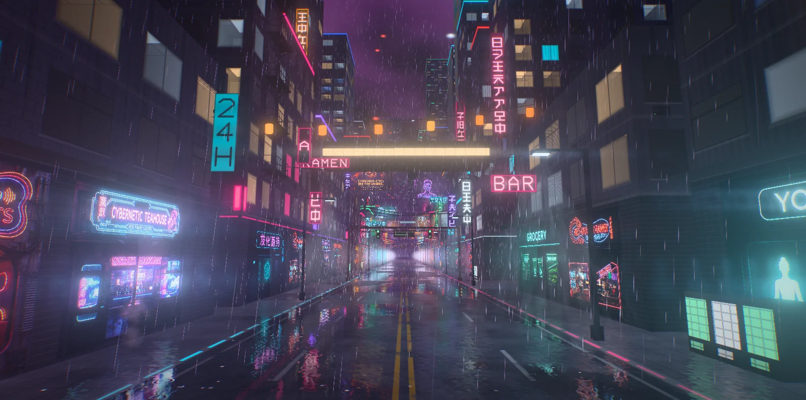
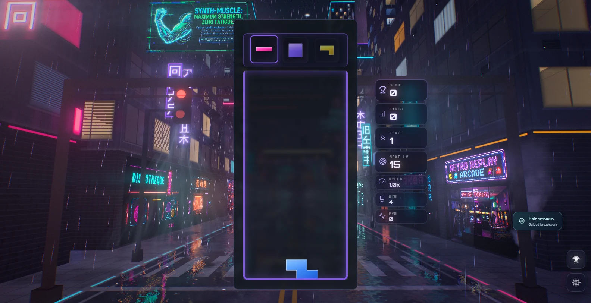
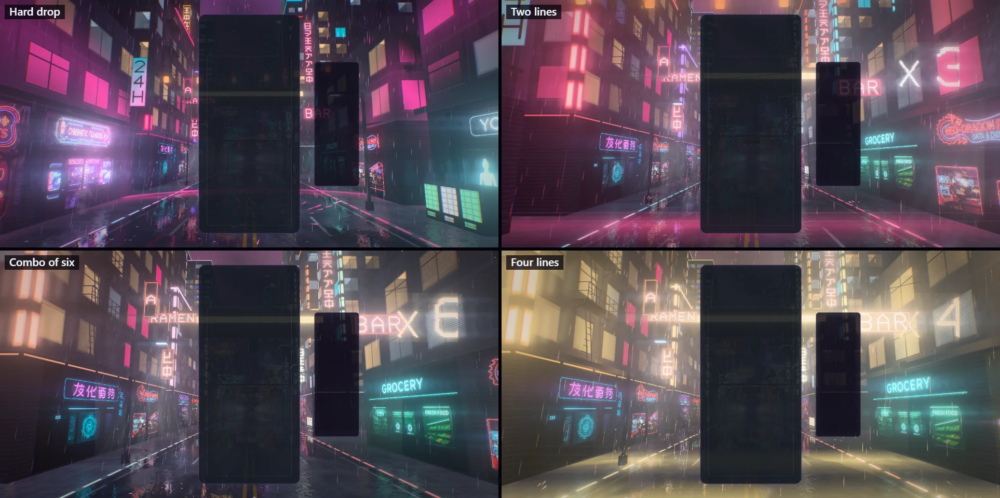
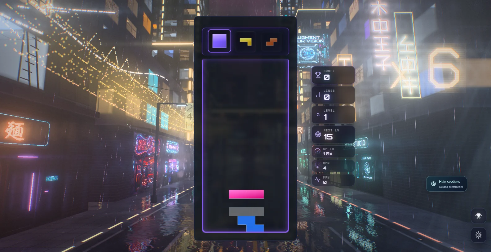
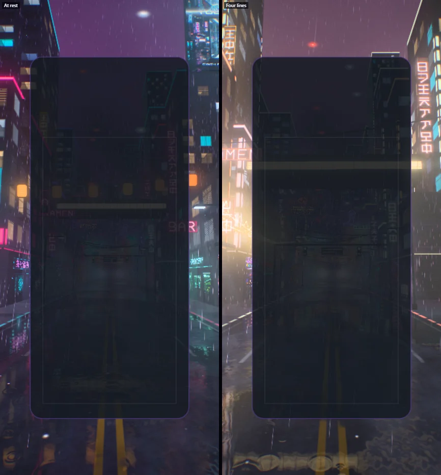

# Neon District — the rain canyon

Implemented 2026-10-05 on `feature/neon-district-masterpiece`, with Three.js 0.186.1. A
from-scratch rebuild: it replaces the earlier theme in full (the 9,600-line theme class, the
SynthCity materials and LOD chain, the pooled event effects, the post stack, the validation
script and the tests). The district keeps its identity — the rain, the wet street, the painted
shopfronts and billboards — and everything else is new. This document records the shipped
design and what was verified. It is a reference, not a backlog.

## The picture

A street canyon in the rain, seen from its centre line a little above head height, looking up
it. The city flows past for ever: painted shopfronts at the foot of the walls, blades of tube
neon over the pavement, a room behind every lit window, lanterns and cables across the road,
skybridges and signal gantries overhead, megatowers standing in the smog beyond the roofs. The
whole city stands upside down in the wet road.

The gameplay card covers the canyon's vanishing point, so the picture is built for what stays
visible: the walls sliding past on both sides, the street below, and whatever bursts out from
behind the card.

## The one idea

The district is a circuit and the board is its power source. Everything a player does on the
board is answered by light that starts at the board and travels through the street.

## Event language

| Event | Response |
| --- | --- |
| Piece lock | The piece lands in the street under the foot of the board, at its own column. A ring runs out through the puddles in the piece's colour and bends the reflections as it passes; a shell of light climbs the walls and switches dark windows on for a moment; the rain inside the shell lights up, so the shell reads as a dome; sparks skid out across the road and a comet runs down the kerb strips. |
| Hard drop | The same, harder: a wider ring, more sparks, a camera dip. |
| Line clear | The cleared rows fire out of the card as beams at their own heights. Then a wave bursts out of the vanishing point and rushes up the street at the viewer, one front per line: each sign flares as a front reaches it, the windows it passes stay lit, the kerb strips light, sparks kick off both kerbs, and the canyon's rays flood as it arrives. One line answers in the district's first accent, two in the second, three in both at once. |
| Combo | The district charges. More windows are lit, the trim on the towers climbs like level meters, the kerb strips chase faster, the city flows past faster, flying traffic speeds up and the palette warms from the level's accents to gold. A hologram beside the board counts the chain ("×3"), punched larger with each step. When the chain breaks the district browns out and drains. |
| Four lines / perfect clear | Blackout: every light in the district drops to a ghost for a fifth of a second, signs tearing. Then the wave comes back gold with four fronts, sheet lightning runs through the smog, and a drone-show dragon swims out of the haze, down the left wall beside the card and up over the camera. The district stays in overdrive while the dragon is in the street. |
| T-spin | The signs and screens glitch. |
| Level up | The district changes colours: five palettes, cycled (signal, harbour, arcade, lantern, ultraviolet). |

Combo here is the true consecutive-clear combo (one `ComboTracker` per player in
`NeonDistrictDirector`); the bus's `COMBO` event is cascade depth (ADR-0011). With several
boards on screen each lock lands under its own board, and the district charges to the longest
chain any board is holding.

## How it is built

| File | Role |
| --- | --- |
| `neon-district-core.js` | Three-free constants and maths shared by the plan, the choreography and the shaders: the street's dimensions, the scroll wrap, the lock shell and clear wave timings. |
| `neon-district-layout.js` | The city plan for one 320 m period, seeded and deterministic: blocks, towers, shopfronts, signs and what they spell, screens, hardware, cables, lamps, megatowers, and the glow map. |
| `neon-district-glyphs.js` | The sign-maker's alphabet: stroke lists for digits, Latin capitals and 28 characters of the district's own script, baked to a distance-field atlas. |
| `neon-district-atlas.js` | Generated cell table for the shopfront and billboard atlases. |
| `neon-district-tsl.js` | Hashes, the baked noise texture, the shared uniforms, the district's light (glow map, haze, lock shells, clear waves). |
| `neon-district-facades.js` | Every building: one instanced box each, the facade drawn in the fragment shader with interior-mapped rooms. |
| `neon-district-street.js` | The wet street: asphalt, paint, puddles, the planar mirror, rain rings, lock rings, kerb strips. |
| `neon-district-signs.js` | Shopfronts, tube signs, billboard screens. |
| `neon-district-kit.js` | The street's hardware: awnings, vending machines, fire escapes, pipes, skybridges, gantries, tanks, masts, condensers, scaffolds. |
| `neon-district-lights.js` | Halos, street lamps and their cones, cables and lanterns, beacons, flying traffic. |
| `neon-district-weather.js` | Rain and steam. |
| `neon-district-sky.js` | The smog ceiling, the veiled moon, sheet lightning. |
| `neon-district-fx.js` | Sparks, row beams, the combo hologram, the dragon. |
| `neon-district-world.js` | Owns the uniforms, the parts, the camera rig and the choreography. Shared with the playground effect, so what is iterated there ships. |
| `neon-district-director.js` | Renderer-free: stages bus events per player and resolves one lock and one clear per frame. |
| `neon-district-composition.js` | Three-free: reads the live card, board and HUD rects and maps board columns and rows onto the screen. |
| `neon-district-post.js` | One scene pass, bloom, and one output pass. |
| `neon-district-theme.js` | Lifecycle, renderer selection, settings, layout watch, GPU-loss recovery, capture flags. |

Techniques worth knowing before changing it:

- **One node renderer on both backends.** `WebGPURenderer` on WebGPU, its WebGL2 backend
  otherwise (or `?forceWebGL`). There is no `ShaderMaterial`, so `neon-district` is off the
  dual-state allowlist. Nothing uses compute.
- **The city scrolls, the camera does not.** Every scrolling object carries a layout depth in
  one period and is drawn at `ndWrapZ(z + scroll)`. Objects leave 24 m behind the camera and
  re-enter inside the far haze, so the seam is never seen. Megatowers do not scroll. Every
  pattern laid along the street repeats in a whole number of periods, so the world drops eight
  periods from the scroll whenever it grows past that and nothing is anchored to it; the scroll
  stays small enough for a 32-bit float however long the session.
- **About thirty draws, and again in the mirror.** Each kind of thing is one instanced draw. A
  building is one instance of a five-quad box: bays, floors, window frames, mullions, sills,
  cladding, air-conditioning units and rain sheen are drawn in the fragment shader from the
  wall's own metres, and fade to their true average where a cell is smaller than a pixel.
- **Interior mapping.** Behind each lit window the view ray is intersected with a room (back
  wall, side walls, floor, ceiling), so rooms slide past in true parallax: furniture, a door or
  a picture on the back wall, a light panel in the ceiling, blinds or a curtain in some.
- **Nothing is lit by a light.** Every material shades itself (`MeshBasicNodeMaterial`). The
  district's light is the glow map (a 160 × 2 texture of what each stretch of each wall's signs
  throw, baked from the plan), the haze, the lamps' analytic pools and the gameplay pulses. That
  keeps the mirror's second render cheap and makes walls, road, rain, steam and hardware agree
  on the colour of every stretch of street.
- **The mirror.** On Medium and up a planar `reflector()` renders the district from the
  mirrored camera at reduced resolution with a mip chain. The street reads it sharp in the
  puddles and, on rough wet asphalt, as a short vertical run of taps at a blurred mip: the long
  streak under every sign. Rain, steam and the row beams live on layer 1, which the mirror's
  camera does not render. Low and Minimal mirror the glow map instead.
- **Closed form first.** Rain, steam, traffic, lock shells, clear waves, sparks, row beams and
  the dragon are functions of the world clock and event timestamps. Nothing is created at event
  time: events write numbers into ring-buffered uniform slots and one preallocated spark pool.
  `seek(t)` plus a fixed-step replay reproduces any frame, and a test proves the same state at
  30 and 240 frames a second.
- **The dragon is drawn with lines of drones**, as a drone show draws: four contours down the
  body, ribs round it, a sawtooth crest, four jaw lines with the lower pair hung open, whiskers,
  horns, a tail fan. Each drone's place is a function of the clock and its seat. It takes the
  lane beside the card when the camera can see that lane, and passes over the card when it
  cannot (a phone held upright).
- **HDR, single output.** The scene is scene-linear; a max-channel knee selects what blooms (no
  MRT), and one output pass does the lens fringe, the calm zones on the card and HUD, bloom,
  anamorphic streaks and canyon rays (the bloom dragged sideways, and radially out of the
  vanishing point), a hue-preserving filmic curve, grade, vignette, grain and dither. An iris
  closes as the district flares so its colours survive the surge. `usesMrtScenePass()` is
  false.
- **No MaterialX noise.** One tileable fBm texture is baked on the CPU with its own mip chain;
  every shared `Fn` carries `setLayout`.

Two shader lessons from this build are in the repo's TSL skill gotcha table: a per-instance
value read in the fragment stage is interpolated, so seeds are integers and are rounded before
they reach a hash; and a `floor()` of an exactly dividing quotient of such values needs a bias.

## Tiers

| Tier | Rooms | Mirror | Rain streaks | Sparks | Dragon drones | Bloom, streaks, rays | Scene MSAA |
| --- | --- | --- | --- | --- | --- | --- | --- |
| Minimal | flat panes | glow map | 1,400 | 96 | none | off | off |
| Low | flat panes | glow map | 2,600 | 160 | 900 | off | off |
| Medium | interior-mapped | 0.36 scale, 3 taps | 5,200 | 320 | 2,600 | on | off |
| High | interior-mapped | 0.5 scale, 3 taps | 9,000 | 512 | 5,200 | on | 4× |
| Ultra | interior-mapped | 0.6 scale, 5 taps | 13,000 | 768 | 8,400 | on | 4× |
| Extreme | interior-mapped | 0.75 scale, 5 taps | 18,000 | 1,024 | 12,000 | on | 4× |

Halos, lamp cones and steam are Medium and up. Low and Minimal load the half-size atlases.

## Assets

The shopfronts and billboards are two WebP atlases under `public/textures/neon-district/`
(about 1 MB each, with half-size copies), baked by `scripts/neon-district/build-atlases.mjs`
from the images in `scripts/neon-district/source-art/`. The bake is deterministic. The atlases
load off the frame: the district stands dark where they go and powers up when they arrive.

Everything else is generated: the facades, the signs' glyphs, the hardware (boxes and
cylinders merged at build time) and the noise. No model is loaded, and Blender was not needed.

The SynthCity texture set, the asphalt textures and the HDR environment the earlier theme read
are no longer used and were removed from `public/` (about 38 MB of the shipped build).

## Verification

- Unit tests: 84 new tests in four files (layout, glyphs and atlases 18; director and
  composition 19; world 29; theme 18). The three test files of the earlier theme were retired
  with it, `portable-theme-renderers.test.js` no longer lists Neon District, and the dual-state
  allowlist lost its entry. Whole suite: 552 files, 6,133 tests. Every Neon District test
  passes. On the build machine, which was busy with other sessions, between three and five
  time-budget tests in unrelated Odyssey and Stellar Drift files failed in the full run (a
  different handful each run); all of them pass when run on their own.
- Gates: lint ratchet (964 errors against a baseline of 1,070: removing the old theme took about
  a hundred with it; the baseline was left as it is), typecheck, production build with the
  boot-closure guard, dependency boundaries, theme lifecycle audit, IP-string gate and the Pages
  artifact check all pass. The palette gate fails on `main` and here for the same unrelated
  reason (Stillwater); Neon District scores 0/7 on it.
- Playground captures on WebGPU (RTX 3070 Laptop): rest, lock, hard drop, clears of one to three
  lines, a held combo, and the four-line blackout, wave and dragon, at High; rest at Minimal,
  Low and Medium; High and Low on the forced WebGL2 backend; a 430 × 932 portrait frame at rest
  and through a four-line clear. No console errors or warnings in any of them.
- In the real game (Electron, dev server, single player): the theme starts on WebGPU, aims its
  events at the live board, takes real hard drops and bus-injected clears, survives a live
  quality change (High to Medium) and lets go of its canvas when another theme takes over.
  Observed frame rate of the whole game at 1584 × 813: about 125 to 130 fps at High on the
  RTX 3070; on the integrated AMD GPU, 61 fps at High, 119 at Medium and 163 at Low (Low renders
  at 0.85 scale). The same harness measured the earlier theme at 42 fps at High on the RTX 3070,
  with its dynamic resolution already down to 1346 × 691.

Not verified: GPU cost per tier through the theme perf lane (the figures above are observed
frame rates, not ADR-0016 measurements, and they moved by tens of fps between runs); physical
phones; Ultra and Extreme in a capture (Ultra ran in game); local multiplayer and Infinity
layouts in a capture (their routing is unit-tested only); reduced motion in a capture; sessions
of several hours (the scroll rebase is unit-tested only).

## Reproduce

Run `npm run dev:playground`, then:

`/playground.html?effect=neon-district&t=30&quality=High&board=1`

Add `event=lock|drop|clear|quad|tspin|perfect|levelUp` with `eventAge=<s>`, and `combo=<n>`,
`level=<n>`, `lines=<n>`, `u=<0..1>`, `color=<hex>`. `demo=1` (without `t`) plays a looping
script. `parts=` draws only the named parts; `falseColor=1` bands the pre-tone-map peak;
`noPost=1` shows the raw scene; `forceWebGL=1` uses the WebGL2 backend. In the game:
`?neonDistrictTime=`, `?neonDistrictFixedDt=`, `?neonDistrictParts=`,
`?neonDistrictFalseColor=1`.

The theme icon is the two-line clear wave through the playground's icon lens
(`/playground.html?effect=neon-district&t=100&quality=High&icon=1&event=clear&lines=2&eventAge=0.8&combo=1`
in a square window), cropped to 74% of the frame around (0.5, 0.56), given a colour lift
(contrast 1.22, saturation 1.55, brightness 1.06) and baked as a 512 px circle. The same file is
kept at `public/assets/themes/neon-district-theme-icon.png`.

## Captured previews

