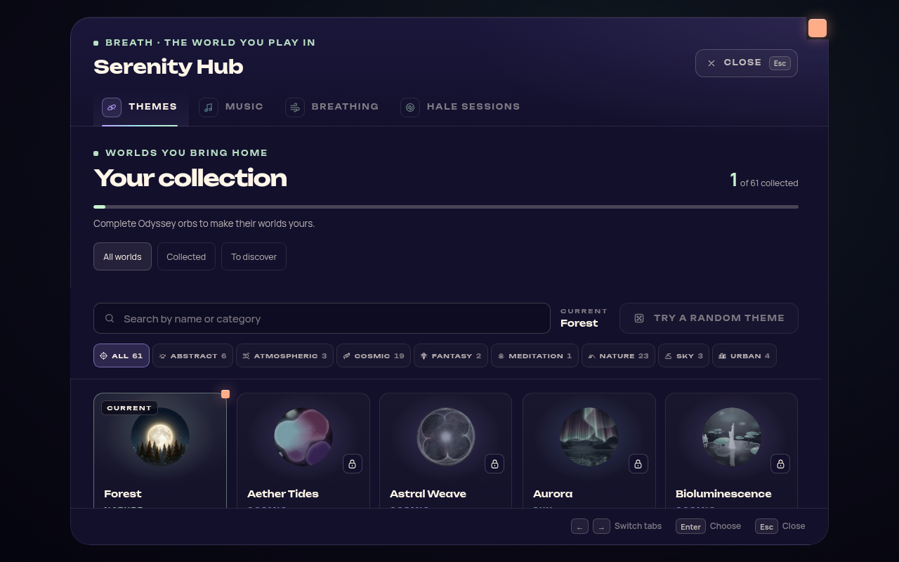
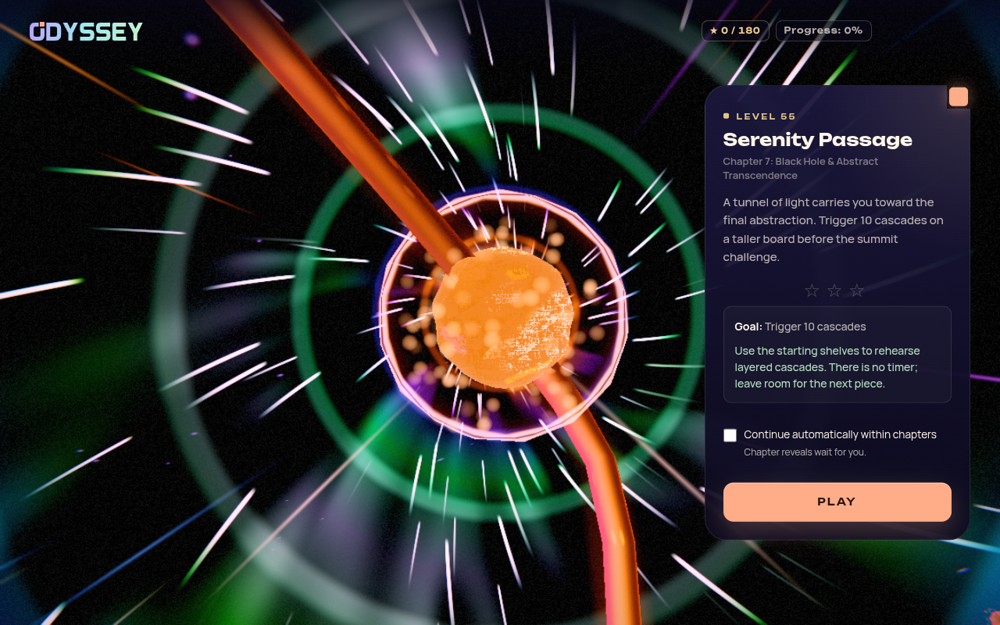
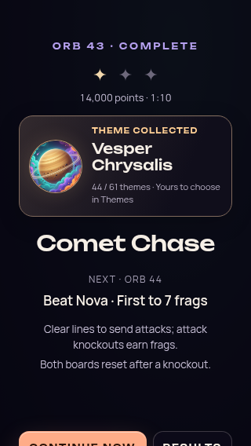
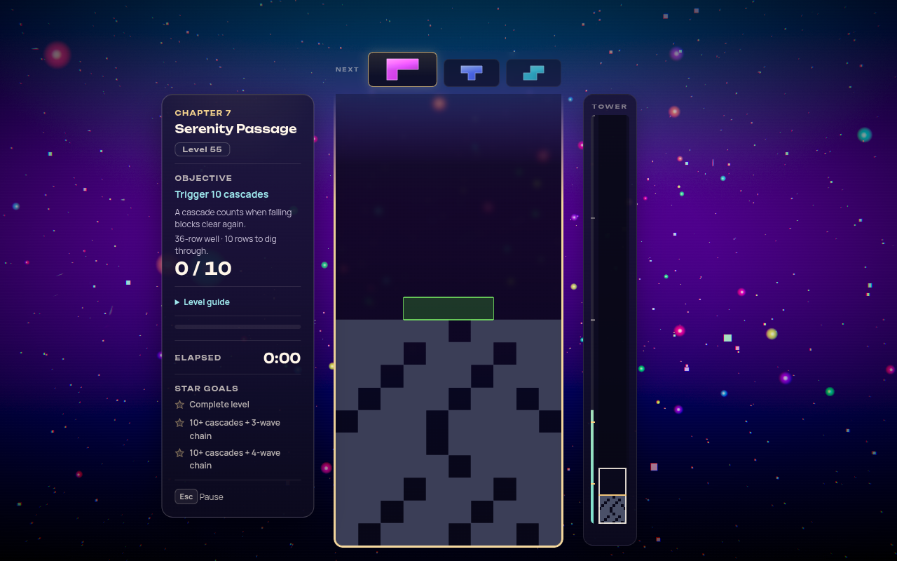

# Odyssey: the 60-orb campaign

Status: **Implemented and verified on the feature branch; native playthrough remains pending.**
Date: 2026-10-08.

The final campaign contains **60 orbs and 60 unique orb themes**. The game catalog contains
**61 themes in total**: Forest is available on installation, and every other theme is earned
by successfully completing its own Odyssey orb. There are **no additional chapter, milestone,
or campaign theme rewards**.

The user explicitly requested retirement of **Bioluminescence II**, retaining the original
**Bioluminescence**. The retired theme and its old aquatic orb leave the playable catalog;
Vesper Chrysalis and Serenity Warp become playable orbs in chapters that suit their scenery.
This supersedes the reward routes and assignment in the
[59-orb chapter-fit audit](ODYSSEY_UNIQUE_THEME_CHAPTER_AUDIT_2026-10.md), which remains the
historical record of that earlier arrangement.

Cinder Drift remains the first orb in **Earth Core & Subterranean Origins**. Neon Dusk remains
in **Urban Dreams Encore**, now at orb 58 after the campaign's renumbering. Both placements
follow the user's explicit chapter requirements.

## Why these changes fit the journey

Removing the former orb 10 avoids placing either new theme inside the water chapter merely
to reuse a vacant slot. The retained original Bioluminescence stays at orb 5, preserving the
opening chapter's cave finale. Chapter 2 becomes five aquatic scenes, still moving from the
ocean to reflective surface water before the wooded lakeshore of chapter 3.

**Vesper Chrysalis is orb 43**, immediately after Shifting Sands and before Stellar Velocity.
The two alien surfaces form a coherent pair: a twin-sun desert followed by a planetary lake
and awakening crystalline relic. Stellar Velocity then resumes travel through space. Live
inspection showed prominent planets in Vesper immediately; the previous interpretation that
its cosmic identity arrived only late in play was inaccurate. Its placement in chapter 6
follows what players actually see.

**Serenity Warp is orb 55**, after Electric Dreams V3 and before Singing Bowl. Its floating
tetromino geometry, luminous particles, and warp imagery fit the abstract chapter. Electric
energy gives way to game-shaped geometry, then Singing Bowl's recursive cubes complete the
chapter before the neon highway begins the encore. Singing Bowl retains the chapter-finale
position and Neon District retains the campaign finale.

The new orbs provide a score release and a cascade rehearsal within the late-game sequence,
with readable goals and enough room to take in their worlds. They should not create a new
difficulty spike simply because two themes have become collectible through play.

| New orb | Authored gameplay | Difficulty intent |
|---|---|---|
| 43 — Celestial Chrysalis | Standard 20-row board; score 43,000; starts at level 5 with normal speed progression; six previews; top-out failure. Higher stars add 430-second and 323-second targets. | Reuses Silent Drift's proven score-release rules. There is no failure countdown; optional faster stars preserve replay challenge. |
| 55 — Serenity Passage | Infinity board with 36 rows and 10 starting rows; trigger 10 cascades; fixed 600 ms drop interval; five previews; top-out failure. Higher stars require cascade depth 3 and 4. | A teach/rehearsal beat before Singing Bowl. No timer; a taller board gives room to practise layered cascades. |

The [campaign-order composer](../src/core/odyssey/data/campaign-order.js) applies the new
public order after the existing authored tuning. All **58 surviving earlier challenges**
retain their gameplay configuration, roles, difficulty metadata, and world positions. The two
insertions use positions between their existing neighbours. This preserves earlier balancing
work while making the new content reviewable; perceived difficulty and pacing still require
a native playthrough.

## Complete assignment

### Chapter 1 — Earth Core & Subterranean Origins, orbs 1–5

Volcanic heat, mineral structures, and enclosed caverns establish the underground origin.
The original Bioluminescence remains the final cave scene.

| Orb | Theme | Scenery fit |
|---|---|---|
| 1 | Cinder Drift (`cinder-drift`) | Magma, rock, smoke, and embers establish the volcanic core. |
| 2 | Crystal Cave (`crystal-cave`) | Rock halls, mineral crystals, and a reflective pool remain subterranean. |
| 3 | Geode (`geode`) | Crystalline mineral geometry continues the journey through the earth. |
| 4 | Pyrestorm (`pyrestorm`) | Fire and molten energy provide an intense volcanic scene. |
| 5 | Bioluminescence (`bioluminescence`) | Glowing mushrooms, crystals, spores, and wet rock bring life to the cave finale. |

### Chapter 2 — Deep Ocean & Liquid Worlds, orbs 6–10

Five distinct aquatic environments lead from ocean depth to the surface. The retired
Bioluminescence II scene has no replacement inside this chapter.

| Orb | Theme | Scenery fit |
|---|---|---|
| 6 | Ocean (`ocean`) | Underwater kelp, coral, fish, and volumetric light establish depth. |
| 7 | Luminous Tides (`luminous-tides`) | Bioluminescent water, plankton, waves, and caustics extend the liquid-world identity. |
| 8 | Koi Pond (`koi-pond`) | A pond sanctuary introduces an intimate aquatic habitat. |
| 9 | Waves (`waves`) | A sculpted, sunlit surf barrel explores water in motion. |
| 10 | Stillwater (`stillwater`) | Reflective black water and surrounding woodland prepare the surface arrival. |

### Chapter 3 — Surface World & Living Landscapes, orbs 11–18

Forests, cultivated plants, seasons, and surface weather lead toward Halcyon's lake and
mountain setting. Halcyon is a fantasy ruin, but its terrestrial scenery supports the ascent.

| Orb | Theme | Scenery fit |
|---|---|---|
| 11 | Misty Lake (`misty-lake`) | A wooded lakeshore connects the water chapter to a living surface landscape. |
| 12 | Moonlit Forest (`moonlit-forest`) | A moonlit glade establishes a forest environment. |
| 13 | Golden Forest (`golden-forest`) | Spruce, pine, and a Nordic lake in golden light continue the woodland setting. |
| 14 | Moonlit Greenhouse (`moonlit-greenhouse`) | Plants, dewdrops, moths, and blooming reactions add cultivated life. |
| 15 | Tornado (`tornado`) | Ground-connected weather sets the surface landscape in motion. |
| 16 | Midsommar (`summer`) | A summer meadow expresses seasonal growth and abundance. |
| 17 | Fall (`fall`) | An autumn grove and living leaves provide seasonal contrast. |
| 18 | Halcyon Apex (`halcyon-apex`) | A lake, islands, temple causeway, and mountain silhouettes lead toward the ascent. |

### Chapter 4 — Mountains & Thin-Air Ascension, orbs 19–26

A garden with an actual mountain backdrop and green foothills lead into ice, high ranges,
and summit light. Sakura's position is based on its scene, not just an orb title.

| Orb | Theme | Scenery fit |
|---|---|---|
| 19 | Sakura Twilight (`sakura-twilight`) | A cherry garden, mirror lake, and mountain backdrop form the foothill threshold. |
| 20 | Verdant Hills (`verdant-hills`) | Rolling grassy hills and trees provide the lower-altitude ascent. |
| 21 | Ice Temple (`ice-temple`) | Ice columns, a frozen lake, polar night, and aurora establish the cold zone. |
| 22 | Wolfhour (`wolfhour`) | Mystical mountain scenery continues the nocturnal highland mood. |
| 23 | Himalayan Peak (`himalayan-peak`) | Himalayan ridges and alpenglow make altitude explicit. |
| 24 | Mountain (`mountain`) | Layered mountain terrain reinforces the chapter's central landform. |
| 25 | Winter (`winter`) | Snow, wind, mountains, and aurora express exposed cold altitude. |
| 26 | Moonrise Summit (`moonrise-summit`) | Alpine ridges, moonrise, and an upward gaze finish the climb toward the sky. |

### Chapter 5 — Sky & Atmospheric Drift, orbs 27–34

Clouds, rain, light, aurora, and atmospheric optics dominate. Starlight is treated as an open
night-sky view; Lunara deliberately crosses toward the next chapter's cosmic language.

| Orb | Theme | Scenery fit |
|---|---|---|
| 27 | Sunset (`sunset`) | Golden-hour light, rays, and the day/night sky begin atmospheric exploration. |
| 28 | Starlight (`starlight`) | Stars, meteors, and celestial light provide an open night-sky view. |
| 29 | Aurora (`aurora`) | Auroral curtains dominate above a reflective lake and snowy peaks. |
| 30 | Nimbus Veil (`nimbus-veil`) | Cloud tops, cumulus, mist, and rays place the player above a cloud sea. |
| 31 | Rainy Window (`rainy-window`) | Rain, storm clouds, and lightning focus on atmospheric weather. |
| 32 | Sky Children (`sky-children`) | Cloud seas, floating islands, and luminous skies fit the airborne setting. |
| 33 | Parhelion (`parhelion`) | A hidden sun, 22-degree halo, and sundogs make atmospheric optics the subject. |
| 34 | Lunara (`lunara`) | Twin moons and aurora above a crystal valley form the sky-to-cosmos threshold. |

### Chapter 6 — Space & Cosmic Expanse, orbs 35–48

Galaxies, stellar events, gravity, alien surfaces, planets, and the final black hole establish
cosmic scale. Vesper and Shifting Sands form a pair of planetary environments before flight
resumes through the stars.

| Orb | Theme | Scenery fit |
|---|---|---|
| 35 | Galaxy (`galaxy`) | Spiral structures, stars, dust, and nebulae establish galactic scale. |
| 36 | Cosmic Noir (`cosmic-noir`) | A dark planet, silver rim light, grayscale stars, and nebulae remain explicitly cosmic. |
| 37 | Supernova (`supernova`) | A stellar core and expanding energy provide a stellar-event scene. |
| 38 | Blood Moon (`blood-moon`) | A crimson eclipsed lunar body, corona, and star fields focus on a celestial object. |
| 39 | Void Ember (`void-ember`) | Stellar plasma and flowing energy belong in space despite the fire vocabulary. |
| 40 | Aether Tides (`aether-tides`) | Nebulae, gravity wells, stardust, and supernova reactions are directly cosmic. |
| 41 | Astral Weave (`astral-weave`) | A luminous loom in a river of nebula adds celestial geometry. |
| 42 | Shifting Sands (`shifting-sands`) | Twin suns, moons, dunes, and an alien creature create a planetary stop. |
| 43 | Vesper Chrysalis (`vesper-chrysalis`) | Prominent planets overlook a mirror lake, mountain basin, and awakening crystalline relic. |
| 44 | Stellar Velocity (`stellar-velocity`) | Warp trails, nebulae, and asteroids resume travel through space. |
| 45 | Stellar Drift (`stellar-drift`) | A large planet, orbital debris, stars, and nebula atmosphere support planetary scale. |
| 46 | Solar Eclipse (`solar-eclipse`) | Sun, moon, corona, flares, and orbital debris create a distinct alignment. |
| 47 | Cosmic Chimes (`cosmic-chimes`) | Ethereal space bells and cosmic particles soften the approach to the singularity. |
| 48 | Black Hole (`black-hole`) | A black-hole shadow, lensed background, and accretion disk mark the threshold beyond space. |

### Chapter 7 — Black Hole & Abstract Transcendence, orbs 49–56

After the literal black hole, geography gives way to fluid forms, colour, geometry, and
energy. Serenity Warp adds game-shaped geometry before Singing Bowl's recursive finale.

| Orb | Theme | Scenery fit |
|---|---|---|
| 49 | Fluid Dreams (`fluid-dreams`) | Iridescent fluid forms in neon haze begin the abstract transformation. |
| 50 | Nebula Flow (`nebula-flow`) | Autonomous coloured fluid fields read as visual abstraction. |
| 51 | Chiral Gold (`chiral-gold`) | Braided gold towers, a transforming ring, and black water form a geometric ritual hall. |
| 52 | Voltage Storm (`voltage-storm`) | Electric fluid, lightning-like energy, and shockwaves continue the nonliteral imagery. |
| 53 | Chromatic Impasto (`chromatic-impasto`) | Thick paint-like flow and expressionist colour move fully into abstraction. |
| 54 | Electric Dreams V3 (`electric-dreams-v3`) | Luminous electric colour and nebular energy sustain the dreamlike setting. |
| 55 | Serenity Warp (`serenity-warp`) | Floating tetromino geometry, luminous particles, and warp imagery turn the game itself into an abstract world. |
| 56 | Singing Bowl (`singing-bowl`) | Recursive, transforming cubes and a reflective ground complete the geometric chapter. |

### Chapter 8 — Urban Dreams Encore, orbs 57–60

The neon highway introduces the retrofuture encore. Outrun imagery then approaches the actual
city, ending in Neon District's rain canyon.

| Orb | Theme | Scenery fit |
|---|---|---|
| 57 | Chromadelic Highway (`chromadelic-highway`) | A prism-glass neon highway carries the player from abstraction into the encore. |
| 58 | Neon Dusk (`neon-dusk`) | Neon ridges, a glass grid, a setting sun, and VHS texture establish the outrun mood. |
| 59 | Synthwave Sunset (`synthwave-sunset`) | A neon grid, palms, wireframe mountains, and city skyline approach the urban destination. |
| 60 | Neon District (`neon-district`) | A rain-soaked street canyon, shopfronts, and reflected towers provide the city finale. |

## Orb identity changes

The following mapping is relative to the immediately preceding **59-orb campaign**, before
retiring Bioluminescence II. These are progression identities, not just relabelled UI numbers;
saved progress must follow the old orb into its new position.

| Previous orb ID | New orb ID | Treatment |
|---|---|---|
| 1–9 | Same ID | Retained. Original Bioluminescence remains at 5. |
| 10 | Retired | The Bioluminescence II aquatic orb is removed. |
| 11–43 | Previous ID minus 1 | Retained, shifted earlier after the removed orb. |
| No previous orb | 43 | New Vesper Chrysalis orb. |
| 44–54 | Same ID | Retained; Vesper's insertion cancels the earlier shift. |
| No previous orb | 55 | New Serenity Warp orb. |
| 55–59 | Previous ID plus 1 | Retained, shifted later after Serenity Warp. |

The new chapter sizes are **5, 5, 8, 8, 8, 14, 8, 4**, totaling 60. Their ranges are
**1–5, 6–10, 11–18, 19–26, 27–34, 35–48, 49–56, 57–60**. The retired orb is not replaced with
an automatic completion for either new orb.

## Existing progress and retired content

Odyssey save **version 4** preserves prior successful completions, stars, score records, and
actually earned theme ownership under the corresponding new orb identities. Earlier
theme-remap snapshots remain necessary: an old completion must not acquire whichever theme
happens to occupy its numeric position today. Identity follows the frozen numeric remap, not
the saved theme name.

The removed orb's completion is archived as `retiredCompletions['v3:10']`, separate from
active progress, so it cannot alias the new Stillwater orb 10. Valid, still-registered cosmetics
recorded in that history remain recoverable. Retired Bioluminescence II grants and historical
evidence do not alias the original Bioluminescence, contribute to the 61-theme active
collection, or silently grant Vesper or Serenity Warp. Retaining historical data for migration
is distinct from exposing a retired theme as playable content.

Vesper and Serenity Warp now have explicit orb requirements. Existing legitimate ownership
is retained, but their new completion records still require actual clears. Neither old
milestone eligibility nor a previously completed chapter manufactures a clear for an inserted
orb. The inserted orbs become available if their preceding old orb was completed or the
player had already progressed beyond that point; they are never automatically completed.
A player standing at the removed old orb 10 can continue to the new Stillwater orb 10.

Active campaign stars and completed-chapter totals are recomputed from the remapped active
completions. Other lifetime statistics are retained. Cloud reconciliation migrates documents
before combining active and retired completion records, and preserves the union of theme
ownership. Future save versions remain protected from older clients.

The collection document remains **version 1**; its active catalog determines which historical
grants count. Steam uses new board identities, `OdysseyLevelTime_v3_…` and
`OdysseyTotalStars_v2`, so scores from the old numbering/total do not mix with the 60-orb
campaign. Native Steam synchronization and leaderboard acceptance require separate runtime
validation.

Implementation references: [save schema](../src/core/odyssey/odyssey-progress-schema.js),
[state manager](../src/core/odyssey/OdysseyStateManager.js),
[collection service](../src/core/progression/theme-collection-service.js),
[Cloud reconciliation](../src/core/steam/steam-cloud-sync.js), and
[Steam board configuration](../src/core/steam/steam-config.js).

## Evidence and limits

The previous [chapter-fit audit](ODYSSEY_UNIQUE_THEME_CHAPTER_AUDIT_2026-10.md) records the
scenery review and source references for the retained assignments. The
[theme collection design](THEME_COLLECTION_PROGRESSION_2026-10.md) contains the supporting UX
research. Current authoritative content lives in the
[level catalog](../src/core/odyssey/data/levels.js),
[chapter definitions](../src/core/odyssey/data/chapters.js), and
[theme registry](../src/themes/theme-registry.js).

| Question | Evidence |
|---|---|
| Why retain the original Bioluminescence? | This is the user's explicit content decision. Its [current implementation](../src/themes/bioluminescence/bioluminescence-theme.js) and [existing capture](theme-screenshots/bioluminescence.png) show a mushroom/crystal cave, fitting chapter 1. It is not presented as a measured superiority claim over the retired scene. |
| Why Vesper belongs in space | The [shared scene](../src/playground/effects/vesper-chrysalis.effect.js) and [existing scene capture](theme-screenshots/vesper-chrysalis.png) show planets over its lake and relic. Bounded live inspection also established their immediate prominence, correcting the earlier late-escalation interpretation. |
| Why Serenity Warp belongs in abstraction | The [selectable-theme adapter](../src/themes/serenity-warp/serenity-warp-theme.js) uses the cinematic intro renderer with gameplay reactions. The [existing scene capture](theme-screenshots/serenity-warp.png) shows tetromino forms in a luminous particle field, supporting the geometric chapter. |

Existing screenshots establish subject matter, not new performance measurements or a complete
60-orb playthrough. Thumbnail/category labels may lag current artwork; current scene code and
direct visual evidence take precedence. The assignments change content and progression,
without creating new shaders or redesigning these worlds. Native hardware, physical controls,
audio feel, and the perceived difficulty of the added orbs remain separate acceptance work.

## Verification

### Current captures

These are unedited captures from the current 60-orb campaign. The collection and mobile
reward views use controlled production-component fixtures; the Warp views come from the
real map and game, using software WebGL2 and the Minimal graphics preference.

| Collection and reward | New orb in the world and game |
|---|---|
| [](images/odyssey-60-orbs/fresh-collection.png) | [](images/odyssey-60-orbs/warp-world-map.png) |
| [](images/odyssey-60-orbs/vesper-reward-mobile.png) | [](images/odyssey-60-orbs/warp-gameplay.png) |

[Vesper's live gameplay capture](images/odyssey-60-orbs/vesper-gameplay.png) shows the
43,000-point objective and the corrected Minimal quality selection. This tier deliberately
reduces scene detail; it is not a capture of the High-quality art presentation.

### Browser and compatibility checks

- **92 interface cases pass**: 80 responsive collection/reward/finale cases and 12 focused
  completion cases, with no console errors or horizontal overflow. Fresh installation shows
  1/61; all 60 distinct clears yield exactly one primary theme each and reach 61/61 after reload.
  The finale reads 60/60 orbs, 8/8 chapters, and 60/180 stars for one-star fixture completions.
- Both new orbs pass real **world map → Play → gameplay → evaluator completion → saved
  reward → reload**. Their map positions lie between the intended neighbours, and all 60
  map nodes are present. Fixtures open the target orb and supply the authored goal to the
  real evaluator; these are integration probes, not human clears. Source assets are prefetched,
  reward image decoding is awaited, audio is muted, and rendering uses software WebGL2.
- The first Vesper map probe exposed a real quality-selection bug: the scene read the legacy
  `graphicsQuality` key and ignored the shipped `effectQuality` setting, so a Minimal request
  rendered High and exhausted the entry guard. The fixed resolver honors URL override, then
  current preference, then legacy preference, then High. Its quality/director suites pass
  31 tests; the final map probe confirms actual Minimal selection and succeeds without any
  blackout-budget increase. The earlier failure and stopped obsolete-source direct probe are
  preserved as diagnostic evidence.
- Measured theme activation in these bounded software runs was 2,122 ms for Vesper and
  1,104 ms for Warp; readiness took 13 ms and 126 ms respectively. These are prefetch-assisted
  diagnostic timings, not cold network measurements or native performance budgets. The
  existing automatic handoff remains approximately 2,601 ms in the interface checks.
- Persistence/Steam-focused verification passes 106 tests across nine suites. Legacy
  completions, missing collection backfill, inserted-orb availability, retired-state merging,
  future-version protection, and old queued leaderboard identities are covered. Native Steam
  remains unverified.
- A field-by-field comparison against `7d882bc` verifies all 58 surviving challenges retain
  their full configuration after identity/ordinal fields are excluded; their path positions
  are compared separately and are also unchanged.

Reproduce interface checks with `node scripts/validate-theme-collection.mjs --out
artifacts/odyssey-60-orbs/browser` and `--focus-only` for the focus matrix. Run each new
orb separately with `--runtime-only --map-probe --runtime-level 43` or `55`, using separate
output directories. A running Vite server at port 5194 and Playwright/Chromium are required;
the optional `PLAYWRIGHT_MODULE` and `CHROMIUM_PATH` variables support this environment.
Detailed reports remain under `artifacts/odyssey-60-orbs/browser/`; the successful Vesper
probe is `orb43-fixed/runtime/report.json` and Warp is `orb55/runtime/report.json`.

### Final automated gates

Production source is committed at `80ec4ff` (campaign/removal checkpoint `b312c6e`).
[GitHub CI run 37781950974](https://github.com/olovmelander/serenity-blocks/actions/runs/37781950974)
passes **8,926 tests across 676 files** on that source. Earlier CI failures were stale
numeric-ID fixtures; the corrected fixtures follow the same retained challenges and preserve
their original mechanics and geometry assertions.

The production build, boot-closure check, typecheck, TS coverage ratchet, architecture
fitness, lifecycle audit, import boundaries, lint ratchet, performance-tooling checks,
release scaffolding, IP-string gate, and Pages artifact gate all pass. A scan of **733 built
files finds zero retired-theme filenames or text references**. The playable source, public
assets, and HTML also contain no Bioluminescence II references; remaining historical names
are migration fixtures or archival documentation, not selectable/shipped content.

No architecture or lint ceiling was raised. Existing lint debt remains within its committed
baseline (807 errors; warnings fall from 1,038 to 1,018), and the build retains its four known
mixed static/dynamic-import warnings. Production dependency audit reports zero vulnerabilities;
the existing full development-tree warning lane reports 25. Performance checks validate the
existing tooling/budgets, not fresh hardware frame-time measurements. Detailed logs are in
`artifacts/odyssey-60-orbs/verification/`.

The bounded pilot at `80ec4ff` ran **12 attempts: 10 wins, two top-outs, zero censored runs,
and zero errors**. Each combination used seeds 20261008–20261010 with the authored rules:

| New orb | Cascade builder | Objective specialist |
|---|---|---|
| 43 — Vesper | 1/3 wins; two top-outs | 3/3 wins |
| 55 — Serenity Warp | 3/3 wins | 3/3 wins |

Warp's completed attempts include all three star outcomes. This establishes basic automated
reachability for both new orbs; three seeds per policy cannot establish human completion rates,
flow, or a calibrated difficulty curve. No further tuning was inferred from this small sample.
The benchmark's standard untimed mechanics/construction preflight is separate from these
12 campaign attempts; it does not prove optional deep-chain mastery or native timing fidelity.

Reproduce with:

```sh
node scripts/odyssey-benchmark.mjs --levels 43,55 --profiles cascade,expert \
  --scenarios baseline --cadences native --samples 3 --seed-start 20261008 \
  --workers 2 --max-seconds 600 --max-pieces 500 --wall-ms 30000 \
  --output artifacts/odyssey-60-orbs/benchmark
```

The raw attempts, effective configuration/source hashes, aggregate JSON and HTML report are
saved in that output directory. Synthetic policies use the existing three-preview planning
limit and profile input cadences. No broad campaign rerun was needed because the 58 retained
challenges are unchanged.

The automated acceptance checks cover:

- Exactly 60 playable orbs, 60 unique orb themes, and 61 active themes including starter Forest.
- No active Bioluminescence II catalog entry, orb, reward, selection route, or shipped dependency.
- No bonus theme routes; each nonstarter active theme has exactly one orb requirement.
- Cinder Drift at 1/chapter 1; Vesper at 43/chapter 6; Serenity Warp at 55/chapter 7; Neon Dusk at 58/chapter 8.
- Chapter ranges, presentations, path positions, and finale behavior consistent with 60 orbs.
- Successful local and Cloud migration without identity collisions or invented clears.
- Retired state excluded from active completion, collection, and campaign-finale totals.
- Prior ownership retained where applicable; replay and next-orb guidance reflect actual new-orb completion.
- New-orb authored difficulty checked automatically, with native playtesting limits stated separately.

