# Odyssey chapter visual audit — 2026-10-08

The experience-polish work was fast-forwarded to `main` at `66dfd7c` and pushed before
this audit began. Its 8,699-test suite, live chapter/finale checks and build results are
recorded in [the polish record](ODYSSEY_EXPERIENCE_POLISH_2026-10.md).

This pass checks what the cloud environment can establish while native player testing is
unavailable: chapter composition, real interface layout, input visibility, instruction
accuracy and recovery when scenery is unavailable. It does not certify enjoyment, native
frame pacing, physical-controller ergonomics or the sound mix.

## Findings and changes

### Chapter reading and keyboard focus

The before matrix used all eight authored chapter arrivals and late-orb briefings for
53, 55, 58 and 59 at 1280×800, 320×640, 844×390, and 200% root text at 640×800.
It mounted the real retained completion → travel → chapter presentation and production CSS
over a synthetic backdrop. The 48 cases recorded no browser errors or horizontal overflow.

Nineteen chapter layouts focused Begin below the visible viewport. Wrapping Tab from Map
repeated the problem because the focus call explicitly prevented scrolling. Chapter 7's
long title also split the last two letters of “Transcendence” onto their own line at 320px,
and its last letter at 200% text. These are observable usability and typography defects,
independent of subjective preferences about the scenery.

Before captures: `artifacts/odyssey-chapter-ui/before/`.

Arrival now starts at the chapter heading with the reading area scrolled to the top.
Tab and deliberate Resume scroll the selected action into view. A smaller minimum chapter
title size keeps “Transcendence” whole at both narrow width and enlarged text. The final
48-case matrix passes with no horizontal overflow, hidden keyboard focus, early automatic
chapter entry or browser errors. The actions remain reachable by scrolling.

A controller review then caught an interaction with the new reading focus: A could click
the static heading instead of Begin. Controller activation now resolves the sheet's initial
action on a fresh press while idle polling leaves reading focus alone. The focused regression
also checks scrolling to that action, held-button suppression and isolation from gameplay.

The chapter-seven panorama exposed a separate contrast problem: its bright ring crossed
the white heading. A horizontal reading-side scrim now protects the copy while fading away
over the right-hand vista. This was checked against the exact saved chapter-seven and
chapter-three world images; it is a visual readability check, not a formal contrast audit
of every animated frame.

| Before | After |
| --- | --- |
| 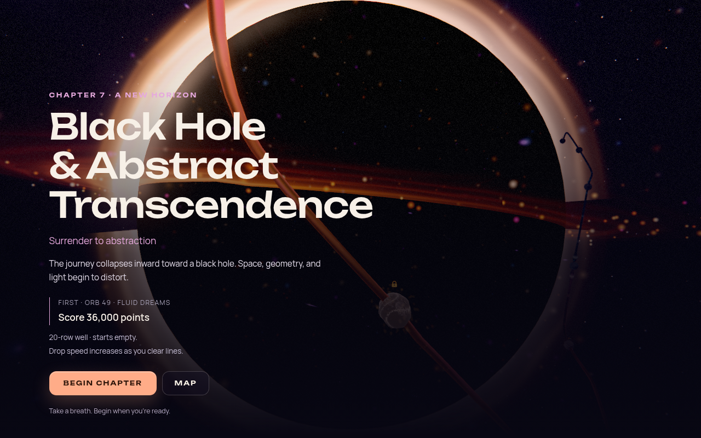 | 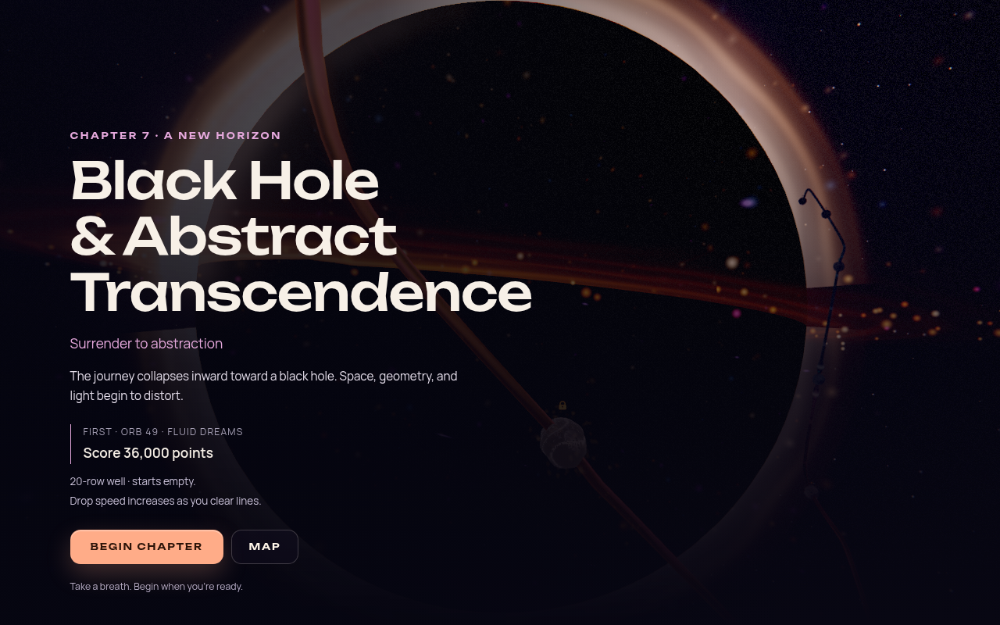 |

[320px chapter reading](images/odyssey-chapter-audit/chapter-mobile.png) ·
[200% text with actions scrolled into view](images/odyssey-chapter-audit/chapter-large-text-actions.png)

### Instruction and ending consistency

A read-only review of all 59 **composed** level configurations found two stale tips:
orb 22 refers to clearing existing blocks, and orb 56 to using starting rows, although
both start empty. The composed configuration matters: orb 22's old base description is
overridden correctly and is not another player-facing defect.

Chapter 8 calls itself a bonus chapter “after the true finale,” although the implemented
campaign conclusion occurs after all eight chapters and 59 registered orbs are complete.
Its encore identity can remain while the visible introduction describes the journey's
actual sequence. Authored targets and progression do not need to change to correct this copy.

The two tips now describe building from an empty well. Chapter eight opens as “One last
electric dream” and describes the four final orbs; the encore identity remains. No goals,
gravity, star requirements or progression rules changed.

### Portal entry from the chapter panorama

The panorama can intentionally look beyond the chapter's first orb. All seven later
chapter arrival samples reported that orb outside the visible camera frustum, sometimes
behind the camera despite plausible projected coordinates. Passing that projection directly
to entry could create a clipped portal and a camera lunge toward a hidden target.

An explicitly hidden orb now uses a centered portal with a stable radius and suppresses
the additional entry-camera dive. The transition sound and existing preparation sequence
remain intact. Visible-orb attachment and reduced-motion behavior retain their existing
paths. This adds no wait or backwards journey along the rail.

The shipping transition was captured before and after over identical saved world images,
using measured chapter-three and chapter-one anchors, a controlled clock and seeded
particles. Three cases per revision cover hidden, visible and reduced-motion entry;
each revision produced seven frames without browser errors. Camera-dive suppression is
covered by the Mode regression tests; these Canvas2D/DOM captures use a static background.
The three visible-orb control frames and the reduced-motion frame are byte-identical across
revisions. The captured after-module hash matches the committed transition source.

| Before: clipped origin | After: centered origin |
| --- | --- |
| 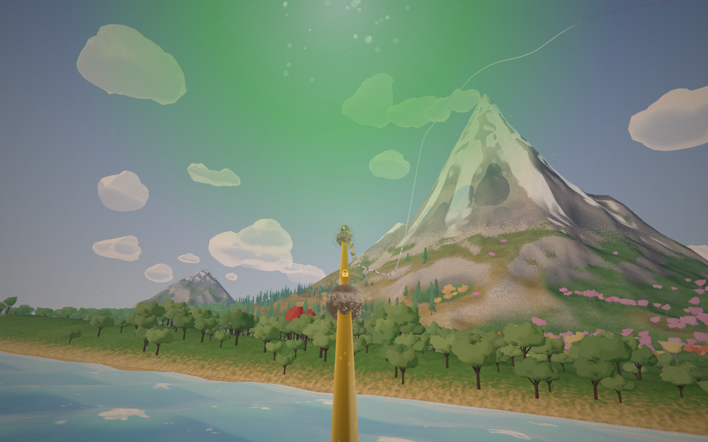 | 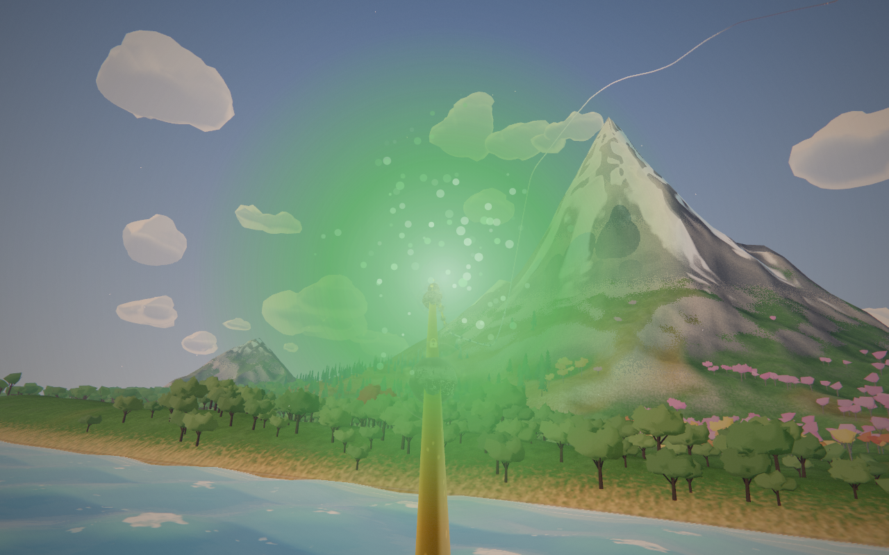 |

### Steam at the first chapter boundary

The late chapter-one view contained a sharp radial pinwheel in the steam. Angular shaft
noise kept full contrast at the zenith, where all azimuths meet. An isolated playground
reproduced the defect before the correction was integrated: shaft contrast now fades near
that aperture and azimuth normalization stays bounded. Billows, palette, opacity and seam
timing are unchanged.

High and Low actual-world recaptures pass with no browser errors. Arrival, middle and late
stations were inspected; the pinwheel is gone and the surrounding plume and route remain.
The High before/after pair has identical recorded camera pose, path and clock; particle
placement can vary between fresh sessions.

| Before | After |
| --- | --- |
| 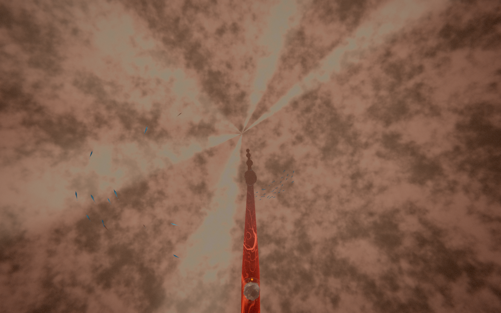 | 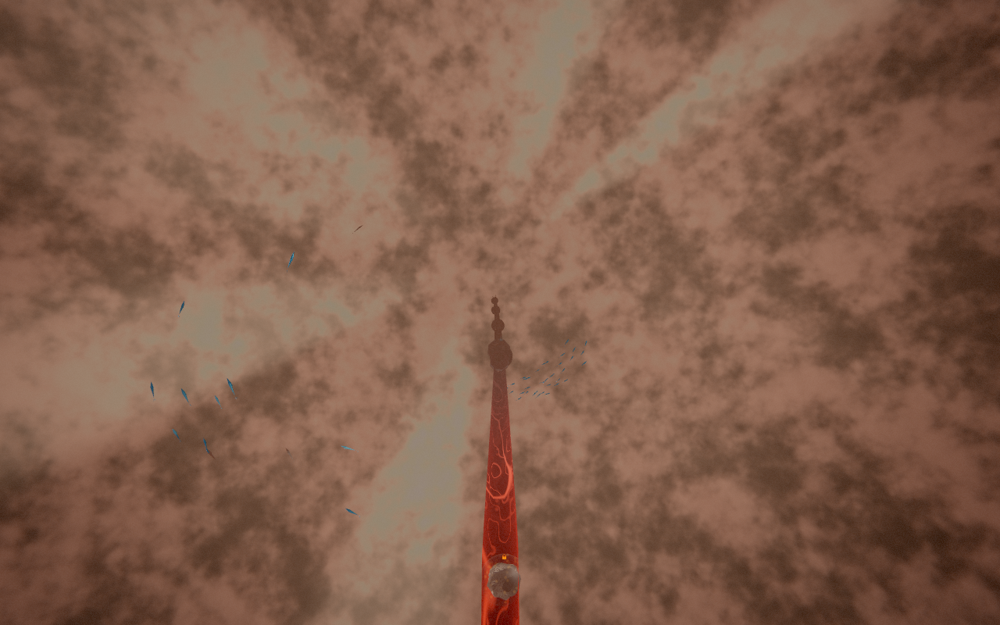 |

### Missing destination scenery

Board travel requests a destination environment but previously ignored a failed or pending
request. An actual environment must exist, or an active One World must supply a deliberately
suppressed chapter, before the camera glides. The existing journey recovery can then restore
the resident map if the destination is unavailable.

Normal startup creates and compiles the focus chapter and its neighbors; background loading
reduces exposure further. This is a reproduced failure-path hole, not evidence that routine
chapter travel usually lacks scenery. A render-warm flag alone is not a reason to reject a
resident scene or impose another unmeasured wait.

A live browser probe passed after injecting a chapter-six request that settled without
installing scenery. The real journey orchestration rejected travel without camera travel,
seek, focus or gameplay launch; it restored the same resident board/renderer and Map
controls. A real Navigator click worked, followed by successful travel to a resident
chapter and a chapter deliberately supplied by One World. There were no browser errors.
This starts from a seeded resident map, not a played completion or a cold-load benchmark.

The first probe attempt is preserved separately: it reached the guard but its fixture had
removed the start modal without clearing modal-manager ownership, leaving the navigation
rail intentionally hidden. It also timed out an initial theme import during compilation.
The one rerun awaited initial theme readiness and used the real menu-close path; it passed.
No production timing budget changed. Final report:
`artifacts/odyssey-chapter-audit-2026-10-08/readiness-recovery-rerun/chapter-01/report.json`.

## World composition survey

The portable harness uses a fresh Chromium instance per chapter and the existing capture
contract for that chapter and its immediate neighbors. The default One World stays enabled;
background loading and adaptive quality are disabled for reproducibility. Samples use High
quality, 1280×800, pixel ratio 1 and fixed board/environment/director time. It captures the
authored arrival panorama, a middle station and a late station, then the real arrival UI.

Each report records loaded and suppressed chapters, actual path positions, first-orb screen
projection and warm-up state. The arrival UI is deliberately mounted for composition review;
these are not eight complete progression playthroughs. Software WebGL2 pictures are not a
native WebGPU performance measurement.

Artifacts: `artifacts/odyssey-chapter-audit-2026-10-08/`.

All eight chapters produced three world samples and one arrival composition: **32 captures,
zero page or console errors**. Each image was reviewed. The first chapter was then recaptured
at High and Low after the steam fix. Reset renderer draw counters are unavailable as cost
evidence, and some neighboring scenes were compiled without being marked render-warmed;
these captures do not establish cold-boundary readiness or a performance budget.

| Chapter | Orbs | Sample review |
| --- | --- | --- |
| Earth Core & Subterranean Origins | 1–5 | Lava cavern and clear route; late steam defect corrected. |
| Deep Ocean & Liquid Worlds | 6–11 | Coherent shafts, fish, caustics and route. |
| Surface World & Living Landscapes | 12–19 | Forest and foothills lead toward the mountains. |
| Mountains & Thin-Air Ascension | 20–27 | Coherent mountain setting; late steep pitch and close ribbon merit motion review. |
| Sky & Atmospheric Drift | 28–35 | Peaks and a vertical route lead into aurora. |
| Space & Cosmic Expanse | 36–48 | Planet, nebulae and asteroids lead toward the black hole. |
| Black Hole & Abstract Transcendence | 49–55 | Distinct black-hole arrival and intense warp; motion comfort remains unmeasured. |
| Urban Dreams Encore | 56–59 | Clear neon-city arrival and final spire; introduction now matches the finale sequence. |

### Chapter gallery

These are unedited shipping-world screenshots. Chapter one uses its post-fix capture;
the other world images are unchanged by this pass. The gallery shows arrival compositions,
not an uninterrupted playthrough. Chapter one's arrival overlay in the audit is a preview
fixture, not the normal first-entry lifecycle.

| Earth core · 1 | Deep ocean · 2 |
| --- | --- |
| 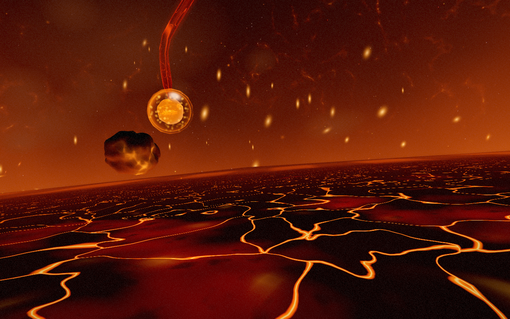 | 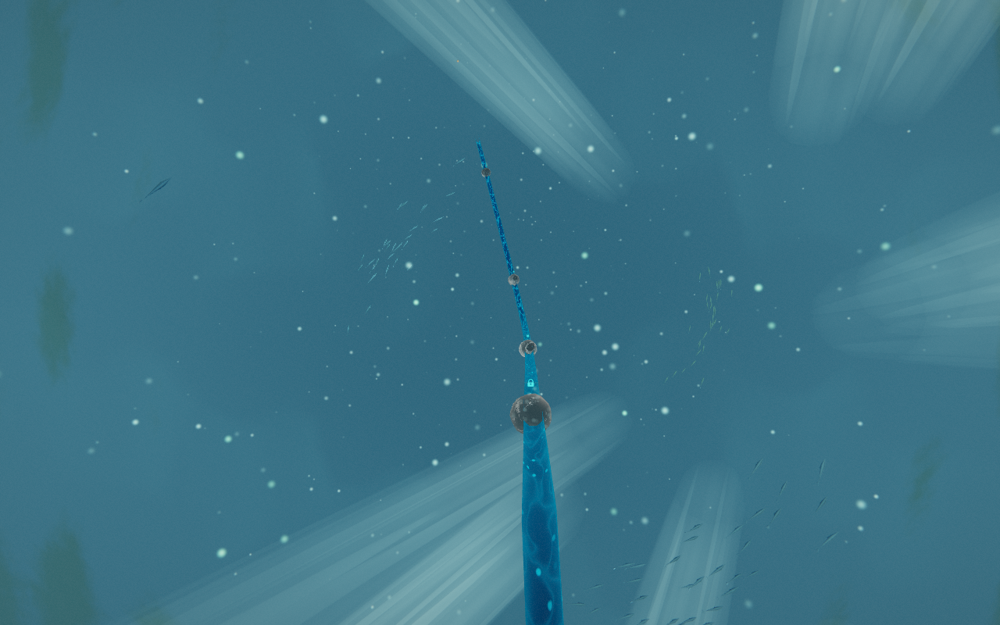 |
| **Surface world · 3** | **Mountains · 4** |
| 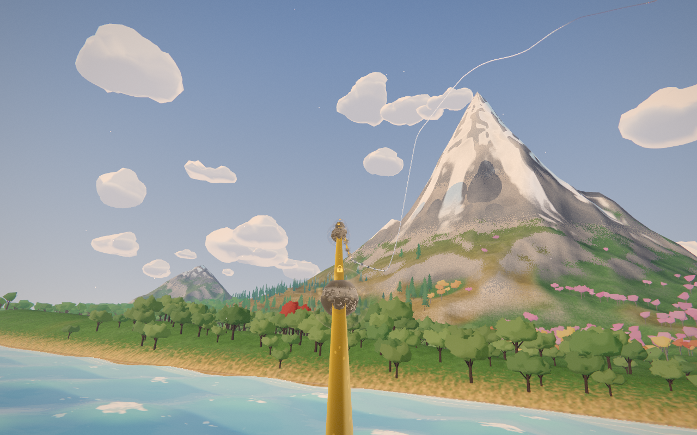 | 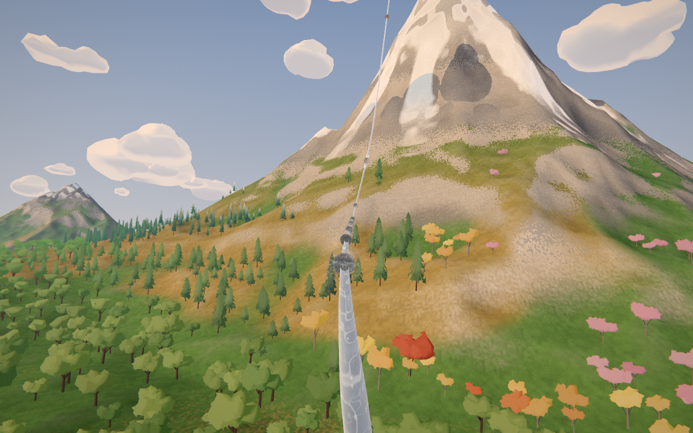 |
| **Sky · 5** | **Space · 6** |
| 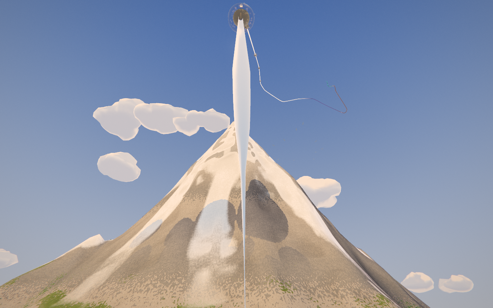 | 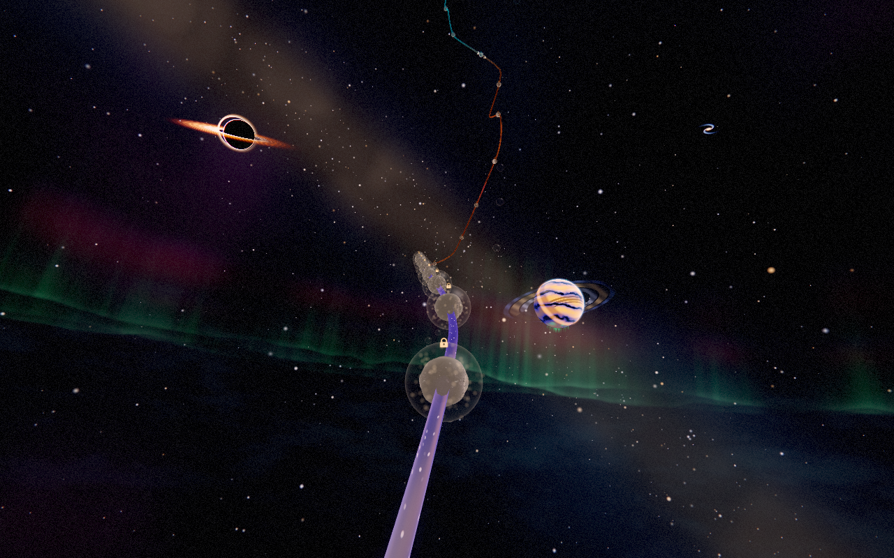 |
| **Black hole · 7** | **Urban encore · 8** |
| 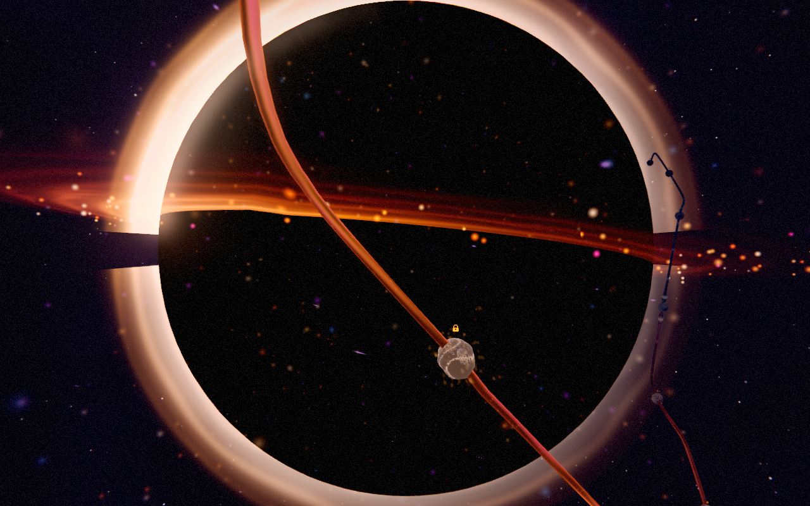 | 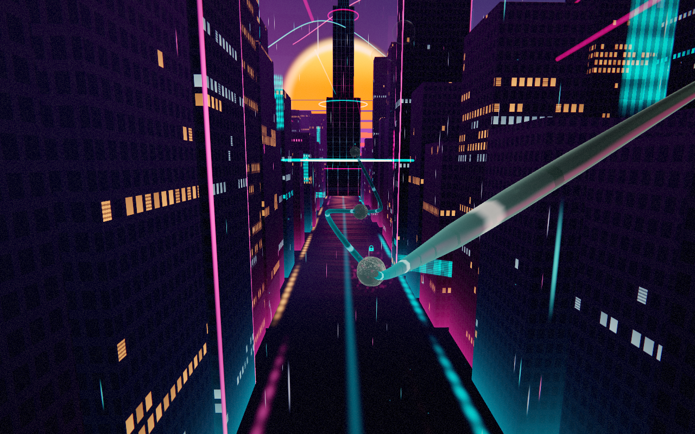 |

## Verification and reproduction

The full suite passes **8,718 tests across 662 files** in 197.25 seconds. Regression
coverage includes missing destination environments, active One World exceptions, chapter
reading focus, controller activation, hidden-orb entry and preservation of visible anchors.
All three capture harnesses pass syntax and scoped lint checks.

The production build, boot closure, typecheck, TypeScript coverage ratchet, lint ratchet,
architecture fitness, theme lifecycle, import boundaries, performance-budget tooling,
release gates, shipped IP-string check and Pages artifact check pass. The performance gate
checks tooling and committed baselines; it does not measure this change on native hardware.

Production dependency audit reports zero vulnerabilities. The unchanged development tree
retains 25 advisories (10 moderate, 13 high, 2 critical), as in the existing warning lane.
The lint ratchet remains at 813 existing errors, with 1,055 warnings and no fatal errors;
the release check retains its placeholder Steam AppID warning. No baseline was relaxed.

Verification logs: `artifacts/odyssey-chapter-audit-2026-10-08/verification/`.

Implementation checkpoint: `4ada7d6`. The earlier isolated composition harness checkpoint
is `0f34018`. No dependency, quality budget or architecture baseline was raised.

Use the optional external Playwright installation without adding game dependencies. Run a
stable Vite server in one terminal, then the captures sequentially in another. Each world
capture opens a fresh browser with only the chapter and its immediate neighbor window;
do not run another GPU capture or the full build/test suite alongside it.

```sh
node --input-type=module -e 'import { createServer } from "vite"; const server = await createServer({ server: { host: "0.0.0.0", port: 5194, strictPort: true, hmr: false }, optimizeDeps: { noDiscovery: true }, cacheDir: "/tmp/odyssey-chapter-audit-vite" }); await server.listen(); server.printUrls();'
```

```sh
export PLAYWRIGHT_MODULE=/opt/codex/runtimes/cua/lib/node_modules/playwright/index.mjs
export CHROMIUM_PATH=/usr/bin/chromium
node scripts/validate-odyssey-chapter-visuals.mjs --chapter all --out artifacts/odyssey-chapter-recheck
node scripts/validate-odyssey-chapter-ui.mjs --base-url http://127.0.0.1:5194 --out artifacts/odyssey-chapter-ui-recheck --world-dir artifacts/odyssey-chapter-recheck --baseline-ref 66dfd7c
node scripts/validate-odyssey-entry-portal.mjs --baselines artifacts/odyssey-chapter-recheck --out artifacts/odyssey-entry-portal-recheck
node scripts/validate-odyssey-chapter-visuals.mjs --chapter 1 --quality Low --readiness-probe --out artifacts/odyssey-readiness-recheck
```

Use `--chapter 1 --quality Low` without the probe for the lower-tier steam composition.
The isolated steam A/B effect is at
`/playground.html?effect=odyssey-steam-shafts&t=9&orbit=0`; append `&shafts=legacy` to
reproduce the old field. Actual proof and browser reports are under the artifact paths above.
The UI matrix uses 200% root text, not browser zoom, and synthetic visibility events;
neither establishes operating-system focus behavior or a physical-phone result.

## Remaining experience evidence

A native playthrough with sound and a physical controller remains useful when available.
It should assess repeated handoffs, chapter recovery, changing rules, an optional showcase,
a duel and a retry. The [bounded player study](ODYSSEY_FLOW_STATE_RESEARCH_2026-10.md#a-bounded-validation-plan)
still provides the appropriate protocol. Static chapter pictures cannot establish the
comfort of the chapter-seven scenery's time-driven warp or smoothness at every boundary.
