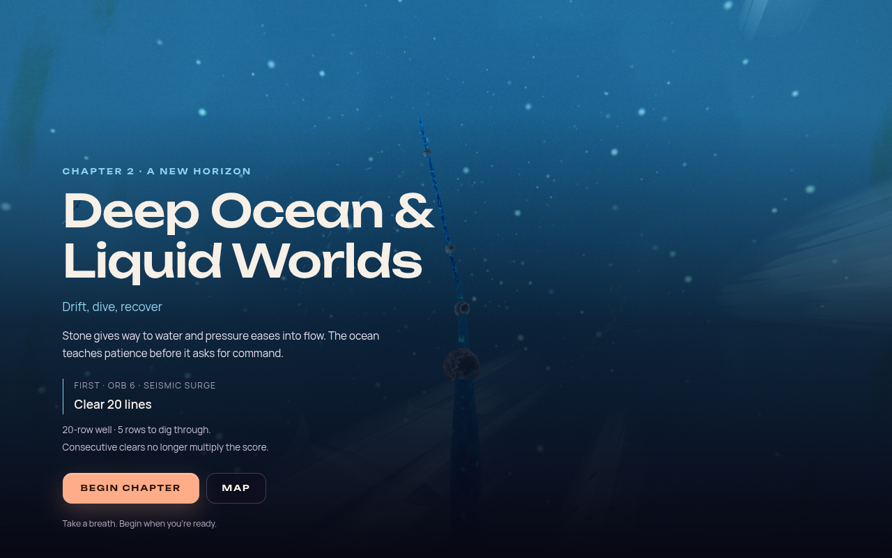
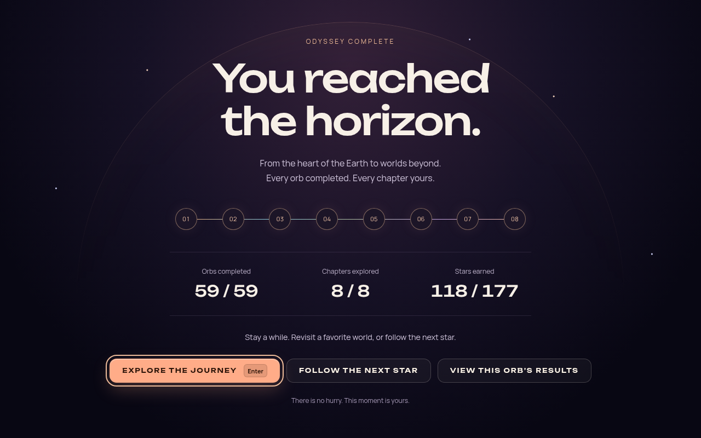

# Odyssey experience polish — 2026-10-08

This implements the next concrete findings from the audit of `main` at `6a30634`.
The [world journey](ODYSSEY_WORLD_JOURNEY_2026-10.md) remains the design: finish an orb,
emerge into the world, follow its path, and enter the next orb. The implementation
checkpoint is `7c987c3` on `codex/odyssey-experience-polish`.

## Player experience

**Chapter travel now keeps the same controls and presence owner.** The completion briefing
stays mounted through the world return, chapter path and arrival. Pause or focus loss holds
rail progress; Map cancels safely. The chapter title and narrative appear only after arrival,
and Begin chapter remains untimed. Idle camera drift is held during reading and restored
when this operation ends. The chapter entry briefing stays above the portal effect, using
the same loading lease and cancellation path as ordinary orb entry.



**Reduced motion applies to the camera as well as the overlays.** Both the game's setting
and the current OS preference are respected by the resident camera. Camera breathing and
chapter-seven fall roll, dolly and FOV movement are suppressed under reduction. Reduced
chapter travel seeks under an opaque cover. Ambient world effects still exist; this is not
a claim that every animated object or effect in every chapter is static.

**Quiet music stays quiet.** Transition ducking multiplies the player's current music
volume by an attenuation factor, including zero. Restoration reads the current preference,
so changing volume during a transition remains authoritative. Track-switch completion
finalizes only the volume ramp it owns; it cannot cancel a newer transition restoration
and abruptly snap gain. Manual volume changes cancel older scheduled ramps.

**Showcase completion is available on a standard controller.** View/Back is preferred when
unbound. If the player remaps gameplay onto it, an unused standard button is selected and
both the goal banner and HUD show the actual hint. A release followed by a fresh press is
required; pause, blur, sheet ownership, remapping and disconnection reset that protection.
Normal gameplay and Menu/Start remain available. Enter finishes the optional showcase;
Escape retains Pause, matching its existing on-screen hint. A short/nonstandard controller
with no spare button has no misleading pad hint; the clickable and keyboard actions remain.

**Detailed results respect keyboard focus.** Enter and Space activate the focused results
or leaderboard control. Escape and the Continue button close deliberately. Repeat and
inherited key-release guards prevent finishing gameplay from dismissing the next sheet.

**Completing the campaign has its own conclusion.** An untimed horizon presents the completed
chapters, registered-orb total and earned stars. The player can explore the journey, focus
the next orb with an unearned star, or inspect the just-completed orb's results and return.
No action starts another attempt automatically. Completing the primary journey is celebrated
without implying that all optional stars have been earned.



The screenshot uses the real finale UI and CSS with an explicitly synthetic completed save.
Its totals demonstrate the presentation; they are not a player's earned result.

## Pacing and ownership

The retained briefing now fades during the existing board reveal. Previously its 360 ms
fade (100 ms reduced) began only after that reveal had become playable. Both the reveal
and the uninterrupted visible briefing fade must finish before Ready and the first live
tick. This removes a serial UI wait; it does not weaken theme, pipeline or simulation
readiness. Focus loss still requires deliberate Resume and a complete Ready cue.

Acknowledgment remains 2.6 seconds with manual/Pause options. Authored travel remains
1.5 seconds within a chapter and 2.2 seconds across chapters. These are source timing
choices, not measured native completion-to-control performance or an optimal human cadence.
Return/entry portal presentation can finish behind a pause; rail movement and live gameplay
remain held. The pause does not promise to freeze all scenery or every sound envelope.

- `odyssey-journey-flow.js` coordinates the retained chapter presentation, shared entry,
  reveal overlap and exact-operation recovery. Chapter music retains its separate policy.
- `odyssey-world-return.js` settles chapter departure framing under the return cover,
  avoiding an unawaited source-focus animation.
- `odyssey-showcase-input.js` owns the current attempt's keyboard/controller finishing
  action; Mode only installs and disposes it.
- `odyssey-campaign-summary.js` derives campaign facts from registered levels. Completion
  detects the saved transition from incomplete to complete, rather than a final numeric ID
  or stale aggregate count. Experimental clocks and isolated final-orb debug wins do not
  qualify, and replaying an already complete campaign does not repeat the finale.
- `odyssey-campaign-finale.js` mounts the conclusion under the retired attempt's outcome
  owner. Cancellation or a replacement session cannot reopen a late results detour.

No authored gravity, objectives, duel rules or star thresholds changed. The One World
fallback and loading-surface rules remain in place.

## Verification

The full suite passes **8,699 tests across 662 files** (`--maxWorkers=2`, 192.88 seconds).
Focused regressions cover camera comfort, chapter travel/reading/entry, audio ramp ownership,
controller remaps and release guards, results keyboard activation, campaign qualification
and retired-attempt cleanup. Independent read-only reviews of chapter cancellation/reveal
and finale ownership found no concrete blocker.

The production build and boot closure, type checking, import boundaries, TS coverage,
architecture fitness, theme lifecycle, release scaffolding, performance-budget tooling,
shipped IP strings and Pages artifact checks pass. The performance gate checks committed
baselines and comparison tooling; it is not a fresh GPU measurement. The lint ratchet passes
at its existing 813-error baseline (1,056 warnings, zero fatal errors); no baseline was raised.
Production dependencies report zero vulnerabilities. The optional full dependency audit
reports 25 advisories (10 moderate, 13 high, two critical) in the unchanged development
dependency tree; this pass does not upgrade the toolchain. The development release gate
retains the existing placeholder Steam AppID warning. Logs are under
`artifacts/odyssey-experience-polish-2026-10-08/verification/`.

Isolated camera verification used the existing `odyssey-path-beacons` playground before
runtime integration, then captured the integrated camera. Game-setting and OS reduction
both produced zero fall/breathing offsets. With reduction off, the sampled authored camera
state matched the pre-change state. No page or console errors were recorded. This is an
isolated camera/path check, not full-chapter scenery or hardware performance evidence.
Artifacts: `artifacts/odyssey-experience-polish-2026-10-08/camera/`.

The finale DOM matrix passed at 1280×800, 320×640, 844×390 and 200% text at 640×800.
The real UI/CSS was inspected at the top and at the actions: content scrolls on smaller
surfaces, all three actions remain reachable and there is no horizontal clipping.
Artifacts: `artifacts/odyssey-experience-polish-2026-10-08/finale-ui/`.

The live finale fixture seeded 58 registered completions in disposable storage, then
completed orb 1 through the real completion/save path. It persisted 59/59 orbs, 8/8 chapters
and 61/177 stars once. The completed attempt was retired and its simulation driver stopped.
The conclusion held without input, detailed results returned to it without saving again,
and the next-star action focused orb 2 on the map without starting gameplay.
Artifacts: `artifacts/odyssey-experience-polish-2026-10-08/live-finale/`.

The live chapter 1→2 fixture completed orb 5 and followed the path to orb 6. Pause held
the sampled rail position exactly through wheel/click/repeated Enter and synthetic blur/focus.
Resume continued travel; arrival held for 3.2 seconds without launching or preparing a run,
and Begin chapter started orb 6 once. Map controls stayed suppressed during the presentation.
These fixtures use software WebGL2, muted audio and synthetic completion. They verify
the runtime lifecycle, save and presentation; they do not measure player difficulty or FPS.
Artifacts: `artifacts/odyssey-experience-polish-2026-10-08/live-chapter/`.

Reduced chapter travel also passed: it sought under cover, held identical camera position
and orientation throughout the chapter reading interval, and entered orb 6 once after
Begin. All completed live fixtures recorded zero page or console errors.
Artifacts: `artifacts/odyssey-experience-polish-2026-10-08/live-chapter-reduced/`.

Cancelling from paused chapter travel restored map pointer input. A real canvas click
changed selection from orb 6 to orb 5 and opened its correct preview. The map then remained
available for 3.2 seconds without late gameplay, a second save or automatic entry.
Artifacts: `artifacts/odyssey-experience-polish-2026-10-08/live-chapter-map/`.
Together these are four passing runtime scenarios and four passing finale UI sizes.
The earlier blocked chapter capture on `main` has now been replaced by live evidence.

Reproduction uses the existing optional Playwright installation (`PLAYWRIGHT_MODULE` and
`CHROMIUM_PATH` when it is not locally discoverable). The validation server disabled HMR
and late dependency discovery so a development reload could not invalidate the fixture:

```sh
node --input-type=module -e 'import { createServer } from "vite"; const server = await createServer({ server: { host: "0.0.0.0", port: 5194, strictPort: true, hmr: false }, optimizeDeps: { noDiscovery: true }, cacheDir: "/tmp/odyssey-experience-validation-vite" }); await server.listen(); server.printUrls();'
node scripts/validate-odyssey-flow.mjs --scenario chapter --warm-source --base-url http://127.0.0.1:5194 --out artifacts/odyssey-experience-polish-2026-10-08
```

Substitute `chapter-reduced`, `chapter-map` or `finale` for the other runtime fixtures;
`finale-ui` runs the responsive DOM matrix without needing `--warm-source`. Source-theme
prefetch is recorded fixture setup; production readiness budgets were not increased.

## Remaining player checkpoint

Observe consecutive ordinary orbs, a chapter arrival, a duel, an optional showcase and a
retry on native hardware with sound and a physical controller. Assess the whole interval
from completion to control, whether changed rules are understood, and whether the chapter
pause feels restful. The [bounded player study](ODYSSEY_FLOW_STATE_RESEARCH_2026-10.md#a-bounded-validation-plan)
remains appropriate. Software-browser captures and synthetic completion cannot establish
enjoyment, physical-controller ergonomics or native frame pacing.

Late mastery qualification (49/55/59), duel fatigue, first-encounter teaching and clearer
earned/missed-star explanations remain player/design questions from the audit. This pass
does not silently retune those systems or claim that human validation has occurred.
