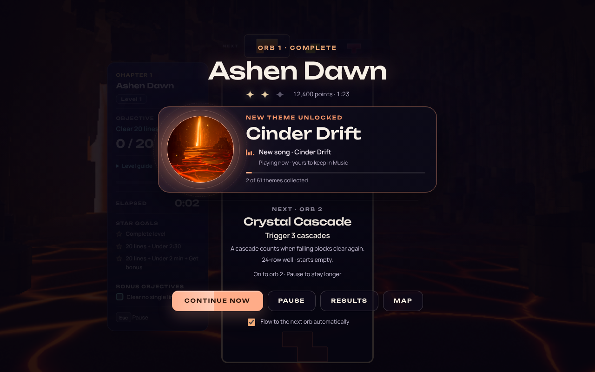
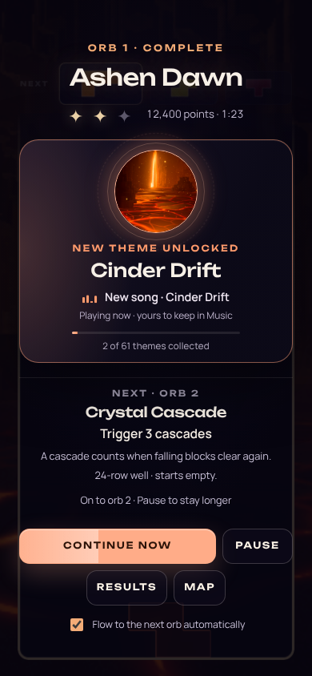
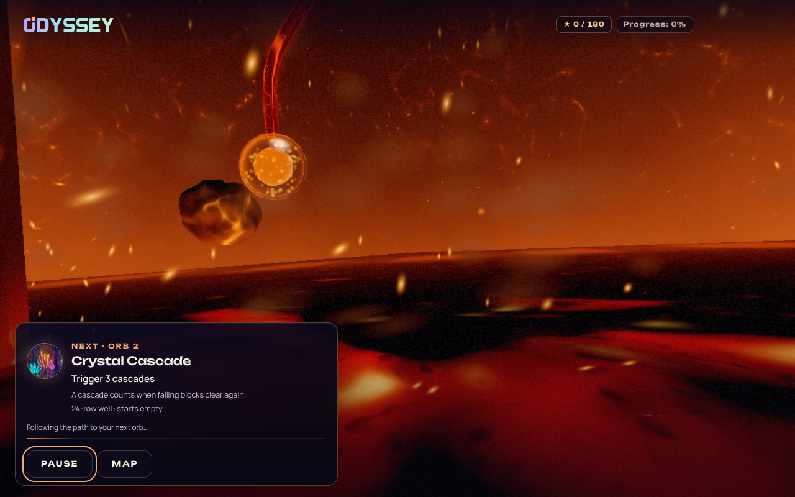
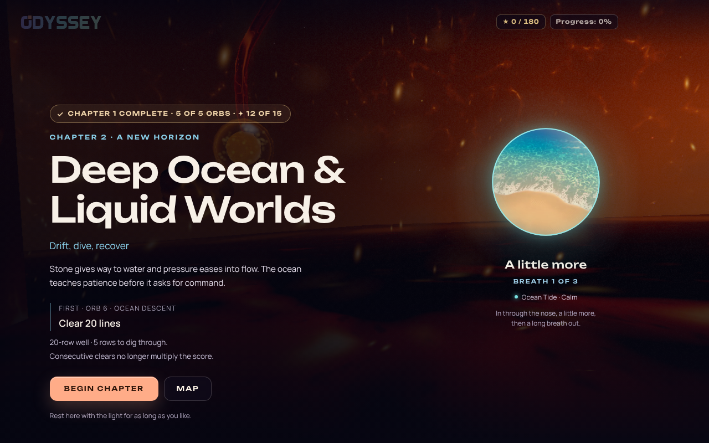
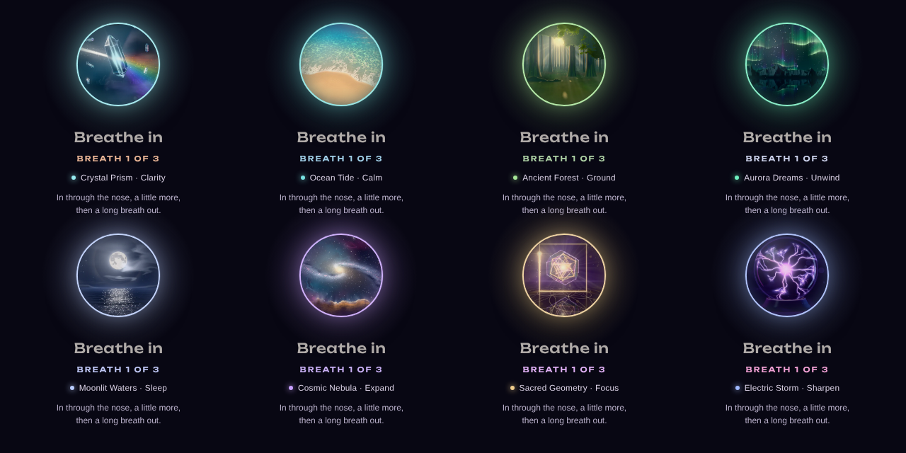
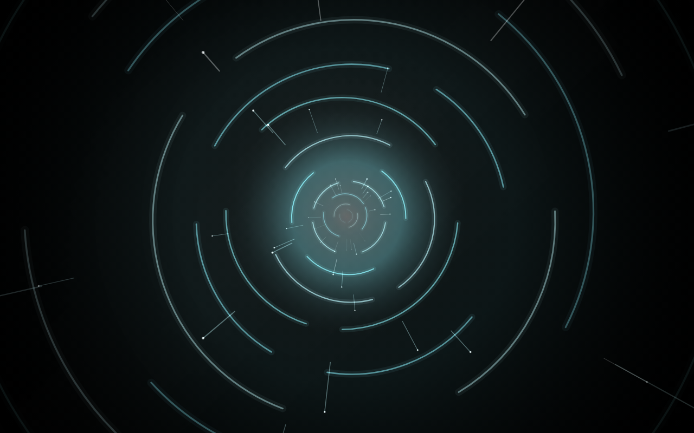
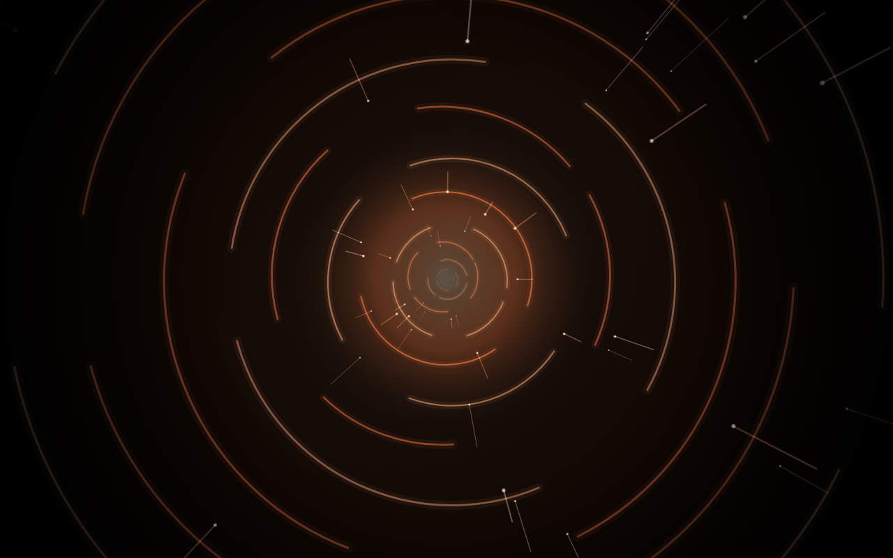
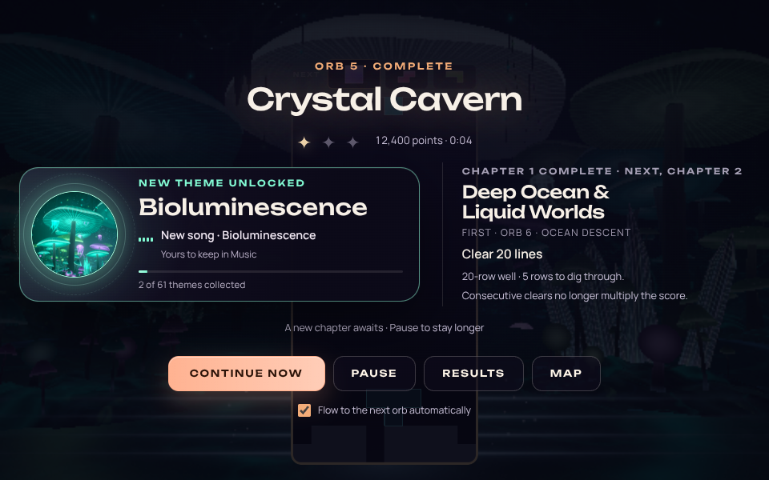
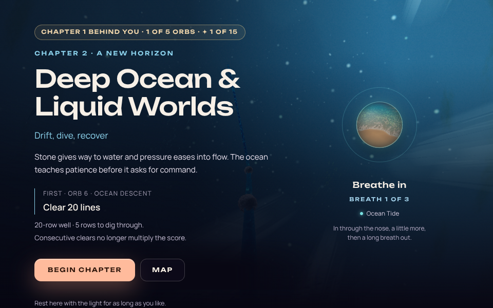

# Odyssey flow: reward ceremony, portal tunnel and chapter breath — 2026-10-09

Status: implemented and validated in the browser on 2026-10-09. This pass answers the owner's
review of the [continuous world journey](ODYSSEY_WORLD_JOURNEY_2026-10.md): the transitions
were not yet a visual masterpiece, the theme and song unlocked by an orb were not clear, the
handoff moved on too fast to see them, and the motion needed to be smoother. Within a chapter
play should flow without stopping; between chapters the player should be able to stop and
breathe. Themes and songs must be unlocked by finishing an orb.

Authored objectives, gravity, star thresholds, rewards, the save, the Ready/Go timings and the
journey's ownership/cancellation rules are unchanged. The earlier records stay valid except
where this one says it supersedes them (the fixed 2.6-second acknowledgment, the completion
composition and the hold-on-black inside the portals).

## What the player sees now

**Within a chapter** (automatic, no input needed):

1. **The well answers the goal** (0.72 s). The theme receives the same celebration events as a
   big clear, the well's walls flare in the chapter colour with a sweep of light, and the
   level-up chime plays. The attempt drains and saves underneath; the ceremony appears after.
2. **The ceremony.** The orb you finished is the title (“Ashen Dawn”, *Orb 1 · Complete*), its
   stars land one by one beside the score, and a first-time unlock blooms as the centrepiece:
   the theme's artwork opening inside rings and sparks, *New theme unlocked*, its name, *New
   song* (its equalizer moves, with *Playing now · yours to keep in Music*, only when that song
   is really audible; otherwise *Yours to keep in Music*), and the collection meter growing
   from the old count to the new one. The next orb is a quiet teaser below. The beat lingers long enough to read all of it (see Pacing); the
   Continue button fills as it does, Enter skips it, Pause holds it indefinitely.
3. **Departure.** The ceremony fades in place under its own scrim while the next-orb briefing
   docks over the world; the return portal pulls back out of the orb as an inward tunnel of
   the finished theme's colours, then reveals the live world.
4. **The path** (1.5 s, unchanged) carries the camera to the next orb. The docked briefing
   shows the destination's artwork, goal and changed rules over a travelling light.
5. **The portal.** Diving into the orb gathers an outward tunnel of the destination's colours
   at the orb, centres it, and keeps it flowing for as long as the board prepares, so loading
   reads as travel instead of black. It accelerates and blooms softly into the new board.
6. **Ready → Go** keeps its fairness timings; the plate now settles in, GO lands with an
   expanding ring, and an afterglow fades after control has been handed over.

**Across a chapter** the same ceremony plays, then the briefing names the crossing: the
finished chapter's colour stays through its ceremony, the next chapter's colour arrives with
the journey, and the chapter you leave speaks its farewell line (its authored `outro`) while
the world carries you out. The arrival recognises the finished chapter (*Chapter 1 complete ·
5 of 5 orbs · ✦ 12 of 15*), reveals the new place, and offers **a breathing light**: three
guided cyclic sighs (in, a little more, a long breath out, rest), with a singing-bowl bell at
the start and when the three are done. The light holds one of the game's twelve **breathing
worlds**, the one that matches the place just reached (Ocean Tide for the Deep Ocean, Aurora
Dreams for the Mountains, Electric Storm for the neon encore): its picture sits inside the
breathing ring like a world inside an orb, opens and brightens as the lungs fill and settles
into shadow on the long breath out, and the ring takes the world's colour. It keeps breathing
for as long as the player stays; it never gates **Begin chapter**, pauses with the journey
(blur, hidden page, Pause), and fades with the text when the player begins.

| Ceremony, desktop | Ceremony, phone |
|---|---|
|  |  |

| Docked briefing during travel | Chapter arrival with the breathing light |
|---|---|
|  |  |

*Each chapter's arrival world near the top of a breath: Crystal Prism, Ocean Tide, Ancient
Forest and Aurora Dreams (chapters 1–4), then Moonlit Waters, Cosmic Nebula, Sacred Geometry and
Electric Storm (5–8). Chapter 1 has no arrival; its pairing is kept for completeness.*

| Inside the entry portal while the board prepares | Leaving an orb: the return portal |
|---|---|
|  |  |

The ceremony, docked and arrival images are the real overlay module and CSS over stills taken
from the running game (a fixture, so layouts can be compared across sizes; the world stills
were taken in the map view, so its logo and progress chips belong to the still, not to the
journey, which hides them). The portal frames are the real transition classes stepped on a
deterministic clock over game stills. Captures from the live runtime are under Validation.

## Audit: what was wrong

The audit ran the real game in Chromium (software WebGL2) and read the flow sources.

| # | Finding (source) | Effect on the player | Change |
|---|---|---|---|
| F1 | The completion's largest text was the *next* orb's name; the unlock was a 460-pixel card with an 88-pixel thumbnail and a 12-pixel song line (`JourneyFlowOverlay.js`, `ThemeUnlockReward.js`). | The achievement and the reward read as secondary to the destination. | The finished orb is the title; the reward is a staged centrepiece; the next orb is a teaser. |
| F2 | Automatic continuation fired after a fixed 2,600 ms whatever was on screen. | A first-time theme + song + next goal is ~35 words: about 9 s at a typical reading rate. The reward was gone before it could be read. | Reading-time-aware hold (Pacing). |
| F3 | `beginTransit()` swapped the dim completion for the scenic layout in one frame; the scenic layout's transparent scrim exposed the still-bright board for ~300 ms before the return portal's veil darkened it. | A flash: dim → bright → black → world. | A departure phase keeps the composition and scrim while it fades; scrims are separate layers with opacity transitions. |
| F4 | Both portals held on a near-black veil while preparation ran (`JourneyEntryTransition.js`, `JourneyReturnTransition.js`). | On slower machines the wait read as dead loading time. | A tunnel of light rides above the veil for the whole hold. |
| F5 | Ready/Go swapped text with no entrance or exit; its ~230 lines of inline styling lived in `OdysseyMode.js`. | A hard pop before and after every start. | Extracted to `odyssey-start-cue.js` with an entrance, a GO ring and an afterglow; timings unchanged. |
| F6 | The goal completed with no on-board answer; the sheet simply appeared. | No peak at the moment of success. | The goal flourish (well flare, theme celebration, chime) while the save runs. |
| F7 | The chapter arrival had a static “Take a breath” line and no recognition of the finished chapter. | The pause was a page to dismiss rather than a rest. | Recognition chip and the breathing light. |
| F8 | Reading-overflow checks ran at mount, while entrance transforms still shifted boxes. | With richer motion this could falsely hold the flow on ordinary laptop screens. | Checks wait for the entrance to settle; the ceremony fits 1366×720 without scrolling. |
| F9 | Found by this pass's own live run: at 960×600 the richer ceremony scrolled, so the reading hold stopped the journey at every orb; on phones a crossing's farewell made the docked briefing scroll (another stop), and the arrival's Begin chapter fell below the fold. | The flow would stall on short laptop windows and small phones. | A two-column ceremony on wide, short windows; a compact phone card; the hold measures only what must be read (the reward, the next orb, Pause); the farewell yields before a hold; Begin chapter stays in view. |

## Online research and how it was applied

| Source | What it supports | Application |
|---|---|---|
| Brysbaert (2019), [How many words do we read per minute?](https://www.gwern.net/doc/psychology/linguistics/2019-brysbaert.pdf), J. Mem. Lang. 109 | Adults read English non-fiction silently at ~238 wpm (most 175–300). | New reward copy is budgeted at a slower 200 wpm (300 ms a word) so slower readers are not cut off. |
| W3C, [Understanding SC 2.2.1 Timing Adjustable](https://www.w3.org/WAI/WCAG22/Understanding/timing-adjustable.html) | Time limits should be avoidable or adjustable; people who read slowly need more time. | The pre-play and in-ceremony auto preference, Pause, any focus/pointer input and the overflow hold all stop the beat; nothing auto-continues at a chapter. |
| Material 3 easing, as implemented in Flutter's [`motion.dart`](https://github.com/flutter/flutter/blob/master/packages/flutter/lib/src/material/motion.dart) (`emphasizedDecelerate` 0.05, 0.7, 0.1, 1.0; `emphasizedAccelerate` 0.3, 0, 0.8, 0.15; `standard` 0.2, 0, 0, 1), and NN/g's response-time limits as summarised by [Val Head](https://valhead.com/?p=2978) | Decelerating curves for what arrives, accelerating curves for what leaves; ~100 ms feels instant, ~1 s is the limit for an uninterrupted train of thought. | Entrances use the emphasized-decelerate curve, departures the emphasized-accelerate curve; the departure is 340 ms and the dock 620 ms; only the ceremony's deliberate reveal runs longer. |
| Gutwin, Rooke, Cockburn, Mandryk & Lafreniere, [Peak-End Effects on Player Experience in Casual Games](https://www.cs.mcgill.ca/~jeromew/data/COMP766/CHI2016/p5608-gutwin.pdf) (CHI 2016); the [peak–end rule](https://en.wikipedia.org/wiki/Peak%E2%80%93end_rule) | Retrospective judgments weigh the peak and the end. In the games studied, recollected challenge followed peak-end manipulations strongly; effects on fun and preference to replay were mixed but never reversed. | The goal flourish is the peak; the ceremony gives each orb a clear, positive ending. The paper's mixed enjoyment results are why this is presented as a hypothesis to check with players. |
| Balban et al. (2023), [Brief structured respiration practices…](https://pmc.ncbi.nlm.nih.gov/articles/PMC9873947/), Cell Reports Medicine | In a remote randomised trial, five daily minutes of exhale-led cyclic sighing improved mood and lowered respiratory rate more than mindfulness meditation. | The chapter rest uses the cyclic-sigh shape. Three breaths are a rest, not a treatment, and no health claim is made in game. |
| Jenova Chen, [Flow in Games](https://khoury.northeastern.edu/~lieber/courses/csu670/f08/materials/p31-chen-flow-in-games.pdf), CACM 50(4) 2007 | Frequent required choices interrupt the control and concentration flow depends on. | Within a chapter nothing asks for input; the only choices on the path are optional (Pause, Results, Map). |
| Tetris Effect's Journey mode as described in [Nintendo World Report's review](https://www.nintendoworldreport.com/58609) (W. Hilhorst): “Once you've cleared enough lines, more visuals come on screen and the song advances”; Game Developer on [how Lumines' creator uses games as a music-based art form](https://www.gamedeveloper.com/design/how-i-lumines-i-creator-uses-games-as-a-music-based-art-form) (2012): Lumines “uses music as a reward for its puzzle-based gameplay” | Progress is marked by the world and the music changing around continuous play; the music is the reward. | Within a chapter the journey carries on without a stop; the song unlocked is the one that was playing, and the ceremony says “Playing now” only when it is really audible. Chapters are where the player stops and breathes. |
| Jonasson & Purho, [Juice it or lose it](https://gamedeveloper.com/design/video-is-your-game-juicy-enough-) | Small, layered feedback (scale, light, sound) makes success feel good. | Stars land with overshoot, the art blooms with rings and sparks, GO gets a ring; all motion has a still reduced-motion form. |

These are design references. None establishes an optimal duration for this game; the numbers
here are starting points to be tuned against native, sound-on player sessions.

## Pacing

| Beat | Before | After |
|---|---|---|
| Goal reached → completion | Immediate sheet | 0.72 s flourish (0.28 s reduced), overlapping drain and save |
| Completion, first-time theme + song | 2.6 s | Reveal (2.2 s) + 300 ms per new word + 75 ms per briefing word, clamped to 6.5–11.5 s (≈10 s for orb 1) |
| Completion, familiar orb (replay, nothing new) | 2.6 s | 2.6 s + 75 ms per briefing word, clamped to 3.4–6.0 s (≈3.8 s) |
| Completion → briefing over the world | One-frame swap | 340 ms departure, then a 620 ms dock (immediate under reduced motion) |
| Within-chapter path travel | 1.5 s | Unchanged |
| Portal hold while the next board prepares | Near-black | Tunnel of light, same readiness gates and budgets |
| Ready → Go | 500–800 ms + 200–280 ms | Unchanged; motion added around it |
| Chapter arrival | Untimed | Untimed, with recognition and the breathing light |

`src/ui/odyssey/journey-pacing.js` holds the rule; `modal.autoContinueMs` exposes the value.
The ceremony's longer beat also gives the next theme's prefetch, which starts when the
ceremony mounts, several more seconds before the portal needs it.

## Ownership and implementation

- `src/ui/odyssey/JourneyFlowOverlay.js` — one composition and presence owner through the
  ceremony, departure, scenic travel, entry and chapter arrival. Layout lives in
  `data-layout` (`ceremony`, `scenic`, `transit`, `chapter`); `data-departing` keeps the
  previous layout while it fades. Every lifecycle attribute (`data-world-stage`,
  `data-covered`, `data-revealing`, `data-visibility-held`, `data-retained`) keeps its
  meaning, and the public API (`beginTransit`, `setScenic`, `cover`, `reveal`, `showChapter`,
  `retainCover`, `waitUntilVisible`, `dispose`) is unchanged; `showChapter` additionally
  accepts `completedChapter`.
- `src/ui/odyssey/ThemeUnlockReward.js` — new `variant: 'ceremony'` with `nowPlaying`; the
  compact card used by Results and the campaign finale is unchanged.
- `src/ui/odyssey/journey-pacing.js` — reading-time hold.
- `src/ui/odyssey/chapter-breath.js` — pure breath timing (`resolveChapterBreath`) and the
  guide view, built on the game's breath easing and singing-bowl chimes. `CHAPTER_BREATH_WORLDS`
  pairs each chapter with a breathing world by place and calm; the guide shows that world's
  poster (the 15–35 KB still the Breathing tab already uses), decoded off the main thread and
  requested as a crossing's ceremony begins. Only the picture comes from the world: no second
  renderer runs beside the Odyssey world, the rhythm stays the cyclic sigh, and the caption
  gives just the world's name, since its own rhythm and intent belong to the Breathing tab.
  Until the picture is decoded, or if it cannot load, the plain light shows.
- `src/ui/odyssey/odyssey-journey-flow.js` — passes whether the unlocked song is audibly
  playing (exact track, unmuted, non-zero volume), the finished chapter (for the farewell)
  and its summary (for the arrival).
- `src/ui/odyssey/odyssey-goal-flourish.js` — the flourish; `completeOdysseyLevel` starts it
  through `mode._celebrateGoalReached`, saves beneath it and only awaits it before showing the
  ceremony. A throwing or missing hook can never block the save; with no rendered well
  nothing waits.
- `src/ui/odyssey/odyssey-start-cue.js` — Ready/Go, extracted from `OdysseyMode.js` (4,599 →
  4,391 lines; core DOM-global reads 417 → 411; baselines lowered in
  `architecture-fitness.json`).
- `src/rendering/transitions/portal-tunnel.js` — the tunnel renderer (2D canvas, additive,
  quality-scaled, time-integrated so speed changes never jump), drawn on a new last layer of
  both portals. Reduced motion keeps the existing plain veil. Both portals now release their
  full-screen veil and tunnel canvases when they tear down instead of leaving them to garbage
  collection, which could otherwise fall inside the next portal's preparation hold.
- `public/styles/odyssey-flow.css` — layouts, two scrim layers, the ceremony choreography,
  the docked briefing, the breathing light, the cue and the well flare, each with a still
  reduced-motion form.

## Accessibility and comfort

- Reduced motion (game setting or OS): no scaling, sparks, rings, tunnel, departure or dock;
  the breathing light brightens and dims instead of growing; the flourish is a still glow.
- The reward is one polite, atomic status; the breathing cue is not live (it would interrupt a
  screen reader every few seconds) and the guide is labelled once.
- “Playing now” is shown only when the exact unlocked track is audibly playing.
- The arrival bloom stays under a third of white; there are no repeated flashes.
- Automatic continuation never runs past text the player cannot see: it stops for reading
  when the reward, the next orb or Pause is cut off. Results, Map and the preference may sit
  below a small phone's fold (scrollable) without stopping the journey. Every tested size from
  375×667 up flows; at 320×640 a chapter-crossing ceremony still stops for reading.
- Short and small screens: wide, short windows place the reward beside the next orb; phones
  get a smaller artwork and leave the next orb's rule changes to the travel briefing and the
  HUD; on a phone the crossing farewell gives way rather than stopping the travel; Begin
  chapter stays pinned in view while the story scrolls; on a landscape phone the breathing
  light stays beside the text.
- The arrival only says *Chapter N complete* (with a check mark) when the save agrees; with
  orbs still open (possible with the development `unlockAll` option) it says *Chapter N behind
  you*.

## Validation

Everything here ran on this branch in a cloud container: Chromium with software WebGL2
(SwiftShader), muted audio and synthetic goal completion, against a Vite development server
with HMR off. It verifies the lifecycle, layout and timing contracts. It is not evidence of
native frame pacing, the sound mix, controller feel or how players experience the pacing.

**Suite and gates.** The full Vitest suite passes **14,735 tests across 804 files**
(`--maxWorkers=2`). Focused suites: overlay (50), journey flow (49), theme reward (9), pacing
(4), breath (7), Ready/Go (4), goal flourish including its ordering against the save (5) and
portal tunnel (7). Type checking, the import boundaries (no violations across 1,474 modules),
architecture fitness, and the production build with its boot-closure check pass. The lint
ratchet passes at 644 errors against its 807 baseline; the changed and new files add none.
No baseline was raised; only OdysseyMode's line count and the core DOM-global count were
lowered, by the Ready/Go extraction.

**Live runtime** (`scripts/validate-odyssey-flow.mjs`, a fresh browser and disposable storage
per scenario):

| Scenario | Result |
|---|---|
| `chapter` at 960×600 | **Pass.** Orb 5's ceremony continued on its own after the reading beat (about 9.4 s); the return portal, the crossing path (including a Pause/Resume check), then the chapter 2 arrival, held for 3.2 s without launching or preparing anything; Begin chapter entered orb 6 once. The same overlay, goal and rule text were retained throughout, the completion was saved once, and there were no page or console errors. This pass's first attempt failed here: the ceremony scrolled at 960×600 and the reading hold stopped the journey (F9). |
| `within` at 1280×800 | **Pass.** Orb 1's ceremony continued on its own; the return portal, the 1.5 s path with intermediate positions observed, the entry portal and Ready → Go started orb 2 once. One save, one return, one launch and one start, no map UI or interaction during travel, the same overlay, goal and rules retained, no page or console errors. An earlier run of this change failed the harness's check for intermediate path positions: software frames took 0.7–3 s, so the 1.5 s glide was sampled only at its ends. A trace showed the GPU process as the bottleneck (46 s busy, against 13 s on the page's main thread), with animation-frame callbacks during travel taking 0–7 ms. Two later runs passed, the last on the final code. The same harness against the pre-change code (`383cb55c`) also produced 0.8–1.6 s frames, and timed out waiting to see travel at all: its fixed 2.6 s acknowledgment ended before the harness finished its completion capture. |
| `ui` | **Pass, 12 cases.** The overlay at 1280×800, 320×640, 844×390 and 640×800 with 200 % text: it continues by itself wherever everything to read is in view, and holds for reading at 200 % text, where it is not. |

`--slow-gpu` widens only the fixture's covered portal budget to 60 s, because software
rasterisation prepares a board far more slowly than hardware; readiness checks and production
budgets are unchanged, and the run records the value. `--viewport` sets the window size.

| Live ceremony at 960×600 (audio muted, so the song says *Yours to keep*) | Live chapter arrival (the fixture's save holds only orb 5, so *behind you*) |
|---|---|
|  |  |

**Responsive fixture.** The real overlay and CSS over game stills, for a first-time reward, a
familiar orb, a chapter crossing, the departure and dock, and the chapter arrival, at
1280×800, 1366×720, 1440×680, 1024×640, 960×600, 844×390, 390×844, 375×667 and 320×640,
plus reduced motion at 1280×800. Everything to read fits, and the journey flows, at every
size from 375×667 up (at 375×667 Results and Map continue below the fold); at 320×640 the
crossing ceremony holds for reading. Begin chapter is in view at every size. There were no page
or console errors. Under reduced motion the ceremony is already complete in the 450 ms capture
and the breathing light keeps one size.

**Portal frames.** The real `JourneyEntryTransition` and `JourneyReturnTransition`, stepped on a
deterministic clock over game stills at High quality, both completed: the entry tunnel
gathers at the orb, flows while preparation is held and blooms into the board; the return
pulls inward in the finished theme's colours and opens onto the world. Reduced motion keeps
the plain veil (unit-tested).

**Breathing worlds at the arrival (follow-up, 2026-10-10).** The real guide module and CSS
rendered every chapter's world at a full and an emptied breath, and under reduced motion
(one size, brightening and dimming only); all eight posters decoded and no page or console
errors were recorded. The arrival was captured at 1280×800, 960×600, 390×844, 375×667 and
844×390 with Begin chapter in view at each. Unit tests cover the pairing (every chapter a
distinct, real world), decoding before display, a failed or late picture keeping the plain
light, and the overlay arriving in chapter 2 with Ocean Tide. The live `chapter` scenario at
960×600 passed with the world in the orb and no page or console errors (the live arrival
image above). One run made while the test suite was also running failed the harness's
travel-sampling check, its first travel frame taking 1.3 s under that load; the rerun on an
idle machine passed.

Run logs and full capture sets stayed local (`artifacts/` is ignored by git); the images in
this record are the committed evidence.

**Not verified here.** The tunnel's cost on a native GPU (and its safety on the development
machine's integrated GPU), whether the song and bells are audible and balanced, a physical
controller, and human judgements of clarity, length and calm. The `CLAUDE.md` playground
loop is for WebGPU/TSL effects; the tunnel is a 2D canvas layer, so the portal fixture was
used instead (the chrome-devtools MCP server was not available in this environment).

## Open questions for a player session

Observe a few consecutive orbs, one chapter crossing and one replay on native hardware with
sound. Ask whether the reward was clear and whether the ceremony felt too long once familiar
(the brief beat applies only when nothing is new); whether the portal tunnel reads as travel;
and whether players stay for the breathing light or begin immediately. Tune the reading budget
and the breath count from those observations, not from automated runs.
