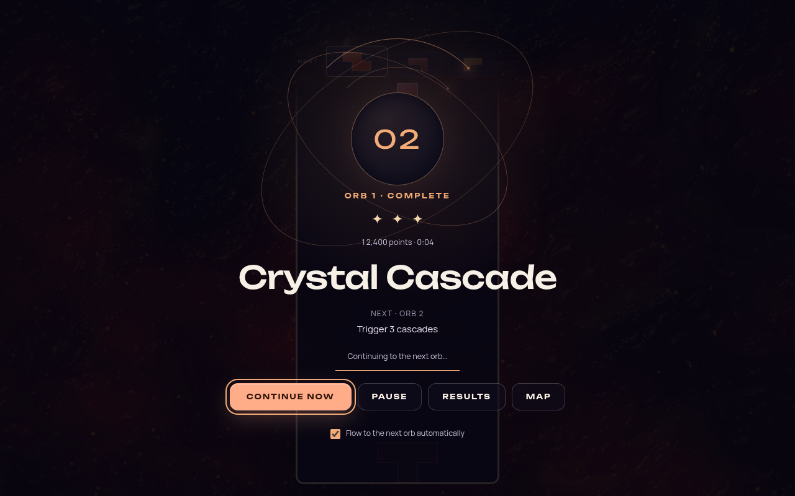
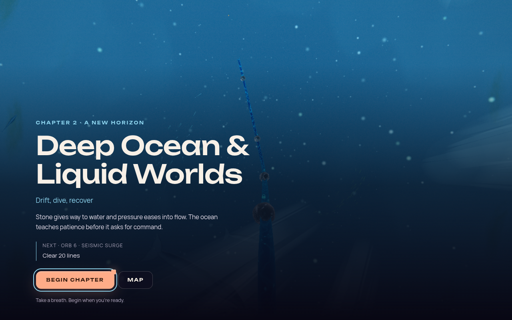

# Odyssey continuous journey experience

Status: implemented and validated, 2026-10-07. This document records the
current user-requested flow improvement, its source audit, references, and acceptance checks.
It does not reopen the difficulty benchmark campaign or prescribe a chapter-renderer rewrite.

## Problem and source audit

At baseline `2f03e15`, a successful orb ended in a results sheet. Dismissing it unconditionally
returned to the chapter map. Starting the next orb then required selection and a new launch.
This made navigation a repeated interruption between gameplay challenges.

| Evidence | Consequence |
| --- | --- |
| `OdysseyMode.completeLevel()` awaited `_showLevelResults()`, then always `returnToBoard()`. | No direct continuation path existed after a win. |
| `ResultsModal.js` exposed a single Continue action resolving the result sheet. | “Continue” meant return to map, rather than play the next orb. |
| `returnToBoard()` suspended gameplay themes, applied the board audio policy, and focused the completed orb. | Every win crossed presentation/audio boundaries and left the next destination to the player. |
| `launchOdysseyLevel()` prepared visuals and gameplay under blackout, then revealed and ran a start cue. | Re-entering through the map repeated the full entry sequence. |
| `BoardInfoOverlay.js` offered objectives and Play, but no journey-flow preference. | Players could not choose uninterrupted or deliberate progression before playing. |

These are source observations, not measured player-delay or frame-rate results. The parked
map already avoids some cold loading; this work must preserve that existing optimization.
The direct path still needs readiness checks, safe session retirement, and a playable board.

## Experience contract

Within a chapter, a saved win should lead directly into the next unlocked orb. A compact
reward acknowledgment shows the earned stars and next destination. The transition keeps a
continuous audiovisual identity while preparing the next level. No map visit, orb reselection,
or extra intro confirmation is required on this path.

The player remains in control. Before Play, a persistent **Continue automatically within
chapters** preference defaults on. Turning it off leaves continuation deliberate. During
automatic handoff, a visible pause/review action provides time to inspect results or leave.
Important objective information remains available instead of appearing only as transient text.
Gameplay must not begin unexpectedly while the page is hidden, and held inputs must not leak
from the finishing board or a confirmation into the next attempt.

Chapter boundaries are intentional resting points. Recognize the completed chapter, reveal
the next chapter's identity, and wait for a deliberate continuation action. The player can
rest or return to the map without losing progress. Finishing the last orb produces an Odyssey
completion state; it never requests an orb beyond the campaign.

Failures retain their retry/debrief loop. Optional mastery play must not be interrupted before
the existing finish policy ends the level. Unranked runs must retain their explicit unsaved
status and cannot silently unlock or enter a locked level.

Motion supports the journey without becoming another toll between orbs. Use the same portal
language at both scales, with restrained inter-orb motion and a larger chapter moment. Honor
reduced-motion preferences with a stable presentation or dissolve. Maintain meaningful
readiness feedback for slow preparation; do not fake a loading percentage or force a long
wait after the next board is ready.

## Online references and their application

All six references were retrieved and read on 2026-10-07. They provide creative inspiration
and design/accessibility guidance. They do not prove that a particular animation duration
or automatic progression rule improves Odyssey player flow.

| Source | Supported principle | Application here |
| --- | --- | --- |
| [Hydelic: creating Tetris Effect's soundtrack](https://blog.playstation.com/2020/05/28/inside-the-creation-of-tetris-effects-original-soundtrack-out-today/) | The composer describes jointly iterating music, visual adjustments, and particle movement to support the intended emotional experience. | Treat the transition as part of the chapter atmosphere, preserving ambience and coordinating feedback. |
| [Kellee Santiago: introducing Journey](https://blog.playstation.com/2010/06/17/introducing-thatgamecompanys-journey/) | The developer describes awe, mystery, and a distant destination that invites exploration. | Use the next chapter as an inviting visual destination, with restrained text and a clear action. |
| [Apple HIG: Motion](https://developer.apple.com/design/human-interface-guidelines/motion) | Success feedback should be brief and precise; motion should be purposeful, optional, and cancellable. | Avoid stacking repeated cinematics; let players pause or review instead of waiting through compulsory motion. |
| [Apple HIG: Loading](https://developer.apple.com/design/human-interface-guidelines/loading) | Load in the background while people see meaningful content; communicate actual progress and fit loading to the game. | Prepare the next board behind the bridge and keep its readiness explicit. |
| [W3C: Animation from Interactions](https://www.w3.org/WAI/WCAG22/Understanding/animation-from-interactions.html) | Nonessential interaction-triggered motion can be disabled, including through system preferences. | Reduced motion replaces portal travel and nonessential scale/rotation. This is not a whole-game conformance claim. |
| [Xbox Accessibility Guideline 116: Time limits](https://learn.microsoft.com/en-us/xbox/accessibility/xbox-accessibility-guidelines/116) | Players need enough time to read and act; non-gameplay UI limits should be adjustable or removable. | Manual continuation is available before play; chapter reveals wait for input. Existing gameplay deadlines are a separate concern. |

Apple's HTML pages require JavaScript; their full current text was read through the official
documentation endpoints for [motion](https://developer.apple.com/tutorials/data/design/human-interface-guidelines/motion.json)
and [loading](https://developer.apple.com/tutorials/data/design/human-interface-guidelines/loading.json).
Research notes are retained in `artifacts/odyssey-flow-2026-10-07/research-notes.md` locally.

## Acceptance checks

- A normal same-chapter win saves once and reaches the next unlocked orb without map navigation.
- Manual progression and pause/review provide unlimited reading time; the preference survives reload.
- Chapter boundaries and final completion wait for deliberate input; no missing or locked orb launches.
- Retry, replay, optional mastery, duel, and unranked session policies remain coherent.
- Abort, deactivation, fast repeated actions, and stale asynchronous work cannot launch twice or revive a retired session.
- Gameplay timers and inputs begin only after readiness; hidden-page transitions and held keys do not cause accidental play.
- Reduced motion, keyboard navigation, focus, narrow screens, and preparation errors remain usable.
- Browser captures verify actual transition composition and control visibility; source tests alone do not establish visual quality.
- Timing claims require measured completion-to-control and preparation intervals. No fixed improvement percentage is assumed.

## Implementation

- **Within chapters:** save the completed attempt, show a 2.6-second star/score acknowledgment,
  prefetch the successor, then prepare and reveal its board under the chapter-colored portal.
  This path never opens the map or invokes the full map-entry sequence. Continue now skips
  the acknowledgment timer; Pause, Results, Map, keyboard navigation and preference changes
  stop it. Opening Results returns to a manual continuation state.
- **Between chapters:** return to the retained world, keep map input locked during camera
  travel, retain the authored follow-camera panorama instead of zooming into the orb, then
  show the next chapter's name, narrative and first objective over the scenery.
  Begin chapter is deliberate; there is no timer. Map restores free exploration. The old
  short chapter toast is suppressed during this interlude. First orbs sit exactly on the
  position-driven 50/50 chapter seam; the reveal camera now settles just beyond the incoming
  seam using the shared seam schedule, while that first orb remains selected. All seven
  arrivals are checked against the actual chapter blend function. Ordinary map selection
  keeps its authored node position and focus.
- **Input and presence:** the portal remains the input owner through Ready/Go, even while
  transparent. Held keyboard/controller actions require release before the next board.
  Blur or hidden-page interruption requires Resume and a fresh Ready cue. Replays default
  to manual continuation; final and unranked results retain the detailed results path.
- **Loading and cancellation:** the next theme is prefetched during acknowledgment; actual
  preparation waits for theme/board readiness behind an opaque cover. The existing loading
  surface lease supports async pipelines. Map retains the cover until return blackout.
  Exact operation/session guards prevent late theme imports, retries, entry callbacks and
  return callbacks from reviving an abandoned attempt or restoring a map after mode exit.
  Map headers remain suppressed through gameplay entry and the chapter interlude.
- **Reduced motion:** application and OS preferences use short dark dissolves, stable rings,
  no portal canvas/camera zoom, and no Ready/Go scale pulse. This does not disable all motion
  in the underlying game themes.

UI orchestration lives in `src/ui/odyssey/odyssey-journey-flow.js`; presentation lives in
`JourneyFlowOverlay.js` and `public/styles/odyssey-flow.css`. Save/retirement logic is in
`src/core/game-modes/odyssey-completion.js`, with the mode providing presentation hooks.
This preserves the headless-core import boundary and the existing mode-size ratchet.

No authored objectives, gravity, deadlines, star thresholds or duel difficulty changed.

The saved acknowledgment below is from the real game with a synthetic completed goal.
CSS animations were settled for the static capture; the countdown remains a JavaScript
timer. The displayed score/time are fixture values, not player performance.



The chapter pause below is the corrected incoming-world vista. Its first orb stays selected
for Begin chapter; camera framing does not advance campaign progress.



## Reproducing browser checks

Start a development server, then use an independently installed Playwright and Chromium:

```sh
PLAYWRIGHT_MODULE=/absolute/path/to/playwright/index.mjs \
CHROMIUM_PATH=/absolute/path/to/chromium \
node scripts/validate-odyssey-flow.mjs --scenario all --base-url http://127.0.0.1:5173
```

The script also accepts an ordinarily resolvable `playwright` package and its managed
Chromium. It creates disposable browser contexts, seeds only their local storage, and uses
the development level launcher after the real menu-ready signal. A clearly labeled synthetic
goal fixture exercises the real completion/save/transition path. The interruption case dispatches a synthetic blur; it does
not simulate the operating system switching windows. No existing player save is modified.
Screenshots and JSON traces go to `artifacts/odyssey-flow/` (override with `--out`). Disable
development HMR while making simultaneous edits so captures cannot reload mid-scenario.

## Validation record

The full suite passes **8,553 tests across 657 files** on the final implementation:

```sh
npm test -- --maxWorkers=2
```

Coverage includes saved/unranked/final/replay routing, all seven chapter arrival blends,
single-start ownership, Map cancellation during pending work, stale theme/entry/return/retry
callbacks, focus loss during Ready, controller button release, keyboard repeat, preference
persistence, and reduced-motion entry/return transitions. An earlier run overlapped software
rendering, lint and bundling; a forest construction hook and its 300 ms timing assertion
failed under that contention. Both pass in the final uncrowded full run; their budgets and
implementation were not changed.

The overlay browser matrix has **11 passing checks**, using production views and application
styles at desktop, 320 px width, landscape and large text, including the chapter-to-transit
handoff. No horizontal clipping or browser errors were recorded. Longer layouts scroll.
These isolated UI checks complement the real-game completion fixtures below.

Typecheck, production build and boot closure, import boundaries, architecture fitness,
release gates and `git diff --check` pass. The lint ratchet remains at its existing baseline
of 813 errors with no added errors; this repository is not globally lint-clean. New
presentation/arrival helpers and the browser harness pass scoped lint. The OdysseyMode
line budget was lowered from 4,785 to 4,774 rather than raised.

Real-game Chromium/SwiftShader captures at 1280×800 verify:

| Scenario | Observed result |
| --- | --- |
| Orb 1 → 2, automatic | One save, one preparation/start, zero map returns and zero full map-entry calls. |
| Orb 1 → 2, OS reduced motion | The OS preference reaches the real overlay and direct handoff; the next orb starts once. |
| Orb 5 → 6, chapter boundary | The corrected ocean panorama holds for a 3.2-second assertion window with no preparation/start; Begin chapter then starts Orb 6 once. |
| Interrupted preparation | The prepared next orb remains stopped for a 3.2-second assertion window after synthetic blur; explicit Resume then starts it once, with zero map returns. |

Passing runs have no page or console errors. Local evidence is under
`artifacts/odyssey-flow-2026-10-07/verified/`; the two representative screenshots above are
committed. One earlier capture reloaded when Vite discovered a dependency. Another cold
source-orb entry hit the existing blackout timeout under software rendering and safely
returned to the map before the flow fixture began. These attempts are not counted as passes.
The harness now waits for the real menu-ready signal and reports a source-entry abort
immediately. No timeout, rendering budget or warm-up policy was relaxed.

This is software WebGL2, Minimal quality, with audio muted. These fixtures do not establish
native WebGPU performance, physical-controller behavior, audiovisual timing, human goal
comprehension or subjective flow. The committed script can reproduce them; native hardware
and a sound-on player session remain the acceptance check for those qualities.

Player observations remain necessary to judge whether the pacing feels fluid and the chapter
pause feels rewarding; automated tests cannot establish those experiential outcomes.

## Next player checkpoint

Use the existing separate playtest saves. Observe a new player and an experienced player
through a short sequence crossing Chapter 1 into Chapter 2. Record any missed objective,
unwanted continuation, accidental input, loading gap or difficulty finding Pause/Results.
Check whether they voluntarily rest at the chapter reveal and can immediately find Begin
chapter. Include one controller session and one reduced-motion session on actual hardware,
with sound enabled. Adjust the 2.6-second acknowledgment or ready beat only in response to
concrete observations. This is a focused experience check, not another broad bot campaign.
