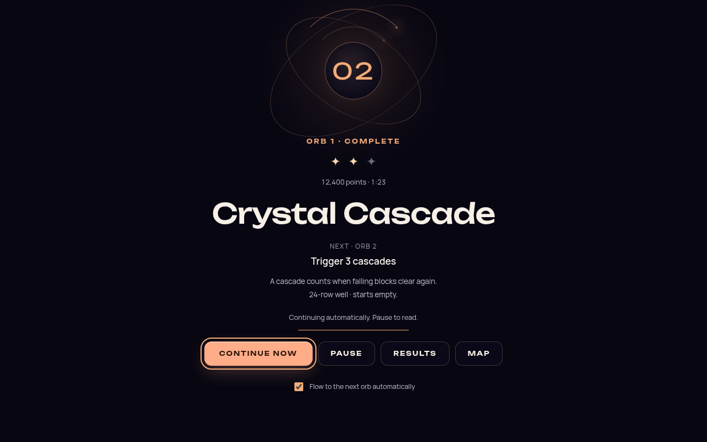
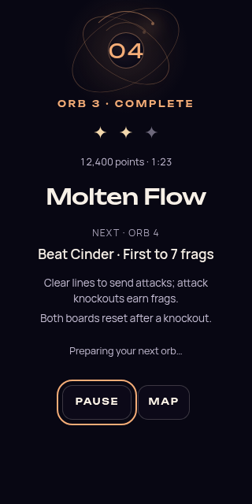
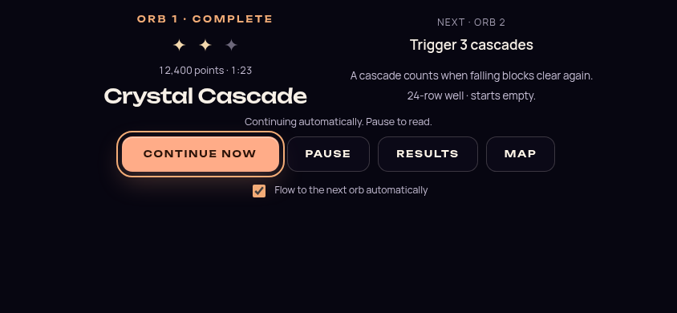

# Odyssey flow refinement — 2026-10-08

Status: implementation and validation record. This pass follows the user's instruction to
continue the [flow-state audit's recommendations](ODYSSEY_FLOW_STATE_RESEARCH_2026-10.md).
It improves next-orb comprehension, presentation continuity, entry protection and music
readiness. Authored objectives, gravity, star thresholds, progression and duel difficulty
remain unchanged. The [original continuous journey](ODYSSEY_FLOW_EXPERIENCE_2026-10.md)
remains the starting point; its older validation counts describe that earlier implementation.

The subsequent [world journey](ODYSSEY_WORLD_JOURNEY_2026-10.md) replaces the direct covered
within-chapter handoff with automatic emergence, authored path travel and orb entry. The
timing table and browser counts below describe the earlier direct handoff, not that scenic route.

## Player-visible changes

**The next goal survives the handoff.** A successful within-chapter completion now keeps the
same portal, reward, next title, goal and changed-rule elements during preparation. It no
longer removes the completion view and mounts another entrance. The old attempt releases
its exact outcome owner before preparation retires it; the journey operation then owns
cancellation and disposal. Results and Map remain optional, and chapter boundaries retain
their separate, untimed panoramic arrival.

**A goal is accompanied by useful rule context.** A shared briefing helper reads resolved
runtime configurations, including campaign tuning and duel overrides. It usually shows up
to two changed cues, with room for a third when deadlines or reversed controls require it.
Examples include how a cascade counts, an upcoming duel's attack-frag/reset rules, and a
taller well or seeded rows to clear. It does not imply that cascades only exist in infinity
mode. Relevant rules and deadlines remain visible below the gameplay objective, outside the
collapsed Level guide. During an optional showcase lap, the obsolete deadline reminder is
removed and the clock correctly shows elapsed time.

**Preparation can be paused for reading.** Pause now also works while the next board prepares.
Preparation may finish behind the portal, but play waits for explicit Resume and a complete
Ready cue. Automatic continuation still has its pre-play preference and completion Pause;
the 2.6-second acknowledgment has not been shortened. Static text explains automatic
continuation even when reduced motion hides the animated progress line.
If text enlargement or resizing places Pause outside the viewport, automatic continuation
holds locally and invites the player to continue when ready. It does not change their saved
continuation preference.

**Ordinary entry and retry have the same presence contract.** A transparent input/presence
owner exists before their preparation and through Ready/Go. Blur or a hidden page exposes
Resume; merely restoring focus does not begin play. A partly seen cue is repeated. Stop,
deactivation and Map dispose or cancel the exact owner, and prepared-session guards prevent
late work from starting a replacement attempt.

**Music fade-in no longer holds Odyssey's board preparation.** Odyssey requests playback
readiness once the selected media has actually begun playing. The music's existing fade-in
continues under its own switch owner. Other callers retain the previous full-fade wait.
Superseded selections, stop, cleanup and mute settle pending readiness; stale synchronization
cannot restart a previous selection. The player's selected-music/theme-linking policy stays
intact.

**Reading space stays stable.** The completion/transit composition uses a fixed top alignment
and a smaller reserved portal area. Changed rules use plain text, and the next goal has
stronger emphasis. Narrow screens keep Continue and Pause together where they fit; long or
enlarged text can scroll. Short landscape screens use a compact two-column composition
without the decorative portal so the goal, rules and controls fit. The chapter's panoramic
composition remains separate.

## Timing: fixed staging and audio are different measurements

The retained completion already covers the screen. It becomes opaque in place and allows
100 ms to paint before preparation, replacing the separate normal-motion 420 ms entrance.
Actual loading/readiness and the full Ready/Go cue are preserved.

| Source-derived fixed sequence | Before | After |
| --- | --- | --- |
| Normal-motion automatic within-chapter handoff | 4,140–4,520 ms | 3,820–4,200 ms |
| Reduced-motion automatic within-chapter handoff | 3,580–3,960 ms | 3,580–3,960 ms |

These are nominal code timings, not measured total transition latency, frame-rate results
or a claim about perceived flow. They exclude variable preparation, readiness, scheduling,
attempt settlement and voluntary holds. Continue now can skip acknowledgment. Portal fade
and board reveal overlap and are counted once. There is no claim that the reduced subtotal
is an empirically optimal duration.

A separate Chromium probe used the actual SoundManager, shipped MP3s, a user-gesture-enabled
AudioContext and gain-wired music volume of 0.35. It changed between the CinderDrift and
CrystalCave theme-linked tracks:

| Track change | Previous readiness wait | Playback readiness after change | Full fade still completes |
| --- | --- | --- | --- |
| CinderDrift → CrystalCave | 4,656 ms | 2,577 ms | 4,628 ms |
| CrystalCave → CinderDrift | 4,619 ms | 2,569 ms | 4,621 ms |

This removes roughly two seconds of waiting for fade-in **in that audio branch**. The
incoming media begins at zero gain and retains its normal fade, so playback readiness does
not mean immediate full-volume audibility. Same-track synchronization and a theme change
with theme-linked music disabled returned in under 1 ms in this probe. These are bounded
subsystem measurements, not full-game latency savings: visual work can overlap audio work,
and theme-linked music defaults off. This environment did not provide subjective listening
evidence. Local evidence: `artifacts/odyssey-flow-refinement-2026-10-08/audio/` and its `after/`
subdirectory.

The committed portable probe was also run successfully against the final source: five cases
under each policy, with changed-track readiness around 2.6 seconds versus 4.6 seconds and
the full fade preserved. That reproduction is in `audio/portable/`; it ran alongside unit
tests and is a functional confirmation, not an isolated hardware performance sample.

## Validation

The full Vitest suite passes: **8,592 tests across 659 files** with two workers and no
concurrent game-rendering captures. Focused coverage includes all 59 campaign briefings,
retained outcome ownership, Map/stop/replacement cancellation, reading holds, prepared-run
and Ready interruption, HUD deadlines and audio readiness/supersession.

The final source review found no blocking regression in retained ownership, cancellation,
reading holds, entry/retry presence or audio promise settlement. The lint ratchet passes at
the existing baseline (813 errors, 1,057 warnings, zero fatal). Architecture fitness,
TypeScript migration ratchet and the development release gate pass; OdysseyMode's line
ratchet shrank from 4,774 to 4,746. The production build and boot-closure check pass, as do
typecheck and import boundaries (1,246 modules, 3,974 dependencies). Both portable harnesses
pass syntax and scoped ESLint checks. Verification logs are under
`artifacts/odyssey-flow-refinement-2026-10-08/verification/`.

The actual overlay passed a **12-case layout matrix**: desktop 1280×800, phone 320×640,
landscape 844×390 and 200% root text at 640×800, each with effective 1→2, 3→4 and 6→7
briefings. Completion and transit retain the same modal, goal and changed-rule nodes with
**zero vertical goal displacement**. No horizontal clipping was observed. Pause/Resume
works, and the real automatic timer remains enabled when Pause fits and holds when enlarged
text puts it below the viewport. The enlarged 1→2 fixture remained held beyond 3.2 seconds
without a continuation choice. Desktop, phone and landscape captures were visually reviewed.

Passing real-game successor and reduced-motion cases each save once, prepare once, start
once and avoid map return. The chapter 5→6 case saves/prepares/starts once, returns through
the map once and keeps the new chapter reveal untimed beyond 3.2 seconds. Successor traces
also confirm DOM retention and visible HUD rules. Software rendering took substantial
variable preparation time; these captures do not establish hardware transition performance.

Ordinary map entry was interrupted during preparation and remained prepared but stopped for
3.2 seconds. Resume produced one Ready cue and one start. Retry was interrupted 150 ms into
Ready after a synthetic failure through the real debrief; it remained stopped for 3.2 seconds,
then Resume produced a second complete cue and exactly one start. Retry prepared once,
wrote no completion and
did not return to the map. The interrupted successor also held for explicit Resume and
completed exactly one save, preparation and start without a map return. All **six runtime
scenarios pass**, with no browser page errors or console errors in the passing captures.
The three interruption fixtures used the existing source-theme prefetch and synthetic blur;
they do not simulate OS window switching or prove cold-entry performance.

Local reports and screenshots are under `artifacts/odyssey-flow-2026-10-08/`: UI evidence in
`final/ui/`, successor evidence in `runtime/live-within/` and `runtime/live-reduced/`,
chapter evidence in `final/live-chapter/`, and interruption evidence in `final/live-interrupted/`,
`final/live-entry-interrupted/` and `final/live-retry-interrupted/`.
Earlier Vite hot-reload/dependency-optimizer reloads are preserved separately and not counted
as passes. Software-rendered cold-source entries also hit the existing prewarm blackout
timeout before the flow fixtures; the game safely returned to the map. One transit fixture
assertion was corrected to accept both valid covered preparation phases before its passing
rerun. No readiness budget was relaxed to obtain evidence.

Representative captures use the actual overlay and campaign configurations in disposable
UI fixtures. They verify composition; the rewards are fixture data, not player outcomes.







## Reproduction and next experience check

The portable browser harness uses disposable contexts and synthetic completion/blur events.
It does not modify an existing player save or claim human performance:

```sh
PLAYWRIGHT_MODULE=/absolute/path/to/playwright/index.mjs \
CHROMIUM_PATH=/absolute/path/to/chromium \
node scripts/validate-odyssey-flow.mjs --scenario all --base-url http://127.0.0.1:5173
```

At this revision, `all` ran six real-game scenarios; the later world-journey harness adds
scenic pause and Map cases. Use `--scenario ui` separately for the layout matrix.
Use the harness's `--help` for individual successor, chapter, retry and map-entry cases.
`--warm-source` awaits the game's existing source-theme prefetch before entry and records
that setup. It does not bypass entry budgets or provide cold-load evidence.
The isolated audio probe compares both synchronization policies with actual shipped tracks,
a playback-authorizing click and a fresh context for each policy:

```sh
PLAYWRIGHT_MODULE=/absolute/path/to/playwright/index.mjs \
CHROMIUM_PATH=/absolute/path/to/chromium \
node scripts/validate-odyssey-audio.mjs --base-url http://127.0.0.1:5173
```

Run native hardware with sound, a real controller and actual window switching for the
remaining platform checks. The [bounded player study](ODYSSEY_FLOW_STATE_RESEARCH_2026-10.md#a-bounded-validation-plan)
remains the next subjective checkpoint: observe uninterrupted play first, then ask about
goal comprehension, continuity, control and comfort. Do not treat these automated fixes as
proof that players experience flow or restart broad difficulty benchmarking to answer that
question.
