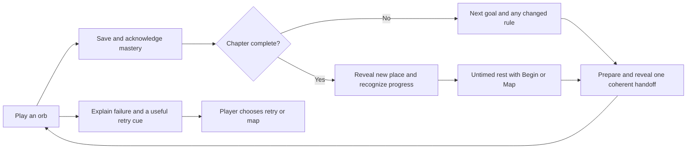

# Odyssey flow state: research and experience audit

Status: **Reference**, 2026-10-08. Source baseline: `2aad168` on
`codex/odyssey-journey-balance`. This is a research and UX audit of the
[implemented continuous journey](ODYSSEY_FLOW_EXPERIENCE_2026-10.md), with recommendations
for the next design pass. It changes no gameplay, difficulty, animation or audio behavior.
Recommendations are proposals, not validated player outcomes or a new architecture backlog.

Implementation follow-up: [flow refinement](ODYSSEY_FLOW_REFINEMENT_2026-10.md) addresses
the first comprehension, handoff, control, presence and audio priorities. The source audit
below remains a snapshot of `2aad168`; automated implementation checks do not replace the
player study or resolve every chapter-motion question.

## Recommendation

Keep automatic progression within chapters and the untimed chapter reveal. The next
improvement should make the handoff **understandable, continuous and under the player's
control**. Prioritize changed-rule comprehension, the complete completion-to-play sequence,
and sound-on loading behavior before adding more visual effects.

The intended rhythm is **learn → perform → feel mastery → move forward**, with room to
recover and anticipate at chapter boundaries. This rhythm is a design hypothesis informed
by the sources below. Research cannot guarantee that a particular interface puts someone
into flow, and none of the sources establishes 2.6 seconds as an ideal acknowledgment time.

## What we mean by flow

Flow describes absorbed, relatively effortless concentration during an activity. Clear
goals, usable feedback, a sense of control and challenge appropriate to the player are
plausible supporting conditions. They are not a checklist that certifies the experience.
An attractive vista can produce immersion or awe without producing active-play flow;
finishing levels, playing longer or clicking less does not establish flow either. [R1–R5]

For Odyssey, evaluate these separately:

| Quality | Player question | Observable evidence that helps, but does not prove it |
| --- | --- | --- |
| Continuity | Did the game keep my attention on playing? | Unwanted navigation, repeated confirmation, loading stalls, attention shifts. |
| Comprehension | Did I know what to do before the next attempt began? | Missed rule changes, opening mistakes, help seeking, recalled objective. |
| Competence and challenge | Was this demanding in a way I could learn? | Failure reason, retry strategy, perceived challenge and skill; not win rate alone. |
| Agency | Could I slow down, inspect, leave and return when I wanted? | Discovery and successful use of Pause, manual continuation, Map and Resume. |
| Absorption and enjoyment | Did attention feel natural, and was the experience enjoyable? | Player reports after a sequence; neither is inferred from session length. |
| Recovery and meaning | Did the chapter feel like an earned arrival and a useful rest? | Voluntary resting, recollection of the new destination, comfort and fatigue reports. |

## Online evidence and its limits

Sources were retrieved on **2026-10-08**. “Full text” below means the relevant conceptual,
method, result or discussion passages were inspected, not that every page was exhaustively
reviewed. This is a targeted evidence review, not a systematic literature review. Primary
research, official guidance and developer accounts are distinguished deliberately.

| ID and source | Evidence and supported finding | Application to Odyssey; limits |
| --- | --- | --- |
| **R1. Sweetser & Wyeth (2005), [GameFlow](https://doi.org/10.1145/1077246.1077253)** | A literature-derived evaluation framework covering concentration, challenge, skills, control, goals, feedback, immersion and social interaction; initially applied through expert reviews of two strategy games. | Useful for auditing unnecessary navigation, readable goals and feedback. A design heuristic, not causal evidence that a portal or auto-start induces flow. Solo Odyssey does not need every social criterion. |
| **R2. Ryan, Rigby & Przybylski (2006), [The Motivational Pull of Video Games](https://selfdeterminationtheory.org/wp-content/uploads/2020/10/2006_RyanRigbyPrzybylski_MandE.pdf)** — full author-hosted paper | Four studies connect perceived competence and autonomy with enjoyment and motivation; intuitive controls relate to need satisfaction. Several central relationships are correlational. | Preserve clear stopping and review choices. Automatic progression should feel chosen. This does not prove which default or button arrangement works best, or equate motivation with flow. |
| **R3. Engeser & Rheinberg (2008), [Flow, performance and moderators of challenge-skill balance](https://www.uni-trier.de/fileadmin/fb1/prof/PSY/PGA/bilder/Engeser___Rheinberg_2008.pdf)** — full university paper | Three studies, including Pac-Man, show that challenge-skill relationships depend partly on context, perceived importance and achievement motive. Flow is measured separately from its proposed conditions. | Segment player experience and ask about challenge, confidence and pressure. Neither a steadily rising curve nor a target win rate is a universal flow formula; context differences also limit causal interpretation. |
| **R4. Jennett et al. (2008), [Measuring and defining the experience of immersion in games](https://www-users.york.ac.uk/paul.cairns/pubs/JennettIJHCS08.pdf)** — full university paper | Distinguishes immersion from flow, presence and enjoyment. In its simple pacing experiment, faster/increasing pace affected anxiety and negative affect without significant immersion differences. | Measure comfort and enjoyment alongside absorption. Extra speed or spectacle is not automatically beneficial. The experimental tasks do not establish optimal Odyssey pacing. |
| **R5. Joessel, Pichon & Bavelier (online 2023; issue 2024), [A video-game-based method to induce states of high and low flow](https://link.springer.com/article/10.3758/s13428-023-02251-w)** — full open paper | Three experiments, over 90 participants, produced different reported flow using personalized FPS difficulty while keeping participants on task. Physiological measures did not distinguish the high/low-flow conditions. | Compare UX variants at matched challenge and collect player reports. Good performance, continued activity and arousal do not certify flow. This FPS paradigm is not a puzzle-transition experiment. |
| **R6. Larche & Dixon (2020), [Skill-challenge balance, game expertise, flow and urge to keep playing](https://real.mtak.hu/138655/1/article-p606.pdf)** — full archived journal paper | In 60 experienced Candy Crush players, regular and hard conditions produced comparable reported flow, while hard games were more frustrating; easy games produced the least flow. | Track frustration separately from absorption. Difficulty includes decision complexity as well as speed. Selected experienced players and a two-item GEQ flow measure limit generalization; these results do not justify making every orb harder. |
| **R7. Bailey & Konstan (2006), [On the need for attention-aware systems](https://doi.org/10.1016/j.chb.2005.12.009)** — [university abstract](https://experts.umn.edu/en/publications/on-the-need-for-attention-aware-systems-measuring-effects-of-inte/) inspected | A controlled computer-task experiment, N=50, found worse errors, annoyance and completion time when peripheral information interrupted primary tasks than when it appeared between tasks. | Put substantial optional review at meaningful boundaries. This is a transfer hypothesis from computer work, not game-flow evidence; it does not show that every post-orb acknowledgment is harmful. |
| **R8. Albulescu et al. (2022), [Micro-break systematic review and meta-analysis](https://journals.plos.org/plosone/article?id=10.1371/journal.pone.0272460)** — full open paper | Across 22 samples, N=2,335, short breaks had small positive effects on vigor and fatigue; the overall performance effect was not statistically significant. Optimal duration remains uncertain. | Let the chapter pause become a real, voluntary rest. Work/student studies do not prescribe chapter length or imply that a 2.6-second animation is restorative. |
| **R9. Microsoft, [Xbox Accessibility Guideline 116: Time limits](https://learn.microsoft.com/en-us/xbox/accessibility/xbox-accessibility-guidelines/116)** — full official guidance | Non-gameplay UI timers should be avoidable or adjustable and allow sufficient reading time. Essential gameplay time constraints are a separate concern. | Keep the pre-play manual preference, Pause and untimed chapter Begin. Verify discovery before the first timer; an available control can still be missed. Guidance, not a flow experiment or a conformance certification. |
| **R10. Microsoft, [Xbox Accessibility Guideline 117: Visual distractions and motion](https://learn.microsoft.com/en-us/xbox/accessibility/xbox-accessibility-guidelines/117)** — full official guidance | Moving backgrounds can obstruct reading even when the text is stationary. Guidance includes disabling, pausing or hiding motion and supporting opaque text backgrounds. | Audit the scenery behind chapter text as well as portal motion. Reducing transition animation alone does not establish comfortable reading. Scope this separately from necessary gameplay motion. |
| **R11. Hydelic (2020), [Creating Tetris Effect's soundtrack](https://blog.playstation.com/2020/05/28/inside-the-creation-of-tetris-effects-original-soundtrack-out-today/)** — full composer account | Describes iterative work between music, visual adjustments and particle movement to develop an emotional experience. | Review sound, motion and feedback together, using a sound-on build. This is creative practice, not proof of a universal tempo, crossfade duration or flow effect. |
| **R12. Kellee Santiago / thatgamecompany (2010), [Introducing Journey](https://blog.playstation.com/2010/06/17/introducing-thatgamecompanys-journey/)** — full developer account | Describes awe, mystery, scale and a visible distant destination that invites exploration. | Let chapter arrivals communicate place and anticipation. This is an inspiration for composition and meaning, not experimental evidence that panoramic reveals cause flow. |
| **R13. Law, Brühlmann & Mekler (2018), [GEQ systematic review and validation](https://figshare.le.ac.uk/articles/conference_contribution/Systematic_Review_and_Validation_of_the_Game_Experience_Questionnaire_GEQ_Implications_for_Citation_and_Reporting_Practice/10208981)** — repository abstract only; PDF unavailable | Reports a review of 73 publications and a validation study, N=633, without support for the original seven-factor GEQ structure. Published at CHI PLAY 2018; repository deposit is 2019. | Avoid a homemade composite presented as a validated “flow score.” This abstract does not establish which replacement instrument is best for Odyssey. |
| **R14. Player Experience Inventory authors, [instrument](https://playerexperienceinventory.org/instrument) and [usage guide](https://playerexperienceinventory.org/docs)** — official model and guidance | Separates functional qualities such as goals, feedback and control from experiences such as mastery, autonomy, meaning and immersion. Warns that altered item/construct selections are unvalidated variants. | Use a published instrument intact when making a formal player-experience claim, or label custom questions as diagnostics. PXI immersion is not itself a direct measure of flow. |

R1's relevant full-text passages were initially inspected through a
[transcription of the original paper](https://www.readkong.com/page/gameflow-a-model-for-evaluating-player-enjoyment-in-games-4126799).
The DOI identifies the primary source; its [QUT repository record](https://eprints.qut.edu.au/44776/)
is linked from [coauthor Peta Wyeth's university profile](https://www.qut.edu.au/about/our-people/academic-profiles/peta.wyeth).
Institutional/publisher full text was not accessible during this review. Official motion/loading and W3C guidance from the
earlier implementation remain linked in the [experience record](ODYSSEY_FLOW_EXPERIENCE_2026-10.md#online-references-and-their-application).

## Audit of the current journey

This audit inspected the source and the two committed browser captures. It did not conduct
a new human playtest, listen to the soundtrack, or measure native GPU performance.
File/line references below describe the audited commit; future edits can move them.

### What already supports the intended experience

- Successful saved runs progress directly to an unlocked successor. The normal within-chapter
  path avoids the map and a second launch confirmation. Replay, final and unranked policies
  retain their deliberate handling.
- A completion shows earned stars, score/time and the next primary goal. Full results are an
  optional detour; returning from them does not restart the timer.
- Auto-continuation can be disabled before playing. Pointer interaction, keyboard navigation
  and Pause stop the acknowledgment timer. Chapters wait indefinitely for Begin or Map.
- The successor handoff keeps input ownership through readiness and Ready/Go. Visibility
  loss requires Resume and a fresh cue; held inputs must be released.
- Chapter arrivals reveal the incoming world beyond its blend seam. Reduced motion removes
  portal movement and chapter camera travel while retaining the destination and controls.
- Failed attempts explain objective progress and give a relevant practice cue. This supports
  learning; optional mastery remains distinct from completing the journey.

The existing automated/browser evidence establishes those bounded behaviors, not player
flow. Its real-game fixtures used software WebGL2, Minimal quality, muted audio and synthetic
goal completion. See the [validation record](ODYSSEY_FLOW_EXPERIENCE_2026-10.md#validation-record).

### Findings to carry into the next pass

| ID / priority | Source observation | Experience risk or opportunity | Concrete next action |
| --- | --- | --- | --- |
| **A1 — First: changed-rule comprehension** | [JourneyFlowOverlay.js:92](../src/ui/odyssey/JourneyFlowOverlay.js#L92) renders only `victory.primary`; [OdysseyHUD.js:172](../src/ui/odyssey/OdysseyHUD.js#L172) creates a collapsed Level guide. The direct route bypasses the map's longer briefing. | A player can know the numerical target yet miss a new board shape, duel or deadline. This is a verified information difference; actual confusion is unmeasured. R1/R9. | Make a compact “what changes next” cue available across the handoff and ready board. Test first encounters before deciding whether a particular mechanic needs a deliberate, one-time orientation. Keep familiar orbs automatic. |
| **A2 — First: accumulated fixed pacing** | [Overlay:8](../src/ui/odyssey/JourneyFlowOverlay.js#L8), [cover/reveal:256](../src/ui/odyssey/JourneyFlowOverlay.js#L256), [cue timings:1816](../src/core/game-modes/OdysseyMode.js#L1816) and [board reveal:3788](../src/core/game-modes/OdysseyMode.js#L3788) schedule multiple phases. | The player experiences more than the 2.6-second acknowledgment. Several separate visual resets may feel repetitive. That perception needs testing. | Measure completion-to-control; compare the current sequence with one coordinated acknowledgment/goal/reveal beat. Preserve a fair start cue and all control/readiness guards. |
| **A3 — First: sound-on preparation** | [OdysseyMode.js:1524](../src/core/game-modes/OdysseyMode.js#L1524) awaits audio sync. [sound-manager.js:887](../src/audio/sound-manager.js#L887) can await a track switch; its default fades are 2,500 ms out and 2,000 ms in ([line 63](../src/audio/sound-manager.js#L63)). | A changed track can make audio fade completion part of preparation latency. The existing muted captures do not establish musical continuity or sound-on wait time. Theme-linked music defaults off, so this is conditional. R11. | Record same-track and changed-track handoffs with sound on and theme linking both off/on. Establish when the next track is safely playing versus when its fade finishes before considering changes to the readiness contract. |
| **A4 — First: readable, discoverable control** | [Overlay:110](../src/ui/odyssey/JourneyFlowOverlay.js#L110) has Continue now, Pause, Results, Map and a preference. Focus/pointer interactions hold the timer; [reduced-motion CSS](../public/styles/odyssey-flow.css#L160) hides the animated progress line. | Controls exist, but a new player has 2.6 seconds to notice them unless they already chose manual mode. Reduced motion still permits auto-advance, with less timing information. R2/R9. | Test unprompted stopping and manual-preference discovery. If needed, add a static, readable auto-advance indication and clearer first-use explanation; do not require players to disable accessibility settings. |
| **A5 — First: consistent presence protection** | Successor entry uses [runOdysseyFlowReadyCue](../src/ui/odyssey/odyssey-journey-flow.js#L140). Retry calls Ready then `beginLevelRun` directly ([OdysseyMode.js:2203](../src/core/game-modes/OdysseyMode.js#L2203)); ordinary map entry has a separate path. | Protection proven for automatic successors should not be assumed to cover every entry. Possible hidden-start gap, identified by source review, not reproduced here. | Add a focused visibility/focus-loss check during retry and ordinary map-entry preparation/Ready. Fix any reproduced invisible start before shortening transitions. |
| **A6 — Next: calm chapter reading** | [Chapter CSS](../public/styles/odyssey-flow.css#L137) places narrative over a translucent scenic gradient. Reduced-motion handling does not stop all underlying world/theme animation. | A stationary title can still compete with scenery, especially for motion-sensitive readers. R10. | Observe actual animated chapter scenes with reduced motion and large text. Provide a stable reading treatment if needed; scenery, color and sound can retain identity without continuous movement. |
| **A7 — Next: visual hierarchy** | The [completion capture](images/odyssey-flow/orb-completion.png) makes the upcoming name prominent while showing completed-orb stars, score and the next orb number simultaneously. | Accomplishment and anticipation share attention. The smaller objective may be overlooked; this is a design hypothesis, not an observed error. | Ask what was completed and what comes next after silent play. Strengthen the goal/change cue before enlarging spectacle. Keep optional result details accessible. |
| **A8 — Next: a meaningful chapter breath** | The [chapter capture](images/odyssey-flow/chapter-arrival.png) has identity, narrative, first objective and untimed Begin/Map. Travel is 2.2 seconds in normal motion ([flow:216](../src/ui/odyssey/odyssey-journey-flow.js#L216)). | This is a useful destination and resting point. It may need clearer recognition of the completed chapter, but adding another results page would add a new stop. R8/R12. | If players miss the sense of accomplishment, add one restrained completed-chapter acknowledgment within the same arrival. Keep rest voluntary and Begin immediately understandable. |
| **A9 — Later, informed by players: challenge cadence** | The journey combines standard/infinity boards, duels, objectives, modifiers and optional mastery. The new transition does not alter their difficulty. | Increasing pace, complexity and presentation pressure together can obscure the cause of frustration. A smooth UI does not repair an unfair or misunderstood challenge. R3/R6. | Use existing balance evidence plus observed failures to address specific comprehension/fairness problems. Preserve opportunities to consolidate a learned skill; do not restart a broad bot campaign or add adaptive difficulty without a concrete need. |

### The timing that should actually be measured

For an automatic, uninterrupted within-chapter handoff, the source-derived fixed subtotal is:

| Phase | Normal motion | Reduced motion |
| --- | --- | --- |
| Completion acknowledgment, unless skipped/held | 2,600 ms | 2,600 ms |
| Cover wait | 420 ms | 100 ms |
| Board reveal and portal fade, overlapping | max(420, 360) = 420 ms | max(180, 100) = 180 ms |
| Ready + Go, according to drop interval | 700 / 890 / 1,080 ms | 700 / 890 / 1,080 ms |
| **Fixed subtotal** | **4,140–4,520 ms** | **3,580–3,960 ms** |

These are code timings, **not measured wall-clock latency or guaranteed bounds**. Completion
settlement, scheduling, loading-surface readiness, theme/game preparation and readiness checks
can add time. Player Pause/Results/Map/hidden-page holds can add deliberate time. Continue now
skips the acknowledgment wait. The cover and reveal values must not be mistaken for download
time, and the overlapping reveals must not be summed twice.

Theme prefetch begins during acknowledgment, but gameplay/theme activation still occurs
under the cover ([flow:174](../src/ui/odyssey/odyssey-journey-flow.js#L174)). A pending audio
switch can include sequential fade-out, source change and fade-in; its nominal fade total is
4.5 seconds. Some of this can overlap other preparation. Do not add 4.5 seconds to every
handoff or report it as measured silence.

## Proposed experience for the next iteration

This is a design direction to prototype and test, not a claim that the current code already
implements every detail.

**Within a chapter:** keep the board or its visual identity legible through a concise reward
beat. Maintain one next-goal message across preparation and the incoming board. Let the
portal transform that same composition instead of asking attention to restart on several
unrelated screens. Continue now, Pause, Results and Map remain available at appropriate safe
points; the map stays optional. This visual continuity is a hypothesis to evaluate, not a
reason to remove readiness cover or begin gameplay early.

**At a new mechanic:** announce the meaningful difference, using resolved runtime level data.
Examples in the current campaign are 1→2 (cascade goal and infinity board), 3→4 (first bot
duel), and 6→7 (taller infinity board with more starting rows). A short cue should explain
what the player needs to notice; it should not dump configuration values. If a first encounter
remains confusing, try an inspectable, deliberate orientation for that mechanic only. Do not
bring back a mandatory launch sheet for every orb. Keep the goal available during play.

**Between chapters:** shift from action to arrival. Recognize the completed chapter within
the same composition, reveal the new landscape and sound, and offer a brief invitation to
the next challenge. Let the player linger, stop or begin. Avoid stacking a chapter score
sheet, reward ceremony, narrative page and launch dialog. No minimum rest countdown is
supported by the research. Longer reading must not require tolerating moving scenery.

**During play and retry:** keep useful feedback close to the player's decisions. Visual and
audio reactions should communicate success, danger or mastery while protecting piece/HUD
readability. The failure debrief should help the player choose a better next action. Test
whether it does; extra punishment, speed or decoration is not a substitute for learning.

## A bounded validation plan

### First round: observe the current experience

Use **8–12 players** across newer, returning and experienced puzzle players, including relevant
reading, motion and input-access needs. This is a pragmatic formative sample for finding
problems, not a powered experiment or a population estimate. Use disposable playtest saves,
real play, sound and native hardware. Include keyboard and physical controller sessions.

Observe a manageable sequence through Chapter 1 into Chapter 2, including a changed mechanic.
Use the existing separate saves to reach a later transition if a participant cannot reach it
within the session; record that distinction. Do not coach them through Pause discovery or ask
them to think aloud throughout active play. Review short recordings retrospectively at an
untimed chapter boundary or after the sequence. Do not insert a survey after every orb.

Collect this uninterrupted baseline and its retrospective report **before** directed tasks
such as finding Pause/Map or deliberately switching windows. Run those usability and
robustness checks afterward and label them separately. Do not attribute a concentration
break caused by the test procedure to the game. Set a practical session time cap in advance;
reaching every listed orb is not a condition for a participant to finish.

Include these cases across the round, without making every player repeat the full matrix:

| Case | What it resolves |
| --- | --- |
| Familiar successor and first cascade/infinity encounter, including 1→2 | Whether automatic continuation preserves concentration and teaches the upcoming task. |
| 3→4 first duel; 5→6 chapter arrival; 6→7 geometry change | Whether a primary-goal label is enough when the task or board changes. These examples use compiled levels, not stale base definitions. |
| Auto and manual preference; intentional Pause/Results/Map | Whether control is discoverable and the player can read or leave without rushing. |
| Blur/tab switch during successor, retry and ordinary map entry | Whether all entry paths wait for a present, ready player; test actual window changes as well as automation. |
| Reduced motion, large text, real controller | Whether reading, focus and deliberate continuation work on the intended inputs/settings. |
| Sound-on same/changed track, theme linking off/on; warm and cold preparation | Whether audio or loading creates perceptible gaps, competing cues or long covered waits. |

### Record technical delay separately from experience

Use a monotonic trace or synchronized recording with `completion committed`, `acknowledgment
shown`, `continue requested`, `cover ready`, `preparation ready`, `board playable`, `cue ended`,
`run started` and `first valid input`. Also record voluntary holds, visibility changes, results
visits and cancellation. These are proposed measurements, not telemetry added by this audit.

Report completion-to-control and preparation delay by route, motion setting, device and
audio configuration. Keep voluntary waiting separate; first-input delay also includes player
hesitation or choice. With a small sample, show individual traces and median/range; do not
present a sparse p95 or a single universal “flow score.” Record comprehension mistakes,
unwanted starts, accidental input and attempts to stop alongside the timings.

Ask a few brief questions at the natural pause, with concrete follow-ups:

- Did play feel continuous, or did something pull your attention away? What was happening?
- What did the next orb ask you to do, and what changed from the previous one?
- Did you feel rushed or able to pause and inspect when you wanted?
- Was the challenge manageable, too familiar or overwhelming? What made it feel that way?
- Did the chapter arrival feel rewarding and comfortable? Would you have preferred to rest?

These are **custom usability diagnostics**, not a validated flow scale. For a formal later
claim, select an appropriate published instrument, preserve its administration/scoring and
report its limits. R13/R14 caution against casually mixing selected items. Keep absorption,
control, enjoyment, challenge and fatigue distinct rather than averaging them into a new score.

### Second round only if the observations justify it

Test one targeted alternative against the current version: for example, a more unified
handoff after improving changed-rule clarity. Counterbalance order, keep levels, difficulty,
input and audio comparable, and account for learning from repeated play. Do not simultaneously
change gravity, rewards, transition duration and music, because the cause of any improvement
would be unclear. A shorter handoff wins only if comprehension, control and comfort are
preserved and participants report better continuity.

### When this pass is done

Close this UX pass after reproducible lifecycle/input defects are fixed and focused retests
show the affected paths working; recurring comprehension, control or reading problems from
the formative round are addressed; and sound-on hardware checks explain any long handoffs.
Use the same criteria for both motion settings. A single severe unwanted start requires a
fix; repeated confusion deserves a design change. Successful fixes do not establish a
statistical increase in flow across all players.

Do not keep running broad automated balance campaigns to answer subjective UX questions.
If preferences remain mixed without usability failures, preserve player choice and record
the uncertainty. A larger controlled study is warranted only for an unresolved comparison
or a stronger quantitative claim.

## Recommended order of work

1. Verify retry/map-entry presence protection and measure complete handoffs with sound on.
2. Prototype persistent goal/change cues for the actual mechanic transitions; preserve manual
   reading and existing progression rules.
3. Observe the current pacing, then test one simpler handoff if repeated resets are a problem.
4. Refine chapter recognition, calm reading and audiovisual continuity using those findings.
5. Retest only the changed paths and keep the existing difficulty work as the baseline.

The desired outcome is a journey that feels coherent and demanding while letting players
understand, learn and choose their pace. Faster starts and more animation are useful only
when they support that experience.
