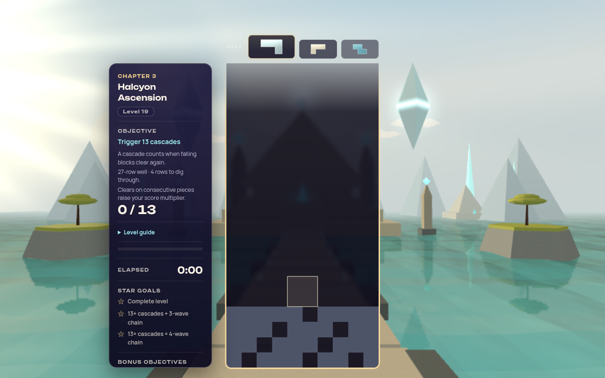
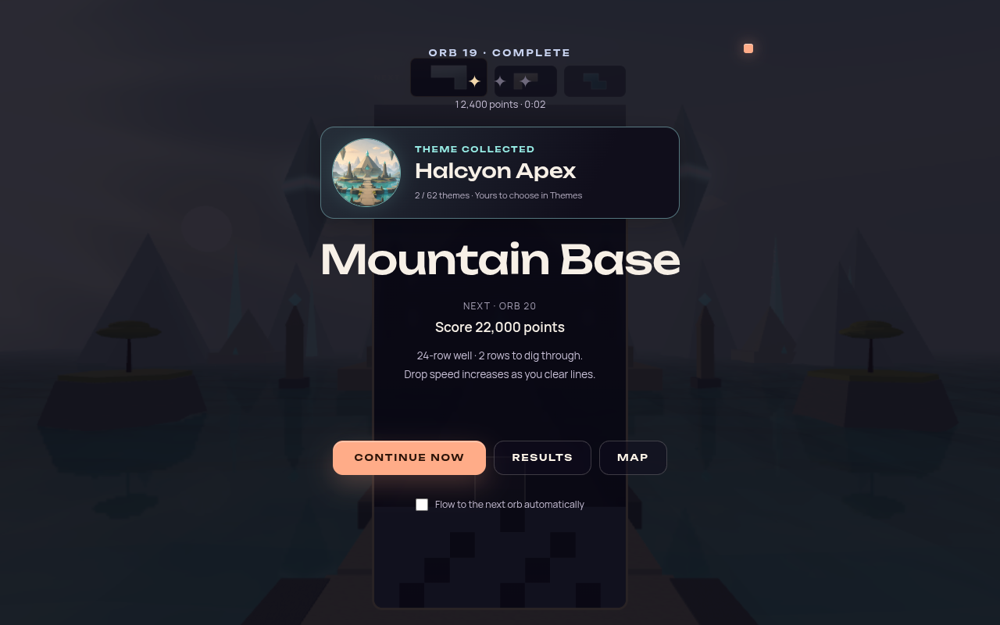

# Odyssey: unique orb themes and chapter fit

Status: **Reference — implemented and locally validated; native playthrough remains open.**
Date: 2026-10-08.

Every Odyssey orb now has its own theme. The campaign retains **59 orbs in eight chapters**,
using **59 distinct themes** from the **62-theme catalog**. Forest remains the starter theme;
Vesper Chrysalis and Serenity Warp remain additional completion rewards. Orb IDs, chapter
sizes, objectives, difficulty, scoring, and progression order are unchanged. Orb names and
descriptions are aligned with the scenes players actually enter.

The explicit placement requirements are **Cinder Drift at orb 1 in Earth Core & Subterranean
Origins** and **Neon Dusk at orb 57 in Urban Dreams Encore, chapter 8**. These are content
contracts, alongside global uniqueness, rather than suggestions based on the collection's
category labels.

This audit supplements the [theme collection design and research](THEME_COLLECTION_PROGRESSION_2026-10.md).
It changes the earlier proposed chapter/milestone allocation: eight former bonus themes now
have their own orbs, and the two remaining bonuses are listed below. No additional external
research was required to determine which scenes fit the authored chapters.

## How the placements were assessed

The audit used the composed campaign, current theme implementations, their shared scene/effect
modules, shipped art-direction records, and existing screenshots. A theme's visible subject
and spatial setting carry more weight than its name or registry category. For example, Void
Ember depicts stellar energy, Chiral Gold is a reflective hall of geometric gold towers, and
Shifting Sands is an alien desert under twin suns. Their previous bonus/category associations
do not establish their best chapter.

The intended arc remains underground heat and minerals → liquid worlds → living surface →
mountains → atmosphere → cosmic space → abstraction → a neon encore. Each chapter includes
threshold scenes where that helps the next transition. The mapping is an art-direction
judgment with explicit compromises; it is not a claim that every scene is a literal match.

## Complete orb assignment

### Chapter 1 — Earth Core & Subterranean Origins, orbs 1–5

Heat, mineral structures, and enclosed caverns give this opening the strongest geological
identity. The glowing cave at its end introduces life and wet surfaces before the ocean.

| Orb | Theme | Scenery fit |
|---|---|---|
| 1 | Cinder Drift (`cinder-drift`) | Volcanic core, magma, rock, smoke, and embers establish the underground origin. |
| 2 | Crystal Cave (`crystal-cave`) | A rock hall, mineral crystals, and a reflective pool remain explicitly subterranean. |
| 3 | Geode (`geode`) | Mineral and crystalline geometry continues the journey through the earth. |
| 4 | Pyrestorm (`pyrestorm`) | Fire and molten energy provide the chapter's intense volcanic scene. |
| 5 | Bioluminescence (`bioluminescence`) | Glowing mushrooms, crystals, spores, and wet cave surfaces bridge geology and life. |

### Chapter 2 — Deep Ocean & Liquid Worlds, orbs 6–11

This chapter covers water as an environment, from submerged reefs to ponds, surf, and still
surfaces. Bioluminescence II adds a glowing cavern reef while Misty Lake moves into chapter 3,
giving the following chapter a wooded shoreline arrival.

| Orb | Theme | Scenery fit |
|---|---|---|
| 6 | Ocean (`ocean`) | Underwater kelp, coral, fish, and volumetric light establish ocean depth. |
| 7 | Luminous Tides (`luminous-tides`) | Bioluminescent water, plankton, waves, and caustics extend the liquid-world identity. |
| 8 | Koi Pond (`koi-pond`) | A pond sanctuary introduces a more intimate aquatic habitat. |
| 9 | Waves (`waves`) | A sculpted, sunlit surf barrel explores water in motion. |
| 10 | Bioluminescence II (`bioluminescence-2`) | A glowing cavern reef extends the chapter's luminous aquatic environments. |
| 11 | Stillwater (`stillwater`) | Reflective black water and its surrounding woodland provide a quiet surface-water finish. |

### Chapter 3 — Surface World & Living Landscapes, orbs 12–19

Woodland, cultivation, seasonal growth, and surface weather form the core. Halcyon Apex ends
the chapter with a temple, lake, islands, and mountain silhouettes: a fantasy landscape that
points toward the following ascent. Vesper Chrysalis was removed from this chapter after live
inspection showed prominent planets immediately, making its setting too cosmic for this stage.

| Orb | Theme | Scenery fit |
|---|---|---|
| 12 | Misty Lake (`misty-lake`) | A wooded lakeshore carries the player from liquid worlds into a living surface landscape. |
| 13 | Moonlit Forest (`moonlit-forest`) | The moonlit glade establishes an unmistakable forest environment. |
| 14 | Golden Forest (`golden-forest`) | Spruce, pine, and a Nordic lake in golden light continue the woodland setting. |
| 15 | Moonlit Greenhouse (`moonlit-greenhouse`) | Plants, dewdrops, moths, and blooming reactions add cultivated life. |
| 16 | Tornado (`tornado`) | A ground-connected weather event shows the surface landscape in motion. |
| 17 | Midsommar (`summer`) | A summer meadow expresses seasonal abundance and growth. |
| 18 | Fall (`fall`) | An autumn grove and living leaves complete the seasonal contrast. |
| 19 | Halcyon Apex (`halcyon-apex`) | A lake, small islands, temple causeway, and mountain silhouettes lead toward the ascent. |

### Chapter 4 — Mountains & Thin-Air Ascension, orbs 20–27

Gardens and green foothills lead into ice, high ranges, and summit light. Sakura Twilight is
retained as the first foothill scene because its actual composition includes a mountain behind
the cherry garden; it is not assigned here merely because the original orb was called Mountain
Base. Ice Temple replaces the duplicate Aurora with a distinct frozen environment.

| Orb | Theme | Scenery fit |
|---|---|---|
| 20 | Sakura Twilight (`sakura-twilight`) | A cherry garden, mirror lake, and mountain backdrop form a gentle foothill threshold. |
| 21 | Verdant Hills (`verdant-hills`) | Rolling grassy hills and trees provide a lower-altitude ascent. |
| 22 | Ice Temple (`ice-temple`) | Colossal ice columns, a frozen lake, polar night, and aurora establish the cold zone. |
| 23 | Wolfhour (`wolfhour`) | Mystical mountain scenery continues the nocturnal highland mood. |
| 24 | Himalayan Peak (`himalayan-peak`) | A high Himalayan range and alpenglow make the altitude explicit. |
| 25 | Mountain (`mountain`) | Layered mountain terrain reinforces the chapter's central landform. |
| 26 | Winter (`winter`) | Snow, wind, mountains, and aurora express exposed cold altitude. |
| 27 | Moonrise Summit (`moonrise-summit`) | Alpine ridges, moonrise, and an upward gaze finish the climb toward the sky. |

### Chapter 5 — Sky & Atmospheric Drift, orbs 28–35

Light, clouds, rain, aurora, and atmospheric optics dominate. Sky Children and Parhelion replace
scenes that were more directly cosmic. Starlight is interpreted as looking into the night sky;
Lunara intentionally makes the final threshold fantastical before chapter 6 enters space.

| Orb | Theme | Scenery fit |
|---|---|---|
| 28 | Sunset (`sunset`) | Sunlight, golden-hour colour, rays, and the day/night sky begin atmospheric exploration. |
| 29 | Starlight (`starlight`) | Stars, meteors, and celestial light serve as the chapter's open night-sky view. |
| 30 | Aurora (`aurora`) | Auroral curtains are the dominant subject over a reflective lake and snowy peaks. |
| 31 | Nimbus Veil (`nimbus-veil`) | Cloud tops, towering cumulus, mist, and sun rays place the player above a cloud sea. |
| 32 | Rainy Window (`rainy-window`) | Rain, storm clouds, and lightning focus on atmospheric weather. |
| 33 | Sky Children (`sky-children`) | Cloud seas, floating islands, distant ranges, and luminous skies fit the airborne chapter. |
| 34 | Parhelion (`parhelion`) | A hidden sun, 22-degree halo, and sundogs make atmospheric optics the main subject. |
| 35 | Lunara (`lunara`) | Twin moons and aurora above a crystal valley make an intentional sky-to-cosmos threshold. |

### Chapter 6 — Space & Cosmic Expanse, orbs 36–48

This chapter contains the largest set of distinct cosmic scenes: galaxies, stellar events,
gravity, planets, an alien surface, and the final black hole. Shifting Sands replaces Chiral
Gold in the provisional mapping because twin suns and moons support planetary exploration
more directly than Chiral Gold's abstract ritual hall.

| Orb | Theme | Scenery fit |
|---|---|---|
| 36 | Galaxy (`galaxy`) | Spiral structures, stars, dust, and nebulae establish galactic scale. |
| 37 | Cosmic Noir (`cosmic-noir`) | A dark planet, silver rim light, grayscale stars, and nebulae remain explicitly cosmic. |
| 38 | Supernova (`supernova`) | A stellar core and expanding energy/shockwaves give the chapter a stellar-event scene. |
| 39 | Blood Moon (`blood-moon`) | A crimson eclipsed lunar body, corona, and star fields focus on a celestial object. |
| 40 | Void Ember (`void-ember`) | Stellar plasma, flowing energy, and particles belong to space despite the ember/fire vocabulary. |
| 41 | Aether Tides (`aether-tides`) | Deep-space nebulae, gravity wells, stardust, and supernova reactions are directly cosmic. |
| 42 | Astral Weave (`astral-weave`) | A monumental luminous loom hangs in a river of nebula, adding celestial geometry. |
| 43 | Shifting Sands (`shifting-sands`) | Twin suns, pale moons, dunes, rock buttes, and an alien creature make a planetary stop. |
| 44 | Stellar Velocity (`stellar-velocity`) | Warp trails, a star field, nebulae, and asteroids express travel through space. |
| 45 | Stellar Drift (`stellar-drift`) | A large planet, orbital debris, stars, and nebula atmosphere support planetary scale. |
| 46 | Solar Eclipse (`solar-eclipse`) | Sun, moon, corona, flares, and orbital debris are a distinct celestial alignment. |
| 47 | Cosmic Chimes (`cosmic-chimes`) | Ethereal space bells and cosmic particles soften the approach to the singularity. |
| 48 | Black Hole (`black-hole`) | A black-hole shadow, lensed background, and accretion disk mark the threshold beyond space. |

### Chapter 7 — Black Hole & Abstract Transcendence, orbs 49–55

After the literal black hole, recognizable landscapes give way to fluid forms, colour,
geometric transformation, and energy. Chiral Gold now joins this chapter because its reflective
hall and transforming gold structures belong with abstract worlds. Chromadelic Highway moves
to the encore, where its road and neon vocabulary introduce the final chapter.

| Orb | Theme | Scenery fit |
|---|---|---|
| 49 | Fluid Dreams (`fluid-dreams`) | Iridescent fluid forms in neon haze begin the abstract transformation. |
| 50 | Nebula Flow (`nebula-flow`) | Autonomous coloured fluid fields read as abstraction rather than a literal astronomical location. |
| 51 | Chiral Gold (`chiral-gold`) | Braided gold towers, a transforming ring, and reflective black water create a ceremonial geometric world. |
| 52 | Voltage Storm (`voltage-storm`) | Electric fluid, lightning-like energy, and shockwaves continue the nonliteral imagery. |
| 53 | Chromatic Impasto (`chromatic-impasto`) | Thick paint-like flow and expressionist colour move fully into visual abstraction. |
| 54 | Electric Dreams V3 (`electric-dreams-v3`) | Luminous electric colour and nebular energy sustain the dreamlike abstract setting. |
| 55 | Singing Bowl (`singing-bowl`) | Recursive, transforming cubes and a reflective ground create a geometric chapter finale. |

### Chapter 8 — Urban Dreams Encore, orbs 56–59

This is a retrofuture/neon encore, culminating in the actual city. Its opening highway is a
transition into that vocabulary, rather than a claim that every scene contains buildings.
Neon Dusk remains here as explicitly requested.

| Orb | Theme | Scenery fit |
|---|---|---|
| 56 | Chromadelic Highway (`chromadelic-highway`) | A prism-glass neon highway carries the player from abstraction into the retrofuture encore. |
| 57 | Neon Dusk (`neon-dusk`) | Neon mountain ridges, a glass grid, a setting sun, and VHS texture establish the outrun mood. |
| 58 | Synthwave Sunset (`synthwave-sunset`) | A neon grid, palms, wireframe mountains, and city skyline bring the urban destination closer. |
| 59 | Neon District (`neon-district`) | A rain-soaked street canyon, neon shopfronts, and reflected towers provide the city finale. |

## What changed from the composed previous campaign

Thirteen orb theme IDs change. Seven changes remove repeated themes, orb 12 replaces the
already-owned starter theme with a collectible, and five relocate unique themes to improve
chapter fit. Every other orb keeps its theme. The previous composed map, including the
previous Aurora at orb 22, is the migration baseline.

| Orb | Previous theme ID | New theme ID |
|---|---|---|
| 10 | `misty-lake` | `bioluminescence-2` |
| 12 | `forest` | `misty-lake` |
| 19 | `summer` | `halcyon-apex` |
| 22 | `aurora` | `ice-temple` |
| 33 | `aether-tides` | `sky-children` |
| 34 | `solar-eclipse` | `parhelion` |
| 40 | `astral-weave` | `void-ember` |
| 41 | `astral-weave` | `aether-tides` |
| 43 | `cosmic-chimes` | `shifting-sands` |
| 45 | `cosmic-noir` | `stellar-drift` |
| 46 | `stellar-velocity` | `solar-eclipse` |
| 51 | `chromadelic-highway` | `chiral-gold` |
| 56 | `shifting-sands` | `chromadelic-highway` |

Orb names and descriptions also needed an audit independent of these thirteen assignments.
For example, the previous names Aurora Dreams/Starlight Path described the opposite themes,
and Rainy Window named an orb that actually played Nimbus Veil. Presentation copy now follows
the final scene, without changing stable IDs or gameplay requirements.

## Complete collection and existing saves

| Route | Themes |
|---|---|
| Available on installation | Forest (`forest`). |
| Successfully complete the corresponding orb | The 59 unique themes in the tables above. |
| Complete 30 distinct Odyssey orbs | Vesper Chrysalis (`vesper-chrysalis`), the awakening lake-and-cosmos world. |
| Complete all 59 campaign orbs | Serenity Warp (`serenity-warp`). |

This accounts for all **62 themes**, with no theme repeated between the starter, orb, and
additional-reward routes. Clearing an orb saves ownership of the theme actually played.
Replaying an already-owned theme does not grant a duplicate or require a Claim action.

Save version 3 separates historical completion ownership from the live authored mapping.
The migration snapshots previous successful orb themes using a frozen copy of the previous
composed campaign, not today's assignment. Completion records retain the set of themes
successfully played at that orb. A new clear adds the current theme without erasing the
previous one; Cloud reconciliation preserves their union.

An older completed orb therefore does not silently award its newly assigned theme merely
because the map changed. The player keeps their old theme, and can replay the orb to collect
the new one. Collection guidance marks that route **Replay** when an already-completed orb
now contains an uncollected theme. Previously saved collection rewards also remain owned;
moving a theme from a bonus route into an orb never revokes ownership.

## Evidence and interpretation limits

The authoritative assignment is the composed
[level catalog](../src/core/odyssey/data/levels.js), with
[chapter definitions](../src/core/odyssey/data/chapters.js) and the
[theme registry](../src/themes/theme-registry.js). The historical snapshot is in
[the save schema](../src/core/odyssey/odyssey-progress-schema.js); collection ownership is
resolved by [the collection service](../src/core/progression/theme-collection-service.js).

The following sources were particularly useful where names alone suggested a weaker placement:

| Placement question | Current implementation / art-direction evidence | Existing visual evidence inspected |
|---|---|---|
| Cinder Drift belongs underground | [Volcanic-core scene](../src/themes/cinder-drift/cinder-drift-theme.js) | Placement based on scene implementation. |
| Glowing reef in chapter 2; lake landscape at chapter 3's summit approach | [Bioluminescence II scene](../src/playground/effects/bioluminescence-2.effect.js), [Halcyon scene](../src/playground/effects/halcyon-apex.effect.js) | [Halcyon's water, causeway, and peaks](theme-screenshots/halcyon-apex.png). |
| Misty Lake as the surface arrival | [Misty Lake scene](../src/themes/misty-lake/misty-lake-theme.js) | [Wooded lakeshore](theme-screenshots/misty-lake.png). |
| Vesper removed from chapter 3 after live inspection | [Shared Vesper scene and escalation](../src/playground/effects/vesper-chrysalis.effect.js) | [Existing cosmic-world capture](theme-screenshots/vesper-chrysalis.png); bounded live inspection also showed prominent planets immediately. |
| Sakura has an actual mountain backdrop | [Shipped Sakura record](SAKURA_TWILIGHT_OVERHAUL_2026-10.md), [scene owner](../src/themes/sakura-twilight/sakura-twilight-theme.js) | [Current in-game garden](sakura-twilight-overhaul/in-game.jpg). |
| Starlight and Lunara bridge sky and cosmos | [Starlight implementation](../src/themes/starlight/starlight-theme.js), [shipped Lunara record](LUNARA_VISUAL_OVERHAUL_2026-10.md) | [Starlight](theme-screenshots/starlight.png), [Lunara's twin-moon valley](lunara-captures/desktop-rest.webp). |
| Shifting Sands is planetary; Chiral Gold is abstract | [Shifting Sands record](SHIFTING_SANDS_VISUAL_OVERHAUL_2026-10.md), [Chiral Gold record](CHIRAL_GOLD_VISUAL_OVERHAUL_2026-10.md) | [Twin-sun desert](theme-screenshots/shifting-sands.png), [gold towers in game](chiral-gold-captures/desktop-ingame.webp). |
| Chromadelic Highway bridges into the neon encore | [Highway scene](../src/themes/chromadelic-highway/chromadelic-highway-theme.js), [Neon Dusk scene](../src/themes/neon-dusk/neon-dusk-theme.js) | [Highway capture](theme-screenshots/chromadelic-highway.png). |

Existing images establish subject matter, not a new full-journey rendering validation. Theme
rebuilds can outdate thumbnails and earlier captures, so the current scene and its most recent
shipped record take precedence. In particular, the Vesper thumbnail has historically shared
art with Stellar Drift; neither that thumbnail nor a registry category is evidence that their
scenes are interchangeable.

Void Ember also currently reuses Black Hole's collection thumbnail despite having a distinct
stellar-plasma scene. Dedicated current thumbnails are a remaining artwork task; this pass
does not claim every collection illustration is unique or current.

An initial source-based interpretation treated Vesper's cosmic imagery as a late escalation
and proposed it as the surface chapter finale. Bounded live inspection contradicted that
interpretation: prominent planets were already present. The final mapping therefore removes
Vesper from the surface chapter and retains it as a 30-distinct-orb collection milestone.
Bioluminescence II takes the aquatic orb, and Halcyon becomes the surface chapter's lake and
mountain transition. This is a content reassignment; the artwork is not altered to hide the
contradiction.

Halcyon remains a fantasy ruin rather than a purely organic landscape, but its lake, islands,
and mountain silhouettes support the ascent without prematurely placing the player among
planets. Starlight has little terrestrial context but remains a plausible night-sky view.
Lunara's alien valley is placed at the final sky orb precisely because it crosses into the
next chapter's cosmic language. These are explicit creative choices, not claims of literal
terrestrial geography.

No shader or theme artwork is changed by this mapping work. Sound, motion comfort, device
performance, and the emotional continuity of a full native playthrough remain separate from
the content-fit audit.

## Verification

Implementation checkpoint: `1b3969b`, based on merged `main` at `93cc3c6`.
The composed-data comparison against that main checkpoint found **zero gameplay changes**
across all 59 orbs after excluding presentation fields. Thirteen primary theme IDs change.

The final browser matrix passed **88 checks**: 76 collection/reward cases and 12 keyboard
focus cases at 1280×800, 320×568, 844×390, and 640×800 with enlarged text. There were no
browser errors or content-overflow failures. It checked all 13 changed collection routes,
59 distinct primary receipts, all 62 themes after reload, Vesper's 30-distinct-orb condition,
and v2 migration followed by replay. Automatic handoff remained approximately **2.60 s**
in the DOM fixture; that measures the UI delay, not theme loading or device performance.

A separate bounded live-app probe booted into Forest, entered the still-locked Halcyon
theme through Odyssey orb 19, exercised its goal through the real victory evaluator,
saved the reward, and reloaded with ownership intact and no repeated unlock. Completion
was synthetic; this was a muted software-WebGL2 run, not a human playthrough or a native
GPU/audio/controller certification. No theme renderer or shader changed.

Evidence is generated under `artifacts/theme-unlocks/unique-orbs/final/`, with separate
DOM, focus, and runtime reports. Earlier Vesper captures remain outside `final/` as the
audit finding that prompted the bounded reassignment. The reusable harness is
[validate-theme-collection.mjs](../scripts/validate-theme-collection.mjs). With Vite on
port 5194 and external Playwright/Chromium tooling available:

```sh
node scripts/validate-theme-collection.mjs --out artifacts/theme-unlocks/unique-orbs/final --runtime --runtime-level 19
node scripts/validate-theme-collection.mjs --out artifacts/theme-unlocks/unique-orbs/final/focus --focus-only
```

`PLAYWRIGHT_MODULE` and `CHROMIUM_PATH` can select externally installed tooling; no browser
package was added to the application's dependencies. Logs for repository checks and the
gameplay comparison are under `artifacts/theme-unlocks/unique-orbs/verification/`.

The production build passed, including boot-closure, shipped IP-string, and Pages-artifact
checks. Typecheck, the 73-file TS ratchet, architecture fitness, theme lifecycle, import
boundaries, performance-budget tooling, and release scaffolding passed. Lint remains at its
existing 807-error ceiling with zero fatal errors; no baseline was raised. Production
dependencies have zero audit findings. The existing development audit reports 25 advisories
(10 moderate, 13 high, 2 critical), and the release scaffold still warns about placeholder
Steam AppID 480. Those pre-existing findings are outside this content/save change.

The performance gate checks tooling and committed historical measurements; no new native
frame-time or GPU-memory measurements were claimed. Cloud checks use mocked Steam transport;
native multi-device Steam operation still needs a real-device pass.

Regression coverage accounts for **8,885 tests across 673 files** through a full run plus a
focused correction and rerun. The initial full run passed 8,879 tests in 672 files, with
six failures in `odyssey-gameplay-objectives.test.js`: its save-call assertions still
expected two arguments instead of the explicit played-theme third argument. Those assertions
now verify the exact theme; all 22 tests in that file pass on rerun, with clean scoped lint.
No production source changed after the full run. This is combined verification, not a claim
that the initial full invocation passed. Logs: `full-suite.log` and
`gameplay-objectives-rerun.log`. GitHub CI independently runs the final PR commit.

Acceptance covers:

- 59 registered, distinct orb themes; Forest excluded from orb rewards; all 62 themes reachable.
- Cinder Drift at orb 1/chapter 1 and Neon Dusk at orb 57/chapter 8.
- Fixed orb IDs, chapter ranges, and gameplay/difficulty data despite presentation changes.
- Chapter theme lists and names/descriptions matching the final composed assignments.
- Previous-save migration preserving actually played themes without granting unplayed remaps.
- Successful replay adding the current theme and retaining previous ownership, including Cloud merges.
- Collection requirements and Replay guidance using the current assignment.

## Current visual samples

The live Halcyon scene at orb 19 establishes the surface-to-mountain transition:



The saved theme appears within the existing completion overlay:



Also captured: [320px reward layout](images/odyssey-unique-themes/halcyon-mobile-reward.png)
and [Vesper's locked milestone detail](images/odyssey-unique-themes/vesper-milestone.png).
These are unedited screenshots of the final mapping.

