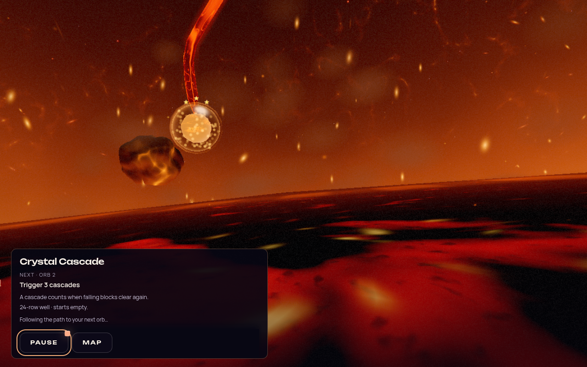
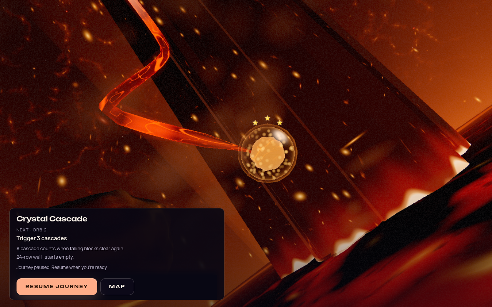

# Odyssey world journey — 2026-10-08

The user-approved sequence is **finish orb → emerge into the world → glide along the path
→ enter the next orb**. This replaces the direct, covered same-chapter preparation described
in the [previous flow refinement](ODYSSEY_FLOW_REFINEMENT_2026-10.md). Chapter boundaries keep
their separate panoramic arrival and untimed Begin chapter action.

## Experience

Completion still acknowledges the result and previews the next objective. Continue now,
Pause, Results, Map and the saved automatic-continuation preference remain available.
After the choice or automatic acknowledgment, the same briefing becomes a compact panel
over the scenery. The existing reverse portal reveals the completed orb in the actual
Odyssey world. Map headers, the level panel and navigation controls stay hidden and locked.

The camera follows the authored rail to the next orb, with a nominal 1.5-second glide.
The existing orb-entry dolly and portal then lead into the next board. Preparation happens
under the opaque entry cover; gameplay begins only after readiness and a complete Ready cue.
This is a visible world visit, not another selection screen, and requires no additional click.
The world remains resident when the existing keep-alive policy allows it; rebuild recovery
and the One World fallback remain supported.

The next goal and changed rules stay on the same DOM nodes. Pause/Resume and Map stay above
both portal effects. Pause or window blur freezes rail progress, and Resume continues from
that position without consuming the paused time. Ambient scenery may continue animating.
Reading that exceeds the compact panel pauses once, with sticky controls and scrollable text;
explicit Resume is not trapped by repeated overflow checks.

Reduced motion reveals a stable source view, covers the seek to the destination, and uses
the existing reduced-motion portal transitions. It does not play the sustained rail flight
or entry zoom. Chapter scenery still has its existing ambient animation; this is not a claim
that every underlying world effect is motion-free.

Music keeps its current track during the brief world visit. The transition does not detour
through the map track or recapture gameplay music as the map preference. An explicit Map
choice restores normal map music asynchronously while making the map immediately usable.

Chapter return also suppresses the map header, Play panel and navigator before the world
becomes visible. This fixes a brief browsing-UI flash under the return portal. Its shared
UI guard preserves the separate chapter music and camera policy; Map clears chapter
ownership before restoring normal browsing controls.



The existing world, path and orb remain visible behind the compact next-orb briefing.
This screenshot is from the real runtime, captured with software WebGL2.

## Ownership and implementation

- `odyssey-journey-flow.js` owns emergence, travel, entry, presence, loading leases and recovery.
  It retains the completion owner and releases only that retired attempt's outcome callback.
- `odyssey-world-return.js` contains the existing return presentation extracted from Mode,
  with an exact scenic-operation owner. Browsing UI is suppressed before the world reveal;
  the source rail position is settled under the cover to avoid an unawaited focus race.
- `OdysseyBoardController.travelToLevel` accepts `pathTravel:true` for same-chapter rail
  travel. Ordinary map selection retains its existing behavior. `cancelTravel()` invalidates
  delayed navigation, resolves camera work and clears movement momentum, including on disposal.
- `OdysseyCameraController` excludes paused intervals from travel elapsed time. Zero-duration
  travel and focus seek immediately with finite coordinates. Ownership checks prevent a late
  environment load or camera completion from selecting or launching a replacement journey.
- `JourneyFlowOverlay.setScenic(stage)` publishes `emerging`, `travel` and `entering` states.
  It changes presentation without releasing input/presence ownership. The transparent world
  window and compact panel use the same next-goal elements as completion.
- The ordinary launcher exposes guarded blackout and reveal hooks. The flow acquires its
  asynchronous loading-surface lease only after opaque blackout and uncovers it at reveal,
  following ADR-0020. Failed/cancelled preparation settles before map recovery.

Map during travel cancels motion and restores the resident map without replaying another
return portal. Map during entry uses the launcher's covered recovery. Stop, deactivation and
replacement invalidate the exact owner, release held input/presence waits, restore the camera's
idle-drift policy and prevent stale starts. The simulation, rewards and difficulty are unchanged.

## Validation

The bounded browser pass completed four runtime cases and twelve responsive UI cases:

| Case | Result and scope |
| --- | --- |
| Orb 1 → 2 | Passed. Actual camera-update samples traverse the authored rail; the controller and renderer remain resident. Exactly one completion save, return, next entry, preparation and run start; no map UI or interaction flash. |
| Pause during the glide | Passed. An intermediate path position stays exactly fixed while paused; Resume starts the next orb once. Wheel, canvas click and held Enter do not bypass the pause. |
| Reduced motion | Passed. Stable source framing and a covered zero-duration destination seek are recorded in the trace. The screenshot caught the cover and is not evidence of the exposed source view. |
| Map during the glide | Passed. Cancellation restores canvas hit-testing and mouse selection, with no late entry or run start. The capture waits for selected-orb state, not the later preview-panel refresh. |
| Responsive briefing | Passed for three effective-rule briefings across desktop, 320px portrait, 844×390 landscape and 200% text. These use real UI/CSS over an explicitly synthetic backdrop. |
| Chapter arrival | Browser check blocked: the development server navigated during source-orb entry, before journey assertions. The final chapter UI guard has focused regression coverage, but this pass does not establish its live-browser appearance. |

Passing runtime cases recorded no browser page or console errors. Evidence and preserved
diagnostics: `artifacts/odyssey-world-journey-2026-10-08/validation-summary.json`.
The source-orb mouse selection changes immediately; ordinary map selection updates its
preview after the focus animation settles. That later panel update was not independently
awaited in the Map capture.



Repository verification:

- Full suite: **8,637 tests passed in 659 files**.
- Production build and boot closure: passed.
- Type checking, dependency boundaries and architecture fitness: passed. Extracting return
  presentation lowered the Mode line baseline from 4,746 to 4,677 and core DOM globals
  from 432 to 431; neither baseline was raised.
- TypeScript coverage ratchet: passed at 73 files.
- Lint ratchet: passed at the existing 813-error baseline, with 1,056 warnings and no fatal
  errors. This gate establishes no increase in baseline errors, not a lint-clean repository.
- Development release gate: passed, including five behavioral tests. The existing Spacewar
  AppID warning remains; this is not a production release-eligibility claim.
- Final chapter guard: 51 focused tests passed before the full suite, covering world UI
  suppression, Map restoration and preserved chapter audio/camera policy.

Logs: `artifacts/odyssey-world-journey-2026-10-08/verification/`.

The isolated playground uses the shipping path, orbs and camera in `odyssey-path-beacons`.
It was captured before integrating the world handoff and again after adding pause support.
A two-second pause held exact path progress; Resume completed the route. Source, intermediate,
paused and destination frames were visually inspected with no browser page or console errors.
Evidence: `artifacts/odyssey-world-travel-2026-10-08/playground/`.

The DOM layout was separately captured at desktop, 320px portrait, 844×390 landscape and
200% text, including a large-text landscape case. It preserves a visible world window and
in-bounds controls; oversized content holds once and remains resumed after a stage change.
Evidence: `artifacts/odyssey-scenic-ui-2026-10-08/`.

These checks use disposable profiles and synthetic completion/blur events. Software browser
rendering and muted browser audio verify lifecycle and composition, not native frame pacing,
controller ergonomics, subjective sound quality or player flow. The [bounded player study](ODYSSEY_FLOW_STATE_RESEARCH_2026-10.md#a-bounded-validation-plan)
remains the experience checkpoint. This change deliberately spends some transition time in
the world; it does not claim a faster total handoff than direct preparation or an empirically
optimal travel duration.

The next manual pass should cover the new route and a chapter boundary with sound and the
player's normal input device, then assess whether the repeated glide feels brief and clear
across several consecutive orbs. Keep the chapter reveal untimed. Tune duration from that
evidence before adding more spectacle or another automated benchmark sweep.

## Reproduction

Use the existing Vite server and separately available Playwright/Chromium:

```sh
PLAYWRIGHT_MODULE=/absolute/path/to/playwright/index.mjs \
CHROMIUM_PATH=/absolute/path/to/chromium \
node scripts/validate-odyssey-flow.mjs --scenario within --warm-source \
  --base-url http://127.0.0.1:5173
```

See `--help` for reduced motion, chapter, paused-world, Map-cancellation and UI cases.
The source-theme prefetch is recorded fixture setup; it does not bypass production readiness
budgets or establish cold-load performance. Run one rendering capture at a time and keep
full regression/build work separate from software-GPU captures.
