# Sakura Twilight — the moonlit garden (visual overhaul, 2026-10-05)

**Status: implemented (branch `feature/sakura-twilight-masterpiece`). A record of what was
built and how it was checked — not a backlog.** Replaces the WebGL/GLSL scene (instanced
copies of one third-party cherry tree on a rolling lawn) with a node scene on three
0.186.1 that the game and the playground share.

| Before | After (High, native WebGPU) |
| --- | --- |
| 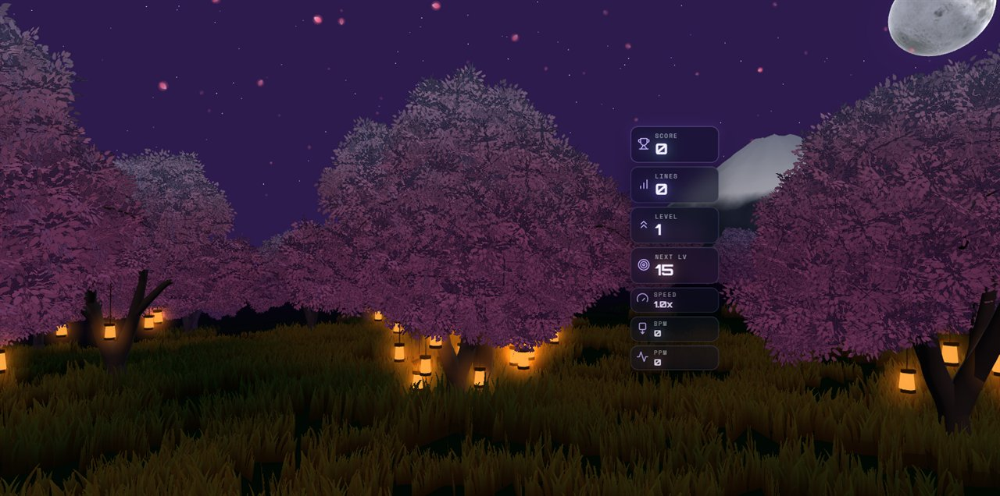 | 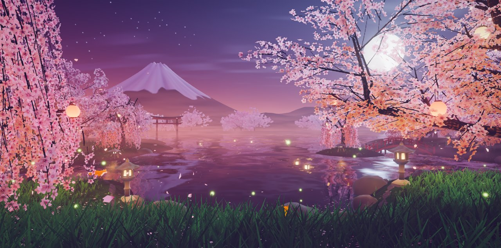 |

## What the player sees

The last rose of sunset lies along the horizon and a low moon stands behind the boughs of
an old spreading cherry on the right. On the left the garlands of a weeping cherry frame
the mountain, which rises over a torii standing in a still lake. A drum bridge crosses to
an islet, the far shore is lined with blossom under a veil of mist, stone lanterns burn
by the water and paper lanterns hang from the low boughs. The blossom is lit twice: silver
at its edges where the moon is behind it, warm from beneath where a lantern hangs. Petals
let go of the crowns, side-slip down, and settle on the grass or raft together on the
water. Two foxes keep to the stepping stones along the shore; lanterns drift on the lake.

Everything the old theme was loved for is still here — the twilight purple, the great moon,
the mountain, the lanterns, the foxes, the constellations — in one composed picture. The
board card hides the middle of a landscape screen, so the picture is built for the two
side thirds; portrait has its own framing, with the moon brought round above the mountain.

## How the garden answers the game

`SakuraReactions` is a pure director; `SakuraPetalDirector` turns its emitters into petals
thrown from behind the board card at the height and on the side where the event happened,
rings on the lake, lanterns and stars.

| Event | Response |
| --- | --- |
| Piece lock | A glint of light and a puff of lit petals from the card's edge beside the piece, at its row. The piece seems to fall through the card into the lake: a ring spreads from under its column, flashes where it catches the moon, and passes on through grass and blossom as a breath of pink light. Every lantern in the garden breathes once. A long hard drop (`HARD_DROP` distance) makes all of it harder. |
| Line clear (1–3) | Twin jets of petals blown out of both sides of the card at the cleared rows, a wide ring from the middle of the lake, the blossom lit from within, and one lantern set afloat for each line. From two lines a gust front crosses the garden (boughs and garlands swing, fallen petals lift); three lines send a shooting star and set the foxes running. |
| Four lines | Hanafubuki: the crowns let go a blizzard of petals, under a flaring moon and two shooting stars, and the constellations begin to trace themselves in. |
| Combo / streak | A stream of lit petals winds around the board and climbs. Foxfire kindles one flame at a time in two rows either side of the card — a gauge of the combo — and the constellations (the Fox, the Blossom, the Crane) draw themselves line by line. Cascade depth (`COMBO`) or consecutive clearing locks raise all three; past half strength the petals burn white. Long combos release sky lanterns. A lock without a clear ends the streak; the stream unwinds, the flames go out, the figures fade. |
| T-spin | A spiral flourish of petals beside the board and a shooting star. |
| Back-to-back | Holds the stream and the figures; the lanterns flare. |
| Level up | A flight of sky lanterns rises from the banks and the far shore, mirrored in the lake. |
| Perfect clear | All of it at once, and the fallen petals rise from the ground. |
| Game over | The wind dies and the lanterns burn low until play resumes. |

Everything honours `backgroundComboEffects` and `pieceLockRipple`, pauses with the theme
and is driven by simulation seconds. Every effect is bounded: petals come from a fixed
hidden reserve, emitters from a fixed pool (18–24 by tier, sized so that every handler
firing in one frame still loses none), and rings, flashes, floating and sky lanterns each
rewrite one slot of a fixed buffer.

| Hard drop | Three lines | Four lines |
| --- | --- | --- |
| 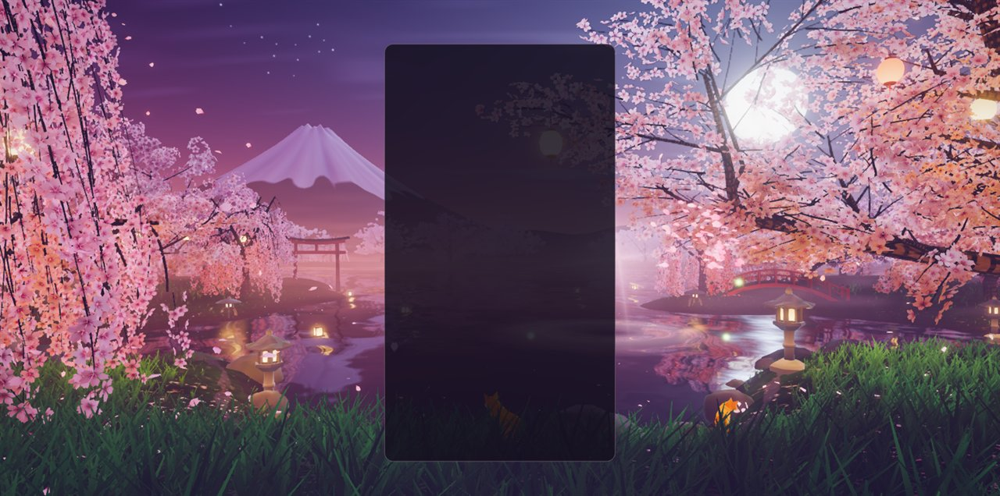 | 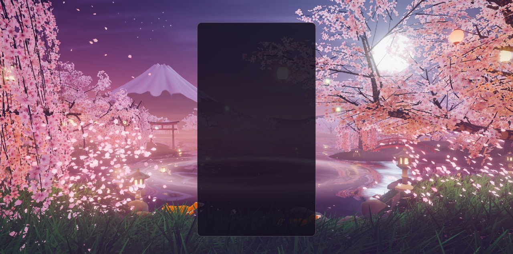 | 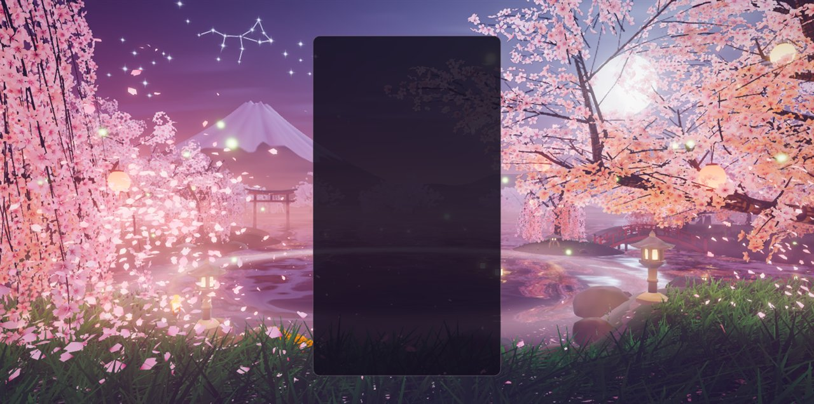 |

| Combo ×12, four seconds on | Perfect clear | Level up, five seconds on |
| --- | --- | --- |
| 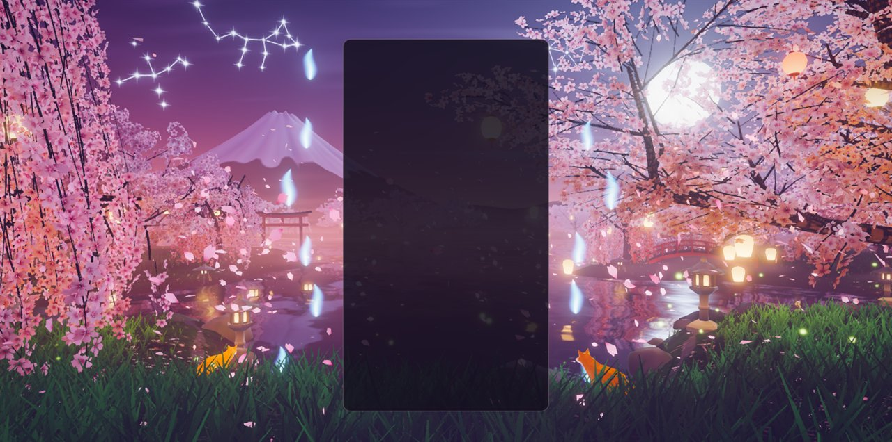 | 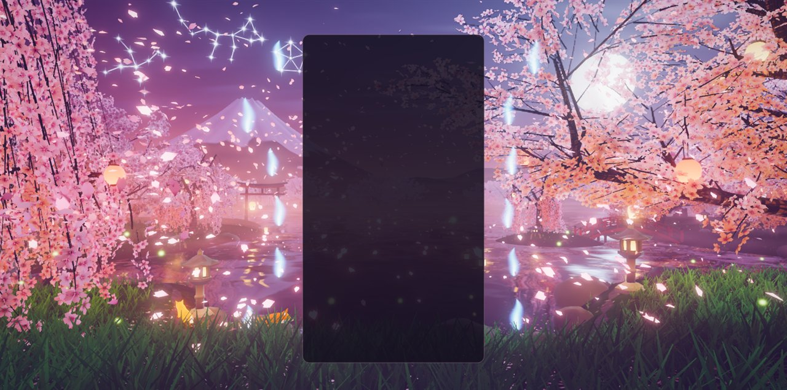 | 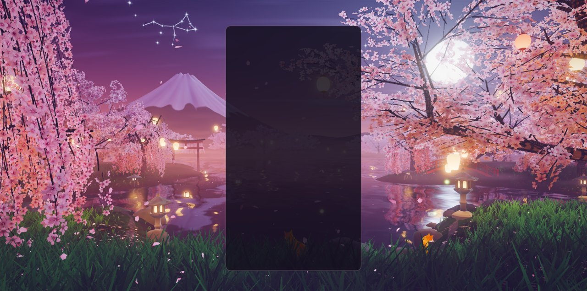 |

## How it is built

### Authored in Blender

`scripts/blender/sakura_twilight_assets.py` grows six cherries (a weeping hero, a
spreading hero, three grove trees and a young weeping one), builds the blossom sprays, the
garden furniture and the mountain, bakes ambient occlusion in Cycles, renders the
far-shore sprite sheet, and writes compact GLBs. Growth, wood meshing and the quantising
GLB writer are the Fall grove's (`scripts/blender/fall_grove/`); `sakura_grove/` adds what
a cherry is, the five-petalled flowers and the hard-surface props. Details, formats and
the regeneration command are in
[`src/themes/sakura-twilight/assets/ATTRIBUTION.md`](../src/themes/sakura-twilight/assets/ATTRIBUTION.md).
The generated pack is 3.5 MB in ten files and is reproducible byte for byte (checked by
regenerating into a scratch folder and comparing every file).

The generator runs **headless** (`blender --background --factory-startup`); the live
Blender session on this machine was not used. The theme no longer loads
`src/themes/shared/assets/landscape-glb.glb`, the 11.8 MB third-party model its trees came
from (see `CREDITS.md`: Koi Pond still imports it). The fox began as the Khronos sample
fox and was rebuilt on 2026-10-09 (see *The foxes, rebuilt* below).

### Runtime modules (`src/themes/sakura-twilight/`)

| Module | Owns |
| --- | --- |
| `sakura-twilight-theme.js` | Lifecycle, renderer, asset loading, gameplay subscriptions, board tracking. |
| `sakura-assets.js` | Loading and decoding the GLBs, the sprite sheet and the fox. |
| `sakura-world.js` | Composition root: decides where things stand, builds and updates everything below. |
| `sakura-light.js` | The moon and its static shadow map, the afterglow sky, lantern light, haze, wind, the rings a lock sends out, a shared noise texture. |
| `sakura-composition.js` | Camera framings (each with its own moon), hand-placed trees and lanterns, the procedural grove, where paper lanterns hang, the visibility test. |
| `sakura-terrain.js` | The lie of the land as plain functions (lake, lobes, points, islet, path), the ground and the lake-bed map. |
| `sakura-forest.js` | Bark and blossom instancing and their two materials. |
| `sakura-water.js` | The lake: planar reflection or analytic mirror, moon glitter, lantern streaks, petal rafts, rings. |
| `sakura-sky.js` | The dome (stars, cirrus, moon), the constellations and shooting stars. |
| `sakura-backdrop.js` | The mountain, the hills, the far-shore sprite trees. |
| `sakura-garden.js`, `sakura-prop-material.js` | Lanterns, torii, bridge, pagoda, boulders and grass; the one material all furniture shares. |
| `sakura-spirits.js` | Mist, fireflies, foxfire, light bursts, lanterns afloat and aloft. |
| `sakura-fox-rig.js` | Three-free: the red fox's skeleton and the fox rig made for it (the shared `../shared/fox-rig.js`). |
| `sakura-fox-mind.js` | Three-free: what the pair does — their course along the path, their stops by the lanterns, how the garden moves them (the shared `../shared/fox-mind.js`, two of them). |
| `sakura-foxes.js` | The two foxes, drawn: bones posed from the rig, a coat of fur in shells, lit by the garden's own rig. |
| `sakura-petal-sim.js`, `sakura-petals.js` | The petals in the air (pure typed-array simulation) and drawing them. |
| `sakura-reactions.js` | The event director (pure). |
| `sakura-stage.js`, `sakura-petal-director.js` | Board card → world, and emitters → petals, force fields, rings, lanterns and stars. |
| `sakura-post.js` | Volumetric moonbeams, bloom, grade, FXAA. |
| `sakura-quality.js` | One table for everything a tier scales. |

### Techniques (three 0.186.1)

- **Two lights for the blossom.** Materials are unlit `MeshBasicNodeMaterial`s that call
  the shared rig. The moon is one static shadow map (`shadow(light)` read by every
  material; the garden never moves under a fixed moon) and lights petals as thin
  translucent blades, so a crown between the eye and the moon is rimmed silver. Lantern
  light on blossom is gathered once per spray when the grove is built — it costs nothing
  per frame and paints every crown warm from below; ground, bark and furniture run a
  real shader loop over the nearest lanterns.
- **A real mirror.** Medium and above reflect the garden with `ReflectorNode`, sampled
  three times along the vertical with a wave-driven offset so every light draws out into
  a streak. Lower tiers mirror the sky and the moon analytically and lay each lantern's
  light along the water with a closed form.
- **Rings as one language.** A lock writes one slot of a small uniform array. The same
  expanding fronts ripple the lake's normals, flash on the water, and pass over grass,
  bark, furniture and blossom as a band of light.
- **Volumetric moonbeams** with `GodraysNode` through the moon's shadow map, as in Fall.
- **Global instancing.** Every blossom spray of every tree is an instance in six draws
  that share one material; sprays that can never be on screen in either framing are
  dropped at build time (3,888 of 8,510 at High).
- **Data sprites for the far shore.** One Blender-rendered sheet storing shade, blossom
  mask and hue seed gives every distant tree its own pink.
- **Stateless small lights.** Fireflies, foxfire, floating and sky lanterns and the light
  bursts are animated in the vertex shader from a few per-instance numbers.
- **CPU petal simulation.** Six thousand petals at High in typed arrays: the same code on
  both backends, in the playground's deterministic `seek`, and in the unit tests. Petals
  land on the ground or float on the lake, and the game's petals carry a light that fades.

Three things cost time; they are now in the TSL skill's gotcha table
(`.claude/skills/webgpu-threejs-tsl/SKILL.md`):

- **A `Fn` with `setLayout` must not capture uniforms** in r186: its code is generated
  once and reused, so the next material that calls it gets a shader with undeclared
  uniforms (`unresolved value 'NodeBuffer_…'`). The shared helpers here are inline `Fn`s
  with real `Loop`s instead.
- **First-frame compile is a matter of pipeline count, not shader size.** The scene
  first created 200 pipelines, none of them large, and froze for 13.6 and 14.7 s after
  "ready" (two runs in a scratch Electron window, with other sessions on the machine).
  Priming the shadow rig with the ground alone rather than the whole scene, and keeping
  grass, petals, foxes and the small lights out of the reflection pass (a camera layer),
  brought it to 113 pipelines; the freeze then measured 7.5, 10.8 and 11.5 s. Shorter,
  but the readings are too noisy to say by how much. Sharing a material does **not**
  reduce the count: three creates a pipeline per mesh per pass (twelve for the six bark
  meshes, which share one material, in two passes), and sharing one across the furniture
  as well changed nothing measurable and was reverted.
- **The sample fox has no normals**, so a `varying(normalWorld)` on it reaches for
  `dFdx` in the vertex stage; its material was flat-shaded and took lantern light without
  a normal. (The rebuilt fox, `sakura-fox.glb`, has smooth normals of its own.)

### Quality tiers

| Tier | Grove / far trees | Sprays kept | Petals | Grass tufts | Lake | Moonbeams | Post |
| --- | --- | --- | --- | --- | --- | --- | --- |
| Extreme | 20 / 110 | 100 % | 9,000 | 15,000 | mirror, 0.5 scale | 36 steps | on |
| Ultra | 18 / 100 | 100 % | 7,500 | 12,500 | mirror, 0.5 scale | 30 steps | on |
| High | 16 / 90 | 86 % | 6,000 | 10,000 | mirror, 0.4 scale | 24 steps | on |
| Medium | 12 / 70 | 60 % | 3,800 | 6,500 | mirror, 0.3 scale | 14 steps, 0.35 scale | on |
| Low | 9 / 50 | 36 %, no twigs | 2,000 | 3,200 | analytic | none | off |
| Minimal | 6 / 36 | 26 %, no twigs | 1,100 | 1,600 | analytic | none | off |

Grove trees are in addition to the eight placed by hand. Low and Minimal draw the same
scene directly with ACES tone mapping. At High the grove is 0.80 M blossom triangles and
0.18 M of bark; at Low 0.33 M and 0.13 M.

| WebGL2 backend, High | Low (no post, analytic lake) | Portrait, Low, WebGL2 |
| --- | --- | --- |
| 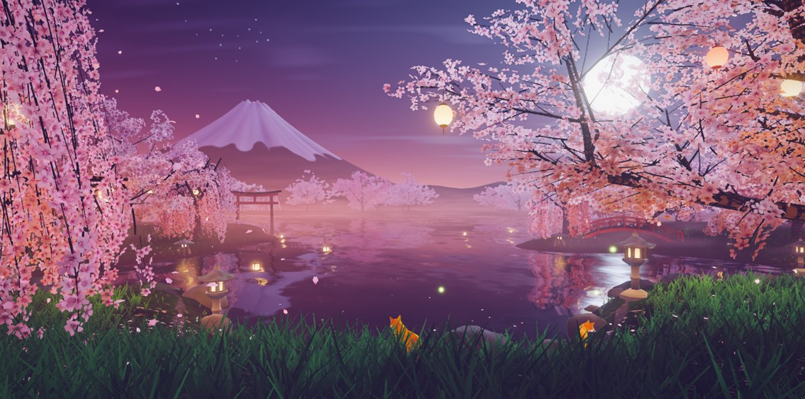 | 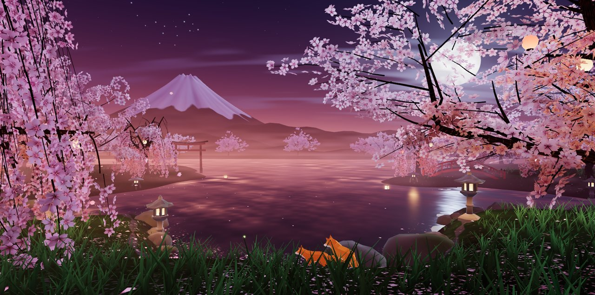 | 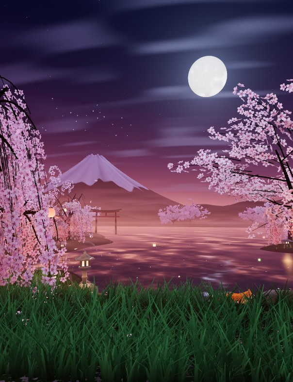 |

### The icon

The theme icon is a frame of the new scene (the house style: a 512 px full-bleed circle on
a transparent ground), from the playground's `icon=1` lens:
`playground.html?effect=sakura-twilight&orbit=0&hud=0&seed=271&icon=1&t=9&event=clear&eventAge=1.6`.
Shown at picker size beside the previous icon and two neighbours:

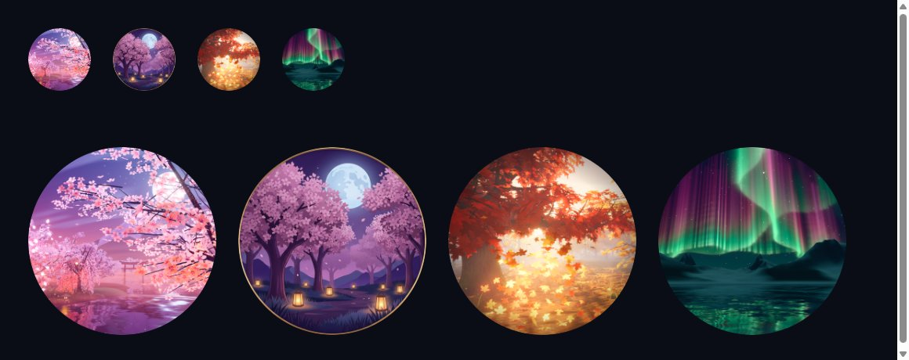

## The foxes, rebuilt

On 2026-10-09, after Winter's arctic fox had been rebuilt, the request was the same for the
garden's two: better looking, better moving. As they were, they were the sample fox as it
comes — 576 flat triangles in a flat, bright orange, sliding along the path on three baked
clips, half hidden in the grass.

They are now the same animal the way Winter's is one:

- **The model** (`assets/sakura-fox.glb`) is made from `Fox.glb` by
  `node scripts/sakura/rig-fox.mjs` (deterministic; see `assets/ATTRIBUTION.md`): subdivided
  to a rounded body, in metres, with smooth normals, on axis-aligned bones that stand at the
  sample fox's own joints and carry its own skin weights, with no clips.
- **Its body** is the fox rig the two themes share (`src/themes/shared/fox-rig.js`): paws
  placed on the ground and legs solved to reach them, a walk that opens into a trot and a
  gallop with no sliding at a steady pace, a back that bends, and everything it does at a stop
  written as numbers that blend. `sakura-fox-rig.js` is what is this fox's own: where its
  bones are and how a long-legged red fox sits and curls up.
- **Their mind** is the shared fox mind (`src/themes/shared/fox-mind.js`), one for each, on
  a course that goes out along the water's side of the stepping-stone path and back along the
  near side. They stop beside the two stone lanterns: to sit in the lantern's light and look
  up at the moon, to look about, to stretch and bow — or, having heard something in the
  grass, to listen with a paw raised, leap on it nose first, dig and shake themselves off.
  They are a pair: near each other they look round at each other, and when one settles the
  other soon does.
- **Their course minds what stands on it.** The two lanterns stand in the lanes' way (one on
  the water's side of the path, one on the near side), so `sakuraFoxCourse()` takes the lanes
  round them — both to one side, or one either side, whichever is least out of their way and
  keeps them off the steep of the bank — by 1.1 m, and puts each stopping place a little
  short of its lantern. Going the same way round the one course, each fox leaves the other
  2.6 m of it (`ahead` and `room` in the shared mind): coming up behind one that has stopped
  it pulls up short and makes a stop of the wait. Both were found by measuring, not by
  looking: the first course passed 19 cm from the middle of a lantern with a stopping place
  inside its stone, and nothing kept the two from stopping in the same spot. Over an hour of
  stepped play the nearest they now come to each other is 0.57 m, passing shoulder to
  shoulder on the two lanes; about 14 of the course's 64 m leave the strip the garden keeps
  free of grass, and there they wade through it.
- **The garden moves them.** The stream of petals a chain winds up sets them running; a hard
  gust startles them into a dash; four lines sends them leaping high over the grass, one a
  moment after the other, into the blizzard of petals; a lock makes them look up over the
  water; when the wind dies and the lanterns burn low they curl up nose to tail and sleep,
  eyes shut, and wake with a stretch.
- **Their coat** is fur in shells over the skin (0 to 20 by tier), lit by the garden's own
  rig — the moon where the trees let it through, the violet sky, the warm lanterns they sit
  beside — with its colours taken a little off their brightest, a silver edge against the
  moon, and eyes (the sample fox had none to speak of) that blink.

They are drawn a little larger than life (1.12 and 0.98 of the model) so that they read from
where the game stands. `node scripts/fox/preview-fox.mjs --fox=sakura --act=Sit` (or
`--gait=1`, `--mind=round`) draws them on the CPU; in the playground `foxCam=<metres>` follows
one with a close lens (`foxWhich=0|1`, `foxCamYaw=<deg>|viewer`, `foxCamFov=<deg>`) and
`foxAct=<acts|hunt>` with `foxActAge=<s>` stops it and has it do something.

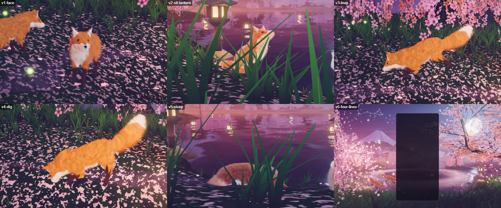

## Verification

- **Playground** (`npm run dev:playground`, `?effect=sakura-twilight&orbit=0&seed=271&hud=0`):
  the captures above, each with a clean console (no WebGPU validation errors, no TSL
  warnings), on native WebGPU and with `forceWebGL=1`. Events are reproducible with
  `&t=12&event=lock|drop|clear|double|triple|tetris|combo|streak|spin|perfect|level|over`,
  `&eventAge=<s>`, `&col=0..9&row=0..19`, `&combo=<n>` and `&board=1` for a stand-in card;
  `&quality=<tier>` picks a tier.
- **In the game**: `node scripts/validate-all-themes.mjs --theme sakura-twilight` on a
  production build — PASS, 0 lifecycle failures, 0 console errors (activation, teardown,
  re-activation). Its capture is the new `docs/theme-screenshots/sakura-twilight.png`:

  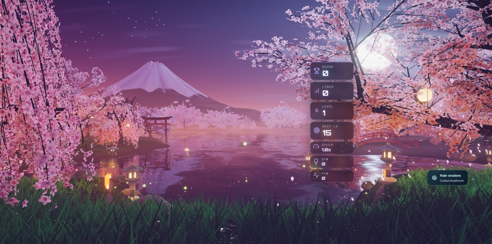

- **In play**: a scratch Electron harness booted the real game on the dev server with the
  theme pinned, started a single-player session and hard-dropped four pieces with real
  key events. The director held a `lock` emitter raised by the game's own `PIECE_LOCK`,
  the stage had measured the real board card (x 0.395–0.605 of the screen), and the
  console carried nothing from the theme. The second frame is the same session after a
  ten-step combo raised through the theme's own `onCombo` handler:

  | Hard drop, real input | Combo, four seconds on |
  | --- | --- |
  | 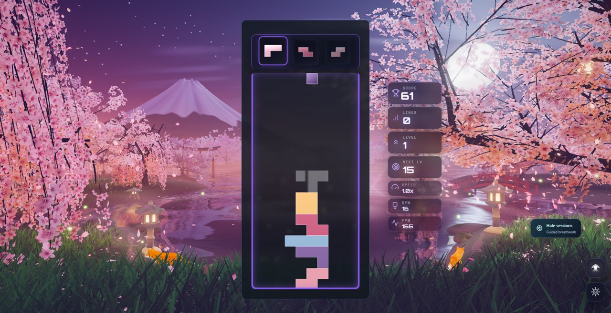 | 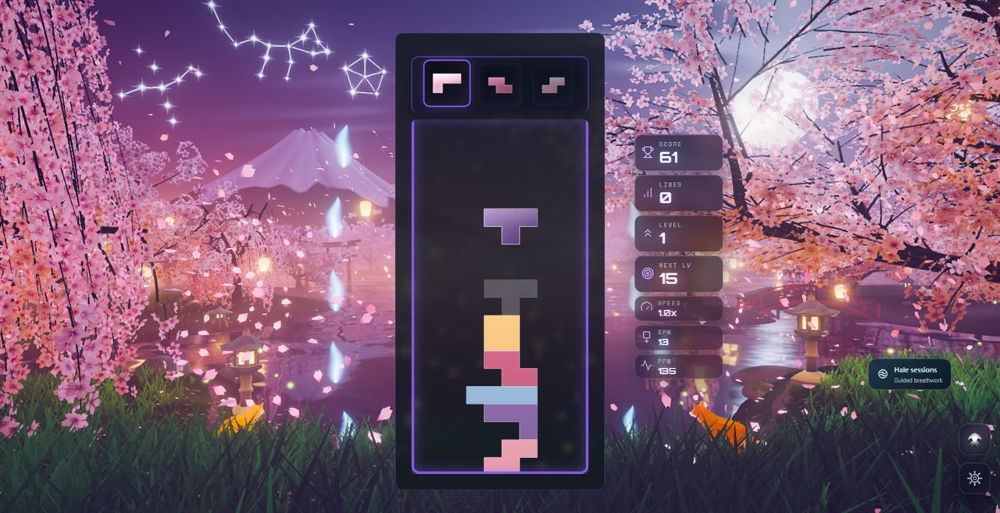 |
- **Build**: `npm run build` — boot closure OK; the theme chunk is 112 kB before gzip.
  `npm run typecheck`, `check:boundaries` and `check:ip-strings` pass. `check:palette`
  fails on `main` and here alike, on Stillwater's palette; this theme's is unchanged.
- **Lint**: 0 ESLint errors in `src/themes/sakura-twilight` and the playground effect;
  the repository ratchet drops because the old file's errors are gone.
- **Tests**: 452 tests in eight suites under `tests/unit/sakura-*.test.js` — the director
  (74), the petal simulation (39), the stage and petal director (61), the asset pack and
  its manifest (45), the world, composition and post built from the real GLBs in Node (86),
  the theme adapter (117), and since the foxes' rebuild their rig (14) and their mind (16);
  38 more in `tests/unit/shared-fox-*.test.js` pin the engine they share with Winter. They were written by a second agent from the modules alone,
  and found four defects that are fixed here: the emitter pool overflowed within one
  four-line clear on the lower tiers, fireflies were placed at a quarter of their tier's
  count, one constellation lay outside the frame, and lanterns set afloat from the left
  bank found no water. Its reading of the layout also showed the torii and the bridge
  standing on dry ground and several lanterns in the lake; all were moved. The
  repository's full unit suite passes with them (563 files, 6,770 tests).

### Frame pacing (one rough reading, not a budget)

A scratch probe counted `requestAnimationFrame` intervals in a visible Electron window at
1584 × 813, High, native WebGPU, on the RTX 3070 Laptop GPU on mains power, **while other
sessions were using the machine**. After the first-frame compile the scene ran at a median
8 ms per frame with p95 16–22 ms and p99 24–43 ms across three runs; the Fall scene measured
the same way in the same hour gave a median 8 ms, p95 16–21 ms, p99 37–40 ms. That says the
two are in the same class on this GPU and nothing more: by ADR-0016 these numbers may not
be quoted as a budget or a comparison. The theme perf lane was not run. No measurement
exists for integrated or phone GPUs — the lower tiers are untested on real low-end
hardware.

## Known limits

- Portrait is its own framing of the same world; the two old trees are at its edges and
  the board covers most of the lake.
- The shadow map is static, so swaying crowns do not move their shadows, and the foxes
  have a soft patch under them instead of a cast shadow.
- First activation still has about a hundred pipelines to compile. In the playground,
  which creates them synchronously, that froze the picture for 7.5 to 11.5 s over three
  runs on this machine. The game's theme prewarm creates pipelines asynchronously behind
  its loading surface (ADR-0020); how long this theme takes there, and how much a warm
  driver cache saves, was not measured.
- Blossom is stylised: flowers are several times life size so that they read as flowers.
- The lake reflects a second view of the garden on Medium and above; grass, petals, foxes
  and the small lights are deliberately left out of it.
- Low and Minimal have no moonbeams and no mist-softened reflection.
- `scripts/sakura-twilight-electron-validation.mjs`, which inspected the old scene's
  internals, was removed with it.
