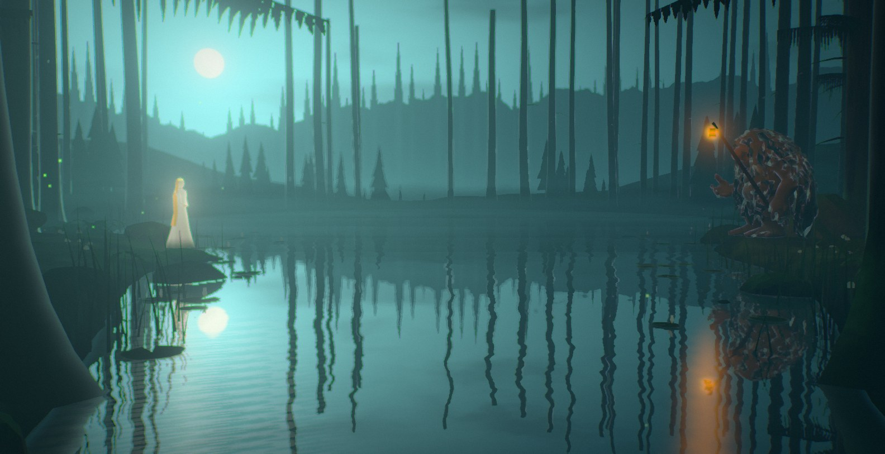
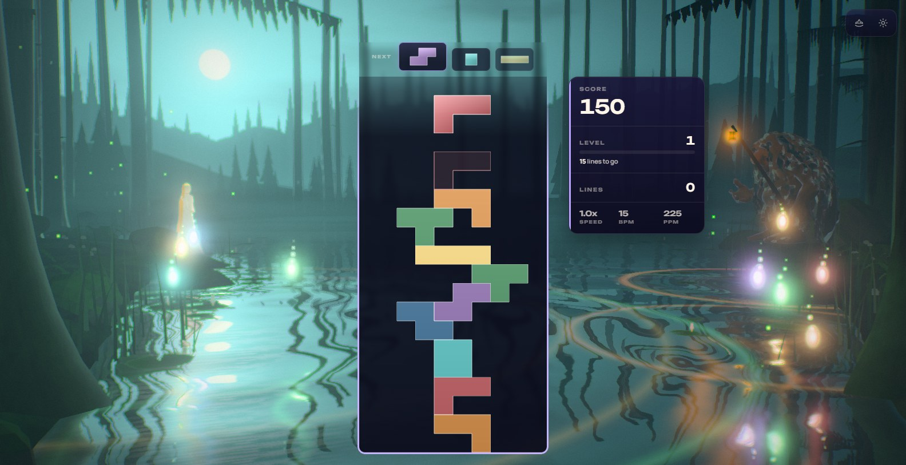
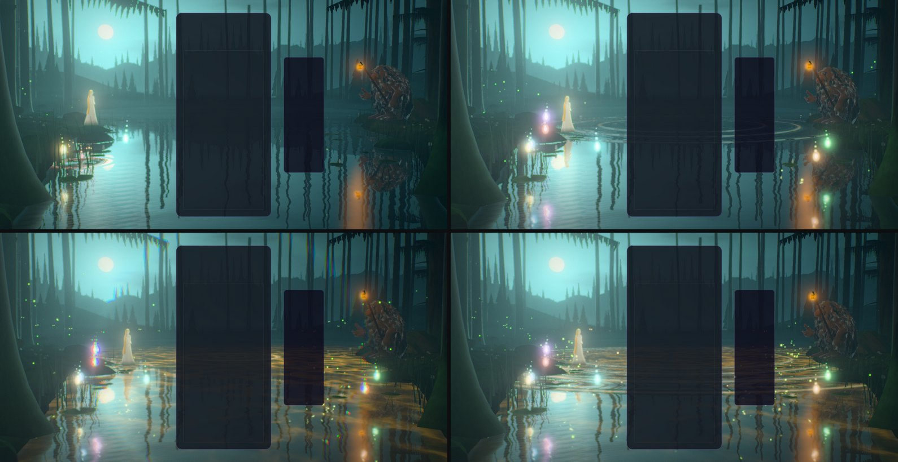
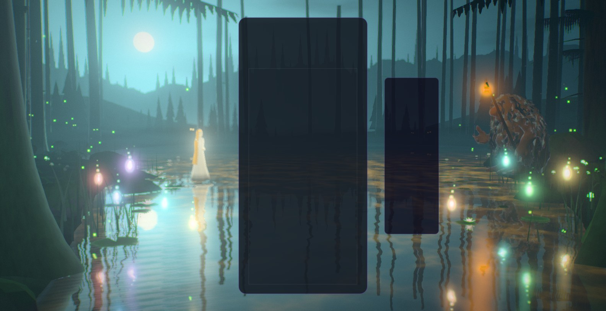
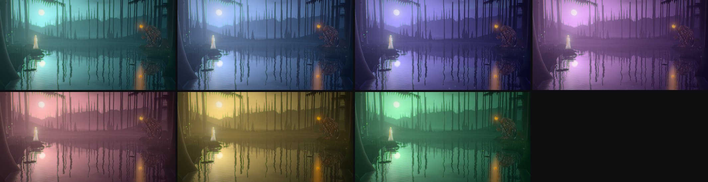
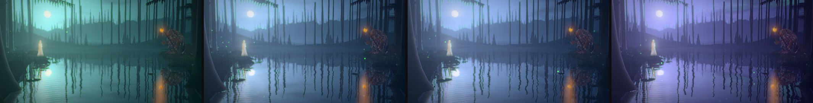
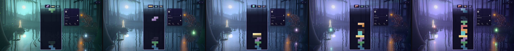
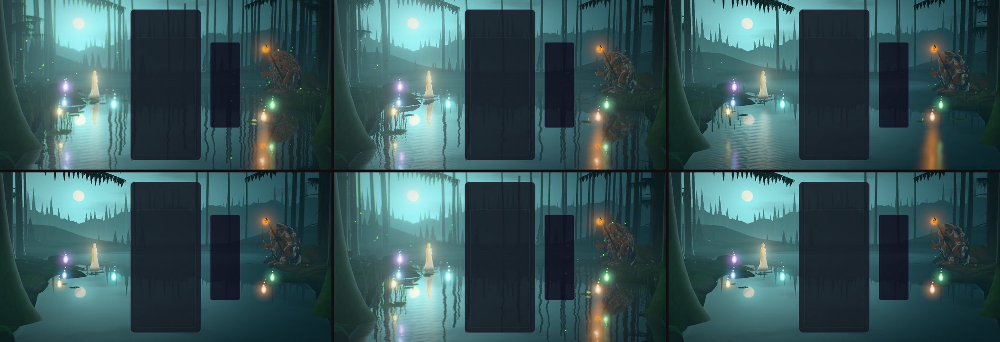
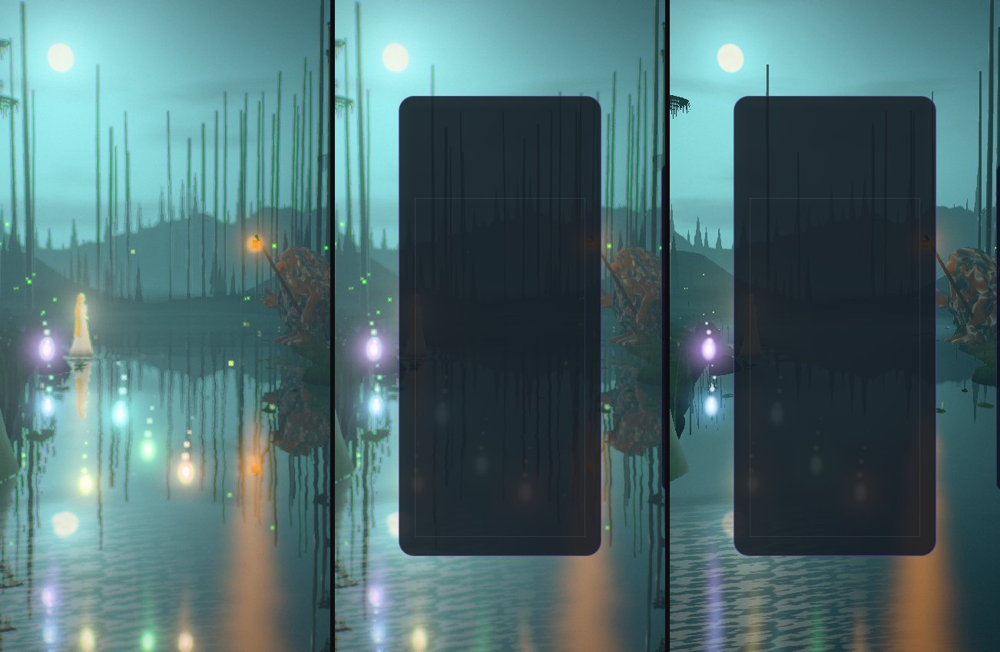
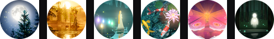

# Stillwater — the tarn at night

Implemented 2026-10-09 on `feature/stillwater-masterpiece`, with Three.js 0.186.1. A from-scratch
rebuild: it replaces the earlier theme in full (a 2,000-line lifecycle adapter with a pooled
renderer, the runtime / forest / water / characters / reactions / atmosphere / shafts modules,
the offering-loop and reaction-director simulations, the LUT and Kuwahara pipeline, thirteen
playground effects, twenty-one test files and seven scripts, one of them a 5,600-line acceptance
harness). Stillwater keeps its identity — a still forest tarn at night after John Bauer, a pale
spirit on one bank and a troll with a lantern on the other, the folklore colours of its pieces —
and it keeps the theme's own troll (the sculpt and its walk cycle). Everything else is new. This
document records the shipped design and what was verified. It is a reference, not a backlog; it
supersedes the six `STILLWATER_*_2026-07.md` documents.

## The picture

A forest tarn at night. The viewer sits on the near bank between two great spruces whose boughs
hang into the top of the frame. The moon stands in the mist over the left bank; rank behind rank
of spruce goes into that mist on the far shore, and the old trunks of the near wood stand in
front of it as dark columns. The water is black and still, and holds all of it upside down.

On the left bank's point, on a flat stone, a pale spirit in a long gown looks down into the
water: gold hair to her knees, a thin circlet, a light of her own. By the great spruce on the
right a troll keeps a lantern on a staff, hunched and shaggy, moss on his back.



The gameplay card stands between them, so the picture is built for what stays visible: the moon
and the spirit to the left of the card, the troll and his lantern to the right, the mirror below
both.



## The one idea

The tarn is where the two meet, and the board stands between them. Everything the board does is
written on the water: a piece leaves a light standing over the tarn, a clear gathers the lights
and carries them home to one of the two, and a chain of clears draws the two toward each other —
the spirit out over the water, the troll down to its edge with his lantern held out — until the
board is all that parts them. When the chain breaks they go back.

## Event language

| Gameplay | The tarn's answer |
| --- | --- |
| Lock | The piece's light leaves the card's edge at the piece's row and falls into the tarn on the piece's side: a splash, a ring that bends the mirror and carries the piece's colour on its crest, and a will-o'-the-wisp of that colour left standing over the water where it fell (twenty can stand at once; one that nothing gathers goes out after about 45 s). Its light lies on the water as a long column. |
| Hard drop | The same, harder: a taller splash, a wider ring, a brighter wisp, a second ring wide of the first, and the air stirs. |
| Clear (1–3 lines) | Swells cross the tarn from over its heart, behind the card, to both banks: one front per line, a thread of light on each crest. Every wisp a swell passes is gathered and flies home — the left bank's to the spirit, the right bank's to the troll's lantern — and the one who receives it burns the brighter for it. The cleared rows leave the card's edges as drifts of sparks that settle on the water. The troll turns his head. |
| Combo | The two come toward each other, a step per clear: the spirit walks out over the water (a ring at every footfall), the troll comes down from his seat to the water's edge at a walking pace and lifts his lantern. The wood wakes with the chain: glowing caps light from the frame's edge inward, the left bank's first; the water lilies open; fireflies rise; from the third step, eyes open between the far trunks; from the fifth, a gold heart begins to glow on the tarn's bed. When the chain breaks they go back and the lights go out. |
| Four lines | The night holds its breath (0.3 s: every light dims and the water goes glass-still); then the heart flares gold under the water in a net of bright threads, a great ring crosses the tarn and a ring of colour crosses the picture, every lily opens, every eye in the wood opens, gold rises from the water to either side of the board. |
| T-spin | A whirl where the piece went in: three rings on one another's heels, and a gust. |
| Perfect clear | As four lines, and the mist lifts for a few seconds: the stars come out over the wood. |
| Level up | The night turns to its next hour over about three seconds (seven hours on a wheel, below); a breath of wind crosses the tarn and shakes the dew out of the boughs. **The night also moves on by itself, whatever the level: an hour every 110 s of the world clock**, so a long level never sits on one picture. |
| Game over, new run | The chain breaks, every wisp goes home, the two return to their places. The hour of the night stays. |





### The hours

Seven palettes on a wheel, in the order of their hue so that neighbours blend through a colour
and never through grey: blue hour, moonrise, midnight (stars, the northern lights), elf dance
(thick lilac mist), first light, troll gold, moss night. Level L stands on hour (L − 1) mod 7;
the clock adds an hour every 110 s; the two add. A level's turn is eased over 3.2 s as a place on
the wheel (the colours themselves are never eased, so a frame is a function of the clock), a new
run turns back the short way round, and each hour rests for a sixth of its span at either end.
The clock belongs to the theme, not to the scene: a rebuild in place (a new quality tier chosen
while playing, a device loss) finds the night at the hour it had drifted to, and only stopping
the theme starts it again from the level's own hour.





The same in the real game: level 1 and no line cleared in any frame, 8, 63, 119, 174 and 229 s
of the theme's clock (`?stillwaterFixedDt=50`).



## How it is built

`src/themes/stillwater/`, shared by the theme and by the playground effect
`src/playground/effects/stillwater.effect.js`:

- **`stillwater-core.js`, `stillwater-plan.js`** (no three.js): the camera rig, the moon, slot
  counts and timings, the combo curves, the hours; the shore (two splines), the height of the
  ground, and seeded placement of trunks, boulders, lily pads, reeds, ferns, saplings, glowing
  caps and the far wood's eyes, with sight-line windows nothing tall may stand in (the mist behind
  the spirit, the moon, the troll and his walk). The large things stand on ground made level for
  them in the height function.
- **`stillwater-tsl.js`**: shared uniforms, the baked noise, and the two functions everything
  uses. `swBackdrop(direction)` is the whole distance — the sky, the moon in its halo, the stars,
  the northern lights and four ranks of spruce going into the mist — as ONE function: the sky
  dome draws it along the view ray and the water along its mirror ray, so the far shore stands in
  the tarn exactly, at full resolution, at no cost of a second render. Low down the sky *is* the
  mist and a little brighter than anything in it, so the far wood is always a darker shape
  against it. `swLight` is the night's light on a surface: the sky's fill, the moon through the
  canopy (pools laid out on the ground where the moon's ray lands, so a pool on the moss runs on
  up the trunk standing in it), the lantern, the spirit, the heart, and the wisps gathered into
  one lamp per bank.
- **`stillwater-water.js`**: the tarn. The mirrored distance comes from `swBackdrop`; what stands
  IN the scene (banks, trunks, the two figures, every light in flight) from a planar
  `reflector()` restricted to one camera layer, cleared to nothing and laid over the mirrored
  distance by alpha. Rings are packets of wavelets (shorter the further behind the front) and a
  clear's swells are circles from the heart; both only bend the mirror (their slope is bounded:
  however many cross, the picture in the water is bent, never torn) and carry their light on
  their crests. Lights lie on the water as long columns (the lantern, the spirit, every wisp),
  the moon lays a road of flecks, and the heart's gold comes up through the surface as a net of
  threads. A baked shore map gives the shallows and the thread of light at the water's edge.
- **`stillwater-land.js`, `-trees.js`, `-flora.js`**: one ground mesh over the plan's height
  function; one instanced boulder; every trunk built on the CPU and merged into one mesh
  (buttress roots, dead stubs; bark, moss and lichen drawn in the fragment stage); hanging spruce
  boughs cut out of ribbons; young spruces, ferns, reeds, lily pads, water lilies whose petals
  open in the vertex stage, glowing caps.
- **`stillwater-figures.js`**: the spirit is built in code (a gown, hair, folded arms; she is lit
  from within and her hem is lost in the mist). The troll is `assets/troll-lod0..3.glb` by tier:
  the sculpt's own vertex paint tells pelt from skin, and he is shaded as part of the place
  (stone and lichen for hair, moss on what faces up, his nose and hands warm in the lantern's
  light). He stands as sculpted and walks with his own cycle, played by the ground he covers;
  his spine and head are driven here so a look and a breath can be laid over the walk. The
  lantern hangs from a staff carried at his shoulder; its flame is the shared `lanternAt`
  uniform, so the bank, the troll and the water all take the same light.
- **`stillwater-fx.js`**: pools that are always drawn and placed by the clock in the vertex stage
  (drops, wisps, sparks in three modes — drifting, going home, a splash's ballistic crown),
  fireflies, the eyes (pairs that open by rank and blink), sheets of mist.
- **`stillwater-post.js`**: one scene pass, bloom with a hue-preserving knee, the moon's shafts
  (the bloom dragged radially out of the moon's place on screen), a hue-preserving filmic curve,
  lifted and tinted shadows (the dark of a watercolour is a wash, not a hole), calm zones under
  the card and HUD, a ring of colour for four lines, and on High and above "the brush": a
  four-quadrant Kuwahara that lays flat regions flatter and leaves edges and lights alone, held
  off the card.
- **`stillwater-world.js`** owns the choreography; **`stillwater-theme.js`**,
  **`-director.js`**, **`-composition.js`** are the lifecycle adapter, the event staging and the
  layout reader of the other rebuilt themes. The theme awaits the troll's sculpt before its first
  frame (four seconds at most; without him his lantern still stands).

Everything is a function of the world clock and event timestamps: `seek(t)` plus a fixed-step
replay reproduces any frame. Rates that follow play (the wind) are integrated on the CPU, never
multiplied into the clock.

On a frame too narrow for the stage (a tall phone) the banks, the trees and the two figures are
drawn in toward the middle by one factor (the figures keep their width), the moon comes in with
them and climbs into the strip of sky above the card, and the giants' bough fringe is left out.

## Tiers

| | Minimal | Low | Medium | High | Ultra | Extreme |
| --- | --- | --- | --- | --- | --- | --- |
| Mirror pass (scale) | — | — | 0.4 | 0.5 | 0.6 | 0.75 |
| Trunks / boughs | 30 / 18 | 44 / 30 | 70 / 50 | 104 / 76 | 124 / 92 | 140 / 104 |
| Saplings / ferns / reeds | 36 / 0 / 0 | 60 / 40 / 140 | 120 / 90 / 300 | 200 / 150 / 520 | 250 / 200 / 700 | 300 / 260 / 900 |
| Fireflies / spark pool | 0 / 192 | 50 / 320 | 100 / 640 | 150 / 960 | 200 / 1280 | 260 / 1600 |
| Troll mesh (triangles) | 3,690 | 3,690 | 9,765 | 17,081 | 32,378 | 32,378 |
| Bloom, shafts | — | — | yes | yes | yes | yes |
| Brush, fringe, 4x MSAA | — | — | — | yes | yes | yes |

Every tier keeps the whole picture and every event. Without the mirror pass the water still
mirrors the sky, the moon and the far wood (that costs no pass) and takes the wood's dark under
the banks.





## Assets

- **Kept:** `assets/troll-lod0..3.glb` (the theme's own troll: project-owned sculpt, thirteen-joint
  rig and `Walk` clip) and `assets/troll.glb`, the unsimplified source, which is not loaded at
  run time. See `assets/ATTRIBUTION.md`.
- **Removed:** `assets/spirit.glb` and `assets/hero-trees.glb` (the spirit and every tree are now
  built in code), and with the old implementation the scripts `stillwater-wave8-validation.mjs`,
  `stillwater-artifact-provenance.mjs`, `stillwater-perf-budget.mjs`,
  `stillwater-live-layout-capture.mjs`, three `scripts/dev/stillwater-*.mjs` probes,
  `bauer-metrics.mjs` and `bauer-targets.json`, and the `perf-budgets.json` entry calibrated on a
  machine that no longer exists.
- **Not used:** Blender. Nothing needed modelling that the troll's sculpt did not already give;
  the rest of the scene is functions of a few numbers.
- **Icon:** re-captured from the scene (the spirit out on the water with her wisps and her
  reflection), 512 x 512, a full-bleed circle on a transparent ground; both copies replaced.



## Pieces

The seven folklore colours are kept and dealt to other shapes (`stillwater-tetrominos.js`,
version 2), so that no piece wears the colour a falling-block player expects of its shape:
`npm run check:palette` now reports 0 of 7 for Stillwater (it was the one theme failing that
screen, 7 of 7).

## Verification

- **Unit tests:** 376 tests in eleven files (`tests/unit/stillwater-*.test.js`): core 63, plan 52,
  meshes 30, world 76, quality 20, playground 8, theme 79, director 26, composition 12, the troll's
  assets 9, the mount 1. The plan, mesh and world files were written by a helper that was not
  allowed to touch the source and pinned what it found with `it.fails`. Eleven faults it pinned
  were then fixed in the source: a step in the ground where a level place met the water; the last
  quarter of the troll's walk off the bank; the spirit's stone lying hidden under the turf; a
  boulder hovering 4.5 cm; two hand-placed trunks inside a sight-line window; three pairs of eyes
  planned outside the frame; a spirit's footfall ring on the bank; a tier lookup that answered to
  `constructor`; a tier number nothing read; a lock's light falling on the wrong side of the card
  on a tall frame; and a new wisp not drawn for its first 0.8 s when the pool was full. One stays
  pinned (see below). Three neutral contract tests replace ones that had lived inside deleted
  Stillwater tests: `webgpu-backend-dispose-contract`, `playground-profile-contract`,
  `phaser-webgl-only-contract`.
- **Gates** on the finished tree: typecheck, ts-ratchet, the lint ratchet (645 errors against a
  ceiling of 807: the old theme was most of the difference; the baseline is not changed here),
  architecture fitness, the theme lifecycle audit, boundaries, the palette screen (0 full matches;
  Stillwater had been the one), perf budgets, the production build with its boot-closure guard,
  ip-strings, pages-artifact, release-gates. Full suite: 789 of 790 files, 14,395 of 14,396 tests; the one failure is `odyssey-level-briefing.test.js`, which fails on untouched main on this Swedish-locale machine as well ("250 000" for "250,000") and passes in CI.
- **Playground, WebGPU on the RTX 3070 (Electron), both backends:** the record's thirty frames were
  re-captured from the final code with clean consoles: rest, lock, clear, four lines at two ages,
  a chain of six, the seven hours, the clock's drift, Ultra / Medium / Low / Minimal, the WebGL2
  backend at High and at Minimal, a tall frame with and without the card, reduced motion, and
  close-ups of the two figures.
- **The real game** (the dev server, a scratch Electron harness, `unlockAll=1`), at High on the RTX
  on WebGPU and again on the WebGL2 backend: seven real hard drops from the keyboard; clears, a
  chain, four lines and a level-up through the app's own event bus; a live tier change (High to
  Medium); leaving the theme (no canvas left behind). Consoles clean. 129 to 132 frames a second
  on both backends: an observation on a machine other sessions were also using, not a measurement.
  A clock-only run (`stillwaterFixedDt=50`, no clears, level 1 throughout) gave the strip above.
  A second such run changed the tier from High to Medium at 150 s of the theme's clock (hour
  1.37, moonrise turning to midnight): the rebuilt scene stood at 155 s, hour 1.41, where the old
  one had left off. (That carry-over and its test were added after the full-suite run above; the
  theme's, the world's and the core's test files were run again with them: 218 of 218.)
- **`validate-all-themes --theme stillwater`:** pass, 0 lifecycle failures, 0 console errors (its
  Electron runs on the integrated GPU).
- **Phone emulation** (`validate-mobile-webgl2`, software WebGL2): pass at Low and at Minimal. Its
  screenshots were read, and showed two faults a desktop frame had not: the giants' boughs hanging
  across a tall frame like palm fronds, and the moon's flecks as blotches under the viewer. Both
  are fixed (the fringe is left out of a narrow frame; the flecks' grid shrinks toward the eye).
- **Motion:** four consecutive frames 50 ms apart at t = 240 s show nothing jumping; a unit test
  fires a hard drop, a clear and a level-up 600 s into a session and bounds the air's phase.

### Not verified, and what is open

- Nobody has watched it move in real time: stills, strips and numbers only. The troll's walk
  (0.6 m/s, his cycle played by the ground he covers, a quarter of his height a cycle as the old
  code had it), the wisps going home and the pace of the night's drift want an eye.
- No ADR-0016 perf-lane reading; no frame rate on an integrated GPU; no real phone.
- First activation: the scene is 113 render pipelines. In the playground (synchronous pipelines)
  the first frames queue two to three seconds behind their compile on the RTX. In the game the
  theme's pipelines compile asynchronously behind the loading mask; that was not timed.
- On an upright phone-sized frame with the solo card on it, the strips beside the card are too
  narrow for the troll: his lantern sits behind the card's edge (430 x 932: the flame at 0.78 of
  the width, the edge at 0.80). Pinned in `stillwater-world.test.js` as the one `it.fails`.
- Multiplayer and Odyssey layouts were not captured.
- The icon, the seven palettes, the 110 s an hour and the troll's pace are choices made here.
- The Odyssey orb's accent for this theme (`#71c8ff`) is unchanged.

## Reproduce

```
npm run dev:playground
/playground.html?effect=stillwater&t=20&quality=High&board=1
  &event=lock|drop|clear|quad|tspin|perfect|levelUp|break  &eventAge=<s>  &lines=<n>  &u=<0..1>  &row=<r>  &color=<hex>
  &combo=<n>        hold a chain of n (how far the two have come)
  &locks=<n>        play n locks first (wisps over the water)
  &level=<n>        rest on that level's hour and hold it there (without it the night drifts by the clock)
  &parts=sky,water,ground,boulders,trunks,boughs,fringe,saplings,ferns,reeds,pads,lilies,caps,spirit,troll,mist,eyes,fireflies,wisps,drops,sparks
  &brush=0|1  &bloom=0|1  &msaa=<n>  &noPost=1  &falseColor=1  &forceWebGL=1  &reduce=1  &demo=1
  &icon=1&iconFov=12.5&iconYaw=0.318&iconPitch=0.004&locks=5&combo=3&t=28&quality=Ultra&brush=0   the shipped icon (840 px square)
```

In the game: `?stillwaterTime=<s>`, `?stillwaterFixedDt=<ms>`, `?stillwaterParts=…`,
`?stillwaterFalseColor=1`, `?stillwaterForceWebGL=1` (add `unlockAll=1` on a fresh profile).
