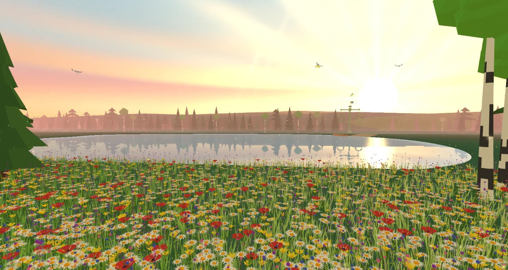
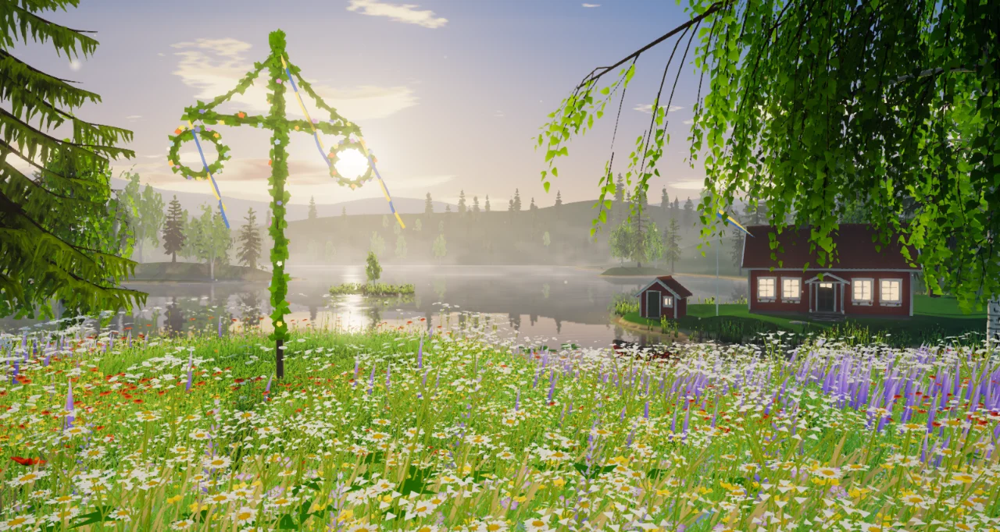
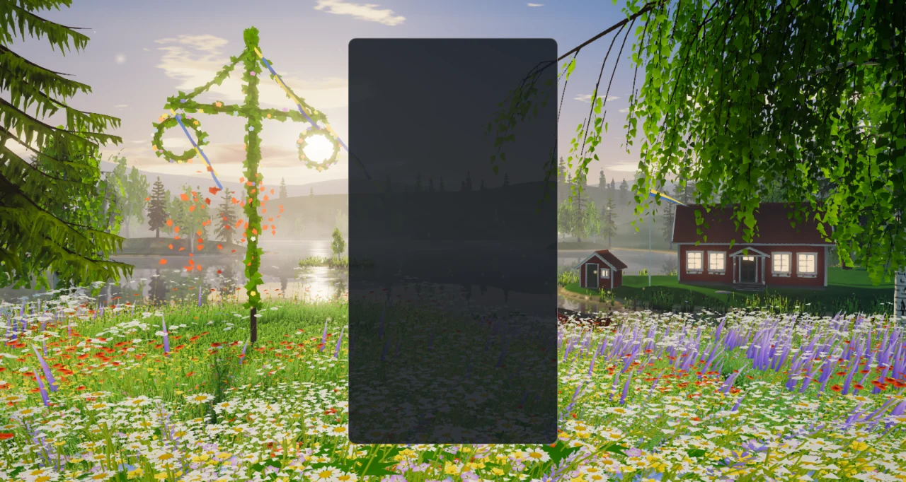
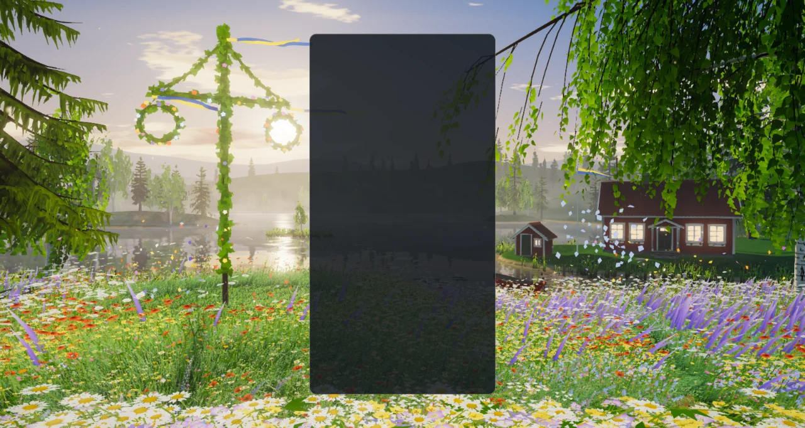
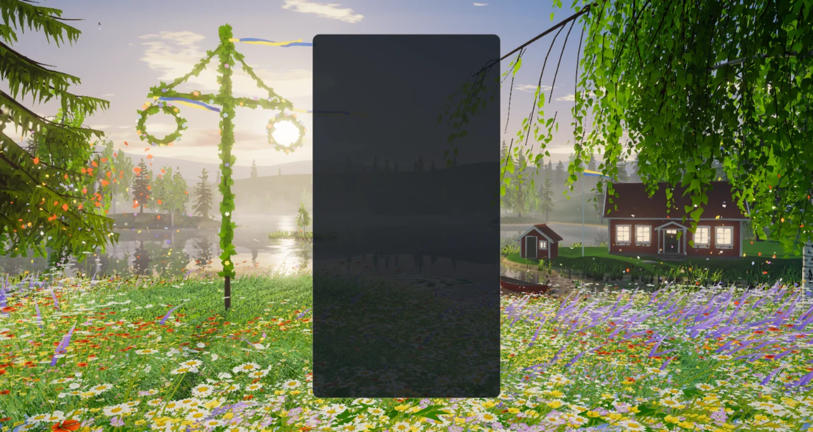
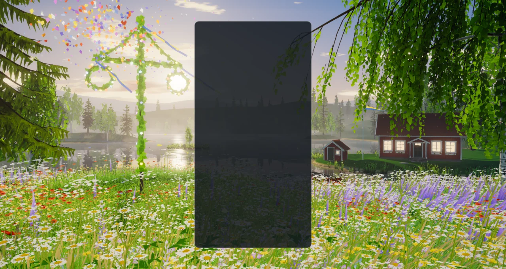
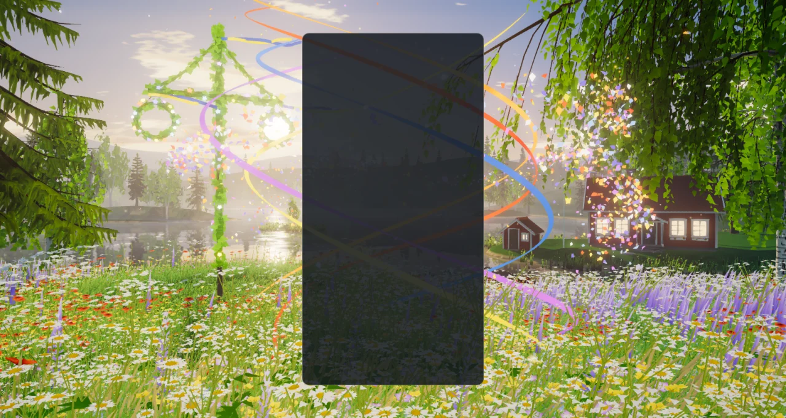
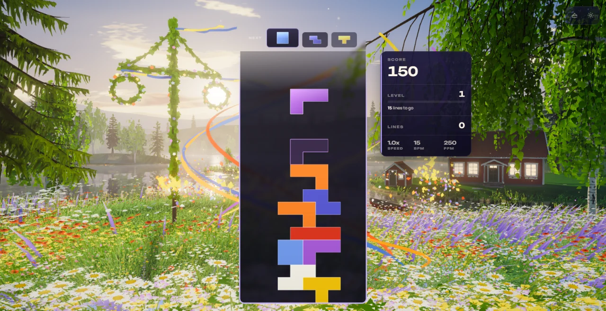
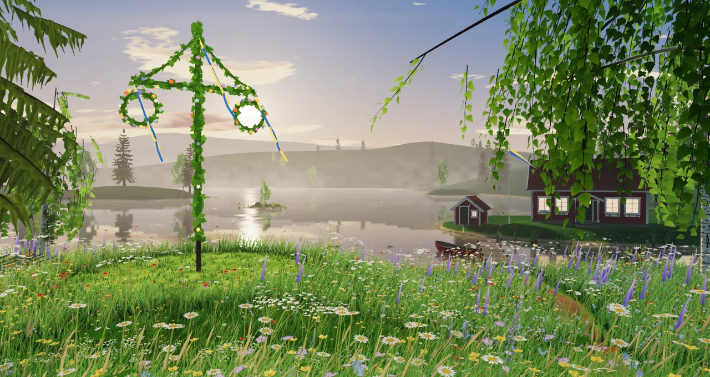
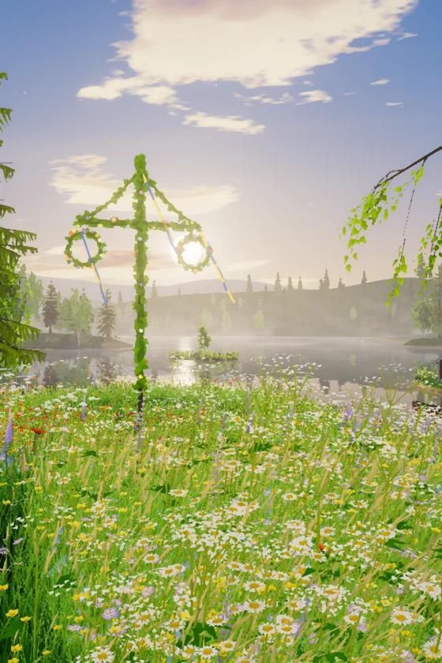

# Summer — Midsummer's Eve by the lake (visual overhaul, 2026-10-08)

**Status: implemented (branch `feature/summer-masterpiece`). A record of what was built and
how it was checked — not a backlog.** Replaces the flat-shaded meadow scene that lived in a
playground effect and its three TRELLIS trees.

| Before | After (High, native WebGPU) |
| --- | --- |
|  |  |

## What the player sees

The same place as before — a Swedish lake on Midsummer's Eve, a flowering meadow, a maypole,
a red cottage, birch and spruce — now built as a world and lit by a sun that stands low over
the water and will not set. The camera stands in the meadow behind a crest of tall flowers.
On the left an old spruce leans into the frame beside the maypole on its mown ring, wound
with birch leaves, hung with two wreaths and flying blue and yellow ribbons. The maypole
stands exactly where, from the resting camera, the low sun is seen through its right-hand
wreath; below it the sun's path runs down the open lake toward the camera, past a skerry
with one small birch and a wooded headland in the evening mist. (Move the pointer and the
sun slides out of the ring and back.) On the right a weeping birch hangs its strands over
the jetty and the rowboat, and the Falu-red cottage with its white corners looks out from
its promontory with the lamps lit and smoke at the chimney, a pennant on the pole beside
it, and the boathouse at the water on the tip of the promontory, clear of the house.
Behind everything, four ridges of blue hills. The lake is a real mirror of all of
it; butterflies work the flowers, swallows hunt over the cove, and seed down drifts through
the light.

The board card hides the middle quarter of a landscape screen, so the picture is composed
for the two side thirds and the strips above and below the card. In single player the
score card stands right of the board, which is why the sun stands on the left: an earlier
framing had it on the right, behind that card. Portrait keeps the same world, turned
toward the maypole and the sun.

## Seven kinds of flowers

On Midsummer's Eve you pick seven kinds of flowers. Each tetromino is one of them, and the
piece colours are the petal colours:

| Piece | Flower | | Piece | Flower |
| --- | --- | --- | --- | --- |
| I | poppy (vallmo) | | Z | lupine (lupin) |
| O | harebell (blåklocka) | | J | orange hawkweed (rödfibbla) |
| T | buttercup (smörblomma) | | L | wood cranesbill (midsommarblomster) |
| S | oxeye daisy (prästkrage) | | | |

Which flower goes with which piece is not arbitrary: the project's palette gate
(`npm run check:palette`) screens every theme against the shape-to-colour mapping that is
familiar from other block games, and this assignment matches none of its seven roles (the
first assignment tried matched five; the palette it replaces matched three).

Red clover, cow parsley, dandelion clocks and water lilies fill the meadow and the cove
around them.

## How the evening answers the game

`SummerReactions` is a pure director; `SummerFxDirector` turns its cues into petals thrown
from behind the board card, gusts sent through the grass from the foot of the board, and
rings dropped on the water behind it, at the column and height where the event happened.

| Event | Response |
| --- | --- |
| Piece lock | Petals of the piece's own flower puff from the card's edge beside it; a gust spreads through the meadow from the foot of the board, and that kind of flower nods, swells and glows wherever it grows; a ring opens on the lake. |
| The bouquet | Each kind of flower locked for the first time lights its lantern on the maypole's wreaths. The seventh kind completes the bouquet: the whole garland flares, the ribbons stream, and the maypole throws petals of all seven colours into the sky. The seven lanterns stay lit through the flare, then burn down, all but the kinds already picked for the next bouquet. |
| Hard drop | A stronger gust and ring, and from a long drop dandelion seed is shaken into the air where the piece came down. |
| Line clear (1–3) | Twin jets of petals from both sides of the card at the cleared rows, a broad ring, the sun's path flaring; from two lines a second ring and a front of wind that flattens the grass and bends the woods as it crosses; butterflies go up. |
| Four lines | All of that, petals and seed lifting off the whole meadow around the board, a sunburst, and the swallows towering. |
| Combo / streak | Petals gather into a flower crown that turns around the board, each petal the next of the seven kinds. Cascade depth (`COMBO`) or consecutive clearing locks raise it; it climbs, thickens and quickens, and above the halfway mark silk ribbons unfurl in spirals around the board. A lock without a clear ends the streak and the crown falls into the grass. |
| T-spin | A spinning garland of buttercup petals (the T piece's flower) beside the board, and a ring. |
| Back-to-back | Holds the crown and lifts the light. |
| Perfect clear / level up | The whole evening exhales: light, rings, wind, petals, wings (a perfect clear also throws a bouquet). |
| Game over | The wind dies; petals come down onto the grass and the water. |

A petal that lands on the lake leaves a small ring (at most a few a second), and now and
then a fish rises or the boat rocks, so the water is never dead. Everything honours
`backgroundComboEffects` and `pieceLockRipple`, pauses with the theme, and is driven by
simulation seconds. No event allocates: petals come from a fixed hidden reserve, emitters,
rings and gusts from fixed pools.

| Lock (poppy) | Two lines | Four lines |
| --- | --- | --- |
|  |  |  |

| The bouquet | Combo, held | In the game |
| --- | --- | --- |
|  |  |  |

## How it is built

### Trees and buildings authored in Blender

`scripts/blender/summer_meadow_assets.py` grows nine trees (an old weeping silver birch
and an old Norway spruce for the frame, three grove birches, four grove spruces) on the
branching library the Fall grove introduced and the Golden Forest's conifer recipe, bakes
bark ambient occlusion in Cycles, renders the far-shore sprite sheet, and builds the
cottage, the shed, the maypole, the jetty, the rowboat, a section of roundpole fence and
three boulders. A tree file holds a bark mesh and a point cloud of *foliage sites*; the
runtime instances shared sprays of real leaf and needle geometry onto them. The props carry
no materials: their vertex colour says what each face is made of (weathered timber, Falu
red, white paint, roof tile, stone, glass, door paint, garland, flower), and one shader in
the theme paints them all. Details, formats and the regeneration command are in
[`src/themes/summer/assets/ATTRIBUTION.md`](../src/themes/summer/assets/ATTRIBUTION.md).
The pack is 3.4 MB in twelve files with no third-party source and no generative model, and
regenerating it reproduced every file byte for byte (three runs, compared by SHA-256). It
replaces 18.4 MB of trees and props and a 4.6 MB HDRI.

The generator runs **headless** (`blender --background --factory-startup`); the Blender MCP
session was not used, so nothing in an open Blender was touched.

### Flowers, grass and reeds generated at run time

`summer-flowers.js` builds every plant of the meadow from a seed as real geometry — petals
are kites and fans, not alpha cards — at two levels of detail: ten kinds of flower, two
grass clumps and the water lilies. `summer-meadow.js` plants them in drifts (each kind has
its own patch noise, and the tall kinds favour the crest in front of the camera) and thins
them with distance into flecks the ground shader carries.

### Runtime modules (`src/themes/summer/`)

| Module | Owns |
| --- | --- |
| `summer-theme.js` | Lifecycle, renderer, asset loading, gameplay subscriptions, board tracking. |
| `summer-assets.js` | Loading and decoding the GLBs and the sprite sheet. |
| `summer-world.js` | Composition root: builds and updates everything below. |
| `summer-light.js` | The sun, its static shadow map, sky colour, haze, ambient, the wind of trees and of the meadow, the gust rings and the per-flower call levels, a shared noise texture. |
| `summer-composition.js` | Camera framings, hand-placed trees, the procedural stands, the visibility test. |
| `summer-terrain.js` | The analytic shores and heights, the terraces buildings stand on, the ground, the lake-depth map and the meadow map (path, mown ring). |
| `summer-flowers.js`, `summer-meadow.js` | Plant geometry; planting, and the two shaders that draw all grass and all flowers. |
| `summer-forest.js` | Bark and foliage instancing and their materials. |
| `summer-backdrop.js` | The sprite forest of the far shores and the blue ridges. |
| `summer-homestead.js` | The cottage, shed and pennant; the maypole, its lanterns and ribbons; fence, jetty, rowboat, boulders. |
| `summer-shore.js` | Reeds, bulrushes and water lilies. |
| `summer-lake.js`, `summer-rings.js` | The mirror, the water surface, and the ring pools (lake rings and meadow gusts). |
| `summer-atmosphere.js` | Sky, sun, cumulus and cirrus, mist banks, pollen. |
| `summer-life.js` | Butterflies and swallows. |
| `summer-garlands.js` | The silk ribbons a combo winds around the board. |
| `summer-petal-sim.js`, `summer-petals.js` | Petals, seed and pollen: simulation, and drawing. |
| `summer-reactions.js` | The event director (pure). |
| `summer-stage.js`, `summer-fx-director.js` | Board card → world, and cues → petals, force fields, rings and gusts. |
| `summer-post.js` | Volumetric shafts, bloom, grade, FXAA. |
| `summer-quality.js` | One table for everything a tier scales. |

### Techniques (three 0.186.1)

- **A meadow with no CPU in it.** Every grass clump and flower is an instance whose root
  and turn live on the geometry; the vertex shader stands it up, bends it in travelling
  bands of wind, and swells its flower heads when a gust ring from the board passes. All
  grass shares one material and all flowers another, whatever their kind or level of
  detail. Backlit blades and petals are lit as thin leaves, so the low sun shines through
  them.
- **Gust rings and lantern flowers as uniforms.** A gust is one `vec4` (position, age,
  strength) in a small uniform array that every plant's vertex shader reads; the per-flower
  "call" levels are two more. Nothing is rebuilt and no texture is written when the game
  speaks.
- **A planar mirror with an analytic ring pool.** The lake samples three's `ReflectorNode`
  through a wave normal built from the shared noise texture plus expanding rings. Petals,
  birds, ribbons and the maypole are scenery, so the mirror shows them too.
- **One static shadow map, used everywhere.** Materials stay unlit `MeshBasicNodeMaterial`
  and call a shared `shadow(light)` node themselves; nothing that casts moves under a fixed
  sun, so the map is drawn over the first frames only.
- **Volumetric shafts with `GodraysNode`**, at half resolution with a bilateral blur,
  raymarched through that shadow map, so the birch and the maypole cut their own beams.
- **Leaves and needles as geometry.** Every spray of every tree is an instance in eight
  draws; sprays that can never be on screen — directly or mirrored — are dropped at build
  time.
- **Level ground under what people built.** The terrain's height function carries
  terraces: the cottage, the boathouse and the maypole's mown dance ground each stand on
  one, the buildings bedded a few centimetres into it. From the play cameras the boathouse
  and the cottage are kept four degrees apart, so neither stands in front of the other.
- **Closed-form life.** Butterflies and swallows are functions of time in two vertex
  shaders: no compute pass, no per-frame CPU work, the same flight on both backends.
- **CPU petal simulation.** A few thousand particles in typed arrays: the same code on
  both backends, in the playground's deterministic `seek`, and in the unit tests.

### Quality tiers

| Tier | Stands / far trees | Sprays kept | Grass clumps | Flowers | Petal pool | Mirror | Shafts | Post |
| --- | --- | --- | --- | --- | --- | --- | --- | --- |
| Extreme | 44 / 460 | 100 % | 49,000 | 35,200 | 3,600 | 0.75 | 40 steps | on |
| Ultra | 38 / 400 | 100 % | 40,500 | 29,400 | 3,000 | 0.6 | 32 steps | on |
| High | 32 / 340 | 86 % | 32,000 | 23,600 | 2,400 | 0.5 | 26 steps | on |
| Medium | 24 / 250 | 62 % | 20,500 | 15,400 | 1,500 | 0.4 | 16 steps, 0.35 scale | on |
| Low | 16 / 160 | 40 %, trunks only | 10,400 | 7,800 | 850 | 0.3 | analytic glow in the haze | off |
| Minimal | 10 / 100 | 28 %, trunks only | 5,400 | 3,900 | 450 | 0.22 | analytic glow in the haze | off |

"Stands" are the modelled trees beyond the nine placed by hand. Low and Minimal draw the
same scene directly with ACES tone mapping and skip limb geometry.

| Minimal, forced WebGL2 | Portrait, High |
| --- | --- |
|  |  |

## Verification

- Unit tests: 631 tests in eight new files (reactions 84; petal simulation 47; stage and
  effects director 129; flowers 72; land 37; asset pack 77; world 65; theme 120), all
  passing, none skipped. They replace the three test files of the previous implementation.
  Two helper agents wrote most of them from the modules' contracts; what they found is
  listed below.
- Whole suite, run once while other sessions kept the machine busy: 690 files, 9,608 tests;
  685 files passed. The five that did not: four timeouts under load (three Odyssey forest
  and bake tests, and the URL-parameter catalog's scan of the source tree), a 300 ms Odyssey
  bake budget, and `odyssey-level-briefing`. Run again on their own with long timeouts,
  three of the five files pass. The other two are in files this change does not touch: the
  bake took 304 ms, and the briefing test expects `250,000` where this machine's Swedish
  locale prints `250 000`. CI is the authority for those.
- Gates: typecheck; TypeScript ratchet; lint ratchet (763 errors against a baseline of 807:
  the removed code took the difference with it, the new files add none, and the baseline was
  left as it is); architecture fitness; theme lifecycle audit; dependency boundaries (1,283
  modules); perf budgets; release gates; production build with the boot-closure guard (the
  theme's chunk is 138 kB, 49 kB gzipped); IP-string gate; Pages artifact check — all pass.
  The palette gate fails on `main` and here for the same unrelated reason (Stillwater);
  Summer scores 0/7 on it.
- `scripts/validate-all-themes.mjs --theme summer` against the dev server: 106 lifecycle
  checks, 0 failures, 0 console errors, 0 shader-pipeline failures — **with a temporary
  local patch to its worker that is not part of this change.** Since the theme collection
  landed, a theme card opens the theme's detail page and the theme is applied from a button
  there, and every theme but Forest is locked on a fresh profile; the worker still clicks
  the card and waits for a selection, so unpatched it fails for any theme (five checks,
  from `theme-card-selection-started`). The patch added `unlockAll=1` to the URL and
  pressed the detail page's Apply button. That worker runs Electron on its default graphics
  adapter, which on this laptop is the integrated AMD GPU (by the game's own renderer
  string), so the run also shows the theme starting and drawing a correct frame there:
  selecting it from Forest took 8.2 s the first time and 2.1 s the second, on the unbundled
  dev server. No frame rate was read on that GPU.
- Playground captures on WebGPU (RTX 3070 Laptop) unless noted, a final set of 20 taken
  after the last change, none with any console output: rest; hard drop; two lines; four
  lines; the bouquet; a lock with four kinds picked; a held combo of seven; perfect clear;
  T-spin; game over; High on the forced WebGL2 backend; Medium; Low; Minimal on WebGL2; an
  upright 560 × 840 frame at High and at Low on WebGL2; a 2.39:1 frame; the icon's lens; and
  two close views of the cottage from the water's edge.
- In the real game (Electron, dev server, single player): the theme starts on WebGPU, aims
  its events at the live board, takes real hard drops from the keyboard and injected
  clears, a combo and four lines, survives a live quality change (High to Medium), and
  leaves no canvas behind when another theme takes over.
- Faults found on the way, all fixed and, where a test can hold them, tested:
  - by the user, looking at captures: the cottage floated above its slope (the terrain now
    carries level terraces, and the buildings are bedded into them); the boathouse stood in
    front of the cottage (it moved to the tip of the promontory, and a test keeps the two
    apart as seen from both play cameras);
  - by the in-game frames: the sun stood behind the single-player score card (it moved to
    the left of the board); the maypole's crown was cut off by the top of the frame (the
    camera's target is a world height while its eye is a height above the ground, and the
    pitch had been worked out as if both were the same; a test now keeps the whole pole in
    frame);
  - by the helper agents' tests: a burst of gusts overflowed its queue; lake
    rings were placed on the meadow, and a later fix drew them back onto the bank; the
    bouquet's petals took their kind from a per-frame index, not a running count;
    `summerFlowerSlotForPiece(null)` answered with a filler flower; the lantern and
    flower-call uniforms started non-zero (a default `Vector4` has `w = 1`), so one lantern
    burned before the first frame; and the next lock put a finished bouquet's lanterns out
    while the maypole was still flaring.

Observed, not measured (whole-game frame pacing at 1584 × 813 on the RTX 3070 while other
sessions held the CPU and queued for the GPU, so the figures move between runs; three
runs): at High, a median frame of 8 to 15 ms and a 99th percentile of 15 to 23 ms through
the event script, no frame over 66 ms; 78, 79 and 130 fps reported.

Not verified: GPU cost per tier through the theme perf lane (ADR-0016); frame rate on
integrated graphics; physical phones; local multiplayer and Infinity layouts in a capture;
the icon on an Odyssey level orb; sessions of several hours. No sounds were added or
changed.
`docs/theme-screenshots/summer.png` still shows the previous artwork (a fleet capture
writes it). The icon and the sun standing in the maypole's wreath are the implementer's
choices and have not been reviewed.

## What was removed

- The previous implementation, about 4,550 lines with its tests: the whole scene in
  `src/playground/effects/summer-meadow.effect.js`, the `summer-dew-lock` and
  `summer-ring-dance` effects, `composition/season-director.js`,
  `composition/summer-gameplay-routing.js`, `rendering/summer-gameplay-fx.js`,
  `rendering/summer-trees.js` and the three test files that covered them.
  `rendering/summer-flora.js` stays: Odyssey's third chapter builds its wildflowers with it.
- 18.4 MB of assets (three reconstructed trees of 5–7 MB each, the old cottage, maypole,
  dock and flora files) and `public/hdri/belfast_sunset_puresky_2k.hdr` (4.6 MB), which
  nothing else read. The two low-detail trees the Koi Pond tree audition still loads moved
  to `src/themes/shared/assets/`.
- 1,360 lines of dead CSS for a DOM-built Summer that predates the WebGL one
  (`.summer-sun`, `.summer-god-ray`, `.butterfly-wing`, …); `#summer-theme` keeps one base
  colour.
- The old effect's URL flags (`bloom`, `comboSim`, `flowers`, `godrays`, `grass`, `motes`,
  `noBirds`, `noReflect`, `summerNoReflect`, `noTrees`, `reduced`, `reducedMotion`).
  `forceWebGL` / `summerForceWebGL` remain, and `summerSeed` is new.
- The three plan documents of the earlier design are kept and marked superseded.

## Known limits

- Grass and flowers are planted in the wedge the camera sees (out to an aspect of about
  2.4:1); they are not meant to be seen from elsewhere, and they are not in the lake's
  mirror.
- The shadow map is static, so swaying crowns and flying ribbons do not move their shadows,
  and the far shores lie outside it.
- Portrait is the landscape world seen from the same spot: the cottage is out of frame.
- Bark, ground, roof and water detail are procedural in the shader; there are no texture
  maps beyond the sprite sheet.
- The far sprites face one camera.
