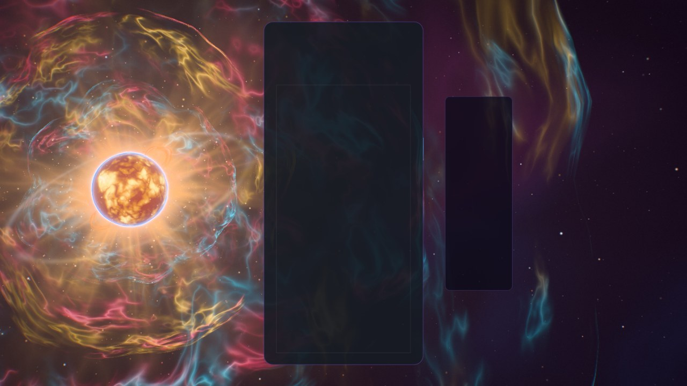
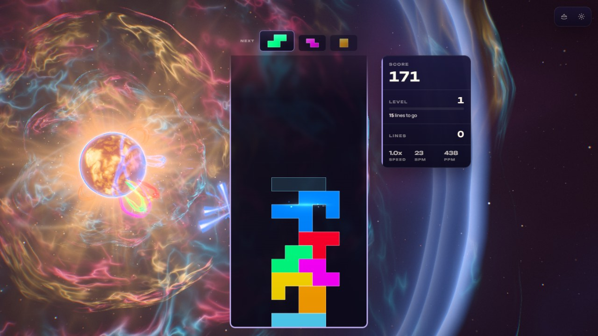
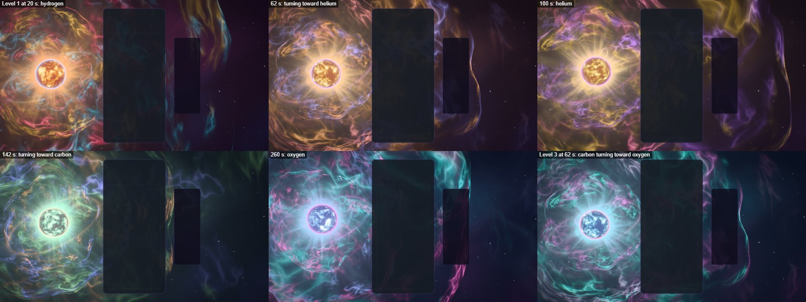
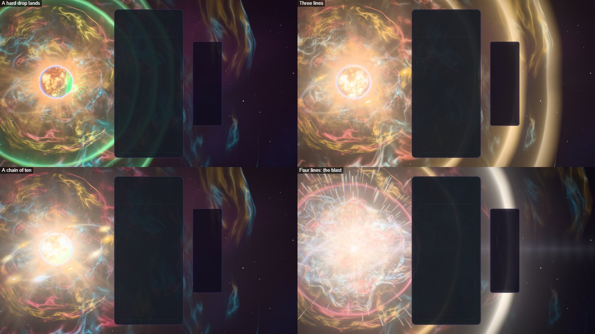
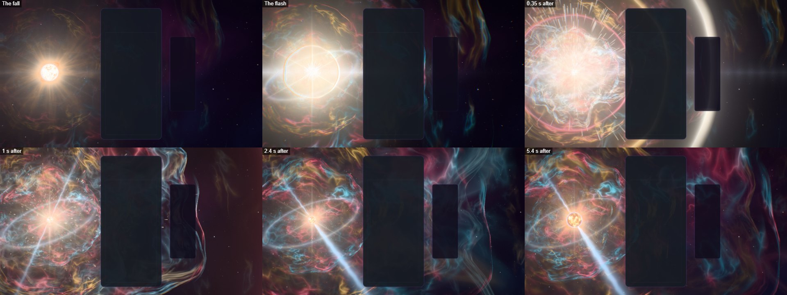
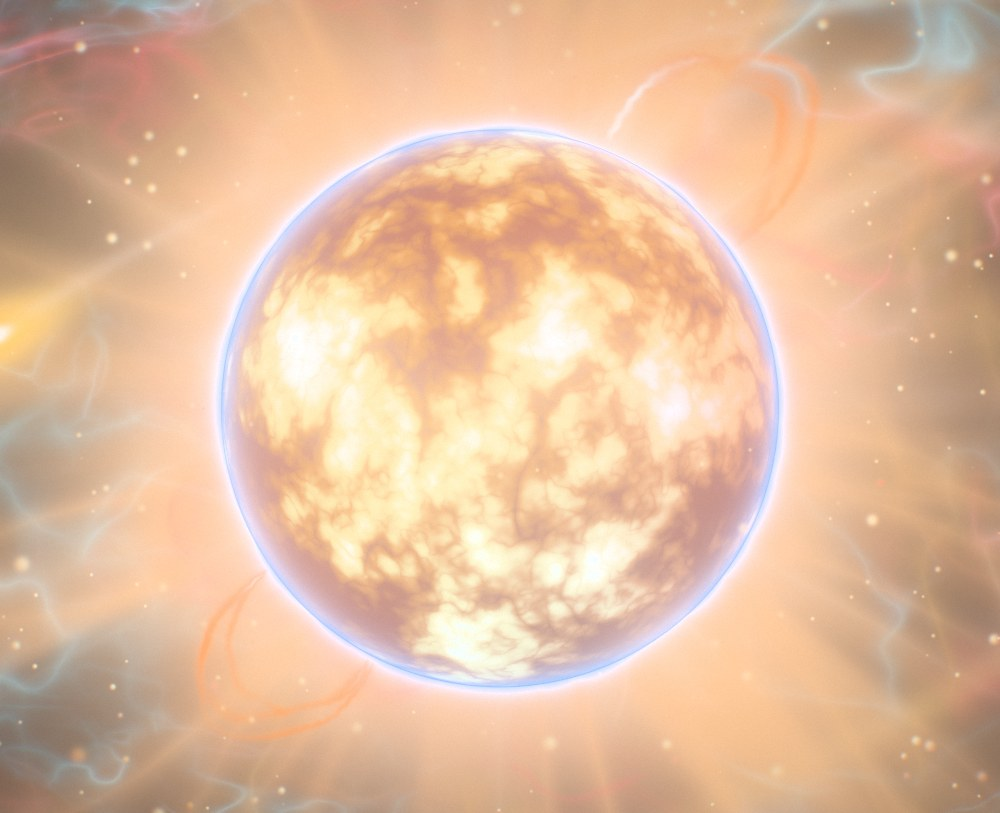
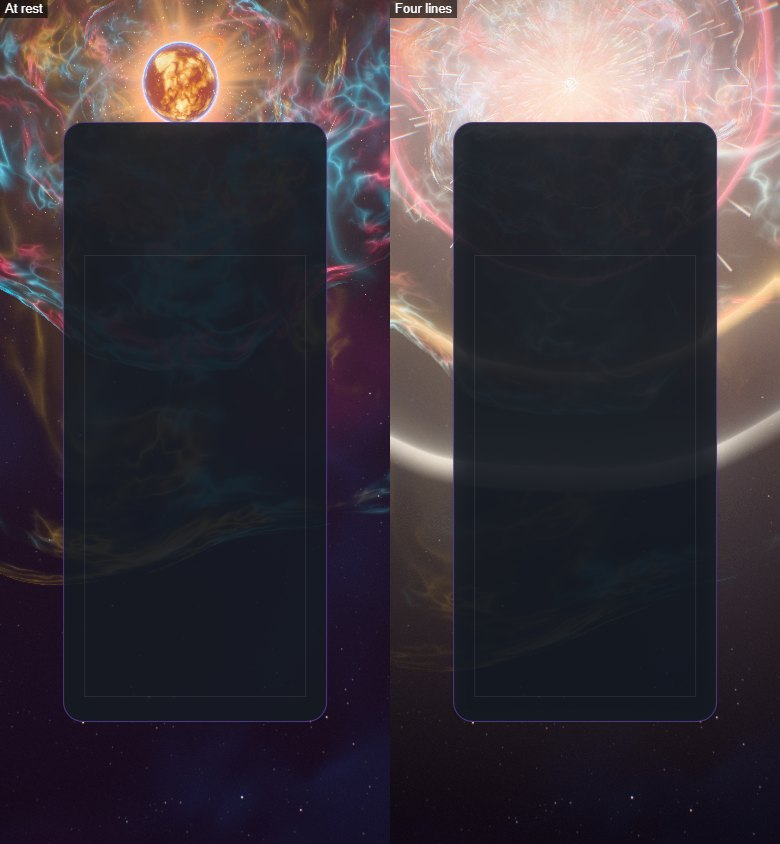
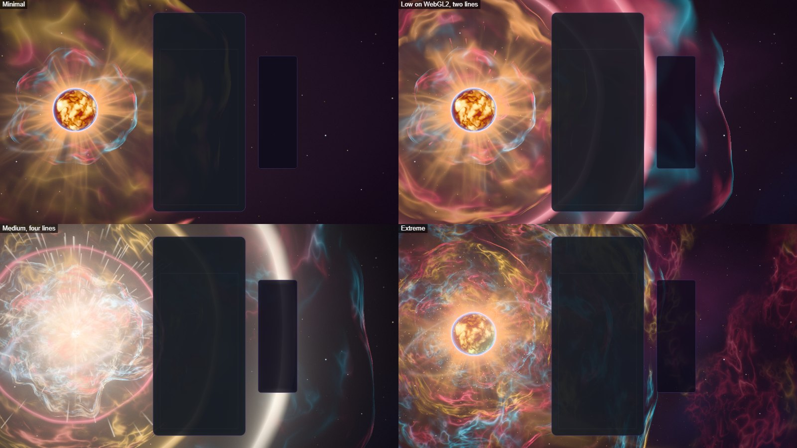
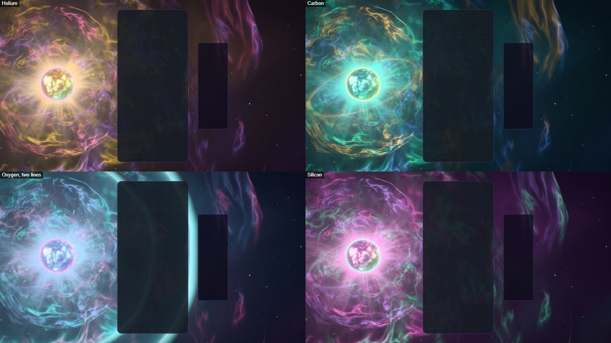

# Supernova — the star the board feeds

Implemented 2026-10-09 on `feature/supernova-masterpiece`, with Three.js 0.186.1. A from-scratch
rebuild: it replaces the earlier theme in full (a 570-line theme class on `WebGLRenderer`, 200
lines of GLSL, a noise-shaded sphere with a sprite behind it, 2,000 points for stars and a torus
per shockwave). Supernova keeps its identity — a burning red-gold star with an electric blue
edge, shockwaves on a clear, flares on a lock, pieces in the same seven colours — and everything
else is new. This document records the shipped design and what was verified. It is a reference,
not a backlog.

## The picture

A massive star burns to the left of the gameplay card. Its surface boils: giant convection
cells, granules with dark lanes between them, spots, a limb that darkens and reddens, and the
thin electric edge of its chromosphere. Streamers run out through its corona, prominences arch
off its limb and rain back, and a wind of embers leaves it. Round it hangs the nebula it has
thrown off: nested shells of filaments in the palette's three gas colours (crimson, teal and
gold at the first level), each a little larger and fainter than the one inside it, all drifting
slowly outward. A thin ring of old gas circles the star, leaning back from the line of sight.
Behind everything is the deep sky: lattices of stars and faint far clouds.

The gameplay card covers the middle of the frame, so the picture is built for what stays
visible: the star burns in the middle of the margin to the card's left, its shells sweep behind
the card, and the right is left to the outer filaments and the sky. Where the card leaves too
little room beside it (an upright phone), the star climbs into the sky above the card instead.

## The one idea

The star is a pressure vessel and the board feeds it. Every piece falls into it, every clear
makes it answer, a chain heats it, and four lines push it over the edge: it collapses,
detonates, and a new star kindles in the wreck.

## Event language

| Event | Response |
| --- | --- |
| Piece lock | A stream of the piece's colour tears away from the card's edge at the piece's own height, bends in toward the star and falls onto its surface. Where it lands the photosphere flashes in that colour, a ripple runs round the star from the spot, a prominence rises there in the same colour, sparks spray off the surface, and a thin ring of the colour runs out through the nebula, tinting each shell as it crosses. The patch of colour stays on the star for about ten seconds, so the star wears the last few pieces played. |
| Hard drop | The same, harder: three streams, a taller prominence, a camera kick. |
| Line clear | The cleared rows go into the star as streaks of light, and a fifth of a second later the star answers with a shock: one ring per line, a seventh of a second apart, runs out through the nebula. Every shell flares in the shock's colour as a ring crosses it and settles again, the ring round the star flares as it passes, debris flies from the whole limb and prominences are thrown up in the shock's colour. One line answers in the nebula's second colour, two in its first, three in its third. |
| Combo | The star heats. Its surface climbs from red-gold through white toward blue-white, it boils and turns faster, its corona and its rays lengthen, white cracks open along its lanes, and every step throws up a taller prominence than the last. On the ring, one more bead lights for every step of the chain (twelve in all, each five places on from the last, so a short chain is already spread round the ring). When the chain breaks the beads go out one after another and the star lets its breath go as one soft ring. A chain of eight sets the star off by itself. |
| Four lines / perfect clear | The star falls in on itself. For four tenths of a second it shrinks to a white point, the nebula's light sinks, the embers of its wind run backwards into it and the picture itself is drawn in toward it. Then it detonates: a flash that the lens answers with six spikes and a streak, three rings (the flash's white, then two of the nebula's colours), a blast wave that bends the picture as it crosses, a fireball of three ragged shells that cools from white through the nebula's colours as it grows, a spray of ejecta, and an echo that crosses the far clouds of the sky. What is left is a pulsar: a small blue-white star whose two beams sweep the nebula like a lighthouse while it swells back to a full star over about thirteen seconds. A second four-line clear within seven seconds does not detonate it again: the newborn star answers with a four-ring aftershock. |
| T-spin | The corona winds into a pinwheel and springs back, and a thin ring leaves in the chromosphere's colour. |
| Level up | The star burns a heavier element and its colours move one palette on, with a ring in the new chromosphere's colour: five palettes, cycled (hydrogen, helium, carbon, oxygen, silicon). |
| Time | The colours also turn by themselves, whatever the level: a palette holds for about half a minute, then drifts into the next over the following fifty seconds, so the whole cycle comes round in a little under seven minutes. A level change steps one palette on from wherever time has carried them. |

Combo here is the true consecutive-clear combo (one `ComboTracker` per player in
`SupernovaDirector`); the bus's `COMBO` event is cascade depth (ADR-0011). With several boards
on screen each lock leaves its own board, and the star heats to the longest chain any board is
holding.

The palette has a clock of its own (`paletteDrift` in `supernova-core.js`): the level says where
in the cycle the colours start, and the clock carries them on, one palette every eighty seconds.
A new run goes back to level 1 and keeps the clock, so the colours never snap back to the start.

## How it is built

| File | Role |
| --- | --- |
| `supernova-core.js` | Three-free constants and maths shared by the choreography, the shaders and the tests: the geometry, the shells' life cycle, how far a front or a fireball has run, the star's size round a detonation, the five palettes, where the star sits on screen for an aspect. |
| `supernova-tsl.js` | Hashes, the baked 3D noise, the shared uniforms, the test for what hides behind the star, material and geometry helpers. |
| `supernova-sky.js` | The dome: the void, far clouds, star lattices, and a detonation's echo crossing the clouds. |
| `supernova-nebula.js` | Every shell on screen (standing shells, fronts, the fireball) from one table walked by one loop. |
| `supernova-star.js` | The star on one billboard: photosphere, chromosphere, corona, what the board has written on the surface, the lens's glare and spikes. |
| `supernova-loops.js` | Prominences: ribbons along closed-form arches in the star's frame. |
| `supernova-ring.js` | The ring and its twelve beads. |
| `supernova-fx.js` | Streams, sparks, the wind's embers, the pulsar's beams. |
| `supernova-world.js` | Owns the uniforms, the parts, the camera rig, the star's pose and the choreography. Shared with the playground effect, so what is iterated there ships. |
| `supernova-director.js` | Renderer-free: stages bus events per player and resolves one lock and one clear per frame. |
| `supernova-composition.js` | Three-free: reads the live card, board and HUD rects and maps board columns and rows onto the screen. |
| `supernova-post.js` | One scene pass, bloom, and one output pass. |
| `supernova-quality.js` | The six tiers. |
| `supernova-theme.js` | Lifecycle, renderer selection, settings, layout watch, GPU-loss recovery, capture flags. |

Techniques worth knowing before changing it:

- **One node renderer on both backends.** `WebGPURenderer` on WebGPU, its WebGL2 backend
  otherwise (or `?forceWebGL`). There is no `ShaderMaterial` left. Nothing uses compute: every
  stream, spark, ember and prominence is a closed-form function of the clock, so the WebGL2
  backend draws the same star.
- **The nebula is never marched.** Every shell is a sphere round the star. A view ray meets a
  sphere at two points in closed form; at each the gas is read from a pattern fixed in
  direction, and the light is weighted by how long the ray stays in the shell's skin, which is
  what draws a bubble's bright rim. A pattern fixed in direction is also why a shell keeps its
  filaments as it grows, the way a real remnant's gas does.
- **One table, one loop.** Standing shells, shock fronts and the fireball's shells are rows of
  one uniform array (five `vec4` each). The world writes the live rows each frame and packs them
  at the front; the shader loops to a uniform count. A quiet nebula pays for its standing shells
  and nothing else.
- **A front is solved, not textured.** A shock front is an even skin with a thickness. The
  light along a ray is the length of the ray inside the skin, in closed form: greatest where the
  ray grazes the skin's inner face, zero at the outer one. Cubed, it is a ring with a crisp
  outer edge, a glow that fades inward and almost nothing across its face, and it costs no read
  of the noise. The first version gave fronts the same shading as the filament shells with an
  even density; each was a filled disc, and three of them washed the frame out.
- **No outline is a circle.** The radius a ray meets is nudged by a slow field read once per
  pixel in the direction of the ray's closest approach to the star.
- **Threads are where a smooth field crosses its middle.** The 3D noise is 64³ and holds four
  smooth fields. A filament, or the dark lane between two granules, is `1 − |2n − 1|` raised to
  a power: its sharpness comes from the shader, not from the texture's resolution. Each shell's
  pattern is read from a sphere squeezed along an axis of its own, so its threads run on as long
  strands instead of closing into squiggles.
- **The surface boils without 4D noise.** The photosphere is three reads of the 3D noise at a
  point of the star's own frame (so the pattern turns with the star). The sphere those reads lie
  on is slid through the noise: every point then sees a different slice, and the pattern
  changes shape instead of sliding. The corona's streamers run outward the same way, with two
  reads half a cycle apart taking turns so the slide never has to go on for ever.
- **Detail that would shimmer is faded by its own footprint.** The noise has no mip chain. The
  finest granules and the finest threads are read only where a texel of that read is no smaller
  than a pixel (the star in the icon's lens, the outer shells), and fade out before they alias.
- **Nothing writes depth.** The sky is drawn first, the nebula over it (premultiplied, so its
  gas dims the stars behind), the star over that (its disc is opaque), every light added on
  top. Whatever must hide behind the star — the far half of the ring, the far foot of a
  prominence, an ember passing behind — tests the star's sphere in its own shader.
- **The star's size is a function, not a state.** `collapseScale(time, birth)` gives the star's
  radius round the moment of a detonation: the fall before it and the swelling after it. A
  collapse only has to write down when the flash will be.
- **Events are queued with the time they happen at** (a stream's landing, the rows' arrival,
  the flash) and applied on the frame that reaches it, as of their own moment. Nothing is
  created at event time: events write numbers into slots and preallocated pools. `seek(t)` plus
  a fixed-step replay reproduces any frame.
- **HDR, single output.** The scene is scene-linear. A max-channel knee selects what blooms (no
  MRT). One output pass does the fall and the blast ripple, the lens fringe, the calm zones on
  the card and HUD, bloom, rays dragged out of the star and a streak dragged sideways through
  it, a hue-preserving filmic curve, grade, vignette, grain and dither. An iris closes as the
  star flares so its colours survive the surge. `usesMrtScenePass()` is false.
- **No MaterialX noise.**

## Tiers

| Tier | Standing shells | Reads per crossing | Embers | Sparks | Prominences | Star lattices | Far clouds | Bloom, rays | Streak, fringe |
| --- | ---: | ---: | ---: | ---: | ---: | ---: | --- | --- | --- |
| Minimal | 2 | 1 | 260 | 160 | 4 | 1 | off | off | off |
| Low | 3 | 1 | 520 | 280 | 6 | 2 | on | off | off |
| Medium | 3 | 2 | 1,000 | 480 | 8 | 2 | on | on | off |
| High | 4 | 2 | 1,800 | 800 | 10 | 3 | on | on | on |
| Ultra | 5 | 3 | 2,800 | 1,200 | 10 | 3 | on | on | on |
| Extreme | 5 | 3 | 4,200 | 1,700 | 10 | 3 | on | on | on |

Every tier keeps the whole picture and every event. These are allocation budgets, not
measurements of frame rate.

## Assets

None. Everything is generated in code. No model or texture file is loaded, and Blender was not
needed: a star and its nebula are a sphere, shells and light, and what makes them read is the
shading. The earlier theme loaded no assets either.

The earlier theme's 480 lines of DOM-effect CSS (star layers, a core, a shell, rays, filaments,
pulses, bursts: all left from before it moved to WebGL) leave `public/styles/main.css`, with the
nine empty elements they styled in `index.html`; `#supernova-theme` keeps only its background
colour.

The one thing built at start-up is the noise: a 64³ texture of four fields, baked on the CPU
when the world is built (about 140 ms in Node on the development laptop once warm, 400 to 650 ms
cold on the same machine while a dozen other sessions were using it).

## Verification

- Unit tests: 167 new tests in four files (core 24; world 75; theme 49; director 19). The
  lifecycle-audit test no longer lists Supernova among the themes whose `cleanup()` wraps a
  legacy `dispose()`. With the theme-wide tests the change could touch (dual-state tripwire,
  portable renderers and context recovery, teardown regressions, registry lifecycle acceptance,
  container registry, thumbnails, mobile quality and WebGL2 validation, URL-parameter catalogue
  and its UI): 16 files, 250 tests, all passing.
- Whole suite, run once while a dozen other sessions held the machine: 750 files, 12,107 tests;
  744 files passed. Four of the six that did not pass when run alone with a long timeout
  (wall-clock limits in an Odyssey forest test, the Himalayan Peak field test, a Stellar Drift
  test and the URL-parameter catalogue's parse of the source tree). The other two fail for
  reasons this change does not touch: `odyssey-level-briefing` expects "250,000" and gets
  "250 000" from this machine's Swedish number format, and an Odyssey forest bake measured
  370 ms against its 300 ms budget on the loaded machine.
- Gates: typecheck; lint ratchet (708 errors against a baseline of 807; the new files add none,
  and the baseline was left as it is); theme lifecycle audit; dependency boundaries (1,429
  modules); architecture fitness (three metrics improved, not locked in); production build with
  the boot-closure guard; IP-string gate; Pages artifact check; release gates — all pass on the
  final tree. The palette gate fails on `main` and here for the same unrelated reason
  (Stillwater); Supernova scores 4/7 on it, which passes.
- Playground captures on WebGPU (RTX 3070 Laptop, 1445 × 813): rest; a lock and a hard drop at
  four moments; clears of one, two and three lines; held chains of six and ten; four lines at
  eight moments from the fall to eleven seconds after the flash; a T-spin; a level change; all
  five palettes; the palette at five moments of its drift on level 1 and one on level 3; Minimal, Low, Medium and Extreme; High and Low on the forced WebGL2 backend; an
  upright 390 × 844 frame at rest, in a clear and through a detonation; reduced motion. Every
  batch (6, 17, 34, 29, 12 and 6 shots) ran with no console errors or warnings. Earlier rounds were
  iterated on the WebGL2 backend under SwiftShader (no GPU needed), which is also where a 2.4:1
  frame was checked. Near-square and tablet shapes were not captured after the star's placement
  rule changed; a test holds that its disc never overlaps the solo card across 441 aspect ratios.
- In the real game (Electron, dev server, single player, themes unlocked with `?unlockAll=1`):
  the theme starts on WebGPU, aims its events at the live board, takes real hard drops from the
  keyboard and bus-injected locks, clears, a chain and four lines, survives a live quality
  change (High to Medium) and lets go of its canvas when another theme takes over; no console
  errors or warnings. The same event script ran clean on the WebGL2 backend at Low and on the
  integrated GPU at High (its only warnings were the boot theme's own, about its superseded
  start).
- The repo's lifecycle validator (`scripts/validate-all-themes.mjs --theme supernova`) passes
  against a preview of the production build: 107 checks, 0 lifecycle failures, 0 console
  errors, 0 shader pipeline failures. A first run against the dev server failed three
  theme-card checks with no console error: on the loaded machine the app's own deferred
  `switchTheme('forest')` from boot landed after the card's selection and replaced it. The run
  against the build was made after the review fixes; two cosmetic changes followed it (a
  constant in the prominences' shading and the icon file), after which the build and its gates
  were run again but the validator was not.
- A helper agent ported the theme class, the director and the composition module from the
  Galaxy precedent and wrote the tests, and its review of the world found faults the captures
  had not shown: one field serving as both the last flash and the next, so a second detonation
  while the new star was still kindling made the star jump back to full size and put the
  pulsar out; a critical chain beginning its fall before the rows of the clear that reached it
  had arrived; events decayed twice on the frame that noticed them; prominences evicting each
  other round a ring before they had lived; a row that was not a number reaching a uniform as
  NaN; the star blended across the card's corner on a 2:3 screen; the on-screen size of the
  star 3 to 10% larger than asked; frame-rate dependent pushes on the wind's clock. All are
  fixed and covered by the tests above.

Observed, not measured (whole-game frame intervals at 1445 × 813 on the RTX 3070, single runs):
median 7.6 ms at High with 90% of frames under 8.2 ms and none over 66 ms through 4,592 frames
of rest, the event script and rest again (the display is 120 Hz). A first run, taken while
other sessions held the machine, had a median of 8 ms with 15 of 1,914 frames over 66 ms during
events. On the WebGL2 backend at Low the median was 7.7 ms. As a correctness check only, the
same script on the integrated AMD GPU drew every event at High with a median of 8.3 ms and 90%
of frames under 22 ms.

Not verified: the palette's drift over minutes of real play (it was captured in the playground,
which mounts the same world, and is covered by tests; the in-game runs were shorter than the
half minute a palette holds); GPU cost per tier through the theme perf lane (ADR-0016); physical phones (the
upright frames are a desktop window with the solo layout's rules); local multiplayer, Infinity
and Odyssey layouts in a capture (their routing is unit-tested only); the icon in the running
picker and on an Odyssey level orb; sessions of several hours. `docs/theme-screenshots/supernova.png`
still shows the previous artwork (a fleet capture writes it).

## Reproduce

Run `npm run dev:playground`, then:

`/playground.html?effect=supernova&t=20&quality=High&board=1`

Add `event=lock|drop|clear|quad|tspin|perfect|levelUp` with `eventAge=<s>`, and `combo=<n>`
(a held chain: it does not set the star off, whatever its length), `level=<n>`, `lines=<n>`,
`t=<s>` (the palette's clock too: `t=20` is a level's own palette, `t=62` is well into its turn
toward the next, `t=100` is the next),
`u=<0..1>`, `row=<r>`, `color=<hex>`. `locks=<n>` plays n locks first, so the star is wearing
their colours when the event fires. `demo=1` (without `t`) plays a looping script. `parts=`
draws only the named parts (`sky, nebula, beams, star, ring, loops, embers, streams, sparks`);
`falseColor=1` bands the pre-tone-map peak; `noPost=1` shows the raw scene; `forceWebGL=1` uses
the WebGL2 backend; `reduce=1` is reduced motion; `hud=0` hides the playground's panel. In the
game: `?supernovaTime=`, `?supernovaFixedDt=`, `?supernovaParts=`, `?supernovaFalseColor=1`.

The theme icon is a frame of the scene through the playground's icon lens (the camera turned
to the star and opened to 34°), four seconds after a detonation: the new star, the pulsar's
beams, the ring and the fireball's shells.

`/playground.html?effect=supernova&t=20&quality=Extreme&hud=0&icon=1&iconFov=34&event=quad&eventAge=4.6`

captured in an 813 × 813 window (the largest square this laptop's screen allows), cropped to
74% of the frame round its centre, given a colour lift (contrast 1.2, saturation 1.34,
brightness 1.06) and baked as a 512 px circle on a transparent ground. The same file is kept at
`public/assets/themes/supernova-theme-icon.png`.

## Captured previews

