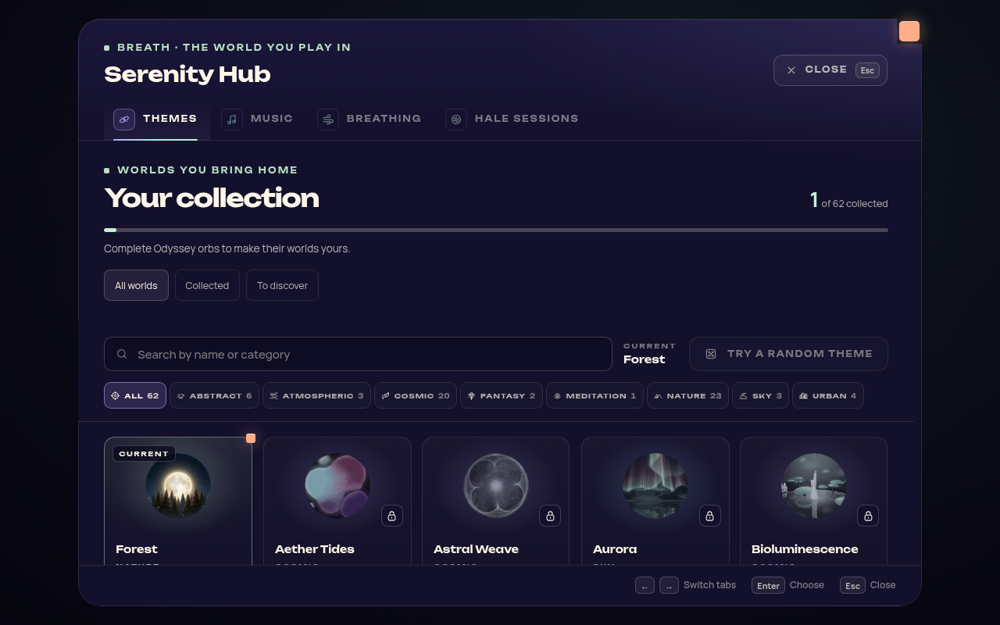
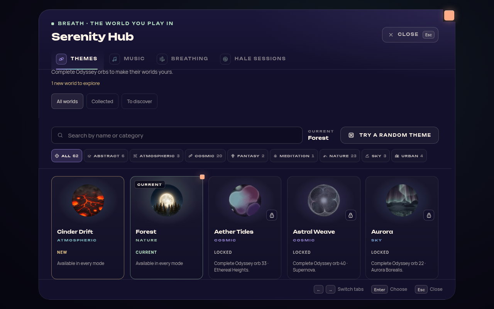
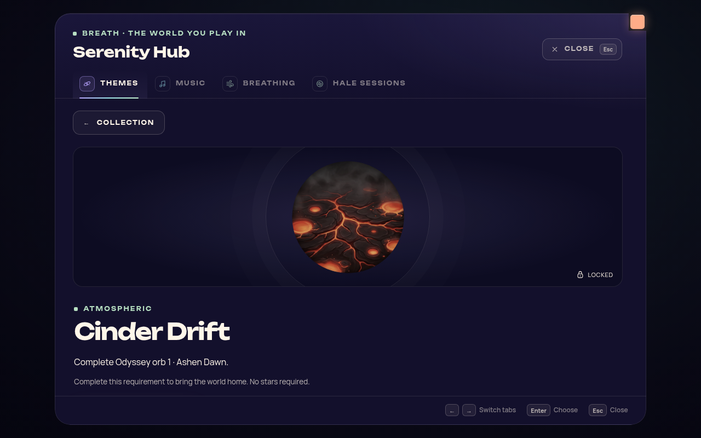
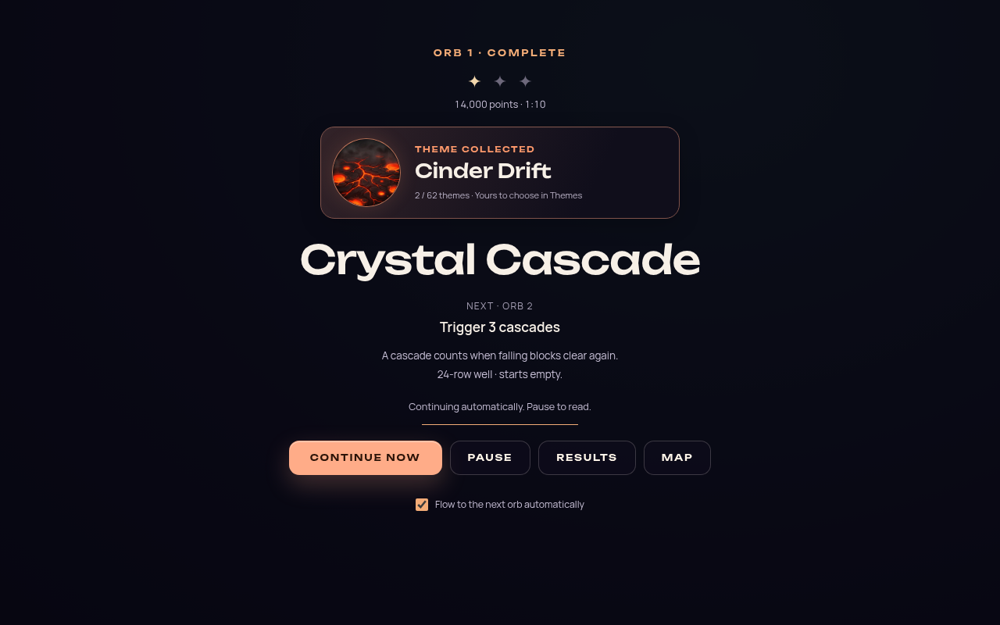

# Theme collection progression — 2026-10-08

Companion soundtrack progression is documented in
[Theme music progression](THEME_MUSIC_PROGRESSION_2026-10.md): every active theme now has one
song, with ownership derived from the same theme grant and a combined completion reward.

Status: the original collection implementation was validated at `cd9bb4d` and merged in
`93cc3c6`. The user's subsequent unique-orb/chapter-fit requirement supersedes the original
repeated-theme and ten-bonus mapping. The [current 60-orb campaign audit](ODYSSEY_60_ORB_CAMPAIGN_2026-10.md)
records the final requested count, removal of Bioluminescence II, and direct orb routes for
Vesper and Serenity Warp. The [59-orb audit](ODYSSEY_UNIQUE_THEME_CHAPTER_AUDIT_2026-10.md)
is the preceding checkpoint. This is a scoped feature under the
[architecture roadmap](ARCHITECTURAL_REMEDIATION_PLAN.md), not a
replacement for it or for the [Odyssey flow work](ODYSSEY_CHAPTER_VISUAL_AUDIT_2026-10.md).

The requested product rule is simple: a fresh installation starts with Forest available;
clearing an Odyssey orb earns the theme used by that orb. The design makes that reward
visible and satisfying while preserving **finish orb → emerge into the world → glide along
the path → enter the next orb**, with deliberate breathing room at chapter boundaries.

The implementation adds a persistent collection service, gates player-selected themes,
keeps authored Odyssey themes playable before collection, and presents saved rewards inside
the existing completion, results and finale surfaces. The gallery below shows the actual
production interface components; it is not a concept render.

## Collection gallery

These six images record the original 62-theme collection checkpoint. Current counts and
screenshots belong to the [60-orb campaign audit](ODYSSEY_60_ORB_CAMPAIGN_2026-10.md).
They are unedited captures of production DOM, CSS, thumbnails and collection
data in a disposable browser fixture. Renderer and application-shell dependencies are
injected; their dark reward backdrop is a fixture, not a captured live Odyssey world.
Scroll positions are intentional: the mobile Apply view shows the action after scrolling
the details pane. Open any image directly for a larger phone-friendly view.

| Fresh collection | Collection after the first reward |
| --- | --- |
| [](images/theme-collection/desktop-fresh.png) | [](images/theme-collection/desktop-collection-cards.png) |

| Inspect a locked theme | Reward inside the existing completion flow |
| --- | --- |
| [](images/theme-collection/desktop-locked-orb.png) | [](images/theme-collection/desktop-reward.png) |

[Mobile: deliberate Apply action](images/theme-collection/mobile-collected-actions.png) ·
[Mobile: reduced-motion reward](images/theme-collection/mobile-reward-reduced.png)

## Audit and decisions

The [theme registry](../src/themes/theme-registry.js) contains **61 themes**. The current
60 composed [Odyssey level configurations](../src/core/odyssey/data/levels.js) use **60
distinct non-Forest primary themes**. Forest is the starter. Every other theme belongs to
exactly one orb, with no separate bonus routes. The user explicitly requested 60 orbs and
the complete removal of Bioluminescence II; original Bioluminescence remains at orb 5.

Use the composed configuration's canonical primary theme, not a chapter's background,
a stale base configuration, or whichever scene happens to be active during the transition.
Ownership is permanent: replays do not duplicate a grant or repeat first-unlock fanfare.
Every first clear in a fresh campaign awards that orb's own unique theme. Previously earned
themes remain owned when an authored orb changes; a replay can earn its newly assigned world.

The following are **implementation defaults, not separately confirmed user decisions**:

- Quietly backfill the themes recorded by existing genuine saved completions. Preserve
  established Odyssey progress. Replaying a re-themed orb earns its new world without
  taking away the old one; the collection labels this requirement as a replay.
- Do not grandfather every theme merely because older builds allowed unrestricted theme
  selection. A previously selected but unearned theme falls back to Forest when selection
  is reconciled; the collection explains the earning requirement.
- A successful clear is sufficient. Theme ownership does not require three stars, a
  particular score beyond the orb's completion condition, or repeated farming.

These defaults can be revised if the owner chooses a different migration policy.
They should remain data-defined and testable rather than spread across presentation code.

### Former bonus themes now have their own orbs

Campaign completion requires all 60 registered orbs, not simply reaching its final orb.
Each successful first clear earns only its own theme. Existing saved bonus ownership stays
owned, while the two new challenges still require completion for campaign progress.

| Theme | Canonical ID | Requirement |
| --- | --- | --- |
| Vesper Chrysalis | `vesper-chrysalis` | Clear orb 43, Celestial Chrysalis, in chapter 6 |
| Serenity Warp | `serenity-warp` | Clear orb 55, Serenity Passage, in chapter 7 |

The campaign-completion rule follows the registered campaign, including the Urban Dreams
Encore. Chapter 7 alone is not the full campaign. Future content additions need
an explicit rule review; an implementation must not silently revoke existing ownership.

The collection total is **61**. A fresh collection reads **1 / 61 collected**.
Full completion earns the remaining 60 primary themes. Removed Bioluminescence II grants
remain historical save evidence and are excluded from collection counts and selection.

## Player experience

### Before earning a theme

Present the theme menu as a collection worth exploring. Keep locked artwork recognizable,
with a restrained veil or partial desaturation, a lock symbol and readable **Locked** text.
Do not grey the whole card to the point that its art or instructions are unreadable.
Ownership, current selection and newly collected state must have distinct labels.

Locked cards remain inspectable with mouse, touch, keyboard and controller. Their action
is to inspect the theme and its requirement; only applying an unowned theme is unavailable.
Avoid placing a working inspection action on a control labeled or announced as disabled.
Use a visible focus outline, not color alone, and make the requirement available on focus
or activation as well as hover.

For an orb reward, show its chapter and exact orb number/name: **Clear Orb 21 — Ice
Temple in Odyssey** is more useful than **Keep playing**. The requirement must identify
the unique qualifying orb, including a replay when its authored theme has changed. Bonus cards show their distinct
collection or campaign condition. No locked release theme should advertise an impossible
route or unexplained “Coming soon” requirement.

Show an accurate collection count and offer filters that help players find owned and locked
themes. Preserve the selected theme and browsing position when details close. Static
artwork is an appropriate initial preview; a future live preview needs a separate lifecycle
so browsing cannot equip a locked theme, overwrite preferences, or start every theme renderer.

An optional route action should clearly say whether it opens the Odyssey map or starts
gameplay. It must respect normal orb availability. Do not silently abandon an active run
when someone inspects a theme.

### The moment of earning

1. The game's successful-completion path records the result and computes new rewards.
2. The collection service persists the grants, or retains recoverable completion evidence
   and accurately reports an unresolved save failure.
3. The existing completion/world-return presentation shows **Theme unlocked**, the theme
   name, recognizable artwork and a concise explanation of where it can be used.
4. The existing world glide continues. The collection retains the result for later browsing.

There is **no claim button, compulsory collection visit, auto-equip, additional Enter
press, or new 2,600 ms wait**. The current flow overlay's `AUTO_CONTINUE_MS = 2600` is an
existing timing contract, not a second budget to spend on a reward modal. Reveal and reward
share the existing beat. Do not extend journey timers merely to finish decorative animation.

The visual direction is a small keepsake from the world just completed: theme artwork and
palette, one restrained seal-opening or highlight, then a settled readable card. Sound may
reinforce it using an existing suitable cue, respecting volume and mute settings. Generated
SFX are unavailable in this environment. Keep text stable and leave the world visible.

An ordinary first clear grants its one unique theme in that same presentation. Do not queue
blocking ceremonies. Chapter boundaries already provide an untimed reading opportunity;
retain the established chapter reveal. The finale can display the completed collection
alongside the campaign result.

Replays of owned themes show ordinary completion feedback. A reward card may disappear
with the transition, but the earned item must remain discoverable in the collection and
completion details. An **unseen/new** indicator can survive until the player deliberately
inspects it. Automatically equipping an unlock would confuse “I earned this” with “I chose
this”; retain the player's selected theme until they apply another one.

### Accessibility and comfort

Use a single polite status announcement for a new reward without moving focus into it.
Avoid an assertive alert that interrupts other narration. Announce the theme identity and
availability, not each particle or changing progress-counter frame. Persistent collection
details provide another way to read what a brief visual card conveyed.

Honor both the game's reduced-motion choice and the supported OS preference. The calm
version communicates the same reward through a static composition or opacity change, with
no camera shake, rapid zoom, strobe or perpetual shimmer. Text contrast, focus visibility,
controller activation, small screens and enlarged text remain acceptance requirements.
Muting audio must not remove information; removing animation must not remove the reward.

## Data and integration contract

This is a local, offline-capable cosmetic progression system. A robust implementation needs
a coherent authority and durable saves; it does not require a new account server or
server-side anti-cheat for an offline theme library. Local data remains user-modifiable.
Do not describe this feature as tamper-proof ownership or a secured entitlement backend.

### One collection authority

Use one versioned collection service for grant calculation, ownership checks, requirement
metadata and recovery. All player-facing selectors consume that authority: the theme menu,
background settings, random/automatic rotation, shortcuts and restored settings. UI styling
alone is insufficient if another selection path can still apply an unearned theme.

Distinguish player selection from internal scene rendering. Odyssey must render an orb's
theme before the player owns it; loading or activating that scene does not award it.
Prewarming, previews and renderer fallbacks must not mutate ownership. Preserve the existing
theme lifecycle and Odyssey One World recovery contracts.

The implemented scope survives the automatic-entry owner retiring and an in-place retry.
If an active orb's theme fails, the manager attempts to rebuild that same theme once. A
second failure pauses that live attempt and returns to the same orb on the world map with
a retry message. A stale failure cannot interrupt a newer attempt or completed results;
the ordinary Forest fallback remains available outside Odyssey.

Use canonical IDs from the theme registry and data-defined reward routes from the composed
campaign. Normalize supported retired aliases through the registry's established resolver.
Unknown or malformed IDs must not become selectable release themes. Future reward data can
be retained where appropriate for forward compatibility without treating it as known UI.

### Ownership, receipts and presentation are separate

| State | Purpose | Required behavior |
| --- | --- | --- |
| Completed-orb evidence | Records a genuine successful clear | Can reconstruct earned rewards after an interrupted grant write |
| Permanent theme grant/receipt | Records ownership and its source | Idempotent; repeated completion or sync never duplicates or revokes it |
| Pending/seen presentation | Controls celebration and new markers | Can change without changing ownership; migration does not replay old ceremonies |
| Selected theme preference | Records the player's choice | Changes only through an eligible selection or a documented fallback |

“The animation finished” must never be the condition that awards the theme. Conversely,
“The receipt exists” does not require replaying the celebration on every boot. Closing the
game during a portal or pressing Continue immediately must not lose a valid reward.

### Save and recovery behavior

Record completion through the existing Odyssey success path, then reconcile the collection
idempotently. A local storage sequence cannot be assumed to be a multi-record transaction:
the system must recover if completion saves but the collection write is interrupted. On
startup and after relevant restore/import operations, valid completion records reconstruct
the missing grants. Do not use attempts, visits, a current chapter
index, or a theme preference as proof of a clear.

A fresh profile grants Forest. An existing profile receives the rewards implied by its
saved completions without celebratory backlog. Preserve known owned grants during ordinary
loads and migration; an older snapshot must not revoke permanent ownership. Validate schema
versions and malformed saves, fail safely to a usable Forest selection when necessary, and
keep error recovery distinct from deliberate user-requested reset behavior.

Saving failures must be observable and retryable. Do not promise “saved” merely because the
UI changed. Test the failure sequence where completion succeeds and the collection write
fails, then the next launch repairs it. If neither write succeeds, no implementation can
promise durable recovery from a process crash without another durable source.

The version-1 collection uses `serenityBlocks_themeCollection`, separately from Odyssey
progress, so a campaign reset does not revoke collected themes. Before replacing malformed
JSON, recovery preserves its exact bytes in `serenityBlocks_themeCollection_recoveryBackup`.
Failed backup/replacement writes preserve the original, and a future schema stays read-only.
Opening Themes quietly retries recovery from saved completions. Reward receipts publish
only after a successful write; actual failures produce an inline status instead of fanfare.

Odyssey progress uses save v4. Earlier migrations snapshot the old composed theme mapping;
v4 migrates stable challenge identities and archives the removed orb separately from active
completion. Completion records retain every actually cleared theme, plus the most recent;
Cloud merges retain that history. Records without played-theme evidence cannot infer
ownership from today's metadata. Existing collection grants, including former bonuses,
remain stored; the retired Bioluminescence II grant is excluded from active counts.

### Steam Cloud and offline play

The existing [Steam Cloud integration](../src/core/steam/steam-cloud-sync.js) is the sync
boundary. Merge permanent grants by **set union**, with stable source receipts as needed,
rather than replacing inventory with the newest timestamp. Reconcile merged completion
evidence as well. A player who earns different themes on two devices should retain both.

Ownership and optional seen-state reconciliation need separate policies: a stale presentation
flag must not revoke a theme or trigger a cascade of old celebrations. Local save success
must not wait for a network round trip. Queue sync through the existing integration and
surface its failure accurately. Steam's achievement cache does not automatically persist a
custom theme inventory; tests must verify this game's own Cloud payload and merge behavior.

The implementation reads and unions remote `unlocks.json` before uploading, including
uploads queued before initial synchronization. A failed read is not interpreted as an empty
inventory. The native adapter now uses the installed SDK's `client.cloud` namespace,
positional IPC arguments and string writes; its structured response distinguishes confirmed
absence from API failure. Collection retries stay with the synchronization manager so a
second offline queue cannot replay a stale ownership document. A live payload hash also
detects quiet startup recovery that happened before Cloud listeners were registered.

Eight contract tests execute the actual service, preload and native handler code against a
simulated SDK. This verifies the JavaScript boundary; real signed-in Steam accounts and
cross-device synchronization remain native acceptance work.

No new renderer, pipeline, backend service or public leaderboard is required for this
feature. Respect [ADR-0020](adr/0020-loading-surfaces-create-pipelines-async.md) if a loading
surface or live preview is touched, and [ADR-0016](adr/0016-perf-claims-require-a-verified-instrument.md)
before making any performance claim. Changes to theme/chapter rendering still require
[ADR-0007](adr/0007-webgpu-tsl-definition-of-done.md)'s visual validation workflow.

## Research and evidence limits

All ten sources were searched and opened on **2026-10-08**. They support the design principles
below; they do not establish that this implementation is perfect, will improve retention,
or will cause a particular dopamine or endorphin response. Reward pacing and emotional
impact remain design hypotheses to evaluate with players. Historical product descriptions
are cited as precedents, not as claims about every detail of those games today.

| Reference | What it supports | Application and limit |
| --- | --- | --- |
| [Przybylski, Rigby & Ryan, *A Motivational Model of Video Game Engagement* (2010)](https://selfdeterminationtheory.org/SDT/documents/2010_PrzybylskiRigbyRyan_ROGP.pdf) | The review connects competence, autonomy and relatedness satisfaction to enjoyment and immersion; it discusses how controlling reward pressure can undermine intrinsic motivation. | Make the unlock a souvenir of mastery while preserving choice. This is not a test of theme rewards, exact timings or neurochemistry. |
| [Microsoft, Xbox Accessibility Guideline 114: UI context](https://learn.microsoft.com/en-us/xbox/accessibility/xbox-accessibility-guidelines/114) | Clear contextual labels and predictable outcomes; an example combines a lock icon, dimmed appearance and text for restricted functions. | Give locked themes readable requirements and unambiguous inspection/apply actions. The guideline does not prove a particular visual style motivates collecting. |
| [Microsoft, Xbox Accessibility Guideline 117: Visual distractions and motion settings](https://learn.microsoft.com/en-us/xbox/accessibility/xbox-accessibility-guidelines/117) | Control over animated UI, distractions and nonessential camera motion. | Provide equivalent calm rewards. A reduced-motion implementation still needs comfort testing. |
| [W3C, Understanding WCAG 2.2 SC 4.1.3: Status Messages](https://www.w3.org/WAI/WCAG22/Understanding/status-messages.html) | Programmatically expose status changes without taking focus or unnecessarily interrupting work. | Use a polite announcement and persistent details. Semantics alone do not prove real screen-reader usability. |
| [ArenaNet, *Miniatures and Finishers in Your Account Wardrobe* (2014)](https://www.guildwars2.com/en/news/miniatures-and-finishers-in-your-account-wardrobe/) | The developer describes previewing both locked and owned cosmetics, search, and owned-first presentation. | Keep locked collection entries inspectable. This is a product precedent, not a controlled experiment; its commerce and limited-availability cues are outside this design. |
| [Nielsen Norman Group, *Microinteractions in User Experience* (2018)](https://www.nngroup.com/articles/microinteractions/) | Contextual feedback communicates success and brand; subtle, short animation can avoid pulling attention from the main task. | Celebrate inside the existing transition. It does not establish an ideal animation duration for repeated Odyssey clears. |
| [Nielsen Norman Group, *Visibility of System Status* (2018)](https://www.nngroup.com/articles/visibility-system-status/) | Timely feedback shows whether an action succeeded and reduces uncertainty. | Show accurate ownership, collection counts and save status. Collection-specific motivation is an inference. |
| [Nielsen Norman Group, *Button States: Communicate Interaction* (2025)](https://www.nngroup.com/articles/button-states-communicate-interaction/) | Distinct enabled/disabled/focused states, readable muted styling and focus outlines. | Separate inspectable cards from gated Apply controls. Semantic state must match behavior; an ARIA attribute alone does not enforce a lock. |
| [Valve, Steamworks: Stats and Achievements](https://partner.steamgames.com/doc/features/achievements) | Prompt state persistence, checkpoints, offline caching and achievement merging; conflicting caches can appear to revert progress. | Use durable idempotent grants and monotonic merge for the custom collection. Steam's built-in achievement cache is not this feature's storage service. |
| [Enhance, *Tetris Effect Now Available on PlayStation 4 Worldwide* (2018)](https://www.tetriseffect.game/2018/11/09/tetris-effect-now-available-on-playstation4-worldwide/) | Journey visuals/music/sound synchronize with gameplay; a separate completed community goal awards a cosmetic. | Borrow coherent audiovisual identity and an earned cosmetic connection. The historical timed community event is not a recommendation for time-limited rewards here. |

## Acceptance plan

### Rules, persistence and recovery

- Fresh profile: Forest is available; the other 60 themes have valid visible routes.
- A real successful orb completion grants its composed primary theme exactly once. Failure,
  cancellation, replay loading and debug preview do not grant it.
- All 60 authored orb themes are unique, registered, and distinct from the Forest starter.
  Replaying a collected theme does not inflate ownership or repeat unlock fanfare.
- All 61 themes are obtainable. Vesper and Warp require their own orb clears; there are
  no count-based bonus unlocks.
- Existing legitimate completions backfill quietly. Malformed/future/retired IDs and schema
  versions follow a documented normalization/recovery policy.
- Repeated completion callbacks, interrupted writes, reloads and import/restore produce
  stable results. Save failure is tested, including recovery from persisted completion.
- Cloud merges combine independent grants and completion evidence; older Cloud snapshots
  cannot revoke permanent themes. Offline clears remain usable before sync.

### Selection and flow integration

- Every player selection path honors ownership, including settings, random rotation,
  shortcuts and restored preferences. Locked inspection never changes the selected theme.
- Odyssey can render locked themes internally and preserves normal theme prewarming and
  cleanup. Rendering or loading a theme never awards it.
- Unlocks do not auto-equip. An unearned restored preference resolves consistently to Forest.
- Normal orb travel adds no reward timer or mandatory action. Continue-now, pause, return to
  map, chapter arrival, failure recovery and campaign finale still work.
- Multi-reward clears consolidate feedback, retain all grants, and do not queue blocking
  ceremonies. Presentation cleanup removes timers/listeners when a flow owner is disposed.

### UI and player acceptance

- Capture the actual collection and reward components at desktop, narrow mobile, landscape
  and enlarged text sizes. Check readable requirements, artwork, focus and action visibility.
- Exercise mouse, touch, keyboard and controller navigation, including inspecting a locked
  card, returning to the same position, applying an owned theme and dismissing details.
- Check reduced motion and mute independently. Inspect polite status announcements with a
  screen reader when an appropriate runtime is available.
- Verify no focus theft or extra interruption in a first-clear → world → next-orb sequence,
  and readable consolidated rewards at a chapter boundary and the finale.
- In later human playtests, ask players to explain how a selected locked theme is earned,
  find a just-earned theme, and apply it. Observe whether repeated rewards support or disrupt
  their flow; tune spectacle and duration from that evidence, not from completion rate alone.

## Original collection verification results (`cd9bb4d`)

The evidence below belongs to the original collection implementation. Follow-up unique
theme, migration and chapter-fit evidence is in the [current audit](ODYSSEY_UNIQUE_THEME_CHAPTER_AUDIT_2026-10.md).

### Browser interface matrix

The **72-case interface matrix and 12 targeted completion-focus checks pass**, with no
recorded page/console errors or horizontal overflow. The matrix uses actual production
collection, reward, results and finale components, real save models, and an injected
renderer/application shell. It covers 1280×800, 320×568, 844×390 and 640×800 with 200% root
text. The targeted follow-up checks visible initial focus and Tab targets in the completion
sheet with a reward and both save-failure variants at all four sizes.

Cases cover fresh ownership, locked orb/chapter/milestone requirements, newly collected
cards, deliberate Apply, keyboard inspection and return focus, reduced-motion rewards,
paused actions, multiple rewards in results/finale, and save-failure presentation. The
expanded cases verify visible initial focus and visible Tab targets in the results/finale
sheets, plus a real injected collection write failure in the collection UI. Delegated
controller-close behavior is exercised through its callback; this is not a physical
controller test.

A same-receipt results/finale round trip does not repeat celebration. The desktop harness
checks the existing 2,600 ms automatic handoff and records the next action at **2,601 ms**
in the targeted follow-up, without another reward delay. The existing short-viewport
accessibility guard remains: if Pause would be
offscreen, automatic continuation holds and the player deliberately chooses Continue.
Passing the 320px cases does not mean those layouts automatically advance. This is a
controlled DOM timer check, not an end-to-end load-time measurement.

Reports: `artifacts/theme-unlocks/browser/report.json` and
`artifacts/theme-unlocks/browser/completion-focus/report.json`.
Reproduction, with Vite running and Playwright/Chromium available in the environment:

```sh
node scripts/validate-theme-collection.mjs --base-url http://127.0.0.1:5194
```

The script accepts `PLAYWRIGHT_MODULE` and `CHROMIUM_PATH` for externally provisioned
browser tooling; it does not require adding a runtime application dependency.

### Bounded real-application probe

A separate disposable browser profile runs the actual application with muted audio and
software WebGL2. It confirms Forest at **1 / 62**, blocks direct selection of unearned
Cinder Drift, and allows the authored first Odyssey orb to render Cinder Drift under its
scoped gameplay access while it is still unowned.

The probe then supplies a **synthetic line-goal result through the real victory evaluator**.
The real completion/save/reward path records Cinder Drift and reaches **2 / 62**. Reload
retains ownership, permits selecting the collected theme and does not produce a duplicate
reward. The selected preference remains Forest. No page/console errors were recorded.

This is integration evidence, not a played clear, human playthrough, difficulty measurement
or test of the emotional effect of earning the reward. It also does not exercise native
Steam Cloud: the browser reports deferred Cloud uploads when that service is unavailable.
The software compositor painted the live reward inconsistently: the initial screenshot
showed the color fallback despite decoded 512px artwork, and a later frame displayed the
thumbnail but still had incomplete text painting. This probe supplies functional integration
evidence, not visual acceptance. The settled production DOM/CSS captures supply the visual
evidence and the six-image gallery. No product wait or source fix was added for this capture
limitation. Automatic continuation was manually disabled in the live probe for inspection;
its screenshots do not demonstrate automatic world travel.

Report: `artifacts/theme-unlocks/browser/runtime/report.json`.
Reproduction in the same supported browser environment:

```sh
node scripts/validate-theme-collection.mjs --base-url http://127.0.0.1:5194 --runtime-only
```

### Regression and native acceptance

**8,855 tests across 672 files pass.** The production build passes, including the boot
closure check (3 entry chunks / 12 KB; 3 main chunks / 1,044 KB). Type checking, TypeScript
coverage, dependency boundaries, theme lifecycle, architecture, lint, release scaffolding,
performance-budget tooling, shipped-string and Pages artifact gates pass.

The lint ceiling decreased from 813 to 807 existing errors; this is a passing shrink-only
gate, not a claim that the repository has zero lint debt. The OdysseyMode line ceiling
decreased from 4,662 to 4,624. No architecture ceiling was raised. New feature modules,
contract tests and the browser harness passed scoped lint.

The production dependency audit reports **zero vulnerabilities**. The unchanged full
development-tool dependency warning lane reports 25 advisories (10 moderate, 13 high,
2 critical). Release scaffolding still warns about the existing placeholder Steam AppID
480. No dependency upgrade, release packaging or real-GPU performance measurement was part
of this feature.

The native Cloud follow-up passes 33 focused tests, including eight tests through actual
service/preload/handler code with a simulated SDK. Scoped runtime recovery passes 33
focused tests after the final notification integration. These lanes supplement the full
regression run; the browser matrix alone does not establish those contracts.

The final notification dependency placement was rechecked with those 33 affected tests,
dependency boundaries, type checking and a fresh production build after the full-suite run.

Reproduction: `npm test -- --maxWorkers=2`, `npm run build`, and the repository checks in
`.github/workflows/pages.yml`. Local logs are under `artifacts/theme-unlocks/verification/`;
the committed harness and gallery preserve the reproducible interface scenarios and
selected visual evidence.

Native GPU frame pacing, real Steam-account synchronization across devices, sound mixing,
physical-controller ergonomics, screen-reader announcement timing, motion comfort and
player enjoyment remain separate acceptance work. Automated captures establish layout and
specific state transitions; they cannot certify a “perfect” or universally motivating
experience. The quiet-backfill policy remains an implementation default; the owner explicitly
requested the final 60-orb count, direct Vesper/Warp routes, and removal of Bioluminescence II.
