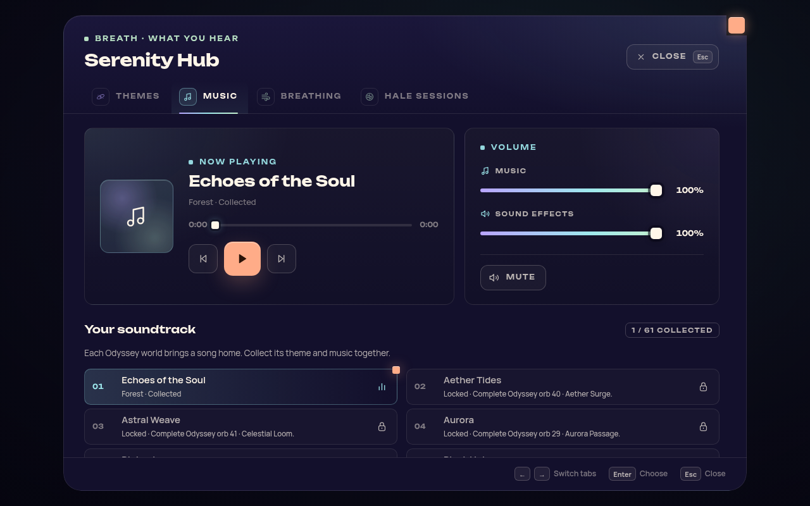
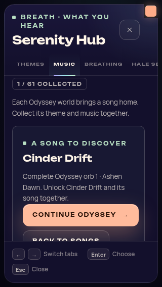
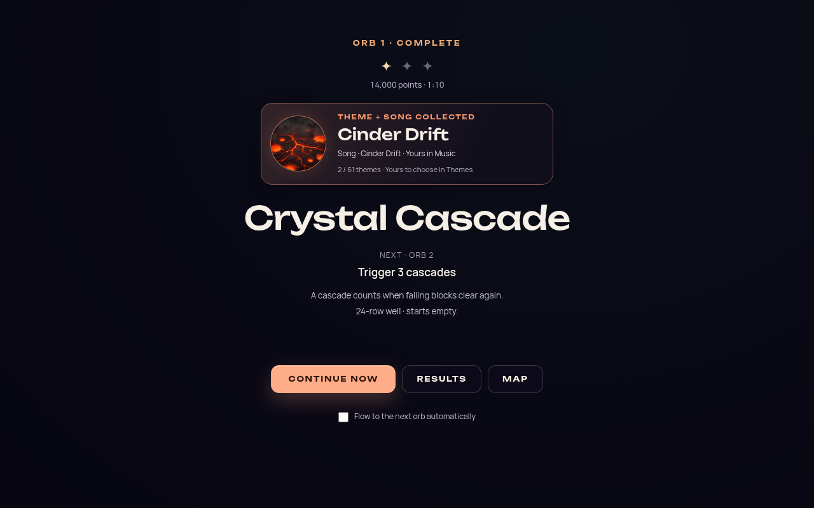
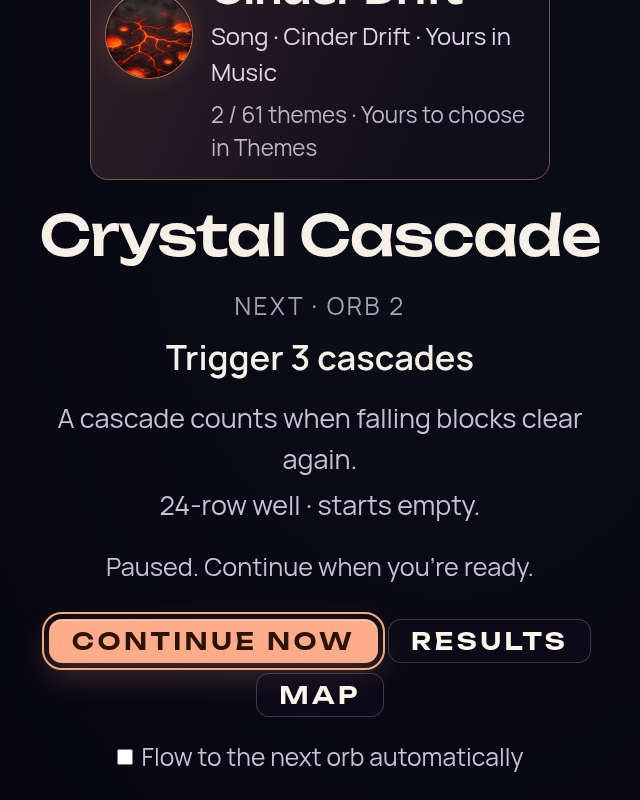

# Theme music progression

Date: 2026-10-08. Status: implemented and verified on the feature branch; native listening remains pending.

Every active theme has exactly one soundtrack assignment and its own song file. The active
collection contains **61 themes and 61 songs**. Forest and **Echoes of the Soul** are available
on a fresh installation. Successfully completing an Odyssey orb permanently grants its
theme and song together.

There are **31 existing recordings and 30 placeholder files**. The placeholders are separate,
byte-identical copies of the existing Blood Moon recording, as requested by the owner; they
are not new compositions. Each file is named `<theme-id>-placeholder-song.mp3`, allowing the
owner to replace one soundtrack without affecting another theme. The copies add 250,148,940
bytes (238.56 MiB) to the uncompressed game assets. Git stores identical content once.

Five older, unassigned recordings remain on disk for compatibility and future use:
Candlelit Monastery, Cherry Blossom Garden, Falling Pieces, Floating Islands, and Meditation
Temple. They are outside the active 61-song collection and are not extra starter unlocks.

## Ownership and playback

Song ownership is derived directly from the durable theme grant. There is no second song-save
document, duplicate grant, or separate Cloud merge that could disagree with theme ownership.
Existing earned themes immediately provide their songs. Failed saves do not claim a song
reward. Recovery from genuine old Odyssey completions and Cloud ownership unions use the
existing collection persistence rules.

During Odyssey, the currently active orb can play its authored song before it is collected,
regardless of the optional free-play theme/music linking preference. The visible world also
has temporary permission for its chapter soundtrack. These permissions do not grant a song
or overwrite the saved music preference. Natural track completion repeats the active Odyssey
song. Pause keeps the orb's permission; abort, return, stop, and mode exit revoke it. Late
cleanup cannot revoke a newer context or restart a previously locked song.

Outside those temporary contexts, song selection, previous/next, automatic advancement,
direct file playback, resume, queued switches, and recovery respect theme ownership. Stale
or locked saved selections fall back to Forest's track, including Cloud settings. Both intro
entrypoints use Forest's song for new profiles and honor a returning player's owned choice.
An unavailable or invalid music manifest retains the starter
track rather than exposing unrelated recordings.

## Player experience

The Music tab keeps locked songs visible with a lock indicator, their associated theme, and
the precise Odyssey requirement. Collected songs appear first and a collection counter
starts at **1 / 61**. Inspecting a locked song offers the existing Continue Odyssey route;
it does not start a level or grant ownership. Temporary Odyssey playback is identified as
uncollected when appropriate.

The successful-clear presentation says **Theme + song collected** in the existing reward
card. It adds no modal, claim action, or extra journey pause. Theme details also identify the
companion song and its Music destination. Cloud/grant refresh preserves focus; keyboard
Escape and controller Back close details for the active tab.

## Temporary development access

Append `?unlockAll=1` to the game URL, for example
`http://localhost:5173/?unlockAll=1`. If the URL already has parameters, append
`&unlockAll=1` instead. This works in both the development server and built game.
Remove the parameter and reload to restore normal collection access.

The flag makes all 61 themes and their songs available for selection. Collection menus
label unearned items **Development access** and show available counts separately from
genuine collection progress. It creates no grants, completed orbs, stars, new-item badges,
or Cloud ownership. Genuine orb completions still save their usual rewards. Odyssey's
active orb/chapter retains control of its authored theme and soundtrack.

This flag is read only from the URL at startup, with the exact value `1`; it is never
saved as a preference. Theme/song selections can still save normally, but selections
that have not been earned fall back to Forest and Echoes of the Soul on a reload without
the flag. Other genuinely earned themes and songs remain unlocked.

The follow-up passed 219 focused tests across 15 files, the production build, typecheck,
lint/architecture/boundary gates, and release/artifact checks. A browser check used the real
URL factory and production Hub interface: 61 themes/songs available with the flag, one
starter and 60 locked entries after reloading the same profile without it, zero storage
writes while browsing previews, and zero browser errors. Six screenshots and the local
report are in `artifacts/theme-music/development-preview/`. The browser fixture substitutes
the rendering/application shell; it does not repeat GPU or audio playback validation.

## Replacing a placeholder

The canonical mapping is
[theme-music-catalog.js](../src/core/progression/theme-music-catalog.js). Runtime lookup is
explicit in both directions, avoiding fuzzy matches or shared song assignments. The generated
[songs.json](../public/assets/music/songs.json) carries the same stable track keys, theme IDs,
and placeholder provenance. The test-facing manifest derives from that catalog too.

When a final recording is ready, add its MP3 and declare its authored title/file in the
catalog's `AUTHORED_SONGS` mapping, then run `node generate-songs.js`. Preserve the track key
if the display title changes, or explicitly migrate saved selections; ownership stays tied
to the theme. The generator validates required files and keeps unassigned legacy recordings
out of the player collection. Do not copy the new recording over Blood Moon's source file.

The source used for all placeholder copies has SHA-256
`06ed3486f9d821c6df51fa8addff8f41a2193a1ee18d3f36146d232eb3284cbe`.

## Assignment inventory

The following inventory is generated from the canonical mapping and the current 60-orb
campaign. Forest is the sole starter; every other song follows its theme's orb.

| Orb | Theme | Song file | Recording |
|---|---|---|---|
| Starter | Forest | `echoes-of-the-soul.mp3` | Existing |
| 1 | Cinder Drift | `cinder-drift.mp3` | Existing |
| 2 | Crystal Cave | `crystal-cave.mp3` | Existing |
| 3 | Geode | `geode-crystalline.mp3` | Existing |
| 4 | Pyrestorm | `pyrestorm-placeholder-song.mp3` | Blood Moon placeholder |
| 5 | Bioluminescence | `bioluminescence.mp3` | Existing |
| 6 | Ocean | `ocean-deep.mp3` | Existing |
| 7 | Luminous Tides | `luminous-tides-placeholder-song.mp3` | Blood Moon placeholder |
| 8 | Koi Pond | `koi-pond-placeholder-song.mp3` | Blood Moon placeholder |
| 9 | Waves | `waves.mp3` | Existing |
| 10 | Stillwater | `stillwater.mp3` | Existing |
| 11 | Misty Lake | `misty-lake.mp3` | Existing |
| 12 | Moonlit Forest | `moonlit-forest.mp3` | Existing |
| 13 | Golden Forest | `golden-forest-placeholder-song.mp3` | Blood Moon placeholder |
| 14 | Moonlit Greenhouse | `moonlit-greenhouse.mp3` | Existing |
| 15 | Tornado | `tornado-placeholder-song.mp3` | Blood Moon placeholder |
| 16 | Midsommar | `summer-placeholder-song.mp3` | Blood Moon placeholder |
| 17 | Fall | `fall-placeholder-song.mp3` | Blood Moon placeholder |
| 18 | Halcyon Apex | `halcyon-apex-placeholder-song.mp3` | Blood Moon placeholder |
| 19 | Sakura Twilight | `sakura-twilight-placeholder-song.mp3` | Blood Moon placeholder |
| 20 | Verdant Hills | `verdant-hills-placeholder-song.mp3` | Blood Moon placeholder |
| 21 | Ice Temple | `ice-temple.mp3` | Existing |
| 22 | Wolfhour | `wolfhour.mp3` | Existing |
| 23 | Himalayan Peak | `himalayan-peak.mp3` | Existing |
| 24 | Mountain | `mountain-placeholder-song.mp3` | Blood Moon placeholder |
| 25 | Winter | `winter-placeholder-song.mp3` | Blood Moon placeholder |
| 26 | Moonrise Summit | `moonrise-summit-placeholder-song.mp3` | Blood Moon placeholder |
| 27 | Sunset | `sunset-placeholder-song.mp3` | Blood Moon placeholder |
| 28 | Starlight | `starlight.mp3` | Existing |
| 29 | Aurora | `aurora.mp3` | Existing |
| 30 | Nimbus Veil | `nimbus-veil-placeholder-song.mp3` | Blood Moon placeholder |
| 31 | Rainy Window | `rainy-window.mp3` | Existing |
| 32 | Sky Children | `sky-children-placeholder-song.mp3` | Blood Moon placeholder |
| 33 | Parhelion | `ethereal-echoes.mp3` | Existing |
| 34 | Lunara | `lunara.mp3` | Existing |
| 35 | Galaxy | `galaxy.mp3` | Existing |
| 36 | Cosmic Noir | `cosmic-noir.mp3` | Existing |
| 37 | Supernova | `supernova-placeholder-song.mp3` | Blood Moon placeholder |
| 38 | Blood Moon | `blood-moon.mp3` | Existing |
| 39 | Void Ember | `void-ember-placeholder-song.mp3` | Blood Moon placeholder |
| 40 | Aether Tides | `aether-tides.mp3` | Existing |
| 41 | Astral Weave | `astral-weave-placeholder-song.mp3` | Blood Moon placeholder |
| 42 | Shifting Sands | `shifting-sands.mp3` | Existing |
| 43 | Vesper Chrysalis | `vesper-chrysalis-placeholder-song.mp3` | Blood Moon placeholder |
| 44 | Stellar Velocity | `stellar-velocity-placeholder-song.mp3` | Blood Moon placeholder |
| 45 | Stellar Drift | `stellar-drift.mp3` | Existing |
| 46 | Solar Eclipse | `solar-eclipse-placeholder-song.mp3` | Blood Moon placeholder |
| 47 | Cosmic Chimes | `cosmic-chimes.mp3` | Existing |
| 48 | Black Hole | `black-hole.mp3` | Existing |
| 49 | Fluid Dreams | `fluid-dreams.mp3` | Existing |
| 50 | Nebula Flow | `nebula-flow-placeholder-song.mp3` | Blood Moon placeholder |
| 51 | Chiral Gold | `chiral-gold-placeholder-song.mp3` | Blood Moon placeholder |
| 52 | Voltage Storm | `voltage-storm-placeholder-song.mp3` | Blood Moon placeholder |
| 53 | Chromatic Impasto | `chromatic-impasto-placeholder-song.mp3` | Blood Moon placeholder |
| 54 | Electric Dreams V3 | `electric-dreams.mp3` | Existing |
| 55 | Serenity Warp | `serenity-warp-placeholder-song.mp3` | Blood Moon placeholder |
| 56 | Singing Bowl | `singing-bowl-placeholder-song.mp3` | Blood Moon placeholder |
| 57 | Chromadelic Highway | `chromadelic-highway-placeholder-song.mp3` | Blood Moon placeholder |
| 58 | Neon Dusk | `neon-dusk.mp3` | Existing |
| 59 | Synthwave Sunset | `synthwave-sunset-placeholder-song.mp3` | Blood Moon placeholder |
| 60 | Neon District | `neon-district.mp3` | Existing |

## Verification

Implementation checkpoints are `9be6618` (catalog and files) and `4fdf6d2` (ownership,
playback, collection UI, startup restoration, and regression coverage). The complete final
suite passes **9,002 tests across 682 files** on that production source in 190.06 seconds.
The log is `artifacts/theme-music/verification/full-tests-final.log`. Two stale synthetic-song
fixtures found in the first run were updated to owned catalog songs while preserving their
volume and fade assertions; the final suite includes those corrections and the startup fix.

The production build and all repository gates pass: typecheck, TS coverage ratchet, lint
ratchet, architecture, lifecycle, boundaries, performance-tooling checks, release scaffolding,
boot closure, IP strings, and Pages artifact. The built catalog contains 61 unique theme/song
assignments and files; all 30 placeholder bytes match Blood Moon. All 763 shipped files remain
free of the retired Bioluminescence II name and dependencies. Production dependency audit
reports zero vulnerabilities; the existing development-tooling lane retains 25 findings.

The architecture guard previously counted the literal filename `rainy-window.mp3` as a
browser global. Its DOM-member metric now uses the existing TypeScript parser to distinguish
real direct reads from strings and comments, with three regression tests. The corrected
baseline is 417 rather than 429. Code extraction also reduces main's ceiling to 5,642 lines
and OdysseyMode's to 4,599. No baseline increased. Existing lint debt and four Vite mixed-import
warnings remain unchanged; performance-tooling passes do not represent a new hardware capture.

- **32 responsive interface captures pass**, with zero console errors, overflow, or invalid
  volume labels: fresh 1/61, exact locked-song requirement, combined reward, owned selection,
  real page reload, live Cloud grant updates, and keyboard/controller-back focus behavior.
- Real browser media verifies delivery, decoding, playing state, and advancing time for
  Forest's Echoes of the Soul, Cinder Drift, and Vesper's Blood Moon placeholder. Temporary
  Vesper playback supports pause/resume, stays unowned, and restores Forest on revocation.
- A bounded real-app orb-1 run verifies fresh Forest music, scoped chapter music, locked orb
  soundtrack with theme linking disabled, natural ending and restart of the same song,
  Music-tab pause/resume, evaluator-driven completion, one durable theme/song reward, exit
  restoration, and manual selection of the newly owned track. This run exposed a final
  reload regression: the saved owned choice was validated but never applied, and intro
  playback forced the starter again.
- The startup correction applies the owned preference on first collection binding and shares
  a preference-aware menu/intro helper. **36 focused startup/integration tests pass**. A
  separate real-app boot/reload regression probe using the saved Cinder Drift grant and
  choice passes in 17.5 seconds with zero errors; both loads decode/play the selected song
  while preserving 2/61 ownership. The original diagnostic trace remains intact rather than
  being relabelled a passing run.
- Manifest tests cover missing/invalid responses, partial valid lists, canonical path and
  identity validation, Forest fallback, all 61 mappings, file existence, distinct file names,
  and all 30 placeholder hashes. Audio and Odyssey tests cover permission, in-flight request
  cancellation, scope identity, loop behavior, player volume, save failures, and lifecycle.

Reproduce with the Vite server at port 5194 and
`node scripts/validate-theme-music.mjs --out artifacts/theme-music/browser`. The optional
`PLAYWRIGHT_MODULE` and `CHROMIUM_PATH` variables select the environment's browser tools.
Use `--runtime-only` for the bounded real-app probe, or `--saved-choice-only` for the focused
startup regression. Reports, including the preserved first runtime attempt, are under that
output directory. Screenshots below are a small committed subset of the full local evidence.

Native audio output, physical controller feel, and signed-in Steam remain separate acceptance
checks. Browser media validation proves file delivery, decoding, and playback state, not
subjective sound quality or a calibrated audio mix.

### Current interface captures

These unedited captures use production UI/CSS and the real collection and audio services in
a disposable browser profile. Completion input is synthetic; this is integration evidence,
not a player playthrough.

| Music collection | Locked-song requirement |
|---|---|
|  |  |

| Combined reward | Enlarged-text focus |
|---|---|
|  |  |
