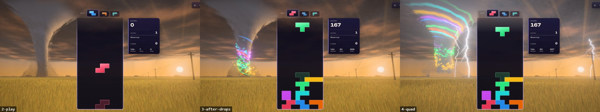
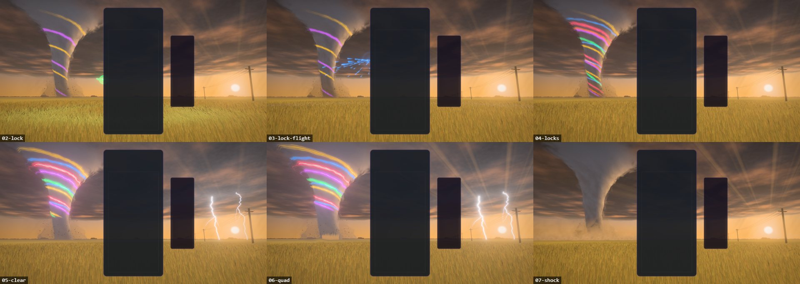
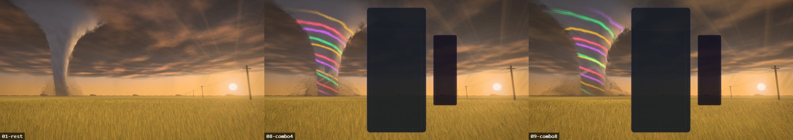
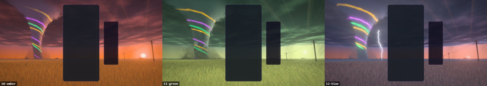
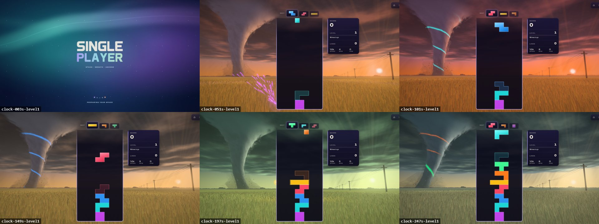
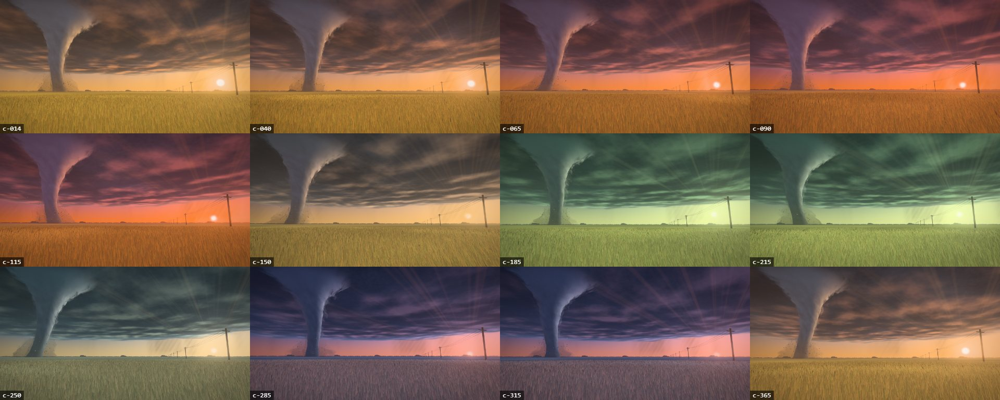
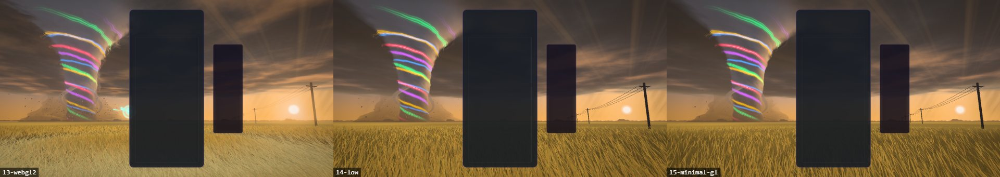
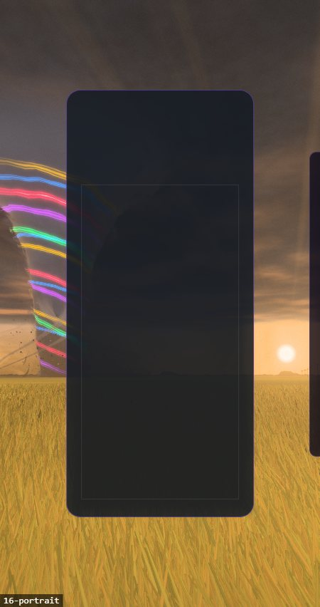

# Tornado — the prairie supercell

Implemented 2026-10-09 on `feature/tornado-masterpiece`, with Three.js 0.186.1. A from-scratch
rebuild: it replaces the earlier theme in full (five TypeScript modules that drew an orange
funnel of additive ribbons, a striped ground ring and wind-streak sprites on a black ground).
Tornado keeps its identity — a funnel wound with ribbons of light — and everything else is new.
This document records the shipped design and what was verified. It is a reference, not a backlog.

## The picture

A wheat field at the end of the day, under a supercell. The storm's base turns overhead, wound
tighter toward its dark heart; past its far edge the air is clear, and the low sun stands in
that gap behind rain shafts, lighting the field and the underside of the cloud from the side.
Left of the gameplay card the tornado comes down: a rope of condensation hung from the wall
cloud, its foot wandering in a skirt of dust, boards and shingles turning round it. A power line
runs out to the horizon on the right, for scale. Round the lens the wheat is real geometry,
leaning toward the funnel with the inflow.

The card sits in the middle of the frame, so the picture is composed round it: the funnel in
the free space on its left (the world reads the live card rect and stands the funnel in the
middle of that space), the sun low on the right, the cloud above, the field below.

## The one idea

**The funnel keeps what the board feeds it.** Every locked piece is drawn into the tornado and
becomes a ribbon of light in the piece's colour that winds up the funnel and stays for about
half a minute. A clear makes the funnel let them all go at once. That is the old theme's
ribbons, kept as the signature and tied to play: the state of the funnel is the recent history
of the board.

## Event language

| Play | The storm |
| --- | --- |
| Lock | A burst opens at the card's edge, at the piece's height: sparks in the piece's colour leave it, fly out over the field as short streaks and into the funnel's foot. When they arrive the funnel lights a ribbon of that colour that climbs it. Under the piece's column a gust ring in the same colour runs out through the wheat (the stalks lie down as it passes). The ring starts out in the field, never under the lens, and is a line, not a wash of colour. |
| Hard drop | The same with more sparks' light, a wider, faster ring, a flicker in the cloud and a jolt of the lens. |
| Clear | The funnel lets its ribbons go: they flare and shoot up into the cloud, which lights from inside. Lightning comes down beside the card, one channel per line, each with a ring through the wheat where it lands. The channels are aimed at screen columns that the card, the HUD and the funnel leave free. |
| Four lines, perfect clear | The funnel swells into a wedge, and a low wall of dust rolls out from its foot across the field and over the lens; the picture bends as it passes. A perfect clear also opens the sun's shafts. |
| T-spin | The funnel spins up for a moment. |
| Chain of clears | The storm's fury, eased in and let go slowly: the funnel thickens and turns faster, more debris lifts, the dust skirt grows, the wheat lies down, the cloud winds faster and turns green at its heart, the cloud flickers more often, the rain thickens. Once the chain is long, thin satellite vortices circle the foot and wind into the stem, and the lens is buffeted. |
| Level up | The hour turns one step, with a stroke of lightning: golden hour, ember dusk, green sky, blue hour, and round again. |
| The clock, with no play at all | The same wheel turns by itself, slowly, whatever the level: one hour in 100 s, resting 15 s on an hour and on its way to the next for the other 70 s. A level-up is a step added on top of where the clock has carried the light (`wheel = clock / 100 + level − 1`), so the colours never wait for a level. |
| New run | The funnel lets go of what it holds and the light eases back to golden hour. |

## How it is built

All of it is generated: no models, no textures on disk, no compute. One 256² noise texture is
baked on the CPU when the scene is built (four fBm fields, one per channel).

- **`tornado-sky.js`** — one dome, drawn after the ground so only pixels that show sky pay for
  it. Each ray meets the cloud base (a plane): the deck is read there in coordinates wound round
  the funnel, faster toward the middle, as two cross-faded phases so the winding never runs out.
  A second read toward the sun gives each lobe a lit and a shaded side. The gap, the sun's disc,
  the rain shafts (and one heavy curtain that always hangs just left of the sun), the shelter belts on
  the horizon and the sun's shafts are closed-form.
- **`tornado-funnel.js`** — the funnel is a grid wrapped into a tube in the vertex stage (centre
  line: a rope anchored under the cloud; radius: a stem, a flare into the wall cloud, a foot).
  Nothing is marched. The column is soft because its opacity falls with the angle between the
  wall and the eye, torn by two noise reads that turn with the funnel and rise with the
  updraught. A wider tube is the veil torn off it, a third the dust skirt, a fourth the dust
  front, and two or three thin ones the satellite vortices of a long chain. The ribbons are drawn in the body's fragment from a six-row uniform table. Debris is
  instanced quads flown in the vertex stage.
- **`tornado-field.js`** — the ground is one disc shaded per pixel (gust sheen, cloud shadow, the
  funnel's long shadow, the gust rings); the wheat is instanced strips with an ear, bent by the
  same gust field and rings; the power line is merged boxes and tubes.
- **`tornado-fx.js`** — the burst at the card is one quad per flight; sparks are instanced streaks whose place is a function of the flight's
  start time (a Bézier out over the field, then a helix up the stem), so a frozen clock replays
  them exactly. Lightning is a pool of four camera-facing strips whose points are written when a
  channel strikes.
- **`tornado-world.js`** — owns the state and writes it to the shared uniforms once a frame;
  **`tornado-core.js`** holds the numbers (the hours, the funnel's profile, the path of a
  channel) and is three-free; **`tornado-post.js`** is the post stack (bloom on a hue-preserving
  knee, the shock ripple, lens fringe, calm zones behind the card and HUD, one filmic tone map).
- **`tornado-director.js`**, **`tornado-composition.js`** — the gameplay intake and the layout
  reader, as in the other rebuilt themes.

`params.ts` is still TypeScript and still in the typecheck island (ADR-0010, amended).

## Live controls

The Themes tab's Tornado sliders keep their settings keys (`tornadoThemeParams`), so saved
values still load. What they move now: storm light (tint of the sun and what it lights), wind
speed, funnel girth, rope sway, lean, cloud flare, bloom, bloom radius. The defaults leave the
scene as authored; a unit test holds `params.ts` and the world's reference values together.

## Tiers

Every tier keeps the whole picture and every event (`tornado-quality.js`). Lower tiers drop the
deck's winding shear and relief, the funnel's veil and fine streaks, bloom and MSAA, and draw
fewer stalks, debris and sparks (wheat: 5,000 at Minimal, 48,000 at High, 90,000 at Extreme).

## Reproduce

```
npm run dev:playground
/playground.html?effect=tornado&t=14&orbit=0                          rest
/playground.html?effect=tornado&t=14&orbit=0&board=1&locks=6          the funnel holding six ribbons
/playground.html?effect=tornado&t=14&orbit=0&board=1&locks=5&event=quad&eventAge=0.3
/playground.html?effect=tornado&t=14&orbit=0&board=1&locks=4&combo=7  a chain
/playground.html?effect=tornado&t=14&orbit=0&board=1&level=2|3|4      the other hours
/playground.html?effect=tornado&t=65|115|165|215|...&orbit=0          the clock alone, on level 1
/playground.html?effect=tornado&demo=1                                a looping script of play
```

In the game: `?tornadoTime=<s>`, `?tornadoFixedDt=<ms>`, `?tornadoParts=sky,ground,wheat,props,funnel,debris,motes,bolts`,
`?tornadoFalseColor=1`, `?tornadoForceWebGL=1`.

Frames at `t=14` or earlier rest on the level's own hour; later ones show where the clock has
carried the light.

The icon is the playground frame `effect=tornado&icon=1&t=14&orbit=0&locks=6&iconFov=44`,
centre square, baked to a 512 px circle.

## Verification

Done on 2026-10-09 on the development laptop (RTX 3070, Electron 38), other sessions running:

- Playground, WebGPU: rest, locks, hard drop, two- and four-line clears, perfect clear, level
  up, a held chain, the four hours, 16:9, 21:9 and a 450 px portrait frame. Console clean.
- Playground, WebGL2 backend (`forceWebGL=1`) at High and at Minimal: same picture, console
  clean.
- The real game on the dev server: the theme starts, real hard drops reach it (six ribbons
  held after seven drops), a four-line clear releases them and strikes beside the card, a live
  quality change rebuilds in place. Console clean.
- The clock alone, in the real game: with the theme's clock stepped fast (`?tornadoFixedDt=50`) and
  no line cleared, the HUD stays on level 1 while the light goes golden hour (3 s) → half-way
  to ember dusk (51 s) → ember dusk (101 s) → half-way to green sky (149 s) → green sky
  (197 s) → on its way to blue hour (247 s). Console clean.
- Phone emulation (`scripts/validate-mobile-webgl2.mjs`, software WebGL2) at Low and at Minimal:
  pass, and its landscape, portrait and effects screenshots show the whole scene (no black
  blocks, no missing part).
- Unit tests: `tornado-core`, `tornado-world`, `tornado-theme`, `tornado-director` (117 tests; two of
  them hold the clock's turn: the light moves on any level with no gameplay, and a level step is
  added on top of it).
- Local gates on the worktree: lint ratchet, typecheck, TS ratchet, architecture fitness, theme
  lifecycle audit, boundaries, perf budgets, the production build with its boot-closure guard,
  ip-strings, pages-artifact and release gates, all green. The full unit suite ran once: 800 of
  801 files, the one failure being `odyssey-level-briefing` (it expects "250,000" and this
  machine's Swedish locale prints "250 000"; it fails the same way on untouched main here).

Not done: no perf-lane reading and no frame-rate measurement on an integrated GPU or a phone
(the playground showed about 130 fps at High on the RTX while other sessions were using it);
the theme was not played by a person for a full session, and not in local multiplayer or
Odyssey.

## Captured previews
















