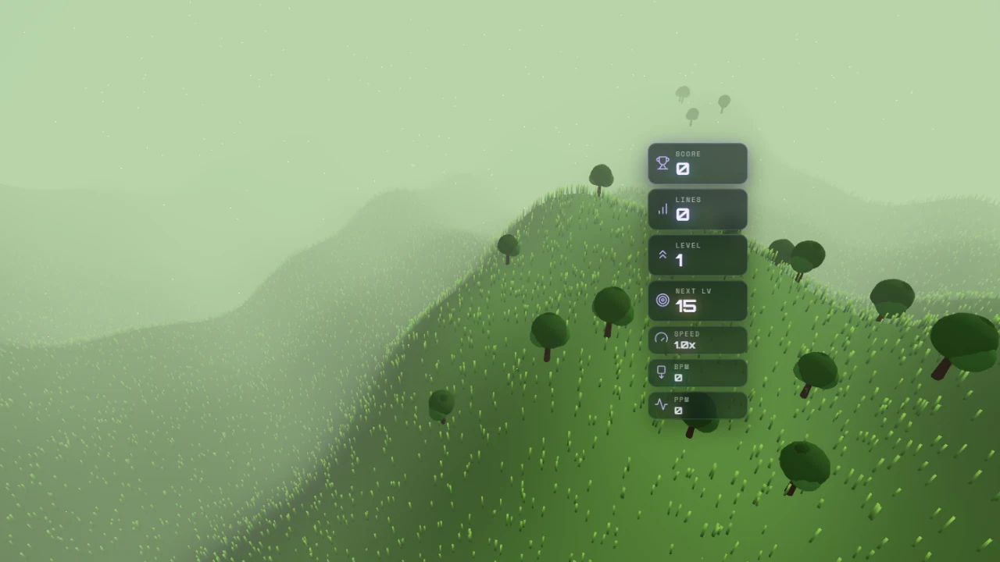
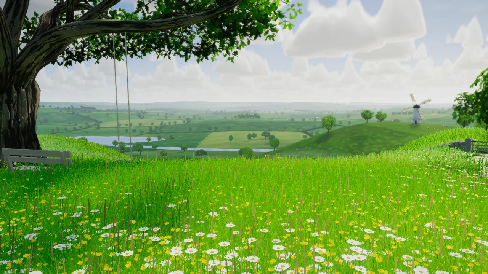
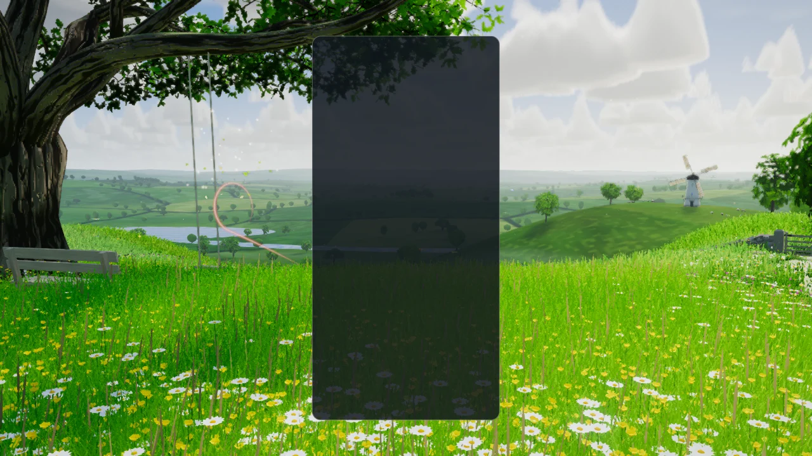
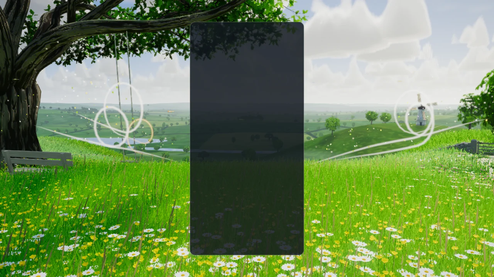
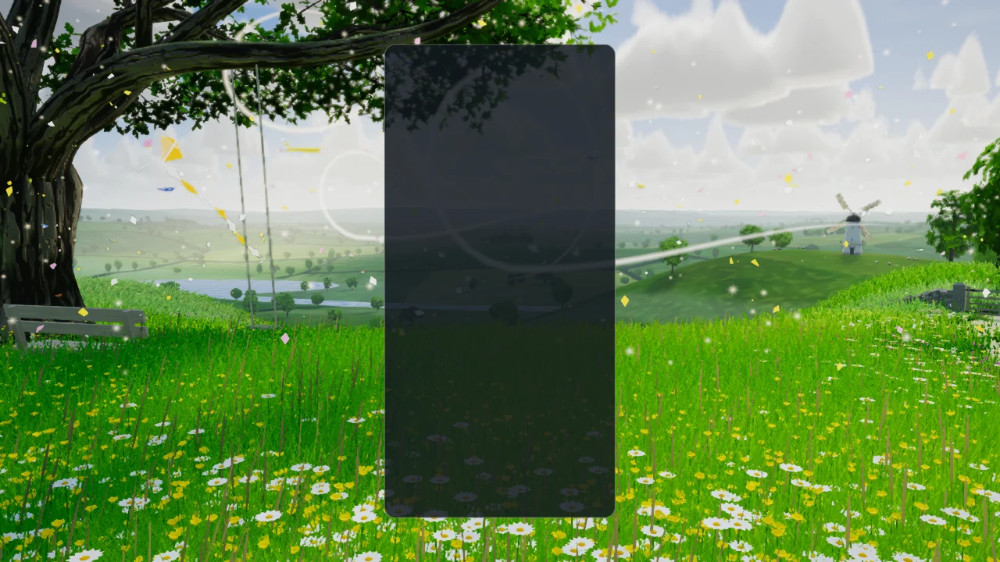
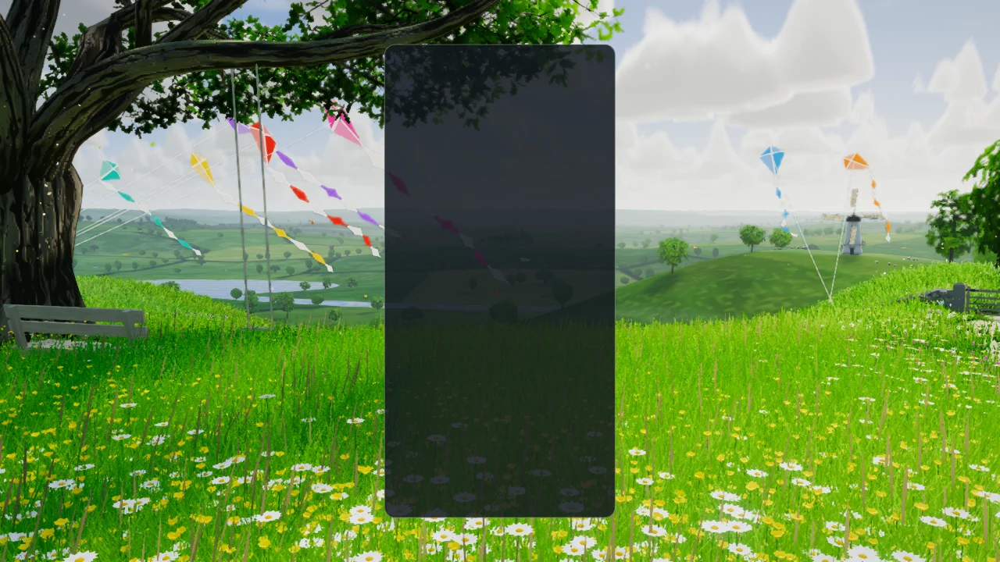
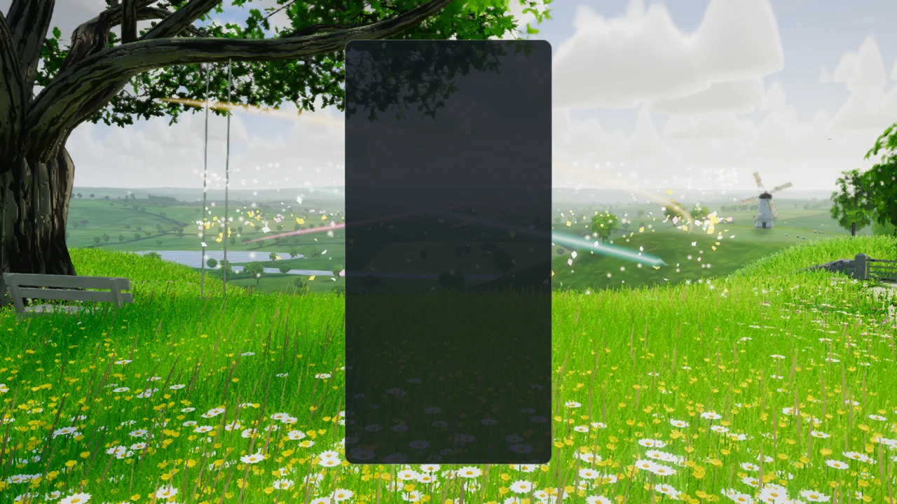
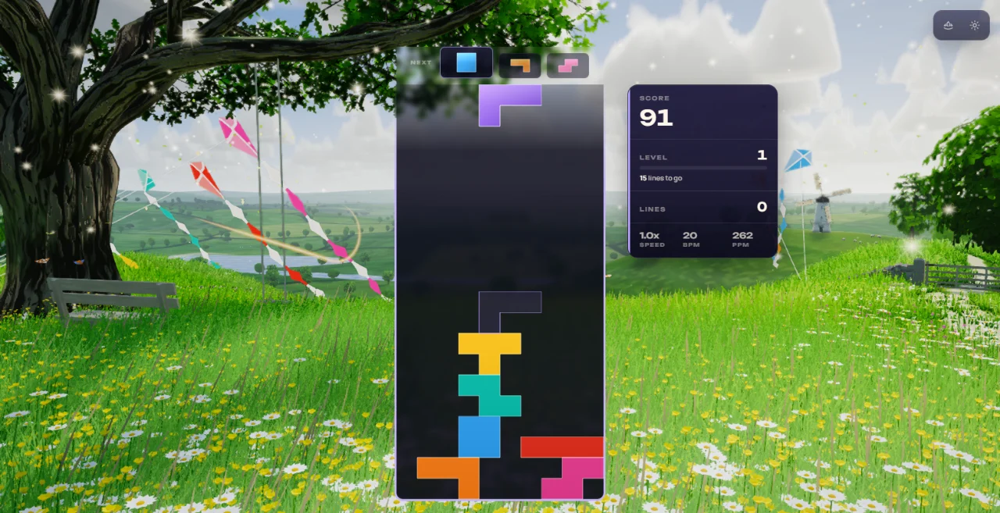
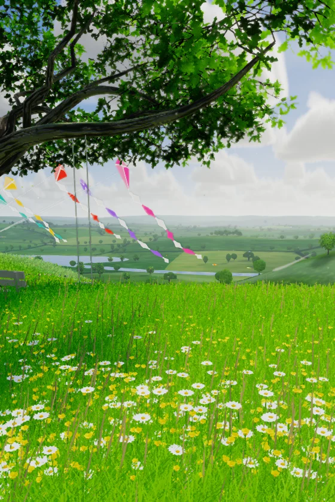
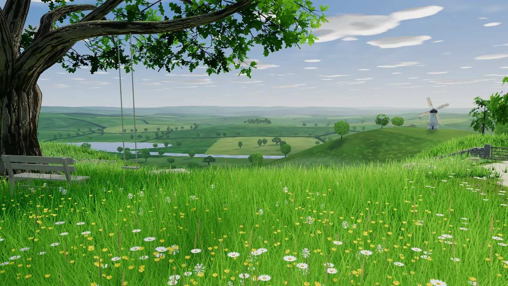

# Verdant Hills — a windy day on the downs (visual overhaul, 2026-10-09)

**Status: implemented (branch `feature/verdant-hills-masterpiece`). A record of what was built
and how it was checked — not a backlog.** Replaces the single-file scene of sine-wave hills,
sphere trees and crossed grass quads.

| Before | After (High, native WebGPU) |
| --- | --- |
|  |  |

## What the player sees

The same place as before — rolling green hills, round-crowned trees, haze in the distance, wind
in the grass — now built as a world. The lens stands in deep grass on the crown of a hill of
the downs. Straight ahead the hill falls steeply away, so past a brow of buttercups, daisies
and clover the eye drops into a wide valley: a tarn, a river, a patchwork of pastures parted
by hedgerows and dotted with trees, and ridge behind ridge into the haze. On the left an old
oak stands at the edge of the frame with a bench at its foot and a rope swing under its long
bough; on the right a chalk path runs down a spur past a drystone wall and a gate, and beyond
the spur's foot a white windmill turns on the next hill.

Over all of it stands a sky of fair-weather cumulus, and their shadows drift across the
valley: every shadow on the grass belongs to a cloud overhead, because both are the same
field. The wind shows as bands of light travelling through the grass, in the windmill's sails,
in the swing, and in thin bright ribbons that the breeze now and then draws across the hill.

The board card hides the middle quarter of a landscape screen, so the picture is composed for
the two side thirds: the oak and the open sky the kites fly in on the left, the windmill, the
wall and the gate on the right (in single player the score card stands on that side, beside
the windmill, over the part of the sky the sun is in). Portrait keeps the same world, turned
a little toward the oak.

## Seven kites

Each tetromino is a kite, and the piece colours are the kites' own:

| Piece | Kite | | Piece | Kite |
| --- | --- | --- | --- | --- |
| I | poppy red | | Z | teal |
| O | cerulean | | J | tangerine |
| T | sunflower | | L | violet |
| S | fuchsia | | | |

Which colour goes with which piece is not arbitrary: the project's palette gate
(`npm run check:palette`) screens every theme against the shape-to-colour mapping that is
familiar from other block games, and this assignment matches none of its seven roles.

Five kites are flown from posts on the left-hand spur into the open sky left of the board,
two from the right-hand spur over the windmill.

## How the hills answer the game

`VerdantHillsReactions` is a pure director; `VerdantHillsFxDirector` turns its cues into
ribbons of wind drawn from the board card's edge, seed and chaff thrown out from behind it,
gusts sent through the grass from the foot of the board, and light let down between the
clouds.

| Event | Response |
| --- | --- |
| Piece lock | A ribbon of wind in the colour of the piece's kite curls away from the card's edge beside it and throws a loop; dandelion seed and chaff puff out; a gust spreads through the grass from the foot of the board; and that piece's kite goes up on its line, where it flies for twenty seconds. |
| Hard drop | A stronger ribbon and gust, and from a long drop the dandelion clocks are shaken: seed lifts off the grass where the piece came down. |
| Line clear (1–3) | White ribbons stream from both sides of the card at the cleared rows, with petals, chaff and seed blown out beside them; the wind freshens, so the clouds, the grass, the windmill and the swing all quicken; every flying kite climbs. From two lines a front of wind crosses the hill and runs away down the valley. |
| Four lines | All of that, long ribbons laid across the whole view, seed and petals lifting off the hilltop, leaves torn from the oak, the swallows going up — and the clouds open: the valley falls into shade and a pool of sunlight with its shaft crosses the hills from left to right. |
| Combo / streak | The wind winds around the board: a whirl of ribbons, one to each half-turn, with seed and petals caught in it. Cascade depth (`COMBO`) or consecutive clearing locks raise it; it climbs, quickens, and takes the kites' colours as it builds. A lock without a clear ends the streak and the whirl unwinds. |
| The kite festival | Seven kites in the air at once: a ribbon in each kite's colour fans up from behind the board, every kite climbs to the top of its line, and the clouds open. It needs some kites to come down before it can happen again. |
| T-spin | Twin spirals of wind beside the board, one in the T piece's sunflower. |
| Back-to-back | Holds the whirl and the kites' height, and lifts the light. |
| Perfect clear / level up | The whole day exhales: wind, ribbons, light, wings (a perfect clear also puts all seven kites up). |
| Game over | The wind dies: the kites come down, the grass stands, the clouds slow. |

Everything honours `backgroundComboEffects` and `pieceLockRipple`, pauses with the theme, and
is driven by simulation seconds. No event allocates: ribbons, kites, gusts and emitters are
rows in fixed uniform arrays, and seed comes from a fixed hidden reserve.

| Lock | Two lines | Four lines |
| --- | --- | --- |
|  |  |  |

| Seven kites | Combo, held | In the game |
| --- | --- | --- |
|  |  |  |

## How it is built

### Trees and built things authored in Blender

`scripts/blender/verdant_hills_assets.py` grows four oaks (an old open-grown oak for the
frame, 15.5 m tall and 22 m across with one long low bough, and three round-crowned field
trees) on the branching library the Fall grove introduced, bakes bark ambient occlusion in
Cycles, renders the far-hill sprite sheet, and builds the tower mill and its four sails, a
section of drystone wall and its pier, the field gate, the bench, three limestone outcrops,
two sheep and a fence post. A tree file holds a bark mesh and a point cloud of *foliage
sites*; the runtime instances shared sprays of real oak-leaf geometry onto them. The props
carry no materials: their vertex colour says what each face is made of (weathered timber,
limewash, tar, drystone, sailcloth, wool, …), and one shader in the theme paints them all.
Details, formats and the regeneration command are in
[`src/themes/verdant-hills/assets/ATTRIBUTION.md`](../src/themes/verdant-hills/assets/ATTRIBUTION.md).
The pack is 2.5 MB with no third-party source and no generative model, and regenerating it
reproduced every file byte for byte.

The generator runs **headless** (`blender --background --factory-startup`); the Blender MCP
session was not used, so nothing in an open Blender was touched.

### Two maps baked ahead of time

`node scripts/verdant-hills/bake-land.mjs` writes what the theme would otherwise work out
every time it starts: `verdant-land.png` (the valley's patchwork at 2 m a texel: hedgerows,
each pasture's tone, still water, and the shade of every tree and hedge beyond the shadow
map) and `verdant-clouds.png` (the cloud field). Both are produced by the theme's own
functions and pinned to them by a test, and the theme makes coarse ones on the spot if a file
is missing. **Re-run the bake after changing the terrain function, the tree layout or the
cloud generator.**

### Runtime modules (`src/themes/verdant-hills/`)

| Module | Owns |
| --- | --- |
| `verdant-hills-theme.js` | Lifecycle, renderer, asset loading, gameplay subscriptions, board tracking. |
| `verdant-hills-assets.js`, `verdant-hills-land.js` | Loading and decoding the GLBs, the sprite sheet and the two baked maps. |
| `verdant-hills-world.js` | Composition root: builds and updates everything below. |
| `verdant-hills-light.js` | The sun, its static shadow map, sky colour, haze, ambient; the cloud field (`cloudDensity`, `cloudShadow`); the wind of trees and of the grass, the gust rings, the valley's front and the pool of sunlight; a shared noise texture. |
| `verdant-hills-sky.js` | The cumulus march into its own half-resolution target, the dome, the cirrus. |
| `verdant-hills-terrain.js` | The analytic height function (the home hill and its two spurs, the valley, the far ridges, terraces under what stands on the land), the ground mesh and its shader, the path, the patchwork's generator. |
| `verdant-hills-composition.js` | Camera framings, the visibility test, and `VerdantHillsSight`: which ground the lens can see. |
| `verdant-hills-layout.js` | Where every tree, wall section, prop and sheep stands (pure, seeded). |
| `verdant-hills-flora.js`, `verdant-hills-meadow.js` | Grass and flower geometry; planting, and the two shaders that draw all of it. |
| `verdant-hills-trees.js`, `verdant-hills-backdrop.js` | Bark and foliage instancing; the sprite trees of the valley and the far hills. |
| `verdant-hills-homestead.js` | The windmill and its sails, the wall, gate, bench, posts, outcrops, sheep and the swing. |
| `verdant-hills-life.js` | Butterflies and swallows. |
| `verdant-hills-kites.js` | The seven kites, their tails and lines. |
| `verdant-hills-ribbons.js` | The ribbons of wind. |
| `verdant-hills-seed-sim.js`, `verdant-hills-seeds.js` | Seed, chaff, petals and leaves: simulation, and drawing. |
| `verdant-hills-reactions.js` | The event director (pure). |
| `verdant-hills-stage.js`, `verdant-hills-fx-director.js`, `verdant-hills-rings.js` | Board card → world, and cues → ribbons, seed, force fields, gusts, the front and the pool of light. |
| `verdant-hills-post.js` | The light between the clouds, bloom, grade, FXAA; and the call that has the sky march its clouds before each frame. |
| `verdant-hills-quality.js` | One table for everything a tier scales. |

### Techniques (three 0.186.1)

- **One cloud field, used three times.** A small texture of rounded mounds on mounds is the
  whole sky. `cloudDensity()` gives it flat bases and domed tops and lets billows carve its
  skin; the sky marches that as a volume into a half-resolution target once a frame (the sky
  is the only thing behind it, so nothing is composited by depth), lighting each sample
  through the cloud toward the sun. `cloudShadow()` projects the same field down the sun's
  rays onto every surface. And the post pipeline marches that shadow function through the
  air, so the valley's haze is bright under a gap and blue under a cloud.
- **The game's own gap in the clouds** is one `vec4` (where, how wide, how open) that all
  three read: the cloud thins, the ground under it takes more than full sun while the rest
  of the valley dims, and its shaft is added to the air.
- **Grass only where it can be seen.** The home hill's brow hides the slope below it.
  `VerdantHillsSight` walks each bearing outward once, keeps the highest sight line, and
  plants only in the stretches that rise above it, spread evenly in the logarithm of
  distance; nothing is drawn where no pixel could show it.
- **A meadow with no CPU in it.** Every clump and flower is an instance whose root and turn
  live on the geometry; the vertex shader stands it up and bends it in the bands of the
  breeze, the rings from the board and the valley's front. A blade the wind lays over shows
  the sky on its back, and the ground shader carries the same bands on beyond the last
  blade, which is what makes the wind visible from the lens to the far hills.
- **Ribbons and kites as rows of a uniform array.** A ribbon is six `vec4`s (start, heading,
  colour, pace, shape, loop axis); its strip is placed on a path with loops by the vertex
  shader. A kite is six more; where it stands is a closed form of time, and its tail and
  line are shaped in the vertex shader. Ribbons are light and leave the depth buffer alone;
  the kites' cloth writes depth, because the post pipeline adds the light of the air along
  each pixel's line of sight and would otherwise give a kite a whole sky's worth and turn it
  pastel.
- **One static shadow map, used everywhere.** Materials stay unlit `MeshBasicNodeMaterial`
  and call a shared `shadow(light)` node; nothing that casts moves under a fixed sun, so the
  map is drawn over the first frames only. Trees and hedges beyond it lay their shade
  through the baked map.
- **Level ground under what people built.** The height function carries terraces for the
  oak, the mill, the gate and the bench; bases are bedded into the ground, and the wall's
  sections are raked to follow it.
- **CPU seed simulation.** A few thousand particles in typed arrays: the same code on both
  backends, in the playground's deterministic `seek`, and in the unit tests.

### Quality tiers

| Tier | Modelled trees | Far trees | Grass clumps | Flowers | Seed pool | Ribbons | Cloud march | Light between clouds | Post |
| --- | --- | --- | --- | --- | --- | --- | --- | --- | --- |
| Extreme | 47 | 900 | 86,000 | 6,000 | 3,600 | 18 | 72 steps, 0.6 scale | 28 steps | on |
| Ultra | 41 | 760 | 72,000 | 5,000 | 3,000 | 16 | 60 steps, 0.5 | 24 steps | on |
| High | 35 | 620 | 58,000 | 4,000 | 2,400 | 14 | 48 steps, 0.5 | 20 steps | on |
| Medium | 27 | 440 | 36,000 | 2,600 | 1,500 | 12 | 30 steps, 0.4 | 12 steps, 0.35 scale | on |
| Low | 19 | 260 | 17,600 | 1,300 | 850 | 12 | 16 steps, 0.33 | warmer haze toward the sun | off |
| Minimal | 15 | 150 | 8,900 | 650 | 450 | 12 | one flat layer in the sky | warmer haze toward the sun | off |

Every field tree stands on every tier: those a tier does not model are drawn as sprites at
the same places, so the baked shadows always have an owner. Low and Minimal draw the same
scene directly with ACES tone mapping and skip limb geometry.

## Verification

All of it on 2026-10-09, on the development laptop (RTX 3070 Laptop GPU, on mains power), with
other sessions working on the same machine.

| Check | Result |
| --- | --- |
| Playground, native WebGPU, 1280 × 720 | 20 fixed-time frames with no console output: idle with and without the board card, lock, hard drop, two lines, four lines at two ages, a held combo, seven kites, the festival, a perfect clear, game over, Medium and Low, portrait (560 × 840), ultrawide (1290 × 540) and the icon lens. An earlier batch covered all six tiers. |
| Playground, WebGL2 backend | High and Minimal with `forceWebGL=1`, no console output. The whole scene and every event were also rendered through the WebGL2 backend on the CPU (SwiftShader) while iterating. |
| The real game, WebGPU, High | Dev server, fresh profile, theme pinned, a single-player game started. Pieces were hard-dropped with the keyboard, so locks, ribbons and kites are the game's own; the two-line, combo and four-line clears were emitted on the game's event bus by the harness, not earned by play. The quality setting was changed to Medium while running (the theme rebuilt), and switching to another theme left no canvas behind. The console held the application's own lifecycle lines and nothing else. |
| Lifecycle validator | `node scripts/validate-all-themes.mjs --theme verdant-hills`: pass, 0 lifecycle failures, 0 console errors, 0 process failures. Its capture is the new `docs/theme-screenshots/verdant-hills.png`. |
| Unit tests | 15 files, 832 tests under `tests/unit/verdant-hills-*.test.js`; the URL-parameter catalog and the theme-registry lifecycle acceptance suites pass with them. |
| Static gates | ESLint on the theme, the effect, the bake script and the tests; lint ratchet; `tsc --noEmit`; TS ratchet; architecture fitness; theme-lifecycle audit; dependency boundaries; release gates; perf-budgets gate; IP strings. The palette gate reports this theme at 0 of 7 (the gate as a whole fails on the base commit as well, on `stillwater`, which this work does not touch). |
| Production build | `npm run build` with the boot-closure guard, and the pages-artifact check. |

| Portrait | Minimal on the WebGL2 backend |
| --- | --- |
|  |  |

**Frame rate: observed, not measured.** In the real game at High in a 1584 × 813 window the
harness read 259 and 302 frames a second with the frame limiter off (two runs) and about 125
with it on. Those are single readings on a busy machine with a dedicated GPU; they say the
theme has headroom there and nothing about an integrated GPU or a phone. No run through the
perf lane has been made.

**Not checked:** integrated GPUs and phones; the multiplayer layouts; a long session in real
time; a game in which the clears were earned by play.

### The icon

`verdant-hills-theme-icon.png` is the centre square of
`playground.html?effect=verdant-hills&orbit=0&hud=0&quality=High&t=16&icon=1&event=double&kites=7&eventAge=2.6`
at 1280 × 720 (the capture is byte-identical from run to run), with a slight lift in saturation
and contrast, baked as a 512 × 512 circle on a transparent ground. `icon=1` is a long lens on
the kites over the valley under the oak's leaves, with the swing hidden so its ropes do not
cross them.

## What was removed

- The previous implementation: the 810-line `verdant-hills-theme.js` (sine-sum terrain,
  crossed-quad grass, five-sphere trees, CPU-moved point particles, a wind-strength uniform
  as the only response to play).
- Nothing else in the repository read it: there were no assets, no CSS and no tests of its
  own.

## Known limits

- Grass, flowers and the terrain are built for the wedge the lens sees (out to an aspect of
  about 2.4:1); they are not meant to be seen from elsewhere.
- The shadow map is static, so swaying crowns, the swing and the kites do not move their
  shadows, and everything beyond the home hill is shaded by the baked map and the clouds.
- The valley's hedgerows are drawn by the ground shader, not modelled; its water is the sky's
  colour laid on the valley floor, not a mirror.
- The pool of sunlight is seen at a grazing angle, so on the valley floor it is a bright
  band rather than a disc; the dimming around it and its shaft carry the event.
- Portrait is the landscape world seen from the same spot: the windmill is out of frame.
- Bark, ground, stone and cloth detail are procedural in the shader; there are no texture
  maps beyond the sprite sheet and the two baked maps.
- The far sprites face one camera.
