# Vesper Chrysalis — the hatching at dusk

Implemented 2026-10-09 on `feature/vesper-chrysalis-masterpiece`, with Three.js 0.186.1. A
from-scratch rebuild: it replaces the earlier theme in full (a thin wrapper round a 1,900-line
playground effect, its escalation scalar `S`, its low-poly peaks and islands, the texture-mapped
planets, and four playground slices). Vesper Chrysalis keeps its identity — a mirror-still lake
at dusk, a dormant crystal relic over it that play wakes, crystal standing in the water, violet
and rose with an ember of amber, a ringed world in the sky — and everything else is new. This
document records the shipped design and what was verified. It is a reference, not a backlog; it
supersedes the four `VESPER_CHRYSALIS_*_2026-07.md` plans.

## The picture

A still lake at dusk. The sun has gone down to the right, and its last light lies on the horizon
there; the sky climbs from that ember through rose to a violet full of stars. A ringed world
hangs to the left as a thin crescent, the evening star stands over the afterglow, and three
ranges of mountains stand in the mist at the far shore. Seventy metres out, a chrysalis of cut
crystal hangs over the water from threads of silk strung with dew: a fan of them rises out of
the frame, and four long ones run to two stands of crystal at the edges of the view. Lantern
lilies float shut on the water to either side. The lake holds all of it upside down.

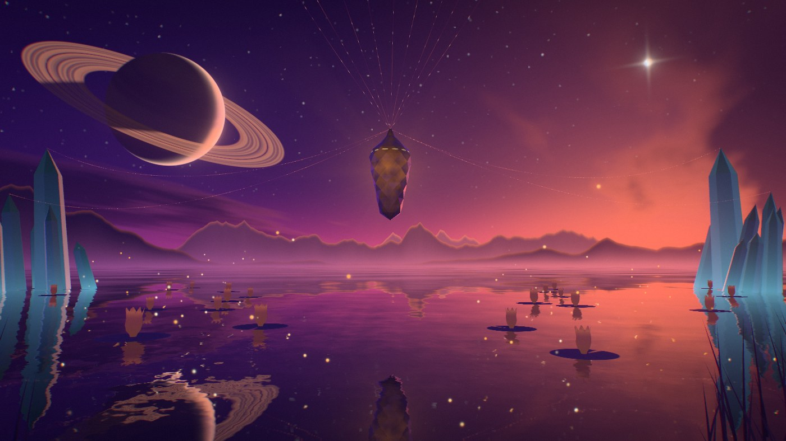

The gameplay card stands in front of the chrysalis, so the picture is built for what stays
visible: the sky, the world and the ranges fill the frame round the card, the lilies float left
and right of it, and what the chrysalis does when it wakes — its wings — it does to either side.

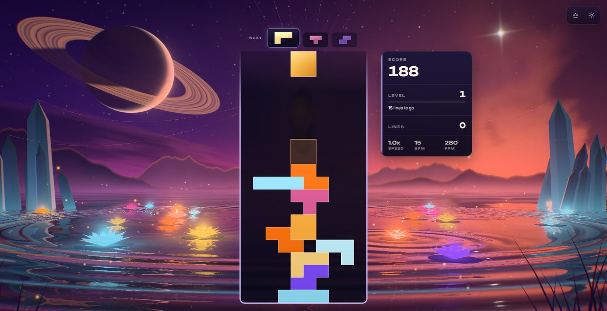

## The one idea

Vesper is the evening star and a chrysalis is what a moth comes out of: the board hatches it.
Every piece is a moth that carries its colour out over the lake to a lily; every clear sends
that light home to the chrysalis; and a chain of clears opens the chrysalis into wings of light
that are written, step by step, outward from behind the board — so that at the height of a chain
the board itself has wings, and the lake has them twice.

## Event language

| Gameplay | The evening's answer |
| --- | --- |
| Piece lock | A moth in the piece's colour leaves the card's edge at the piece's height and flutters out over the water to a lily on that side. The lily opens, takes the colour and keeps it — a lantern, with its light pooled on the water round it — for about half a minute; a ring runs out over the lake from it, bending the mirror, and a bead of the same colour runs down the silk on that side. Lilies that hold little light are chosen first, so the lake fills with the colours of the pieces played. |
| Hard drop | Three moths to three lilies, a ring struck into the lake under the chrysalis, every thread ringing, a camera kick and a lens-fringe jump. |
| Line clear | The cleared rows leave the card as blades of light at their own heights and come apart into scales. A swell crosses the lake from under the chrysalis, one front per line; each lit lily it passes lets most of its light go, and that light streams home to the chrysalis, which glows in the colours it was given. |
| Combo | The chrysalis hatches. For every step of the chain its wings are written further out from the root — veins first, light running along them; then the scalloped bands; then the bright margin — with a burning front where the writing is, and scales flying from it. The eyes on the hindwings open at four, those on the forewings at six. The cracks in the chrysalis spread, the points of gold on its shoulder light one by one, the aurora rises. When the chain breaks the wings burn away from the margin inward and fall as scales. |
| Four lines | The lake holds its breath: every light sinks for a quarter of a second. Then the wings beat once, every eye opens, a ring crosses the sky and splits it into its colours, a great ring crosses the lake, and the aurora blazes. |
| T-spin | The wings beat, and a faint prism ring crosses the frame. |
| Perfect clear | A four-line answer with four fronts and a hotter surge, and the swell relights every lily on the lake. |
| Level up | The evening moves on an hour, with a ring through the frame. Six hours cycle: rose dusk, ember hour, violet hour, blue hour, aurora night, first light. |
| Time | The evening also moves on by itself, whatever the level: an hour every two minutes, each hour blending into the next (slowest either side of a whole hour, so each is itself for a while). Sky, lake, crystal, wings and aurora all follow. A level-up adds its hour on top of where time has brought the evening. |
| Game over, new run | The wings fall and every lily lets its light fade; what is already in the air (scales, moths, rings) runs out. The hour of the evening stays. |

The game reports nothing for a piece that clears no line, so a chain is known to have broken
only when the next piece locks: the wings fall one piece late. If that piece starts a new chain,
the old wings burn away first and the new ones are written once they are gone.

The reaction settings are honoured: `backgroundComboEffects` off silences everything,
`pieceLockRipple` off silences locks, reduced motion stills the camera, slows the wings' stroke,
shortens the moths' flight and halves the ring across the sky.

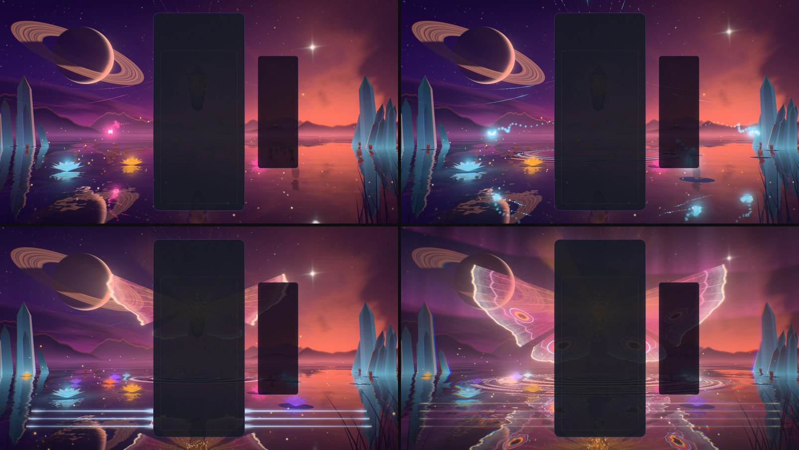

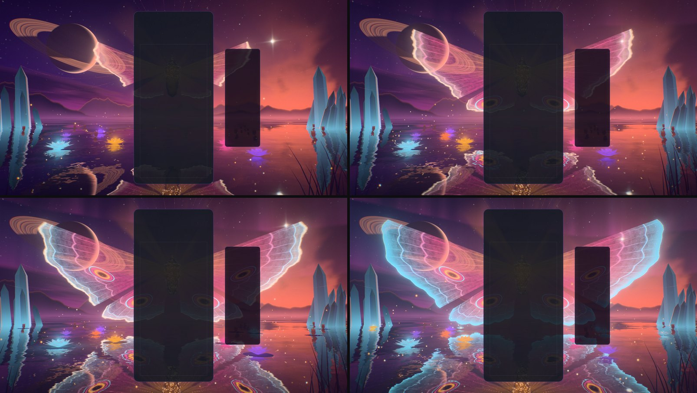

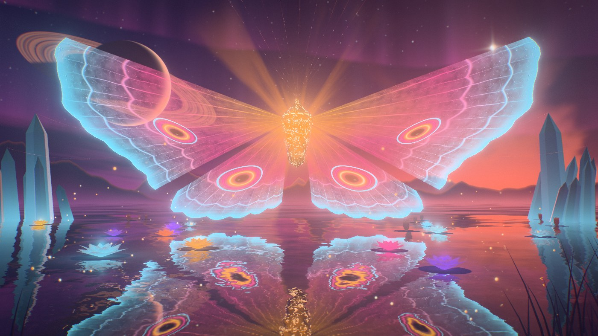

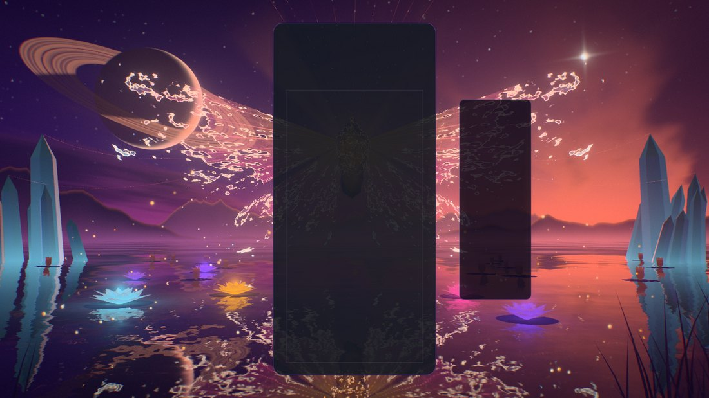

## How it is built

Everything is in `src/themes/vesper-chrysalis/`, shared by the theme and by the playground
effect `src/playground/effects/vesper-chrysalis.effect.js`, so what is iterated in the playground
is what ships.

- **One function for the whole distance.** `vcBackdrop(u, dir)` (`vesper-chrysalis-tsl.js`)
  returns everything far away along a direction: the dusk gradient and afterglow, two sizes of
  stars on a grid over the sphere, the ringed world (an analytic sphere and ring plane in a
  tangent frame: the crescent, bands of cloud, the rings' grooves and gap, the world's shadow on
  the rings and the rings passing in front of it), the evening star with its four-armed glint,
  the aurora's curtains, a deck of cloud lit from below, and three ranges of mountains drawn as
  ridged noise over the azimuth with mist at their feet. The sky dome draws it along the view
  ray; the lake draws it along its mirror ray. The reflection of the distance is therefore
  exact, as sharp as the sky itself, bends with every ripple, and costs no second render.
- **The mirror pass renders only what stands in the scene.** The chrysalis, wings, silk,
  crystal, lilies, moths, scales and fireflies are on their own camera layer; a planar
  `reflector()` renders that layer alone, with alpha, at half resolution, and the water lays it
  over the mirrored sky. The two lowest tiers skip the pass and keep the mirrored sky.
- **The lake** (`-lake.js`) is a slope field: a slow swell, two scales of wind in patches, the
  rings (a crisp front with wavelets behind it) and the clears' swells. The slope bends both
  mirrors; ring crests carry their colour.
- **The wings** (`-wings.js`) are four fans in one geometry, placed in the vertex shader from a
  fan coordinate (`an` across the wing, `v` from root to margin), so veins are lines of constant
  `an` and bands lines of constant `v`. The fragment shader writes the wing outward to a front
  set by the chain, and burns it away on a noise threshold when the chain breaks. They are drawn
  premultiplied, so the light adds while the veil and the eyes' pupils can darken what is behind
  them. `wingPoint()` in `-core.js` is the CPU twin the scales are thrown from.
- **The lilies** (`-blooms.js`) are instanced petals posed in the vertex shader by how much
  light the lily holds. A lily's light is a function of the clock and of its last change (when,
  from what level, to what level): the shader and the CPU evaluate the same expression, and
  moths in flight are entries in a small list of changes still to come.
- **Moths, scales, blades, fireflies** (`-fx.js`) are pools that are always drawn; an event
  writes where from, where to and when, and the vertex shader places the quads by the clock.
- **The chrysalis and the silk** (`-relic.js`): a faceted lathe whose every facet mirrors the
  sky function; the silk is drawn at a width set in pixels and strung with dew.
- **Post** (`-post.js`): one scene pass with MSAA, a bloom chain with a hue-preserving
  max-channel knee, and one full-screen pass (prism ring and lens fringe, calm zones behind the
  card and the HUD, shafts dragged out of the chrysalis, exposure that closes as the evening
  flares, a hue-preserving filmic curve, grade, vignette, grain and dither).
- **Choreography** (`-world.js`): everything is a function of the world clock and event
  timestamps, so `seek(t)` plus a fixed-step replay reproduces any frame. `-director.js` turns
  the game's events into at most one lock and one clear per player per frame and derives the
  true combo; `-composition.js` reads the board, card and HUD rects so events leave from the
  live board and the calm zones follow it.

Nothing is downloaded: no texture, no model. The noise is one 256² fBm texture baked on the CPU
at build, and every shape is generated in code. Blender was not used: the chrysalis is a lathe
profile cut into facets, the crystals are prisms, and the wings are light.

## Tiers

| | Minimal | Low | Medium | High | Ultra | Extreme |
| --- | --- | --- | --- | --- | --- | --- |
| Mirror pass (scale) | — | — | 0.4 | 0.5 | 0.6 | 0.75 |
| Sky | cut down | full | full | full | full | full |
| Lilies | 10 | 12 | 16 | 20 | 22 | 24 |
| Crystals per stand | 5 | 6 | 8 | 9 | 10 | 11 |
| Scale pool | 160 | 256 | 512 | 768 | 1024 | 1400 |
| Fireflies | — | 60 | 110 | 160 | 210 | 260 |
| Wing detail | veins, bands | veins, bands | + glitter | + fine net | + fine net | + fine net |
| Bloom / shafts | — | — | yes / 6 | yes / 10 | yes / 12 | yes / 14 |

Every tier keeps the whole picture and every event.

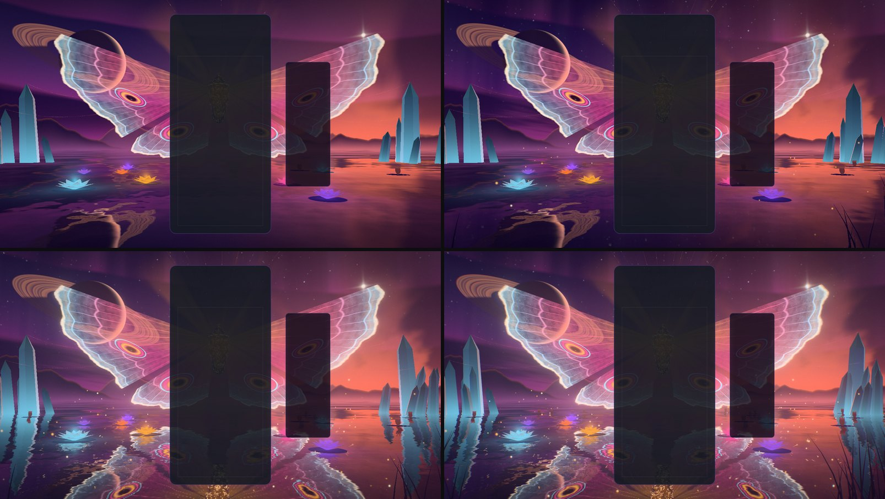

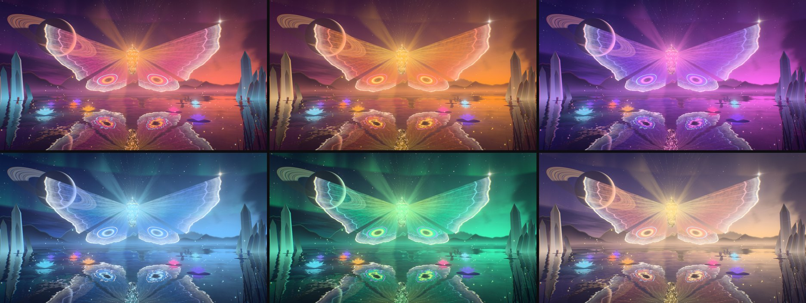

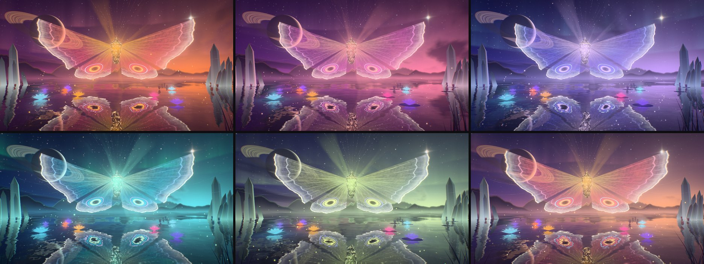

The hour is one number: the level's whole hour plus the world clock divided by 120 seconds
(`hourAt`, `paletteAt` in `-core.js`). The live palette eases toward it, so a level-up is a turn
of a few seconds and the drift is continuous; a seek lands on the same colours every time.

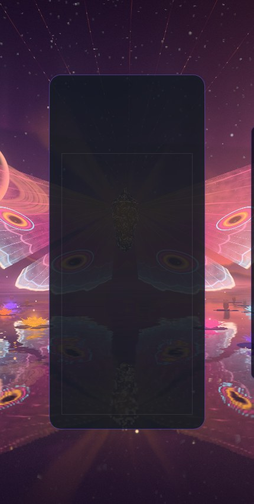

## Assets

None. The theme downloads nothing: one 256² noise field is baked on the CPU at build, and every
shape is generated. The old effect's planet maps are no longer read by this theme
(`public/textures/2k_moon.jpg` and `2k_neptune.jpg` still have other readers;
`2k_jupiter.jpg` and `2k_saturn.jpg` have none left and were left in place). Blender was offered
for this pass and was not used: the chrysalis is a lathe profile cut into facets, the crystals
are six-sided prisms, the lilies are instanced strips, and the wings are light.

The icon was recaptured from the playground and baked as a 512 × 512 full-bleed circle on a
transparent ground (`src/themes/vesper-chrysalis/vesper-chrysalis-theme-icon.png`; this theme
has no second copy under `public/assets/themes/`): the chrysalis alight, the two hindwing eyes
open, the lake under them. It replaces a placeholder (a ringed planet borrowed from another
theme).

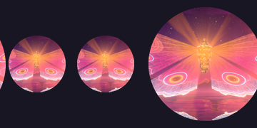

## Verification

- Unit tests: 262 tests in nine files, all passing (world 74, theme 61, the theme on its real
  world and post 17, CPU maths 34, director 26, meshes 14, random play 13, composition 12,
  quality 11), with eslint clean on the theme folder, the playground effect and the tests. Two
  helper agents wrote them against the public behaviour and were not allowed to edit the scene;
  the second pinned each fault it found with a failing test, which is how the faults listed at
  the end of this section were found. The random play is eight seeded runs of 2,500 events
  (locks, hard drops, clears of one to four lines, T-spins, perfect clears, chains made and
  broken, level-ups, new runs, game overs, malformed events, frames of no time and long stalls)
  across all six tiers, with invariants checked throughout: every lily's light inside its
  bounds and continuous across a new run, the list of changes to come in time order and never
  stale, every release tagged with a swell the lake still draws and due when that swell passes,
  pools and slot counters consistent, no eased value moving on a frame of no time, every
  shared uniform finite.
- Whole suite, on the final code: 753 files, 12,176 tests, one failure —
  `odyssey-level-briefing.test.js` expects "250,000" and this machine's Swedish locale formats
  it "250 000". It fails the same way on untouched `main`.
- Gates on the branch: typecheck and the TypeScript ratchet; lint ratchet (688 errors against a
  baseline of 807; the new files add none and the baseline was left as it is); architecture
  fitness; theme lifecycle audit; dependency boundaries; perf-budget gate; production build
  with the boot-closure guard; IP-string gate; Pages artifact check; release gates — all pass.
  The palette gate fails on `main` and here for the same unrelated reason (Stillwater); Vesper
  Chrysalis scores 3/7 on it and its piece colours were not changed.
- Playground captures on WebGPU (RTX 3070 Laptop), about seventy frames in seven batches, the
  last nineteen on the final code, every one with a clean console: rest with and without the
  board; a lock, a hard drop, two and three lines, four lines, a T-spin, a perfect clear, a
  chain at one, two, three, four, six and nine, the chain breaking; every tier but Extreme; all
  six hours; an upright 430 × 852 frame; High and Low on the forced WebGL2 backend. The same
  effect also renders on the WebGL2 backend with no GPU at all (Chromium's software
  rasteriser), which is how frames were checked while the GPU was taken: among them a moth's
  flight at two moments, the fall at one second, reduced motion, and the evening's drift at
  seven moments of the clock (the half hours above). The drift changes no shader — it moves
  the palette the uniforms already carry — so it was not captured again on WebGPU.
- In the real game (Electron, dev server, single player, `unlockAll=1`, 1584 × 813, High): the
  theme starts on WebGPU with the mirror pass, aims its events at the live board, takes real
  hard drops from the keyboard (three moths each) and bus-injected locks, clears, a chain and
  four lines, comes back from a live quality change (High to Medium) and lets go of its canvas
  when another theme takes over. No console errors or warnings in two runs. The same script ran
  on the WebGL2 backend at Low on the software rasteriser: a chain of seven, the wings at 0.9,
  four lines, no errors.
- Faults found by the tests and fixed, all covered now: light sent home from a lily that was
  still dark when the swell passed it (its moth was in the air); the next moth sent to the lily
  the last one had just lit; a part's `Group` outranking its meshes' render orders, so lily
  pads were drawn over moths and scales in front of them; eased values snapping on a frame of
  no time; scales not replayed after a seek; a new run emptying the air of the scales the
  falling wings had just shed; lilies letting go for a swell the lake had stopped drawing;
  no lily in frame to the right of the board on an upright phone; moths and rings overwritten
  in flight at two hard drops a second; a non-numeric row stalling the lilies' queue for good;
  a chain of one that broke and began again never reported, so its wings neither fell nor were
  written anew; two boards clearing in one frame sharing one release tag.

Observed, not measured (whole-game `requestAnimationFrame` rate at 1584 × 813, High, WebGPU on
the RTX 3070, on a machine a dozen other sessions were loading; not an ADR-0016 reading): 131 fps
at rest and 120 fps through events in one run, 53 and 93 in an earlier one taken while the CPU
stood at 100 %.

Not verified: GPU cost per tier through the theme perf lane (ADR-0016); an integrated GPU;
physical phones; local multiplayer, Infinity, meditation and Odyssey layouts in a capture
(their routing is unit-tested only); `scripts/validate-all-themes.mjs` (it cannot select a
locked theme since the collection change); the icon in the running picker and on an Odyssey
orb; first-activation compile time; sessions of several hours. The last two fixes — the
director reporting a chain of one that breaks and begins again, and the wings' stroke swinging
only away from the viewer — are covered by tests and by the final playground frames but were
made after the last real-game run. A theme started in the middle of a run shows the first hour
until the next level-up, because nothing tells a theme the current level at start (inherited
from the shared director).

## Reproduce

Playground (private dev server in the worktree:
`VITE_CACHE_DIR=.cache/vesper/vite-6731 node node_modules/vite/bin/vite.js --host 127.0.0.1 --port 6731 --strictPort`):

```
/playground.html?effect=vesper-chrysalis&t=20&hud=0&quality=High&board=1&locks=6
  + event=lock|drop|clear|quad|tspin|perfect|levelUp|break   eventAge=<s>  lines=<n>  color=<hex>
  + combo=<n>   level=<n> (holds that level's hour; without it the hour follows t)   locks=<n>
  + demo=1 (live)   forceWebGL=1   reduce=1
  + parts=sky,lake,spires,reeds,chrysalis,threads,wings,blooms,moths,dust,fireflies,blades
  + falseColor=1   noPost=1
```

The icon: `/playground.html?effect=vesper-chrysalis&t=20&hud=0&quality=High&icon=1&iconFov=34&iconPitch=0.03&combo=6&locks=8`
captured square at 840 px, cropped to 94 % about a point a little above the centre, graded
(saturation 1.16, contrast 1.1, brightness 1.04) and masked to a circle at 512 px.

In the game: `/?skipIntro=1&unlockAll=1`, background mode "Specific", theme Vesper Chrysalis.
Theme capture flags: `vesperChrysalisTime`, `vesperChrysalisFixedDt`, `vesperChrysalisParts`,
`vesperChrysalisFalseColor`, `vesperChrysalisForceWebGL`.
