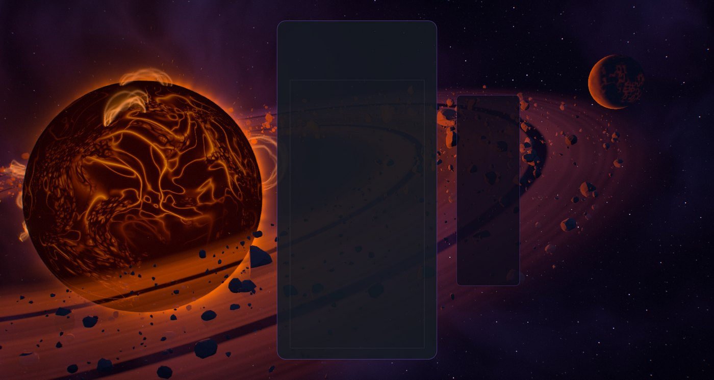
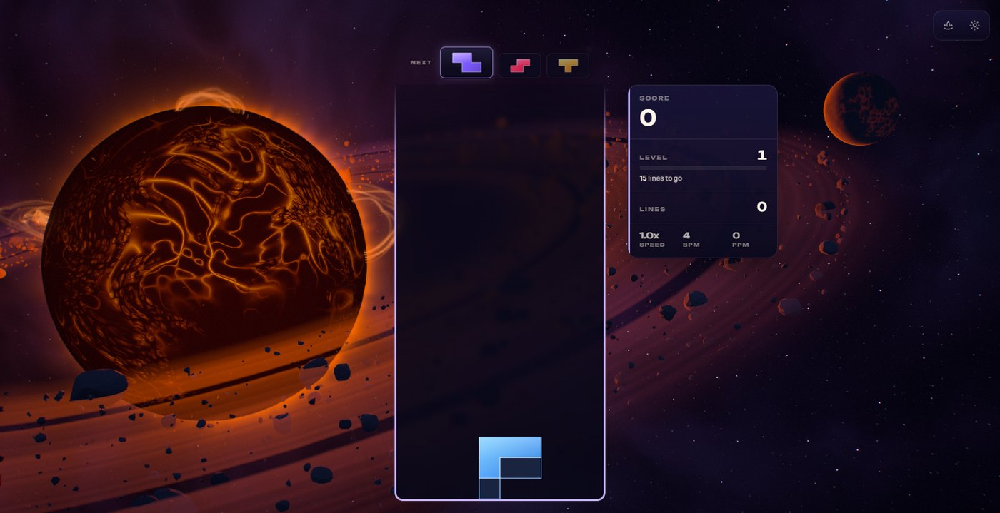
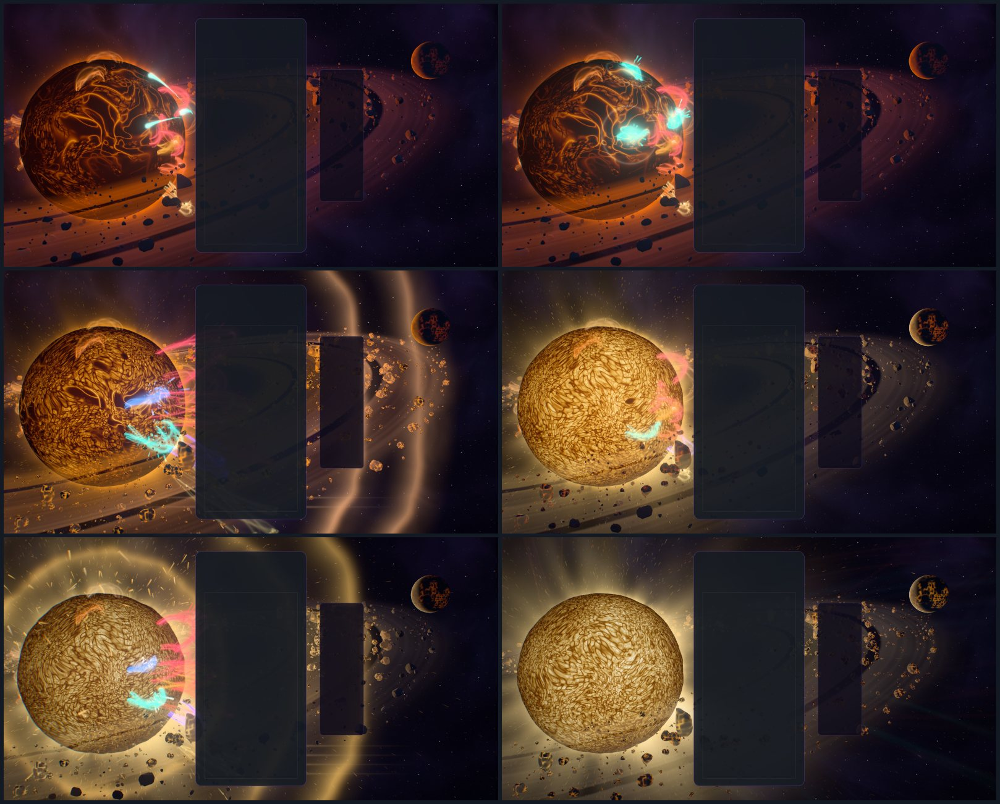
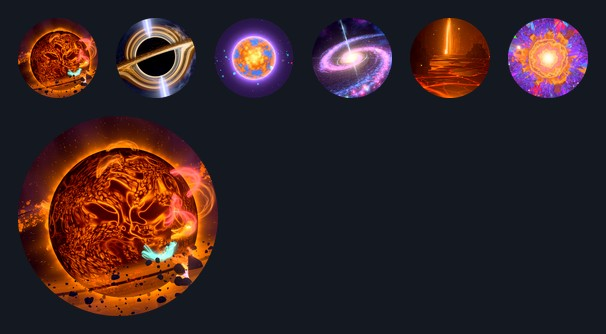
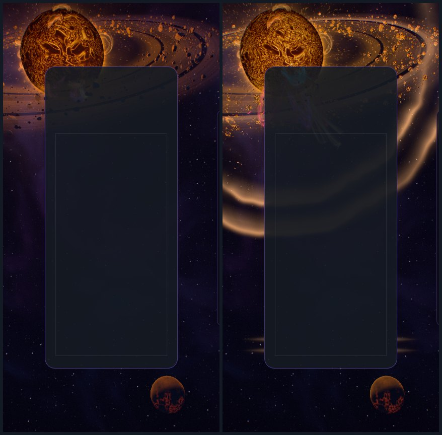
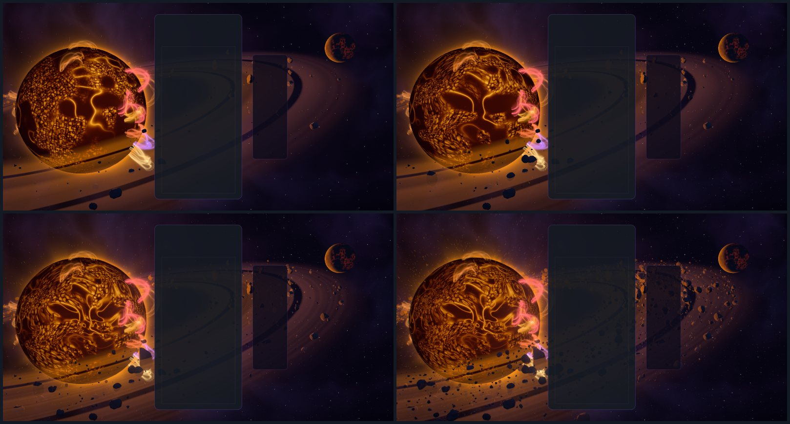
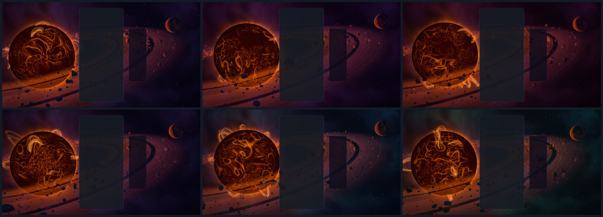

# Void Ember — the last ember

Implemented 2026-10-09 on `feature/void-ember-masterpiece`, with Three.js 0.186.1. A
from-scratch rebuild: it replaces the earlier theme in full (the 1,968-line class that drove
its own WebGPU device, eleven WGSL modules, a raw WebGL2 fallback renderer with five GLSL
modules, the "stellar conductor" and its debug overlay). Void Ember keeps its identity — one
dying star alone in a dark sky, its fire running from deep red through gold as play heats it,
embers streaming off it — and everything else is new. This document records the shipped design
and what was verified. It is a reference, not a backlog.

## The picture

A dying star hangs in an empty sky. At rest it is a banked coal: more than half its face is a
dark crust of cooled plates, with fire showing in the cracks between them and dull red cells
where the crust has opened. A thin fringe of fire stands on its limb and a few loops of its own
plasma rise and lift off. A belt of cinders circles it almost edge-on: a ring of dust, ringlets
and gaps, with a few thousand chiselled stones riding in it. The near arc crosses the star's
lower face, so stones pass over it as black shapes; the far arc goes behind it. Far off on the
other side stands one dead world, backlit: a thin crescent with old lava in its night side.
Nothing else gives light here. The void behind is nearly empty: a cold, thin dust and a few far
stars.

The gameplay card covers the middle of the frame, so the picture is built for what stays
visible: the star burns left of the card, the belt sweeps behind the card and out to the right,
and the upper right is left to the cinder world. On an upright phone the star rises into the sky
above the card; a square or 4:3 window is treated as a small landscape.

## The one idea

The board blows on the ember. Every piece is fuel: it burns on the star in its own colour and
the star holds that flame for a while. A clear makes the star let go of everything it is
holding. A chain of clears heats the whole star, from a coal to a gold sun. The more the player
has fed it, the more a clear sets off.

## Event language

| Event | Response |
| --- | --- |
| Piece lock | The piece leaves its card as a comet in its own colour and falls into the star, on the side that faces the card and level with the piece. Where it lands: a white-hot flash ringed in that colour, a ripple of the star's own fire running out over the photosphere, sparks, a scar that stays hot for a few seconds, and a loop of plasma that rises there and burns in the piece's colour — every element its own flame. The star **holds** the loop (its light falls to 1/e in 26 s) while the colour burns off into its own fire. Every lock also stokes the star a little. |
| Hard drop | The same, harder: three comets, three loops, a camera kick. |
| Line clear | The cleared rows leave their card as jets of light at their own heights. A shell of plasma leaves the star toward the board, one front per line, in the star's fire tinted by what it was holding; every held loop is torn off and flies out as an expanding arc in its own colour, shedding sparks. The wave crosses the dust, lights the belt's dust and stones as it passes, shoves the stones outward and leaves fire in their cracks. The piece that made the clear lands after the wave has left, so its loop is the first of the next round. |
| Combo | The ember is blown on. Each step of a chain heats it: a breath of brighter fire washes over its face from the board's side, the crust breaks up and sinks, the cells under it go from red through orange to gold, the corona reaches further, the wind streams faster, and everything the star lights brightens with it. When the chain breaks the star lets its breath go and cools over several seconds. |
| Four lines / perfect clear | The star holds its breath: every light sinks for a quarter of a second. Then it flares: a full shell crosses the frame (four fronts on a perfect clear), every loop including the star's own is torn off at once, sparks fly every way, the picture itself ripples outward, and the star stands white-gold with long streamers for a few seconds. |
| T-spin | The star spins up, and the corona and the ember wind wind into a pinwheel that springs back. |
| Level up | The void moves one palette along its line of five (verdigris, abyss, indigo, violet, garnet; level 1 starts on indigo), read in the sky's dust and in the far side of the ring, and a slow cold ring crosses the frame in the colour it is on its way to. The void also drifts along the same line by itself, one palette every 80 seconds, there and back, so its colour never sits still for a whole level. The star keeps its own heat spectrum throughout. |

Combo here is the true consecutive-clear combo (one `ComboTracker` per player in
`VoidEmberDirector`); the bus's `COMBO` event is cascade depth (ADR-0011). With several boards
on screen each lock leaves its own card, and the star heats to the longest chain any board is
holding.

The piece colours (`void-ember-tetrominos.js`) are flame-test colours: magnesium white, calcium
vermilion, sodium amber, strontium crimson, potassium violet, copper teal and a blue-hot. None
sits in its shape's guideline hue band (0/7 on the palette screen).

## How it is built

| File | Role |
| --- | --- |
| `void-ember-core.js` | Three-free constants and maths: the star and belt's geometry, pool sizes, the heat ramp, the clear wave's timing, how a loop's held light falls, the five palettes, where the star sits on screen for an aspect. |
| `void-ember-tsl.js` | Hashes, the heat ramp as a shader function, the two baked noise textures, the shared uniforms, the clear wave as light. |
| `void-ember-star.js` | The photosphere (a real sphere shaded in the star's own frame) and the corona (one camera-facing sheet). |
| `void-ember-loops.js` | Flare loops: ribbons in the star's frame, and the store of what each slot holds. |
| `void-ember-belt.js` | The stones (three classes), the dust ring, the cinder world. |
| `void-ember-sky.js` | The void: one dome, drawn last among the solids. |
| `void-ember-fx.js` | The ember wind, comets, sparks, the clear's shells, the row jets. |
| `void-ember-world.js` | Owns the uniforms, the parts, the camera rig, the star and belt's pose and the choreography. Shared with the playground effect, so what is iterated there ships. |
| `void-ember-director.js` | Renderer-free: stages bus events per player and resolves one lock and one clear per frame. |
| `void-ember-composition.js` | Three-free: reads the live card, board and HUD rects and maps board columns and rows onto the screen. |
| `void-ember-post.js` | One scene pass, bloom, and one output pass. |
| `void-ember-quality.js` | The six tiers. |
| `void-ember-theme.js` | Lifecycle, renderer selection, settings, layout watch, GPU-loss recovery, capture flags. |

Techniques worth knowing before changing it:

- **One node renderer on both backends.** `WebGPURenderer` on WebGPU, its WebGL2 backend
  otherwise (or `?forceWebGL`). The theme no longer owns a GPU device, a pipeline cache or a
  second renderer, and the manager's own-pipeline path (ADR-0020) has no theme using it now.
  Nothing uses compute: every ember, comet, spark, stone and loop is a closed-form function of
  the clock, so the WebGL2 backend draws the same scene.
- **One number decides what the star is.** `heat` runs from 0.2 (banked) toward 0.88 as a
  chain grows (gold; up to 0.12 more while locks are stoking it) and to 1.04 for a few seconds
  after four lines (white-gold). It sets how much of the face the crust covers, the temperature
  of the cells and cracks, the corona's reach, the wind, and the light the star casts on
  everything else.
- **3D noise in one fetch.** The photosphere, corona, shells, ring and stones read a 256²
  lattice texture whose channels hold two z-slices side by side, so a trilinear value-noise
  sample (two independent fields) is one bilinear fetch at level 0. No MaterialX noise anywhere.
  The sky's clouds, the loops' weave and the heat haze read a second, mipped fBm texture. Both
  are baked on the CPU when the world is built.
- **The crust is a threshold that heat moves.** Three octaves make a field; where it falls below
  an edge that heat lowers there is crust, elsewhere convection cells (bright tops parted by a
  net of dark lanes, from the ridges of two more octaves). Cracks are the ridges of the finer
  crust octaves. On the two lowest tiers the third octave is absent and so is its ridge: a
  constant there would light the whole crust.
- **The solids write depth; every light is added with the depth test on.** A stone crossing the
  star is a black shape on it, a loop carried round the limb goes behind it, the corona's sheet
  is hidden by the star's near half and by anything in front. Unlike the other space rebuilds
  the scene pass therefore has a real depth buffer, and MSAA on High and up (the stones are hard
  shapes against a bright disc).
- **Loops are geometry in the star's frame.** Each is three ribbons along a semi-ellipse on two
  feet, turned to face the camera and closed where they would run straight at it. Inside a
  ribbon two threads of plasma wander (read at a blurred mip: the slow octaves wander, the fast
  ones saw). Rising, standing, cooling from the piece's colour into the star's fire and lifting
  off are closed forms of four per-instance vectors. The star's own prominences are scheduled
  the same way: raised on a clock, with their lift-off time written at the same moment.
- **Events are queued with the time they happen at.** A comet's landing, a torn loop's sparks, a
  kick, the flare after the hush are entries in a small sorted queue that the frame reaching
  them fires, stamped with their own moment. Which slot a new loop takes is decided when the
  comet lands: an empty one, else the arc that has been leaving longest, else the dimmest
  standing loop; never one that has just risen, is still to rise, or is about to be taken by a
  wave.
- **The iris, and what is exempt from it.** The post's exposure falls as the star heats, so a
  gold star keeps its colour. The bloom's knee is divided by the exposure (it selects what is
  bright after the iris has closed; a fixed knee bloomed the whole face). The lights of an event
  (loops, comets, sparks, shells, jets) are multiplied by the inverse, so they are as bright on
  screen over a hot star as over a banked one; the void, its cold dust and the far stars are
  raised too, so the sky does not go black. The dust ring and the sky's warm stain take a
  compressed share of the star's light, not the full cast: at the full cast they veiled the
  frame.
- **The clear wave is one function.** `veWaveLight` gives the fronts and the afterglow at a
  distance from the star; the sky's dust, the ring, the stones (light, a shove, fire in the
  cracks), the cinder world and the wind all read it. The sky and the ring skip it when no wave
  is in the frame.
- **The void's colour is a place on a line.** The five palettes are stored in hue order, so
  neighbours mix without passing through grey, and the line is walked there and back (there is
  no wrap from green to red). The live palette is the one at `level − 1 + time / 80 s`: a
  level's step and the clock's drift simply add, with a rest on each palette at both ends of a
  step. On a level change the PLACE is eased, never the colours, so once it has settled the
  palette is a pure function of the level and the clock.
- **Closed form first.** Nothing is created at event time: events write numbers into
  ring-buffered uniform rows and preallocated pools. `seek(t)` plus a fixed-step replay
  reproduces any frame.
- **HDR, single output.** One scene pass, a max-channel bloom knee (no MRT), and one output pass:
  heat haze round the star, the space ripple, lens fringe, calm zones under the card and HUD,
  bloom, rays dragged out of the star, an anamorphic streak when it is hot, a hue-preserving
  filmic curve, grade, vignette, grain and dither. `usesMrtScenePass()` is false.

## Tiers

| Tier | Star noise reads | Corona reads | Wind | Sparks | Stones (boulders, stones, gravel) | Fire in cracks | Ring reads | Bloom, rays, streak | MSAA | Fringe, haze |
| --- | ---: | ---: | ---: | ---: | --- | --- | ---: | --- | ---: | --- |
| Minimal | 3 | 1 | 1,400 | 160 | 10, 80, 380 | off | 1 | off | 0 | off, off |
| Low | 4 | 1 | 2,600 | 260 | 14, 140, 800 | off | 1 | off | 0 | off, off |
| Medium | 5 | 2 | 5,200 | 420 | 22, 240, 1,500 | on | 2 | on | 0 | off, on |
| High | 6 | 3 | 9,000 | 700 | 30, 340, 2,600 | on | 3 | on | 4 | on, on |
| Ultra | 6 | 3 | 14,000 | 1,000 | 36, 460, 4,000 | on | 3 | on | 4 | on, on |
| Extreme | 6 | 3 | 22,000 | 1,400 | 44, 600, 6,000 | on | 3 | on | 4 | on, on |

Every tier keeps the whole picture and every event. These are allocation budgets, not
measurements of frame rate.

## Assets

None. Everything is generated in code: the two noise textures, the stones' meshes (balls cut by
random planes, with flat faces), the ring, the star. No model or texture file is loaded, and
Blender was not used: the star is a sphere and a shader, the stones are a dozen plane cuts, and
what makes the scene read is the lighting. The earlier theme loaded no assets either.

The theme has its own icon now (`src/themes/void-ember/void-ember-theme-icon.png`, with the same
bytes at `public/assets/themes/`); its registry entry borrowed Black Hole's until this change.

## Verification

- Unit tests: 217 tests in five files (director 20; composition 10; theme 60; world 66; plan
  61), all passing, plus the URL-parameter catalogue (4). The old theme's two test files
  (pipeline cache, raw WebGL2 renderer) are gone with the code they covered.
- Whole suite, run once while a dozen other sessions used the machine: 749 files, 12,132 tests;
  748 files passed. The one that did not (`odyssey-level-briefing`) expects "250,000" and gets
  "250 000" from this machine's Swedish number format, and fails identically on `main`.
- Gates: typecheck; lint ratchet (709 errors against a baseline of 807; the new files add none,
  and the baseline was left as it is); theme lifecycle audit; dependency boundaries (1,407
  modules); TS ratchet; architecture fitness (metrics improved, not locked in); perf-budget
  gate; production build with the boot-closure guard; IP-string gate; Pages artifact check;
  release gates — all pass. The palette gate fails on `main` and here for the same unrelated
  reason (Stillwater); Void Ember scores 0/7 on it.
- Shader graphs: every material builds on the WGSL and the GLSL node builders in Node, on High,
  Medium, Low and Minimal, with no warnings (a check of the graph, not of the compiled shader).
- Playground captures on WebGPU (RTX 3070 Laptop, 1600 × 852): rest; a lock, a hard drop and
  their landings; clears of one, two and three lines; held chains of five, six and eight; the
  four-line hush, flare and afterglow at six moments; a perfect clear; a T-spin; the void at
  six moments of its drift; Minimal, Low, Medium, Ultra and Extreme; High and Low on the forced WebGL2 backend;
  an upright 430 × 852 frame at rest and through a clear; a square and a 21:9 frame; reduced
  motion; the raw scene without post. The final sets (26 + 4 frames) had no console errors or
  warnings.
- In the real game (Electron, dev server, single player, themes unlocked with `?unlockAll=1`):
  the theme starts on WebGPU, aims its events at the live board, takes real hard drops from the
  keyboard and bus-injected locks, clears, a chain and four lines, survives live quality changes
  (High to Medium, Ultra and Low) and an adaptive downscale, resets on game over and lets go of
  its canvas when another theme takes over; no console errors. The same event script ran clean
  on the WebGL2 backend at Low and on the integrated AMD GPU at High.
- The void's slow drift: six WebGPU frames of the playground at level 1 with no events, at 20,
  100, 180, 340, 420 and 500 s, stand on indigo, violet, garnet, indigo again, abyss and
  verdigris; and the real game, left alone on level 1, read indigo at 11 s and violet at 75 s
  with a clean console. Tests pin the rest (every palette is reached, each step lands on a hue
  neighbour, a level adds to the clock, a seek and a replay agree).
- The repo's lifecycle validator (`scripts/validate-all-themes.mjs --theme void-ember`, against
  the dev server): pass, 109 checks, 0 lifecycle failures, 0 console errors, 0 process failures.
- A helper agent wrote the theme class, the director, the layout module and the tests from the
  Galaxy precedent, and its reviews of the world found faults the captures had not shown: a hard
  drop's three comets landing on one loop slot; a kick, a flare or a ripple overwritten by the
  next event; events stamped a frame late; comets starting on the star when four cards cover it;
  the star's own prominences replaced while still lit; a recycled wave slot making the belt
  jump; a loop promised to a wave being replaced before it could fly. All are fixed and covered
  by the tests above.

Observed, not measured (whole-game frame interval at 1584 × 813 on the RTX 3070 while a dozen
other sessions used the machine, single runs): 7.7 ms median at High through the event script,
which is this display path's cap of about 130 fps, with one frame over 66 ms in 2,475; with the
frame-rate limit lifted, 3.9 ms median at High and 2.3 ms at Ultra in two separate runs (the
order shows how noisy the machine was, not that Ultra is cheaper). On the WebGL2 backend at Low,
7.7 ms. As a correctness check only, the integrated AMD GPU drew every event at High at about
90 fps.

Not verified: GPU cost per tier through the theme perf lane (ADR-0016); physical phones; local
multiplayer, Infinity and Odyssey layouts in a capture (their routing is unit-tested only); the
icon in the running theme picker and on an Odyssey level orb; sessions of several hours.
`docs/theme-screenshots/void-ember.png` still shows the previous artwork (a fleet capture
writes it).

## Reproduce

Run `npm run dev:playground`, then:

`/playground.html?effect=void-ember&t=20&quality=High&board=1`

Add `event=lock|drop|clear|quad|tspin|perfect|levelUp` with `eventAge=<s>`, and `combo=<n>`,
`level=<n>`, `lines=<n>`, `u=<0..1>`, `row=<r>`, `color=<hex>`. `locks=<n>` plays n locks first,
so the star is holding their loops when the event fires. `demo=1` (without `t`) plays a looping
script. `parts=` draws only the named parts (`rocks` names all three classes of stone);
`falseColor=1` bands the pre-tone-map peak; `noPost=1` shows the raw scene; `msaa=<n>` overrides
the scene pass's sample count; `forceWebGL=1` uses the WebGL2 backend; `reduce=1` is reduced
motion. In the game: `?voidEmberTime=`, `?voidEmberFixedDt=`, `?voidEmberParts=`,
`?voidEmberFalseColor=1`.

The theme icon is a frame of the scene through the playground's icon lens (the camera turned to
the star and closed to 24°), one step into a chain with six locks held:

`/playground.html?effect=void-ember&t=20&quality=Ultra&icon=1&iconFov=24&locks=6&combo=1`

captured in a 1000 × 852 window, cropped to a 760 px square round (480, 400), given a colour
lift (contrast 1.12, saturation 1.24, brightness 1.2) and baked as a 512 px circle on a
transparent ground.

## Captured previews

Any of them can be reached at once: a palette's place is `level − 1 + t / 80`, so `level=2`,
`level=3`, `level=6` and `level=7` at `t=20` stand on violet, garnet, abyss and verdigris.
