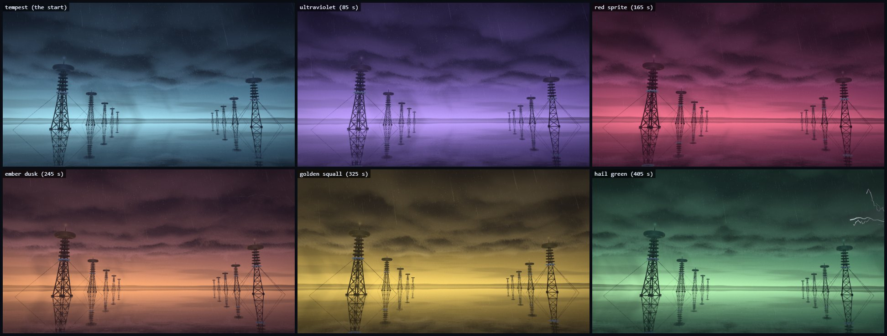
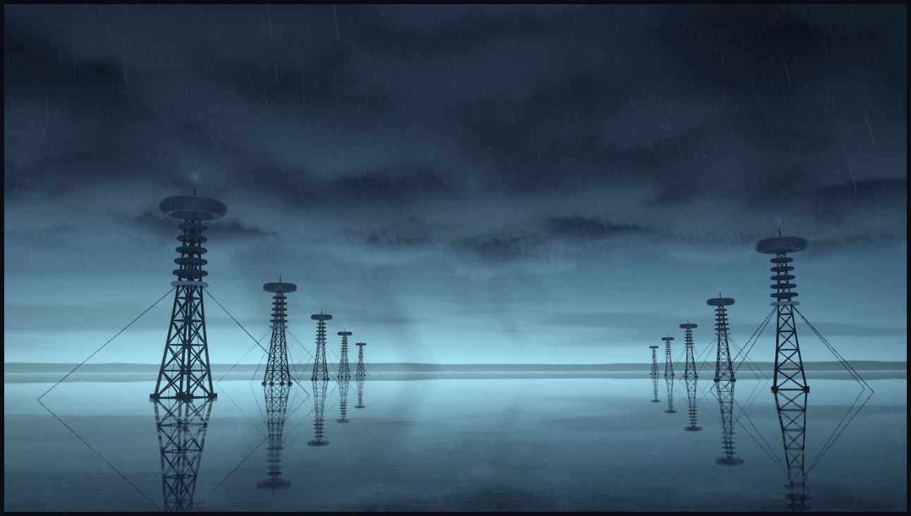
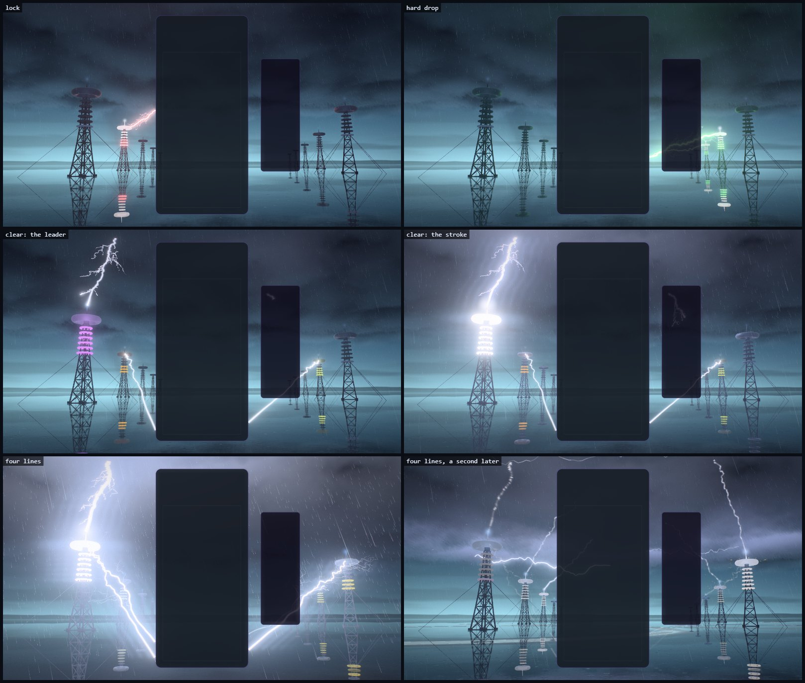
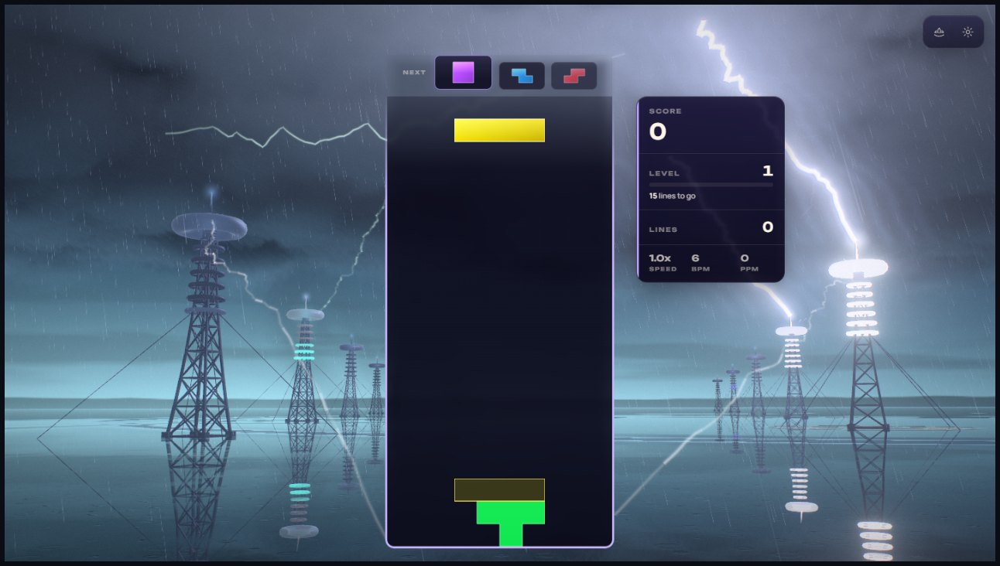
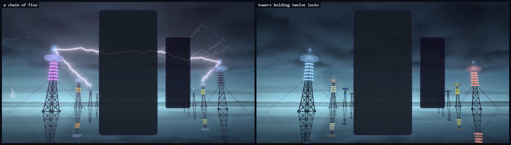
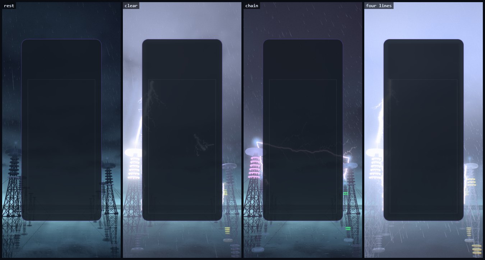
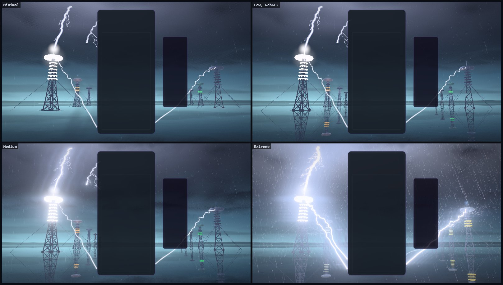
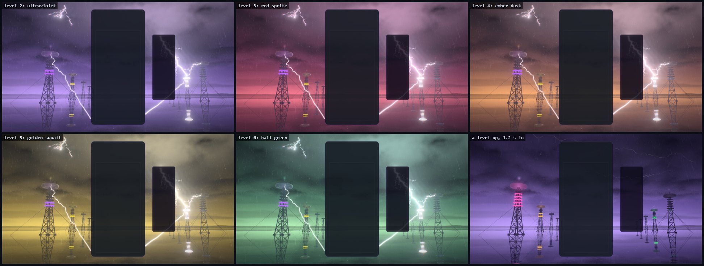

# Voltage Storm — the collector field

Implemented 2026-10-09 on `feature/voltage-storm-masterpiece`, with Three.js 0.186.1. A
from-scratch rebuild: it replaces the earlier theme in full (a 400-line class that drove the
shared WebGL fluid simulator with white splats on a blue-black ground). Voltage Storm keeps its
identity — thunderheads and white lightning over deep blue, as its icon always showed — and
everything else is new. This document records the shipped design and what was verified. It is a
reference, not a backlog.

## The picture

A supercell hangs low over a flooded plain at dusk. Its underside is a ceiling of dark lobes
that grow lighter with distance, because under the cell's far edge a strip of clear sky still
glows cold teal, with rain shafts and the low hills of the far shore standing in it. A few
centimetres of water lie over the plain, so everything stands on its own image. Two rows of
collector towers recede into the strip either side of the board: a lattice mast that narrows as
it climbs, six capacitor rings round its upper third, a toroid electrode on an insulator column,
a finial where lightning strikes, guy wires running into the water. Rain falls through all of
it. Every few seconds the storm flickers on its own: lightning crawls through the cloud, or a
thin bolt comes down far off in the strip. And the storm's light is never still for long: left
alone it drifts round a wheel of six palettes, teal to violet to red to amber to gold to green
and back to teal, one step in about eighty seconds.

The gameplay card covers the middle of the frame, so the picture is built for what stays
visible: the hero tower stands left of the card with open sky above it for a bolt to cross, a
second tower stands right of the HUD, the others close ranks toward the horizon behind the card.
On an upright phone the two rows stand in the margins either side of the card.

## The one idea

The board charges the towers and the storm answers. A piece's charge leaps to a tower and stays
there as light in the piece's colour; a clear calls lightning down onto the towers that hold the
most. The more the player has charged, the more a clear lets go.

## Event language

| Event | Response |
| --- | --- |
| Piece lock | An arc in the piece's colour leaps from the card's edge, at the piece's own height, to a tower on that side. The tower's rings light in that colour from the bottom up, a pulse climbs them, the electrode flares, sparks fly, a ring in that colour leaves the tower's foot across the water, and the cloud above flickers back. The tower **keeps** the charge (it fades over about half a minute), so the field slowly fills with the colours of the pieces played. |
| Hard drop | The same, harder: a heavier arc with three strokes, a second arc to the next tower, a stronger ring, a camera kick. |
| Line clear | Each cleared row discharges out of an edge of the card as an arc, to either side in turn. A beat later the sky answers: one bolt per line, from the cloud's underside onto the towers holding the most charge. A leader steps down, the return strokes run up the channel, the branches flash once. The struck tower goes white, throws what it held as sparks of that colour and goes dark; the cloud lights from inside round the bolt, the rain lights everywhere at once, a ring crosses the water and the camera shakes. |
| Combo | The storm builds. An arc stands between tower tops for every step of the chain past the first (up to five; the third crosses behind the card from the hero tower to the one on the right), corona burns on every electrode, the storm's own lightning comes several times as often, the rain thickens and leans, the cloud drifts faster. When the chain breaks the storm lets its breath go and the arcs cool. |
| Four lines / perfect clear | The storm holds its breath: every light sinks for a fifth of a second and the rain hangs in the air. Then the rows discharge and a superbolt strikes the hero tower with five return strokes; the four nearest towers are struck in turn; sheet lightning runs out through the cloud as a ring; the picture itself ripples from the strike; lightning crawls across the whole ceiling afterwards. |
| T-spin | The cloud over the hero tower winds up like a mesocyclone and springs back, and an arc climbs the hero's mast. |
| Level up | The storm's light steps one palette on from wherever it has drifted to (tempest, ultraviolet, red sprite, ember dusk, golden squall, hail green, and round again), over a couple of seconds, and the cloud flickers in the light that is coming. |
| Time, with no event at all | The same light drifts by itself: it rests on a palette for about twenty-five seconds, then mixes into the next over about fifty-five. A level's step and the clock's drift add up, so two runs at the same level seldom look the same. |

Combo here is the true consecutive-clear combo (one `ComboTracker` per player in
`VoltageStormDirector`); the bus's `COMBO` event is cascade depth (ADR-0011). With several boards
on screen each board throws its arcs from its own card, outward, and the storm builds to the
longest chain any board is holding.

## How it is built

| File | Role |
| --- | --- |
| `voltage-storm-core.js` | Three-free constants and maths: the storm's geometry in metres, the towers' layout for an aspect, how a stroke's light runs in time, how a tower's held charge is carried, the six palettes and the wheel they stand on. |
| `voltage-storm-tsl.js` | Hashes, the two baked noise textures (a 2D field with its own slope, and the cloud's 3D field), the shared uniforms and the event tables, the strokes' light and the water rings as reusable loops. |
| `voltage-storm-sky.js` | The whole sky, painted once per frame into a reduced-resolution target: the clear strip, the far shore, rain shafts, and the cell's underside as a marched slab. |
| `voltage-storm-water.js` | The flooded plain: it mirrors the sky target, and carries wind ripple, raindrop rings and the rings events send across it. |
| `voltage-storm-towers.js` | The tower's geometry (generated, one unit tall, instanced), the towers and their mirror images, the glows on the electrodes. |
| `voltage-storm-bolts.js` | Lightning: one ribbon mesh instanced per bolt slot, shaped in the vertex stage; and the table that owns the slots, each bolt's light in time and the frame's lights. |
| `voltage-storm-fx.js` | Rain and sparks. |
| `voltage-storm-world.js` | Owns the uniforms, the parts, the camera rig, the towers' state and the choreography. Shared with the playground effect, so what is iterated there ships. |
| `voltage-storm-director.js` | Renderer-free: stages bus events per player and resolves one lock and one clear per frame. |
| `voltage-storm-composition.js` | Three-free: reads the live card, board and HUD rects and maps board columns and rows onto the screen. |
| `voltage-storm-post.js` | One scene pass, bloom, and one output pass. |
| `voltage-storm-quality.js` | The six tiers. |
| `voltage-storm-theme.js` | Lifecycle, renderer selection, settings, layout watch, GPU-loss recovery, capture flags. |

Techniques worth knowing before changing it:

- **One node renderer on both backends.** `WebGPURenderer` on WebGPU, its WebGL2 backend
  otherwise (or `?forceWebGL`). Nothing uses compute: every bolt, drop and spark is a closed-form
  function of the clock, so the WebGL2 backend draws the same storm.
- **The sky is painted once, small, and used twice.** A full-screen pass paints the strip, the
  shore and the cloud into a target at a fraction of the screen's size (the cloud is soft). The
  backdrop stretches that target over the frame, and the water looks its mirrored view ray up in
  the same target, so the sky's image in the water costs one fetch.
- **The cloud is a slab, lit by where it hangs.** The view ray walks the lower part of a slab
  whose density comes from one baked 3D noise read (inverted cellular noise on gradient noise:
  masses with lobes hanging from them; a second, finer read adds billows). The strip's light
  reaches in from the cell's edge, so far cloud is lit and the cloud overhead is not, and a lobe
  that hangs low nearby stands dark against the lit cloud behind it. Two taps toward the strip
  give each lobe a lit side. Light confined to a lobe's thin edge was tried first and drew
  contour lines: fourteen steps cannot resolve a thin shell.
- **A stroke is a light inside the cloud.** Each live bolt throws a light with a reach of a few
  hundred metres and an inverse-fourth falloff. In the slab it counts most deep inside, so the
  lobes in front of it are its shadow, and it has a soft ceiling so the cloud beside a stroke
  glows without blanking out. The same lights fall on the towers, the water and (as one value at
  the lens) the rain and the post's iris.
- **A bolt is not stored: it is built.** Every bolt is an instance of one ribbon mesh — a main
  channel, branches, twigs — and the vertex stage builds its shape from the slot's two end points
  and a seed, as piecewise-straight noise at four scales. The wander is ACROSS the view and
  measured as a share of the angle the bolt spans, scaled by each point's distance from the lens:
  measured in metres, an arc that runs from near the lens to a far tower tangled into polygons at
  its near end.
- **A bolt's light in time is worked out on the CPU**, once per frame per live slot: a leader
  that steps down in jumps, return strokes at seeded intervals, branches that only flash on the
  first stroke, the channel cooling into beads. The ribbon carries a hairline white core in a
  halo of the bolt's colour; the bloom adds the rest.
- **The towers are the board's memory.** A tower's charge is one number (the moment it would
  have held exactly one lock's worth), so nothing is written per frame. Its rings fill from the
  bottom in the colour it holds; a strike empties it.
- **Images in the water are geometry.** The towers and the bolts are drawn a second time, turned
  upside down in the vertex stage, over the water, with a shimmer; a bolt that dips under the
  water has no image.
- **The palette is a place on a wheel.** The six palettes are laid out in hue order, so the
  mix between any two neighbours is a clean colour (amber went straight into green at first and
  the whole sky passed through khaki; a golden palette now stands between them). The live
  palette is the wheel's palette at `level − 1 + time / 80 s`. What is eased when a level is
  reached is that PLACE, the short way round, never the colours themselves: a new level's light
  arrives through the same mixes the drift passes, and at rest the palette is a pure function
  of the clock, whatever the frame rate.
- **Closed form first.** Nothing is created at event time: events write numbers into slots and
  preallocated pools, and every delayed consequence (an arc landing, a leader connecting) is a
  dated entry in a queue. `seek(t)` plus a fixed-step replay reproduces any frame.
- **HDR, single output.** The scene is scene-linear. A max-channel knee selects what blooms (no
  MRT); the scene pass is multisampled on the upper tiers because the towers are lattices of thin
  beams. One output pass does the shock ripple, a lens fringe kept under a pixel (wider, it split
  a thin white channel into coloured threads), the calm zones on the card and HUD, bloom, a
  sideways lens streak while a stroke is alight, an iris that closes on a stroke, a
  hue-preserving filmic curve, grade, vignette, grain and dither. `usesMrtScenePass()` is false.
- **No MaterialX noise.** Both noise textures are baked on the CPU when the world is built.

## Tiers

| Tier | Sky target | Steps through the cloud | Billows and light taps | Strokes lit per step | Towers | Mirror images | Rain | Sparks | Bloom, streak | MSAA |
| --- | ---: | ---: | --- | --- | ---: | --- | ---: | ---: | --- | --- |
| Minimal | 30% | 5 | off | once per pixel | 6 | off | 900 | 96 | off | off |
| Low | 36% | 7 | off | once per pixel | 8 | on | 1,800 | 160 | off | off |
| Medium | 42% | 10 | on | once per pixel | 10 | on | 3,600 | 288 | on | off |
| High | 60% | 14 | on | per step | 10 | on | 6,000 | 448 | on | 4× |
| Ultra | 70% | 18 | on | per step | 10 | on | 9,000 | 640 | on | 4× |
| Extreme | 85% | 24 | on | per step | 10 | on | 13,000 | 900 | on | 4× |

Every tier keeps the whole picture and every event. These are allocation budgets, not
measurements of frame rate.

## Assets

None. Everything is generated in code: the towers, the noise, the cloud, the lightning. No model
or texture file is loaded. Blender was offered and not used: what carries the picture is a volume
(the cloud), light in time (the bolts) and a silhouette (the towers), and a tower that is a
lattice of square beams with a torus on top is quicker and smaller as forty lines of code than as
a file.

The theme no longer uses `src/utils/webgl/fluid-simulator.js` (Nebula Flow still does).

## Reproduce

Run `npm run dev:playground`, then:

`/playground.html?effect=voltage-storm&t=20&quality=High&board=1`

Add `event=lock|drop|clear|quad|tspin|perfect|levelUp` with `eventAge=<s>`, and `combo=<n>`,
`level=<n>`, `lines=<n>`, `u=<0..1>`, `row=<r>`, `color=<hex>`. `locks=<n>` plays n locks first,
so the towers are holding their charge when the event fires. `demo=1` (without `t`) plays a
looping script. `parts=` draws only the named parts; `falseColor=1` bands the pre-tone-map peak;
`noPost=1` shows the raw scene; `forceWebGL=1` uses the WebGL2 backend; `reduce=1` is reduced
motion; `hud=0` hides the playground's own panel. The storm's own lightning falls on beats of 4.6
seconds, so `t=23.2` and `t=27.8` show it. `t` also sets how far the light has drifted: one
palette every 80 seconds, so `t=85`, `165`, `245`, `325` and `405` rest on the second to the sixth
and `t=40` is half-way from the first to the second. In the game: `?voltageStormTime=`,
`?voltageStormFixedDt=`, `?voltageStormParts=`, `?voltageStormFalseColor=1`.

The theme icon is a frame of the scene through the playground's icon lens (the camera turned to
the hero tower's crown and closed to 30°): the leader of a strike reaching the finial while the
rings still hold their charge, a chain of five standing:

`/playground.html?effect=voltage-storm&t=20&quality=Extreme&icon=1&locks=8&combo=5&event=clear&lines=1&eventAge=0.236&iconFov=30&iconPitch=0.085&iconYaw=-0.03`

captured in an 813 × 813 window (the largest square this laptop's screen allows), cropped to 90%
of the frame round its centre, given a colour lift (contrast 1.3, saturation 1.8, brightness
1.14) and baked as a 512 px circle on a transparent ground. The same file is kept at
`public/assets/themes/voltage-storm-theme-icon.png`.

## Verification

- Unit tests: 226 new tests in six files (core 32; bolts 28; towers, rain, sparks and the noise
  bakes 26; world 59; director 26; theme 55). With the theme-wide tests the change could touch
  (lifecycle audit, dual-state tripwire, portable renderers and context recovery, portrait
  composition, teardown regressions, registry lifecycle acceptance, thumbnails, mobile quality
  and WebGL2 validation, the URL-parameter catalogue, the skill mirror): 51 files, 768 tests, all
  passing (the catalogue test has a 5 s limit of its own and missed it once on the loaded
  machine; it passed on every other run).
- Whole suite, run once while other sessions held the machine, before the light learned to
  drift (the six theme files, the theme-wide set above, the gates and the build were run again
  after it): 752 files, 12,161 tests; 751 files passed. The one that did not (`odyssey-level-briefing`) expects "250,000" and gets
  "250 000" from this machine's Swedish number format, and fails identically on `main`.
- Gates: typecheck; TypeScript ratchet (at baseline); lint ratchet (708 errors against a baseline
  of 807: the new files add none; the baseline was left as it is); theme lifecycle audit;
  dependency boundaries (1,429 modules); architecture fitness (one metric improved, not locked
  in); production build with the boot-closure guard; IP-string gate; Pages artifact check;
  release gates; performance-budget gate — all pass.
- Playground captures on WebGPU (RTX 3070 Laptop): rest with and without the board; a lock and a
  hard drop; the towers holding twelve locks; clears of one, two and three lines, at the leader
  and at the stroke; the four-line hush, superbolt and aftermath at four moments; a perfect
  clear; chains of three, five, seven and eight; a T-spin; the storm's own lightning; the five
  other palettes, and the light at nine moments of its drift; Minimal, Low, Medium, Ultra and
  Extreme; High and Low on the forced WebGL2
  backend; an upright 390 × 844 frame at rest, in a clear, in a chain and through four lines; a
  21:9 and a near-square frame; reduced motion. No console errors or warnings in any of them.
- Most of the look was iterated on the CPU: Electron on SwiftShader runs the same code through
  the WebGL2 backend with no GPU at all (about fifteen seconds a frame at High), so every
  intermediate frame doubled as a check of that backend. The 8-bit sky target that a WebGL2
  context without float colour buffers gets was drawn through a scratch effect and matched the
  half-float frame.
- In the real game (Electron, dev server, single player, themes unlocked with `?unlockAll=1`):
  the theme starts on WebGPU, reads the live board and HUD, takes bus-injected locks, hard
  drops, clears, a chain and four lines, survives a live quality change (High to Medium) and
  lets go of its canvas when another theme takes over; no console errors or warnings. Before the
  last round of fixes the same script also ran clean on the integrated AMD GPU at High and, as a
  check of function only, on the WebGL2 backend on the CPU at Low; those two runs were not
  repeated afterwards.
- A helper agent wrote the theme class, the director and their tests from the Galaxy precedent,
  and a second one wrote the world's tests and reviewed the choreography. Its review found
  faults the captures had not shown, all fixed and covered above: the storm's own lightning and
  every queued consequence (an arc landing, a leader connecting) dated by the frame that noticed
  them instead of their own moment; rings on the water cut off by newer ones (a new ring now
  takes the place of the weakest); standing arcs keeping the previous level's colour; reduced
  motion that still flickered (now one stroke per bolt, steady standing arcs, no lens kick); a
  quality change mid-run dropping the level's light and the clock; a hard cut of the camera and
  the iris when a run ended; the frame's lights chosen by level instead of by what they
  deliver; the crawler pool overrunning in bursts; a leader that went dark for its last step
  before the stroke.

Observed, not measured (whole-game frame rate at 1445 × 813 while other sessions held the
machine, single runs): about 130 fps on the RTX 3070 at High, twice, the second time with the
drifting light (frame interval 7.6 ms median and 8.6 ms at the 99th percentile through the event
script, no frame over 66 ms; an earlier run on a busier machine read 128 fps with 31 ms at the
99th percentile) and about 92 fps on the
integrated AMD GPU at High (run before the last round of fixes, which did not touch what is
drawn).

Not verified: the storm in motion with a human eye — every judgement here was made from still
frames and frame sequences, so the pace of the rain, the flicker of a stroke and the cloud's
drift are tuned by arithmetic, not by watching; GPU cost per tier through the theme perf lane
(ADR-0016); physical phones; local multiplayer, Infinity and Odyssey layouts in a capture (their
routing is unit-tested only; with three or four boards in a row an inner board's arc crosses its
neighbour's card); the repo's lifecycle validator (`scripts/validate-all-themes.mjs` fails every
locked theme since the theme collection landed, and was not run); the icon on an Odyssey level
orb; sessions of several hours. `docs/theme-screenshots/voltage-storm.png` still shows the
previous artwork (a fleet capture writes it). The theme's music is still the placeholder track.

## Captured previews

