# Waves — the green room (visual overhaul, 2026-10-09)

**Status: implemented on branch `feature/waves-masterpiece` (worktree `serenity-blocks-waves`).
A record of what was built and how it was checked — not a backlog.** Replaces the "sculpted
surf barrel" (a noise-textured cylinder with a painted sunset behind its far end) with the
inside of a breaking wave that is shaped and shaded as one: a lip that is thrown and falls, water
that is glass, and a board whose every move goes into it. Everything is on three 0.186.1 and
shared by the game and the playground.

| Before | After (High, native WebGPU) |
| --- | --- |
| 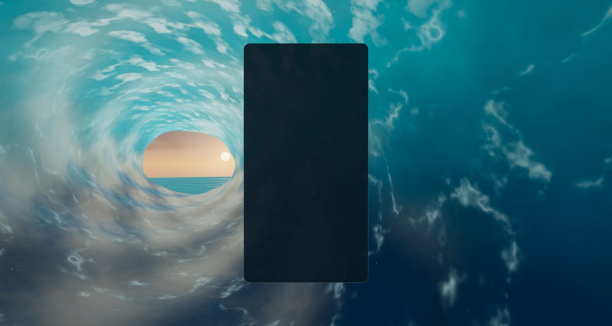 | 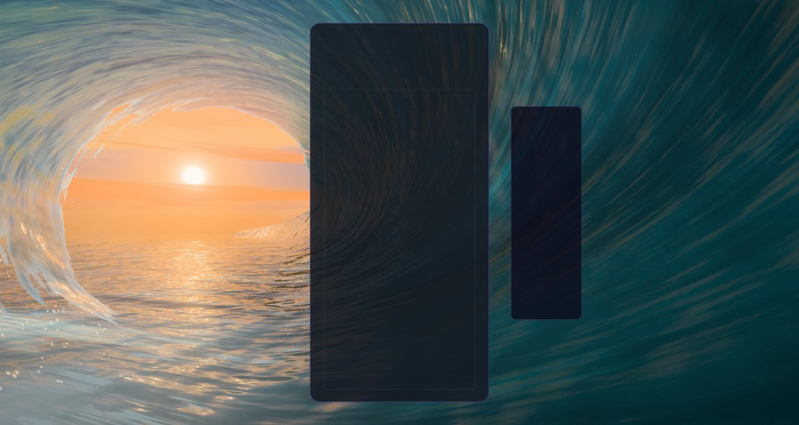 |

## What the player sees

The rider's eye is inside the tube of a wave at the end of the day, looking down the line. On
the right the face of the wave rises: deep green glass, drawn up and over in long streaks, with
the evening mirrored in it. Overhead the roof is thin enough for the sky to burn through. On
the left the lip falls across the view as a tearing curtain, and past its edge the barrel opens
onto the sea: the horizon, bars of cloud lit from beneath, the low sun and its road of light on
the water. Far down the line the unbroken shoulder of the wave runs on, low and glassy. Drops
leave the lip's torn edge all along the throw and hang in the light (the whole scene runs in
slow motion, about a seventh of the real thing); where the sun stands behind them they spark.

The board card hangs in the middle of the tube. The lens is turned a little toward the face, so
the eye of the barrel sits clear of the card on the left and the face fills the right; with no
board on screen the eye comes back toward the middle, and on a tall phone the lens turns to
face the sun and dips, so the eye stands in the margin above the card and the trough runs
under it.

## How the wave answers the game

| The board | The wave |
| --- | --- |
| A piece locks | Its colour enters the roof beside the card and runs the whole arc over the eye of the barrel and down the falling lip, a stroke of light with a hot heart; when it reaches the lip's edge it falls from it as rain of that colour. Under the piece's column (beside the card's foot when the card leaves no water below it) a crown of drops in the same colour is thrown toward the viewer and a train of thin refracting rings spreads over the trough and climbs the walls. The column moves the start of the stroke along the roof and the row moves it down the tube, so no two pieces draw the same arc. |
| Hard drop | The same, struck harder: more drops, a longer stroke, a pulse of light in the water. |
| Lines clear | The lip throws a sheet of spray off its whole falling edge, and one ring of light per line comes down the tube toward the viewer, gold where the water is thin and green where it is deep, caught on every rib of the wall. The water lights from inside for a moment. |
| T-spin | The rings come down the tube as a screw, and a wheel of spray turns off the walls and is flung ahead. |
| Four lines | The wave holds. Its clock runs at a tenth of its speed for two seconds with the biggest throw of all hanging in the eye of the barrel: hundreds of drops, the large ones like beads of glass, each splitting the light a little toward a colour of its own. Then everything runs on. Nothing is simulated to make this happen; see "The clock" below. |
| A chain of clears | The water stays lit from inside, the lip keeps throwing, the evening leans toward gold and the barrel breathes a little wider. Dolphins leave the face of the wave ahead and cross the eye of the barrel: one at three clears, two at five, three at seven, four at nine. From seven the first of them is thrown so that the top of its leap crosses the sun. Each breaks the surface with a crown and a ring, going out and coming back. |
| Perfect clear | The whole pod, and the sky goes to gold. |
| Level up | A set wave runs the length of the tube and the hour turns with it: see "The hours". |
| Game over, a new run | The barrel is back at rest and nothing is in the air; the hour turns back to the one the clock alone gives. |

`backgroundComboEffects` off silences all of it, `pieceLockRipple` off silences the locks, and
reduced motion stops the lens's sway and the four-line hold.

## The hours (added 2026-10-09, after the rebuild was on main)

As first merged the wave stood in one light for ever: golden hour at minute one and at minute
twenty, with a set wave as the only thing a new level did. Olov asked for variation, and for it
not to depend on levelling ("it have to change slowly over time aswell independently of the
level": some modes never level). Now the wave is the same wave all day and the hour turns.

| | | |
| --- | --- | --- |
| 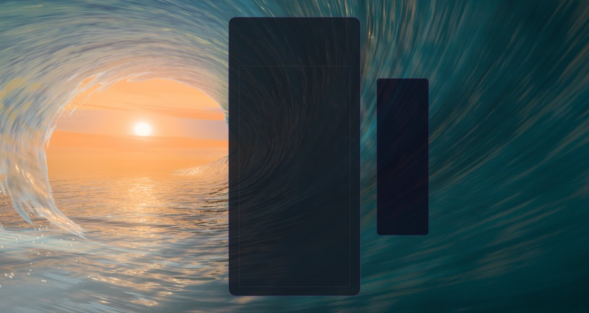 golden hour | 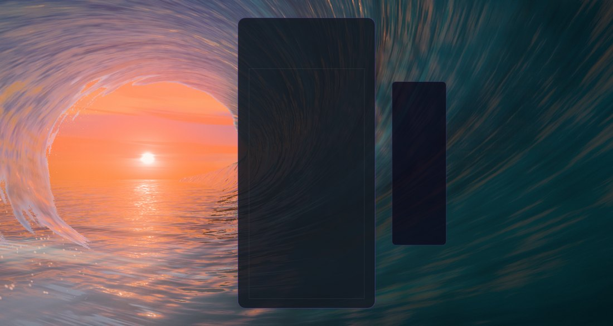 sunset | 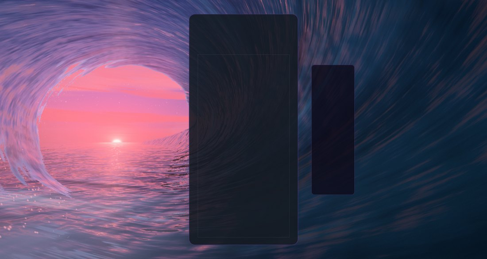 afterglow |
| 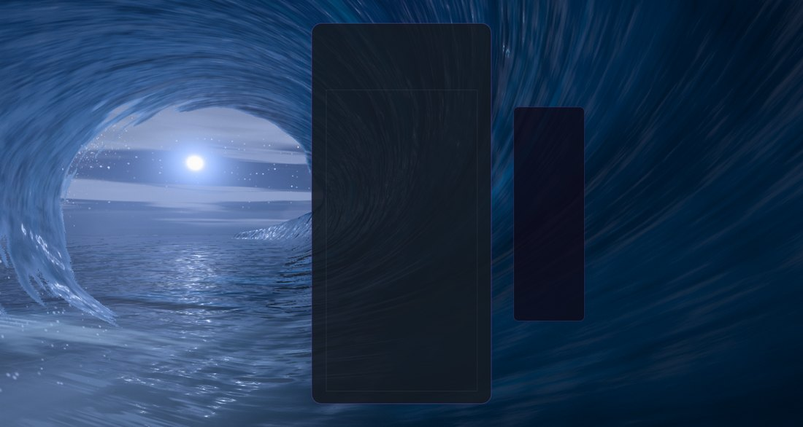 moonrise | 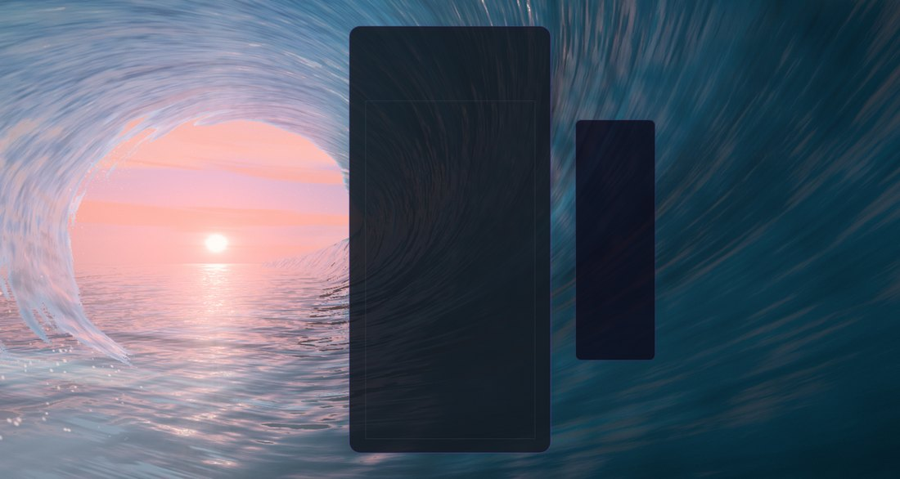 first light | 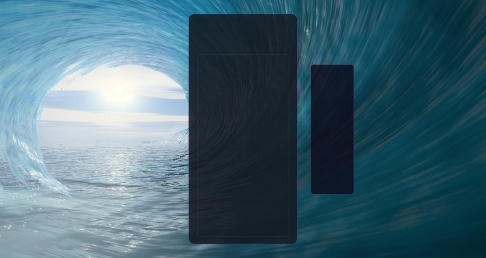 the trade-wind day |

- **Six hours on a wheel**, in the order a day runs, which is also the order of their hues, so
  no two neighbours mix through grey: golden hour (the picture the theme was built to, unchanged),
  sunset (the sun a red coal low on the sea, the water jade), afterglow (the sun going under, a
  rose band on the horizon, the water turning violet), moonrise (a full moon where the sun stood,
  its road on the sea, the stars out, the water sapphire), first light (a pale sun through rose
  and lavender, aquamarine water) and the trade-wind day (a white sun, blue sky, turquoise water
  with the light right through it), then golden hour again.
- **One number says where the light stands**: `place = (level − 1) + clock / 100 s`. A new level
  turns it one whole hour, eased over the 3.4 seconds its set wave takes to run through the tube.
  The clock turns it by itself, one hour in a hundred seconds, in every mode. The two add. Within
  an hour the light rests on that hour's own colours for the first and the last 15 % and crosses
  to the next in between, so the six looks are really seen.
- **The clock sends set waves too**: half-way through every hour, as the light is crossing
  fastest, a smaller set wave runs the tube and the lip throws. A board that never levels gets
  one every hundred seconds.
- **The sun moves with the hour**: 8.5° up at golden hour, 4.2° at sunset, just under the
  horizon at afterglow, 10.5° as the moon, 2.6° at first light, 12.5° by day. The shafts, the
  road on the sea and the dolphin thrown "across the sun" follow it.
- **Everything is lit by the hour**: the sky function, what the water absorbs and what it
  scatters back, the light inside it, the cloud deck and its bars, sparks on the far sea, drops,
  spindrift, the dolphins' wet skin, the colour of the lens's shafts and its exposure. Piece
  colours are not touched: a locked piece still stains the wave with its own colour, and that
  reads at every hour.
- **A new run** turns back to the hour the clock alone gives, the short way round the wheel,
  eased like a level's turn. The clock itself runs on from game to game, so a second game
  starts in a different light from the first.

How it is done: `waves-hours.js` holds the table (23 colours and three numbers an hour) and the
wheel's arithmetic, three-free. The world blends two neighbouring hours on the CPU each frame
and writes the result into one uniform array of 23 rows (`createLight` in `waves-tsl.js` hands
the rows round as nodes); the sky and tube-environment functions stay laid-out and pure, with
the hour's colours passed in as parameters. Sky and water are written out per hour; the many
golden-hour constants elsewhere in the shaders are kept as written and multiplied by four
tints (`sunTint`, `fireTint`, `skyTint`, `waterTint`) that are all 1 at golden hour, so that
hour renders exactly as before. The level's turn is a closed form of the clock (from, to, the
moment it began), never an eased colour, so a seek and a replay still reproduce any frame and
the turn is the same at any frame rate. The pace (100 s an hour, 15 % rest) is my pick.

Playground: `hour=<place>` holds the light anywhere on the wheel (`hour=3` moonrise, `hour=2.5`
half-way from afterglow to it); without it `level=<n>` and `t=<s>` give the hour the game would
have. `sunAz`/`sunEl` hold the sun, and the hours then leave it alone.

## How it is built

Nothing is loaded and nothing is simulated on the GPU. The wave is a function; the theme ships
no models and no textures (a 512 x 512 noise field is baked on the CPU when it builds). Blender
was offered for this pass and not used: the only modelled thing is the dolphin, which is a loft
and five fins generated in a few dozen lines; the live Blender session on this machine was not
touched.

### Runtime modules (`src/themes/waves/`)

| Module | Owns |
| --- | --- |
| `waves-theme.js` | Lifecycle, renderer and its WebGL2 fallback, gameplay subscriptions, layout watch, settings, capture flags. The same adapter as the other rebuilt themes. |
| `waves-director.js` | The game's events → `lock`, `clear`, chain, level (pure). |
| `waves-world.js` | Composition root and choreography: the clock, the event tables, where on the water each event lands, what each event does. |
| `waves-core.js` | The wave as plain functions (the section, the lip's angle along the line, the shoulder), the flow, a ray cast against the tube, the noise bake. Three-free. |
| `waves-hours.js` | The six hours (every colour of the sky and the water, the sun's height, the stars, the lens) and the wheel they stand on: where a level and the clock put the light, how two neighbours mix, the clock's own set waves. Three-free. |
| `waves-composition.js` | The camera rig per aspect; the live board, card and stats-bar rectangles. |
| `waves-tsl.js` | The same shape on the GPU, the sky as a function of direction, and the tube's optics: a closed-form ray inside the tube and what it sees. |
| `waves-water.js` | The one sheet of water (sea, trough, face, roof, lip): ripples, rings, the mirror, light through the water, ribbons, bands of light, foam, the torn edge. |
| `waves-sky.js` | The dome: sun, cloud deck, bars of cloud over the horizon, the far sea and its sparks. |
| `waves-spray.js` | The lip's standing rain, the pool of thrown drops, spindrift. |
| `waves-life.js` | The dolphin and the pod's leaps. |
| `waves-post.js` | Bloom, the sun's shafts, a hue-preserving filmic curve, grade, calm zones behind the card, FXAA. |
| `waves-quality.js` | One table for everything a tier scales. |

### Techniques (three 0.186.1)

- **One sheet, folded in the vertex stage.** A flat grid (rows across the wave, columns down the
  line) is folded into the wave by `createWaveShape`: rows below zero are the sea and the
  trough, rows above it sweep an arc of an ellipse as far round as the lip has fallen *at that
  distance*. The lip's angle falls from "touching the trough" near the viewer to "just
  feathering" at the crest ahead, so the tube is an eye-shaped opening by construction; beyond
  the crest the section relaxes into the hump of an unbroken swell and loses height. Opening
  the barrel, a set wave and the slow swell of the glass are uniforms; nothing is rebuilt.
  `waves-core.js` holds the same functions on the CPU, for aiming and for tests.
- **Water as glass.** The fragment stage does not paint a wall. It has the surface's slope
  (three scales of one noise field's baked derivative, carried along the flow and drawn out
  along it into the ribs a tube has, plus the rings of every recent lock) and from it:
  - *the mirror*: a Fresnel reflection traced **once, in closed form, inside the tube**
    (`tubeTrace`: a ray against an elliptic pipe and the trough, then "is there lip at that
    angle and distance?"). The face mirrors the eye of the barrel and the burning lip; the
    trough mirrors the roof; the low sun lands on the wall as sparks. The wall itself swells,
    bowls and relaxes into the shoulder, so a point of it can lie outside the pipe the trace
    knows; the ray's start is drawn in toward the pipe's middle first (without that, patches of
    the wall mirrored "the sea in front of the curtain" and showed as hard-edged dark shapes).
  - *through the water*: where there is sky behind the surface (roof and lip) the fragment sees
    the sky function along its bent view ray, dimmed and turned emerald by the metres of water
    the light crossed (`exp(-absorption * thickness)`, thickness growing from the lip's edge);
    where there is wave behind it (the face) it sees the water's own scattered green, brighter
    looking toward the sun.
  - *bars of light*: what the moving roof lets through lands on the face in long soft bars,
    drawn out along the flow like everything else on the wall.
- **The sky is a function.** `wavesSky(direction)` is used by the dome, by every reflection and
  by everything seen through the water, so the three always agree. Below the horizon it returns
  the far sea.
- **The torn edge.** The lip's edge is cut by a noise drawn out along the flow, and its last
  centimetres are dithered away grain by grain: spray, not a line. The standing rain leaves
  from inside that edge.
- **Ribbons, rings and bands are rows in three small tables.** Each row is stamped with the
  moment it began; the water's shader loops over the live rows (kept compacted at the front,
  with a count) and evaluates where each is *now*. A ribbon is a comet in surface coordinates
  that runs round the tube faster than the water; a ring is a short wave train whose slope is
  added to the surface's, so it bends the mirror and the sky like a real ripple; a band is a
  ring round the tube coming toward the viewer (with a twist: a screw).
- **Drops fly in closed form.** A drop is written once, when it leaves (place, velocity,
  time), and the vertex stage flies it from there under the wave's slow gravity. Nothing is
  stepped per frame, on either backend.
- **The clock.** The world has its own clock, and every moving thing reads it: the flow, each
  drop's flight, each ribbon. Four lines slow that clock to a tenth for two seconds. Because
  drops are closed form, the hold costs nothing and every drop hangs exactly where its flight
  had brought it. The throw that fills the hold is written partly "already in flight" (birth
  times in the past), so the sheet of spray is in the air the moment the lines clear.
- **Dolphins are instances with a pose.** One lofted body with a dorsal fin, pectoral fins and
  flukes, drawn once for the whole pod; each animal is twelve numbers (place, heading, arch,
  beat) the CPU writes from a ballistic arc. A long chain's first leap is solved so that its
  top lies on the line from the eye to the sun.
- **Shafts in two short marches.** The post stack walks each pixel toward the sun's place on
  screen and gathers what glows near it, on a half-size target, then walks that result over one
  step to fill the gaps: the smoothness of a long march with no jitter. Dark water between a
  pixel and the sun cuts its beam, so the lip's torn edge rules the light into rays.
- **Hue-preserving everything.** The filmic curve, the bloom's knee and the shafts' clamp all
  work on the brightest channel, so emerald stays emerald and the low sun stays orange; only
  the disc and its sparks roll to white.

### Quality tiers

| Tier | Mesh (arc rows, near step) | Noise | Mirror | Light bars | Rings / ribbons | Rain / thrown drops | Dolphins | Bloom, shafts, FXAA |
| --- | --- | --- | --- | --- | --- | --- | --- | --- |
| Minimal | 56, 0.42 m | 128 | sky lookup | no | 4 / 5 | 420 / 420 | 3 | none |
| Low | 72, 0.34 m | 256 | sky lookup | no | 5 / 6 | 700 / 700 | 4 | none |
| Medium | 96, 0.26 m | 256 | traced | yes | 6 / 8 | 1,300 / 1,300 | 5 | bloom, 14-step shafts at a third, FXAA |
| High | 128, 0.20 m | 512 | traced | yes | 8 / 10 | 2,200 / 2,400 | 6 | bloom, 20-step shafts at half, FXAA |
| Ultra | 160, 0.16 m | 512 | traced | yes | 8 / 12 | 3,200 / 3,000 | 7 | bloom, 24-step shafts, FXAA |
| Extreme | 192, 0.13 m | 512 | traced | yes | 8 / 12 | 4,200 / 3,600 | 7 | bloom, 28-step shafts, FXAA |

Every tier keeps the whole picture and every event. The pixel-ratio caps are the other rebuilt
themes' (0.75 at Minimal to 1.6 at Extreme).

### The icon

The theme icon is a frame of the new scene in the house style (a 512 px full-bleed circle on a
transparent ground): the eye of the barrel with the sun in it and the wave wrapped round it,
drawn by the theme's own renderer through the playground's icon lens
(`playground.html?effect=waves&orbit=0&hud=0&t=20&quality=Ultra&icon=1&iconFov=70&iconYaw=0.3&iconPitch=0.05`),
captured square and baked with a strong lift in saturation and contrast: ungraded, the frame
read pale beside its neighbours at picker size. Shown at picker size beside two other
candidates, the previous icon and four neighbours:

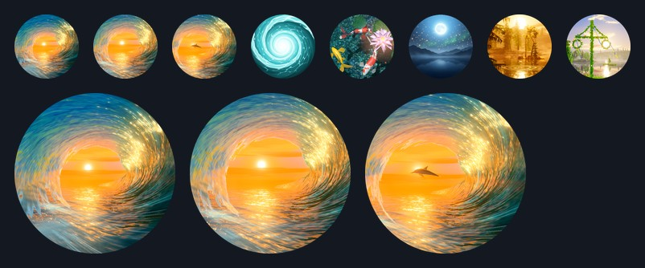

The choice (the first one) is the author's; it has not been reviewed by the project owner.
Both copies (`src/themes/waves/waves-theme-icon.png` and the byte-identical
`public/assets/themes/waves-theme-icon.png`) were replaced.

## Verification

- **Playground** (`?effect=waves&orbit=0&hud=0`): every playground frame in this record, each
  with a clean console (no WebGPU validation errors, no TSL warnings), on native WebGPU and with
  `forceWebGL=1`, at High, Medium, Low and Minimal, at 1600 x 852 and 430 x 850. Captures went
  through Electron under the machine's shared GPU lock rather than the browser MCP; the look
  was first iterated on the CPU renderer (SwiftShader, the WebGL2 backend of the same code),
  which needs no lock. Events are reproducible with
  `&t=20&board=1&event=lock|drop|clear|quad|tspin|perfect|levelUp`, `&eventAge=<s>`,
  `&lines=<n>`, `&u=0..1&row=0..19`, `&color=<hex>`, `&combo=<n>`, `&locks=<n>`,
  `&leap=<n>&leapAge=<s>&hero=1`; `&quality=<tier>` picks a tier.

  | A lock | A hard drop | Three lines |
  | --- | --- | --- |
  | 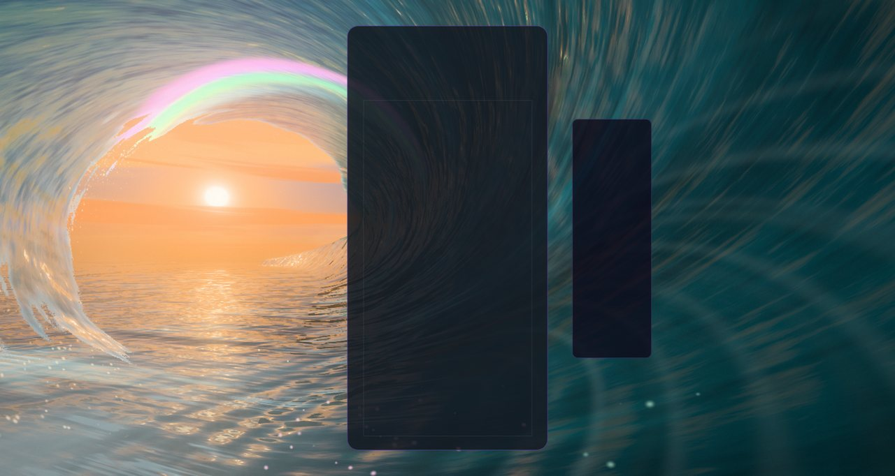 | 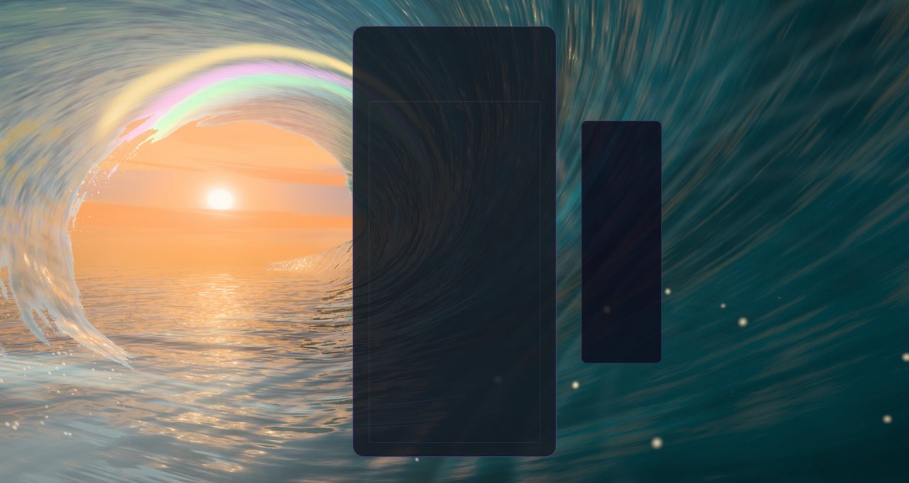 | 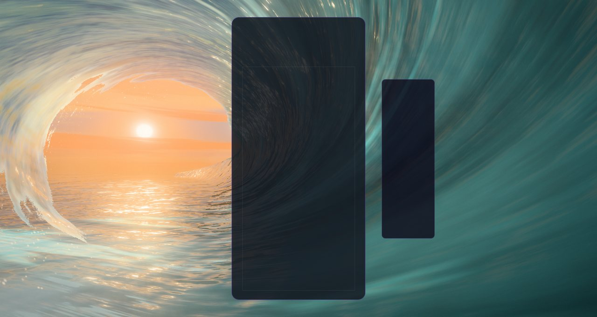 |

  | Four lines, held | Four lines, released | A chain of seven |
  | --- | --- | --- |
  | 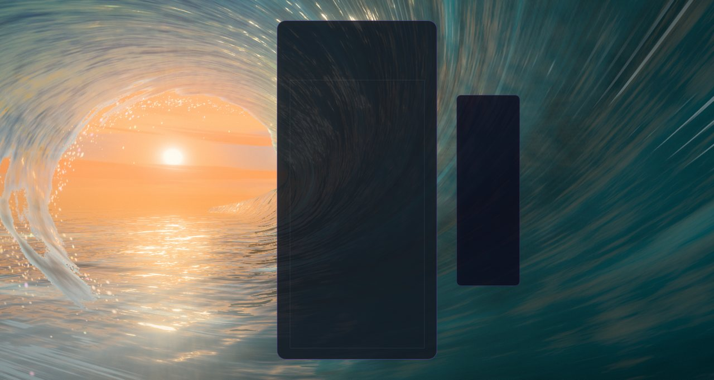 | 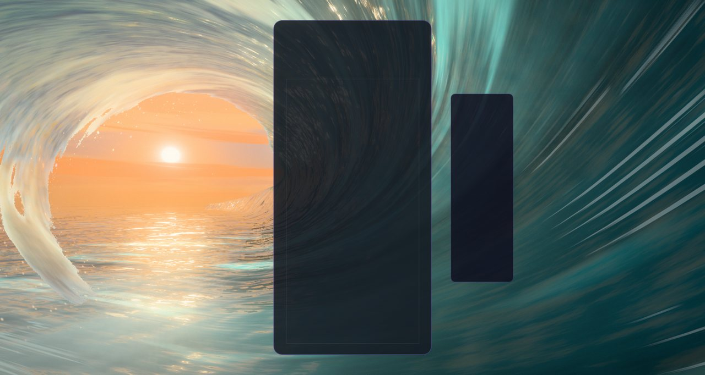 | 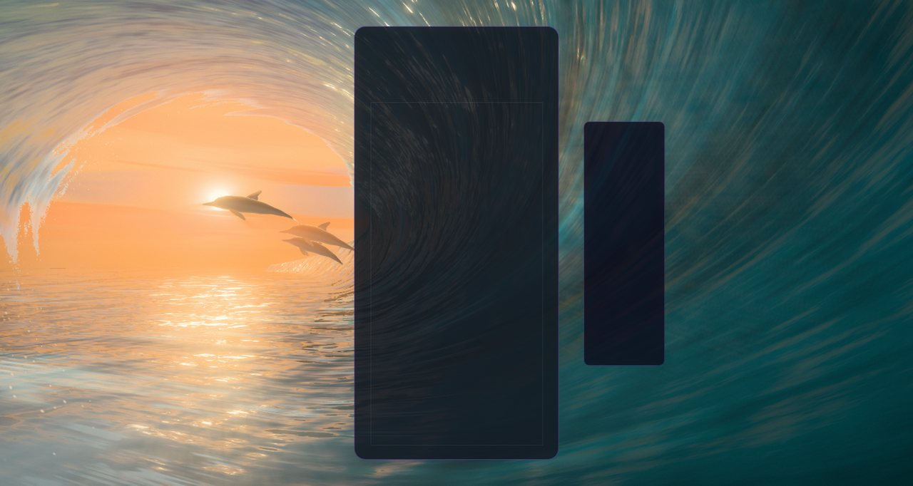 |

  | Perfect clear | No board (menus) | WebGL2 backend, High |
  | --- | --- | --- |
  | 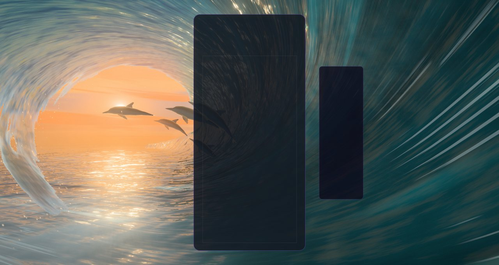 | 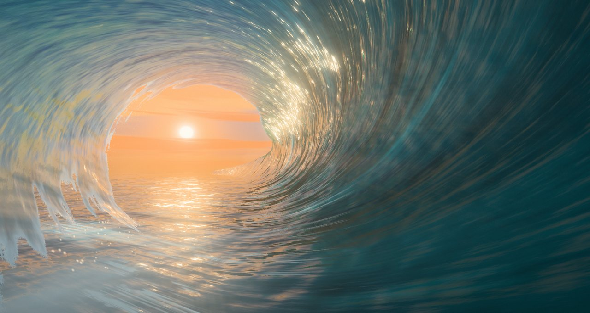 | 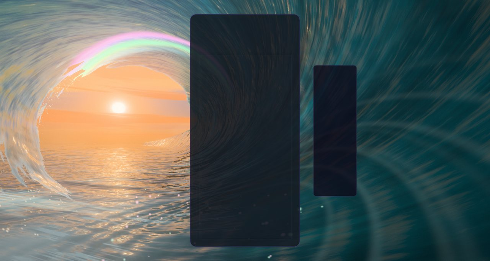 |

  | Low | Minimal | Tall screen, Low, WebGL2 |
  | --- | --- | --- |
  | 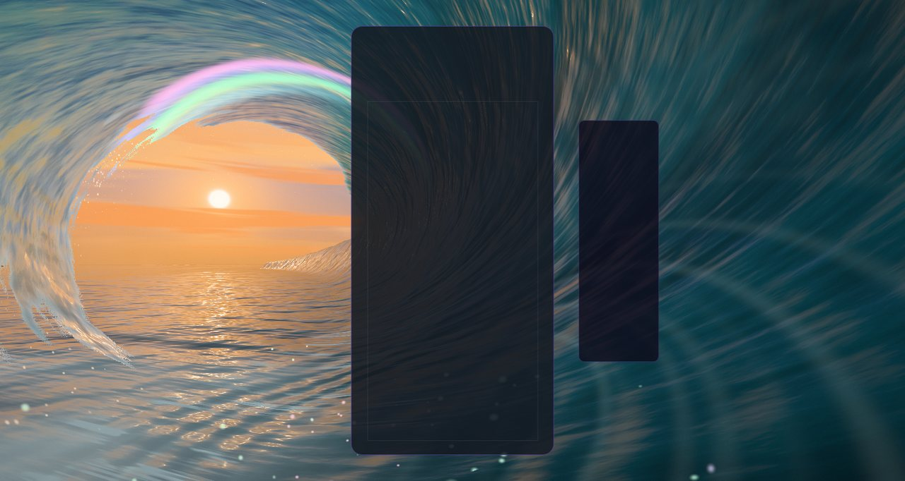 | 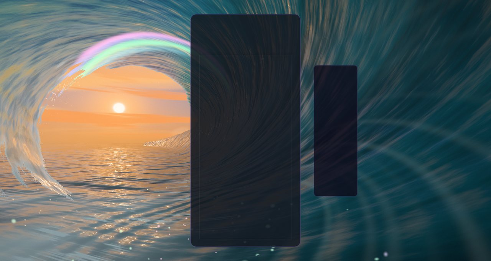 | 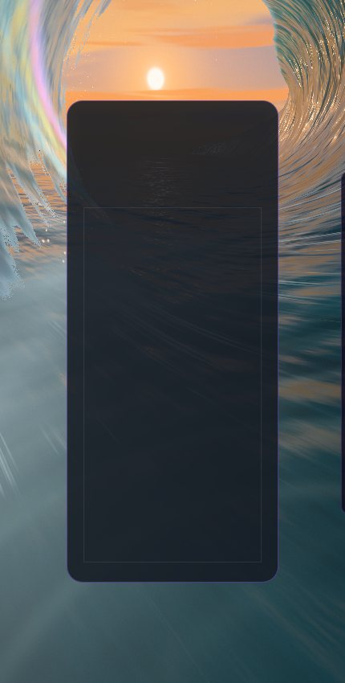 |

  Most of these frames were taken before the last round of fixes that the tests prompted (see
  Tests); those fixes do not change the picture. The lock, hard-drop, WebGL2, Low, Minimal and
  tall-screen frames were retaken after them: in the playground `locks=<n>` now plays its
  warm-up locks just before the event instead of six seconds earlier, so their strokes and
  rings are in the frame as well.
- **In the game, in play**: a scratch Electron harness booted the real game on the worktree's
  dev server, pinned the theme, started a single-player session and sent a hard drop, a
  two-line clear, four single clears in a row and a four-line clear through the game's own
  event bus, then a game over. The console carried nothing from the theme (0 warnings, 0
  errors) in two runs out of two. Live changes of quality (High to Medium to Low to High)
  rebuilt the scene each time and kept it running on one canvas; switching to another theme
  left no canvas behind. The same harness on the CPU renderer ran the game on the WebGL2
  backend without an error.

  | At rest | A lock (two strokes over the roof, a crown beside the card) | A chain | Four lines |
  | --- | --- | --- | --- |
  | 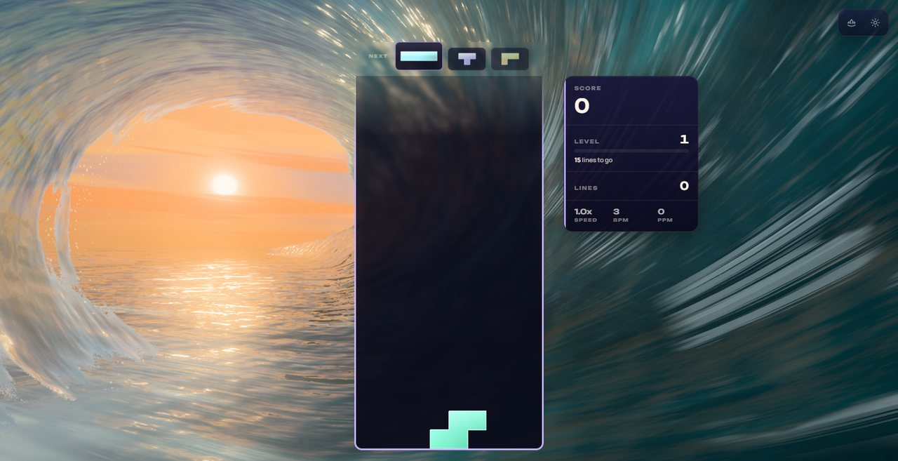 | 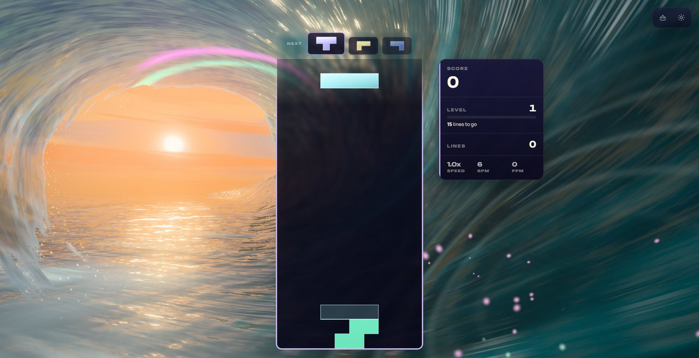 | 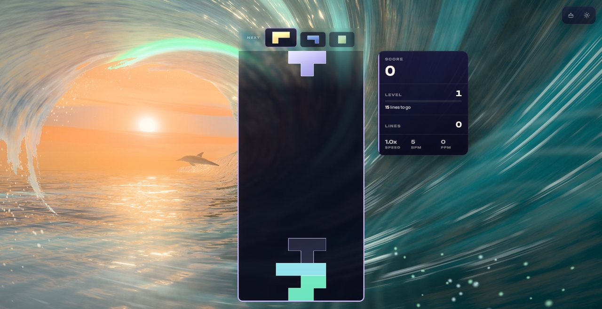 | 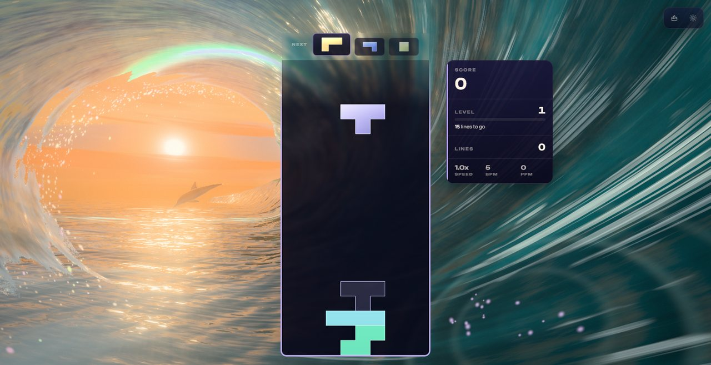 |

- **In the game, lifecycle**: `node scripts/validate-all-themes.mjs --theme waves` against the worktree's
  dev server, as the script stands on `main` (no local patch): PASS, 107 checks, 0 lifecycle
  failures, 0 console errors, 0 process failures, in one run. It boots the real application in
  a fresh profile, reaches the theme through the theme collection, switches to it and away
  from it and watches each owner let go. Its capture is the new
  `docs/theme-screenshots/waves.png`.
- **Phone emulation**: `scripts/validate-mobile-webgl2.mjs --theme=waves` (software WebGL2 in
  Playwright's Chromium at 390 x 844 and 844 x 390, device pixel ratio 3; Playwright borrowed
  from another checkout, since this repository does not install it) passes at Low and at
  Minimal, with a known-good theme run beside it as a control. Its verdict was "pass" the first
  time too, but its screenshots showed black blocks where the sun's sparks belonged: on those
  two tiers the mirror looked the sky up along a direction a hair longer than unit, and the
  sun's disc overflowed to infinity (the RTX had drawn the same pixels as saturated white).
  The sky now clamps its sun term and the direction is normalised; the check was run again and
  its pictures are clean, and the Low, Minimal and tall-screen frames above were retaken on
  the GPU afterwards. The script's tables were updated: Waves moved from the themes with a
  legacy `qualityPreset` to the node scenes that must not fall back to a classic twin. This is
  emulation, not a phone.
- **Build and gates** (on `main` c3ebe2f5 plus this change; `main` then moved, and the merge
  candidate on 49b837e6, which adds the Winter rebuild, had to pass the same gates and the full
  suite again before it could be pushed): `npm run build` (boot closure OK;
  the theme chunk is 73 kB before gzip, 27 kB after), `typecheck`, the TypeScript ratchet,
  `lint:ci` (709 errors against a baseline of 807: the count shrank, and the baseline was left
  alone), the architecture fitness check, `audit:theme-lifecycle`, `check:boundaries`,
  `perf:budgets:gate`, `check:release-gates`, `check:ip-strings` and `check:pages-artifact` all
  pass. ESLint reports 0 problems in `src/themes/waves` and the playground effect.
- **Tests**: 245 tests in seven suites under `tests/unit/waves-*.test.js`: the wave's shape
  and the ray cast, the facing of the generated meshes (the folded grid, the dolphin), the
  director, the world's choreography, the pod and the spray, the theme adapter and the
  playground effect. They were written by a second agent from the modules alone, and found
  defects that are fixed here: a point low on the face was filed as trough when a splash asked
  where it was; a new run did not rewind the level, the counters or the cursor of the light
  bands, so a replay did not reproduce a frame's state; a clear with a line count that was not
  a number put NaN into the barrel's opening until the next reset; a ray down the middle of
  the tube answered with a point that was not on the wave; a dolphin whose landing fell inside
  one long frame went back into the water without a splash; the fallback layout was computed
  from the drawing buffer instead of from CSS pixels; and the URL catalogue still listed a
  validation flag the theme no longer reads. The repository's full unit suite on the final
  tree: 749 files, 12,189 tests, of which 12,185 passed and 4 failed in the parallel run. Three of
  the four (`odyssey-cloud-field`, `odyssey-benchmark-chain-policy`,
  `protocol-wire-source-contract`) are time budgets that were missed with the machine busy;
  all three passed when run alone straight afterwards. The fourth, `odyssey-level-briefing`,
  expects "250,000" and gets this machine's Swedish locale's "250 000"; it has nothing to do
  with this change (CI runs in en-US), but it was not re-checked against an untouched `main`
  today. That full run came before the last fix (the sky lookup on the two lowest tiers,
  four lines); after it the static gates, the build with its shipping checks and the 48
  suites this change can touch (751 tests) were run again and all pass.

### The hours (2026-10-09, on `main` 23de62ab plus that change)

- **Playground, native WebGPU on the RTX**, each with a clean console: the six hours at rest
  (the frames in "The hours"), the half-way blends afterglow to moonrise and moonrise to first
  light, a four-line clear by moonlight, dolphins by day, a hard drop at afterglow, a new
  level half-way through its turn, Low at moonrise, Minimal by day, a tall screen at moonrise
  and at sunset with a clear, and the clock's own drift at `t=250` with no level: 17 frames.
  The look was iterated first on the CPU renderer (the WebGL2 backend of the same code): all
  six hours, all six half-way blends and events at five of the hours, 22 frames, clean too.
  `hour=<place>` reproduces any of them.

  | Four lines by moonlight | Dolphins by day |
  | --- | --- |
  | 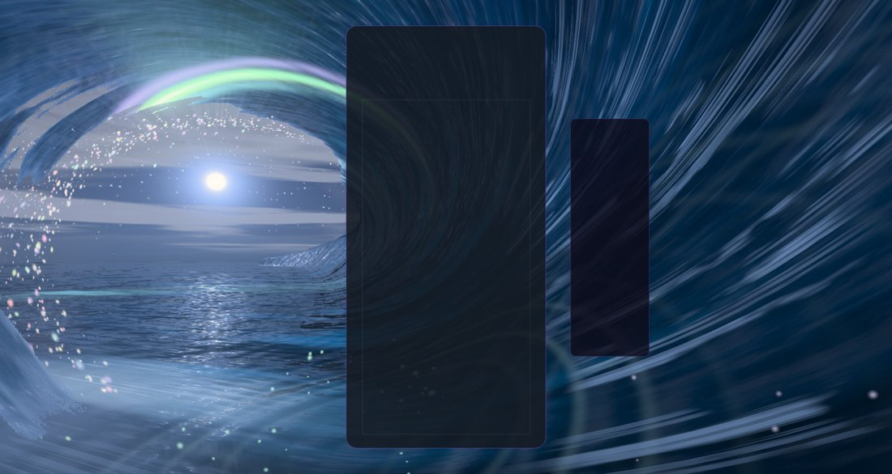 | 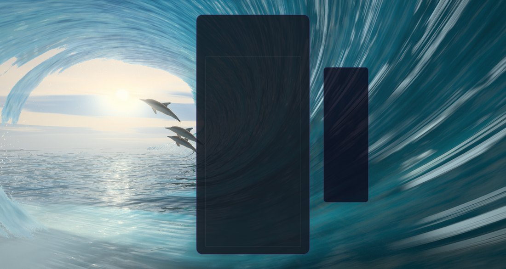 |

- **In the game**: the harness sent three real `LEVEL_UP` events through the game's own event
  bus and read the theme's state after each. Golden hour at the start (place 0.11 on the
  wheel: eleven seconds of clock); half-way through the first turn the place read 0.64 with
  the set wave in the tube and the sun down from 8.5° to 5.2°; then sunset (1.16), afterglow
  (2.21, the sun at −0.2°) and moonrise (3.26, the moon at 10°); a lock and a two-line clear
  by moonlight; and after a game over, golden hour again (0.33: the clock's own place). No
  warning and no error from the theme. Because the events were sent directly, the game's own
  level counter stayed at 1 in these frames.

  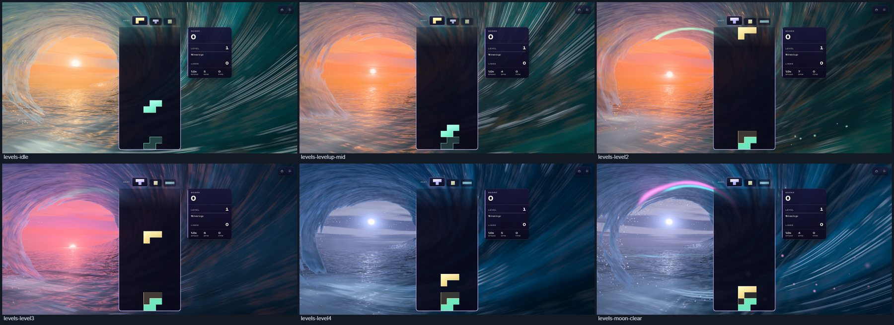

- **Phone emulation**: `scripts/validate-mobile-webgl2.mjs --theme=waves` passes at Low and at
  Minimal, and its pictures were looked at this time (clean). It draws golden hour only; the
  other hours differ in uniforms, not in shader code.
- **Tests**: a new suite, `tests/unit/waves-hours.test.js` (30 tests): the table, the wheel's
  arithmetic, that no two neighbours mix through grey, and the world: the clock alone turns
  it through every hour, a level turns it one hour over the set wave's passage and the same
  way at any frame rate, level and clock add, a new run turns back the short way, a held hour
  and a held sun stay held, the stars, what the lens is told, and the clock's own set wave.
  Three older tests were brought in line (the pod's hand-made uniforms now carry the hour's
  light, the post state has two more fields, and a test that ran the world for forty seconds
  met the clock's set wave at the fiftieth).
- **Build and gates**, on the working tree: `typecheck`, the TypeScript ratchet, `lint:ci`,
  the architecture fitness check, `audit:theme-lifecycle`, `check:boundaries`,
  `perf:budgets:gate`, `check:release-gates`, `npm run build` (boot closure OK; the theme
  chunk is now 80 kB before gzip, 30 kB after), `check:ip-strings` and `check:pages-artifact`
  all pass. The full unit suite: 780 files, 13,567 tests, one failure, the Swedish-locale
  `odyssey-level-briefing` test described above. After that run three lines changed (the post
  state hands out a copy of the shaft colour, and two descriptions); ESLint, the type check
  and the eight Waves suites with the URL catalogue's were run again on the result.
  `validate-all-themes` was not run again: the adapter and its lifecycle did not change.

### Frame pacing (an observation, not a budget)

The in-game harness counted animation-frame intervals in a visible Electron window with a
1584 x 813 canvas, High, native WebGPU on the RTX 3070 Laptop GPU, **while a dozen other
sessions were using the machine**. The first run read 130 frames a second (median interval
7.7 ms, 99th percentile 31 ms through the events); the second, which overlapped this change's
own static gates, read 116 (median 7.6 ms). By ADR-0016 none of this may be quoted as a
budget or a comparison. The theme perf lane was not run, and there is no reading at all for
integrated or phone GPUs: the lower tiers are untested on real low-end hardware. How long the
first activation takes to compile its pipelines was not measured either.

## Known limits

- Nobody has watched it move. Every check above is a still, a console or a number; the flow,
  the pace of a stroke over the roof, the four-line hold and the dolphins' leaps were tuned
  from frames taken at chosen moments, not from play. The hold in particular (the background
  runs at a tenth of its speed for two seconds) is a strong gesture and wants a human eye.
- The wave is a tube with an eye, not a simulation: nothing breaks or closes out, and its
  shape does not change with the level (its light does: see "The hours"). A set wave is a
  swell running through fixed geometry.
- The hours are a wheel, not an almanac: the moon rises where the sun went down and turns
  back into the sun at first light, in the same place in the eye of the barrel. Between
  afterglow and moonrise the disc comes up out of the sea changing from rose to silver.
- Nobody has watched the hours turn. Each hour, each half-way blend, a level's turn and the
  clock's drift were judged from stills; whether a hundred seconds an hour is the right pace
  in play is not known, and neither is how a level's turn of the whole light in 3.4 seconds
  feels.
- Moonrise is a bright night (a blue hour with a full moon), chosen so the wave still reads
  behind the board. The stars are a hashed lattice of points, enough for the small piece of
  sky the barrel shows.
- Reflections are one bounce against an ideal pipe. The far shoulder, which is not a pipe, is
  mirrored as if it were; a dolphin, a drop or a stroke of colour is never mirrored.
- On screens whose card reaches from top to bottom (most laptops) a locked piece's stroke
  starts beside the card's upper left corner whatever its column; the column only shifts the
  start by a few per cent of the width. The crown falls beside the card's foot, on the side
  the column is nearer.
- A tall screen sees the eye of the barrel as a band above the card and the trough under it;
  the face and the roof are mostly out of frame. It was checked at 430 x 850 in the playground
  with a mock card, not on a phone and not with the game's own phone layout.
- With several boards on screen every board's events aim past its own card; that path is
  unit-tested only.
- Low and Minimal mirror the sky by direction instead of tracing the tube, and have no bloom,
  no shafts and no bars of light on the face.
- The dolphin is a lofted body with five fins, built for the distance it is seen from: no
  eye, no mouth line, no blowhole.
- The lint and fitness ratchets report counts below their baselines; the baselines were not
  updated here.
