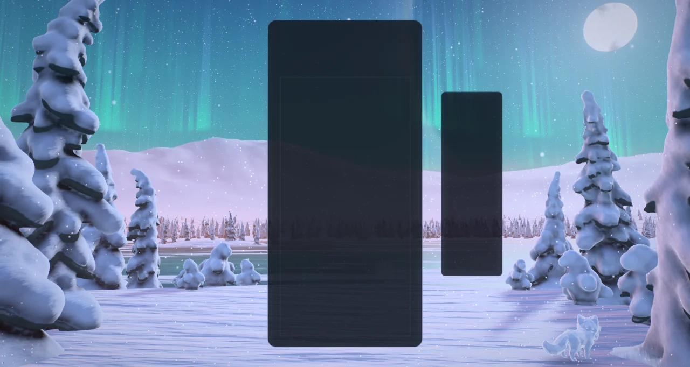
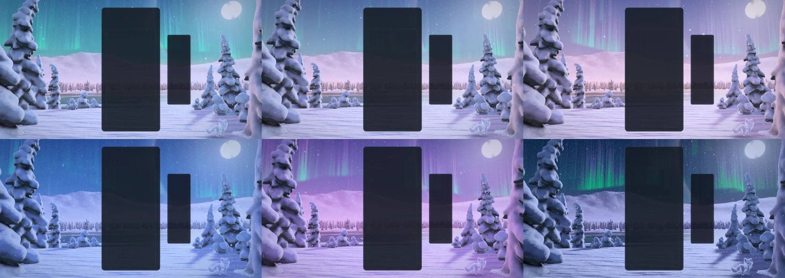
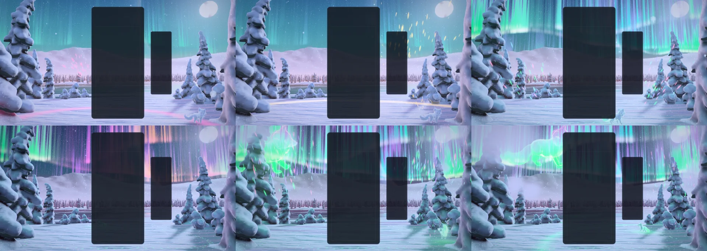
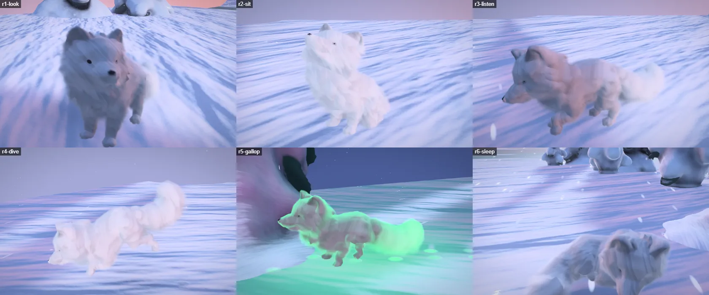
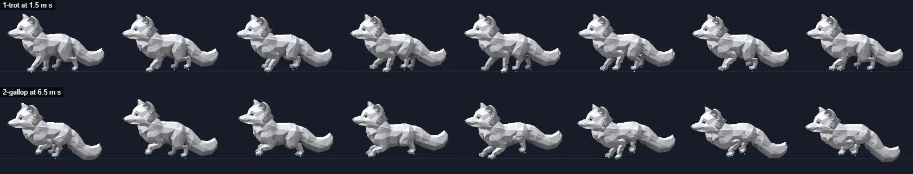
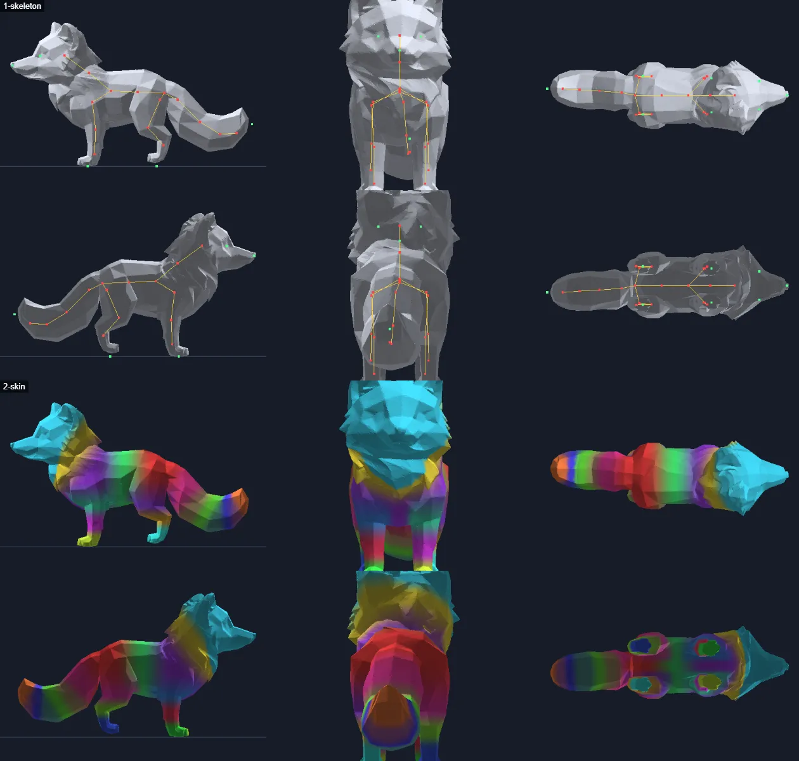
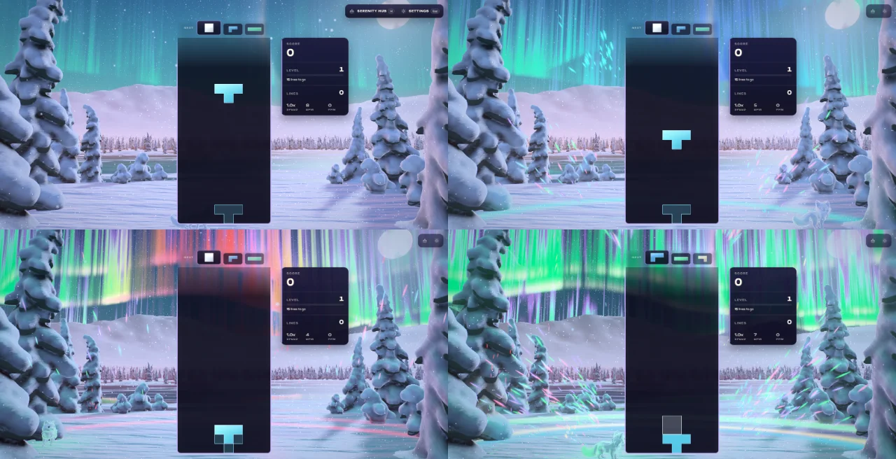
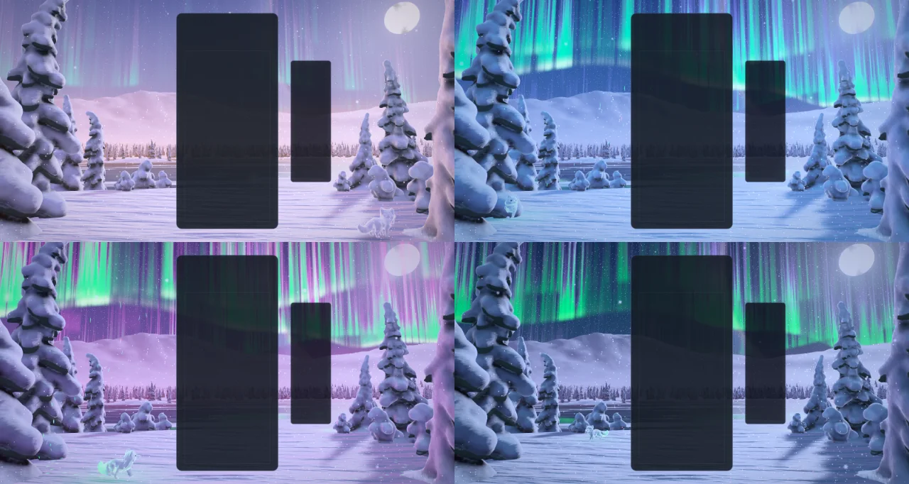
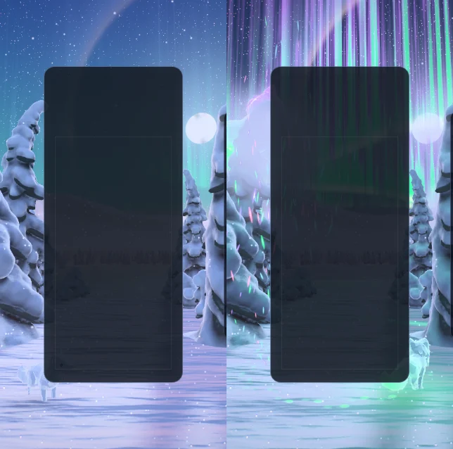
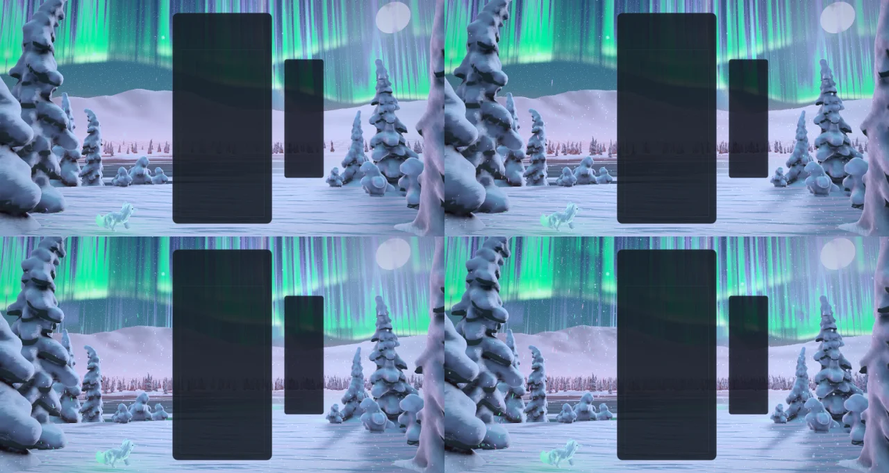

# Winter — fox fires

Implemented 2026-10-09 on `feature/winter-masterpiece`, with Three.js 0.186.1. A from-scratch
rebuild: it replaces the earlier theme in full (the Winter Wonderland playground scene and the
legacy WebGL scene behind `winterLegacy`, their materials and GLSL, the storm director, the
snow simulation, the GPU paw trail, the post pipeline and the TRELLIS conifers). Winter keeps
its identity — a pastel polar twilight, the great moon with its halo, falling snow, an aurora,
wind, and the arctic fox that leaves its tracks across the snow — and everything else is new.
This document records the shipped design and what was verified. It is a reference, not a
backlog. The earlier Winter plans (`WINTER_*_PLAN.md`, `WINTER_AAA_REVIEW_2026-06.md`,
`WINTER_SNOWFLOW_MASTERPLAN_2026-08.md`) describe code that no longer exists.

## The picture

A snowfield at the edge of a frozen lake, in the long twilight of a polar noon. To either side
stand spruces so loaded with rime and snow that each has become a lumpy white figure, dark only
under its boughs: the "snow ghosts" of Lapland's fells. On the left the last light lies rose
along the horizon behind a round fell; on the right the moon stands high, far larger than life,
with its ring of ice-light, and its path lies over the wind-swept ice. Beyond the lake is a
dark shore of wood and the fells behind it. Snow falls. A white fox goes its round over the
snowfield, stops to listen, digs, moves on.

The gameplay card covers the middle of the frame, so the picture is built for what stays
visible: the sentinel spruce and the glow on the left, the stand under the moon on the right,
the sky above, the snow and the fox below.

## The one idea

In the north the aurora has a name that means *fox fires*: an arctic fox runs over the fells,
its tail strikes sparks from the snow, and they burn in the sky. Here the board sets the fox
running. A locking piece becomes sparks in its own colour; the sky draws them up and takes
that colour where they arrive; and how brightly the fires burn — the chain — is the theme's
one dial. Everything else follows from it: how fast the fox runs, how many sheets of aurora
are awake, how far the twilight has turned to night under them, what colour lies on the snow.

## Event language

| Event | Response |
| --- | --- |
| Piece lock | The piece leaves the card's edge, at its own height, as a flash and a handful of sparks in its own colour. The sky draws them up, and where they arrive the fires take that colour and **hold** it (it fades over about half a minute), so the sky slowly fills with the colours played. A ring of lifted powder runs over the snow from under the board, firing the snow's sparkle in that colour as it passes; when it reaches the fox, the fox's tail flicks and strikes sparks of the same colour. |
| Hard drop | The same, harder: more sparks thrown faster, a wider ring, more powder, a camera dip. |
| Line clear | The cleared rows leave the card as blades of light at their own heights and as jets of sparks from both edges. A gust crosses the snowfield from under the board, taking the snowfall with it and driving snakes of spindrift over the snow and the ice. The sky is strummed outward from the board, one sweep of light through every sheet. The fox springs forward. From three lines the gust shakes the framing trees and their loads come down as powder. |
| Combo | The chain is how brightly the fires burn. The fox runs, faster the longer the chain, its coat and tail alight, its prints glowing behind it and a stream of sparks rising from its tail; sheet after sheet of aurora wakes, its rays quicken and its foot turns rose; the twilight deepens to night under it and the stars come out; the snow, the trees and the ice take the fires' colour; diamond dust fills the air and the moon's ring sharpens. When the chain breaks the fires sink and the fox falls back to a trot. |
| Four lines / perfect clear | The night holds its breath: every light sinks for a fifth of a second. Then the fox pounces, a great ring of powder bursts from under the board, the card's shoulders throw fountains of sparks, every framing tree lets its load go — and a fox of light, kilometres long, bounds across the whole sky from the hero fell to the moon, the fires brightening under it as it passes. |
| T-spin | The wind turns on itself: a wheel of sparks spins up round the card. |
| Level up | The hour turns one step on from wherever it stands: five hours, cycled (kaamos, rose noon, blue hour, violet dusk, deep night). The sky is strummed and the fox answers with a shower from its tail. |
| Time alone | The hours also turn by themselves, with nothing played and whatever the level: each rests for about half a minute, then melts into the next over about a minute, and the five come round in eight minutes. |
| Game over | Nothing jumps: the fires sink on their own and the fox curls up in the snow and sleeps. It wakes and stretches when the next run begins. |

Combo here is the true consecutive-clear combo (one `ComboTracker` per player in
`WinterDirector`); the bus's `COMBO` event is cascade depth (ADR-0011). With several boards on
screen each lock leaves its own board, and the fires follow the longest chain any board holds.

The hours are the sky's whole palette (zenith, the pale band, the last light, the haze, the
moon's light, the shadows, the aurora's foot and crown, how many stars show), each with a calm
end and a lit one that the chain mixes between. The clock turns them by itself: an hour rests
for the first 29 s of its 96 s, then eases into the next (`HOUR_PERIOD`, `HOUR_REST` and
`hourDrift` in `winter-core.js`). A level is one step on top of wherever the clock has brought
the sky, so a level-up always shows a new hour, and turning to a new run's first level goes the
short way round the day. The clock's share is a function of the time and nothing else, so a
seek and a replay agree at any frame rate; only a level's step and the chain's heat ease in.
Reduced motion does not slow it: a slow change of colour is not motion. No melt passes
through grey (a test checks every colour of every pair half-way).

## How it is built

| File | Role |
| --- | --- |
| `winter-core.js` | Three-free constants and maths shared by everything: the plan of the place (snowfield, lake, spits, far shore, fells as one height function), the rest camera, where the moon and the glow stand for an aspect, where every tree is planted, the fox's round, the five hours, gameplay slots and timings. |
| `winter-ghosts.js` | Reads the baked snow ghosts (`assets/snow-ghosts.bin`); generates turned stand-ins when it cannot. |
| `winter-field.js` | The ground as numbers: the fan of quads the eye looks over, and the trees' moon shadows drawn once on the CPU. |
| `winter-tsl.js` | Hashes, the baked noise texture, the shared uniforms, and the light: the sky function, the aurora, the air, the powder rings, the gusts, the shadow lookup. |
| `winter-sky.js` | The dome: gradient and last light, stars, the moon and its seas, the 22° ring with its dogs, the fires. |
| `winter-ground.js` | Snow, ice and fells in one material: sastrugi, the moon's path, sparkle, rock and wood on the fells, the ice's mirror, snow snakes, the rings, the fox's shadow. |
| `winter-trees.js` | The snow ghosts, instanced by kind and level of detail. |
| `winter-snowfall.js` | The snowfall and the diamond dust. |
| `winter-fx.js` | The fox fires' pool (sparks and powder share it), the row beams, the paw prints. |
| `winter-fox-mind.js` | Three-free: the fox's round as the course of the fox mind the themes share (`src/themes/shared/fox-mind.js`: stops and acts, run, dash, pounce, sleep, and the pose that results). |
| `winter-fox-rig.js` | Three-free: the arctic fox's skeleton and paces, on the fox rig the themes share (`src/themes/shared/fox-rig.js`: acts written as blendable numbers, a gait of footfalls, legs solved to their paws, a back that bends). |
| `winter-fox.js` | The fox's two bodies: the animal on the snow under shells of fur, and the fox of light in the sky. |
| `winter-world.js` | Owns the uniforms, the parts, the camera rig and the choreography. Shared with the playground effect, so what is iterated there ships. |
| `winter-director.js` | Renderer-free: stages bus events per player and resolves one lock and one clear per frame. |
| `winter-composition.js` | Three-free: reads the live card, board and HUD rects and maps board columns and rows onto the screen. |
| `winter-post.js` | One scene pass, bloom, and one output pass. |
| `winter-quality.js` | The six tiers. |
| `winter-theme.js` | Lifecycle, renderer selection, settings, layout watch, GPU-loss recovery, capture flags. |
| `scripts/winter/bake-ghosts.mjs` | Grows the trees, meshes them, bakes their shading attributes, writes the asset and its manifest; can ray-cast previews on the CPU. |

Techniques worth knowing before changing it:

- **One node renderer on both backends.** `WebGPURenderer` on WebGPU, its WebGL2 backend
  otherwise (or `?forceWebGL`). No `ShaderMaterial`, no compute.
- **Nothing is lit by a light.** Every material shades itself (`MeshBasicNodeMaterial`) from
  shared uniforms: the moon's direction and colour, the bearing of the twilight, and the sky
  function (`wSky`) that is at once the sky, the colour of distance and what the ice mirrors.
- **A snow ghost is a pile of pillows, so it is modelled as one.** `bake-ghosts.mjs` grows each
  tree as a smooth union of ellipsoids — a rimed stem, whorls of drooping boughs each under its
  pillow with a clump frozen on its tip, a top bowed over by its load — adds lumps of two
  sizes, and meshes the field with naive surface nets. Each vertex keeps the field's gradient
  as its normal and three things read off the field itself: how open it is to the sky (the
  cavities between pillows are dark), whether it is a bough's underside, and how thin the snow
  is there, which is what lets the moon come through the edges. Five kinds, three meshes each.
- **The moon does not move, so its shadows are drawn once.** `bakeMoonShadows` lays every
  tree's mesh flat along the moon's rays into one mask on the CPU and softens it; the snow
  looks it up by world position. No shadow pass, no second render of the trees, and the same
  picture on both backends. It is redrawn only when an upright screen moves the moon.
- **The aurora is geometry met by a ray, not a painted band.** Each sheet hangs over a line on
  the ground and folds sideways as two sines; the view ray is met with it by a three-step
  fixed-point walk. That gives true perspective for nothing: sheets arch down to the horizon
  at their ends, folds foreshorten and brighten where the ray runs along them, rays converge
  overhead. Height above the sheet's foot picks the colour (green, violet crown, a rose hem on
  an energetic sheet). The same function, without its rays, is what the ice mirrors.
- **What the sky holds is six slots.** A lock writes (bearing, arrival time, strength, colour)
  into a ring of uniforms; the aurora tints itself by bearing and decays each slot in closed
  form. The arrival time is when the sparks get there, so cause is seen before effect.
- **Sparkle is laid out even on screen but fixed to the ground.** The grid is bearing × height
  over distance from the RESTING eye, so a glint is a few pixels at any range and does not
  swim when the camera drifts. Most of it lies in the moon's path; a passing ring fires more.
- **Upright screens keep everything.** The moon, the glow, the framing trees and the fox's
  round are laid out in fractions of the frame's half width (`bearingFor`), so a phone held
  upright shows the same picture drawn closer together; between about 10:9 and 2:1 nothing
  moves at all.
- **The fox has a mind without a body.** `FoxMind` is plain numbers stepped with the world's
  fixed step: sparks, prints and reactions never wait for the model, and a seek replays it.
  The rig (`winter-fox-rig.js`, three-free as well) solves that pose into bone rotations every
  frame; the model holds no clips (see *The fox, rebuilt* below).
- **Closed form first.** Snowfall, dust, sparks, powder, rings, gusts and the strum are
  functions of the world clock and event timestamps. Nothing is created at event time: events
  write numbers into ring-buffered uniform slots and preallocated pools. `seek(t)` plus a
  fixed-step replay reproduces any frame.
- **HDR, single output.** The scene is scene-linear; a max-channel knee selects what blooms (no
  MRT), and one output pass does the calm zones on the card and HUD, bloom, the lens's veil
  round the moon, a hue-preserving filmic curve, grade, vignette, grain and dither. The
  aurora's brightest folds are compressed along their own hue before the tone map, so they
  saturate toward green and violet, never to white. `usesMrtScenePass()` is false.
- **No MaterialX noise.** One tileable texture is baked on the CPU (a value, its gradient, a
  second value) with its own mip chain.

## Tiers

| Tier | Ground fan | Aurora sheets | Ice mirrors the fires | Framing trees | Spit / far trees | Shadow map | Snowfall | Dust | Fox fires | Prints | Sparkle | Bloom | Scene MSAA |
| --- | --- | ---: | --- | --- | ---: | ---: | ---: | ---: | ---: | ---: | --- | --- | --- |
| Minimal | 120 × 96 | 2 | no | second mesh | 26 / 160 | 256² | 700 | none | 260 | 48 | off | off | off |
| Low | 150 × 128 | 2 | no | second mesh | 40 / 280 | 512² | 1,300 | 160 | 420 | 72 | on | off | off |
| Medium | 190 × 160 | 3 | yes | full ghost | 56 / 460 | 768² | 2,200 | 320 | 700 | 96 | on | on | off |
| High | 230 × 200 | 3 | yes | full ghost | 70 / 700 | 1024² | 3,400 | 520 | 1,000 | 128 | on | on | 4× |
| Ultra | 270 × 240 | 4 | yes | full ghost | 84 / 900 | 1024² | 4,800 | 800 | 1,400 | 160 | on | on | 4× |
| Extreme | 320 × 280 | 4 | yes | full ghost | 96 / 1,200 | 1536² | 6,400 | 1,200 | 1,900 | 192 | on | on | 4× |

Every tier keeps the whole picture, the fox, the fox of light and every event. These are
allocation budgets, not measurements of frame rate. The fox's coat is 0 / 6 / 10 / 14 / 18 / 24
shells of fur from Minimal to Extreme (Minimal paints the coat on the skin) and the fox of
light wears 0 / 0 / 3 / 5 / 6 / 8 veils.

## Assets

`assets/snow-ghosts.bin` (2.2 MB) is the baked wood: five kinds of snow-loaded spruce (the
sentinel, the matron, the leaner, the gnome and the twins), four meshes each — the full ghost
for the framing trees close by, one for framing trees further off, one for the stands on the
spits and one of about two hundred triangles for the wood on the far shore. It is generated (no
scan, no third-party model); `node scripts/winter/bake-ghosts.mjs` rewrites it and its manifest
in a couple of seconds, the same bytes every time, and `--dry --preview=<dir>` ray-casts every
kind to one PNG on the CPU, which is how the trees were shaped before any shader existed.

`assets/arctic-fox.glb` (1.2 MB) is the theme's own arctic fox (see `assets/ATTRIBUTION.md`):
the mesh kept from the earlier theme, re-rigged by `node scripts/winter/rig-fox.mjs` onto the
21 bones of `winter-fox-rig.js`, its coat painted into its vertex colours, no clips. It loads
off the frame; nothing waits for it.

Everything else is generated in code. Blender was not needed: what makes a snow ghost is a
smooth union of pillows, and a signed-distance bake in Node gives that union exactly, with the
occlusion, the bough mask and the thinness of the snow read off the same field. Removed with
the earlier theme: the TRELLIS conifers (`spruce.glb`, `pine.glb`, `fir.glb` and their `_lod`
copies; the Odyssey keeps its own copies) and the Poly Haven snow textures under
`public/textures/winter/`.

The piece palette changed with the rebuild. The earlier one was seven near-identical ice blues;
since a locking piece now becomes light of its own colour in the sky, the seven are the fires'
own colours on a ground of ice (aurora green, frost white, ice cyan, rose, violet, moon gold,
glacier blue). The palette gate scores it 0 of 7.

## The fox, rebuilt

Later the same day the request was a fox that looks better and moves better. Looking at why it
did not — on the CPU, bone by bone — showed that the model was the limit:

- its ten baked clips could not be trusted. `CurlSleep` and `Dig` *raised* its head (the
  sleeping fox stood with its nose in the air), no clip moved its body, and its legs swung
  like pendulums, so its paws slid over the snow at every pace;
- its head was modelled turned about 32° to its left, so it ran looking sideways;
- its face was two dark dots: it had no nose;
- its skeleton had one bone for the whole back, and legs weighted by distance alone;
- white on white and lit evenly, it was a pale blur at the distance the game keeps.

So the fox was rebuilt from its mesh up, and nothing of it is a recorded clip any more.

**The model** is rigged by `scripts/winter/rig-fox.mjs` (Node, three seconds, the same bytes
every time): the mesh is centred, its head turned to look straight ahead, its facets rounded a
little; it gets the skeleton of `winter-fox-rig.js` — a back of three bones, neck, head, a tail
of four, legs of three, every bone axis-aligned at rest so that a rotation in the model's frame
*is* a pose — with skin weights laid by region; and its coat is painted into its vertex
colours: how far along the tail a vertex is, how long its fur is, how dark it is (nose, eyes,
the hollows of the ears) and how much of the sky it sees (an occlusion bake against the mesh
and the snow it stands on).

**The body** (`src/themes/shared/fox-rig.js`, three-free; `winter-fox-rig.js` is the arctic
fox's skeleton and paces on it). A pose is a *spec*: some forty numbers — hips
and chest lowered; the back arched, bent or twisted; where the head is turned; the tail's
swing, lift and curl; and for each paw where it is, how far its heel is raised and whether the
snow or the body carries it. Any two specs blend, so nothing snaps. The solver puts the middle
of the back in place and turns hips and chest about it, holds the head level against the
trunk's pitch and roll, and solves each leg to its paw (two bones, an elbow that folds back, a
knee that folds forward): a planted paw stays where it was put while the body moves over it.

- *Its gait* is footfalls, not a loop: diagonal pairs at a trot, opening between about 3.3 and
  5 m/s into a gallop — hind pair, then fore pair, the back arching between them. A paw is on
  the snow for exactly as long as the ground it covers, so at a steady pace nothing slides, and
  the body rides lower the longer the step, because short legs reach by crouching.
- *What it does at a stop* is written the same way: looking about; listening with a forepaw
  raised; the leap and nose-dive of its hunt, digging with its rump in the air, shaking the
  snow off; a bow; sitting down with its tail round its feet to watch the sky; curling up nose
  to tail to sleep.

**The mind** (`src/themes/shared/fox-mind.js`; `winter-fox-mind.js` gives it the round as its
course) decides what it did before and hands on more. When it stops it first steps round on
the spot to face the viewer, a few steps to the turn, and only then does something (a hunt it
begins as it stands: the leap carries it where its nose points); what curls to a side — its
body asleep, its tail when it sits — curls toward the viewer; lying down, sitting and getting
up take longer than other changes; it blinks, and it sleeps with its eyes shut. A change of
mind half-way through a change keeps the pose it was in: put to sleep in the middle of
sitting, woken and at once startled, sent leaping again before it has landed, it goes on from
where it is.

**One engine, two themes.** Rig and mind live in `src/themes/shared/` because Sakura
Twilight's two red foxes run on them as well, with their own skeleton and their own course
(`docs/SAKURA_TWILIGHT_OVERHAUL_2026-10.md`). The Winter files bind them to the arctic fox;
stepped side by side with the version from before the move, the bound mind and rig give the
same fox to sixteen decimal places.

**The coat.** Fur is shells: the skinned mesh drawn again in one instanced call on the same
skeleton, each shell a veil as thick as the share of the hairs that reach it. The grain of the
hairs is the world's noise texture, so at the game's distance its mip levels hand back the
hairs' average instead of their sparkle. The scene is lit from behind, so the fox is shaded as
what it is there: the shadow side of a white animal — a shade warmer than the snow, darker
where its own body shuts out the sky — with the moon in the outline of its coat, and it walks
through the trees' shadows as the snow does. In a chain it is that outline and the tail that
burn, not the whole animal.

**Found by measuring.** Two helpers went over the first version — one writing the tests, one
reviewing — by running mind and rig and measuring the largest turn of any bone in one frame.
That found what stills had not: a fox put to sleep in the middle of an act snapped to another
pose and froze half standing (the line "nothing jumps" at game over was not true); a second
change inside a cross-fade dropped the pose it started from; an elbow flipped sides in the bow
(a pole to aim the joint at flips when the leg points along it); legs fell into the gallop in
one frame when the speed jumped; a toe snapped at lift-off when it stepped on the spot; its
hunt's leap went sideways; it swivelled as it woke; an interrupted leap dropped it in one
frame; two of the fur's shells drew nothing. All of these are fixed and pinned by tests.

**Made without the GPU.** `scripts/fox/preview-fox.mjs` skins the model on the CPU with the
theme's own solver and mind and tiles the frames into a PNG (`--act=Sit`, `--gait=1.5`,
`--mind=hunt`, …), and `rig-fox.mjs --preview=<dir>` draws mesh, skeleton, weights and coat.
Every gait and pose was written against those sheets and then checked on the GPU through a
lens on the fox (`foxCam`, `foxAct`).

Not done: it has no ear or jaw bones; a paw that is planted when the pace changes slides a
little until its next step (the gait is a function of how far it has run, not a memory of where
each paw stands); on a curve its planted paws turn with its body; Minimal has no shells; a
third change of act inside one cross-fade (a fifth of a second round a four-line clear can do
it) still drops the oldest of the poses, up to some forty degrees in a leg for a frame while
the night holds its breath.

## Verification

- Unit tests: 390 tests in twelve files (composition 13, director 25, fox mind 53, fox rig 59,
  plan 24, the hours 12, baked asset 13, ground and shadows 11, effects 16, world 47, theme 77,
  and 40 in `winter-shaders.test.js`, which builds every part's material — both of the fox's bodies
  included, on the real model — through three's WGSL and GLSL node builders at High and Minimal
  with no GPU and fails on a throw, a console warning, an `mx_` noise or a `smoothstep` with
  equal edges). The asset tests pin the baked file to its manifest and check that every mesh is
  wound outward; the world tests replay a seek twice and compare the whole state. All pass.
- Whole suite: once, with 120 s timeouts on a build machine other sessions were loading: 754 files,
  12,207 tests; 753 files passed. The one failure, `odyssey-level-briefing.test.js`, expects
  "250,000" and gets "250 000": it formats a number in the machine's locale (sv-SE here) and
  fails the same way on the untouched main checkout.
- Gates: typecheck; lint ratchet (677 errors against a baseline of 807: the new files add none
  and the removed ones took 130 with them); theme lifecycle audit; dependency boundaries (1,406
  modules; the cross-theme baseline is now empty); TypeScript ratchet; architecture fitness;
  performance budgets; production build with the boot-closure guard; IP-string gate; Pages
  artifact check; release gates — all pass. The palette gate fails on `main` and here for the
  same unrelated reason (Stillwater); Winter scores 0/7 on it.
- Playground captures (RTX 3070 Laptop, WebGPU): rest; lock; hard drop; a two-line clear; a
  chain of six with six colours held in the sky; four lines at 1.2 s, 2.6 s and 6 s; a T-spin;
  a perfect clear; the four other hours; an upright 430 × 852 frame at rest and through four
  lines; Minimal, Low and Extreme; Medium on the forced WebGL2 backend; reduced motion; the
  generated stand-in trees without the fox's body. Twenty-seven frames in the last set, none
  with a console error or warning from the page. For the clock's turn of the hours (added the
  same day): nine more frames along one level's clock, each hour at rest and three melts
  half-way, and one with a level on top, again with a clean console.
- WebGL2 without a GPU: the same world on SwiftShader (the renderer's WebGL2 backend on the
  CPU), Low with a chain and High through four lines, with no error from the page.
- In the real game (Electron, dev server, single player, a fresh profile, `?unlockAll=1`): the
  theme starts on WebGPU with the baked ghosts and the fox's body, takes bus-injected locks, a
  hard drop, clears, a chain of four and four lines, puts the fox to sleep at game over,
  survives a live quality change (High to Medium), and lets go of its canvas when Forest takes
  over. No warning or error from the theme in any of three runs.
- A review by a second agent found eight real defects, all fixed and covered by the tests
  above: the sleeping fox got to its feet every 2.7 s (the `CurlSleep` clip is not a held pose
  and was being looped); the turn added to the tail piled up whenever one pose was drawn twice
  (three's mixer only writes a bone whose value changed); one framing spruce stood four metres
  out on the lake's ice; the flash a lock leaves at the card's edge had no size for its first
  tenth of a second; the world drew its shadows for 16:9 before it knew the frame's shape and
  redrew them on every resize event of an upright window; the fox's shared geometry was never
  disposed and the fox of light retired the live fox's material; the far meshes' normals
  opposed their own faces on about one triangle in twenty; a spark's core could go negative
  under MSAA. An earlier pass by the agent that ported the theme class found that a new run
  reset the fox's mind mid-clip.

Observed, not measured: the in-game runs counted 110 to 129 frames a second over four seconds
at High on the RTX at 1584 × 813, with the frame interval's median at 7.7 ms and its 99th
percentile at 16 to 30 ms while events were firing. That figure is close to the window's cap, so
it says only that this configuration did not fall below it. High draws about 590,000 triangles
(Minimal 233,000, Extreme 824,000).

Not verified: GPU cost per tier through the theme perf lane (ADR-0016); an integrated GPU;
physical phones; local multiplayer and Infinity layouts in a capture (their routing is
unit-tested only); the real game in an upright window; the icon on an Odyssey level orb; long
sessions. `docs/theme-screenshots/winter.png` still shows the previous artwork (a fleet capture
writes it). Comments in a few other modules still name files of the earlier Winter theme as
their lineage (`sky-children-v2`, `void-ember`, the Odyssey forest geometry), and ADR-0015's
third finding still lists the Winter theme as a consumer of the shared mountain language, which
it no longer is (`odyssey-wave46-scope-invariants.test.js` now pins the opposite).

## Reproduce

Run `npm run dev:playground`, then:

`/playground.html?effect=winter&t=20&quality=High&board=1&hud=0`

Add `event=lock|drop|clear|quad|tspin|perfect|levelUp|over` with `eventAge=<s>`, and `combo=<n>`,
`level=<n>` (one hour on per level), `lines=<n>`, `u=<0..1>`, `row=<r>`, `color=<hex>`. The
clock turns the hours too: `t=20` is the first hour at rest, `t=62` half-way into the second,
`t=110`, `206`, `302` and `398` the second to the fifth at rest. `locks=<n>`
plays n locks first, so the sky is holding their colours when the event fires. `power=<0..1>`
holds the fires at a charge whatever the combo. `demo=1` (without `t`) plays a looping script.
`parts=` draws only the named parts (`sky, ground, trees, prints, snow, dust, sparks, beams,
fox, spirit`); `falseColor=1` bands the pre-tone-map peak; `noPost=1` shows the raw scene;
`forceWebGL=1` uses the WebGL2 backend; `reduce=1` is reduced motion; `plan=1` draws the
generated stand-in trees instead of the baked ones; `fox=0` leaves the fox without its body;
`foxCam=<metres>` follows the fox with a close lens (`foxCamYaw=<deg>` round it from its front,
or `viewer`; `foxCamFov=<deg>`) and `foxAct=<acts>` with `foxActAge=<s>` stops it and has it do
something (`Sit`, `LookAround`, `Stretch`, `Greet`, `CurlSleep`…, or `hunt`). In
the game: `?winterTime=`, `?winterFixedDt=`, `?winterParts=`, `?winterFalseColor=1`,
`?winterForceWebGL=1`.

The theme icon is the fox of light itself, through the playground's icon lens in the deepest
hour:

`/playground.html?effect=winter&t=20&quality=Extreme&hud=0&level=5&event=quad&eventAge=3.6&icon=1`

(the lens's defaults are `iconFov=30&iconYaw=0.13&iconPitch=0.27`), captured in an 852 × 852
window (the largest square this laptop's screen allows), cropped to 84% of the frame around
(0.56, 0.47), given a colour lift (saturation 1.2, contrast 1.12, brightness 1.05) and baked as
a 512 px circle on a transparent ground. The same file is kept at
`public/assets/themes/winter-theme-icon.png`.

The fox without a GPU (PNG sheets, from the repository root):

    node scripts/fox/preview-fox.mjs --fox=winter --gait=1.5 --frames=8
    node scripts/fox/preview-fox.mjs --fox=winter --act=Sit --frames=8 --yaw=30
    node scripts/fox/preview-fox.mjs --fox=winter --mind=hunt --at=1 --from=1.2 --to=7.6 --frames=16
    node scripts/winter/rig-fox.mjs --dry --preview=<dir>

## Captured previews

