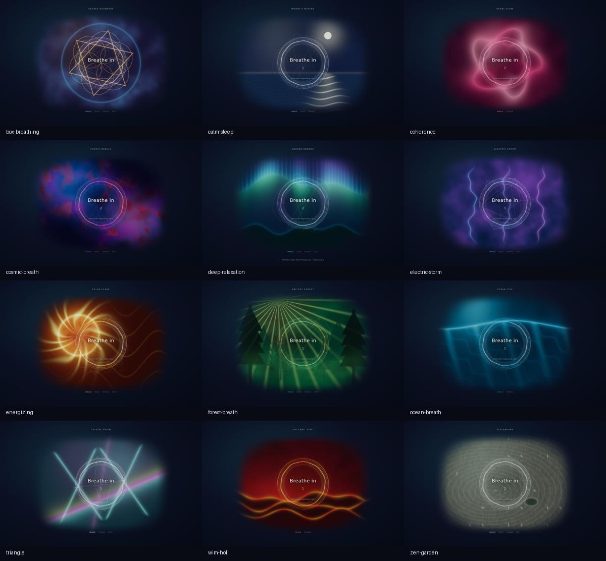
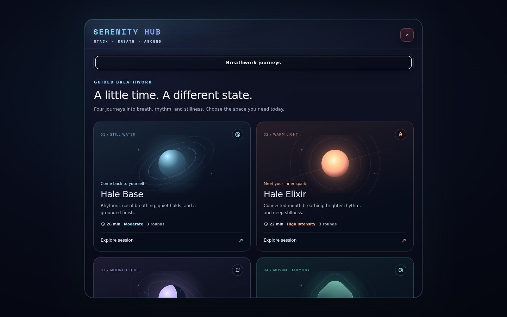
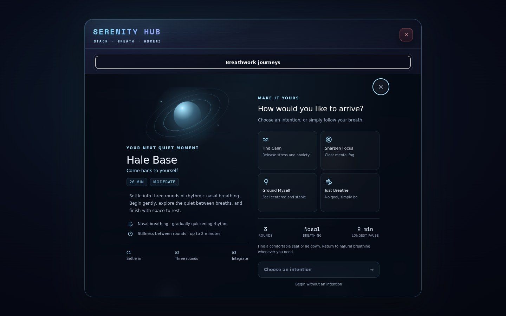
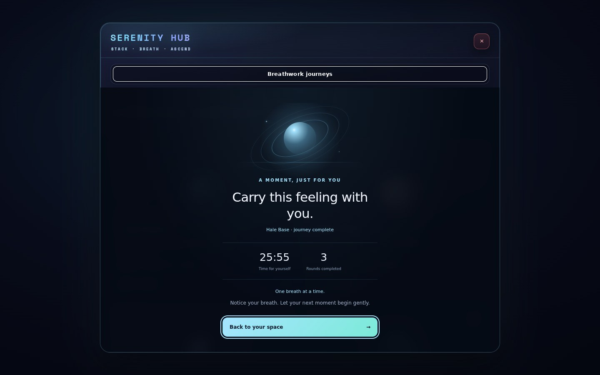

# Breathing worlds and Hale sessions

Twelve procedural breathing worlds and four guided journeys, verified at desktop (1440×900), portrait (390×844) and landscape (844×390) sizes.

The [validation report](validation.json) preserves source fingerprints and separates the 153 artwork/session matrix frames from the 69 final settled UI captures and the real-application smoke flow. The final UI pass checks completion focus and scrolling after layout repairs. The smoke flow exercises the global Hub switch, Serenity entry, visible guide controls, preparation, native countdown/session startup and completion callbacks; it advances to completion rather than replaying a full session in real time.

After all twelve worlds were warmed, 26 technique switches retained 10 geometries, zero textures and four programs. The most complex world uses six draw calls. The capture runner also checks native ResizeObserver delivery, console/shader errors, control accessibility and teardown. These are software Chromium compatibility and bounded-work results, not physical-device FPS measurements.

All 117 targeted tests pass. Type checking, the lint and architecture ratchets, dependency boundaries and production build/boot closure pass. The report's `finalIntegrationRevision` records a second successful application smoke after consolidating the mode's global indicator reads, preserving the earlier capture fingerprints. The [implementation notes](../../docs/BREATHING_IMMERSIVE_OVERHAUL_2026-10.md) include the broader unit-run results and the existing programmatic session-resume limitation.

Additional previews: [Aurora on phone](aurora-phone.jpg), [Hale Base empty hold on phone](hale-base-hold-phone.jpg), and [guided breathing in the real application](game-guided.jpg).

To reproduce, run `scripts/capture-breathing-overhaul.mjs` with an installed Playwright module and Chromium executable supplied through `PLAYWRIGHT_MODULE` and `PLAYWRIGHT_EXECUTABLE_PATH`. `--uiOnly` captures settled library/session screens; `--gameSmoke` additionally drives the real application. No browser dependency is added to the game.
