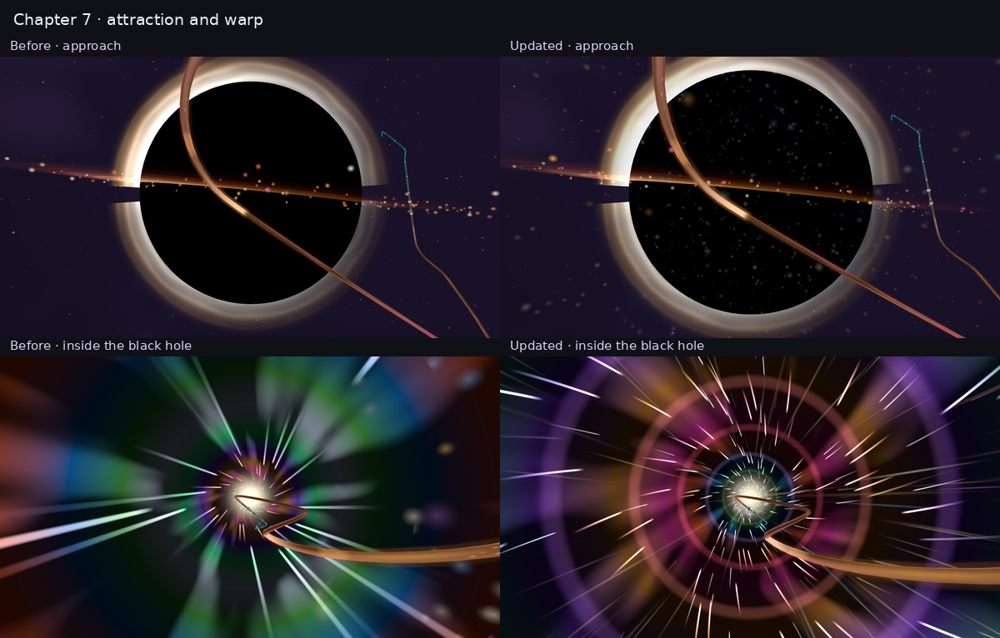

# Chapter 7 black-hole plunge and warp

Chapter 7 now builds through attraction, horizon crossing and an immersive tunnel. The camera briefly compresses its view, pulls forward and widens into the warp; fine radial streaks, concentric waves and streaming dust give the interior a consistent outward flow.

The black hole stays camera-locked so it remains visible on the rail hairpins. Navigation, level timing, Chapter 8 stage framing, the exit-mouth schedule and the Retrosun handoff are preserved. All fall camera contributions settle before the live Chapter 8 reveal window. Reduced motion disables the extra roll/pull and softens the FOV response.

The tunnel keeps one existing sphere material, two baked-lattice noise samples and one palette sample. Added detail uses analytic rings and sparse hash-based streaks. Dust uses the existing instanced drawable and quality budgets. Fixed time rates avoid multiplying absolute elapsed time by changing warp strength, and wrapped dust phases are fully feathered during the plunge.

## Verification

- **80 final screenshots passed**: WebGPU and WebGL2, 1280×720 High and 390×844 Low, ten chapter positions at animation times 8 and 8.08 seconds. No console, shader, validation or device errors. Source fingerprints stayed unchanged throughout the matrix; details in [validation.json](validation.json).
- **59 focused tests passed** across the fall schedule, live camera/pulse handoff, forward/reverse navigation, scene fog, Chapter 8 environment and seam continuity.
- **Production build and boot closure passed.**
- **Lint ratchet passed** against existing repository debt; changed JavaScript files have no lint errors. `git diff --check` passed.



[Watch the warp motion preview](warp-preview.mp4). This is 24 deterministic frames at fixed chapter progress 0.56, animation time 8–9.2 seconds, encoded at 960×540; it shows the outward flow and does not measure game frame rate. Four additional captures at elapsed time 300/300.08 seconds also passed with no errors or source changes.

The comparison uses the original main scene in WebGL2 and the updated scene in WebGPU at matching path positions/time. Different random particle seeds and the authored camera changes are expected; it is an artwork comparison, not a pixel-equality test.

The isolated `ch7-fall` playground mounts the shipping chapter environment, rail, camera controller and director. It excludes the game’s post lens/bloom, UI and other chapters. Software rendering verifies the shaders and composition; it does not establish physical GPU/phone performance. In this container WebGPU renders to a GPU render target and is read back, because native WebGPU canvas presentation is unavailable. The WebGL2 lane uses native canvas presentation.

## Reproduce

```sh
PLAYWRIGHT_MODULE=/absolute/path/to/playwright/index.mjs \
PLAYWRIGHT_EXECUTABLE_PATH=/absolute/path/to/chromium \
node scripts/capture-odyssey-blackhole.mjs \
  --out artifacts/odyssey-blackhole --offscreenWebGPU \
  --falls 0,.12,.24,.34,.44,.56,.7,.81,.9,.99 --phases 8,8.08
```

Open `/playground.html?effect=ch7-fall&orbit=0&fallT=.56&t=8` to inspect the warp. Use `window.__CH7_FALL__.setFallT(localProgress)` and `window.__PLAYGROUND__.seek(seconds)` for deterministic scrubbing. Add `forceWebGL=1&tier=Low` to inspect the fallback lane.
