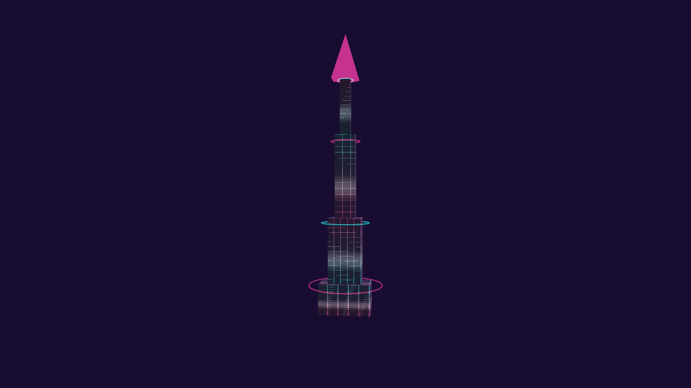
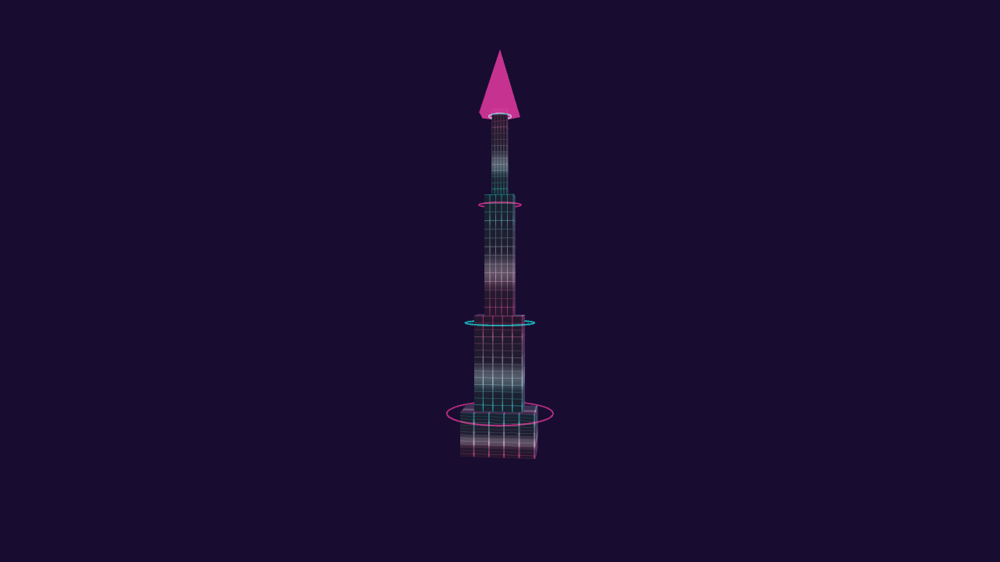
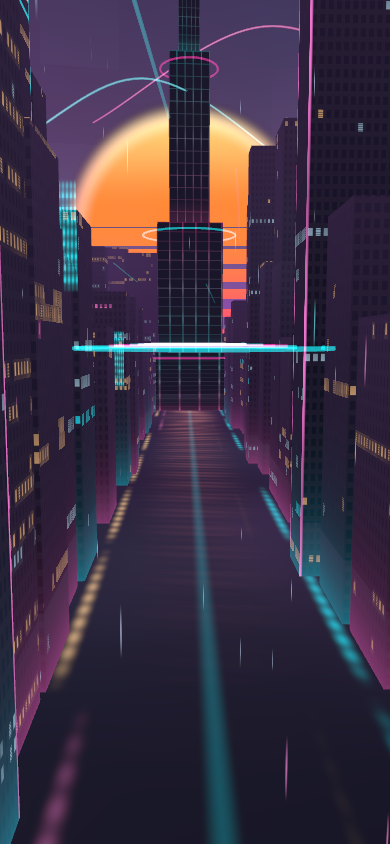

# Odyssey center tower stability

The final chapter's center spire used unfiltered procedural seams and hard horizontal
rib cutoffs. Narrow lines disappeared or became disconnected as the camera moved,
especially on the upper tiers. The previous city-window fix did not cover this material.

The conduit shader now integrates repeating strips over each pixel's footprint,
including repeat boundaries. Subpixel periods blend to their average light. Combining
the filtered strips as coverage keeps the distant grid's glow. Tower geometry, colors,
camera behavior, chapter opacity, energy pulses and ignition timing are unchanged.

## Visual evidence

Same isolated camera and animation phase, rendered with WebGL2:

| Before | After |
| --- | --- |
|  |  |

The production chapter camera at a phone-sized viewport:



## Validation

- 39 focused tests passed: urban layout/environment, chapter anchors, TSL graph
  construction, function bindings, and the existing sharpening pipeline.
- Production build and boot closure passed.
- Lint ratchet passed at the existing 1,220-error baseline; changed source files lint cleanly.
- Software WebGPU and WebGL2 captures passed for desktop, portrait/distant views,
  50% crossfade, production chapter camera, nearby camera phases, and full ignition.
  No shader, page, or device errors occurred in the passing runs.

WebGPU was rendered to a multisampled GPU target and read back for screenshots because
this container cannot present a native WebGPU canvas. These checks verify the shipping
shader and chapter geometry; they do not establish physical-device performance or test
the full journey/post-processing presentation. See [validation.json](validation.json).

## Repeat

With Playwright/Chromium installed (or `PLAYWRIGHT_MODULE` and
`PLAYWRIGHT_EXECUTABLE_PATH` set):

```sh
node scripts/capture-odyssey-spire.mjs --offscreenWebGPU --out artifacts/odyssey-spire
node scripts/capture-odyssey-spire.mjs --offscreenWebGPU --effect ch8-city-facades --cityT .5 --phases 8 --out artifacts/odyssey-city
node scripts/capture-odyssey-spire.mjs --offscreenWebGPU --profile desktop --reveal 1 --phases 8 --out artifacts/odyssey-spire-ignition
```

Omit `--offscreenWebGPU` to exercise native canvas presentation on a supported machine.
