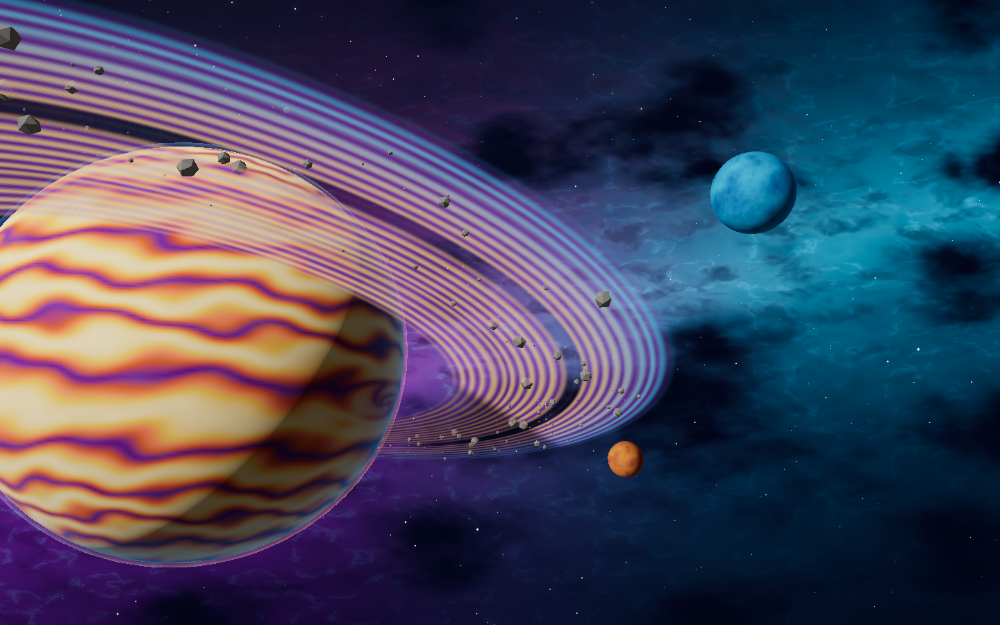
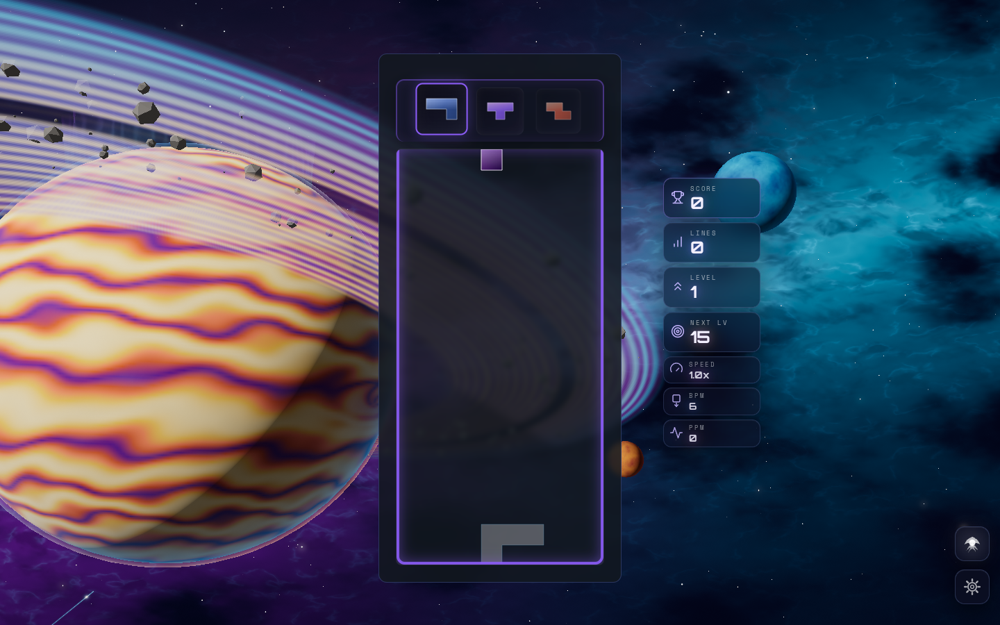

# Stellar Drift color refinement

The orbital scene now has stronger color separation throughout:

- Gas giant: coral, copper and honey-gold cloud belts with violet bands and a wine-colored storm.
- Outer moon: icy azure; inner moon: warm copper. Both retain the shared material and crater detail.
- Rings: golden inner bands, lavender shadows and cyan outer ice.
- Nebula: deeper violet, saturated blue/teal filaments and localized magenta clouds.
- Atmosphere and aurora: stronger blue/coral limb colors and turquoise/violet curtains.

The colors live in the scene materials and the baked cloud texture. Exposure,
global post saturation, geometry, quality budgets and event timing are preserved.
Low/Minimal direct rendering receives the same palette. Per-object moon palette
references distinguish the two bodies without adding a material or texture.





## Verification

The color pass was rendered first in the isolated `stellar-drift` playground,
then ported to the production atmosphere. Native WebGPU and node WebGL2 captures
cover High idle/combo and Low portrait direct rendering. Built-game captures
exercise the real desktop and phone boards and canonical gameplay callbacks.
See [validation.json](validation.json) for checks and console diagnostics, and
[color-comparison.json](color-comparison.json) for image measurements against
the preceding `7161370` palette.

The fixed planetary image region increased its mean HSV saturation from 0.121
to 0.497, with zero clipped-white pixels in that region. This is a same-camera,
same-time image measurement, not a performance or image-quality score.

The targeted 82 scene, director, lifecycle and device-loss tests passed, as did
typecheck, scoped lint and production build/boot closure. Captures use seed 187
and simulation time eight seconds. Renderer checks use software GPU backends;
physical GPU performance has not been measured.

Reproduce the scene with:

```text
/playground.html?effect=stellar-drift&orbit=0&t=8&seed=187&quality=High
/playground.html?effect=stellar-drift&orbit=0&t=8&seed=187&quality=High&forceWebGL=1&event=combo&combo=9&eventAge=1.8
/playground.html?effect=stellar-drift&orbit=0&t=8&seed=187&quality=Low&forceWebGL=1
```
