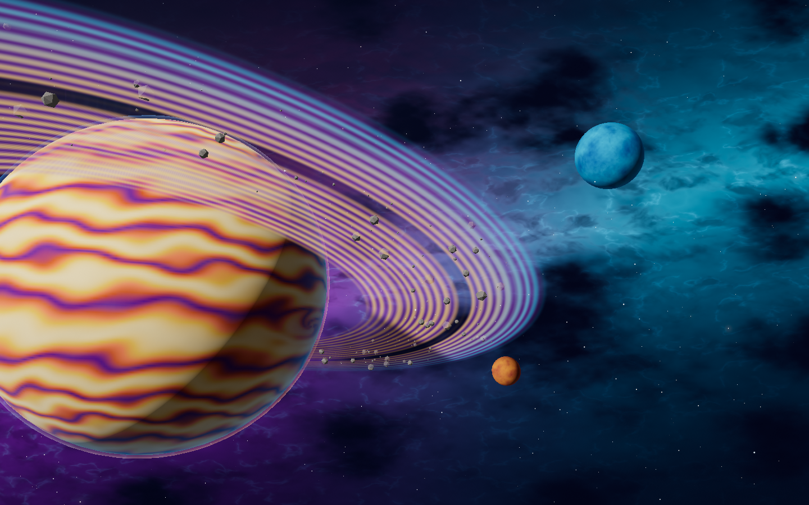
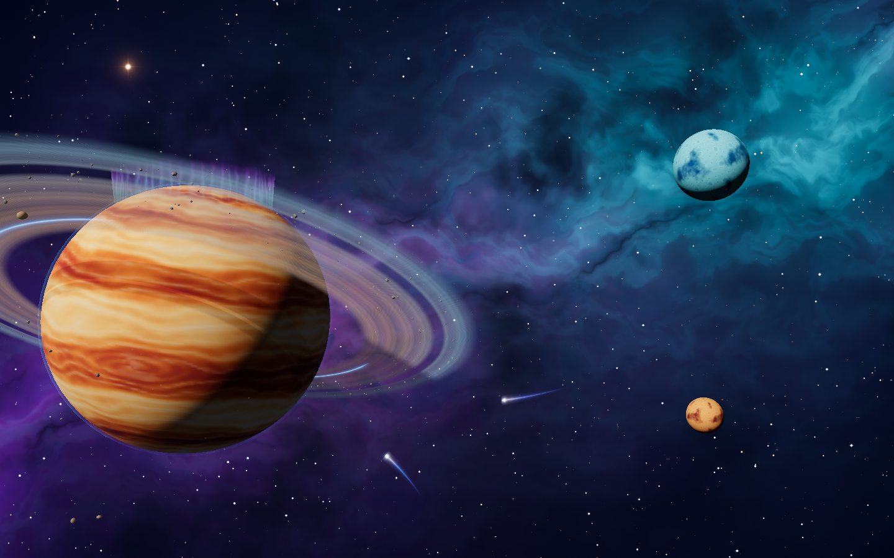
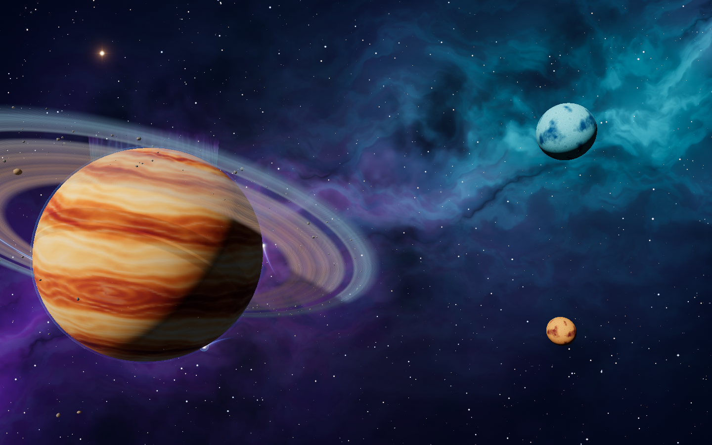
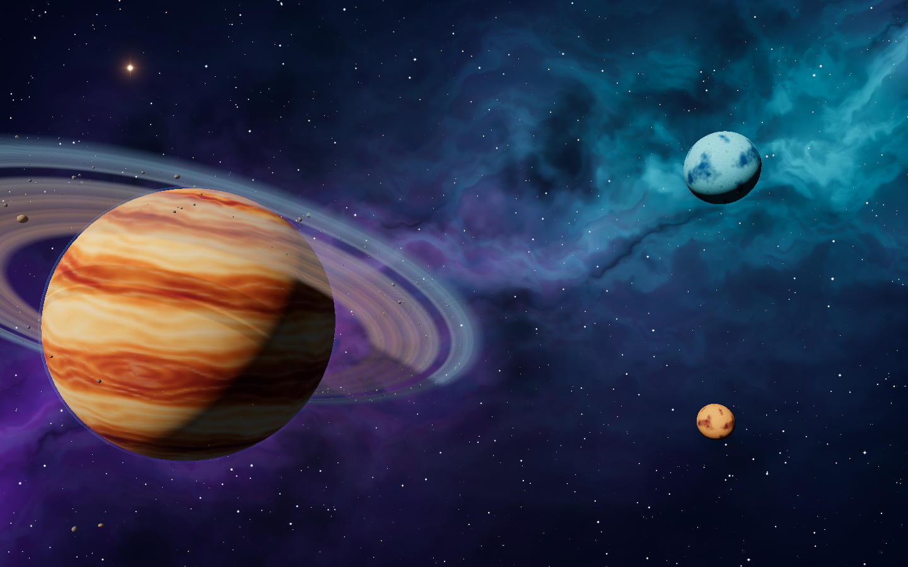
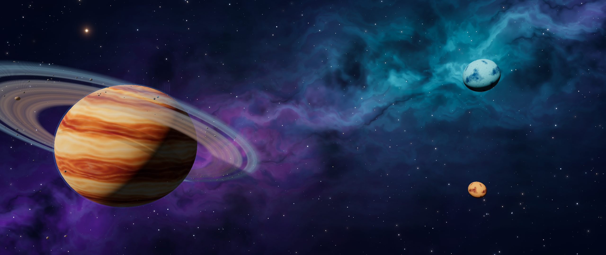
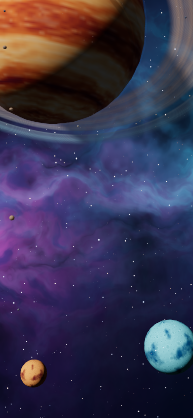
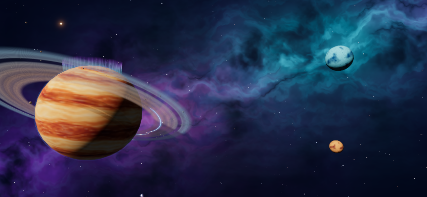
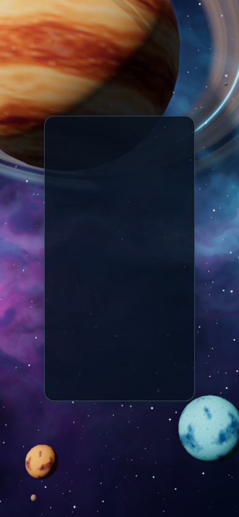
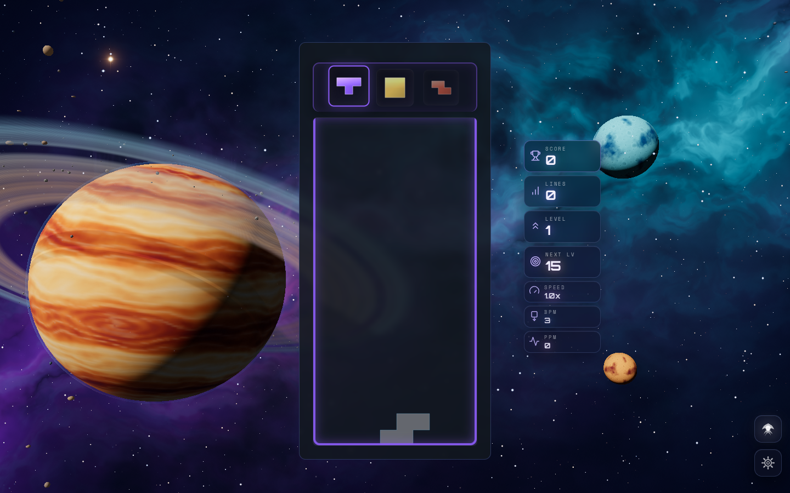
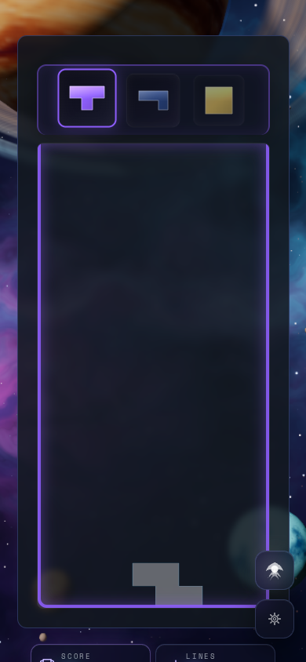

# Stellar Drift visual acceptance

The final scene passed 17 visual states with no console, shader or GPU errors. Native
WebGPU and node WebGL2 render the same scene. These software GPU captures establish
composition and correctness; they do not measure physical-device frame rates.

| Surface | Renderer | Viewport | Verified states |
| --- | --- | --- | --- |
| Playground, High | WebGPU | 1440 × 900 | Idle, combo launch, limb contact, center/corner pointer |
| Playground, High | WebGL2 | 1440 × 900 | Idle, combo |
| Playground, Low | WebGL2 | 390 × 844 | Idle, combo |
| Playground, High | WebGL2 | 2560 × 1080 | Idle, combo |
| Playground, Low | WebGL2 | 844 × 390 | Idle, combo |
| Production owner, High | WebGPU | 1440 × 900 | Idle, real event bus combo, pointer, stop/disposal |
| Production owner, Low | WebGL2 | 390 × 844 | Idle, real event bus combo, stop/disposal |
| Actual single-player game, High | WebGPU | 1440 × 900 | Running game and full canvas coverage |
| Actual single-player game, Low | WebGL2 | 390 × 844 | Running game and full canvas coverage |

All production stop checks report `active: false` and zero theme canvases. Pointer
movement changes camera position by 1.9677 world units after smoothing. Every viewport
has a canvas covering its full CSS width/height. Low renders directly; native High uses
the emission-aware MRT/bloom path.

All final state diagnostics are retained as JSON; a curated screenshot set is retained
below. `verification-summary.json` records the source hashes, test outcome and checks.

## Before and after

## Events and camera response

## Responsive composition and actual game

