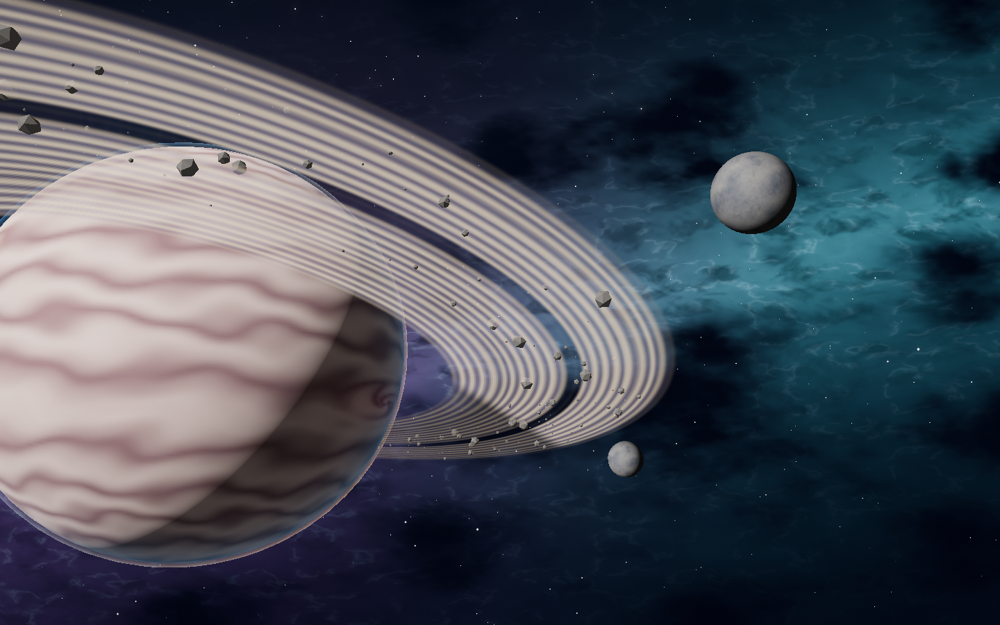
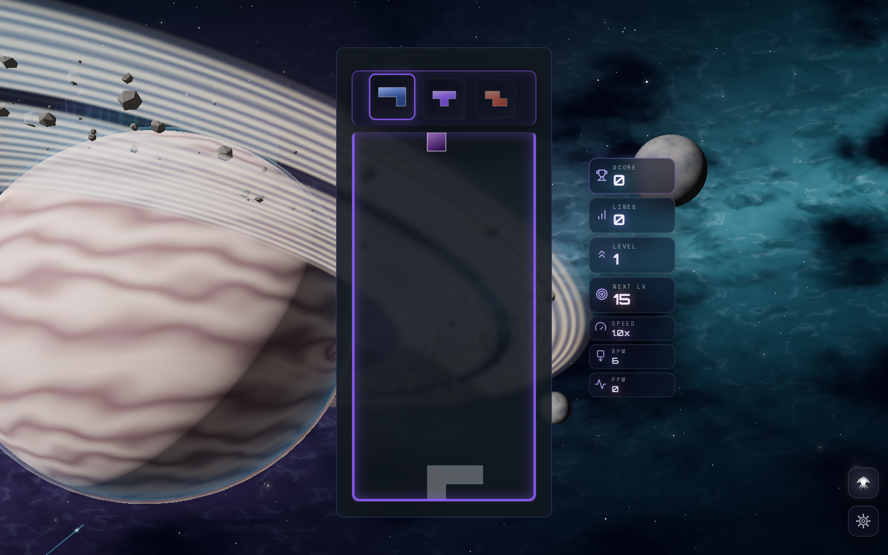

# Stellar Drift — a quiet orbital voyage

The subsequent [color refinement](../stellar-drift-color-pass/README.md) records
the current, more vibrant planetary and nebula palette.

Stellar Drift now presents a lit, banded gas giant with an oval storm,
fine concentric ice rings, drifting debris, atmospheric scattering,
polar aurora curtains, two distant moons, and layered teal/violet nebula clouds.
Cloud belts and seamless density textures are generated once in code.
Motion is analytic and advances in seconds on both renderer backends.

The same Three.js 0.186.1 node scene runs on native WebGPU and node WebGL2.
High tiers use restrained bloom and a gentle space grade; native WebGPU
selects explicit emission through MRT. Low and Minimal render directly,
preserving the planetary scene and reactions without blur or offscreen post targets.
The measured solo-board rectangle anchors the desktop planet beside the board;
portrait framing puts its horizon in the exposed upper margin.

## Gameplay reactions

| Trigger | Response |
| --- | --- |
| Piece lock | Local ring illumination, a dust sparkle and a brief limb shimmer |
| Line clear | A travelling ring arc; a four-line clear adds an opposing arc |
| Combo | Stronger auroral curtains and staggered comet approaches with brief rim contacts |

Comets approach from outside the planet and share camera-correct tangent
targets with their contact lights. Arc/comet slots stay attached to stable IDs,
with bounded pools for every quality tier. Delayed launches and contacts use
simulation time. Pausing freezes effects and rejects new gameplay events.
The scene keeps its orbital framing during combos.

The previous classic material/composer twin and parallel CPU/compute particle
state are retired. Native device loss still uses the renderer's existing
`onDeviceLost` callback; teardown removes the theme closure. Renderer
initialization, fallback, quality rebuilds, scene ownership and cleanup remain
guarded against stale activations.

## Actual renders

The before image comes from the shipping node WebGL2 path on main at
`1c5623bdddee4413631c82ec1ae2dafba983e7d4`. It is not the dormant classic renderer.
Deterministic captures use seed 187 and eight seconds of simulation.
PNG files retain fine star and ring detail; companion JSON records renderer,
event, console, GPU and lifecycle diagnostics.

| Capture | Surface |
| --- | --- |
| [Previous shipping scene](before-node-idle.png) | Node WebGL2, High |
| [New planetary atmosphere](native-idle.png) | Native WebGPU, High, selective MRT bloom |
| [Orbital combo reactions](native-combo.png) | Native WebGPU, combo 9 at age 1.8 seconds |
| [Desktop gameplay](production-desktop-combo.png) | Built game, node WebGL2, High, real 350 × 762 solo card |
| [Phone gameplay](production-portrait-combo.png) | Built game, node WebGL2, Low, 390 × 844 viewport, real 347 × 756 solo card |





## Reproduction

Run `npm run dev:playground` and open one effect at a time:

```text
/playground.html?effect=stellar-drift&orbit=0&t=8&seed=187&quality=High
/playground.html?effect=stellar-drift&orbit=0&t=8&seed=187&quality=High&forceWebGL=1&event=combo&combo=9&eventAge=1.8
/playground.html?effect=stellar-drift&orbit=0&t=8&seed=187&quality=Low&forceWebGL=1&board=1&event=tetris&eventAge=0.6
```

The playground imports the production atmosphere, director and post modules.
Seeking replays the event RNG; resizing a frozen frame refreshes its contact
basis. The board guide is a placement aid. Production captures verify the
actual card, HUD and canonical single-player event callbacks.

## Validation

- Full final suite: 526 files, 5,626 tests passed.
- Typecheck, production build and boot closure passed.
- New/changed theme and playground code passed scoped lint. The lint ratchet
  passed and its error ceiling was lowered from 1,220 to 1,170.
- Dependency boundaries, architecture fitness, theme lifecycle audit and the IP
  string gate passed. Retired shader/resize-listener fitness ceilings were lowered.
- Native High idle/clear/combo and Minimal portrait direct captures had zero
  console warnings/errors and zero uncaptured GPU validation errors.
- Production desktop High and portrait Low passed all 28 checks: real board,
  event routing, pause freeze, paused-event rejection, resume heartbeat,
  deferred quality rebuilds/restoration, double-stop/restart, and switching
  to Forest and back with exactly one live Stellar Drift canvas.
- Each production run recorded two expected BaseTheme restart notices during
  deliberate quality changes. Screenshots wait for the container fade to finish.
- The palette gate reports its existing failure in the unchanged Stillwater
  palette. Stellar Drift's unchanged palette passes.

Scene/director regressions cover all six tiers, resource identity under event
storms, exact once disposal, sparse slot IDs, finite uniforms, board framing,
30/60/144 Hz timing, stale initialization, native callback ownership, and
192 comet approach paths across angles, directions, seeds and aspect ratios.

Native rendering was tested on a software Vulkan adapter using offscreen GPU
readback. Browser WebGL2 captures use software rendering as well. These checks
establish rendering correctness and bounded ownership; physical GPU frame-rate
performance has not been measured. See [validation.json](validation.json).
